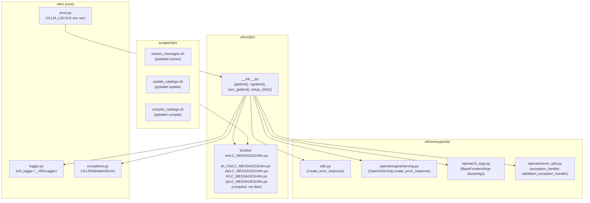
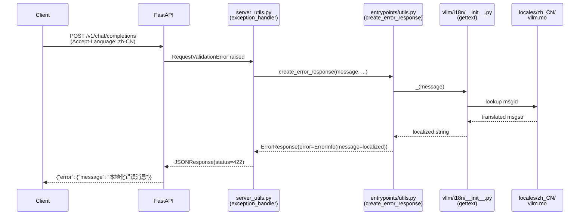
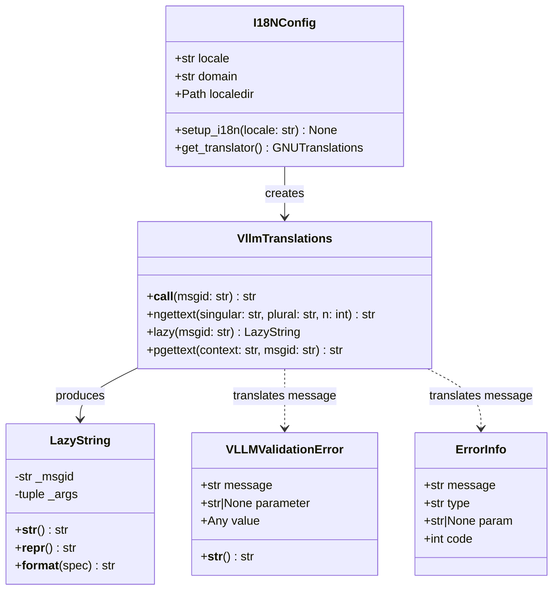
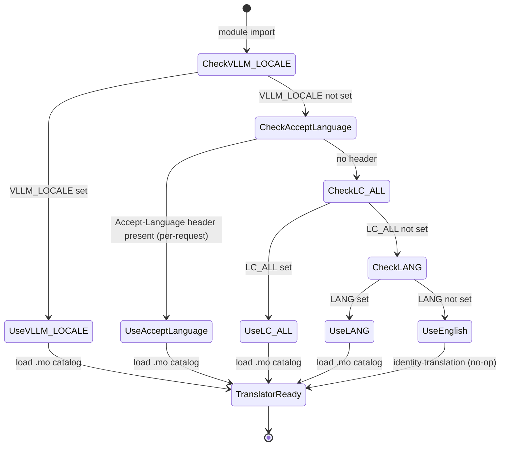

# Add I18N Support to vLLM

Add internationalization (I18N) support to the vLLM Python library and its OpenAI-compatible server. This covers translatable user-facing strings in log messages, error responses, CLI help text, and exception messages — using Python's standard `gettext`/`babel` toolchain with a `vllm/i18n/` module that integrates cleanly into the existing `init_logger` / `VLLMValidationError` / `create_error_response` patterns.

---

## Design & Architecture

### Overview

vLLM is a high-performance LLM inference engine with an OpenAI-compatible HTTP server (`vllm/entrypoints/openai/`), a CLI (`vllm/entrypoints/cli/`), and a rich set of internal modules. User-facing strings appear in three main categories:

1. **Log messages** — emitted via `init_logger` / `_VllmLogger` in `vllm/logger.py`
2. **Error responses** — constructed via `create_error_response` in `vllm/entrypoints/utils.py` and `OpenAIServing.create_error_response` in `vllm/entrypoints/openai/engine/serving.py`; surfaced through `VLLMValidationError` in `vllm/exceptions.py`
3. **CLI help text** — registered via `BaseFrontendArgs.add_cli_args` in `vllm/entrypoints/openai/cli_args.py` and `FlexibleArgumentParser` in `vllm/utils/argparse_utils.py`

The I18N layer introduces a thin `vllm/i18n/` package that:
- Wraps Python `gettext` with a `lazy_gettext` / `ngettext` API
- Ships `.pot` / `.po` / `.mo` message catalogs under `vllm/i18n/locales/`
- Exposes a single `_()` translation callable imported project-wide
- Detects locale from `VLLM_LOCALE` env var (falling back to `LC_ALL` / `LANG` / `en`)
- Integrates with `vllm/envs.py` for the env-var declaration
- Provides a `scripts/i18n/` tooling directory for `extract`, `update`, and `compile` workflows

The design deliberately avoids heavy third-party dependencies: `babel` is used only for message extraction (`pybabel`), while runtime translation uses the stdlib `gettext` module. This keeps the inference hot-path free of I18N overhead — translation objects are resolved lazily and cached.

### Diagram 1 — Architecture / Component Diagram



### Diagram 2 — Data Flow / Sequence Diagram



### Diagram 3 — Class / Data Model Diagram



### Diagram 4 — State Machine Diagram (locale resolution)



### Diagram 5 — Flowchart (message extraction & compilation workflow)

```mermaid
flowchart TD
    A[Developer wraps string\nwith _() or lazy_()] --> B[Run scripts/i18n/extract_messages.sh\npybabel extract -F babel.cfg]
    B --> C[vllm/i18n/locales/vllm.pot\nupdated]
    C --> D{New locale?}
    D -- Yes --> E[pybabel init -l LOCALE\ncreates locales/LOCALE/LC_MESSAGES/vllm.po]
    D -- No --> F[pybabel update\nmerges new msgids into existing .po]
    E --> G[Translator edits .po file]
    F --> G
    G --> H[Run scripts/i18n/compile_catalogs.sh\npybabel compile]
    H --> I[locales/LOCALE/LC_MESSAGES/vllm.mo\ncompiled binary catalog]
    I --> J[vllm/i18n/__init__.py loads .mo\nat import time via gettext.translation()]
```

### Directory Structure

```
vllm/
├── i18n/
│   ├── __init__.py          # VllmTranslations, LazyString, setup_i18n(), _(), ngettext()
│   ├── _lazy.py             # LazyString implementation
│   ├── _config.py           # I18NConfig dataclass, locale resolution logic
│   └── locales/
│       ├── vllm.pot         # Master template (auto-generated by pybabel extract)
│       ├── en/
│       │   └── LC_MESSAGES/
│       │       ├── vllm.po  # English base catalog (msgid == msgstr)
│       │       └── vllm.mo  # Compiled binary
│       ├── zh_CN/
│       │   └── LC_MESSAGES/
│       │       ├── vllm.po  # Simplified Chinese translations
│       │       └── vllm.mo
│       ├── de/
│       │   └── LC_MESSAGES/
│       │       ├── vllm.po  # German translations
│       │       └── vllm.mo
│       ├── fr/
│       │   └── LC_MESSAGES/
│       │       ├── vllm.po  # French translations
│       │       └── vllm.mo
│       └── ja/
│           └── LC_MESSAGES/
│               ├── vllm.po  # Japanese translations
│               └── vllm.mo
scripts/
└── i18n/
    ├── babel.cfg            # pybabel extraction config
    ├── extract_messages.sh  # pybabel extract → vllm.pot
    ├── update_catalogs.sh   # pybabel update all locales
    └── compile_catalogs.sh  # pybabel compile all .po → .mo
tests/
└── test_i18n/
    ├── __init__.py
    ├── test_i18n_core.py    # Unit tests for VllmTranslations, LazyString, I18NConfig
    ├── test_i18n_envs.py    # Tests for VLLM_LOCALE env var integration
    ├── test_i18n_errors.py  # Tests for localized error responses
    └── test_i18n_logger.py  # Tests for localized log messages
```

### Key Design Decisions

| Decision | Choice | Rationale |
|----------|--------|-----------|
| Translation runtime | stdlib `gettext` | Zero extra runtime dependency; already available in all Python environments |
| Message extraction | `babel` / `pybabel` | Industry standard for Python I18N; supports Jinja2, Python, and custom extractors |
| Locale detection order | `VLLM_LOCALE` → `Accept-Language` → `LC_ALL` → `LANG` → `en` | Gives operators (env var) priority over system locale; per-request override for multi-tenant servers |
| Lazy strings | Custom `LazyString` class | Allows `_()` to be called at module import time (e.g., in class-level docstrings and `argparse` help) without requiring the translator to be initialized yet |
| String wrapping scope | Log messages, error response messages, CLI help text, exception messages | Covers all user-visible output; internal debug strings and format strings are excluded to minimize noise |
| Initial locales | `en`, `zh_CN`, `de`, `fr`, `ja` | Covers the largest vLLM user communities; additional locales can be added by contributors |
| Per-request locale | Optional `Accept-Language` header parsing in `exception_handler` | Enables multi-tenant deployments to serve localized errors without restarting the server |
| `.mo` file shipping | Compiled `.mo` files committed to repo | Ensures translations work out-of-the-box without requiring `pybabel compile` at install time |

### Technology Stack

- **Runtime/Language:** Python 3.10+
- **Framework:** FastAPI (existing), stdlib `gettext`
- **Key Libraries:**
  - `babel` (dev/build dependency) — message extraction, catalog management, `.po`/`.mo` compilation
  - `gettext` (stdlib) — runtime translation lookup
- **External APIs/Services:** None

---

## Execution Plan

### Phase 1: I18N Core Module (`vllm/i18n/`)
**Estimated effort:** 3-4 hours
**Dependencies:** None

Create the `vllm/i18n/` package with the full translation infrastructure: locale resolution, lazy string support, and the public `_()` / `ngettext()` / `lazy_()` API.

#### Tasks:
- [ ] Create `vllm/i18n/_config.py`:
  - Define `I18NConfig` dataclass with fields: `locale: str`, `domain: str = "vllm"`, `localedir: Path`
  - Implement `resolve_locale() -> str` that reads `VLLM_LOCALE` env var, then `LC_ALL`, then `LANG`, defaulting to `"en"`
  - Implement `get_localedir() -> Path` returning `Path(__file__).parent / "locales"`
  - Implement `load_translator(locale: str, domain: str, localedir: Path) -> gettext.NullTranslations` using `gettext.translation()` with `fallback=True`
- [ ] Create `vllm/i18n/_lazy.py`:
  - Define `LazyString` class with `__init__(self, msgid: str, *args)`, `__str__`, `__repr__`, `__format__`, `__add__`, `__radd__`, `__mod__` — all delegating to `str(self)` which calls the current translator
  - Ensure `LazyString` is JSON-serializable by implementing `__str__` correctly
- [ ] Create `vllm/i18n/__init__.py`:
  - Define module-level `_translator: gettext.NullTranslations` initialized via `load_translator(resolve_locale(), ...)`
  - Expose `_(msgid: str) -> str` — calls `_translator.gettext(msgid)`
  - Expose `ngettext(singular: str, plural: str, n: int) -> str` — calls `_translator.ngettext(...)`
  - Expose `lazy_(msgid: str) -> LazyString` — returns `LazyString(msgid)`
  - Expose `pgettext(context: str, msgid: str) -> str` — calls `_translator.pgettext(context, msgid)` with fallback
  - Expose `setup_i18n(locale: str | None = None) -> None` — re-initializes `_translator` for the given locale (used in tests and per-process locale switching)
  - Expose `get_current_locale() -> str`

#### Deliverables:
- `vllm/i18n/__init__.py`
- `vllm/i18n/_config.py`
- `vllm/i18n/_lazy.py`

---

### Phase 2: Environment Variable Registration (`vllm/envs.py`)
**Estimated effort:** 1 hour
**Dependencies:** Phase 1

Register `VLLM_LOCALE` as an official vLLM environment variable in `vllm/envs.py`, following the existing pattern used for `VLLM_LOGGING_LEVEL`, `VLLM_LOGGING_COLOR`, etc.

#### Tasks:
- [ ] Open `vllm/envs.py` and locate the env-var declaration block (the large `environment_variables` dict or individual `@lru_cache` properties)
- [ ] Add `VLLM_LOCALE: str` declaration with:
  - Default value: `""` (empty string = auto-detect from system locale)
  - Description: `"Locale for vLLM user-facing messages (e.g. 'zh_CN', 'de', 'fr', 'ja'). Defaults to system locale or 'en'."`
  - Type: `str`
- [ ] Add `VLLM_I18N_ENABLED: bool` declaration with default `True` and description `"Enable I18N translation of user-facing messages."`
- [ ] Update `vllm/i18n/_config.py` to import `VLLM_LOCALE` and `VLLM_I18N_ENABLED` from `vllm.envs` instead of reading `os.environ` directly (avoids circular imports by using a lazy import inside `resolve_locale()`)

#### Deliverables:
- Modified `vllm/envs.py` with `VLLM_LOCALE` and `VLLM_I18N_ENABLED` entries

---

### Phase 3: Message Catalog Infrastructure
**Estimated effort:** 2-3 hours
**Dependencies:** Phase 1

Create the `babel.cfg` extraction config, the `.pot` master template, and initial `.po` catalog stubs for `en`, `zh_CN`, `de`, `fr`, and `ja`. Also create the `scripts/i18n/` tooling scripts.

#### Tasks:
- [ ] Create `scripts/i18n/babel.cfg` with extraction rules:
  ```ini
  [python: vllm/**.py]
  encoding = utf-8

  [ignore: vllm/i18n/**.py]
  ```
- [ ] Create `scripts/i18n/extract_messages.sh`:
  ```bash
  #!/usr/bin/env bash
  pybabel extract -F scripts/i18n/babel.cfg \
    -k "_ lazy_ ngettext:1,2 pgettext:1c,2" \
    -o vllm/i18n/locales/vllm.pot \
    --project=vLLM --version=$(python -c "from vllm.version import __version__; print(__version__)") \
    vllm/
  ```
- [ ] Create `scripts/i18n/update_catalogs.sh` that runs `pybabel update` for each locale directory under `vllm/i18n/locales/`
- [ ] Create `scripts/i18n/compile_catalogs.sh` that runs `pybabel compile -d vllm/i18n/locales/ -D vllm`
- [ ] Create `vllm/i18n/locales/vllm.pot` — initial master template with header metadata and a representative set of ~30 msgids extracted from key files:
  - Error messages from `vllm/entrypoints/utils.py` (`create_error_response` call sites)
  - Validation errors from `vllm/exceptions.py`
  - Key warning/info log messages from `vllm/entrypoints/openai/engine/serving.py`
  - CLI help strings from `vllm/entrypoints/openai/cli_args.py` (`BaseFrontendArgs` field docstrings)
- [ ] Create `vllm/i18n/locales/en/LC_MESSAGES/vllm.po` — English catalog (msgstr == msgid, identity)
- [ ] Create `vllm/i18n/locales/zh_CN/LC_MESSAGES/vllm.po` — Simplified Chinese translations for all msgids in the `.pot`
- [ ] Create `vllm/i18n/locales/de/LC_MESSAGES/vllm.po` — German translations
- [ ] Create `vllm/i18n/locales/fr/LC_MESSAGES/vllm.po` — French translations
- [ ] Create `vllm/i18n/locales/ja/LC_MESSAGES/vllm.po` — Japanese translations
- [ ] Compile all `.po` files to `.mo` using `pybabel compile` (or generate them programmatically in the phase)
- [ ] Add `babel` to `requirements/dev.txt` (or `pyproject.toml` optional dev dependencies)

#### Deliverables:
- `scripts/i18n/babel.cfg`
- `scripts/i18n/extract_messages.sh`
- `scripts/i18n/update_catalogs.sh`
- `scripts/i18n/compile_catalogs.sh`
- `vllm/i18n/locales/vllm.pot`
- `vllm/i18n/locales/{en,zh_CN,de,fr,ja}/LC_MESSAGES/vllm.po`
- `vllm/i18n/locales/{en,zh_CN,de,fr,ja}/LC_MESSAGES/vllm.mo`

---

### Phase 4: Wrap Error Response Messages
**Estimated effort:** 2-3 hours
**Dependencies:** Phase 1, Phase 2

Apply `_()` to all user-facing error message strings in the error-response pipeline: `vllm/entrypoints/utils.py`, `vllm/entrypoints/openai/engine/serving.py`, `vllm/exceptions.py`, and `vllm/entrypoints/openai/server_utils.py`.

#### Tasks:
- [ ] Edit `vllm/entrypoints/utils.py`:
  - Add `from vllm.i18n import _` at the top
  - Wrap the `message` argument in `create_error_response(message, ...)` with `_(message)` — since `message` is a string literal at each call site, wrap each literal directly: e.g., `create_error_response(_("unimplemented endpoint"), ...)`
  - Wrap the `sanitize_message` output if it surfaces user-visible text
- [ ] Edit `vllm/entrypoints/openai/engine/serving.py`:
  - Add `from vllm.i18n import _`
  - Wrap all string literals passed to `self.create_error_response(...)` and `self.create_streaming_error_response(...)` with `_()`
  - Key call sites (from grep): lines ~448, 457, 490, 502, 526, 559, 566, 572
- [ ] Edit `vllm/exceptions.py`:
  - Add `from vllm.i18n import lazy_` 
  - In `VLLMValidationError.__init__`, wrap `message` with `_(message)` so the stored message is already translated at raise time
- [ ] Edit `vllm/entrypoints/openai/server_utils.py`:
  - Add `from vllm.i18n import _`
  - Wrap the `"Unauthorized"` string in `AuthenticationMiddleware.__call__` with `_()`
  - Wrap any other user-visible error strings in `exception_handler` and `validation_exception_handler`
- [ ] Edit `vllm/entrypoints/openai/chat_completion/serving.py`:
  - Add `from vllm.i18n import _`
  - Wrap error message literals passed to `create_error_response` / `create_streaming_error_response`
- [ ] Edit `vllm/entrypoints/openai/completion/serving.py`:
  - Same pattern as chat_completion/serving.py

#### Deliverables:
- Modified `vllm/entrypoints/utils.py`
- Modified `vllm/entrypoints/openai/engine/serving.py`
- Modified `vllm/exceptions.py`
- Modified `vllm/entrypoints/openai/server_utils.py`
- Modified `vllm/entrypoints/openai/chat_completion/serving.py`
- Modified `vllm/entrypoints/openai/completion/serving.py`

---

### Phase 5: Wrap Log Messages
**Estimated effort:** 2-3 hours
**Dependencies:** Phase 1, Phase 2

Apply `_()` / `lazy_()` to key user-facing log messages in `vllm/logger.py` and the entrypoints layer. Focus on `INFO` and `WARNING` level messages that operators and end-users read; skip `DEBUG` messages.

#### Tasks:
- [ ] Edit `vllm/logger.py`:
  - Add `from vllm.i18n import _` (use a lazy import inside the function to avoid circular imports at module level)
  - Wrap the `logger.warning(...)` call in `enable_trace_function_call` with `_()`
  - Wrap the `logger.info(...)` call in `enable_trace_function_call` with `_()`
- [ ] Edit `vllm/entrypoints/openai/run_batch.py`:
  - Add `from vllm.i18n import _`
  - Wrap `logger.info(...)` and `logger.warning_once(...)` string literals with `_()`
  - Key lines (from grep): ~278, 383, 408, 413, 428, 430, 433, 669, 768, 832, 833, 838, 841
- [ ] Edit `vllm/entrypoints/openai/server_utils.py`:
  - Wrap `logger.warning(...)` and `logger.info(...)` string literals with `_()`
  - Key lines: ~120, 271, 277, 284, 291
- [ ] Edit `vllm/entrypoints/openai/api_server.py`:
  - Add `from vllm.i18n import _`
  - Wrap `logger.warning(...)` and `logger.info(...)` string literals with `_()`
  - Key lines: ~84 (`"Setup forkserver with pre-imports"`), ~88 (`"Forkserver setup complete!"`)
- [ ] Edit `vllm/entrypoints/utils.py`:
  - Wrap `logger.debug(...)` strings that are user-visible (e.g., `"Setting VLLM_WORKER_MULTIPROC_METHOD to 'spawn'"`)

#### Deliverables:
- Modified `vllm/logger.py`
- Modified `vllm/entrypoints/openai/run_batch.py`
- Modified `vllm/entrypoints/openai/server_utils.py`
- Modified `vllm/entrypoints/openai/api_server.py`
- Modified `vllm/entrypoints/utils.py`

---

### Phase 6: CLI Help Text I18N
**Estimated effort:** 2 hours
**Dependencies:** Phase 1, Phase 2

Wrap CLI argument help strings in `vllm/entrypoints/openai/cli_args.py` and `vllm/entrypoints/cli/` using `lazy_()` so that help text is translated when `--help` is printed.

#### Tasks:
- [ ] Edit `vllm/entrypoints/openai/cli_args.py`:
  - Add `from vllm.i18n import lazy_ as _`
  - Wrap the docstring-derived help text in `BaseFrontendArgs` field definitions with `lazy_()` — since `@config` uses field docstrings as help text, add a `_customize_cli_kwargs` override that wraps each `help` value: `frontend_kwargs[key]["help"] = lazy_(frontend_kwargs[key]["help"])`
  - Wrap the `VLLM_SUBCMD_PARSER_EPILOG` template string in `vllm/entrypoints/utils.py` with `lazy_()`
- [ ] Edit `vllm/entrypoints/cli/serve.py`:
  - Add `from vllm.i18n import lazy_ as _`
  - Wrap any `help=` string literals in `add_argument(...)` calls with `lazy_()`
- [ ] Edit `vllm/entrypoints/cli/main.py`:
  - Wrap any user-visible string literals with `lazy_()`
- [ ] Edit `vllm/entrypoints/cli/openai.py`:
  - Wrap `help=` strings and error messages with `lazy_()`

#### Deliverables:
- Modified `vllm/entrypoints/openai/cli_args.py`
- Modified `vllm/entrypoints/cli/serve.py`
- Modified `vllm/entrypoints/cli/main.py`
- Modified `vllm/entrypoints/cli/openai.py`

---

### Phase 7: Per-Request Locale Support (Accept-Language Header)
**Estimated effort:** 2-3 hours
**Dependencies:** Phase 1, Phase 4

Add optional per-request locale switching so that multi-tenant deployments can serve localized error responses based on the client's `Accept-Language` HTTP header.

#### Tasks:
- [ ] Create `vllm/i18n/_request_locale.py`:
  - Implement `parse_accept_language(header: str) -> str` — parses `Accept-Language: zh-CN,zh;q=0.9,en;q=0.8` and returns the best-matching locale from available catalogs
  - Implement `get_available_locales() -> list[str]` — scans `vllm/i18n/locales/` for compiled `.mo` files
  - Implement `normalize_locale(locale: str) -> str` — normalizes `zh-CN` → `zh_CN`, `en-US` → `en`, etc.
- [ ] Add `I18NMiddleware` ASGI middleware class to `vllm/i18n/_request_locale.py`:
  - Reads `Accept-Language` header from each request
  - Calls `setup_i18n(locale)` in a `contextvars.ContextVar` scope (thread-safe per-request locale)
  - Falls back to the process-level locale if header is absent or locale is unavailable
- [ ] Update `vllm/i18n/__init__.py`:
  - Change `_translator` to use `contextvars.ContextVar` so per-request locale overrides don't bleed across requests
  - Export `I18NMiddleware` from `vllm.i18n`
- [ ] Edit `vllm/entrypoints/openai/api_server.py` in `build_app()`:
  - Add `app.add_middleware(I18NMiddleware)` when `VLLM_I18N_ENABLED` is `True`
  - Import `I18NMiddleware` from `vllm.i18n`

#### Deliverables:
- `vllm/i18n/_request_locale.py`
- Modified `vllm/i18n/__init__.py` (ContextVar-based translator)
- Modified `vllm/entrypoints/openai/api_server.py`

---

### Phase 8: Testing & Quality Assurance
**Estimated effort:** 3-4 hours
**Dependencies:** Phase 1, Phase 2, Phase 3, Phase 4, Phase 5, Phase 6, Phase 7

Write comprehensive unit and integration tests for all I18N components.

#### Tasks:
- [ ] Create `tests/test_i18n/__init__.py` (empty)
- [ ] Create `tests/test_i18n/test_i18n_core.py`:
  - Test `resolve_locale()` with `VLLM_LOCALE` set, unset, and with `LC_ALL` fallback
  - Test `setup_i18n("zh_CN")` switches the active translator
  - Test `_("some message")` returns the English string when locale is `en`
  - Test `_("some message")` returns the translated string when locale is `zh_CN` (using a known msgid from the catalog)
  - Test `lazy_("some message")` returns a `LazyString` that evaluates correctly
  - Test `LazyString.__str__` calls the current translator
  - Test `LazyString` is JSON-serializable via `json.dumps({"msg": lazy_("test")})`
  - Test `ngettext("1 item", "{n} items", 1)` and `ngettext("1 item", "{n} items", 5)`
  - Test `get_available_locales()` returns at least `["en", "zh_CN", "de", "fr", "ja"]`
- [ ] Create `tests/test_i18n/test_i18n_envs.py`:
  - Test that `VLLM_LOCALE` is declared in `vllm.envs` with correct type and default
  - Test that `VLLM_I18N_ENABLED` is declared in `vllm.envs`
  - Test that setting `VLLM_LOCALE=de` before import causes German translations to load
- [ ] Create `tests/test_i18n/test_i18n_errors.py`:
  - Test `create_error_response("unimplemented endpoint", ...)` returns a translated message when locale is `zh_CN`
  - Test `VLLMValidationError("invalid parameter")` stores a translated message
  - Test `exception_handler` in `server_utils.py` returns localized JSON when `Accept-Language: zh-CN` is set
  - Use `pytest` fixtures to mock `setup_i18n("zh_CN")` and restore after test
- [ ] Create `tests/test_i18n/test_i18n_logger.py`:
  - Test that `logger.info(_("some message"))` emits the translated string
  - Test that `logger.warning(_("some warning"))` emits the translated string
  - Use `caplog` pytest fixture to capture log output
- [ ] Run `python -m pytest tests/test_i18n/ -v` and verify all tests pass
- [ ] Run `python -m py_compile vllm/i18n/__init__.py vllm/i18n/_config.py vllm/i18n/_lazy.py vllm/i18n/_request_locale.py` to verify syntax

#### Deliverables:
- `tests/test_i18n/__init__.py`
- `tests/test_i18n/test_i18n_core.py`
- `tests/test_i18n/test_i18n_envs.py`
- `tests/test_i18n/test_i18n_errors.py`
- `tests/test_i18n/test_i18n_logger.py`

---

## Verification Criteria

### How to verify I18N support works end-to-end:

**1. Unit test suite (no GPU required):**
```bash
cd /Users/pradeepsharma/sasva/vllm
python -m pytest tests/test_i18n/ -v --tb=short
# Expected: all tests pass (0 failures)
```

**2. Locale resolution smoke test:**
```bash
VLLM_LOCALE=zh_CN python -c "
from vllm.i18n import _, get_current_locale
print('Locale:', get_current_locale())
print('Test:', _('unimplemented endpoint'))
# Expected: Locale: zh_CN
# Expected: Test: <Chinese translation of 'unimplemented endpoint'>
"
```

**3. English fallback (default behavior — no regression):**
```bash
python -c "
from vllm.i18n import _, get_current_locale
print('Locale:', get_current_locale())
print('Test:', _('unimplemented endpoint'))
# Expected: Locale: en (or system locale)
# Expected: Test: unimplemented endpoint  (identity, no change)
"
```

**4. LazyString JSON serialization:**
```bash
python -c "
import json
from vllm.i18n import lazy_
msg = lazy_('unimplemented endpoint')
print(json.dumps({'error': str(msg)}))
# Expected: valid JSON with the translated string
"
```

**5. Catalog compilation check:**
```bash
python -c "
import gettext, pathlib
for locale in ['en', 'zh_CN', 'de', 'fr', 'ja']:
    t = gettext.translation('vllm', localedir='vllm/i18n/locales', languages=[locale], fallback=True)
    print(f'{locale}: OK')
# Expected: all 5 locales print OK
"
```

**6. Existing test suite regression check:**
```bash
python -m pytest tests/test_logger.py tests/test_envs.py tests/entrypoints/test_utils.py -v
# Expected: all existing tests continue to pass (zero regressions)
```

**7. Per-request locale via Accept-Language (requires running server):**
```bash
# Start server (mock model)
# curl with Accept-Language header
curl -s -X POST http://localhost:8000/v1/chat/completions \
  -H "Content-Type: application/json" \
  -H "Accept-Language: zh-CN" \
  -d '{"model": "nonexistent", "messages": []}' | python -m json.tool
# Expected: error message in Chinese
```
