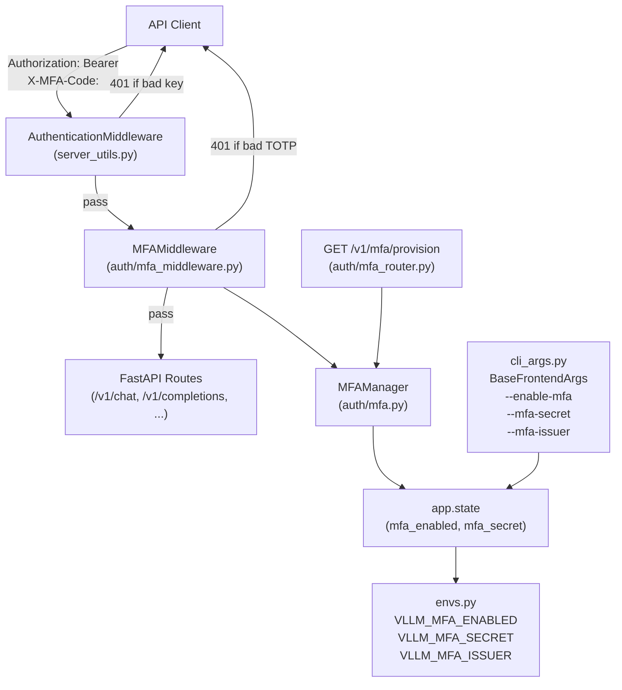
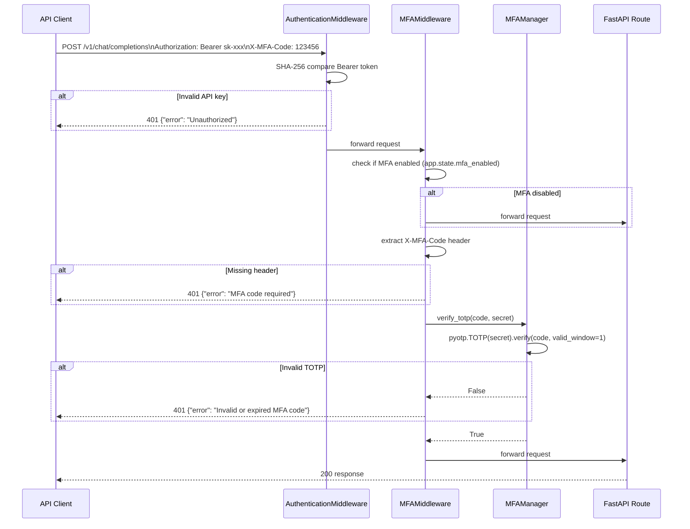
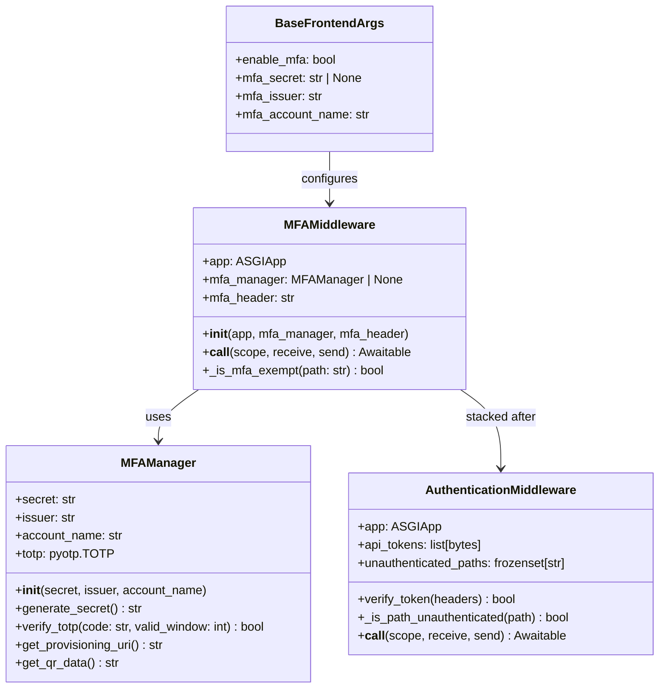
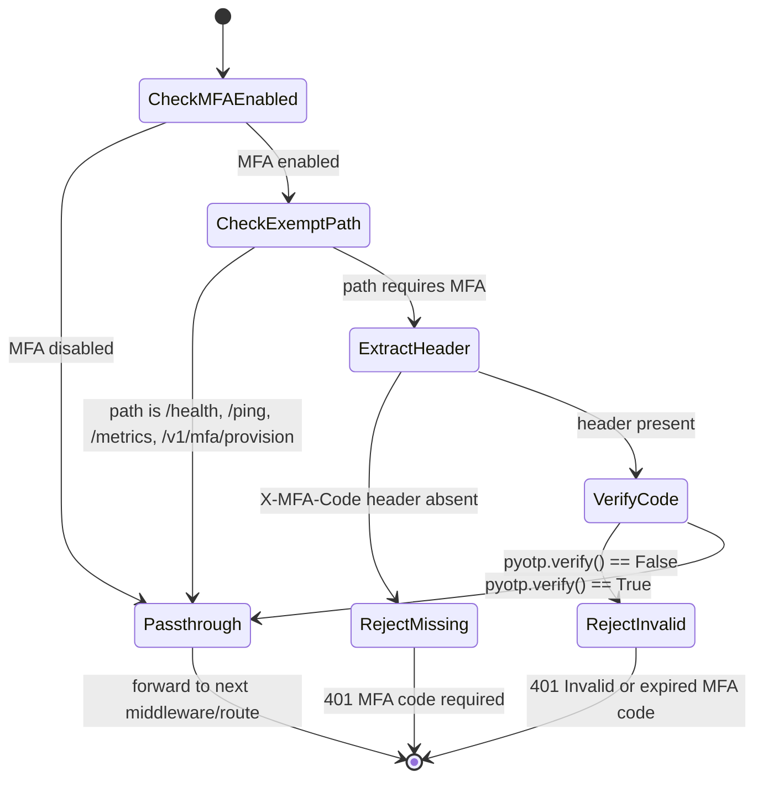

# Add MFA Support to vLLM OpenAI API Server

This plan adds Multi-Factor Authentication (MFA/TOTP) support to the vLLM OpenAI-compatible API server. The existing authentication layer (`AuthenticationMiddleware` in `vllm/entrypoints/openai/server_utils.py`) uses static Bearer API keys; MFA extends this with time-based one-time passwords (TOTP, RFC 6238) so that operators can require both a static API key **and** a rotating TOTP code before a request is accepted.

---

## Design & Architecture

### Overview

The vLLM server exposes an OpenAI-compatible REST API via FastAPI. Authentication today is handled by `AuthenticationMiddleware` (a pure-ASGI middleware class in `vllm/entrypoints/openai/server_utils.py`). It checks for a `Bearer <token>` header and compares it in constant time against SHA-256 hashes of the configured API keys (`--api-key` CLI flag or `VLLM_API_KEY` env var).

MFA support will be layered on top of this existing mechanism. A new `MFAMiddleware` class (also pure-ASGI) will be inserted **after** `AuthenticationMiddleware` in the middleware stack. When MFA is enabled (via `--enable-mfa` CLI flag or `VLLM_MFA_ENABLED` env var), every authenticated request must also carry a valid TOTP code in the `X-MFA-Code` header. The TOTP secret is provisioned at server startup and stored in `app.state`; the server logs a `otpauth://` URI and a QR-code-friendly string so operators can enroll an authenticator app.

A new module `vllm/auth/mfa.py` encapsulates all TOTP logic (secret generation, code verification, provisioning URI construction) using the `pyotp` library. CLI arguments and environment variable bindings are added to `BaseFrontendArgs` / `FrontendArgs` in `cli_args.py` and `envs.py` respectively. The `build_app()` function in `api_server.py` wires the new middleware in. A dedicated endpoint `GET /v1/mfa/provision` (protected by the existing API key check) returns the provisioning URI for initial setup.

### Diagram 1 — Component Architecture



### Diagram 2 — Request Authentication Sequence



### Diagram 3 — Class / Data Model



### Diagram 4 — State Machine: MFA Verification Flow



### Directory Structure

```
vllm/
├── auth/
│   ├── __init__.py                  # exports MFAManager, MFAMiddleware
│   ├── mfa.py                       # MFAManager: TOTP logic (pyotp wrapper)
│   ├── mfa_middleware.py            # MFAMiddleware: pure-ASGI middleware
│   └── mfa_router.py                # FastAPI router: GET /v1/mfa/provision
├── entrypoints/
│   ├── openai/
│   │   ├── api_server.py            # MODIFIED: wire MFAMiddleware + mfa_router
│   │   ├── cli_args.py              # MODIFIED: add --enable-mfa, --mfa-secret, --mfa-issuer
│   │   └── server_utils.py          # MODIFIED: AuthenticationMiddleware exempt /v1/mfa/provision
│   └── utils.py                     # unchanged
├── envs.py                          # MODIFIED: VLLM_MFA_ENABLED, VLLM_MFA_SECRET, VLLM_MFA_ISSUER
└── utils/
    └── security_utils.py            # unchanged

tests_security/
└── test_mfa.py                      # NEW: standalone MFA unit tests (no torch)

tests/entrypoints/openai/
└── test_mfa_middleware.py           # NEW: integration tests for MFA middleware
```

### Key Design Decisions

| Decision | Choice | Rationale |
|----------|--------|-----------|
| TOTP library | `pyotp` | RFC 6238 compliant, widely used, minimal deps, no C extensions |
| MFA header name | `X-MFA-Code` | Custom header avoids collision with standard `Authorization`; easy to add to CORS `allowed_headers` |
| Middleware ordering | `AuthenticationMiddleware` first, then `MFAMiddleware` | API key must pass before TOTP is checked; avoids TOTP oracle attacks |
| Secret storage | Env var `VLLM_MFA_SECRET` or `--mfa-secret` CLI flag | Consistent with existing `VLLM_API_KEY` pattern; never logged |
| Auto-generate secret | Yes, if not provided and MFA enabled | Operator convenience; printed once at startup as `otpauth://` URI |
| TOTP window | `valid_window=1` (±30 s) | Tolerates minor clock skew without weakening security significantly |
| Exempt paths | `/health`, `/ping`, `/metrics`, `/v1/mfa/provision` | Health checks must not require MFA; provision endpoint needs API key only |
| Provisioning endpoint | `GET /v1/mfa/provision` | Allows programmatic retrieval of the `otpauth://` URI after server start |
| QR code | Base64 PNG via `qrcode` library (optional dep) | Operator convenience; gracefully degrades if `qrcode` not installed |

### Technology Stack

- **Runtime/Language:** Python 3.10+
- **Framework:** FastAPI + Starlette (ASGI)
- **Key Libraries:**
  - `pyotp` ≥ 2.9 — TOTP generation and verification (RFC 6238)
  - `qrcode[pil]` ≥ 7.4 — optional QR code generation for provisioning URI
  - `fastapi` — existing framework (no version change)
  - `starlette` — existing ASGI primitives (`ASGIApp`, `Scope`, `Receive`, `Send`)
- **External APIs/Services:** None (all logic is local)

---

## Execution Plan

### Phase 1: MFA Core Library (`vllm/auth/mfa.py`)
**Estimated effort:** 1-2 hours
**Dependencies:** None

Implement the `MFAManager` class that wraps `pyotp` and provides all TOTP operations. This is pure Python with no FastAPI or vLLM dependencies, making it independently testable.

#### Tasks:
- [ ] Create `vllm/auth/__init__.py` exporting `MFAManager` and `MFAMiddleware`
- [ ] Create `vllm/auth/mfa.py` with `MFAManager` class:
  - [ ] `__init__(self, secret: str | None, issuer: str = "vLLM", account_name: str = "vllm-api")` — if `secret` is `None`, call `generate_secret()`
  - [ ] `generate_secret() -> str` — calls `pyotp.random_base32()`, returns 32-char base32 string
  - [ ] `verify_totp(self, code: str, valid_window: int = 1) -> bool` — calls `self.totp.verify(code, valid_window=valid_window)` with constant-time semantics; returns `False` for non-digit or wrong-length codes without raising
  - [ ] `get_provisioning_uri(self) -> str` — returns `pyotp.totp.TOTP.provisioning_uri(name=self.account_name, issuer_name=self.issuer)`
  - [ ] `get_qr_data(self) -> str | None` — generates base64-encoded PNG QR code if `qrcode` is installed; returns `None` otherwise with a log warning
  - [ ] Add module-level `logger = init_logger(__name__)` using `vllm.logger.init_logger`
- [ ] Add `pyotp>=2.9.0` to `requirements/common.txt` (or the appropriate requirements file)
- [ ] Add `qrcode[pil]>=7.4` as an optional dependency comment in `requirements/common.txt`

#### Deliverables:
- `vllm/auth/__init__.py`
- `vllm/auth/mfa.py` with fully implemented `MFAManager`
- Updated `requirements/common.txt` with `pyotp` dependency

### Phase 2: MFA ASGI Middleware (`vllm/auth/mfa_middleware.py`)
**Estimated effort:** 1-2 hours
**Dependencies:** Phase 1

Implement `MFAMiddleware` as a pure-ASGI class following the exact same pattern as `AuthenticationMiddleware` in `vllm/entrypoints/openai/server_utils.py`.

#### Tasks:
- [ ] Create `vllm/auth/mfa_middleware.py` with `MFAMiddleware` class:
  - [ ] `__init__(self, app: ASGIApp, mfa_manager: MFAManager, mfa_header: str = "X-MFA-Code", unauthenticated_paths: frozenset[str] | None = None)` — default exempt paths: `frozenset({"/health", "/ping", "/metrics", "/v1/mfa/provision"})`
  - [ ] `_is_mfa_exempt(self, url_path: str) -> bool` — same prefix-matching logic as `AuthenticationMiddleware._is_path_unauthenticated()`
  - [ ] `__call__(self, scope: Scope, receive: Receive, send: Send) -> Awaitable[None]`:
    - Skip non-http/websocket scopes and OPTIONS requests
    - Skip exempt paths
    - Extract `X-MFA-Code` header from `Headers(scope=scope)`
    - If header missing: return `JSONResponse({"error": "MFA code required"}, status_code=401)`
    - Call `self.mfa_manager.verify_totp(code)` — if `False`: return `JSONResponse({"error": "Invalid or expired MFA code"}, status_code=401)`
    - Otherwise: `return self.app(scope, receive, send)`
  - [ ] Import `Awaitable`, `ASGIApp`, `Scope`, `Receive`, `Send` from `starlette.types`
  - [ ] Import `Headers` from `starlette.datastructures`
  - [ ] Import `JSONResponse` from `fastapi.responses`
  - [ ] Add `logger = init_logger(__name__)` and log at DEBUG level on each verification attempt (without logging the code value itself)
- [ ] Update `vllm/auth/__init__.py` to export `MFAMiddleware`

#### Deliverables:
- `vllm/auth/mfa_middleware.py` with fully implemented `MFAMiddleware`
- Updated `vllm/auth/__init__.py`

### Phase 3: MFA Provisioning Endpoint (`vllm/auth/mfa_router.py`)
**Estimated effort:** 1 hour
**Dependencies:** Phase 1

Create a FastAPI router that exposes `GET /v1/mfa/provision` so operators can retrieve the `otpauth://` URI and optional QR code data after server startup. This endpoint is protected by the existing `AuthenticationMiddleware` (API key required) but is exempt from `MFAMiddleware` (no TOTP needed to provision).

#### Tasks:
- [ ] Create `vllm/auth/mfa_router.py`:
  - [ ] Define `router = APIRouter(prefix="/v1/mfa", tags=["mfa"])`
  - [ ] Define Pydantic response model `MFAProvisionResponse(BaseModel)` with fields:
    - `provisioning_uri: str`
    - `secret: str`
    - `issuer: str`
    - `account_name: str`
    - `qr_code_base64: str | None`
  - [ ] Implement `GET /provision` handler `get_mfa_provision(request: Request) -> MFAProvisionResponse`:
    - Read `mfa_manager: MFAManager` from `request.app.state.mfa_manager`
    - If `mfa_manager` is `None` or MFA is disabled: raise `HTTPException(status_code=404, detail="MFA is not enabled on this server")`
    - Return `MFAProvisionResponse(provisioning_uri=..., secret=mfa_manager.secret, issuer=..., account_name=..., qr_code_base64=mfa_manager.get_qr_data())`
  - [ ] Add `attach_router(app: FastAPI) -> None` helper function that calls `app.include_router(router)`

#### Deliverables:
- `vllm/auth/mfa_router.py` with `MFAProvisionResponse` model and `GET /v1/mfa/provision` endpoint

### Phase 4: Environment Variables & CLI Arguments
**Estimated effort:** 1 hour
**Dependencies:** None

Wire MFA configuration into the existing env-var and CLI-arg systems so operators can enable MFA via environment variables or command-line flags, consistent with how `VLLM_API_KEY` / `--api-key` work today.

#### Tasks:
- [ ] Edit `vllm/envs.py`:
  - [ ] Add to the `Environment` dataclass (around line 27 near `VLLM_API_KEY`):
    ```python
    VLLM_MFA_ENABLED: bool = False
    VLLM_MFA_SECRET: str | None = None
    VLLM_MFA_ISSUER: str = "vLLM"
    VLLM_MFA_ACCOUNT_NAME: str = "vllm-api"
    ```
  - [ ] Add corresponding lambda entries in the env-var mapping dict (around line 637):
    ```python
    "VLLM_MFA_ENABLED": lambda: os.environ.get("VLLM_MFA_ENABLED", "").lower() in ("1", "true", "yes"),
    "VLLM_MFA_SECRET": lambda: os.environ.get("VLLM_MFA_SECRET", None),
    "VLLM_MFA_ISSUER": lambda: os.environ.get("VLLM_MFA_ISSUER", "vLLM"),
    "VLLM_MFA_ACCOUNT_NAME": lambda: os.environ.get("VLLM_MFA_ACCOUNT_NAME", "vllm-api"),
    ```
- [ ] Edit `vllm/entrypoints/openai/cli_args.py` — add to `BaseFrontendArgs` dataclass (after `api_key` field, around line 278):
  ```python
  enable_mfa: bool = False
  """Enable Multi-Factor Authentication (TOTP/RFC 6238). When enabled, every
  authenticated request must include a valid TOTP code in the X-MFA-Code header.
  Requires --api-key or VLLM_API_KEY to also be set."""

  mfa_secret: str | None = None
  """Base32-encoded TOTP secret. If not provided and --enable-mfa is set,
  a secret is auto-generated at startup and printed as an otpauth:// URI.
  Use VLLM_MFA_SECRET env var for production deployments."""

  mfa_issuer: str = "vLLM"
  """Issuer name shown in authenticator apps (e.g. Google Authenticator)."""

  mfa_account_name: str = "vllm-api"
  """Account name shown in authenticator apps alongside the issuer."""
  ```
- [ ] Edit `vllm/entrypoints/openai/cli_args.py` — add MFA validation to `validate_parsed_serve_args()`:
  - [ ] If `args.enable_mfa` is `True` and no API key is configured (neither `args.api_key` nor `envs.VLLM_API_KEY`): raise `ValueError("--enable-mfa requires --api-key or VLLM_API_KEY to be set. MFA without API key authentication provides no security benefit.")`
  - [ ] Log a `[SECURITY]` warning via `emit_security_warning()` if MFA is enabled without SSL (`args.ssl_certfile` is `None` and not `is_localhost(args.host)`)

#### Deliverables:
- Updated `vllm/envs.py` with 4 new MFA env vars
- Updated `vllm/entrypoints/openai/cli_args.py` with MFA CLI args and validation

### Phase 5: Wire MFA into `build_app()` and Server Startup
**Estimated effort:** 1-2 hours
**Dependencies:** Phase 1, Phase 2, Phase 3, Phase 4

Integrate the MFA middleware and provisioning router into the FastAPI application construction in `api_server.py`, and emit the provisioning URI at startup.

#### Tasks:
- [ ] Edit `vllm/entrypoints/openai/api_server.py` — in `build_app()` function:
  - [ ] After the existing `AuthenticationMiddleware` block (around line where `app.add_middleware(AuthenticationMiddleware, ...)` is called), add:
    ```python
    # Wire MFA middleware if enabled
    mfa_secret = getattr(args, "mfa_secret", None) or envs.VLLM_MFA_SECRET
    mfa_enabled = getattr(args, "enable_mfa", False) or envs.VLLM_MFA_ENABLED
    if mfa_enabled:
        from vllm.auth.mfa import MFAManager
        from vllm.auth.mfa_middleware import MFAMiddleware
        mfa_manager = MFAManager(
            secret=mfa_secret,
            issuer=getattr(args, "mfa_issuer", "vLLM"),
            account_name=getattr(args, "mfa_account_name", "vllm-api"),
        )
        app.state.mfa_manager = mfa_manager
        app.state.mfa_enabled = True
        app.add_middleware(MFAMiddleware, mfa_manager=mfa_manager)
    else:
        app.state.mfa_manager = None
        app.state.mfa_enabled = False
    ```
  - [ ] Register the MFA provisioning router unconditionally (it self-guards with 404 when disabled):
    ```python
    from vllm.auth.mfa_router import attach_router as attach_mfa_router
    attach_mfa_router(app)
    ```
  - [ ] Add `"X-MFA-Code"` to the default `allowed_headers` list in `CORSMiddleware` setup if MFA is enabled
- [ ] Edit `vllm/entrypoints/openai/server_utils.py` — in `AuthenticationMiddleware.__call__()`:
  - [ ] Ensure `/v1/mfa/provision` is in the default `unauthenticated_paths` — **No**: it should require API key but NOT TOTP. Verify the current `unauthenticated_paths` does NOT include `/v1/mfa/provision` (correct — it only has `/health`, `/ping`, `/metrics`). Add a comment clarifying this.
- [ ] Edit `vllm/entrypoints/openai/server_utils.py` — in the `lifespan` async context manager (or `build_and_serve`):
  - [ ] After server starts, if `app.state.mfa_enabled` is `True`, log the provisioning URI:
    ```python
    if getattr(app.state, "mfa_enabled", False) and app.state.mfa_manager:
        uri = app.state.mfa_manager.get_provisioning_uri()
        logger.info("[MFA] TOTP provisioning URI: %s", uri)
        logger.info("[MFA] Scan this URI with an authenticator app (Google Authenticator, Authy, etc.)")
        logger.info("[MFA] Or retrieve it via: GET /v1/mfa/provision (requires API key)")
    ```

#### Deliverables:
- Updated `vllm/entrypoints/openai/api_server.py` with MFA middleware wiring
- Updated `vllm/entrypoints/openai/server_utils.py` with startup provisioning log

### Phase 6: Testing & Quality Assurance
**Estimated effort:** 2-3 hours
**Dependencies:** Phase 1, Phase 2, Phase 3, Phase 4, Phase 5

Write comprehensive tests covering the MFA core logic, middleware behavior, CLI argument validation, and the provisioning endpoint.

#### Tasks:
- [ ] Create `tests_security/test_mfa.py` — standalone tests (no torch/GPU required), following the pattern of `tests_security/test_security_utils.py`:
  - [ ] `TestMFAManager`:
    - [ ] `test_generate_secret_length` — `MFAManager(secret=None).secret` is 32 chars, valid base32
    - [ ] `test_provided_secret_used` — custom secret is stored verbatim
    - [ ] `test_verify_totp_valid` — generate current code via `pyotp.TOTP(secret).now()`, verify returns `True`
    - [ ] `test_verify_totp_invalid` — `"000000"` (wrong code) returns `False`
    - [ ] `test_verify_totp_non_digit` — `"abcdef"` returns `False` without raising
    - [ ] `test_verify_totp_empty_string` — `""` returns `False`
    - [ ] `test_get_provisioning_uri_format` — URI starts with `otpauth://totp/`
    - [ ] `test_get_provisioning_uri_contains_issuer` — issuer appears in URI
    - [ ] `test_get_qr_data_returns_none_or_string` — returns `None` or non-empty string
  - [ ] `TestMFAMiddlewareLogic` (inline implementation, no FastAPI server needed):
    - [ ] `test_exempt_path_health` — `/health` path bypasses MFA check
    - [ ] `test_exempt_path_provision` — `/v1/mfa/provision` bypasses MFA check
    - [ ] `test_missing_header_returns_401` — request without `X-MFA-Code` → 401
    - [ ] `test_invalid_code_returns_401` — request with wrong code → 401
    - [ ] `test_valid_code_passes` — request with correct TOTP code → forwarded
    - [ ] `test_options_request_bypassed` — OPTIONS method always passes
- [ ] Create `tests/entrypoints/openai/test_mfa_middleware.py` — integration tests using `MagicMock` and `AsyncMock` (no live server):
  - [ ] `test_mfa_middleware_disabled_passes_all` — when `mfa_manager=None`, all requests pass through
  - [ ] `test_mfa_middleware_enabled_requires_header` — 401 when header absent
  - [ ] `test_mfa_middleware_enabled_valid_code` — 200 when valid TOTP provided
  - [ ] `test_mfa_middleware_enabled_invalid_code` — 401 when wrong TOTP provided
  - [ ] `test_mfa_middleware_exempt_paths` — `/health`, `/ping`, `/metrics`, `/v1/mfa/provision` all bypass
  - [ ] `test_mfa_provision_endpoint_disabled` — `GET /v1/mfa/provision` returns 404 when MFA disabled
  - [ ] `test_mfa_provision_endpoint_enabled` — returns `MFAProvisionResponse` with `provisioning_uri` when MFA enabled
  - [ ] `test_cli_args_enable_mfa_without_api_key_raises` — `validate_parsed_serve_args()` raises `ValueError` when `--enable-mfa` set without API key
  - [ ] `test_cli_args_enable_mfa_with_api_key_ok` — no error when both `--enable-mfa` and `--api-key` are set
  - [ ] `test_envs_mfa_enabled_true` — `VLLM_MFA_ENABLED=1` parses to `True`
  - [ ] `test_envs_mfa_enabled_false` — unset env var defaults to `False`
- [ ] Run syntax validation: `python -m py_compile vllm/auth/mfa.py vllm/auth/mfa_middleware.py vllm/auth/mfa_router.py`
- [ ] Run standalone tests: `python -m pytest tests_security/test_mfa.py -v`
- [ ] Run middleware integration tests: `python -m pytest tests/entrypoints/openai/test_mfa_middleware.py -v`
- [ ] Run existing security tests to confirm no regressions: `python -m pytest tests_security/test_security_utils.py tests/entrypoints/openai/test_security.py -v`

#### Deliverables:
- `tests_security/test_mfa.py`
- `tests/entrypoints/openai/test_mfa_middleware.py`
- All tests passing with zero regressions in existing security tests

---

## Verification Criteria

After implementation, verify MFA support works end-to-end as follows:

### 1. Syntax Validation (no GPU required)
```bash
python -m py_compile vllm/auth/mfa.py
python -m py_compile vllm/auth/mfa_middleware.py
python -m py_compile vllm/auth/mfa_router.py
python -m py_compile vllm/entrypoints/openai/api_server.py
python -m py_compile vllm/entrypoints/openai/cli_args.py
python -m py_compile vllm/envs.py
```
Expected: exit code 0 for all files.

### 2. Unit Tests (no GPU required)
```bash
python -m pytest tests_security/test_mfa.py -v
python -m pytest tests/entrypoints/openai/test_mfa_middleware.py -v
```
Expected: all tests pass (0 failures, 0 errors).

### 3. Regression Tests
```bash
python -m pytest tests_security/test_security_utils.py -v
python -m pytest tests/entrypoints/openai/test_security.py -v
```
Expected: same pass/fail counts as before this change (zero regressions).

### 4. MFA Core Smoke Test (Python REPL, no GPU)
```python
import pyotp
from vllm.auth.mfa import MFAManager

mgr = MFAManager(secret=None, issuer="TestIssuer", account_name="test@example.com")
print(mgr.secret)           # 32-char base32 string
print(mgr.get_provisioning_uri())  # otpauth://totp/TestIssuer:test%40example.com?...

# Verify a valid code
code = pyotp.TOTP(mgr.secret).now()
assert mgr.verify_totp(code) is True

# Verify an invalid code
assert mgr.verify_totp("000000") is False
print("MFA core smoke test PASSED")
```
Expected: prints secret, URI, and "MFA core smoke test PASSED".

### 5. CLI Argument Validation Smoke Test
```python
from argparse import Namespace
from vllm.entrypoints.openai.cli_args import validate_parsed_serve_args

# Should raise ValueError: MFA without API key
args = Namespace(enable_mfa=True, api_key=None, ssl_certfile=None, host="0.0.0.0",
                 mfa_secret=None, mfa_issuer="vLLM", mfa_account_name="vllm-api")
try:
    validate_parsed_serve_args(args)
    print("ERROR: should have raised ValueError")
except ValueError as e:
    print(f"Correctly raised ValueError: {e}")
```
Expected: prints "Correctly raised ValueError: --enable-mfa requires --api-key..."

### 6. Provisioning Endpoint Test (requires running server)
```bash
# Start server with MFA enabled
vllm serve <model> --api-key sk-test --enable-mfa --mfa-issuer "MyOrg" &

# Retrieve provisioning URI (requires API key, no TOTP needed)
curl -s -H "Authorization: Bearer sk-test" http://localhost:8000/v1/mfa/provision
# Expected: JSON with provisioning_uri starting with "otpauth://totp/"

# Request without MFA code should fail
curl -s -H "Authorization: Bearer sk-test" http://localhost:8000/v1/models
# Expected: {"error": "MFA code required"} with HTTP 401

# Request with valid TOTP code should succeed
TOTP_CODE=$(python -c "import pyotp; print(pyotp.TOTP('<secret-from-provision>').now())")
curl -s -H "Authorization: Bearer sk-test" -H "X-MFA-Code: $TOTP_CODE" http://localhost:8000/v1/models
# Expected: HTTP 200 with models list JSON

# Health check should NOT require MFA
curl -s http://localhost:8000/health
# Expected: HTTP 200 {"status": "ok"} (no auth headers needed)
```
