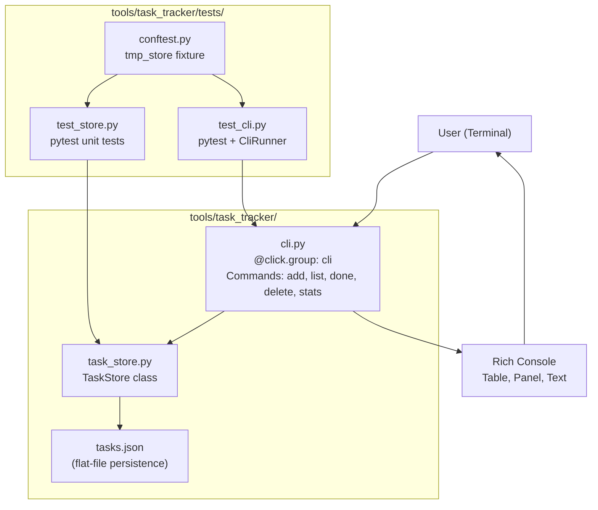
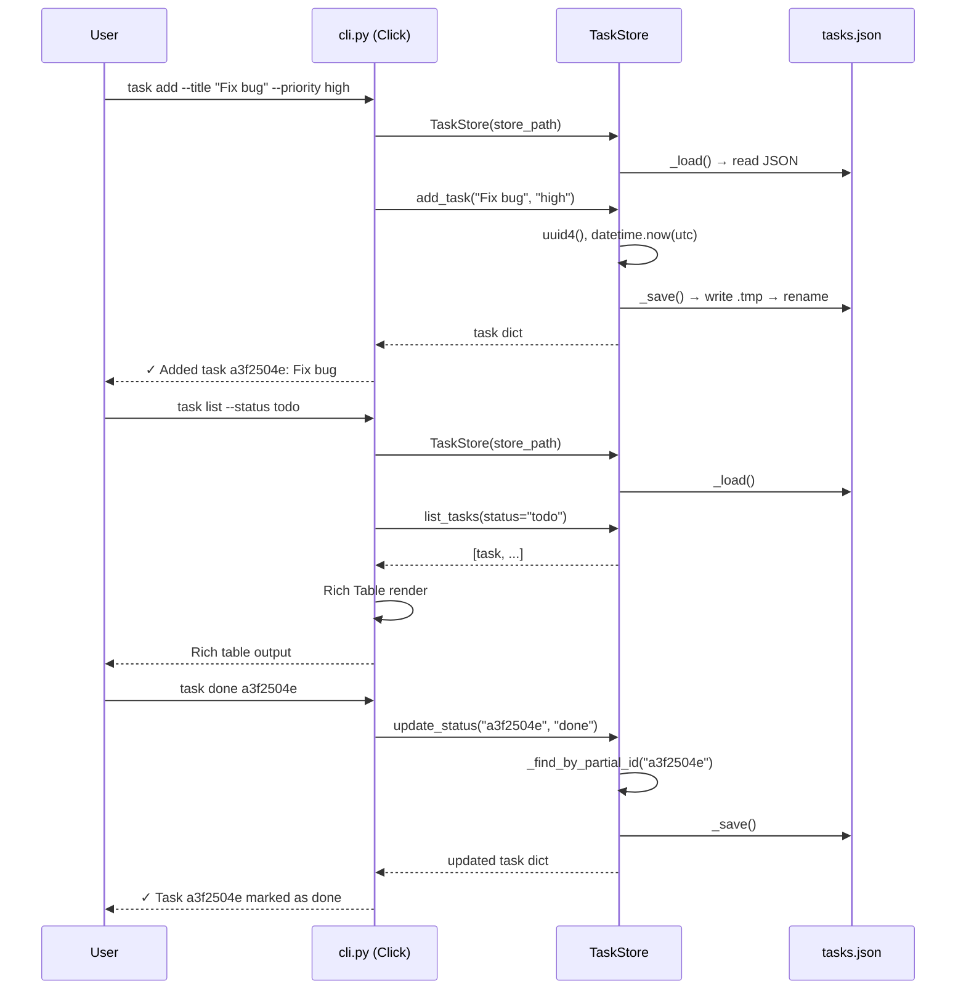
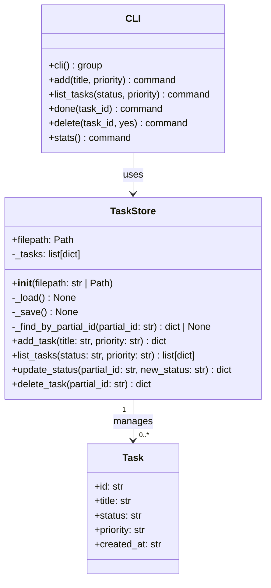
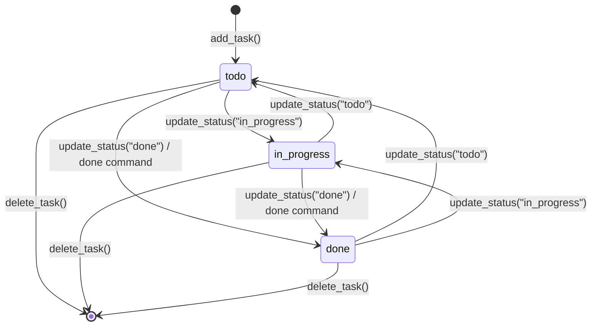

# Build a Python CLI Task Tracker using Click and Rich

A self-contained Python CLI task tracker built inside the vLLM workspace at `tools/task_tracker/`. The tool uses Click for command parsing, Rich for terminal output, and a local `tasks.json` file for persistence. All tests are written with pytest and Click's `CliRunner`.

---

## Design & Architecture

### Overview

The task tracker is a standalone sub-tool within the vLLM monorepo (`/Users/pradeepsharma/sasva/projects/vllm`). It lives under `tools/task_tracker/` to avoid interfering with vLLM's own build system, `pyproject.toml`, and `requirements/` structure. The tool has two core modules: `task_store.py` (data layer) and `cli.py` (CLI interface), plus a `tests/` subdirectory for pytest-based tests.

The data layer (`TaskStore`) reads and writes a JSON file (`tasks.json`) using atomic writes (write to `.tmp`, then rename). Each task is a plain Python `dict` with five fields: `id` (UUID4 string), `title` (str), `status` (todo|in_progress|done), `priority` (low|medium|high), and `created_at` (ISO 8601 UTC timestamp). The `TaskStore` class exposes four public methods: `add_task`, `list_tasks` (with optional filters), `update_status`, and `delete_task`. Partial ID prefix matching (like git short-SHAs) is used for `update_status` and `delete_task`.

The CLI layer (`cli.py`) uses Click's `@click.group()` pattern with five subcommands: `add`, `list`, `done`, `delete`, and `stats`. Rich tables are used for `list` output, and a Rich panel is used for `stats`. The `--store` global option (also readable from `TASK_STORE_PATH` env var) allows tests to inject a temporary file path via `CliRunner`'s `env` parameter.

### Diagrams

#### Architecture / Component Diagram



#### Data Flow / Sequence Diagram



#### Class / Data Model Diagram



#### Flowchart — Partial ID Resolution

```mermaid
flowchart TD
    A[partial_id input] --> B{Find tasks where\nid.startswith(partial_id)}
    B --> C{Count matches}
    C -->|0 matches| D[raise KeyError:\nNo task found]
    C -->|1 match| E[Return task dict]
    C -->|2+ matches| F[raise ValueError:\nAmbiguous prefix]
    E --> G[Proceed with\nupdate_status / delete_task]
```

#### State Machine — Task Status Lifecycle



### Directory Structure

```
tools/task_tracker/
├── task_store.py          # TaskStore class — data layer (Phase 1)
├── cli.py                 # Click CLI entry point (Phase 2)
├── requirements.txt       # click>=8.1, rich>=13.0
└── tests/
    ├── __init__.py        # makes tests/ a package
    ├── conftest.py        # shared fixtures: tmp_store, cli_runner
    ├── test_store.py      # unit tests for TaskStore (Phase 3)
    └── test_cli.py        # CLI integration tests via CliRunner (Phase 3)
```

### Key Design Decisions

| Decision | Choice | Rationale |
|----------|--------|-----------|
| Persistence format | `tasks.json` (flat JSON array) | Zero dependencies, human-readable, sufficient for a task tracker |
| Atomic writes | Write to `.tmp` then `Path.replace()` | Prevents corrupt JSON on crash mid-write |
| Partial ID matching | `id.startswith(partial_id)` | Mirrors git short-SHA UX; raises `ValueError` on ambiguity |
| Timestamps | `datetime.now(timezone.utc).isoformat()` | Consistent ISO 8601 with timezone info |
| CLI framework | Click `@click.group()` | Composable subcommands, built-in `--help`, `CliRunner` for testing |
| Output rendering | Rich `Table` + `Panel` | Beautiful terminal output with color-coded status/priority |
| Store path injection | `--store` option + `TASK_STORE_PATH` env var | Allows `CliRunner(env={"TASK_STORE_PATH": tmp})` in tests |
| Module location | `tools/task_tracker/` | Isolated from vLLM's `vllm/` package and `tests/` directory |
| Python version | 3.10+ (union types `str | Path`) | Matches vLLM's `requires-python = ">=3.10"` in `pyproject.toml` |

### Technology Stack

- **Runtime/Language:** Python 3.10+
- **CLI Framework:** Click ≥ 8.1 (`@click.group`, `@click.command`, `@click.option`, `@click.argument`, `click.confirm`, `CliRunner`)
- **Terminal Output:** Rich ≥ 13.0 (`Console`, `Table`, `Panel`, `Text`)
- **Persistence:** `json` stdlib + `pathlib.Path` (atomic write via `.tmp` rename)
- **UUID generation:** `uuid` stdlib (`uuid.uuid4()`)
- **Timestamps:** `datetime` stdlib (`datetime.now(timezone.utc).isoformat()`)
- **Testing:** pytest ≥ 7.0, Click's `CliRunner` (from `click.testing`)
- **No external DB:** flat-file JSON only

---

## Execution Plan

### Phase 1: Project Setup & Core Data Layer
**Estimated effort:** 1-2 hours
**Dependencies:** None

Create the `tools/task_tracker/` directory structure, install dependencies, and implement the fully functional `TaskStore` class in `task_store.py`.

#### Tasks:
- [ ] Create `tools/task_tracker/requirements.txt` with pinned dependencies:
  ```
  click>=8.1.0
  rich>=13.0.0
  pytest>=7.0.0
  ```
- [ ] Create `tools/task_tracker/task_store.py` with the complete `TaskStore` class:
  - [ ] Define module-level constants: `VALID_STATUSES = {"todo", "in_progress", "done"}` and `VALID_PRIORITIES = {"low", "medium", "high"}`
  - [ ] Implement `TaskStore.__init__(self, filepath: str | Path = "tasks.json")` — sets `self.filepath = Path(filepath)`, initializes `self._tasks: list[dict] = []`, calls `self._load()`
  - [ ] Implement `TaskStore._load(self) -> None` — reads JSON from `self.filepath` if it exists; starts with empty list if absent or on `json.JSONDecodeError`
  - [ ] Implement `TaskStore._save(self) -> None` — creates parent dirs, writes to `.tmp` file, then calls `tmp.replace(self.filepath)` for atomic write
  - [ ] Implement `TaskStore._find_by_partial_id(self, partial_id: str) -> Optional[dict]` — returns single match where `t["id"].startswith(partial_id)`, raises `ValueError` on multiple matches, returns `None` on zero matches
  - [ ] Implement `TaskStore.add_task(self, title: str, priority: str = "medium") -> dict` — validates priority, creates task dict with `str(uuid.uuid4())`, `"todo"` status, `datetime.now(timezone.utc).isoformat()` timestamp, appends to `self._tasks`, calls `self._save()`, returns task dict
  - [ ] Implement `TaskStore.list_tasks(self, status: Optional[str] = None, priority: Optional[str] = None) -> list[dict]` — validates filters if provided, returns filtered copy of `self._tasks`
  - [ ] Implement `TaskStore.update_status(self, partial_id: str, new_status: str) -> dict` — validates `new_status`, calls `_find_by_partial_id`, raises `KeyError` if not found, mutates task in-place, calls `_save()`, returns updated task
  - [ ] Implement `TaskStore.delete_task(self, partial_id: str) -> dict` — calls `_find_by_partial_id`, raises `KeyError` if not found, removes from `self._tasks`, calls `_save()`, returns deleted task
- [ ] Verify syntax: `python -m py_compile tools/task_tracker/task_store.py`

#### Deliverables:
- `tools/task_tracker/requirements.txt`
- `tools/task_tracker/task_store.py` (fully implemented `TaskStore` class)

---

### Phase 2: CLI Interface
**Estimated effort:** 1-2 hours
**Dependencies:** Phase 1

Implement the complete `cli.py` using Click and Rich, covering all five subcommands.

#### Tasks:
- [ ] Create `tools/task_tracker/cli.py` with the following structure:
  - [ ] Import `click`, `os`, `sys`, and Rich components: `Console`, `Table`, `Panel`, `Text` from `rich`
  - [ ] Import `TaskStore`, `VALID_STATUSES`, `VALID_PRIORITIES` from `task_store`
  - [ ] Define module-level `console = Console()` and `DEFAULT_STORE_PATH = os.environ.get("TASK_STORE_PATH", "tasks.json")`
  - [ ] Define color maps: `PRIORITY_STYLE = {"low": "green", "medium": "yellow", "high": "red bold"}` and `STATUS_STYLE = {"todo": "cyan", "in_progress": "magenta", "done": "dim green"}`
  - [ ] Define helper `get_store(ctx: click.Context) -> TaskStore` that reads `ctx.obj["store_path"]`
  - [ ] Implement `@click.group()` `cli(ctx, store)` with `@click.option("--store", default=DEFAULT_STORE_PATH, envvar="TASK_STORE_PATH", show_default=True)` and `@click.pass_context`; sets `ctx.obj["store_path"] = store`
  - [ ] Implement `@cli.command()` `add(ctx, title, priority)`:
    - `@click.option("--title", required=True, help="Task title.")`
    - `@click.option("--priority", default="medium", type=click.Choice(["low","medium","high"], case_sensitive=False), show_default=True)`
    - Calls `store.add_task(title, priority.lower())`, prints `✓ Added task {id[:8]}: {title}` in green
  - [ ] Implement `@cli.command(name="list")` `list_tasks(ctx, status, priority)`:
    - `@click.option("--status", default=None, type=click.Choice(["todo","in_progress","done"], case_sensitive=False))`
    - `@click.option("--priority", default=None, type=click.Choice(["low","medium","high"], case_sensitive=False))`
    - Calls `store.list_tasks(status=status, priority=priority)`
    - If empty: prints `[yellow]No tasks found.[/]`
    - Otherwise: builds `Rich Table` with columns ID (8 chars), Title, Status (color-coded), Priority (color-coded), Created (truncated to 19 chars, T→space)
  - [ ] Implement `@cli.command()` `done(ctx, task_id)`:
    - `@click.argument("task_id")`
    - Calls `store.update_status(task_id, "done")`
    - On `KeyError` or `ValueError`: prints error in red, calls `sys.exit(1)`
  - [ ] Implement `@cli.command()` `delete(ctx, task_id, yes)`:
    - `@click.argument("task_id")`
    - `@click.option("--yes", "-y", is_flag=True, help="Skip confirmation.")`
    - If not `yes`: calls `click.confirm(f"Delete task {task_id}?", abort=True)`
    - Calls `store.delete_task(task_id)`
    - On `KeyError` or `ValueError`: prints error in red, calls `sys.exit(1)`
  - [ ] Implement `@cli.command()` `stats(ctx)`:
    - Calls `store.list_tasks()` to get all tasks
    - Computes counts per status: `{s: sum(1 for t in tasks if t["status"]==s) for s in VALID_STATUSES}`
    - Computes counts per priority: `{p: sum(1 for t in tasks if t["priority"]==p) for p in VALID_PRIORITIES}`
    - Builds a `Rich Panel` with a `Rich Table` (two sections: Status Breakdown, Priority Breakdown)
    - Prints total task count in panel title
  - [ ] Add `if __name__ == "__main__": cli()` at bottom
- [ ] Verify syntax: `python -m py_compile tools/task_tracker/cli.py`

#### Deliverables:
- `tools/task_tracker/cli.py` (fully implemented with all 5 subcommands)

---

### Phase 3: Tests
**Estimated effort:** 2-3 hours
**Dependencies:** Phase 1, Phase 2

Write all pytest tests for both `TaskStore` and the CLI, ensuring all tests pass.

#### Tasks:
- [ ] Create `tools/task_tracker/tests/__init__.py` (empty file to make `tests/` a package)
- [ ] Create `tools/task_tracker/tests/conftest.py` with shared fixtures:
  - [ ] `tmp_store(tmp_path)` fixture — returns a `TaskStore` instance pointing to `tmp_path / "tasks.json"`; uses `pytest.fixture` with `scope="function"` so each test gets a fresh store
  - [ ] `runner()` fixture — returns `click.testing.CliRunner(mix_stderr=False)`
  - [ ] `tmp_store_path(tmp_path)` fixture — returns `str(tmp_path / "tasks.json")` for use with `CliRunner`
- [ ] Create `tools/task_tracker/tests/test_store.py` with the following test functions:
  - [ ] `test_add_task_returns_dict(tmp_store)` — calls `add_task("Buy milk", "high")`, asserts returned dict has keys `id`, `title`, `status`, `priority`, `created_at`; asserts `status == "todo"`, `priority == "high"`, `title == "Buy milk"`
  - [ ] `test_add_task_default_priority(tmp_store)` — calls `add_task("Task")`, asserts `priority == "medium"`
  - [ ] `test_add_task_invalid_priority(tmp_store)` — calls `add_task("Task", "urgent")`, asserts `ValueError` is raised
  - [ ] `test_add_task_persists(tmp_path)` — adds a task via one `TaskStore` instance, creates a second `TaskStore(same_path)`, asserts the task appears in `list_tasks()`
  - [ ] `test_list_tasks_no_filter(tmp_store)` — adds 3 tasks, asserts `list_tasks()` returns all 3
  - [ ] `test_list_tasks_filter_status(tmp_store)` — adds tasks with different statuses, updates one to `"done"`, asserts `list_tasks(status="done")` returns only done tasks
  - [ ] `test_list_tasks_filter_priority(tmp_store)` — adds tasks with different priorities, asserts `list_tasks(priority="high")` returns only high-priority tasks
  - [ ] `test_list_tasks_combined_filter(tmp_store)` — adds tasks, asserts combined `status` + `priority` filter works correctly
  - [ ] `test_list_tasks_invalid_status(tmp_store)` — asserts `ValueError` on `list_tasks(status="invalid")`
  - [ ] `test_update_status_success(tmp_store)` — adds task, calls `update_status(id[:8], "done")`, asserts returned dict has `status == "done"`
  - [ ] `test_update_status_persists(tmp_path)` — updates status via one store, reloads via second store, asserts status persisted
  - [ ] `test_update_status_not_found(tmp_store)` — calls `update_status("nonexistent", "done")`, asserts `KeyError`
  - [ ] `test_update_status_ambiguous(tmp_store)` — adds two tasks, patches their IDs to share a prefix, asserts `ValueError` on ambiguous match
  - [ ] `test_update_status_invalid_status(tmp_store)` — asserts `ValueError` on `update_status(id, "invalid")`
  - [ ] `test_delete_task_success(tmp_store)` — adds task, deletes it, asserts `list_tasks()` is empty
  - [ ] `test_delete_task_returns_deleted(tmp_store)` — asserts `delete_task` returns the deleted task dict
  - [ ] `test_delete_task_persists(tmp_path)` — deletes via one store, reloads via second store, asserts task gone
  - [ ] `test_delete_task_not_found(tmp_store)` — asserts `KeyError` on missing id
  - [ ] `test_persistence_save_load_roundtrip(tmp_path)` — adds multiple tasks, creates fresh `TaskStore`, asserts all tasks present with correct fields
- [ ] Create `tools/task_tracker/tests/test_cli.py` with the following test functions (all use `CliRunner` with `env={"TASK_STORE_PATH": tmp_store_path}`):
  - [ ] `test_add_command_success(runner, tmp_store_path)` — invokes `cli add --title "Fix bug" --priority high`, asserts `exit_code == 0`, asserts `"Added task"` in output
  - [ ] `test_add_command_missing_title(runner, tmp_store_path)` — invokes `cli add --priority high` (no `--title`), asserts `exit_code != 0`
  - [ ] `test_add_command_invalid_priority(runner, tmp_store_path)` — invokes `cli add --title "X" --priority urgent`, asserts `exit_code != 0`
  - [ ] `test_add_command_default_priority(runner, tmp_store_path)` — invokes `cli add --title "X"`, asserts `exit_code == 0`
  - [ ] `test_list_command_empty(runner, tmp_store_path)` — invokes `cli list` on empty store, asserts `"No tasks found"` in output
  - [ ] `test_list_command_shows_tasks(runner, tmp_store_path)` — adds a task, invokes `cli list`, asserts task title appears in output
  - [ ] `test_list_command_filter_status(runner, tmp_store_path)` — adds tasks, invokes `cli list --status todo`, asserts only todo tasks shown
  - [ ] `test_list_command_filter_priority(runner, tmp_store_path)` — adds tasks, invokes `cli list --priority high`, asserts only high tasks shown
  - [ ] `test_done_command_success(runner, tmp_store_path)` — adds task, invokes `cli done {id[:8]}`, asserts `exit_code == 0`, asserts `"marked as done"` in output
  - [ ] `test_done_command_not_found(runner, tmp_store_path)` — invokes `cli done nonexistent`, asserts `exit_code != 0`, asserts `"Error"` in output
  - [ ] `test_delete_command_with_yes_flag(runner, tmp_store_path)` — adds task, invokes `cli delete {id[:8]} --yes`, asserts `exit_code == 0`
  - [ ] `test_delete_command_confirmation_abort(runner, tmp_store_path)` — adds task, invokes `cli delete {id[:8]}` with `input="n\n"`, asserts task still exists
  - [ ] `test_delete_command_not_found(runner, tmp_store_path)` — invokes `cli delete nonexistent --yes`, asserts `exit_code != 0`
  - [ ] `test_stats_command_empty(runner, tmp_store_path)` — invokes `cli stats` on empty store, asserts `exit_code == 0`, asserts `"0"` appears in output
  - [ ] `test_stats_command_with_tasks(runner, tmp_store_path)` — adds tasks with various statuses/priorities, invokes `cli stats`, asserts counts appear in output
  - [ ] `test_global_store_option(runner, tmp_path)` — invokes `cli --store {custom_path} add --title "X"`, asserts task written to `custom_path`
- [ ] Install dependencies and run tests:
  ```bash
  cd tools/task_tracker
  pip install -r requirements.txt
  pytest tests/ -v
  ```
- [ ] Confirm all tests pass (expect ~35 tests total)

#### Deliverables:
- `tools/task_tracker/tests/__init__.py`
- `tools/task_tracker/tests/conftest.py` (shared fixtures)
- `tools/task_tracker/tests/test_store.py` (19 unit tests for `TaskStore`)
- `tools/task_tracker/tests/test_cli.py` (16 CLI integration tests)

---

## Verification Criteria

Run the following commands from `tools/task_tracker/` to verify the project works:

### Install dependencies
```bash
cd /Users/pradeepsharma/sasva/projects/vllm/tools/task_tracker
pip install -r requirements.txt
```

### Run all tests
```bash
pytest tests/ -v
```
**Expected:** All ~35 tests pass. Zero failures, zero errors.

### Manual CLI smoke test
```bash
# Add tasks
python cli.py add --title "Fix login bug" --priority high
python cli.py add --title "Write docs" --priority low
python cli.py add --title "Deploy to prod" --priority medium

# List all tasks (should show Rich table with 3 rows)
python cli.py list

# Filter by priority
python cli.py list --priority high
# Expected: only "Fix login bug" shown

# Filter by status
python cli.py list --status todo
# Expected: all 3 tasks shown (all are todo)

# Mark a task done (use first 8 chars of ID from list output)
python cli.py done <first-8-chars-of-id>
# Expected: "✓ Task <id> marked as done."

# List again — done task should show "done" status
python cli.py list

# Show stats panel
python cli.py stats
# Expected: Rich panel showing "todo: 2, in_progress: 0, done: 1" and priority counts

# Delete a task with confirmation
python cli.py delete <first-8-chars-of-another-id>
# Expected: prompts "Delete task ...? [y/N]:" — type y

# Delete with --yes flag (no prompt)
python cli.py delete <first-8-chars-of-id> --yes
# Expected: task deleted without prompt

# Verify tasks.json was created and is valid JSON
python -c "import json; data=json.load(open('tasks.json')); print(f'{len(data)} tasks remaining')"
```

### Expected test output
```
tests/test_store.py::test_add_task_returns_dict PASSED
tests/test_store.py::test_add_task_default_priority PASSED
tests/test_store.py::test_add_task_invalid_priority PASSED
tests/test_store.py::test_add_task_persists PASSED
tests/test_store.py::test_list_tasks_no_filter PASSED
tests/test_store.py::test_list_tasks_filter_status PASSED
tests/test_store.py::test_list_tasks_filter_priority PASSED
tests/test_store.py::test_list_tasks_combined_filter PASSED
tests/test_store.py::test_list_tasks_invalid_status PASSED
tests/test_store.py::test_update_status_success PASSED
tests/test_store.py::test_update_status_persists PASSED
tests/test_store.py::test_update_status_not_found PASSED
tests/test_store.py::test_update_status_ambiguous PASSED
tests/test_store.py::test_update_status_invalid_status PASSED
tests/test_store.py::test_delete_task_success PASSED
tests/test_store.py::test_delete_task_returns_deleted PASSED
tests/test_store.py::test_delete_task_persists PASSED
tests/test_store.py::test_delete_task_not_found PASSED
tests/test_store.py::test_persistence_save_load_roundtrip PASSED
tests/test_cli.py::test_add_command_success PASSED
tests/test_cli.py::test_add_command_missing_title PASSED
tests/test_cli.py::test_add_command_invalid_priority PASSED
tests/test_cli.py::test_add_command_default_priority PASSED
tests/test_cli.py::test_list_command_empty PASSED
tests/test_cli.py::test_list_command_shows_tasks PASSED
tests/test_cli.py::test_list_command_filter_status PASSED
tests/test_cli.py::test_list_command_filter_priority PASSED
tests/test_cli.py::test_done_command_success PASSED
tests/test_cli.py::test_done_command_not_found PASSED
tests/test_cli.py::test_delete_command_with_yes_flag PASSED
tests/test_cli.py::test_delete_command_confirmation_abort PASSED
tests/test_cli.py::test_delete_command_not_found PASSED
tests/test_cli.py::test_stats_command_empty PASSED
tests/test_cli.py::test_stats_command_with_tasks PASSED
tests/test_cli.py::test_global_store_option PASSED

35 passed in <2s
```
