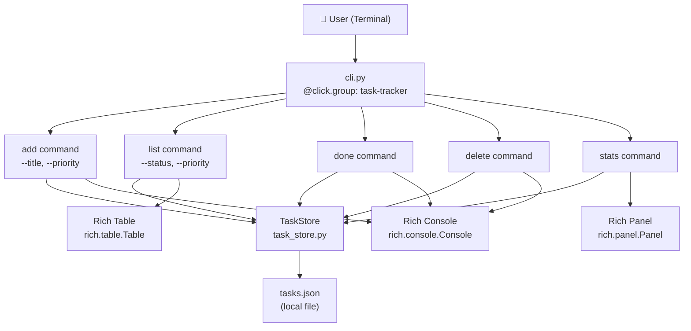
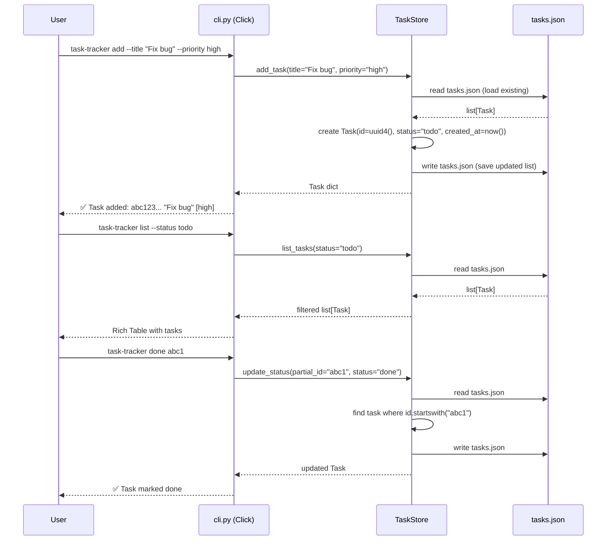
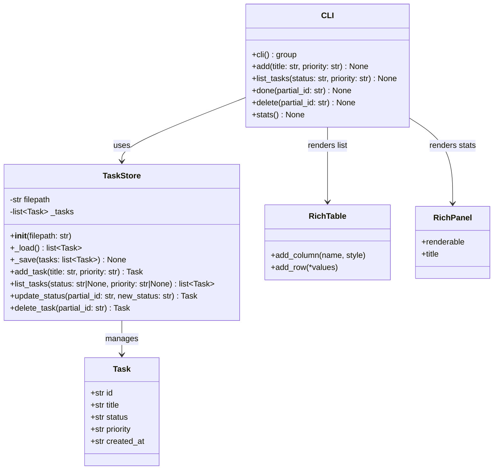
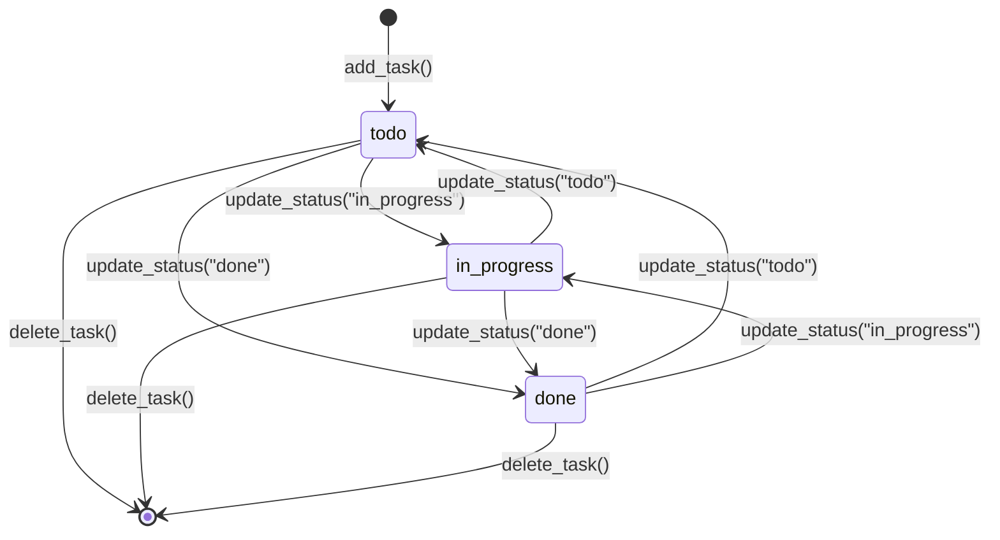

# Python CLI Task Tracker with Click and Rich

A standalone Python CLI application for managing tasks locally, built with Click for command-line argument parsing and Rich for beautiful terminal output. Tasks are persisted to a local `tasks.json` file and support filtering, status tracking, and priority management.

---

## Design & Architecture

### Overview

The task tracker is a self-contained Python package placed at the root of the vllm workspace (or as a standalone directory `task_tracker/`). It consists of two primary modules: `task_store.py` (the data layer) and `cli.py` (the CLI interface), plus a `tests/` directory for automated testing.

The **data layer** (`TaskStore`) handles all JSON persistence. Each task is a Python `TypedDict`/dataclass with five fields: `id` (UUID4 string), `title` (str), `status` (Literal `todo|in_progress|done`), `priority` (Literal `low|medium|high`), and `created_at` (ISO 8601 timestamp). The store reads the full JSON file on every operation and writes it back atomically, keeping the implementation simple and reliable for a local CLI tool.

The **CLI layer** (`cli.py`) uses Click's `@click.group()` decorator to define a command group with five subcommands: `add`, `list`, `done`, `delete`, and `stats`. Rich is used for all terminal output — `rich.table.Table` for task listings and `rich.panel.Panel` for the stats summary. The CLI is registered as a console script entry point (`task-tracker`) via `pyproject.toml` or a standalone `setup.py`.

### Architecture / Component Diagram



### Data Flow / Sequence Diagram



### Class / Data Model Diagram



### State Machine Diagram



### Directory Structure

```
task_tracker/                    # Root package directory
├── task_store.py                # TaskStore class — data layer & JSON persistence
├── cli.py                       # Click CLI entry point — all 5 commands
├── pyproject.toml               # Package metadata, dependencies, console_scripts entry
├── tasks.json                   # Runtime data file (created on first use, gitignored)
├── .gitignore                   # Ignore tasks.json and __pycache__
└── tests/
    ├── __init__.py              # Empty init for pytest discovery
    ├── conftest.py              # Shared fixtures (tmp_path TaskStore, CliRunner)
    ├── test_store.py            # Unit tests for TaskStore methods
    └── test_cli.py              # Integration tests using Click's CliRunner
```

### Key Design Decisions

| Decision | Choice | Rationale |
|----------|--------|-----------|
| Persistence format | JSON file (`tasks.json`) | Human-readable, zero dependencies, trivial to inspect/edit |
| Task identity | UUID4 string | Globally unique, no collision risk, supports partial matching |
| Partial ID matching | `str.startswith()` | Intuitive UX (like git short SHAs), simple implementation |
| Status transitions | Any → Any | Flexible; no enforced workflow, user decides |
| CLI framework | Click | Declarative, composable, excellent CliRunner for testing |
| Output formatting | Rich Table + Panel | Beautiful terminal output with zero boilerplate |
| File I/O strategy | Read-all / Write-all | Simple, correct for small task lists; no locking needed |
| Priority default | `medium` | Sensible default; reduces friction for quick task entry |
| Error handling | `click.echo` + `sys.exit(1)` | Standard CLI error pattern; testable via CliRunner |

### Technology Stack

- **Runtime/Language:** Python 3.10+
- **CLI Framework:** Click 8.x — `@click.group`, `@click.command`, `@click.option`, `@click.argument`, `@click.confirm`
- **Terminal UI:** Rich 13.x — `rich.console.Console`, `rich.table.Table`, `rich.panel.Panel`, `rich.text.Text`
- **Data Storage:** JSON via Python stdlib `json` module
- **ID Generation:** Python stdlib `uuid.uuid4()`
- **Timestamps:** Python stdlib `datetime.datetime.utcnow().isoformat()`
- **Testing:** pytest 7.x + Click's `click.testing.CliRunner`
- **Package Config:** `pyproject.toml` with `[project.scripts]` entry point

---

## Execution Plan

### Phase 1: Project Setup & Configuration
**Estimated effort:** 0.5-1 hour
**Dependencies:** None

Set up the `task_tracker/` package directory with all configuration files, dependency declarations, and shared infrastructure. This phase produces only real config files — no stub source files.

#### Tasks:
- [ ] Create `task_tracker/pyproject.toml` with:
  - `[project]` section: name=`task-tracker`, version=`0.1.0`, requires-python=`>=3.10`
  - `[project.dependencies]`: `click>=8.0`, `rich>=13.0`
  - `[project.optional-dependencies]`: `test = ["pytest>=7.0"]`
  - `[project.scripts]`: `task-tracker = "task_tracker.cli:cli"`
  - `[tool.pytest.ini_options]`: `testpaths = ["tests"]`
- [ ] Create `task_tracker/.gitignore` with entries for `tasks.json`, `__pycache__/`, `*.pyc`, `.pytest_cache/`, `dist/`, `*.egg-info/`
- [ ] Create `task_tracker/__init__.py` as an empty file to make `task_tracker` a proper Python package
- [ ] Verify Python syntax of `pyproject.toml` is valid TOML by reviewing structure

#### Deliverables:
- `task_tracker/pyproject.toml` — complete package configuration
- `task_tracker/.gitignore` — runtime artifacts excluded
- `task_tracker/__init__.py` — package marker

---

### Phase 2: Core Data Layer (`task_store.py`)
**Estimated effort:** 1-2 hours
**Dependencies:** Phase 1

Implement the `TaskStore` class with full JSON persistence, task CRUD operations, and filtering support. This is the heart of the application.

#### Tasks:
- [ ] Create `task_tracker/task_store.py` with the following complete implementation:
  - **Imports**: `json`, `uuid`, `datetime`, `os`, `typing` (TypedDict, Literal, Optional, List)
  - **`Task` TypedDict**: fields `id: str`, `title: str`, `status: Literal["todo", "in_progress", "done"]`, `priority: Literal["low", "medium", "high"]`, `created_at: str`
  - **`VALID_STATUSES`** constant: `frozenset({"todo", "in_progress", "done"})`
  - **`VALID_PRIORITIES`** constant: `frozenset({"low", "medium", "high"})`
  - **`TaskNotFoundError(Exception)`** custom exception class with message including the partial ID
  - **`AmbiguousTaskError(Exception)`** custom exception class for when partial ID matches multiple tasks
  - **`TaskStore.__init__(self, filepath: str = "tasks.json")`**: stores `self.filepath = filepath`
  - **`TaskStore._load(self) -> List[Task]`**: reads `self.filepath` if it exists (returns `[]` if not), parses JSON, returns list of Task dicts
  - **`TaskStore._save(self, tasks: List[Task]) -> None`**: writes tasks list to `self.filepath` as pretty-printed JSON (indent=2)
  - **`TaskStore.add_task(self, title: str, priority: str = "medium") -> Task`**:
    - Validates `priority` is in `VALID_PRIORITIES`, raises `ValueError` if not
    - Creates Task dict with `id=str(uuid.uuid4())`, `title=title.strip()`, `status="todo"`, `priority=priority`, `created_at=datetime.datetime.utcnow().isoformat()`
    - Loads existing tasks, appends new task, saves, returns new task
  - **`TaskStore.list_tasks(self, status: Optional[str] = None, priority: Optional[str] = None) -> List[Task]`**:
    - Validates `status` if provided (raises `ValueError` if invalid)
    - Validates `priority` if provided (raises `ValueError` if invalid)
    - Loads tasks, applies filters with `if status: tasks = [t for t in tasks if t["status"] == status]` and similar for priority
    - Returns filtered list sorted by `created_at` ascending
  - **`TaskStore._find_task(self, tasks: List[Task], partial_id: str) -> Task`** (private helper):
    - Finds tasks where `t["id"].startswith(partial_id)`
    - Raises `TaskNotFoundError` if none found
    - Raises `AmbiguousTaskError` if multiple found (includes list of matching IDs in message)
    - Returns the single matching task
  - **`TaskStore.update_status(self, partial_id: str, new_status: str) -> Task`**:
    - Validates `new_status` is in `VALID_STATUSES`, raises `ValueError` if not
    - Loads tasks, uses `_find_task` to locate the task
    - Updates `task["status"] = new_status` in-place in the list
    - Saves updated list, returns updated task
  - **`TaskStore.delete_task(self, partial_id: str) -> Task`**:
    - Loads tasks, uses `_find_task` to locate the task
    - Removes task from list: `tasks = [t for t in tasks if t["id"] != found["id"]]`
    - Saves updated list, returns the deleted task
- [ ] Verify syntax: `python -m py_compile task_tracker/task_store.py`

#### Deliverables:
- `task_tracker/task_store.py` — fully implemented `TaskStore` class with all 4 public methods + helpers

---

### Phase 3: CLI Interface (`cli.py`)
**Estimated effort:** 1.5-2 hours
**Dependencies:** Phase 2

Implement the Click CLI with all 5 commands (`add`, `list`, `done`, `delete`, `stats`) using Rich for all terminal output.

#### Tasks:
- [ ] Create `task_tracker/cli.py` with the following complete implementation:
  - **Imports**: `click`, `rich.console.Console`, `rich.table.Table`, `rich.panel.Panel`, `rich.text.Text`, `sys`, `.task_store.TaskStore`, `.task_store.TaskNotFoundError`, `.task_store.AmbiguousTaskError`
  - **`console = Console()`** — module-level Rich console instance
  - **`STATUS_COLORS`** dict: `{"todo": "yellow", "in_progress": "blue", "done": "green"}`
  - **`PRIORITY_COLORS`** dict: `{"low": "dim", "medium": "white", "high": "red bold"}`
  - **`@click.group()`** decorated `cli()` function with `help="Task Tracker CLI — manage your tasks from the terminal."`
  - **`@cli.command("add")`** with options:
    - `@click.option("--title", "-t", required=True, help="Task title")`
    - `@click.option("--priority", "-p", default="medium", type=click.Choice(["low", "medium", "high"]), show_default=True, help="Task priority")`
    - Function `add(title, priority)`: creates `TaskStore()`, calls `store.add_task(title, priority)`, prints success with `console.print(f"✅ Task added: [bold]{task['id'][:8]}[/bold] — {task['title']} [{PRIORITY_COLORS[task['priority']]}]{task['priority']}[/]")`
  - **`@cli.command("list")`** with options:
    - `@click.option("--status", "-s", default=None, type=click.Choice(["todo", "in_progress", "done"]), help="Filter by status")`
    - `@click.option("--priority", "-p", default=None, type=click.Choice(["low", "medium", "high"]), help="Filter by priority")`
    - Function `list_tasks(status, priority)`: creates `TaskStore()`, calls `store.list_tasks(status, priority)`, builds and prints a `rich.table.Table` with columns: `ID` (first 8 chars), `Title`, `Status` (colored), `Priority` (colored), `Created`; if no tasks, prints `"No tasks found."`
    - Table styling: `Table(title="Tasks", show_header=True, header_style="bold magenta", border_style="dim")`
  - **`@cli.command("done")`** with argument:
    - `@click.argument("partial_id")`
    - Function `done(partial_id)`: creates `TaskStore()`, calls `store.update_status(partial_id, "done")`, prints success; catches `TaskNotFoundError` and `AmbiguousTaskError` with `console.print(f"[red]Error:[/red] {e}")` and `sys.exit(1)`
  - **`@cli.command("delete")`** with argument and confirmation:
    - `@click.argument("partial_id")`
    - Function `delete(partial_id)`: creates `TaskStore()`, first calls `store._find_task(store._load(), partial_id)` to preview the task, then uses `click.confirm(f"Delete task '{task['title']}'?", abort=True)`, then calls `store.delete_task(partial_id)`, prints success; catches `TaskNotFoundError`, `AmbiguousTaskError`, and `click.Abort` appropriately
  - **`@cli.command("stats")`**:
    - Function `stats()`: creates `TaskStore()`, calls `store.list_tasks()` to get all tasks
    - Computes counts: `status_counts = {"todo": 0, "in_progress": 0, "done": 0}` and `priority_counts = {"low": 0, "medium": 0, "high": 0}`
    - Builds a Rich `Panel` with a formatted string showing:
      - Total tasks count
      - Status breakdown with colored labels
      - Priority breakdown with colored labels
    - Uses `console.print(Panel(content, title="📊 Task Statistics", border_style="blue"))`
  - **`if __name__ == "__main__": cli()`** at the bottom
- [ ] Verify syntax: `python -m py_compile task_tracker/cli.py`

#### Deliverables:
- `task_tracker/cli.py` — fully implemented Click CLI with all 5 commands and Rich output

---

### Phase 4: Tests
**Estimated effort:** 1.5-2 hours
**Dependencies:** Phase 2, Phase 3

Write comprehensive pytest tests for both the data layer and CLI commands. All tests must pass with `pytest`.

#### Tasks:
- [ ] Create `task_tracker/tests/__init__.py` as an empty file
- [ ] Create `task_tracker/tests/conftest.py` with shared fixtures:
  - `@pytest.fixture` `tmp_store(tmp_path)`: creates a `TaskStore(filepath=str(tmp_path / "test_tasks.json"))` and returns it
  - `@pytest.fixture` `runner()`: returns `click.testing.CliRunner()`
  - `@pytest.fixture` `populated_store(tmp_store)`: adds 3 tasks with varied statuses and priorities, returns the store
- [ ] Create `task_tracker/tests/test_store.py` with the following test functions:
  - **`test_add_task_creates_task(tmp_store)`**: calls `tmp_store.add_task("Buy milk", "high")`, asserts returned task has `title=="Buy milk"`, `priority=="high"`, `status=="todo"`, `id` is a non-empty string, `created_at` is a non-empty string
  - **`test_add_task_default_priority(tmp_store)`**: calls `tmp_store.add_task("Default task")`, asserts `priority=="medium"`
  - **`test_add_task_invalid_priority(tmp_store)`**: asserts `pytest.raises(ValueError)` when calling `tmp_store.add_task("Bad", "urgent")`
  - **`test_list_tasks_empty(tmp_store)`**: asserts `tmp_store.list_tasks() == []`
  - **`test_list_tasks_returns_all(tmp_store)`**: adds 3 tasks, asserts `len(tmp_store.list_tasks()) == 3`
  - **`test_list_tasks_filter_by_status(populated_store)`**: calls `list_tasks(status="todo")`, asserts all returned tasks have `status=="todo"`
  - **`test_list_tasks_filter_by_priority(populated_store)`**: calls `list_tasks(priority="high")`, asserts all returned tasks have `priority=="high"`
  - **`test_list_tasks_filter_combined(populated_store)`**: calls `list_tasks(status="todo", priority="high")`, asserts all returned tasks match both filters
  - **`test_list_tasks_invalid_status(tmp_store)`**: asserts `pytest.raises(ValueError)` for `list_tasks(status="invalid")`
  - **`test_update_status_marks_done(tmp_store)`**: adds a task, calls `update_status(task["id"][:6], "done")`, asserts returned task has `status=="done"`
  - **`test_update_status_partial_id(tmp_store)`**: adds a task, uses first 4 chars of ID for `update_status`, asserts success
  - **`test_update_status_not_found(tmp_store)`**: asserts `pytest.raises(TaskNotFoundError)` for `update_status("zzzzz", "done")`
  - **`test_update_status_invalid_status(tmp_store)`**: adds a task, asserts `pytest.raises(ValueError)` for `update_status(id, "finished")`
  - **`test_delete_task_removes_task(tmp_store)`**: adds a task, calls `delete_task(task["id"][:6])`, asserts `list_tasks()` returns empty list
  - **`test_delete_task_returns_deleted(tmp_store)`**: adds a task, calls `delete_task`, asserts returned task matches original
  - **`test_delete_task_not_found(tmp_store)`**: asserts `pytest.raises(TaskNotFoundError)` for `delete_task("zzzzz")`
  - **`test_persistence_across_save_load(tmp_path)`**: creates `TaskStore(filepath=str(tmp_path/"tasks.json"))`, adds 2 tasks, creates a NEW `TaskStore` instance with the same filepath, asserts `list_tasks()` returns 2 tasks with correct data (verifies JSON round-trip)
  - **`test_ambiguous_id_raises(tmp_store)`**: adds two tasks, manually patches their IDs to share a common prefix (e.g., `"aaa..."` and `"aab..."`), asserts `pytest.raises(AmbiguousTaskError)` for `update_status("aa", "done")`
- [ ] Create `task_tracker/tests/test_cli.py` with the following test functions:
  - **Imports**: `from click.testing import CliRunner`, `from task_tracker.cli import cli`, `from task_tracker.task_store import TaskStore`, `import json`, `import os`
  - **`test_add_command_success(runner, tmp_path, monkeypatch)`**: monkeypatches `task_tracker.cli.TaskStore` to use `tmp_path/"tasks.json"`, invokes `runner.invoke(cli, ["add", "--title", "Test task", "--priority", "high"])`, asserts `result.exit_code == 0`, asserts `"Test task"` in `result.output`
  - **`test_add_command_missing_title(runner)`**: invokes `runner.invoke(cli, ["add"])`, asserts `result.exit_code != 0`, asserts `"Missing option"` in `result.output`
  - **`test_add_command_invalid_priority(runner)`**: invokes `runner.invoke(cli, ["add", "--title", "X", "--priority", "urgent"])`, asserts `result.exit_code != 0`
  - **`test_list_command_empty(runner, tmp_path, monkeypatch)`**: monkeypatches store path, invokes `runner.invoke(cli, ["list"])`, asserts `result.exit_code == 0`, asserts `"No tasks found"` in `result.output`
  - **`test_list_command_shows_tasks(runner, tmp_path, monkeypatch)`**: adds a task via store, invokes `runner.invoke(cli, ["list"])`, asserts task title appears in output
  - **`test_list_command_filter_status(runner, tmp_path, monkeypatch)`**: adds tasks with different statuses, invokes `runner.invoke(cli, ["list", "--status", "todo"])`, asserts only todo tasks appear
  - **`test_done_command_marks_task(runner, tmp_path, monkeypatch)`**: adds a task, invokes `runner.invoke(cli, ["done", task_id[:6]])`, asserts `exit_code == 0`, verifies task status is `"done"` in JSON file
  - **`test_done_command_not_found(runner, tmp_path, monkeypatch)`**: invokes `runner.invoke(cli, ["done", "zzzzz"])`, asserts `exit_code == 1`, asserts `"Error"` in `result.output`
  - **`test_delete_command_with_confirmation(runner, tmp_path, monkeypatch)`**: adds a task, invokes `runner.invoke(cli, ["delete", task_id[:6]], input="y\n")`, asserts `exit_code == 0`, verifies task is gone from JSON
  - **`test_delete_command_abort(runner, tmp_path, monkeypatch)`**: adds a task, invokes `runner.invoke(cli, ["delete", task_id[:6]], input="n\n")`, asserts task still exists in JSON
  - **`test_delete_command_not_found(runner, tmp_path, monkeypatch)`**: invokes `runner.invoke(cli, ["delete", "zzzzz"])`, asserts `exit_code == 1`
  - **`test_stats_command_empty(runner, tmp_path, monkeypatch)`**: invokes `runner.invoke(cli, ["stats"])`, asserts `exit_code == 0`, asserts `"0"` appears in output (zero tasks)
  - **`test_stats_command_with_tasks(runner, tmp_path, monkeypatch)`**: adds tasks with varied statuses, invokes `runner.invoke(cli, ["stats"])`, asserts status counts appear in output
- [ ] Run all tests: `cd task_tracker && python -m pytest tests/ -v`
- [ ] Confirm all tests pass (0 failures, 0 errors)

#### Deliverables:
- `task_tracker/tests/__init__.py`
- `task_tracker/tests/conftest.py` — shared fixtures
- `task_tracker/tests/test_store.py` — 17+ unit tests for `TaskStore`
- `task_tracker/tests/test_cli.py` — 13+ integration tests for CLI commands
- All tests passing under `pytest`

---

### Verification Criteria

After all phases are complete, verify the project works as follows:

**Install the package:**
```bash
cd task_tracker
pip install -e ".[test]"
```

**CLI command verification:**
```bash
# Add tasks
task-tracker add --title "Fix login bug" --priority high
# Expected: ✅ Task added: <8-char-id> — Fix login bug [high]

task-tracker add --title "Write docs"
# Expected: ✅ Task added: <8-char-id> — Write docs [medium]

task-tracker add --title "Update deps" --priority low
# Expected: ✅ Task added: <8-char-id> — Update deps [low]

# List all tasks
task-tracker list
# Expected: Rich table with 3 rows, columns: ID, Title, Status, Priority, Created

# List with filter
task-tracker list --status todo
# Expected: Rich table showing only todo tasks

task-tracker list --priority high
# Expected: Rich table showing only high priority tasks

# Mark done (use first 6+ chars of an ID from the list output)
task-tracker done <partial-id>
# Expected: ✅ Task marked as done: <title>

# Stats
task-tracker stats
# Expected: Rich panel showing "Total: 3", status counts (todo: 2, done: 1), priority counts

# Delete with confirmation
task-tracker delete <partial-id>
# Expected: prompt "Delete task '<title>'? [y/N]:", type y → ✅ Task deleted

# Error cases
task-tracker done zzzzzzz
# Expected: exit code 1, "Error: No task found matching 'zzzzzzz'"

task-tracker add --title "Bad" --priority urgent
# Expected: exit code 2, "Invalid value for '--priority'"
```

**Test suite verification:**
```bash
cd task_tracker
python -m pytest tests/ -v
# Expected: All tests pass — minimum 30 tests, 0 failures, 0 errors
# Example output:
#   tests/test_store.py::test_add_task_creates_task PASSED
#   tests/test_store.py::test_persistence_across_save_load PASSED
#   tests/test_cli.py::test_add_command_success PASSED
#   tests/test_cli.py::test_stats_command_with_tasks PASSED
#   ... (30+ tests total)
#   ===== 30 passed in 0.XXs =====
```

**Syntax check (no install required):**
```bash
python -m py_compile task_tracker/task_store.py && echo "task_store.py OK"
python -m py_compile task_tracker/cli.py && echo "cli.py OK"
```
