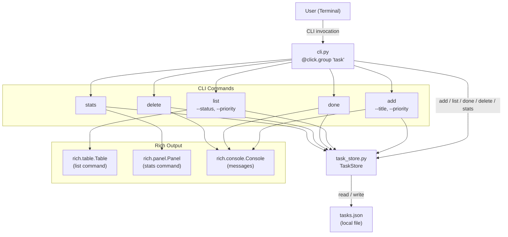
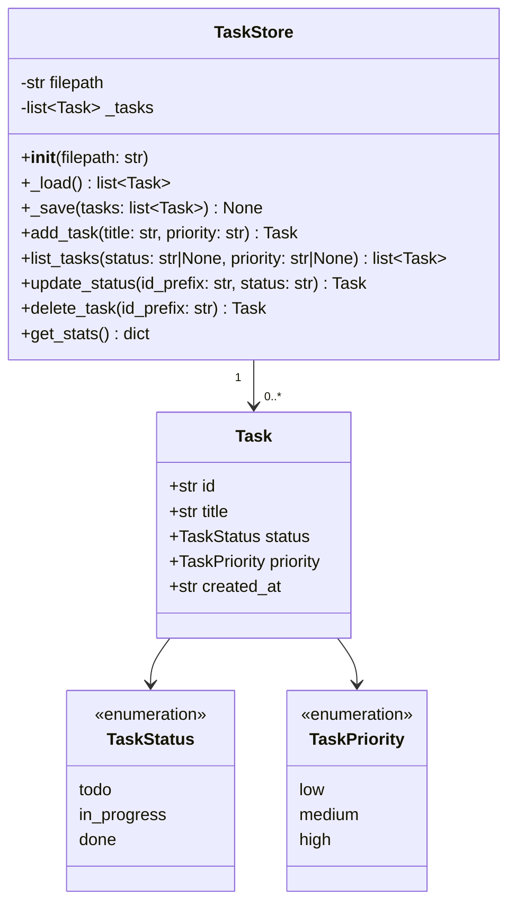
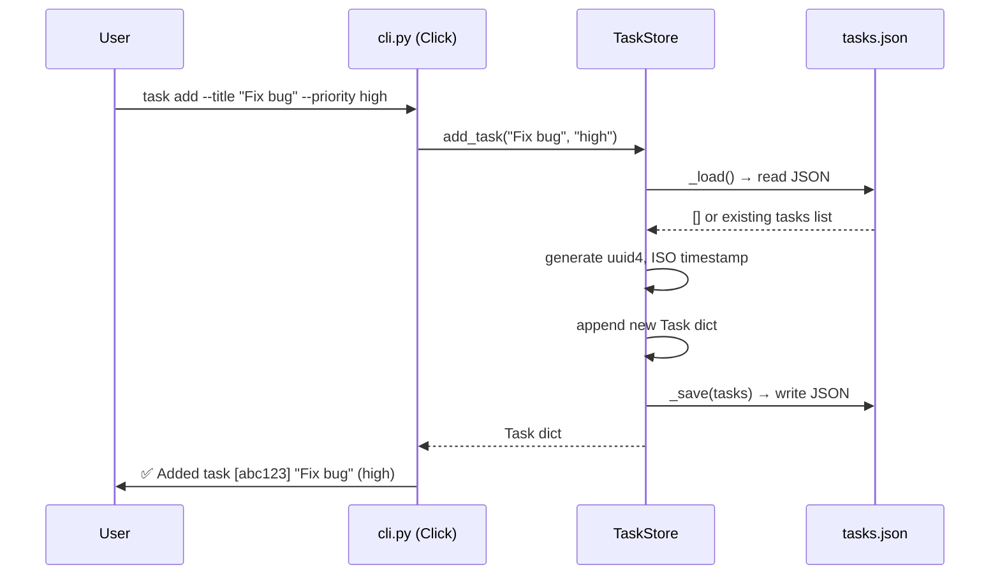
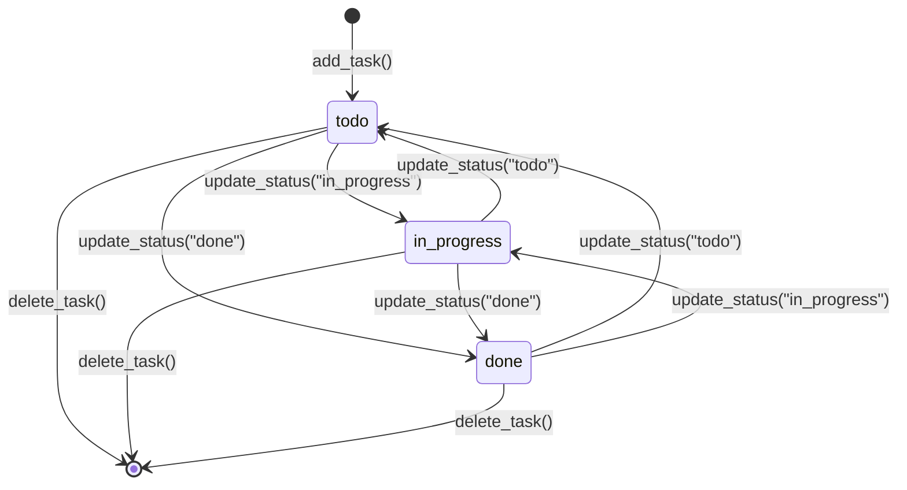

# Python CLI Task Tracker (Click + Rich)

Build a self-contained Python CLI task tracker application within the vLLM workspace. The tool uses Click for command-line argument parsing and Rich for beautiful terminal output, persisting tasks to a local `tasks.json` file. The project lives under `task_tracker/` at the workspace root and includes a full pytest test suite.

---

## Design & Architecture

### Overview

The task tracker is a standalone Python package (`task_tracker/`) placed at the root of the vLLM workspace. It is completely independent of vLLM's own code — it does not import from `vllm.*` and has its own `pyproject.toml`-compatible entry point. The package is structured as two modules: `task_store.py` (data layer) and `cli.py` (presentation/command layer), plus a `tests/` directory.

The **data layer** (`TaskStore`) handles all JSON persistence. Each task is a Python `TypedDict`/`dataclass`-style dict with five fields: `id` (UUID4 string), `title` (str), `status` (Literal `todo|in_progress|done`), `priority` (Literal `low|medium|high`), and `created_at` (ISO-8601 timestamp). The store reads the entire file on every operation and writes it back atomically, keeping the implementation simple and correct.

The **CLI layer** (`cli.py`) uses Click's `@click.group()` / `@click.command()` decorators to expose five sub-commands: `add`, `list`, `done`, `delete`, and `stats`. Rich is used for all terminal output: `rich.table.Table` for `list`, `rich.panel.Panel` for `stats`, and `rich.console.Console` for styled messages. The CLI is registered as a console script entry point (`task`) in `setup.cfg` / `pyproject.toml` so it can be invoked as `task add --title "..."`.

---

### Diagrams

#### Architecture / Component Diagram



#### Data Model / Class Diagram



#### Sequence Diagram — `task add` Command Flow



#### Flowchart — Partial ID Match Logic

```mermaid
flowchart TD
    A[Receive id_prefix from user] --> B[Load all tasks from JSON]
    B --> C{Filter tasks where\ntask.id.startswith(id_prefix)}
    C -->|0 matches| D[Raise click.ClickException:\n'No task found matching id_prefix']
    C -->|1 match| E[Proceed with operation\nupdateStatus / delete]
    C -->|2+ matches| F[Raise click.ClickException:\n'Ambiguous prefix, N tasks match']
    E --> G[Save updated tasks to JSON]
    G --> H[Return matched Task]
```

#### State Machine — Task Status Lifecycle



---

### Directory Structure

```
task_tracker/                   # New standalone package (workspace root)
├── __init__.py                 # Package marker (empty)
├── task_store.py               # TaskStore class — data layer
├── cli.py                      # Click CLI entry point
├── setup.cfg                   # Package metadata + console_scripts entry point
├── requirements.txt            # click, rich (pinned)
└── tests/
    ├── __init__.py             # Test package marker
    ├── conftest.py             # Shared pytest fixtures (tmp_path TaskStore)
    ├── test_store.py           # Unit tests for TaskStore
    └── test_cli.py             # CLI tests using Click's CliRunner
```

---

### Key Design Decisions

| Decision | Choice | Rationale |
|----------|--------|-----------|
| Persistence format | JSON file (`tasks.json`) | Human-readable, zero dependencies, trivially portable |
| Task identity | UUID4 string | Globally unique, no collision risk, supports partial prefix matching |
| Partial ID matching | `str.startswith(prefix)` | Mirrors git short-SHA UX; raises on 0 or 2+ matches |
| Status/priority types | Plain string literals (validated in `add_task`) | Avoids enum import complexity; Click `click.Choice` enforces values at CLI layer |
| CLI framework | Click | Decorator-based, composable, has `CliRunner` for testing without subprocess |
| Output formatting | Rich `Table` + `Panel` | Zero-config beautiful output; `Console(record=True)` enables output capture in tests |
| File location | `task_tracker/` at workspace root | Isolated from vLLM source; does not pollute `vllm/` package namespace |
| Test isolation | `tmp_path` pytest fixture | Each test gets a fresh temp directory; no shared state between tests |

### Technology Stack

- **Runtime/Language:** Python 3.10+ (matches vLLM workspace constraint from `pyproject.toml`)
- **CLI Framework:** Click ≥ 8.1 — `@click.group`, `@click.command`, `@click.option`, `@click.argument`, `click.confirm`, `click.ClickException`, `click.testing.CliRunner`
- **Terminal UI:** Rich ≥ 13.0 — `rich.console.Console`, `rich.table.Table`, `rich.panel.Panel`, `rich.text.Text`, `rich.style`
- **Testing:** pytest ≥ 7.0 (already in `requirements/test.txt`), `click.testing.CliRunner`
- **Standard Library:** `json`, `uuid`, `datetime`, `pathlib.Path`, `typing` (Literal, Optional, TypedDict)

---

## Execution Plan

### Phase 1: Project Setup & Configuration
**Estimated effort:** 0.5–1 hour
**Dependencies:** None

Create the `task_tracker/` package directory with all configuration files needed to install and run the CLI tool. This phase produces real, fully-functional config — not stubs.

#### Tasks:
- [ ] Create `task_tracker/__init__.py` with package docstring: `"""Python CLI Task Tracker using Click and Rich."""`
- [ ] Create `task_tracker/requirements.txt` with pinned dependencies:
  ```
  click>=8.1.0
  rich>=13.0.0
  ```
- [ ] Create `task_tracker/setup.cfg` with:
  - `[metadata]` section: `name=task-tracker`, `version=0.1.0`, `python_requires>=3.10`
  - `[options]` section: `packages=find:`, `install_requires` referencing `click>=8.1.0` and `rich>=13.0.0`
  - `[options.entry_points]` section: `console_scripts = task = task_tracker.cli:main`
- [ ] Create `task_tracker/tests/__init__.py` (empty file, marks tests as a package)
- [ ] Verify Python syntax of all created files with `python -m py_compile task_tracker/__init__.py`

#### Deliverables:
- `task_tracker/__init__.py`
- `task_tracker/requirements.txt`
- `task_tracker/setup.cfg`
- `task_tracker/tests/__init__.py`

---

### Phase 2: Core Data Layer — `task_store.py`
**Estimated effort:** 1–2 hours
**Dependencies:** Phase 1

Implement the `TaskStore` class with full JSON persistence, task CRUD operations, and filtering. This is the heart of the application.

#### Tasks:
- [ ] Create `task_tracker/task_store.py` with the following complete implementation:

  **Imports:**
  ```python
  import json
  import uuid
  from datetime import datetime, timezone
  from pathlib import Path
  from typing import Literal, Optional, TypedDict
  ```

  **Type definitions:**
  ```python
  TaskStatus = Literal["todo", "in_progress", "done"]
  TaskPriority = Literal["low", "medium", "high"]

  class Task(TypedDict):
      id: str
      title: str
      status: TaskStatus
      priority: TaskPriority
      created_at: str
  ```

  **`TaskStore` class:**
  - `__init__(self, filepath: str | Path = "tasks.json")` — stores `self.filepath = Path(filepath)`
  - `_load(self) -> list[Task]` — reads `self.filepath` if it exists, returns `[]` if missing; raises `ValueError` on malformed JSON
  - `_save(self, tasks: list[Task]) -> None` — writes JSON with `indent=2` and `ensure_ascii=False`; creates parent dirs if needed via `self.filepath.parent.mkdir(parents=True, exist_ok=True)`
  - `add_task(self, title: str, priority: TaskPriority = "medium") -> Task` — validates `priority` is in `("low", "medium", "high")`; creates Task dict with `id=str(uuid.uuid4())`, `status="todo"`, `created_at=datetime.now(timezone.utc).isoformat()`; appends to loaded list; saves; returns new task
  - `list_tasks(self, status: Optional[TaskStatus] = None, priority: Optional[TaskPriority] = None) -> list[Task]` — loads tasks; applies optional `status` filter (`task["status"] == status`); applies optional `priority` filter (`task["priority"] == priority`); returns filtered list
  - `_find_by_prefix(self, tasks: list[Task], id_prefix: str) -> Task` — private helper: filters `[t for t in tasks if t["id"].startswith(id_prefix)]`; raises `ValueError(f"No task found matching '{id_prefix}'")` if 0 matches; raises `ValueError(f"Ambiguous prefix '{id_prefix}': {len(matches)} tasks match")` if 2+ matches; returns single match
  - `update_status(self, id_prefix: str, new_status: TaskStatus) -> Task` — validates `new_status`; loads tasks; calls `_find_by_prefix`; mutates `task["status"] = new_status`; saves; returns updated task
  - `delete_task(self, id_prefix: str) -> Task` — loads tasks; calls `_find_by_prefix`; removes task from list; saves; returns deleted task
  - `get_stats(self) -> dict` — loads tasks; returns dict with keys `"by_status"` (counts per status) and `"by_priority"` (counts per priority); e.g. `{"by_status": {"todo": 2, "in_progress": 1, "done": 3}, "by_priority": {"low": 1, "medium": 3, "high": 2}}`

- [ ] Verify syntax: `python -m py_compile task_tracker/task_store.py`

#### Deliverables:
- `task_tracker/task_store.py` — fully implemented `TaskStore` class with all 7 methods

---

### Phase 3: CLI Interface — `cli.py`
**Estimated effort:** 1.5–2 hours
**Dependencies:** Phase 2

Implement the Click CLI with all five commands (`add`, `list`, `done`, `delete`, `stats`) using Rich for all terminal output.

#### Tasks:
- [ ] Create `task_tracker/cli.py` with the following complete implementation:

  **Imports:**
  ```python
  import click
  from rich.console import Console
  from rich.panel import Panel
  from rich.table import Table
  from rich.text import Text
  from task_tracker.task_store import TaskStore
  ```

  **Console and helpers:**
  - `console = Console()` — module-level Rich console instance
  - `PRIORITY_COLORS = {"low": "green", "medium": "yellow", "high": "red"}` — color map for priority
  - `STATUS_COLORS = {"todo": "blue", "in_progress": "yellow", "done": "green"}` — color map for status

  **`@click.group()` main group:**
  ```python
  @click.group()
  @click.option("--store", default="tasks.json", envvar="TASK_STORE_PATH",
                help="Path to the tasks JSON file.", show_default=True)
  @click.pass_context
  def main(ctx, store):
      ctx.ensure_object(dict)
      ctx.obj["store"] = TaskStore(store)
  ```

  **`add` command:**
  ```python
  @main.command()
  @click.option("--title", required=True, help="Task title.")
  @click.option("--priority", default="medium",
                type=click.Choice(["low", "medium", "high"], case_sensitive=False),
                show_default=True, help="Task priority.")
  @click.pass_context
  def add(ctx, title, priority):
      """Add a new task."""
      store: TaskStore = ctx.obj["store"]
      task = store.add_task(title, priority.lower())
      short_id = task["id"][:8]
      console.print(f"[bold green]✓[/] Added task [[cyan]{short_id}[/]] "
                    f"[bold]{title}[/] ([{PRIORITY_COLORS[task['priority']]}]{task['priority']}[/])")
  ```

  **`list` command:**
  ```python
  @main.command(name="list")
  @click.option("--status", default=None,
                type=click.Choice(["todo", "in_progress", "done"], case_sensitive=False),
                help="Filter by status.")
  @click.option("--priority", default=None,
                type=click.Choice(["low", "medium", "high"], case_sensitive=False),
                help="Filter by priority.")
  @click.pass_context
  def list_tasks(ctx, status, priority):
      """List tasks with optional filters."""
      store: TaskStore = ctx.obj["store"]
      tasks = store.list_tasks(status=status, priority=priority)
      if not tasks:
          console.print("[dim]No tasks found.[/]")
          return
      table = Table(title="Tasks", show_header=True, header_style="bold magenta")
      table.add_column("ID", style="cyan", width=10)
      table.add_column("Title", style="white", min_width=20)
      table.add_column("Status", justify="center", width=12)
      table.add_column("Priority", justify="center", width=10)
      table.add_column("Created At", style="dim", width=22)
      for task in tasks:
          status_color = STATUS_COLORS.get(task["status"], "white")
          priority_color = PRIORITY_COLORS.get(task["priority"], "white")
          table.add_row(
              task["id"][:8],
              task["title"],
              Text(task["status"], style=status_color),
              Text(task["priority"], style=priority_color),
              task["created_at"][:19].replace("T", " "),
          )
      console.print(table)
  ```

  **`done` command:**
  ```python
  @main.command()
  @click.argument("id_prefix")
  @click.pass_context
  def done(ctx, id_prefix):
      """Mark a task as done by partial ID match."""
      store: TaskStore = ctx.obj["store"]
      try:
          task = store.update_status(id_prefix, "done")
          short_id = task["id"][:8]
          console.print(f"[bold green]✓[/] Task [[cyan]{short_id}[/]] marked as [green]done[/]: {task['title']}")
      except ValueError as e:
          raise click.ClickException(str(e))
  ```

  **`delete` command:**
  ```python
  @main.command()
  @click.argument("id_prefix")
  @click.option("--yes", is_flag=True, help="Skip confirmation prompt.")
  @click.pass_context
  def delete(ctx, id_prefix, yes):
      """Delete a task by partial ID match."""
      store: TaskStore = ctx.obj["store"]
      try:
          # Peek at the task before deleting for confirmation message
          tasks = store.list_tasks()
          # Use internal prefix match to preview
          matches = [t for t in tasks if t["id"].startswith(id_prefix)]
          if not matches:
              raise click.ClickException(f"No task found matching '{id_prefix}'")
          if len(matches) > 1:
              raise click.ClickException(f"Ambiguous prefix '{id_prefix}': {len(matches)} tasks match")
          task = matches[0]
          if not yes:
              click.confirm(f"Delete task '{task['title']}' [{task['id'][:8]}]?", abort=True)
          deleted = store.delete_task(id_prefix)
          console.print(f"[bold red]✗[/] Deleted task [[cyan]{deleted['id'][:8]}[/]]: {deleted['title']}")
      except click.Abort:
          console.print("[dim]Aborted.[/]")
      except ValueError as e:
          raise click.ClickException(str(e))
  ```

  **`stats` command:**
  ```python
  @main.command()
  @click.pass_context
  def stats(ctx):
      """Show task statistics."""
      store: TaskStore = ctx.obj["store"]
      data = store.get_stats()
      by_status = data["by_status"]
      by_priority = data["by_priority"]
      total = sum(by_status.values())
      lines = [
          f"[bold]Total tasks:[/] {total}",
          "",
          "[bold underline]By Status[/]",
          f"  [blue]todo[/]        : {by_status.get('todo', 0)}",
          f"  [yellow]in_progress[/] : {by_status.get('in_progress', 0)}",
          f"  [green]done[/]        : {by_status.get('done', 0)}",
          "",
          "[bold underline]By Priority[/]",
          f"  [green]low[/]    : {by_priority.get('low', 0)}",
          f"  [yellow]medium[/] : {by_priority.get('medium', 0)}",
          f"  [red]high[/]   : {by_priority.get('high', 0)}",
      ]
      panel = Panel("\n".join(lines), title="[bold]Task Statistics[/]", border_style="blue")
      console.print(panel)
  ```

- [ ] Verify syntax: `python -m py_compile task_tracker/cli.py`

#### Deliverables:
- `task_tracker/cli.py` — fully implemented Click CLI with `main` group and 5 commands: `add`, `list`, `done`, `delete`, `stats`

---

### Phase 4: Tests — `tests/test_store.py` & `tests/test_cli.py`
**Estimated effort:** 1.5–2 hours
**Dependencies:** Phase 2, Phase 3

Write comprehensive pytest tests for both the data layer and the CLI. All tests must pass with `pytest task_tracker/tests/`.

#### Tasks:
- [ ] Create `task_tracker/tests/conftest.py` with shared fixtures:
  ```python
  import pytest
  from task_tracker.task_store import TaskStore

  @pytest.fixture
  def store(tmp_path):
      """Return a fresh TaskStore backed by a temp file."""
      return TaskStore(tmp_path / "tasks.json")

  @pytest.fixture
  def store_with_tasks(store):
      """Return a TaskStore pre-populated with 3 tasks."""
      store.add_task("Task A", "low")
      store.add_task("Task B", "medium")
      store.add_task("Task C", "high")
      return store
  ```

- [ ] Create `task_tracker/tests/test_store.py` with the following test functions:

  **`test_add_task_returns_task_dict`** — calls `store.add_task("Buy milk", "low")`; asserts returned dict has keys `id`, `title`, `status`, `priority`, `created_at`; asserts `title == "Buy milk"`, `status == "todo"`, `priority == "low"`

  **`test_add_task_generates_unique_ids`** — adds 3 tasks; asserts all IDs are distinct

  **`test_add_task_invalid_priority_raises`** — calls `store.add_task("X", "urgent")`; asserts `ValueError` is raised

  **`test_list_tasks_returns_all`** — uses `store_with_tasks`; calls `store.list_tasks()`; asserts `len(result) == 3`

  **`test_list_tasks_filter_by_status`** — adds tasks; marks one as done via `update_status`; calls `store.list_tasks(status="done")`; asserts only done tasks returned

  **`test_list_tasks_filter_by_priority`** — uses `store_with_tasks`; calls `store.list_tasks(priority="high")`; asserts only high-priority tasks returned

  **`test_list_tasks_combined_filters`** — adds tasks with various status/priority combos; calls `store.list_tasks(status="todo", priority="medium")`; asserts correct subset returned

  **`test_list_tasks_empty_store`** — fresh store; calls `store.list_tasks()`; asserts `result == []`

  **`test_update_status_marks_done`** — adds a task; calls `store.update_status(task["id"][:6], "done")`; asserts returned task has `status == "done"`

  **`test_update_status_partial_id_match`** — adds a task; uses first 8 chars of ID; asserts update succeeds

  **`test_update_status_no_match_raises`** — calls `store.update_status("xxxxxxxx", "done")`; asserts `ValueError` raised with "No task found"

  **`test_update_status_ambiguous_raises`** — mocks two tasks with IDs starting with same prefix; asserts `ValueError` raised with "Ambiguous"

  **`test_delete_task_removes_task`** — adds 2 tasks; deletes one by prefix; calls `list_tasks()`; asserts only 1 task remains

  **`test_delete_task_returns_deleted`** — adds a task; deletes it; asserts returned dict matches original task

  **`test_delete_task_no_match_raises`** — calls `store.delete_task("xxxxxxxx")`; asserts `ValueError`

  **`test_persistence_across_save_load`** — adds 2 tasks to `store`; creates a NEW `TaskStore` pointing to the same file path; calls `list_tasks()` on new store; asserts both tasks are present with correct data

  **`test_get_stats_counts`** — adds 3 tasks; marks 1 done, 1 in_progress; calls `get_stats()`; asserts `by_status == {"todo": 1, "in_progress": 1, "done": 1}`; asserts `by_priority` sums to 3

  **`test_get_stats_empty_store`** — fresh store; calls `get_stats()`; asserts all counts are 0

- [ ] Create `task_tracker/tests/test_cli.py` with the following test functions:

  **Setup:**
  ```python
  import pytest
  from click.testing import CliRunner
  from task_tracker.cli import main

  @pytest.fixture
  def runner(tmp_path):
      return CliRunner()

  @pytest.fixture
  def store_path(tmp_path):
      return str(tmp_path / "tasks.json")
  ```

  **`test_add_command_success`** — invokes `main ["--store", store_path, "add", "--title", "Test task"]`; asserts `result.exit_code == 0`; asserts `"Added task"` in output

  **`test_add_command_with_priority`** — invokes with `--priority high`; asserts exit code 0; asserts `"high"` in output

  **`test_add_command_missing_title`** — invokes without `--title`; asserts `result.exit_code != 0`

  **`test_add_command_invalid_priority`** — invokes with `--priority urgent`; asserts `result.exit_code != 0`

  **`test_list_command_empty`** — invokes `list` on empty store; asserts exit code 0; asserts `"No tasks found"` in output

  **`test_list_command_shows_tasks`** — adds a task first; invokes `list`; asserts task title appears in output

  **`test_list_command_filter_status`** — adds tasks; marks one done; invokes `list --status done`; asserts only done task title in output

  **`test_list_command_filter_priority`** — adds tasks with different priorities; invokes `list --priority high`; asserts only high-priority task in output

  **`test_done_command_marks_task`** — adds a task; extracts ID from output; invokes `done <id_prefix>`; asserts exit code 0; asserts `"marked as done"` in output

  **`test_done_command_invalid_prefix`** — invokes `done xxxxxxxx`; asserts exit code != 0; asserts error message in output

  **`test_delete_command_with_yes_flag`** — adds a task; invokes `delete <id_prefix> --yes`; asserts exit code 0; asserts `"Deleted task"` in output

  **`test_delete_command_confirmation_abort`** — adds a task; invokes `delete <id_prefix>` with `input="n\n"`; asserts task still exists after abort

  **`test_delete_command_invalid_prefix`** — invokes `delete xxxxxxxx --yes`; asserts exit code != 0

  **`test_stats_command_empty`** — invokes `stats` on empty store; asserts exit code 0; asserts `"Total tasks: 0"` in output

  **`test_stats_command_with_tasks`** — adds 2 tasks; marks 1 done; invokes `stats`; asserts `"Total tasks: 2"` in output; asserts `"done"` and `"todo"` appear in output

  **`test_store_path_option`** — invokes with custom `--store /tmp/custom.json`; asserts no error; verifies file created at custom path

- [ ] Verify syntax: `python -m py_compile task_tracker/tests/test_store.py task_tracker/tests/test_cli.py`
- [ ] Run tests: `cd /Users/pradeepsharma/sasva/projects/vllm && pip install click rich && pytest task_tracker/tests/ -v`

#### Deliverables:
- `task_tracker/tests/conftest.py` — shared fixtures (`store`, `store_with_tasks`)
- `task_tracker/tests/test_store.py` — 18 unit tests for `TaskStore`
- `task_tracker/tests/test_cli.py` — 16 CLI tests using `CliRunner`
- All tests passing: `pytest task_tracker/tests/ -v` exits with code 0

---

### Phase 5: Documentation
**Estimated effort:** 0.5 hours
**Dependencies:** Phase 1, Phase 2, Phase 3, Phase 4

Write the README and environment example for the task tracker package.

#### Tasks:
- [ ] Create `task_tracker/README.md` with:
  - Project title and one-line description
  - Installation section: `pip install click rich` and `pip install -e task_tracker/`
  - Usage section with example commands for all 5 CLI commands (`add`, `list`, `done`, `delete`, `stats`)
  - Environment variable section: `TASK_STORE_PATH` to override default `tasks.json` location
  - Development/testing section: `pytest task_tracker/tests/ -v`

#### Deliverables:
- `task_tracker/README.md`

---

### Verification Criteria

After all phases complete, verify the project works as follows:

**Install dependencies:**
```bash
cd /Users/pradeepsharma/sasva/projects/vllm
pip install click rich
```

**Run the full test suite — expect all tests to pass:**
```bash
pytest task_tracker/tests/ -v
# Expected: 34 tests collected, 34 passed, 0 failed, exit code 0
```

**Manual CLI smoke tests:**
```bash
# Add tasks
python -m task_tracker.cli --store /tmp/test_tasks.json add --title "Fix login bug" --priority high
# Expected output: ✓ Added task [<8-char-id>] Fix login bug (high)

python -m task_tracker.cli --store /tmp/test_tasks.json add --title "Write docs" --priority low
# Expected output: ✓ Added task [<8-char-id>] Write docs (low)

# List all tasks
python -m task_tracker.cli --store /tmp/test_tasks.json list
# Expected: Rich table with 2 rows, columns: ID, Title, Status, Priority, Created At

# Filter by priority
python -m task_tracker.cli --store /tmp/test_tasks.json list --priority high
# Expected: Rich table with 1 row (Fix login bug)

# Mark done (use first 4+ chars of ID from add output)
python -m task_tracker.cli --store /tmp/test_tasks.json done <id_prefix>
# Expected: ✓ Task [<id>] marked as done: Fix login bug

# Stats
python -m task_tracker.cli --store /tmp/test_tasks.json stats
# Expected: Rich panel showing "Total tasks: 2", todo: 1, done: 1

# Delete with --yes flag
python -m task_tracker.cli --store /tmp/test_tasks.json delete <id_prefix> --yes
# Expected: ✗ Deleted task [<id>]: Write docs

# Invalid priority should fail
python -m task_tracker.cli --store /tmp/test_tasks.json add --title "X" --priority urgent
# Expected: exit code 2, error about invalid choice
```

**Persistence check:**
```bash
python -m task_tracker.cli --store /tmp/persist_test.json add --title "Persist me" --priority medium
cat /tmp/persist_test.json
# Expected: valid JSON with 1 task object containing id, title, status, priority, created_at
```
