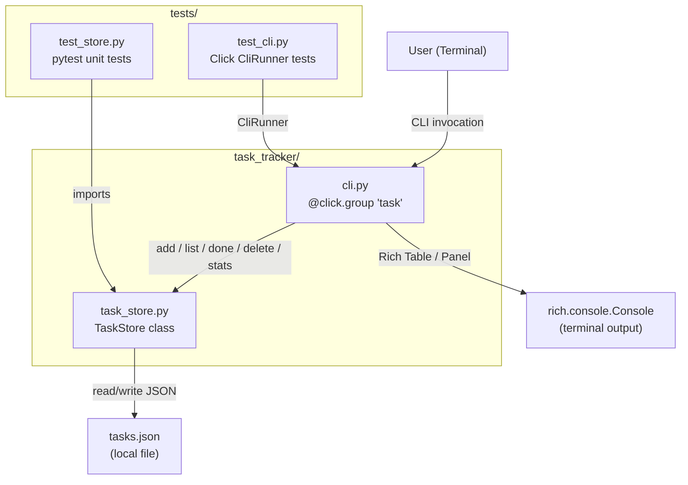
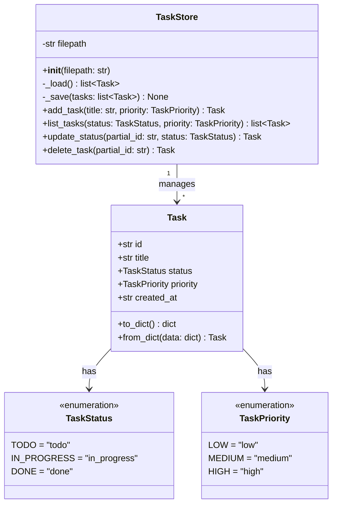
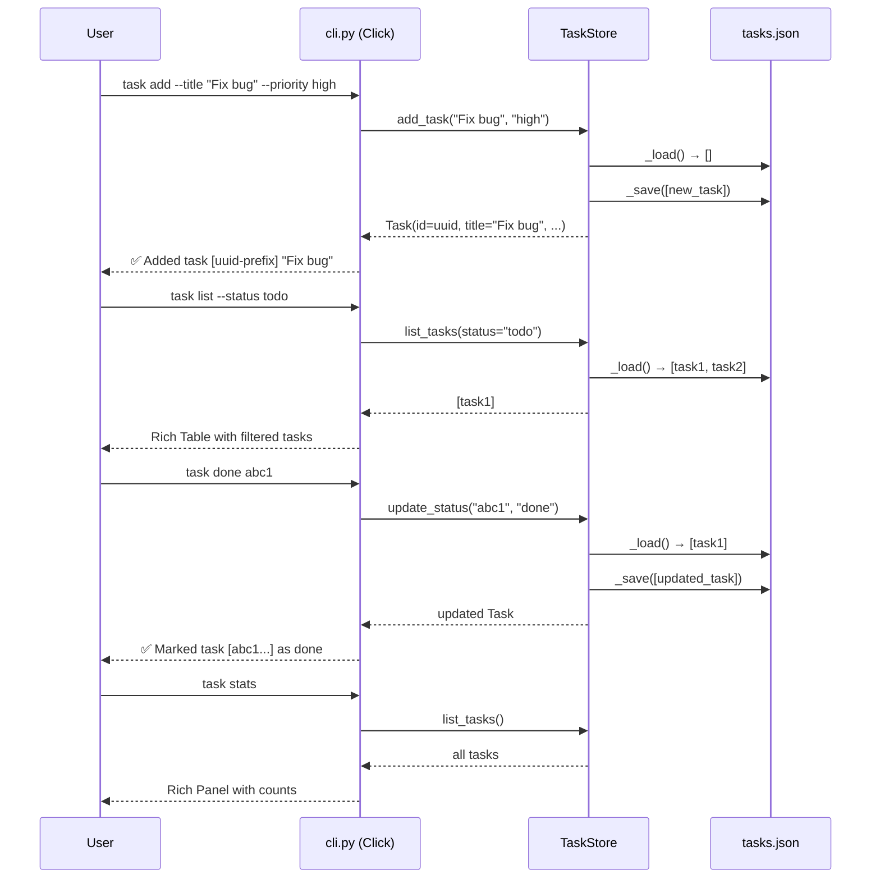
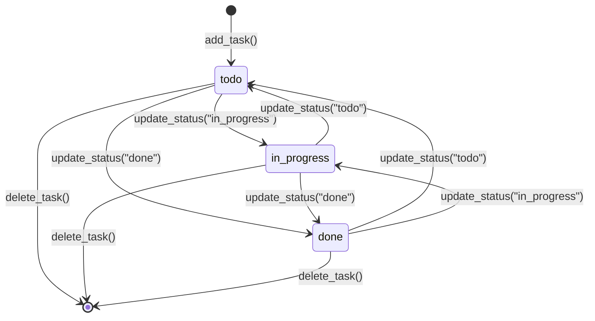

# Python CLI Task Tracker (Click + Rich)

Build a standalone Python CLI task tracker application within the vLLM workspace. The tool uses Click for command-line argument parsing and Rich for beautiful terminal output. Tasks are persisted to a local `tasks.json` file and support full CRUD operations with filtering, status management, and statistics.

---

## Design & Architecture

### Overview

The task tracker is a self-contained Python package placed at `task_tracker/` within the vLLM workspace root. It consists of two primary modules: `task_store.py` (data layer) and `cli.py` (presentation/command layer), plus a `tests/` directory for pytest-based test coverage.

The **data layer** (`TaskStore`) manages a JSON file (`tasks.json`) as the persistence backend. Each task is a Python `dataclass` with fields: `id` (UUID4 string), `title` (str), `status` (Literal `todo|in_progress|done`), `priority` (Literal `low|medium|high`), and `created_at` (ISO 8601 timestamp). The store loads the file on every read and writes atomically on every mutation, keeping the implementation simple and reliable without requiring a database.

The **CLI layer** (`cli.py`) uses Click's `@click.group()` decorator to define a command group with five subcommands: `add`, `list`, `done`, `delete`, and `stats`. Rich is used for all terminal output — `rich.table.Table` for task listings, `rich.panel.Panel` for stats, and `rich.console.Console` for styled messages. The CLI is registered as a console script entry point (`task`) in `pyproject.toml` so it can be invoked as `task add --title "..."`.

### Diagrams

#### Architecture / Component Diagram



#### Data Model Diagram



#### CLI Command Flow



#### State Machine — Task Lifecycle



### Directory Structure

```
task_tracker/                  # New standalone package (workspace root)
├── __init__.py                # Package marker (empty)
├── task_store.py              # TaskStore class + Task dataclass + enums
├── cli.py                     # Click CLI entry point (5 commands)
├── tasks.json                 # Runtime data file (created on first use, gitignored)
└── tests/
    ├── __init__.py            # Test package marker
    ├── test_store.py          # Unit tests for TaskStore
    └── test_cli.py            # Integration tests via Click CliRunner
pyproject.toml                 # Updated: add click, rich deps + console_scripts entry
```

### Key Design Decisions

| Decision | Choice | Rationale |
|----------|--------|-----------|
| Persistence format | JSON flat file (`tasks.json`) | Zero dependencies, human-readable, sufficient for a CLI tool |
| Task identity | UUID4 string | Globally unique, no collision risk; partial-match lookup for UX |
| Partial ID matching | First task whose `id.startswith(partial_id)` | Mirrors git short-SHA UX; raises error if 0 or >1 matches |
| Status/priority types | Python `Literal` strings (not Enum) | Simpler JSON serialization; Click `Choice` validates at CLI boundary |
| CLI framework | Click | Declarative decorators, built-in `--help`, `CliRunner` for testing |
| Output rendering | Rich `Table` + `Panel` | Colored, aligned output with zero manual ANSI codes |
| Atomic writes | Write to temp file then `os.replace()` | Prevents data corruption on crash mid-write |
| Package placement | `task_tracker/` at workspace root | Isolated from vLLM source; doesn't pollute `vllm/` namespace |
| Test isolation | `tmp_path` pytest fixture for `tasks.json` | Each test gets a fresh file; no cross-test state |

### Technology Stack

- **Runtime/Language:** Python 3.10+ (matches vLLM workspace constraint)
- **CLI Framework:** Click 8.x — command groups, options, confirmation prompts
- **Terminal UI:** Rich 13.x — `Console`, `Table`, `Panel`, `Text`, `Style`
- **Data Serialization:** `json` (stdlib) + Python `dataclasses`
- **Unique IDs:** `uuid` (stdlib) — `uuid.uuid4()`
- **Timestamps:** `datetime` (stdlib) — `datetime.now(timezone.utc).isoformat()`
- **Testing:** pytest + Click's `CliRunner` (from `click.testing`)
- **Packaging:** `pyproject.toml` entry point `task = "task_tracker.cli:cli"`

---

## Execution Plan

### Phase 1: Project Setup & Configuration
**Estimated effort:** 0.5–1 hour
**Dependencies:** None

Set up the `task_tracker/` package directory and update `pyproject.toml` to register dependencies and the console script entry point. This phase creates all configuration and package scaffolding needed by subsequent phases.

#### Tasks:
- [ ] Create `task_tracker/__init__.py` (empty file with a module docstring)
- [ ] Create `task_tracker/tests/__init__.py` (empty file)
- [ ] Update `pyproject.toml` to add `click>=8.0` and `rich>=13.0` to an `[project.optional-dependencies]` section named `task-tracker` (or add to a new `requirements/task_tracker.txt`)
  - Add entry: `task = "task_tracker.cli:cli"` under `[project.scripts]` alongside the existing `vllm` entry
- [ ] Create `requirements/task_tracker.txt` with contents:
  ```
  click>=8.0
  rich>=13.0
  pytest>=7.0
  ```
- [ ] Verify Python version compatibility: `task_tracker/` must work with Python 3.10+ (already guaranteed by vLLM's `requires-python = ">=3.10"`)

#### Deliverables:
- `task_tracker/__init__.py`
- `task_tracker/tests/__init__.py`
- `requirements/task_tracker.txt`
- Updated `pyproject.toml` with `task` console script entry

---

### Phase 2: Core Data Layer (`task_store.py`)
**Estimated effort:** 1–2 hours
**Dependencies:** Phase 1

Implement the full `TaskStore` class with all data operations. This is the heart of the application — all CLI commands delegate to this layer.

#### Tasks:
- [ ] Create `task_tracker/task_store.py` with the following complete implementation:

  **Type definitions:**
  - Define `TaskStatus = Literal["todo", "in_progress", "done"]`
  - Define `TaskPriority = Literal["low", "medium", "high"]`
  - Define `VALID_STATUSES: tuple = ("todo", "in_progress", "done")`
  - Define `VALID_PRIORITIES: tuple = ("low", "medium", "high")`

  **`Task` dataclass:**
  ```python
  @dataclass
  class Task:
      id: str           # uuid4 hex string
      title: str
      status: TaskStatus
      priority: TaskPriority
      created_at: str   # ISO 8601 UTC timestamp

      def to_dict(self) -> dict: ...
      @classmethod
      def from_dict(cls, data: dict) -> "Task": ...
  ```

  **`TaskStore` class:**
  - `__init__(self, filepath: str = "tasks.json")` — stores path, does NOT load eagerly
  - `_load(self) -> list[Task]` — reads JSON file; returns `[]` if file doesn't exist; raises `ValueError` on corrupt JSON
  - `_save(self, tasks: list[Task]) -> None` — writes atomically using `tempfile.NamedTemporaryFile` + `os.replace()`; creates parent dirs if needed
  - `add_task(self, title: str, priority: TaskPriority = "medium") -> Task` — generates UUID4 id, sets `status="todo"`, sets `created_at=datetime.now(timezone.utc).isoformat()`, appends to list, saves, returns new `Task`
  - `list_tasks(self, status: TaskStatus | None = None, priority: TaskPriority | None = None) -> list[Task]` — loads all tasks, applies optional filters, returns sorted by `created_at` ascending
  - `update_status(self, partial_id: str, new_status: TaskStatus) -> Task` — finds task by partial ID match (raises `ValueError` if 0 or >1 matches), updates status, saves, returns updated `Task`
  - `delete_task(self, partial_id: str) -> Task` — finds task by partial ID match (raises `ValueError` if 0 or >1 matches), removes from list, saves, returns deleted `Task`

  **Partial ID matching helper:**
  ```python
  def _find_by_partial_id(self, tasks: list[Task], partial_id: str) -> Task:
      matches = [t for t in tasks if t.id.startswith(partial_id)]
      if len(matches) == 0:
          raise ValueError(f"No task found with id starting with '{partial_id}'")
      if len(matches) > 1:
          raise ValueError(
              f"Ambiguous id '{partial_id}' matches {len(matches)} tasks: "
              + ", ".join(t.id[:8] for t in matches)
          )
      return matches[0]
  ```

- [ ] Validate the module compiles cleanly: `python -m py_compile task_tracker/task_store.py`

#### Deliverables:
- `task_tracker/task_store.py` — fully implemented `Task` dataclass + `TaskStore` class

---

### Phase 3: CLI Interface (`cli.py`)
**Estimated effort:** 1.5–2 hours
**Dependencies:** Phase 2

Implement the Click CLI with all five commands (`add`, `list`, `done`, `delete`, `stats`) using Rich for all terminal output.

#### Tasks:
- [ ] Create `task_tracker/cli.py` with the following complete implementation:

  **Imports and setup:**
  ```python
  import click
  from rich.console import Console
  from rich.table import Table
  from rich.panel import Panel
  from rich.text import Text
  from task_tracker.task_store import TaskStore, VALID_STATUSES, VALID_PRIORITIES

  console = Console()
  ```

  **`@click.group()` named `cli`:**
  - Add `@click.pass_context` and store a `TaskStore` instance in `ctx.obj`
  - Accept `--store-path` option (default `"tasks.json"`) to allow tests to inject a temp path

  **`add` command:**
  ```python
  @cli.command()
  @click.option("--title", required=True, help="Task title")
  @click.option("--priority", default="medium",
                type=click.Choice(["low", "medium", "high"]),
                help="Task priority (default: medium)")
  @click.pass_obj
  def add(store: TaskStore, title: str, priority: str): ...
  ```
  - Calls `store.add_task(title, priority)`
  - Prints: `✅ Added task [bold cyan]{task.id[:8]}[/] "{task.title}" (priority: {task.priority})`

  **`list` command:**
  ```python
  @cli.command(name="list")
  @click.option("--status", default=None,
                type=click.Choice(["todo", "in_progress", "done"]))
  @click.option("--priority", default=None,
                type=click.Choice(["low", "medium", "high"]))
  @click.pass_obj
  def list_tasks(store: TaskStore, status: str, priority: str): ...
  ```
  - Calls `store.list_tasks(status, priority)`
  - Renders a `rich.table.Table` with columns: `ID` (first 8 chars), `Title`, `Status`, `Priority`, `Created`
  - Status column uses color coding: `todo`→yellow, `in_progress`→blue, `done`→green
  - Priority column uses color coding: `high`→red, `medium`→yellow, `low`→dim
  - If no tasks match, prints: `[dim]No tasks found.[/dim]`

  **`done` command:**
  ```python
  @cli.command()
  @click.argument("task_id")
  @click.pass_obj
  def done(store: TaskStore, task_id: str): ...
  ```
  - Calls `store.update_status(task_id, "done")`
  - Prints: `✅ Marked task [bold cyan]{task.id[:8]}[/] as [green]done[/green]`
  - Catches `ValueError` and prints error with `console.print(f"[red]Error:[/red] {e}")`

  **`delete` command:**
  ```python
  @cli.command()
  @click.argument("task_id")
  @click.option("--yes", is_flag=True, help="Skip confirmation prompt")
  @click.pass_obj
  def delete(store: TaskStore, task_id: str, yes: bool): ...
  ```
  - If `--yes` not provided, calls `click.confirm(f"Delete task '{task_id}'?", abort=True)`
  - Calls `store.delete_task(task_id)`
  - Prints: `🗑️  Deleted task [bold cyan]{task.id[:8]}[/] "{task.title}"`
  - Catches `ValueError` and prints error

  **`stats` command:**
  ```python
  @cli.command()
  @click.pass_obj
  def stats(store: TaskStore): ...
  ```
  - Calls `store.list_tasks()` to get all tasks
  - Computes counts: `{status: count}` and `{priority: count}`
  - Renders a `rich.panel.Panel` titled `"📊 Task Statistics"` containing:
    - Total tasks count
    - Per-status breakdown (todo / in_progress / done) with colored labels
    - Per-priority breakdown (high / medium / low) with colored labels
  - Uses `rich.table.Table` inside the panel for alignment

  **Entry point guard:**
  ```python
  if __name__ == "__main__":
      cli()
  ```

- [ ] Validate the module compiles cleanly: `python -m py_compile task_tracker/cli.py`

#### Deliverables:
- `task_tracker/cli.py` — fully implemented Click CLI with all 5 commands and Rich output

---

### Phase 4: Testing & Quality Assurance
**Estimated effort:** 1.5–2 hours
**Dependencies:** Phase 2, Phase 3

Write comprehensive pytest test suites for both the data layer and the CLI layer. All tests must pass with `pytest task_tracker/tests/`.

#### Tasks:
- [ ] Create `task_tracker/tests/test_store.py` with the following test cases:

  **Fixtures:**
  ```python
  @pytest.fixture
  def store(tmp_path):
      return TaskStore(filepath=str(tmp_path / "tasks.json"))
  ```

  **Test cases for `add_task`:**
  - `test_add_task_returns_task` — verify returned object has correct `title`, `priority="medium"`, `status="todo"`, non-empty `id`, non-empty `created_at`
  - `test_add_task_with_priority` — add with `priority="high"`, verify `task.priority == "high"`
  - `test_add_task_persists` — add a task, create a new `TaskStore` with same filepath, call `list_tasks()`, verify task is present (tests persistence across save/load)
  - `test_add_multiple_tasks` — add 3 tasks, verify `list_tasks()` returns 3 items

  **Test cases for `list_tasks`:**
  - `test_list_tasks_empty` — fresh store returns `[]`
  - `test_list_tasks_no_filter` — add 3 tasks, verify all 3 returned
  - `test_list_tasks_filter_by_status` — add tasks with different statuses, filter by `status="todo"`, verify only matching tasks returned
  - `test_list_tasks_filter_by_priority` — add tasks with different priorities, filter by `priority="high"`, verify only matching tasks returned
  - `test_list_tasks_filter_combined` — filter by both status and priority simultaneously

  **Test cases for `update_status`:**
  - `test_update_status_full_id` — add task, call `update_status(task.id, "done")`, verify returned task has `status="done"`
  - `test_update_status_partial_id` — add task, call `update_status(task.id[:6], "in_progress")`, verify success
  - `test_update_status_not_found` — call with non-existent id, verify `ValueError` raised
  - `test_update_status_ambiguous` — add two tasks with same id prefix (mock), verify `ValueError` raised with "Ambiguous" in message
  - `test_update_status_persists` — update status, reload store, verify status persisted

  **Test cases for `delete_task`:**
  - `test_delete_task_removes_task` — add task, delete it, verify `list_tasks()` returns `[]`
  - `test_delete_task_returns_deleted` — verify returned object matches the deleted task
  - `test_delete_task_partial_id` — delete using partial id prefix
  - `test_delete_task_not_found` — verify `ValueError` raised for non-existent id
  - `test_delete_task_persists` — delete task, reload store, verify task is gone

- [ ] Create `task_tracker/tests/test_cli.py` with the following test cases:

  **Fixtures:**
  ```python
  from click.testing import CliRunner
  from task_tracker.cli import cli

  @pytest.fixture
  def runner():
      return CliRunner()

  @pytest.fixture
  def store_path(tmp_path):
      return str(tmp_path / "tasks.json")
  ```

  **Helper:**
  ```python
  def invoke(runner, store_path, args):
      return runner.invoke(cli, ["--store-path", store_path] + args)
  ```

  **Test cases for `add` command:**
  - `test_add_command_success` — invoke `add --title "Test task"`, verify exit code 0, verify "Added task" in output
  - `test_add_command_with_priority` — invoke `add --title "Urgent" --priority high`, verify "high" in output
  - `test_add_command_missing_title` — invoke `add` without `--title`, verify exit code != 0

  **Test cases for `list` command:**
  - `test_list_command_empty` — invoke `list`, verify exit code 0, verify "No tasks found" in output
  - `test_list_command_shows_tasks` — add a task, invoke `list`, verify task title in output
  - `test_list_command_filter_status` — add tasks with different statuses, invoke `list --status todo`, verify only todo tasks shown
  - `test_list_command_filter_priority` — add tasks with different priorities, invoke `list --priority high`, verify only high-priority tasks shown

  **Test cases for `done` command:**
  - `test_done_command_success` — add task, invoke `done {task_id[:8]}`, verify exit code 0, verify "done" in output
  - `test_done_command_invalid_id` — invoke `done nonexistent`, verify error message in output

  **Test cases for `delete` command:**
  - `test_delete_command_with_yes_flag` — add task, invoke `delete {task_id[:8]} --yes`, verify exit code 0, verify "Deleted" in output
  - `test_delete_command_confirmation_abort` — add task, invoke `delete {task_id[:8]}` with input `"n\n"`, verify task not deleted
  - `test_delete_command_invalid_id` — invoke `delete nonexistent --yes`, verify error message in output

  **Test cases for `stats` command:**
  - `test_stats_command_empty` — invoke `stats`, verify exit code 0, verify "0" in output
  - `test_stats_command_with_tasks` — add tasks with various statuses/priorities, invoke `stats`, verify counts appear in output

- [ ] Run all tests: `cd task_tracker && pytest tests/ -v`
- [ ] Verify all tests pass (expected: ~25–30 passing tests, 0 failures)

#### Deliverables:
- `task_tracker/tests/test_store.py` — ~20 unit tests for `TaskStore`
- `task_tracker/tests/test_cli.py` — ~15 integration tests via `CliRunner`

---

### Phase 5: Documentation & Final Wiring
**Estimated effort:** 0.5 hour
**Dependencies:** Phase 1, Phase 2, Phase 3, Phase 4

Write the README and finalize the package so it can be installed and used as `task <command>`.

#### Tasks:
- [ ] Create `task_tracker/README.md` with:
  - Installation instructions: `pip install -e ".[task-tracker]"` or `pip install click rich`
  - Usage examples for all 5 commands with sample output
  - Data file location note (`tasks.json` in current working directory)
- [ ] Verify the console script entry point works end-to-end:
  - `pip install -e . --no-build-isolation` (or `pip install click rich` + run as module)
  - `task add --title "Hello World"`
  - `task list`
  - `task stats`
- [ ] Add `tasks.json` to `.gitignore` (or note it should be gitignored)

#### Deliverables:
- `task_tracker/README.md`
- Verified working `task` CLI entry point

---

### Verification Criteria

After all phases are complete, verify the project works as follows:

**1. Install dependencies:**
```bash
pip install click rich pytest
```

**2. Run the full test suite (must all pass):**
```bash
cd /Users/pradeepsharma/sasva/projects/vllm
pytest task_tracker/tests/ -v
# Expected: ~30 tests, 0 failures, 0 errors
```

**3. Smoke-test each CLI command:**
```bash
# Add tasks
python -m task_tracker.cli --store-path /tmp/test_tasks.json add --title "Fix login bug" --priority high
# Expected output: ✅ Added task [8-char-id] "Fix login bug" (priority: high)

python -m task_tracker.cli --store-path /tmp/test_tasks.json add --title "Write docs" --priority low
# Expected output: ✅ Added task [8-char-id] "Write docs" (priority: low)

# List all tasks (Rich table with 2 rows)
python -m task_tracker.cli --store-path /tmp/test_tasks.json list
# Expected: Rich table with columns ID, Title, Status, Priority, Created; 2 rows

# Filter by status
python -m task_tracker.cli --store-path /tmp/test_tasks.json list --status todo
# Expected: Both tasks shown (both are todo)

# Mark done (use first 6+ chars of the id from add output)
python -m task_tracker.cli --store-path /tmp/test_tasks.json done <partial-id>
# Expected: ✅ Marked task [id] as done

# Stats panel
python -m task_tracker.cli --store-path /tmp/test_tasks.json stats
# Expected: Rich panel showing total=2, todo=1, done=1, high=1, low=1

# Delete with confirmation skip
python -m task_tracker.cli --store-path /tmp/test_tasks.json delete <partial-id> --yes
# Expected: 🗑️  Deleted task [id] "Write docs"

# Verify deletion
python -m task_tracker.cli --store-path /tmp/test_tasks.json list
# Expected: 1 task remaining
```

**4. Verify error handling:**
```bash
# Non-existent task id
python -m task_tracker.cli --store-path /tmp/test_tasks.json done zzzzzzz
# Expected: [red]Error:[/red] No task found with id starting with 'zzzzzzz'

# Missing required --title
python -m task_tracker.cli --store-path /tmp/test_tasks.json add
# Expected: Error: Missing option '--title'. (exit code 2)
```

**5. Verify persistence:**
```bash
# After all above commands, tasks.json should exist and be valid JSON
python -c "import json; data=json.load(open('/tmp/test_tasks.json')); print(f'{len(data)} tasks')"
# Expected: 1 tasks (or however many remain)
```
