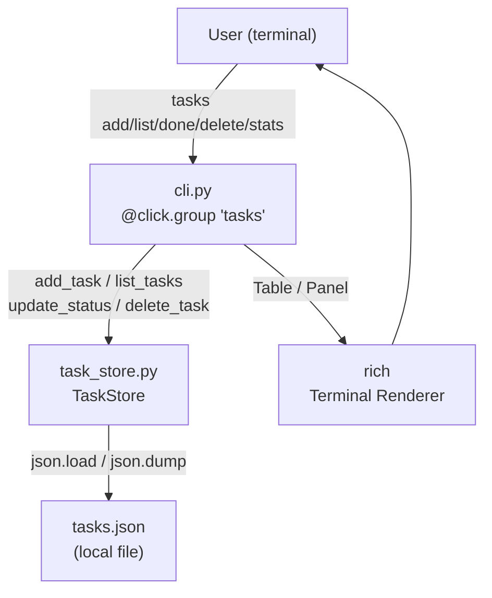
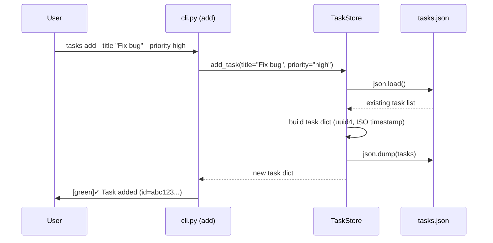
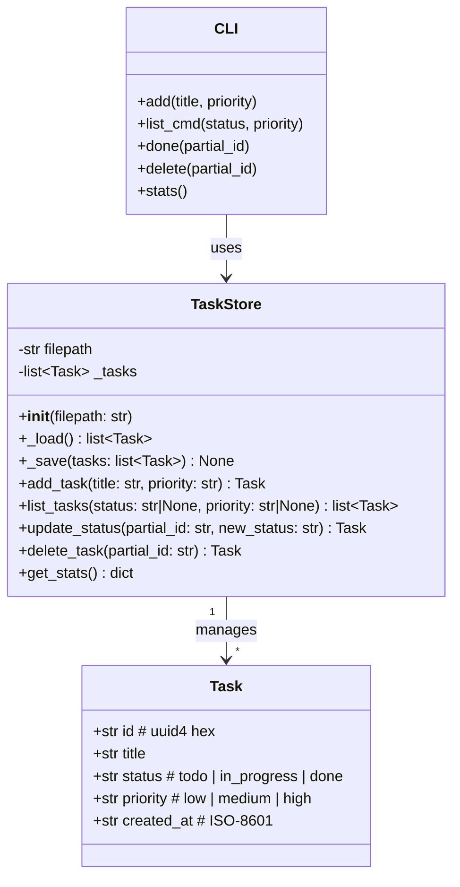
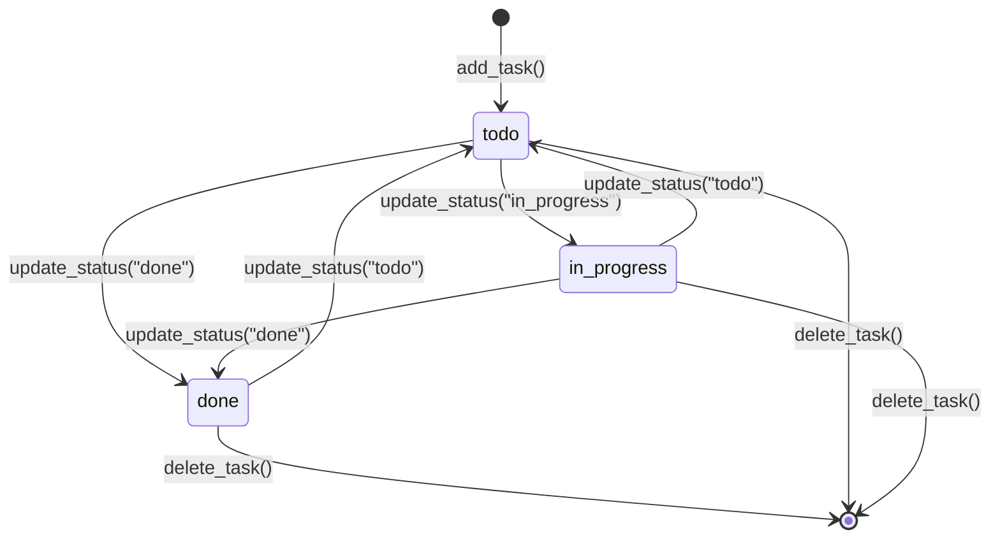

# Python CLI Task Tracker — Click + Rich

A self-contained command-line task management tool built with Click (CLI framework) and Rich (terminal UI). The tool persists tasks to a local `tasks.json` file and exposes five commands: `add`, `list`, `done`, `delete`, and `stats`. The project is placed inside the existing vLLM workspace as a standalone sub-package at `task_tracker/` and includes a full pytest test suite.

---

## Design & Architecture

### Overview

The task tracker is a three-layer application: a **data layer** (`task_store.py`) that owns all JSON I/O and business logic, a **CLI layer** (`cli.py`) that maps Click commands to data-layer calls and renders output with Rich, and a **test layer** (`tests/`) that exercises both layers in isolation using `pytest` and Click's `CliRunner`.

Each task is a plain Python `dict` (serialised to JSON) with five fields: `id` (UUID4 string), `title` (str), `status` (`todo` | `in_progress` | `done`), `priority` (`low` | `medium` | `high`), and `created_at` (ISO-8601 timestamp). The `TaskStore` class is the single source of truth; it loads the full task list on every operation and writes it back atomically. The CLI layer never touches the JSON file directly.

The project is placed at `task_tracker/` inside the vLLM workspace root. It has its own `pyproject.toml` (or `setup.cfg`) so it can be installed with `pip install -e task_tracker/` and invoked as `tasks <command>`. All dependencies (`click`, `rich`) are lightweight and do not conflict with the existing vLLM requirements.

### Diagrams

#### Architecture / Component Diagram



#### Data Flow — add command



#### Class / Data Model Diagram



#### State Machine — Task Lifecycle



#### Flowchart — Partial ID Resolution

```mermaid
flowchart TD
    A[partial_id input] --> B{Count tasks where\nid.startswith(partial_id)}
    B -->|0 matches| C[raise click.ClickException\n'No task found']
    B -->|1 match| D[return matched task]
    B -->|2+ matches| E[raise click.ClickException\n'Ambiguous id — N matches']
    D --> F[proceed with operation]
```

### Directory Structure

```
task_tracker/                    # standalone sub-package (new)
├── pyproject.toml               # package metadata, entry-point: tasks = cli:main
├── requirements.txt             # click>=8.1, rich>=13.0
├── task_tracker/
│   ├── __init__.py              # package marker
│   ├── task_store.py            # TaskStore class — all data logic
│   └── cli.py                  # Click group + 5 commands
└── tests/
    ├── __init__.py
    ├── conftest.py              # shared fixtures (tmp_path store, runner)
    ├── test_store.py            # unit tests for TaskStore
    └── test_cli.py              # integration tests via CliRunner
```

> **Note:** `tasks.json` is created at runtime in the current working directory (or a path passed via `TASKS_FILE` env var / `--file` option). It is never committed to the repository.

### Key Design Decisions

| Decision | Choice | Rationale |
|----------|--------|-----------|
| Persistence format | JSON (stdlib `json`) | Zero extra dependencies; human-readable; sufficient for a local task list |
| ID generation | `uuid.uuid4().hex` | Globally unique; short enough for partial matching |
| Partial ID matching | `str.startswith()` scan | Simple, predictable; raises on 0 or 2+ matches |
| CLI framework | Click 8.x | Declarative decorators, built-in `--help`, `CliRunner` for testing |
| Terminal UI | Rich 13.x | `Table`, `Panel`, colour styles; no curses dependency |
| File location | `TASKS_FILE` env var, default `./tasks.json` | Allows per-directory task lists; easy to override in tests |
| Atomic writes | write to temp file then `os.replace()` | Prevents corruption on crash |
| Status values | `todo`, `in_progress`, `done` | Covers typical Kanban workflow |
| Priority values | `low`, `medium`, `high` | Simple three-tier; default `medium` |
| Package layout | `task_tracker/task_tracker/` (src layout) | Avoids import confusion; installable with `pip install -e .` |

### Technology Stack

- **Runtime/Language:** Python 3.10+ (matches vLLM workspace constraint)
- **CLI Framework:** Click ≥ 8.1 — command groups, options, confirmation prompts
- **Terminal UI:** Rich ≥ 13.0 — `Table`, `Panel`, `Text`, colour markup
- **Testing:** pytest ≥ 7.0, Click's `CliRunner` (bundled with Click)
- **Standard Library:** `uuid`, `json`, `datetime`, `os`, `pathlib`
- **No external DB:** plain JSON file; no SQLite, no SQLAlchemy

---

## Execution Plan

### Phase 1: Project Setup & Package Scaffolding
**Estimated effort:** 0.5–1 hour
**Dependencies:** None

Create the installable package skeleton with all configuration files so the package can be installed and imported immediately.

#### Tasks:
- [ ] Create `task_tracker/pyproject.toml` with:
  - `[project]` section: `name = "task-tracker"`, `version = "0.1.0"`, `requires-python = ">=3.10"`, `dependencies = ["click>=8.1", "rich>=13.0"]`
  - `[project.scripts]` entry point: `tasks = "task_tracker.cli:main"`
  - `[build-system]` using `setuptools`
- [ ] Create `task_tracker/requirements.txt` listing `click>=8.1` and `rich>=13.0` (for direct pip install without build)
- [ ] Create `task_tracker/task_tracker/__init__.py` — empty package marker with `__version__ = "0.1.0"`
- [ ] Create `task_tracker/tests/__init__.py` — empty
- [ ] Verify package is importable: `python -c "import task_tracker"` (syntax check only, no tests yet)

#### Deliverables:
- `task_tracker/pyproject.toml`
- `task_tracker/requirements.txt`
- `task_tracker/task_tracker/__init__.py`
- `task_tracker/tests/__init__.py`

---

### Phase 2: Core Data Layer — `task_store.py`
**Estimated effort:** 1–2 hours
**Dependencies:** Phase 1

Implement the `TaskStore` class with all persistence and business logic. This is the heart of the application.

#### Tasks:
- [ ] Create `task_tracker/task_tracker/task_store.py` with:
  - Module-level constants: `VALID_STATUSES = ("todo", "in_progress", "done")`, `VALID_PRIORITIES = ("low", "medium", "high")`
  - `TaskStore.__init__(self, filepath: str | None = None)`:
    - Resolve `filepath` from argument → `TASKS_FILE` env var → `"./tasks.json"` (in that order)
    - Store as `self.filepath: str`
  - `TaskStore._load(self) -> list[dict]`:
    - If file does not exist, return `[]`
    - Open and `json.load()`; return list
  - `TaskStore._save(self, tasks: list[dict]) -> None`:
    - Write to a temp file in the same directory using `tempfile.NamedTemporaryFile`
    - Call `os.replace(tmp_path, self.filepath)` for atomic write
  - `TaskStore.add_task(self, title: str, priority: str = "medium") -> dict`:
    - Validate `priority` in `VALID_PRIORITIES`; raise `ValueError` if not
    - Build task dict: `id = uuid.uuid4().hex`, `title = title.strip()`, `status = "todo"`, `priority = priority`, `created_at = datetime.datetime.now(datetime.timezone.utc).isoformat()`
    - Load → append → save → return new task
  - `TaskStore.list_tasks(self, status: str | None = None, priority: str | None = None) -> list[dict]`:
    - Load all tasks
    - Filter by `status` if provided (validate against `VALID_STATUSES`)
    - Filter by `priority` if provided (validate against `VALID_PRIORITIES`)
    - Return filtered list (preserves insertion order)
  - `TaskStore.update_status(self, partial_id: str, new_status: str) -> dict`:
    - Validate `new_status` in `VALID_STATUSES`; raise `ValueError` if not
    - Load tasks; find all where `task["id"].startswith(partial_id)`
    - If 0 matches: raise `LookupError(f"No task found matching '{partial_id}'")`
    - If 2+ matches: raise `LookupError(f"Ambiguous id '{partial_id}' — {n} tasks match")`
    - Update `task["status"]`; save; return updated task
  - `TaskStore.delete_task(self, partial_id: str) -> dict`:
    - Load tasks; resolve partial_id (same 0/2+ logic as `update_status`)
    - Remove matched task from list; save; return deleted task
  - `TaskStore.get_stats(self) -> dict`:
    - Load tasks; return `{"total": int, "by_status": {"todo": int, "in_progress": int, "done": int}, "by_priority": {"low": int, "medium": int, "high": int}}`
- [ ] Verify syntax: `python -m py_compile task_tracker/task_tracker/task_store.py`

#### Deliverables:
- `task_tracker/task_tracker/task_store.py` — fully implemented `TaskStore` class

---

### Phase 3: CLI Interface — `cli.py`
**Estimated effort:** 1.5–2 hours
**Dependencies:** Phase 2

Implement the Click CLI with all five commands and Rich-powered output.

#### Tasks:
- [ ] Create `task_tracker/task_tracker/cli.py` with:
  - Imports: `click`, `rich.console.Console`, `rich.table.Table`, `rich.panel.Panel`, `rich.text.Text`, `TaskStore` from `.task_store`
  - Module-level `console = Console()` instance
  - `_get_store() -> TaskStore` helper that reads `TASKS_FILE` env var and returns a `TaskStore` instance
  - `_priority_style(priority: str) -> str` helper returning Rich colour markup: `"high"` → `"bold red"`, `"medium"` → `"yellow"`, `"low"` → `"dim"`
  - `_status_style(status: str) -> str` helper: `"done"` → `"green"`, `"in_progress"` → `"cyan"`, `"todo"` → `"white"`
  - `@click.group()` decorated `main()` function — the entry point
  - **`add` command** (`@main.command()`):
    - `@click.option("--title", "-t", required=True, help="Task title")`
    - `@click.option("--priority", "-p", default="medium", type=click.Choice(["low","medium","high"]), show_default=True)`
    - Calls `store.add_task(title, priority)`; prints `[green]✓ Task added:[/green] {task['id'][:8]}… "{task['title']}"`
    - Catches `ValueError` and prints error via `console.print("[red]Error:[/red] ...")`
  - **`list` command** (`@main.command(name="list")`):
    - `@click.option("--status", "-s", default=None, type=click.Choice(["todo","in_progress","done"]))`
    - `@click.option("--priority", "-p", default=None, type=click.Choice(["low","medium","high"]))`
    - Calls `store.list_tasks(status, priority)`
    - If empty: `console.print("[dim]No tasks found.[/dim]")`
    - Otherwise builds a `rich.table.Table` with columns: `ID` (first 8 chars), `Title`, `Status`, `Priority`, `Created`
    - Each row styled with `_status_style` and `_priority_style`; prints table via `console.print(table)`
  - **`done` command** (`@main.command()`):
    - `@click.argument("partial_id")`
    - Calls `store.update_status(partial_id, "done")`
    - Prints `[green]✓ Marked done:[/green] "{task['title']}"`
    - Catches `LookupError` → `raise click.ClickException(str(e))`
  - **`delete` command** (`@main.command()`):
    - `@click.argument("partial_id")`
    - `@click.option("--yes", "-y", is_flag=True, help="Skip confirmation")`
    - If not `--yes`: `click.confirm(f"Delete task '{partial_id}'?", abort=True)`
    - Calls `store.delete_task(partial_id)`
    - Prints `[red]✗ Deleted:[/red] "{task['title']}"`
    - Catches `LookupError` → `raise click.ClickException(str(e))`
  - **`stats` command** (`@main.command()`):
    - Calls `store.get_stats()`
    - Builds a `rich.panel.Panel` containing two sections:
      - "By Status" rows: `todo`, `in_progress`, `done` with counts and colour
      - "By Priority" rows: `high`, `medium`, `low` with counts and colour
      - Footer: `Total: {stats['total']} tasks`
    - Prints panel via `console.print(panel)`
- [ ] Verify syntax: `python -m py_compile task_tracker/task_tracker/cli.py`

#### Deliverables:
- `task_tracker/task_tracker/cli.py` — fully implemented Click CLI with all 5 commands

---

### Phase 4: Testing & Quality Assurance
**Estimated effort:** 1.5–2 hours
**Dependencies:** Phase 2, Phase 3

Write and run the full pytest test suite covering both the data layer and the CLI.

#### Tasks:
- [ ] Create `task_tracker/tests/conftest.py` with shared fixtures:
  - `@pytest.fixture` `tmp_store(tmp_path)` → creates a `TaskStore` pointing to `tmp_path / "tasks.json"`; yields the store; file is cleaned up automatically by pytest's `tmp_path`
  - `@pytest.fixture` `runner()` → returns `click.testing.CliRunner(mix_stderr=False)`
  - `@pytest.fixture` `cli_store(tmp_path, monkeypatch)` → sets `TASKS_FILE` env var to `str(tmp_path / "tasks.json")` via `monkeypatch.setenv`; returns the path string

- [ ] Create `task_tracker/tests/test_store.py` with:
  - `test_add_task_returns_correct_fields(tmp_store)`:
    - Call `tmp_store.add_task("Write tests", "high")`
    - Assert returned dict has keys `id`, `title`, `status`, `priority`, `created_at`
    - Assert `status == "todo"`, `priority == "high"`, `title == "Write tests"`
    - Assert `id` is a 32-char hex string
  - `test_add_task_default_priority(tmp_store)`:
    - `tmp_store.add_task("Default task")`; assert `priority == "medium"`
  - `test_add_task_invalid_priority(tmp_store)`:
    - `pytest.raises(ValueError)` when calling `tmp_store.add_task("X", "urgent")`
  - `test_list_tasks_empty(tmp_store)`:
    - `assert tmp_store.list_tasks() == []`
  - `test_list_tasks_returns_all(tmp_store)`:
    - Add 3 tasks; assert `len(tmp_store.list_tasks()) == 3`
  - `test_list_tasks_filter_by_status(tmp_store)`:
    - Add tasks with different statuses; update one to `"done"`; assert filter returns only matching tasks
  - `test_list_tasks_filter_by_priority(tmp_store)`:
    - Add tasks with `"low"` and `"high"` priority; assert filter returns only `"high"` tasks
  - `test_list_tasks_combined_filter(tmp_store)`:
    - Add 4 tasks with varying status/priority; assert combined filter returns exactly the right subset
  - `test_update_status_success(tmp_store)`:
    - Add task; call `update_status(task["id"][:6], "done")`; assert returned task has `status == "done"`
  - `test_update_status_partial_id(tmp_store)`:
    - Add task; use first 4 chars of id; assert update succeeds
  - `test_update_status_not_found(tmp_store)`:
    - `pytest.raises(LookupError)` with `update_status("zzzzz", "done")`
  - `test_update_status_ambiguous(tmp_store)`:
    - Add 2 tasks; force same id prefix by monkeypatching `uuid.uuid4` to return predictable values; assert `LookupError` on ambiguous match
  - `test_update_status_invalid_status(tmp_store)`:
    - `pytest.raises(ValueError)` with `update_status(id, "blocked")`
  - `test_delete_task_success(tmp_store)`:
    - Add task; delete it; assert `list_tasks()` returns empty list
  - `test_delete_task_returns_deleted(tmp_store)`:
    - Assert returned dict matches the original task
  - `test_delete_task_not_found(tmp_store)`:
    - `pytest.raises(LookupError)`
  - `test_persistence_across_save_load(tmp_store)`:
    - Add 2 tasks via `tmp_store`; create a second `TaskStore` pointing to the same file; assert it sees both tasks
  - `test_get_stats_empty(tmp_store)`:
    - Assert `get_stats()` returns `{"total": 0, "by_status": {"todo":0,"in_progress":0,"done":0}, "by_priority": {"low":0,"medium":0,"high":0}}`
  - `test_get_stats_counts(tmp_store)`:
    - Add 3 tasks; update one to `"done"`, one to `"in_progress"`; assert stats reflect correct counts

- [ ] Create `task_tracker/tests/test_cli.py` with:
  - `test_add_command_success(runner, cli_store)`:
    - `runner.invoke(main, ["add", "--title", "My task"])` with `env={"TASKS_FILE": cli_store}`
    - Assert `exit_code == 0`; assert `"✓ Task added"` in output
  - `test_add_command_with_priority(runner, cli_store)`:
    - Invoke with `--priority high`; assert exit code 0 and success message
  - `test_add_command_missing_title(runner, cli_store)`:
    - Invoke without `--title`; assert `exit_code != 0`; assert `"Missing option"` in output
  - `test_list_command_empty(runner, cli_store)`:
    - Invoke `list`; assert `"No tasks found"` in output
  - `test_list_command_shows_tasks(runner, cli_store)`:
    - Add a task via `TaskStore`; invoke `list`; assert task title appears in output
  - `test_list_command_filter_status(runner, cli_store)`:
    - Add tasks with different statuses; invoke `list --status done`; assert only done tasks shown
  - `test_list_command_filter_priority(runner, cli_store)`:
    - Invoke `list --priority high`; assert only high-priority tasks shown
  - `test_done_command_success(runner, cli_store)`:
    - Add task via `TaskStore`; invoke `done {id[:6]}`; assert `"Marked done"` in output; assert task status is `"done"` in store
  - `test_done_command_not_found(runner, cli_store)`:
    - Invoke `done zzzzz`; assert `exit_code != 0`; assert `"No task found"` in output
  - `test_delete_command_with_yes_flag(runner, cli_store)`:
    - Add task; invoke `delete {id[:6]} --yes`; assert `"Deleted"` in output; assert store is empty
  - `test_delete_command_confirmation_abort(runner, cli_store)`:
    - Add task; invoke `delete {id[:6]}` with `input="n\n"`; assert task still exists in store
  - `test_delete_command_not_found(runner, cli_store)`:
    - Invoke `delete zzzzz --yes`; assert `exit_code != 0`
  - `test_stats_command_empty(runner, cli_store)`:
    - Invoke `stats`; assert `exit_code == 0`; assert `"Total: 0"` in output
  - `test_stats_command_with_tasks(runner, cli_store)`:
    - Add 2 tasks; mark 1 done; invoke `stats`; assert `"Total: 2"` in output; assert `"done"` count shown

- [ ] Install package in editable mode: `pip install -e task_tracker/` (or `pip install click rich pytest` if not using editable install)
- [ ] Run full test suite: `pytest task_tracker/tests/ -v`
- [ ] Assert all tests pass (0 failures, 0 errors)

#### Deliverables:
- `task_tracker/tests/conftest.py`
- `task_tracker/tests/test_store.py` — 18+ test cases for `TaskStore`
- `task_tracker/tests/test_cli.py` — 14+ test cases for CLI commands
- All tests passing under `pytest task_tracker/tests/ -v`

---

### Phase 5: Documentation
**Estimated effort:** 0.5 hours
**Dependencies:** Phase 1, Phase 2, Phase 3, Phase 4

Write the user-facing README and the environment variable reference.

#### Tasks:
- [ ] Create `task_tracker/README.md` with:
  - **Installation** section: `pip install -e .` from `task_tracker/` directory
  - **Quick Start** section: 5 example commands with expected output snippets
  - **Commands** table: `add`, `list`, `done`, `delete`, `stats` with options
  - **Configuration** section: `TASKS_FILE` env var usage
  - **Development / Testing** section: `pytest tests/ -v`
- [ ] Create `task_tracker/.env.example` with `TASKS_FILE=./tasks.json`

#### Deliverables:
- `task_tracker/README.md`
- `task_tracker/.env.example`

---

## Verification Criteria

After all phases are complete, verify the project works as follows:

### Installation
```bash
cd /Users/pradeepsharma/sasva/projects/vllm/task_tracker
pip install -e .
```
Expected: installs without errors; `tasks --help` shows the command group with `add`, `list`, `done`, `delete`, `stats` subcommands.

### CLI Commands
Run each command and verify expected output:

```bash
# 1. Add tasks
tasks add --title "Fix login bug" --priority high
# Expected: "✓ Task added: <8-char-id>… "Fix login bug""

tasks add --title "Write docs" --priority low
# Expected: "✓ Task added: <8-char-id>… "Write docs""

tasks add --title "Code review"
# Expected: "✓ Task added: <8-char-id>… "Code review"" (priority=medium)

# 2. List all tasks
tasks list
# Expected: Rich table with 3 rows, columns: ID, Title, Status, Priority, Created

# 3. List with filter
tasks list --status todo
# Expected: table with 3 rows (all are todo)

tasks list --priority high
# Expected: table with 1 row ("Fix login bug")

# 4. Mark done (use first 6 chars of the "Fix login bug" task id)
tasks done <partial_id>
# Expected: "✓ Marked done: "Fix login bug""

# 5. Stats
tasks stats
# Expected: Rich panel showing: todo=2, in_progress=0, done=1; high=1, medium=1, low=1; Total: 3 tasks

# 6. Delete with confirmation
tasks delete <partial_id>
# Expected: prompt "Delete task '<partial_id>'? [y/N]:" → type "y" → "✗ Deleted: "Write docs""

# 7. Delete with --yes flag (no prompt)
tasks delete <partial_id> --yes
# Expected: "✗ Deleted: "Code review"" immediately

# 8. Error cases
tasks done zzzzzzz
# Expected: exit code 1, "Error: No task found matching 'zzzzzzz'"

tasks add
# Expected: exit code 2, "Error: Missing option '--title'"
```

### Test Suite
```bash
cd /Users/pradeepsharma/sasva/projects/vllm/task_tracker
pytest tests/ -v
```
Expected output:
- All tests collected and **PASSED** (minimum 32 tests: 18 in `test_store.py` + 14 in `test_cli.py`)
- Zero failures, zero errors
- Exit code 0

### Persistence Check
```bash
tasks add --title "Persistent task"
# Note the task id
python -c "import json; tasks=json.load(open('tasks.json')); print(tasks)"
# Expected: JSON array containing the task with all 5 fields
```
