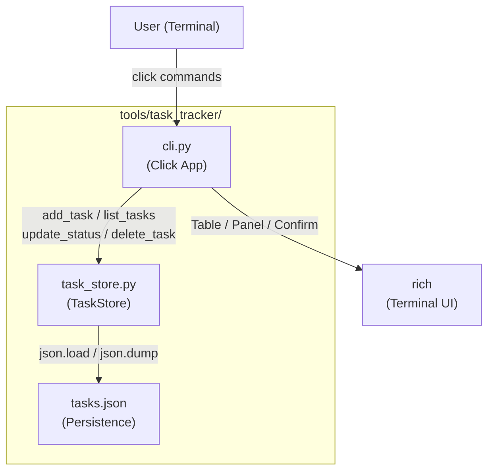
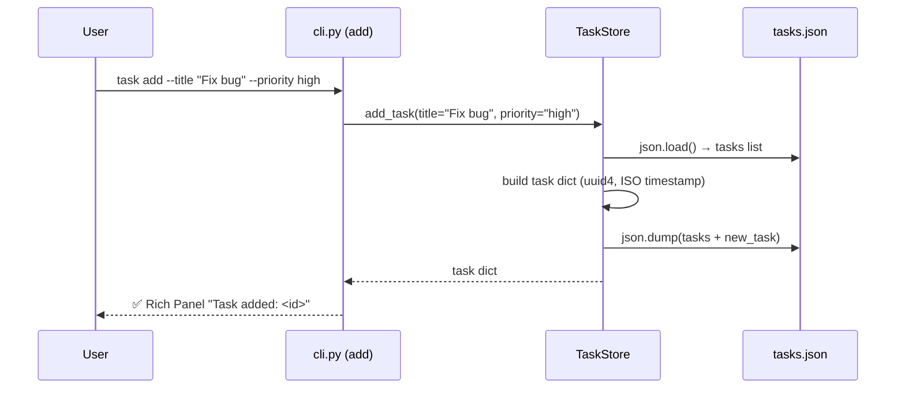
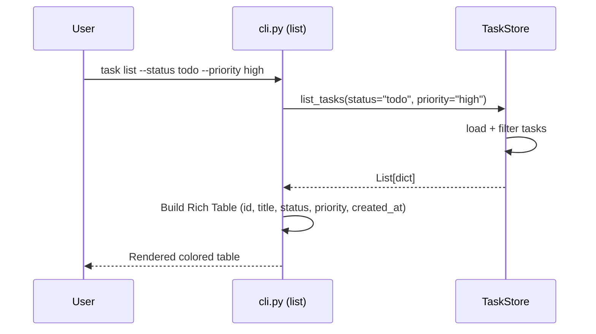
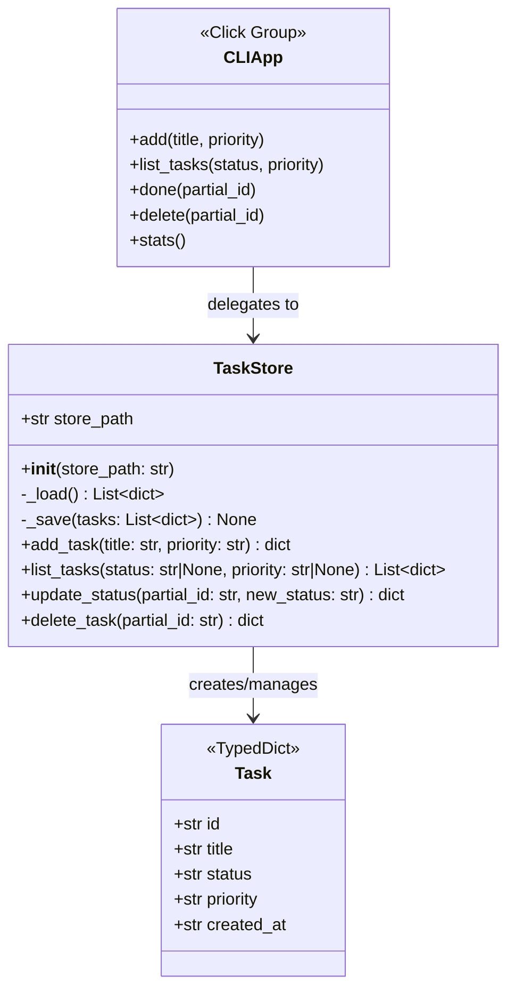
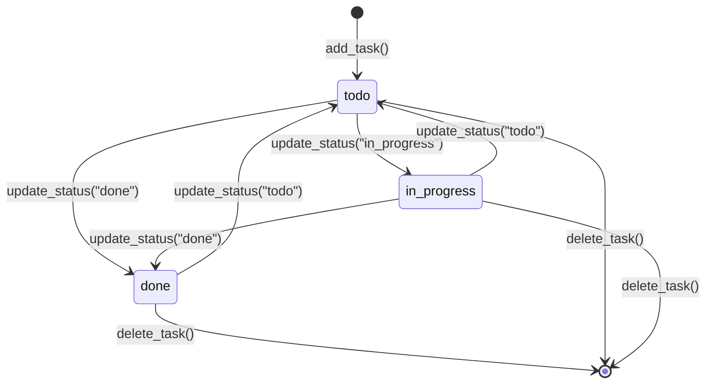

# Python CLI Task Tracker (Click + Rich)

A standalone command-line task management tool built with Python, Click, and Rich. The tool persists tasks to a local `tasks.json` file and provides a polished terminal UI with colored tables, panels, and interactive confirmations. It is developed as a self-contained package within the vLLM workspace under `tools/task_tracker/`.

---

## Design & Architecture

### Overview

The project is structured as a two-layer application. The **data layer** (`task_store.py`) owns all persistence logic: it reads and writes a JSON file (`tasks.json`) and exposes a clean `TaskStore` class with methods for CRUD operations and filtering. The **CLI layer** (`cli.py`) is built with Click and delegates all data operations to `TaskStore`, using Rich to render output as styled tables and panels.

Each task is a plain Python `TypedDict`/`dict` with five fields: `id` (UUID4 string), `title` (str), `status` (`todo | in_progress | done`), `priority` (`low | medium | high`), and `created_at` (ISO-8601 timestamp). The JSON file is the single source of truth; no database or ORM is required.

The CLI exposes five commands: `add`, `list`, `done`, `delete`, and `stats`. Partial-ID matching (prefix or substring) is used for `done` and `delete` to avoid requiring users to type full UUIDs. The `stats` command renders a Rich `Panel` with a breakdown table of task counts by status and priority.

### Diagrams

#### Architecture / Component Diagram



#### Data Flow — add command



#### Data Flow — list command



#### Class / Data Model Diagram



#### State Machine — Task Status



### Directory Structure

```
tools/task_tracker/
├── task_store.py          # TaskStore class — data layer
├── cli.py                 # Click CLI entry point
├── requirements.txt       # click, rich (pinned)
├── setup.py               # optional: pip install -e .
└── tests/
    ├── __init__.py
    ├── test_store.py      # Unit tests for TaskStore
    └── test_cli.py        # CLI tests via Click CliRunner
```

> **Note:** `tasks.json` is created at runtime in the working directory (or a configurable path). It is NOT committed to the repository.

### Key Design Decisions

| Decision | Choice | Rationale |
|----------|--------|-----------|
| Persistence format | JSON flat file (`tasks.json`) | Zero dependencies, human-readable, sufficient for a CLI tool |
| Task ID | `uuid.uuid4()` as string | Globally unique, no collision risk, easy partial matching |
| Partial ID matching | Substring match on `task["id"]` | Avoids requiring full UUIDs; raises error if 0 or >1 matches |
| CLI framework | Click | Declarative, composable, has `CliRunner` for testing |
| Terminal UI | Rich | First-class tables, panels, colors; no curses complexity |
| Status/priority validation | Click `Choice` type | Validated at parse time, clear error messages |
| Store path | Constructor argument (default `tasks.json`) | Enables test isolation via temp files |

### Technology Stack

- **Runtime/Language:** Python 3.10+ (matches vLLM workspace `pyproject.toml`)
- **CLI Framework:** Click ≥ 8.1
- **Terminal UI:** Rich ≥ 13.0
- **Testing:** pytest ≥ 7.0, Click's built-in `CliRunner`
- **Standard Library:** `uuid`, `json`, `datetime`, `os`, `pathlib`
- **No external database** — plain JSON file persistence

---

## Execution Plan

### Phase 1: Project Setup & Configuration
**Estimated effort:** 0.5–1 hour
**Dependencies:** None

Create the `tools/task_tracker/` directory with all configuration files needed to install and run the project as a standalone package.

#### Tasks:
- [ ] Create `tools/task_tracker/requirements.txt` with pinned dependencies:
  ```
  click>=8.1.0
  rich>=13.0.0
  pytest>=7.0.0
  ```
- [ ] Create `tools/task_tracker/setup.py` (or `pyproject.toml`) that declares:
  - `name = "task-tracker"`
  - `install_requires = ["click>=8.1.0", "rich>=13.0.0"]`
  - `entry_points = {"console_scripts": ["task = cli:cli"]}`
- [ ] Create `tools/task_tracker/tests/__init__.py` (empty, marks tests as a package)
- [ ] Verify Python 3.10+ compatibility in all config files

#### Deliverables:
- `tools/task_tracker/requirements.txt`
- `tools/task_tracker/setup.py`
- `tools/task_tracker/tests/__init__.py`

---

### Phase 2: Core Data Layer — `task_store.py`
**Estimated effort:** 1–2 hours
**Dependencies:** Phase 1

Implement the `TaskStore` class with full CRUD operations and JSON persistence. This is the heart of the application — all business logic lives here.

#### Tasks:
- [ ] Create `tools/task_tracker/task_store.py` with:
  - Module-level constants:
    ```python
    VALID_STATUSES = ("todo", "in_progress", "done")
    VALID_PRIORITIES = ("low", "medium", "high")
    DEFAULT_STORE_PATH = "tasks.json"
    ```
  - `TaskStore.__init__(self, store_path: str = DEFAULT_STORE_PATH)` — stores path, does NOT create file eagerly
  - `TaskStore._load(self) -> list[dict]` — reads JSON file; returns `[]` if file does not exist; raises `ValueError` on corrupt JSON
  - `TaskStore._save(self, tasks: list[dict]) -> None` — writes JSON with `indent=2` for readability
  - `TaskStore.add_task(self, title: str, priority: str = "medium") -> dict`:
    - Validates `priority` is in `VALID_PRIORITIES`; raises `ValueError` if not
    - Builds task dict: `{"id": str(uuid.uuid4()), "title": title, "status": "todo", "priority": priority, "created_at": datetime.utcnow().isoformat()}`
    - Appends to loaded list and saves; returns the new task dict
  - `TaskStore.list_tasks(self, status: str | None = None, priority: str | None = None) -> list[dict]`:
    - Loads all tasks
    - Filters by `status` if provided (validates against `VALID_STATUSES`)
    - Filters by `priority` if provided (validates against `VALID_PRIORITIES`)
    - Returns filtered list (may be empty)
  - `TaskStore.update_status(self, partial_id: str, new_status: str) -> dict`:
    - Validates `new_status` is in `VALID_STATUSES`; raises `ValueError` if not
    - Calls `_find_task(partial_id)` (private helper) to locate task by substring match on `task["id"]`
    - Raises `ValueError("No task found matching '{partial_id}'")` if 0 matches
    - Raises `ValueError("Multiple tasks match '{partial_id}': ...")` if >1 match
    - Updates `task["status"]`, saves, returns updated task dict
  - `TaskStore.delete_task(self, partial_id: str) -> dict`:
    - Uses `_find_task(partial_id)` for same partial-match logic
    - Removes task from list, saves, returns the deleted task dict
  - `TaskStore._find_task(self, partial_id: str) -> dict` (private helper):
    - Loads tasks, finds all where `partial_id in task["id"]`
    - Raises `ValueError` on 0 or >1 matches as described above
    - Returns the single matching task dict

#### Deliverables:
- `tools/task_tracker/task_store.py` — fully implemented `TaskStore` class

---

### Phase 3: CLI Interface — `cli.py`
**Estimated effort:** 1.5–2.5 hours
**Dependencies:** Phase 2

Implement the Click CLI with all five commands (`add`, `list`, `done`, `delete`, `stats`), using Rich for all terminal output.

#### Tasks:
- [ ] Create `tools/task_tracker/cli.py` with:
  - Imports: `click`, `rich.console.Console`, `rich.table.Table`, `rich.panel.Panel`, `rich.text.Text`
  - Module-level `console = Console()` and `STATUS_COLORS` / `PRIORITY_COLORS` dicts:
    ```python
    STATUS_COLORS = {"todo": "yellow", "in_progress": "blue", "done": "green"}
    PRIORITY_COLORS = {"low": "dim", "medium": "white", "high": "red"}
    ```
  - `@click.group()` decorated `cli()` function as the root group
  - `@cli.command("add")` with options:
    - `--title` / `-t`: `required=True`, `help="Task title"`
    - `--priority` / `-p`: `type=click.Choice(["low","medium","high"])`, `default="medium"`, `show_default=True`
    - Creates `TaskStore()`, calls `store.add_task(title, priority)`, prints Rich Panel:
      ```
      ╭─ Task Added ──────────────────────────────╮
      │  ID:       <first 8 chars of uuid>...      │
      │  Title:    <title>                         │
      │  Priority: <priority>                      │
      │  Status:   todo                            │
      ╰────────────────────────────────────────────╯
      ```
  - `@cli.command("list")` with options:
    - `--status` / `-s`: `type=click.Choice(["todo","in_progress","done"])`, `default=None`
    - `--priority` / `-p`: `type=click.Choice(["low","medium","high"])`, `default=None`
    - Creates `TaskStore()`, calls `store.list_tasks(status, priority)`
    - If empty: prints `[yellow]No tasks found.[/yellow]` via `console.print`
    - Otherwise builds a `rich.table.Table` with columns: `ID (short)`, `Title`, `Status`, `Priority`, `Created At`
      - ID column shows first 8 chars of UUID + `…`
      - Status cell colored via `STATUS_COLORS`
      - Priority cell colored via `PRIORITY_COLORS`
      - `Created At` formatted as `YYYY-MM-DD HH:MM`
  - `@cli.command("done")` with argument:
    - `partial_id`: positional `click.argument`
    - Creates `TaskStore()`, calls `store.update_status(partial_id, "done")`
    - On success: prints `[green]✓ Task marked as done: <title>[/green]`
    - On `ValueError`: prints `[red]Error: <message>[/red]` and exits with code 1
  - `@cli.command("delete")` with argument:
    - `partial_id`: positional `click.argument`
    - Creates `TaskStore()`, calls `store.delete_task(partial_id)` after `click.confirm("Delete task '<title>'? This cannot be undone.")`
    - Uses `_find_task` preview: first loads task to show title in confirmation, then deletes
    - On abort: prints `[yellow]Aborted.[/yellow]`
    - On `ValueError`: prints `[red]Error: <message>[/red]` and exits with code 1
  - `@cli.command("stats")` with no arguments:
    - Creates `TaskStore()`, calls `store.list_tasks()`
    - Computes counts: `{status: count}` and `{priority: count}`
    - Builds a Rich `Table` with two sections (Status Breakdown, Priority Breakdown)
    - Wraps table in a `Panel` titled `"📊 Task Statistics"` with `border_style="blue"`
    - Shows total task count in panel subtitle
  - `if __name__ == "__main__": cli()` at bottom

#### Deliverables:
- `tools/task_tracker/cli.py` — fully implemented Click CLI with Rich output

---

### Phase 4: Tests — `tests/test_store.py` and `tests/test_cli.py`
**Estimated effort:** 1.5–2.5 hours
**Dependencies:** Phase 2, Phase 3

Write comprehensive pytest tests for both the data layer and the CLI layer.

#### Tasks:
- [ ] Create `tools/task_tracker/tests/test_store.py`:
  - `@pytest.fixture` `store(tmp_path)` — creates `TaskStore(str(tmp_path / "tasks.json"))`
  - `test_add_task_creates_file(store, tmp_path)` — verifies `tasks.json` is created after `add_task`
  - `test_add_task_returns_correct_fields(store)` — checks `id`, `title`, `status=="todo"`, `priority`, `created_at` present
  - `test_add_task_default_priority(store)` — verifies default priority is `"medium"`
  - `test_add_task_invalid_priority(store)` — asserts `ValueError` raised for `priority="urgent"`
  - `test_list_tasks_empty(store)` — returns `[]` when no tasks
  - `test_list_tasks_returns_all(store)` — adds 3 tasks, `list_tasks()` returns all 3
  - `test_list_tasks_filter_by_status(store)` — adds todo + done tasks, filter returns only matching
  - `test_list_tasks_filter_by_priority(store)` — adds low + high tasks, filter returns only matching
  - `test_list_tasks_combined_filter(store)` — filter by both status and priority
  - `test_update_status_success(store)` — add task, update to `"in_progress"`, verify returned dict and persisted value
  - `test_update_status_invalid_status(store)` — asserts `ValueError` for `new_status="archived"`
  - `test_update_status_no_match(store)` — asserts `ValueError` for non-existent partial ID
  - `test_update_status_ambiguous_match(store)` — add two tasks, use common prefix, assert `ValueError`
  - `test_delete_task_success(store)` — add task, delete by partial ID, verify list is empty
  - `test_delete_task_returns_deleted(store)` — verify returned dict matches deleted task
  - `test_delete_task_no_match(store)` — asserts `ValueError`
  - `test_persistence_across_reload(tmp_path)` — create `TaskStore`, add tasks, create NEW `TaskStore` with same path, verify tasks still present

- [ ] Create `tools/task_tracker/tests/test_cli.py`:
  - Import `from click.testing import CliRunner` and `from cli import cli`
  - `@pytest.fixture` `runner()` — returns `CliRunner()`
  - `@pytest.fixture` `isolated_cli(tmp_path, monkeypatch)` — monkeypatches `task_store.DEFAULT_STORE_PATH` to `str(tmp_path / "tasks.json")` so CLI uses temp file
  - `test_add_command_success(runner, isolated_cli)` — invoke `["add", "--title", "Test task"]`, assert exit code 0, assert `"Task Added"` in output
  - `test_add_command_with_priority(runner, isolated_cli)` — invoke with `--priority high`, assert `"high"` in output
  - `test_add_command_missing_title(runner, isolated_cli)` — invoke without `--title`, assert exit code != 0
  - `test_add_command_invalid_priority(runner, isolated_cli)` — invoke with `--priority urgent`, assert exit code != 0
  - `test_list_command_empty(runner, isolated_cli)` — invoke `["list"]`, assert `"No tasks found"` in output
  - `test_list_command_shows_tasks(runner, isolated_cli)` — add a task first, then list, assert title in output
  - `test_list_command_filter_status(runner, isolated_cli)` — add todo + done tasks, list `--status todo`, assert only todo visible
  - `test_list_command_filter_priority(runner, isolated_cli)` — add low + high tasks, list `--priority high`, assert only high visible
  - `test_done_command_success(runner, isolated_cli)` — add task, get ID from output, invoke `["done", <partial_id>]`, assert exit code 0 and `"done"` in output
  - `test_done_command_no_match(runner, isolated_cli)` — invoke `["done", "nonexistent"]`, assert exit code 1 and `"Error"` in output
  - `test_delete_command_success(runner, isolated_cli)` — add task, invoke `["delete", <partial_id>]` with `input="y\n"`, assert exit code 0
  - `test_delete_command_abort(runner, isolated_cli)` — add task, invoke `["delete", <partial_id>]` with `input="n\n"`, assert task still exists
  - `test_delete_command_no_match(runner, isolated_cli)` — invoke `["delete", "nonexistent"]`, assert exit code 1
  - `test_stats_command_empty(runner, isolated_cli)` — invoke `["stats"]`, assert `"Task Statistics"` in output and `"0"` counts
  - `test_stats_command_with_tasks(runner, isolated_cli)` — add 2 todo + 1 done task, invoke `["stats"]`, assert correct counts in output

#### Deliverables:
- `tools/task_tracker/tests/test_store.py` — 17 test functions covering all `TaskStore` methods
- `tools/task_tracker/tests/test_cli.py` — 15 test functions covering all CLI commands

---

## Verification Criteria

Run the following to verify the project works end-to-end:

### Install dependencies
```bash
cd tools/task_tracker
pip install click>=8.1.0 rich>=13.0.0 pytest>=7.0.0
```

### Run all tests
```bash
cd tools/task_tracker
pytest tests/ -v
```
**Expected:** All tests pass (0 failures, 0 errors). Output should show ~32 passed tests.

### Manual CLI smoke tests
```bash
cd tools/task_tracker

# Add tasks
python cli.py add --title "Write unit tests" --priority high
python cli.py add --title "Update README" --priority low
python cli.py add --title "Fix login bug" --priority medium

# List all tasks — should show 3 rows in a Rich table
python cli.py list

# List filtered — should show only 1 row
python cli.py list --priority high

# Mark done (use first 8 chars of the UUID shown in add output)
python cli.py done <partial_id>

# Stats — should show panel with status/priority breakdown
python cli.py stats

# Delete with confirmation
python cli.py delete <partial_id>
# Type 'y' when prompted

# List again — should show 2 remaining tasks
python cli.py list
```

**Expected outputs:**
- `add`: Rich Panel with `"Task Added"` header, showing ID, title, priority, status
- `list`: Rich Table with columns `ID`, `Title`, `Status`, `Priority`, `Created At`; status/priority cells are color-coded
- `list` (empty): `No tasks found.` message
- `done`: `✓ Task marked as done: <title>` in green
- `done` (bad ID): `Error: No task found matching ...` in red, exit code 1
- `stats`: Rich Panel titled `📊 Task Statistics` with counts per status and priority
- `delete` (confirmed): task removed, confirmed message
- `delete` (aborted): `Aborted.` message, task still present
