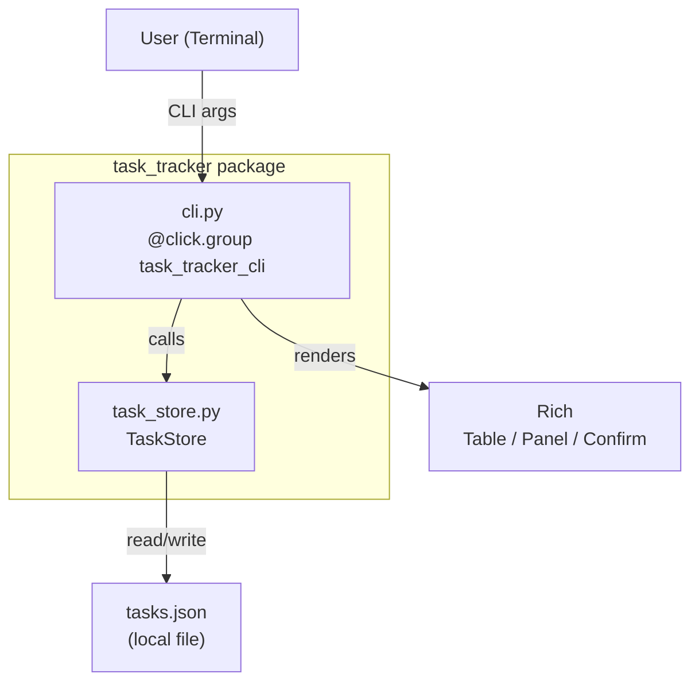
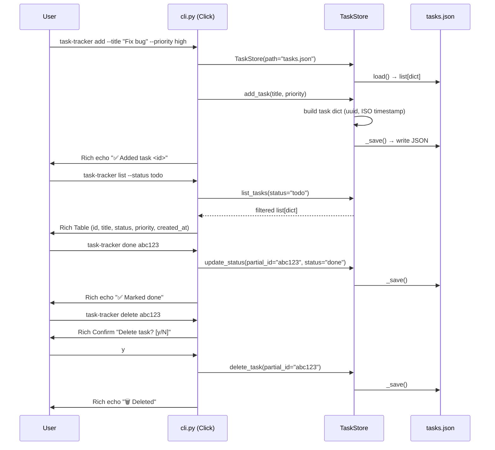
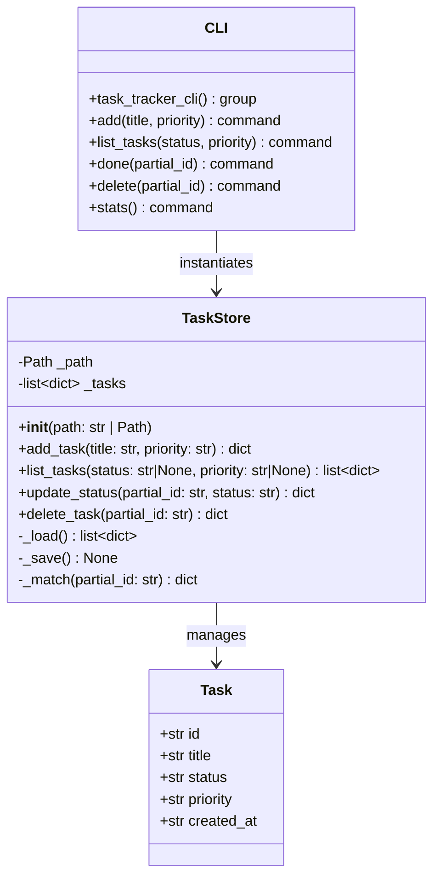
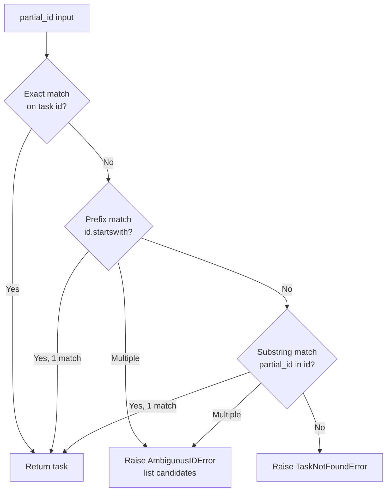

# Python CLI Task Tracker (Click + Rich)

Build a standalone Python CLI task tracker application within the vllm workspace. The tool persists tasks to a local `tasks.json` file and exposes a rich terminal interface via Click commands and Rich-formatted output (tables, panels). The project is fully self-contained under a `task_tracker/` directory with its own package structure, requirements, and test suite.

---

## Design & Architecture

### Overview

The task tracker is a three-layer application: a **data layer** (`task_store.py`) that owns all JSON persistence and in-memory task management, a **CLI layer** (`cli.py`) that maps Click commands to data-layer operations and renders output with Rich, and a **test layer** (`tests/`) that exercises both layers in isolation using `pytest` and Click's `CliRunner`.

Each task is a plain Python `dict` (serialized to/from JSON) with five fields: `id` (UUID4 string), `title` (str), `status` (one of `todo | in_progress | done`), `priority` (one of `low | medium | high`), and `created_at` (ISO-8601 timestamp). The `TaskStore` class is the single source of truth — it loads the JSON file on construction and flushes it after every mutation.

The CLI entry point is registered via `pyproject.toml` (or a lightweight `setup.cfg`) so the tool can be invoked as `task-tracker <command>`. Rich tables are used for `list`, and a Rich `Panel` with a `Table` grid is used for `stats`. Partial-ID matching (prefix or substring) is used for `done` and `delete` to avoid typing full UUIDs.

### Diagrams

#### Architecture / Component Diagram



#### Data Flow / Sequence Diagram



#### Class / Data Model Diagram



#### Flowchart — Partial ID Match Logic



### Directory Structure

```
task_tracker/                  # standalone package root (new directory)
├── task_tracker/
│   ├── __init__.py            # package marker + version
│   ├── task_store.py          # TaskStore class — data layer
│   └── cli.py                 # Click CLI — presentation layer
├── tests/
│   ├── __init__.py
│   ├── test_store.py          # unit tests for TaskStore
│   └── test_cli.py            # integration tests via CliRunner
├── pyproject.toml             # project metadata, deps, entry point
├── requirements.txt           # pinned runtime deps (click, rich)
└── README.md                  # usage instructions
```

### Key Design Decisions

| Decision | Choice | Rationale |
|----------|--------|-----------|
| Persistence format | JSON flat file (`tasks.json`) | Zero dependencies, human-readable, trivially portable |
| Task identity | UUID4 string | Globally unique, no collision risk |
| Partial ID matching | Prefix then substring | Balances convenience vs. ambiguity safety |
| CLI framework | Click | Declarative, composable, has CliRunner for testing |
| Output rendering | Rich Table + Panel | Structured, colorized output with zero boilerplate |
| Status/priority validation | Click `Choice` type | Fails fast at CLI boundary, no validation in store |
| Store path | Configurable via `TASK_TRACKER_FILE` env var (default `~/.task_tracker/tasks.json`) | Allows tests to use temp files without patching |
| Error handling | Custom exceptions `TaskNotFoundError`, `AmbiguousIDError` | Clean separation from Click error handling |

### Technology Stack

- **Runtime/Language:** Python 3.10+
- **CLI Framework:** Click 8.x
- **Terminal Rendering:** Rich 13.x
- **Testing:** pytest 7.x, Click's `CliRunner`
- **Serialization:** stdlib `json`, `uuid`, `datetime`
- **Key Libraries:**
  - `click` — command group, options, arguments, confirmation prompts
  - `rich` — `Table`, `Panel`, `Console`, `Text` for styled output
  - `pytest` — test runner
  - `pytest-cov` — optional coverage reporting

---

## Execution Plan

### Phase 1: Project Setup & Configuration
**Estimated effort:** 0.5–1 hour
**Dependencies:** None

Create the `task_tracker/` directory tree, package metadata, and dependency files. This phase produces only real config and package-marker files — no stub source files.

#### Tasks:
- [ ] Create `task_tracker/` root directory with inner `task_tracker/` package dir and `tests/` dir
- [ ] Create `task_tracker/task_tracker/__init__.py` with `__version__ = "0.1.0"` and package docstring
- [ ] Create `task_tracker/tests/__init__.py` (empty, marks test directory as package)
- [ ] Create `task_tracker/pyproject.toml` with:
  - `[project]` section: name `task-tracker`, version `0.1.0`, requires-python `>=3.10`
  - `[project.dependencies]`: `click>=8.0`, `rich>=13.0`
  - `[project.scripts]`: `task-tracker = "task_tracker.cli:task_tracker_cli"`
  - `[tool.pytest.ini_options]`: `testpaths = ["tests"]`
- [ ] Create `task_tracker/requirements.txt` with pinned runtime deps: `click>=8.0`, `rich>=13.0`
- [ ] Create `task_tracker/requirements-dev.txt` with: `-r requirements.txt`, `pytest>=7.0`, `pytest-cov>=4.0`

#### Deliverables:
- `task_tracker/task_tracker/__init__.py`
- `task_tracker/tests/__init__.py`
- `task_tracker/pyproject.toml`
- `task_tracker/requirements.txt`
- `task_tracker/requirements-dev.txt`

---

### Phase 2: Core Data Layer — `task_store.py`
**Estimated effort:** 1–2 hours
**Dependencies:** Phase 1

Implement the `TaskStore` class with full persistence, filtering, and partial-ID matching. This is the only file that touches `tasks.json`.

#### Tasks:
- [ ] Create `task_tracker/task_tracker/task_store.py` with:
  - Module-level constants: `VALID_STATUSES = ("todo", "in_progress", "done")`, `VALID_PRIORITIES = ("low", "medium", "high")`
  - Custom exceptions at module level:
    - `class TaskNotFoundError(Exception)` — raised when no task matches partial_id
    - `class AmbiguousIDError(Exception)` — raised when multiple tasks match partial_id; stores `candidates: list[str]`
  - `class TaskStore`:
    - `__init__(self, path: str | Path | None = None)`:
      - Resolve path: use `path` arg → `TASK_TRACKER_FILE` env var → `~/.task_tracker/tasks.json`
      - Store as `self._path: Path`
      - Create parent directories with `self._path.parent.mkdir(parents=True, exist_ok=True)`
      - Call `self._tasks = self._load()`
    - `_load(self) -> list[dict]`: read JSON from `self._path` if it exists, else return `[]`; parse with `json.loads`
    - `_save(self) -> None`: write `self._tasks` to `self._path` with `json.dumps(..., indent=2, ensure_ascii=False)`
    - `_match(self, partial_id: str) -> dict`:
      - First try exact match: `[t for t in self._tasks if t["id"] == partial_id]`
      - Then prefix match: `[t for t in self._tasks if t["id"].startswith(partial_id)]`
      - Then substring match: `[t for t in self._tasks if partial_id in t["id"]]`
      - If 0 matches → raise `TaskNotFoundError(f"No task matching '{partial_id}'")`
      - If >1 matches → raise `AmbiguousIDError` with list of matching IDs
      - Return the single match
    - `add_task(self, title: str, priority: str = "medium") -> dict`:
      - Build task dict: `id=str(uuid.uuid4())`, `title=title`, `status="todo"`, `priority=priority`, `created_at=datetime.now(timezone.utc).isoformat()`
      - Append to `self._tasks`, call `self._save()`, return task
    - `list_tasks(self, status: str | None = None, priority: str | None = None) -> list[dict]`:
      - Filter `self._tasks` by `status` if provided, then by `priority` if provided
      - Return filtered list (copy, not reference)
    - `update_status(self, partial_id: str, status: str) -> dict`:
      - Call `self._match(partial_id)` to get task
      - Set `task["status"] = status`, call `self._save()`, return updated task
    - `delete_task(self, partial_id: str) -> dict`:
      - Call `self._match(partial_id)` to get task
      - Remove from `self._tasks`, call `self._save()`, return deleted task
- [ ] Verify syntax: `python -m py_compile task_tracker/task_tracker/task_store.py`

#### Deliverables:
- `task_tracker/task_tracker/task_store.py` — fully implemented `TaskStore` class

---

### Phase 3: CLI Interface — `cli.py`
**Estimated effort:** 1.5–2 hours
**Dependencies:** Phase 2

Implement all five Click commands with Rich-formatted output. Each command instantiates `TaskStore` and delegates to it.

#### Tasks:
- [ ] Create `task_tracker/task_tracker/cli.py` with:
  - Imports: `click`, `rich.console.Console`, `rich.table.Table`, `rich.panel.Panel`, `rich.text.Text`, `os`, `TaskStore`, `TaskNotFoundError`, `AmbiguousIDError`
  - Module-level `console = Console()` singleton
  - Helper `_get_store() -> TaskStore`: returns `TaskStore()` (picks up env var or default path)
  - Helper `_status_color(status: str) -> str`: maps `"todo"→"yellow"`, `"in_progress"→"cyan"`, `"done"→"green"`
  - Helper `_priority_color(priority: str) -> str`: maps `"low"→"blue"`, `"medium"→"yellow"`, `"high"→"red"`
  - `@click.group(name="task-tracker")` → `def task_tracker_cli()`: main group with `help="A simple CLI task tracker."`
  - `@task_tracker_cli.command("add")`:
    - Options: `--title` (required, prompt if missing), `--priority` (type=`click.Choice(["low","medium","high"])`, default `"medium"`, show_default=True)
    - Body: call `store.add_task(title, priority)`, print `console.print(f"[green]✅ Added task[/green] [dim]{task['id']}[/dim]")`
  - `@task_tracker_cli.command("list")`:
    - Options: `--status` (type=`click.Choice(["todo","in_progress","done"])`, default=None), `--priority` (type=`click.Choice(["low","medium","high"])`, default=None)
    - Body:
      - Call `store.list_tasks(status, priority)`
      - If empty: `console.print("[yellow]No tasks found.[/yellow]")`; return
      - Build `rich.table.Table` with columns: `ID` (dim, width=10), `Title`, `Status`, `Priority`, `Created`
      - For each task: add row with colored status/priority using `Text(value, style=color)`
      - `console.print(table)`
  - `@task_tracker_cli.command("done")`:
    - Argument: `partial_id` (required)
    - Body: call `store.update_status(partial_id, "done")`, print success; catch `TaskNotFoundError`/`AmbiguousIDError` → `console.print("[red]Error: ...[/red]")` + `sys.exit(1)`
  - `@task_tracker_cli.command("delete")`:
    - Argument: `partial_id` (required)
    - Body: call `click.confirm(f"Delete task matching '{partial_id}'?", abort=True)`, then `store.delete_task(partial_id)`, print `"[red]🗑 Deleted[/red]"`; catch errors same as `done`
  - `@task_tracker_cli.command("stats")`:
    - Body:
      - Call `store.list_tasks()` to get all tasks
      - Compute counts: `status_counts = {s: 0 for s in VALID_STATUSES}` + fill from tasks; same for `priority_counts`
      - Build a `Table(show_header=True)` grid with two sections (Status counts, Priority counts)
      - Wrap in `Panel(table, title="[bold]Task Statistics[/bold]", border_style="blue")`
      - `console.print(panel)`
  - `if __name__ == "__main__": task_tracker_cli()` guard
- [ ] Verify syntax: `python -m py_compile task_tracker/task_tracker/cli.py`

#### Deliverables:
- `task_tracker/task_tracker/cli.py` — fully implemented CLI with all 5 commands

---

### Phase 4: Testing & Quality Assurance
**Estimated effort:** 1.5–2 hours
**Dependencies:** Phase 2, Phase 3

Write and run all tests for both the data layer and CLI layer.

#### Tasks:
- [ ] Create `task_tracker/tests/test_store.py` with:
  - `import pytest`, `import json`, `import tempfile`, `import os`, `from pathlib import Path`
  - `from task_tracker.task_store import TaskStore, TaskNotFoundError, AmbiguousIDError`
  - `@pytest.fixture` `tmp_store(tmp_path)`: returns `TaskStore(path=tmp_path / "tasks.json")`
  - `test_add_task_returns_dict(tmp_store)`: add task, assert keys `id, title, status, priority, created_at` present; assert `status=="todo"`, `priority=="medium"`
  - `test_add_task_default_priority(tmp_store)`: add without priority, assert `priority=="medium"`
  - `test_add_task_custom_priority(tmp_store)`: add with `priority="high"`, assert stored correctly
  - `test_list_tasks_empty(tmp_store)`: fresh store returns `[]`
  - `test_list_tasks_all(tmp_store)`: add 3 tasks, `list_tasks()` returns 3
  - `test_list_tasks_filter_status(tmp_store)`: add todo + done tasks, filter by `status="todo"` returns only todo
  - `test_list_tasks_filter_priority(tmp_store)`: add low + high tasks, filter by `priority="high"` returns only high
  - `test_list_tasks_combined_filter(tmp_store)`: filter by both status and priority
  - `test_update_status_exact_id(tmp_store)`: add task, update by full id, assert `status=="done"`
  - `test_update_status_partial_id(tmp_store)`: update by first 8 chars of id
  - `test_update_status_not_found(tmp_store)`: raises `TaskNotFoundError`
  - `test_update_status_ambiguous(tmp_store)`: mock two tasks with same prefix → raises `AmbiguousIDError`
  - `test_delete_task(tmp_store)`: add 2 tasks, delete one by partial id, assert 1 remains
  - `test_delete_task_not_found(tmp_store)`: raises `TaskNotFoundError`
  - `test_persistence_across_reload(tmp_path)`: add tasks with one `TaskStore`, create new `TaskStore(same path)`, assert tasks present
  - `test_persistence_save_format(tmp_path)`: after add, read raw JSON file, assert valid JSON array with correct fields

- [ ] Create `task_tracker/tests/test_cli.py` with:
  - `import pytest`, `import json`, `import os`
  - `from click.testing import CliRunner`
  - `from task_tracker.cli import task_tracker_cli`
  - `@pytest.fixture` `runner()`: returns `CliRunner()`
  - `@pytest.fixture` `isolated_store(tmp_path, monkeypatch)`: sets `TASK_TRACKER_FILE` env var to `str(tmp_path / "tasks.json")` via `monkeypatch.setenv`
  - `test_add_command_success(runner, isolated_store)`: invoke `["add", "--title", "Test task", "--priority", "high"]`, assert `exit_code==0`, assert `"Added task"` in output
  - `test_add_command_default_priority(runner, isolated_store)`: invoke without `--priority`, assert exit_code==0
  - `test_add_command_invalid_priority(runner, isolated_store)`: invoke with `--priority invalid`, assert `exit_code!=0`
  - `test_list_command_empty(runner, isolated_store)`: invoke `["list"]`, assert `"No tasks found"` in output
  - `test_list_command_shows_tasks(runner, isolated_store)`: add a task first, then list, assert title in output
  - `test_list_command_filter_status(runner, isolated_store)`: add todo + done tasks, list with `--status todo`, assert only todo title shown
  - `test_list_command_filter_priority(runner, isolated_store)`: add low + high tasks, list with `--priority high`, assert only high title shown
  - `test_done_command(runner, isolated_store)`: add task, get id from output, invoke `["done", id[:8]]`, assert exit_code==0 and `"done"` in output
  - `test_done_command_not_found(runner, isolated_store)`: invoke `["done", "nonexistent"]`, assert exit_code!=0 and error message in output
  - `test_delete_command_confirmed(runner, isolated_store)`: add task, invoke `["delete", id[:8]]` with `input="y\n"`, assert exit_code==0 and `"Deleted"` in output
  - `test_delete_command_aborted(runner, isolated_store)`: invoke delete with `input="n\n"`, assert task still exists
  - `test_stats_command_empty(runner, isolated_store)`: invoke `["stats"]`, assert exit_code==0 and `"todo"` in output
  - `test_stats_command_with_tasks(runner, isolated_store)`: add tasks of various statuses/priorities, invoke `["stats"]`, assert counts appear in output

- [ ] Install dependencies and run tests:
  ```bash
  cd task_tracker
  pip install -e ".[dev]" || pip install -r requirements-dev.txt
  pytest tests/ -v --tb=short
  ```
- [ ] Verify all tests pass (0 failures, 0 errors)
- [ ] Run `python -m py_compile task_tracker/task_tracker/task_store.py task_tracker/task_tracker/cli.py` as final syntax check

#### Deliverables:
- `task_tracker/tests/test_store.py` — 16 test functions for `TaskStore`
- `task_tracker/tests/test_cli.py` — 13 test functions for CLI commands
- All tests passing under `pytest`

---

### Phase 5: Documentation
**Estimated effort:** 0.5 hours
**Dependencies:** Phase 2, Phase 3, Phase 4

Write the README and environment example file.

#### Tasks:
- [ ] Create `task_tracker/README.md` with:
  - Project title and one-line description
  - Installation section: `pip install -e .` or `pip install click rich`
  - Usage section with example invocations for all 5 commands (`add`, `list`, `done`, `delete`, `stats`)
  - Environment variable: `TASK_TRACKER_FILE` to override default storage path
  - Development/testing section: `pip install -r requirements-dev.txt && pytest`
- [ ] Create `task_tracker/.env.example` with: `# TASK_TRACKER_FILE=/path/to/custom/tasks.json`

#### Deliverables:
- `task_tracker/README.md`
- `task_tracker/.env.example`

---

### Verification Criteria

After all phases complete, verify the project works as follows:

**Install:**
```bash
cd task_tracker
pip install -e .
```

**CLI smoke tests (run each command and check output):**
```bash
# Add tasks
task-tracker add --title "Write tests" --priority high
# Expected: "✅ Added task <uuid>" with exit code 0

task-tracker add --title "Fix bug" --priority low
# Expected: "✅ Added task <uuid>" with exit code 0

task-tracker add --title "Review PR"
# Expected: "✅ Added task <uuid>" (default priority=medium) with exit code 0

# List all tasks — should show Rich table with 3 rows
task-tracker list
# Expected: Rich table with columns ID, Title, Status, Priority, Created; 3 rows; exit code 0

# Filter by status
task-tracker list --status todo
# Expected: all 3 tasks (all are todo); exit code 0

task-tracker list --status done
# Expected: "No tasks found." or empty table; exit code 0

# Mark done by partial ID (use first 8 chars of a task UUID)
task-tracker done <first-8-chars-of-uuid>
# Expected: "✅ Marked done" message; exit code 0

# Verify done task appears in done filter
task-tracker list --status done
# Expected: 1 row in table; exit code 0

# Stats panel
task-tracker stats
# Expected: Rich Panel titled "Task Statistics" showing status counts (todo:2, done:1) and priority counts; exit code 0

# Delete with confirmation
task-tracker delete <partial-id>
# Input: y
# Expected: "🗑 Deleted" message; exit code 0

# Delete aborted
task-tracker delete <partial-id>
# Input: n
# Expected: "Aborted" message; exit code 1 (click.Abort)

# Error case: not found
task-tracker done zzzzzzzzz
# Expected: error message containing "No task matching"; exit code 1
```

**Automated tests:**
```bash
cd task_tracker
pytest tests/ -v
# Expected: all tests pass — 0 failures, 0 errors
# Minimum: test_store.py (16 tests) + test_cli.py (13 tests) = 29 tests total
```

**Syntax validation:**
```bash
python -m py_compile task_tracker/task_tracker/task_store.py
python -m py_compile task_tracker/task_tracker/cli.py
# Expected: no output (exit code 0)
```
