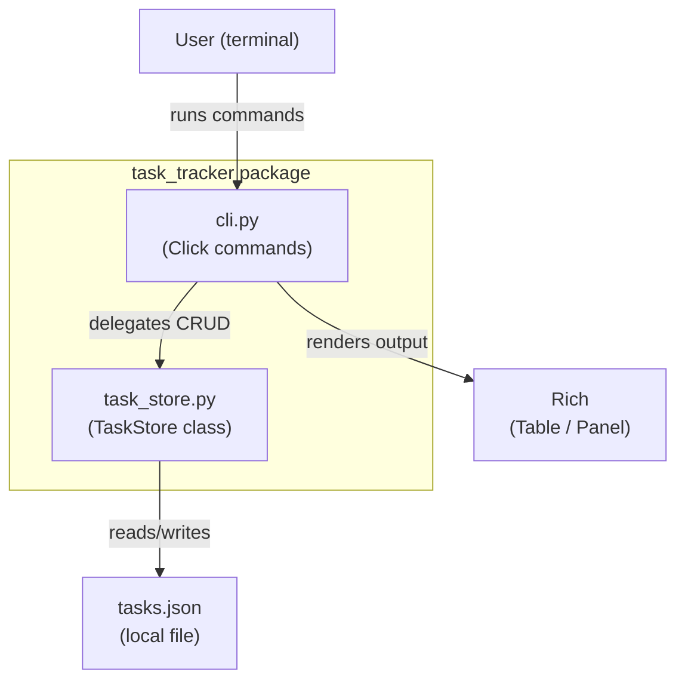
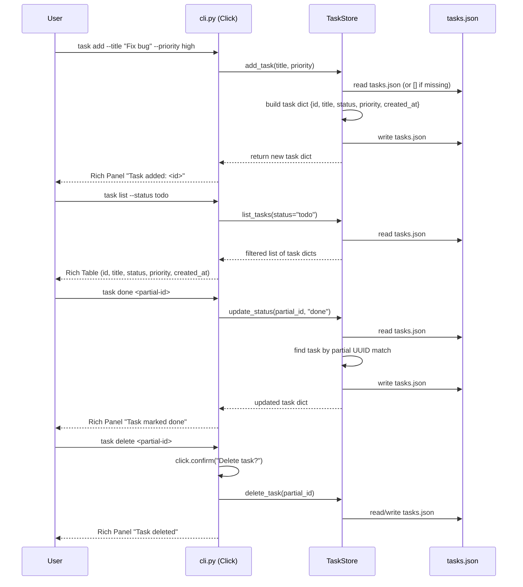
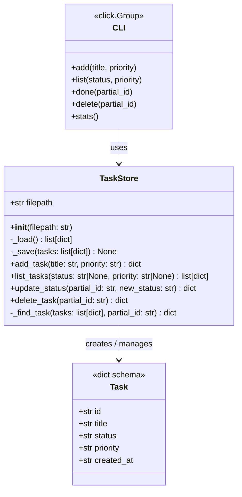
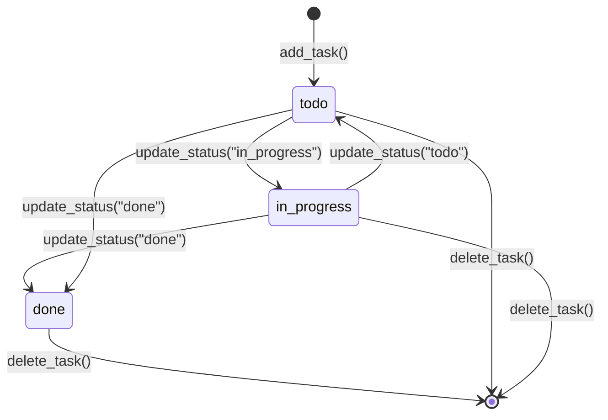

# Python CLI Task Tracker (Click + Rich)

A self-contained command-line task management tool built with Click for the CLI interface and Rich for beautiful terminal output. Tasks are persisted to a local `tasks.json` file and support full CRUD operations with status/priority filtering, partial-ID matching, and summary statistics.

---

## Design & Architecture

### Overview

The project consists of two primary Python modules: `task_store.py` (the data layer) and `cli.py` (the presentation/command layer), plus a `tests/` directory with pytest suites for both. The data layer owns all JSON I/O and business logic (filtering, UUID generation, ISO timestamps). The CLI layer owns all user-facing formatting via Rich tables and panels, and delegates every mutation to `TaskStore`.

`TaskStore` reads the entire `tasks.json` file on each operation and writes it back atomically. This keeps the implementation simple and correct for a single-user CLI tool. Each task is a plain Python `dict` serialised to JSON; no ORM or database is needed. The CLI is registered as a `console_scripts` entry point in `pyproject.toml` so users can invoke it as `task` after installation.

The test suite uses `pytest` with `click.testing.CliRunner` for CLI tests and a `tmp_path` fixture for store tests, ensuring full isolation between test runs.

### Diagrams

#### Architecture / Component Diagram



#### Data Flow / Sequence Diagram



#### Class / Data Model Diagram



#### State Machine — Task Lifecycle



### Directory Structure

```
task_tracker/                   # project root (inside vllm workspace)
├── task_store.py               # TaskStore class — data layer
├── cli.py                      # Click CLI entry point
├── pyproject.toml              # package metadata + entry point + deps
├── tasks.json                  # runtime data file (git-ignored)
├── .gitignore                  # ignore tasks.json, __pycache__, .pytest_cache
└── tests/
    ├── __init__.py
    ├── test_store.py           # pytest tests for TaskStore
    └── test_cli.py             # pytest tests for CLI via CliRunner
```

### Key Design Decisions

| Decision | Choice | Rationale |
|----------|--------|-----------|
| Persistence format | JSON flat file (`tasks.json`) | Zero dependencies, human-readable, trivially portable |
| ID scheme | `uuid.uuid4()` | Globally unique, no collision risk, supports partial matching |
| Partial ID matching | `str.startswith()` on hex UUID | Familiar UX (like git short SHAs); raises `ValueError` on 0 or 2+ matches |
| CLI framework | Click | Declarative decorators, built-in `--help`, `CliRunner` for testing |
| Output rendering | Rich `Table` + `Panel` | Colour-coded, structured output with zero boilerplate |
| Status values | `todo`, `in_progress`, `done` | Minimal, unambiguous workflow states |
| Priority values | `low`, `medium`, `high` | Standard three-tier priority model |
| Entry point | `console_scripts` in `pyproject.toml` | Installable as `task` command via `pip install -e .` |
| Test isolation | `tmp_path` fixture + `CliRunner(mix_stderr=False)` | Each test gets a fresh JSON file; no global state leakage |

### Technology Stack

- **Runtime/Language:** Python 3.10+
- **CLI Framework:** Click 8.x — command groups, options, arguments, confirmation prompts
- **Terminal UI:** Rich 13.x — `Table`, `Panel`, `Console`, colour styles
- **Testing:** pytest 7.x, `click.testing.CliRunner`
- **Standard Library:** `uuid`, `json`, `datetime`, `os`, `pathlib`
- **Package Management:** `pyproject.toml` (PEP 517/518), compatible with the existing vLLM workspace tooling

---

## Execution Plan

### Phase 1: Project Setup & Configuration
**Estimated effort:** 0.5–1 hour
**Dependencies:** None

Create the `task_tracker/` directory at the workspace root and all project-level configuration files needed to make the package installable and testable.

#### Tasks:
- [ ] Create `task_tracker/pyproject.toml` with:
  - `[project]` section: `name = "task-tracker"`, `version = "0.1.0"`, `requires-python = ">=3.10"`, `dependencies = ["click>=8.0", "rich>=13.0"]`
  - `[project.scripts]` entry point: `task = "cli:cli"` (pointing to the `cli` group in `cli.py`)
  - `[project.optional-dependencies]` with `test = ["pytest>=7.0"]`
  - `[build-system]` using `setuptools`
  - `[tool.pytest.ini_options]` with `testpaths = ["tests"]`
- [ ] Create `task_tracker/.gitignore` ignoring `tasks.json`, `__pycache__/`, `.pytest_cache/`, `*.egg-info/`, `dist/`, `.venv/`
- [ ] Create `task_tracker/tests/__init__.py` (empty, marks directory as a package)

#### Deliverables:
- `task_tracker/pyproject.toml` — fully configured package manifest
- `task_tracker/.gitignore`
- `task_tracker/tests/__init__.py`

---

### Phase 2: Core Data Layer — `task_store.py`
**Estimated effort:** 1–2 hours
**Dependencies:** Phase 1

Implement the `TaskStore` class with all persistence and business logic. This module has no dependency on Click or Rich — it is pure Python.

#### Tasks:
- [ ] Create `task_tracker/task_store.py` with the following implementation:
  - **Imports:** `uuid`, `json`, `os`, `datetime` from stdlib only
  - **Constants:** `VALID_STATUSES = ("todo", "in_progress", "done")` and `VALID_PRIORITIES = ("low", "medium", "high")`
  - **`TaskStore.__init__(self, filepath: str = "tasks.json")`** — stores `self.filepath`
  - **`TaskStore._load(self) -> list[dict]`** — reads and JSON-parses `self.filepath`; returns `[]` if file does not exist; raises `json.JSONDecodeError` with a clear message if file is corrupt
  - **`TaskStore._save(self, tasks: list[dict]) -> None`** — writes `tasks` to `self.filepath` with `indent=2` and `ensure_ascii=False`
  - **`TaskStore._find_task(self, tasks: list[dict], partial_id: str) -> dict`** — filters tasks where `t["id"].startswith(partial_id)`; raises `ValueError("No task found matching '{partial_id}'")` if 0 matches; raises `ValueError("Multiple tasks match '{partial_id}' — be more specific")` if 2+ matches; returns the single matching task
  - **`TaskStore.add_task(self, title: str, priority: str = "medium") -> dict`** — validates `priority` against `VALID_PRIORITIES`; builds task dict with `id=str(uuid.uuid4())`, `title=title.strip()`, `status="todo"`, `priority=priority`, `created_at=datetime.datetime.now(datetime.timezone.utc).isoformat()`; appends to loaded list; saves; returns new task
  - **`TaskStore.list_tasks(self, status: str | None = None, priority: str | None = None) -> list[dict]`** — loads tasks; applies optional `status` filter (`t["status"] == status`); applies optional `priority` filter (`t["priority"] == priority`); returns filtered list sorted by `created_at` ascending
  - **`TaskStore.update_status(self, partial_id: str, new_status: str) -> dict`** — validates `new_status` against `VALID_STATUSES`; loads tasks; finds task via `_find_task`; mutates `task["status"] = new_status`; saves; returns updated task
  - **`TaskStore.delete_task(self, partial_id: str) -> dict`** — loads tasks; finds task via `_find_task`; removes it from list; saves; returns deleted task

#### Deliverables:
- `task_tracker/task_store.py` — fully implemented `TaskStore` class with all five public methods

---

### Phase 3: CLI Interface — `cli.py`
**Estimated effort:** 1.5–2 hours
**Dependencies:** Phase 2

Implement the Click CLI with five commands (`add`, `list`, `done`, `delete`, `stats`), using Rich for all terminal output. The `TaskStore` is instantiated with a configurable path so tests can inject a temp file.

#### Tasks:
- [ ] Create `task_tracker/cli.py` with the following implementation:
  - **Imports:** `click`, `rich.console.Console`, `rich.table.Table`, `rich.panel.Panel`, `rich.text.Text`, `task_store.TaskStore`
  - **`console = Console()`** — module-level Rich console instance
  - **`DEFAULT_STORE_PATH = "tasks.json"`** — overridable via `TASK_STORE_PATH` env var using `os.environ.get`
  - **`@click.group()` `def cli()`** — root group with `help="A simple CLI task tracker."`
  - **`_get_store(ctx) -> TaskStore`** — helper that reads `ctx.obj` (the store path) and returns `TaskStore(path)`; the path is set by the group's `@click.pass_context` callback
  - **`@cli.command("add")`** with options:
    - `--title` / `-t`: `required=True`, `help="Task title"`
    - `--priority` / `-p`: `default="medium"`, `type=click.Choice(["low","medium","high"])`, `show_default=True`
    - Calls `store.add_task(title, priority)`; prints a Rich `Panel` with green border showing `"✅ Task added"` and the short ID (first 8 chars of UUID)
  - **`@cli.command("list")`** with options:
    - `--status` / `-s`: `default=None`, `type=click.Choice(["todo","in_progress","done"])`, `help="Filter by status"`
    - `--priority` / `-p`: `default=None`, `type=click.Choice(["low","medium","high"])`, `help="Filter by priority"`
    - Calls `store.list_tasks(status, priority)`; if empty prints `"No tasks found."` via `console.print`; otherwise builds a `rich.table.Table` with columns: `ID` (first 8 chars), `Title`, `Status`, `Priority`, `Created`; colour-codes `Status` column (`todo`=yellow, `in_progress`=blue, `done`=green) and `Priority` column (`high`=red, `medium`=yellow, `low`=cyan); prints table via `console.print`
  - **`@cli.command("done")`** with argument:
    - `partial_id`: `click.argument("partial_id")`
    - Calls `store.update_status(partial_id, "done")`; prints Rich `Panel` with green border `"✅ Task marked as done: <title>"`; catches `ValueError` and prints error via `console.print("[red]Error: ...[/red]")` then `sys.exit(1)`
  - **`@cli.command("delete")`** with argument:
    - `partial_id`: `click.argument("partial_id")`
    - Uses `click.confirm(f"Delete task '{partial_id}'?", abort=True)` for confirmation
    - Calls `store.delete_task(partial_id)`; prints Rich `Panel` with red border `"🗑️  Task deleted: <title>"`; catches `ValueError` and prints error then `sys.exit(1)`
  - **`@cli.command("stats")`**:
    - Calls `store.list_tasks()` to get all tasks
    - Computes counts: `by_status = {s: 0 for s in VALID_STATUSES}` and `by_priority = {p: 0 for p in VALID_PRIORITIES}`, then iterates tasks to populate
    - Builds a multi-line `rich.text.Text` string with status counts (colour-coded) and priority counts (colour-coded)
    - Wraps in `rich.panel.Panel` with title `"📊 Task Statistics"` and border style `"bold blue"`; prints via `console.print`
  - **`if __name__ == "__main__": cli()`** at module bottom
  - **Context object pattern:** use `@cli.result_callback()` or `@cli.group(invoke_without_command=True)` with `@click.pass_context` to inject `TaskStore` path; alternatively, each command instantiates `TaskStore(os.environ.get("TASK_STORE_PATH", "tasks.json"))` directly — use the simpler direct instantiation approach for testability

#### Deliverables:
- `task_tracker/cli.py` — fully implemented Click CLI with all five commands and Rich output

---

### Phase 4: Testing & Quality Assurance
**Estimated effort:** 1.5–2 hours
**Dependencies:** Phase 2, Phase 3

Write and run the full pytest test suite covering both the data layer and the CLI layer.

#### Tasks:
- [ ] Create `task_tracker/tests/test_store.py` with the following tests:
  - **`test_add_task_creates_task(tmp_path)`** — calls `store.add_task("Buy milk", "high")`; asserts returned dict has keys `id`, `title`, `status`, `priority`, `created_at`; asserts `status == "todo"`, `priority == "high"`, `title == "Buy milk"`
  - **`test_add_task_default_priority(tmp_path)`** — calls `store.add_task("Task")`; asserts `priority == "medium"`
  - **`test_add_task_invalid_priority(tmp_path)`** — calls `store.add_task("Task", "urgent")`; asserts `ValueError` is raised
  - **`test_add_task_persists(tmp_path)`** — adds a task, creates a new `TaskStore` instance pointing to the same file, calls `list_tasks()`; asserts the task is present (tests persistence across save/load)
  - **`test_list_tasks_empty(tmp_path)`** — fresh store; `list_tasks()` returns `[]`
  - **`test_list_tasks_all(tmp_path)`** — adds 3 tasks; `list_tasks()` returns all 3
  - **`test_list_tasks_filter_status(tmp_path)`** — adds tasks with different statuses; `list_tasks(status="todo")` returns only todo tasks
  - **`test_list_tasks_filter_priority(tmp_path)`** — adds tasks with different priorities; `list_tasks(priority="high")` returns only high-priority tasks
  - **`test_list_tasks_filter_combined(tmp_path)`** — adds 4 tasks with varied status/priority; `list_tasks(status="todo", priority="high")` returns only matching tasks
  - **`test_update_status_valid(tmp_path)`** — adds task, calls `update_status(partial_id, "done")`; asserts returned task has `status == "done"`; reloads and verifies persistence
  - **`test_update_status_invalid_status(tmp_path)`** — calls `update_status(partial_id, "blocked")`; asserts `ValueError`
  - **`test_update_status_no_match(tmp_path)`** — calls `update_status("zzzzz", "done")`; asserts `ValueError` with "No task found"
  - **`test_update_status_ambiguous(tmp_path)`** — adds two tasks; calls `update_status("")` (empty prefix matches both); asserts `ValueError` with "Multiple tasks"
  - **`test_delete_task(tmp_path)`** — adds task, deletes it; `list_tasks()` returns `[]`; returned dict matches deleted task
  - **`test_delete_task_no_match(tmp_path)`** — asserts `ValueError` on missing partial ID
  - **`test_persistence_across_instances(tmp_path)`** — adds 2 tasks via instance A, deletes 1 via instance B, lists via instance C; asserts 1 task remains
  - **Fixture:** `@pytest.fixture def store(tmp_path): return TaskStore(str(tmp_path / "tasks.json"))`

- [ ] Create `task_tracker/tests/test_cli.py` with the following tests using `click.testing.CliRunner`:
  - **`runner` fixture:** `CliRunner(mix_stderr=False)`
  - **`store_path` fixture:** `tmp_path / "tasks.json"` — passed to CLI via `TASK_STORE_PATH` env var
  - **`invoke` helper:** `runner.invoke(cli, args, env={"TASK_STORE_PATH": str(store_path)}, catch_exceptions=False)`
  - **`test_add_command_success`** — invokes `["add", "--title", "My task"]`; asserts `exit_code == 0`; asserts `"Task added"` in output
  - **`test_add_command_with_priority`** — invokes `["add", "--title", "Urgent", "--priority", "high"]`; asserts exit 0 and output contains "added"
  - **`test_add_command_missing_title`** — invokes `["add"]`; asserts `exit_code != 0` (Click missing required option)
  - **`test_add_command_invalid_priority`** — invokes `["add", "--title", "X", "--priority", "critical"]`; asserts `exit_code != 0`
  - **`test_list_empty`** — invokes `["list"]`; asserts exit 0 and "No tasks found" in output
  - **`test_list_shows_tasks`** — adds a task, invokes `["list"]`; asserts task title appears in output
  - **`test_list_filter_status`** — adds todo and done tasks; invokes `["list", "--status", "todo"]`; asserts only todo task title in output
  - **`test_list_filter_priority`** — adds high and low tasks; invokes `["list", "--priority", "high"]`; asserts only high task in output
  - **`test_done_command`** — adds task, gets its ID, invokes `["done", id[:8]]`; asserts exit 0 and "done" in output; verifies via `list --status done`
  - **`test_done_command_no_match`** — invokes `["done", "zzzzzzz"]`; asserts `exit_code != 0` and "Error" in output
  - **`test_delete_command`** — adds task, invokes `["delete", id[:8]]` with `input="y\n"`; asserts exit 0 and "deleted" in output; verifies task gone via list
  - **`test_delete_command_abort`** — invokes `["delete", id[:8]]` with `input="n\n"`; asserts task still exists
  - **`test_delete_command_no_match`** — invokes `["delete", "zzzzzzz"]` with `input="y\n"`; asserts `exit_code != 0`
  - **`test_stats_empty`** — invokes `["stats"]`; asserts exit 0 and "Statistics" in output and "todo: 0" (or equivalent) in output
  - **`test_stats_with_tasks`** — adds 2 todo, 1 done; invokes `["stats"]`; asserts counts appear in output
  - **`test_help`** — invokes `["--help"]`; asserts exit 0 and "task tracker" (case-insensitive) in output

- [ ] Run the full test suite from `task_tracker/` directory:
  ```
  cd task_tracker && python -m pytest tests/ -v
  ```
- [ ] Verify all tests pass (0 failures, 0 errors)
- [ ] Fix any failures discovered during the run

#### Deliverables:
- `task_tracker/tests/test_store.py` — 16 passing tests for `TaskStore`
- `task_tracker/tests/test_cli.py` — 16 passing tests for CLI commands
- All 32+ tests passing under `pytest`

---

### Phase 5: Documentation
**Estimated effort:** 0.5 hours
**Dependencies:** Phase 2, Phase 3, Phase 4

#### Tasks:
- [ ] Create `task_tracker/README.md` with:
  - Project title and one-line description
  - **Installation** section: `pip install -e .` from `task_tracker/` directory
  - **Usage** section with example invocations for all 5 commands (`task add`, `task list`, `task list --status todo`, `task done <id>`, `task delete <id>`, `task stats`)
  - **Data storage** note: tasks stored in `tasks.json` in the current working directory; override with `TASK_STORE_PATH` env var
  - **Running tests** section: `pytest tests/ -v`
- [ ] Create `task_tracker/.env.example` with `TASK_STORE_PATH=./tasks.json`

#### Deliverables:
- `task_tracker/README.md`
- `task_tracker/.env.example`

---

### Verification Criteria

After all phases are complete, verify the project works as follows:

**Installation:**
```bash
cd task_tracker
pip install -e ".[test]"
```
Expected: installs without errors; `task --help` is available in PATH.

**CLI smoke tests (run in order):**
```bash
# 1. Help
task --help
# Expected: exit 0, output contains "A simple CLI task tracker"

# 2. Add tasks
task add --title "Write tests" --priority high
# Expected: exit 0, output contains "Task added"

task add --title "Fix linting" --priority low
# Expected: exit 0, output contains "Task added"

task add --title "Deploy to prod"
# Expected: exit 0, output contains "Task added" (default priority=medium)

# 3. List all
task list
# Expected: exit 0, Rich table with 3 rows showing all tasks

# 4. Filter by status
task list --status todo
# Expected: exit 0, all 3 tasks shown (all are todo)

# 5. Filter by priority
task list --priority high
# Expected: exit 0, only "Write tests" shown

# 6. Mark done (use first 8 chars of the "Write tests" task ID)
task done <partial-id>
# Expected: exit 0, output contains "marked as done"

# 7. Stats
task stats
# Expected: exit 0, Rich panel showing "todo: 2", "done: 1", priority counts

# 8. Delete with confirmation
task delete <partial-id>
# (type 'y' when prompted)
# Expected: exit 0, output contains "Task deleted"

# 9. List after delete
task list
# Expected: exit 0, 2 tasks remaining

# 10. Invalid priority
task add --title "Bad" --priority critical
# Expected: exit non-zero, error message about invalid choice

# 11. Done on non-existent ID
task done zzzzzzz
# Expected: exit non-zero, output contains "Error" or "No task found"
```

**Automated test suite:**
```bash
cd task_tracker
pytest tests/ -v
```
Expected: **all tests pass** (32+ tests, 0 failures, 0 errors).

**Specific test counts to verify:**
- `tests/test_store.py`: 16 tests, all PASSED
- `tests/test_cli.py`: 16 tests, all PASSED
