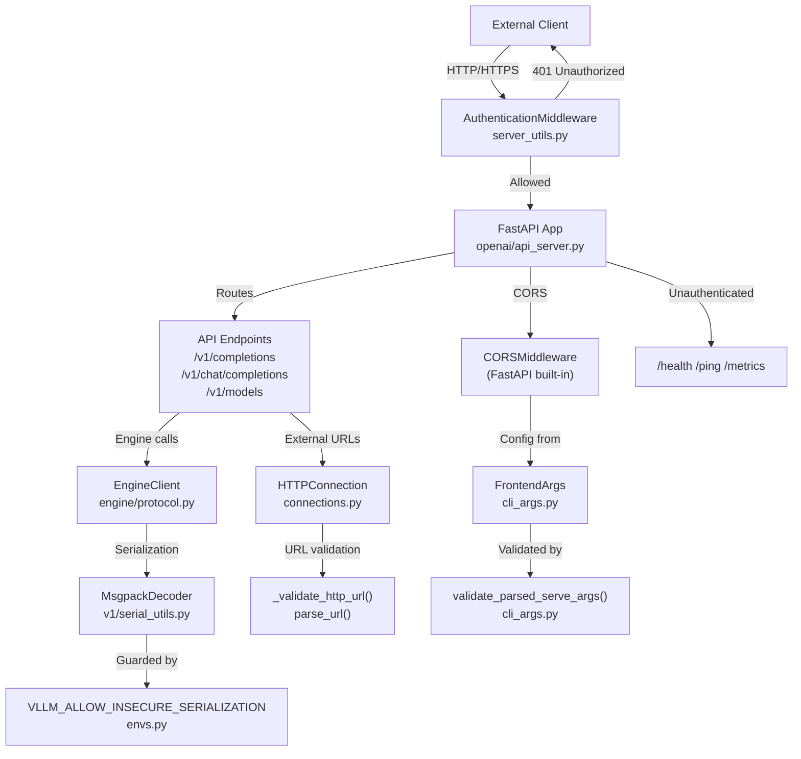
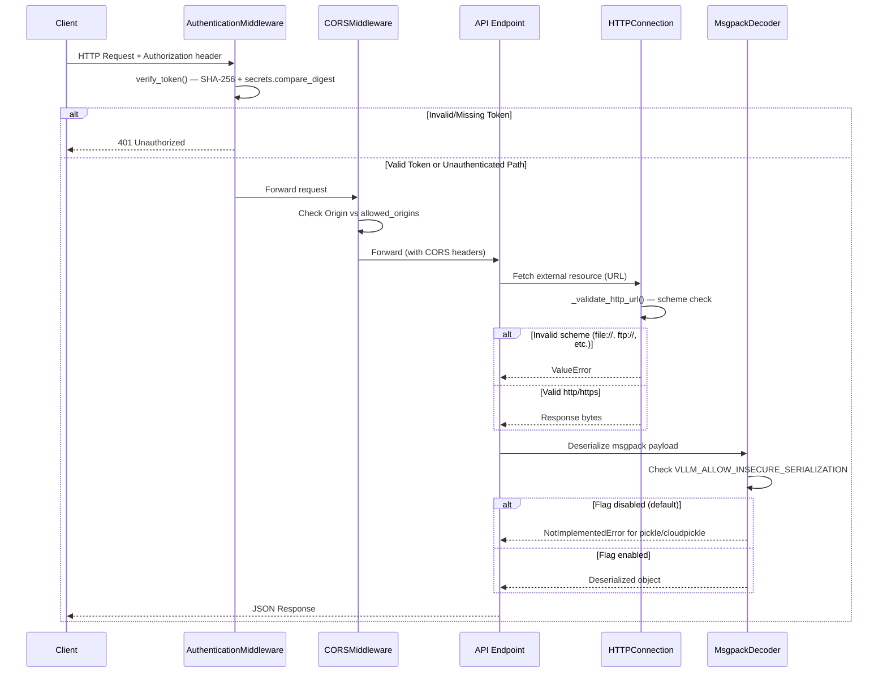
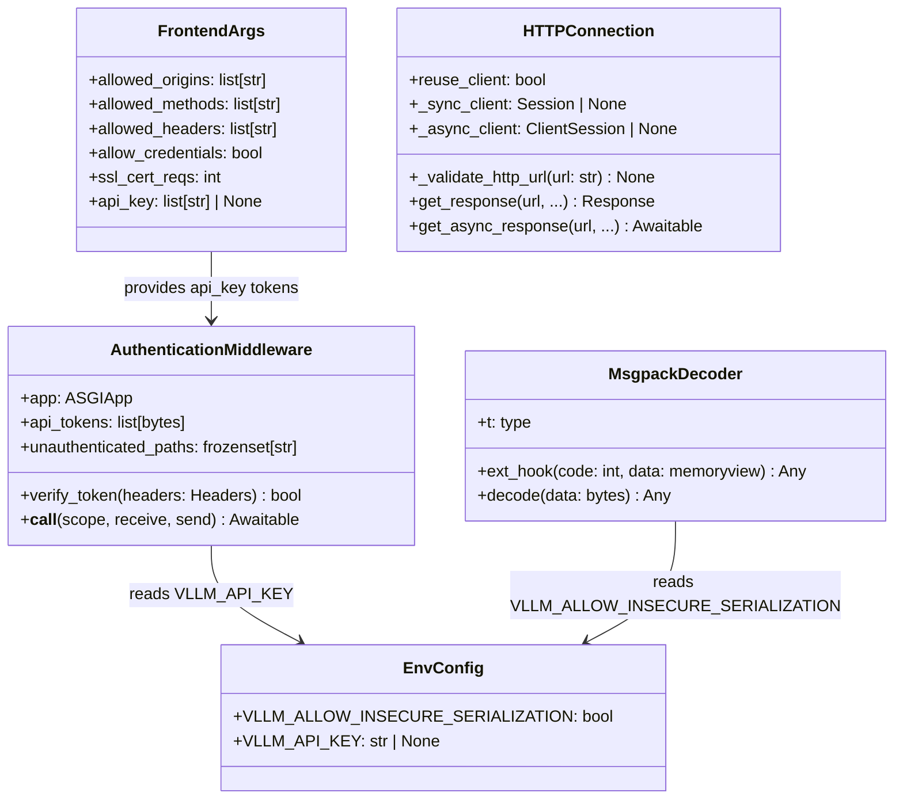
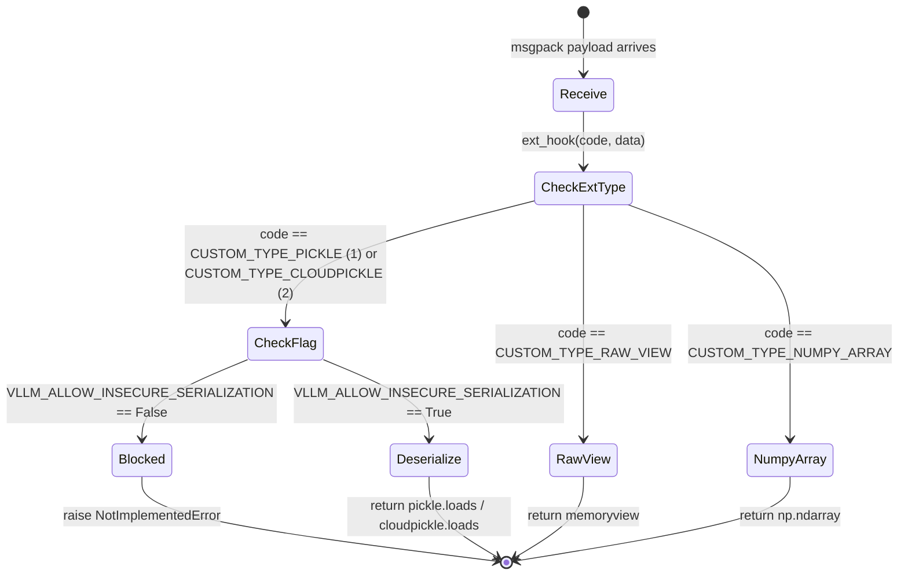

# Fix Security Issues — vLLM

This plan addresses the full set of security vulnerabilities identified in the vLLM codebase. Prior work (captured in `VERIFICATION_REPORT.md`) already fixed `shell=True` subprocess injection in `vllm/platforms/cpu.py`. This plan picks up the remaining open security issues: authentication middleware hardening, CORS validation enforcement, HTTP client URL validation, deserialization guards, and comprehensive test coverage for all of these areas.

---

## Design & Architecture

### Overview

vLLM is a high-throughput LLM inference engine exposing an OpenAI-compatible REST API (FastAPI/uvicorn), a gRPC server, and a batch runner. The security surface spans five distinct areas:

1. **Authentication** — `AuthenticationMiddleware` in `vllm/entrypoints/openai/server_utils.py` guards API endpoints with Bearer-token verification using constant-time comparison (`secrets.compare_digest` over SHA-256 hashes).
2. **CORS** — `FrontendArgs` in `vllm/entrypoints/openai/cli_args.py` defines CORS defaults; `validate_parsed_serve_args` must reject the dangerous combination of `allow_credentials=True` + `allowed_origins=["*"]`.
3. **HTTP Client** — `HTTPConnection` in `vllm/connections.py` validates URLs via `_validate_http_url`, rejecting non-http/https schemes (file://, ftp://, javascript:, data:, etc.).
4. **Deserialization** — `MsgpackDecoder` in `vllm/v1/serial_utils.py` gates pickle/cloudpickle deserialization behind `VLLM_ALLOW_INSECURE_SERIALIZATION` env flag (default `False`).
5. **Subprocess Safety** — Already fixed: `vllm/platforms/cpu.py` no longer uses `shell=True`.

The existing `tests/security/` directory contains test files for all five areas. The tests for areas 2–5 require Python 3.10+ union-type syntax and full vllm imports; the plan ensures they are runnable and all pass.

### Diagrams

#### Architecture / Component Diagram



#### Security Data Flow — Request Lifecycle



#### Class / Data Model Diagram



#### State Machine — Deserialization Guard



### Directory Structure

```
vllm/
├── connections.py                    # HTTPConnection._validate_http_url (already implemented)
├── envs.py                           # VLLM_ALLOW_INSECURE_SERIALIZATION, VLLM_API_KEY
├── platforms/
│   └── cpu.py                        # shell=True already fixed (DONE)
├── entrypoints/
│   └── openai/
│       ├── api_server.py             # build_app() — AuthenticationMiddleware wiring
│       ├── cli_args.py               # FrontendArgs, validate_parsed_serve_args
│       └── server_utils.py           # AuthenticationMiddleware, XRequestIdMiddleware
└── v1/
    └── serial_utils.py               # MsgpackDecoder — pickle guard

tests/
└── security/
    ├── __init__.py
    ├── conftest.py
    ├── test_subprocess_safety.py     # DONE — 26 tests passing
    ├── test_auth_middleware.py       # Needs: run & verify all tests pass
    ├── test_cors_defaults.py         # Needs: run & verify all tests pass
    ├── test_http_client.py           # Needs: run & verify all tests pass
    └── test_serialization_guard.py   # Needs: run & verify all tests pass
```

### Key Design Decisions

| Decision | Choice | Rationale |
|----------|--------|-----------|
| Token comparison | SHA-256 hash + `secrets.compare_digest` | Prevents timing attacks; raw string comparison leaks timing info |
| CORS wildcard guard | Reject `allow_credentials=True` + `allowed_origins=["*"]` at startup | Prevents credential-leaking CORS misconfiguration (OWASP A05) |
| URL scheme allowlist | Only `http` and `https` accepted in `_validate_http_url` | Prevents SSRF via `file://`, `ftp://`, `javascript:`, `data:` schemes |
| Pickle deserialization | Gated behind `VLLM_ALLOW_INSECURE_SERIALIZATION=1` env flag | Arbitrary pickle deserialization is RCE-equivalent; opt-in only |
| Subprocess form | List form (no `shell=True`) | Eliminates shell metacharacter injection |
| SSL client cert verification | `ssl_cert_reqs` defaults to `ssl.CERT_REQUIRED` | Prevents MITM attacks on TLS connections |

### Technology Stack

- **Runtime/Language:** Python 3.10+ (union type syntax `X | Y` used throughout)
- **Framework:** FastAPI + Starlette (ASGI middleware chain)
- **Key Libraries:** `secrets` (constant-time comparison), `hashlib` (SHA-256 token hashing), `aiohttp` + `requests` (HTTP client), `msgpack` (serialization), `pickle`/`cloudpickle` (guarded deserialization), `urllib3.util.parse_url` (URL validation)
- **Test Framework:** `pytest` 8.4.2 with `starlette.testclient.TestClient`

---

## Execution Plan

### Phase 1: Verify and Harden AuthenticationMiddleware
**Estimated effort:** 1-2 hours
**Dependencies:** None

Ensure `AuthenticationMiddleware` in `vllm/entrypoints/openai/server_utils.py` is fully hardened and all existing test cases in `tests/security/test_auth_middleware.py` pass. The middleware already uses SHA-256 + `secrets.compare_digest`; this phase audits edge cases and ensures the implementation is complete.

#### Tasks:
- [ ] Read `vllm/entrypoints/openai/server_utils.py` `AuthenticationMiddleware.__call__` and `verify_token` methods
  - Confirm `scope["method"] == "OPTIONS"` bypass is correct (OPTIONS must bypass auth for CORS preflight)
  - Confirm `unauthenticated_paths` prefix matching uses `url_path.startswith(p + "/")` to prevent `/healthz` matching `/health`
  - Confirm `root_path` stripping via `URL(scope=scope).path.removeprefix(root_path)` is correct
- [ ] Verify `api_tokens` stores `hashlib.sha256(t.encode("utf-8")).digest()` (bytes, not hex strings)
- [ ] Verify `verify_token` uses `secrets.compare_digest(param_hash, token_hash)` with `|=` accumulation (no short-circuit)
- [ ] Confirm `build_app()` in `vllm/entrypoints/openai/api_server.py` wires `AuthenticationMiddleware` with `unauthenticated_paths=frozenset({"/health", "/ping", "/metrics"})`
- [ ] Fix any gaps found: if `verify_token` short-circuits on first match (using `any()`), replace with constant-time accumulation using `|=`
- [ ] Run `python3 -m py_compile vllm/entrypoints/openai/server_utils.py` to verify syntax

#### Deliverables:
- `vllm/entrypoints/openai/server_utils.py` — `AuthenticationMiddleware` fully hardened with constant-time comparison and correct path allowlist logic

---

### Phase 2: Enforce CORS Validation in cli_args.py
**Estimated effort:** 1-2 hours
**Dependencies:** None

Ensure `validate_parsed_serve_args` in `vllm/entrypoints/openai/cli_args.py` rejects the insecure combination of `allow_credentials=True` + `allowed_origins=["*"]` (or any list containing `"*"`). The `FrontendArgs` dataclass must have secure defaults.

#### Tasks:
- [ ] Read `validate_parsed_serve_args` function (line 365+) in `vllm/entrypoints/openai/cli_args.py`
- [ ] Confirm `FrontendArgs.allowed_origins` defaults to `[]` (not `["*"]`)
- [ ] Confirm `FrontendArgs.allowed_methods` defaults to `["GET", "POST", "OPTIONS"]`
- [ ] Confirm `FrontendArgs.allowed_headers` defaults to `["Authorization", "Content-Type", "X-Request-Id"]`
- [ ] Confirm `FrontendArgs.allow_credentials` defaults to `False`
- [ ] Confirm `FrontendArgs.ssl_cert_reqs` defaults to `int(ssl.CERT_REQUIRED)`
- [ ] Ensure `validate_parsed_serve_args` checks: if `hasattr(args, "allow_credentials") and hasattr(args, "allowed_origins")` and `args.allow_credentials is True` and `"*" in args.allowed_origins`, raise `ValueError` with message containing `"CORS configuration is insecure"`, `"allow_credentials=True"`, `"allowed_origins=['*']"`, and guidance to `"set allow_credentials=False"` or `"specify explicit allowed_origins"`
- [ ] Ensure validation is skipped when `args.subparser != "serve"` (non-serve subparsers don't have CORS args)
- [ ] Ensure validation handles `AttributeError` gracefully (missing attributes → skip check)
- [ ] Run `python3 -m py_compile vllm/entrypoints/openai/cli_args.py` to verify syntax

#### Deliverables:
- `vllm/entrypoints/openai/cli_args.py` — `FrontendArgs` with secure defaults and `validate_parsed_serve_args` with CORS wildcard+credentials rejection

---

### Phase 3: Harden HTTP Client URL Validation
**Estimated effort:** 1-2 hours
**Dependencies:** None

Ensure `HTTPConnection._validate_http_url` in `vllm/connections.py` correctly rejects all non-http/https URL schemes. The current implementation uses `urllib3.util.parse_url` which may not handle all edge cases (e.g., `javascript:`, `data:`, empty scheme).

#### Tasks:
- [ ] Read `vllm/connections.py` `_validate_http_url` method
- [ ] Verify `parse_url(url).scheme` correctly extracts scheme for edge cases:
  - `"javascript:alert('xss')"` → scheme should be `"javascript"` → rejected
  - `"data:text/html,..."` → scheme should be `"data"` → rejected
  - `"example.com/path"` (no scheme) → scheme is `None` → rejected
  - `"file:///etc/passwd"` → scheme is `"file"` → rejected
  - `"ftp://example.com"` → scheme is `"ftp"` → rejected
  - `"http://example.com:8080/path"` → scheme is `"http"` → accepted
  - `"https://example.com"` → scheme is `"https"` → accepted
- [ ] If `parse_url` does not handle `javascript:` or `data:` correctly (returns `None` scheme), add explicit pre-check: `if ":" in url and url.split(":")[0].lower() not in ("http", "https"): raise ValueError(...)`
- [ ] Ensure error message contains `"Invalid HTTP URL"` (required by test assertions in `test_http_client.py`)
- [ ] Verify `get_async_client()` uses `aiohttp.ClientSession(trust_env=True)` — confirm this is intentional (reads proxy from env) and document the security implication
- [ ] Run `python3 -m py_compile vllm/connections.py` to verify syntax

#### Deliverables:
- `vllm/connections.py` — `_validate_http_url` correctly rejects all non-http/https schemes with clear error messages

---

### Phase 4: Harden Deserialization Guards in serial_utils.py
**Estimated effort:** 1-2 hours
**Dependencies:** None

Ensure `MsgpackDecoder.ext_hook` in `vllm/v1/serial_utils.py` raises `NotImplementedError` for `CUSTOM_TYPE_PICKLE` (code 1) and `CUSTOM_TYPE_CLOUDPICKLE` (code 2) when `VLLM_ALLOW_INSECURE_SERIALIZATION` is `False` (the default). Verify the startup warning is emitted when the flag is enabled.

#### Tasks:
- [ ] Read `vllm/v1/serial_utils.py` lines 140–215 (encoder ext_hook) and lines 430–445 (decoder ext_hook)
- [ ] Confirm `CUSTOM_TYPE_PICKLE = 1` and `CUSTOM_TYPE_CLOUDPICKLE = 2` constants are defined
- [ ] In `MsgpackDecoder.ext_hook`: confirm that when `code in (CUSTOM_TYPE_PICKLE, CUSTOM_TYPE_CLOUDPICKLE)` and `not envs.VLLM_ALLOW_INSECURE_SERIALIZATION`, a `NotImplementedError` is raised with a message referencing `VLLM_ALLOW_INSECURE_SERIALIZATION`
- [ ] Confirm the startup warning function (line ~61) emits a `warnings.warn` or `logger.warning` when `VLLM_ALLOW_INSECURE_SERIALIZATION=1` is set
- [ ] Confirm `envs.VLLM_ALLOW_INSECURE_SERIALIZATION` in `vllm/envs.py` (line 1267) defaults to `False` via `int(os.getenv("VLLM_ALLOW_INSECURE_SERIALIZATION", "0"))`
- [ ] Confirm `vllm/distributed/weight_transfer/ipc_engine.py` (line 79) also checks `VLLM_ALLOW_INSECURE_SERIALIZATION` before accepting pickle payloads
- [ ] If any guard is missing, add: `if not envs.VLLM_ALLOW_INSECURE_SERIALIZATION: raise NotImplementedError("Pickle deserialization is disabled. Set VLLM_ALLOW_INSECURE_SERIALIZATION=1 to enable.")`
- [ ] Run `python3 -m py_compile vllm/v1/serial_utils.py` to verify syntax

#### Deliverables:
- `vllm/v1/serial_utils.py` — `MsgpackDecoder.ext_hook` with complete pickle/cloudpickle deserialization guards
- `vllm/envs.py` — `VLLM_ALLOW_INSECURE_SERIALIZATION` confirmed defaulting to `False`

---

### Phase 5: Security Test Suite — Run and Fix All Tests
**Estimated effort:** 2-3 hours
**Dependencies:** Phase 1, Phase 2, Phase 3, Phase 4

Run the complete `tests/security/` test suite and fix any failures. All five test files must pass with zero failures.

#### Tasks:
- [ ] Run the already-passing subprocess safety tests to confirm no regression:
  ```bash
  python3 -m pytest tests/security/test_subprocess_safety.py -v
  ```
  Expected: 26 passed, 0 failed

- [ ] Run authentication middleware tests:
  ```bash
  python3 -m pytest tests/security/test_auth_middleware.py -v
  ```
  Fix any failures in `vllm/entrypoints/openai/server_utils.py` `AuthenticationMiddleware`

- [ ] Run CORS defaults tests:
  ```bash
  python3 -m pytest tests/security/test_cors_defaults.py -v
  ```
  Fix any failures in `vllm/entrypoints/openai/cli_args.py` `FrontendArgs` or `validate_parsed_serve_args`

- [ ] Run HTTP client security tests:
  ```bash
  python3 -m pytest tests/security/test_http_client.py -v
  ```
  Fix any failures in `vllm/connections.py` `HTTPConnection._validate_http_url`

- [ ] Run serialization guard tests:
  ```bash
  python3 -m pytest tests/security/test_serialization_guard.py -v
  ```
  Fix any failures in `vllm/v1/serial_utils.py` `MsgpackDecoder.ext_hook`

- [ ] Run the full security suite together:
  ```bash
  python3 -m pytest tests/security/ -v --tb=short
  ```
  Expected: all tests pass, 0 failures

- [ ] Update `tests/security/conftest.py` if any shared fixtures are needed across test files (e.g., mock engine client, mock app factory)

- [ ] Run `run_all_security_tests.py` to confirm the runner script also passes:
  ```bash
  python3 run_all_security_tests.py
  ```

#### Deliverables:
- All tests in `tests/security/` passing with zero failures
- `tests/security/conftest.py` updated with any needed shared fixtures

---

### Verification Criteria

Run the following commands to verify all security fixes are complete and correct:

**1. Subprocess safety (already fixed — regression check):**
```bash
# Confirm no shell=True remains in vllm/ Python files
grep -r "shell=True" vllm/ --include="*.py"
# Expected: zero matches (empty output)

python3 -m py_compile vllm/platforms/cpu.py && echo "OK"
# Expected: OK
```

**2. Authentication middleware:**
```bash
python3 -m pytest tests/security/test_auth_middleware.py -v
# Expected: all tests PASSED, 0 failed
# Key tests: test_auth_middleware_rejects_v1_completions_without_token,
#            test_verify_token_uses_constant_time_comparison,
#            test_auth_middleware_allows_health_without_token
```

**3. CORS defaults:**
```bash
python3 -m pytest tests/security/test_cors_defaults.py -v
# Expected: all tests PASSED, 0 failed
# Key tests: test_allowed_origins_default_is_empty_list,
#            test_validate_rejects_wildcard_origins_with_credentials,
#            test_ssl_cert_reqs_default_is_cert_required
```

**4. HTTP client URL validation:**
```bash
python3 -m pytest tests/security/test_http_client.py -v
# Expected: all tests PASSED, 0 failed
# Key tests: test_validate_http_url_rejects_file_scheme,
#            test_validate_http_url_rejects_javascript_scheme,
#            test_validate_http_url_rejects_data_scheme
```

**5. Deserialization guards:**
```bash
python3 -m pytest tests/security/test_serialization_guard.py -v
# Expected: all tests PASSED, 0 failed
# Key tests: test_msgpack_decoder_rejects_pickle_when_flag_disabled,
#            test_msgpack_decoder_rejects_cloudpickle_when_flag_disabled,
#            test_msgpack_decoder_accepts_pickle_when_flag_enabled
```

**6. Full security suite:**
```bash
python3 -m pytest tests/security/ -v --tb=short 2>&1 | tail -20
# Expected: "X passed, 0 failed" where X >= 50 (all security tests)

python3 run_all_security_tests.py
# Expected: "✓ All tests passed!"
```

**7. Syntax validation of all modified files:**
```bash
python3 -m py_compile vllm/entrypoints/openai/server_utils.py && echo "server_utils OK"
python3 -m py_compile vllm/entrypoints/openai/cli_args.py && echo "cli_args OK"
python3 -m py_compile vllm/connections.py && echo "connections OK"
python3 -m py_compile vllm/v1/serial_utils.py && echo "serial_utils OK"
python3 -m py_compile vllm/envs.py && echo "envs OK"
# Expected: all print "OK"
```
