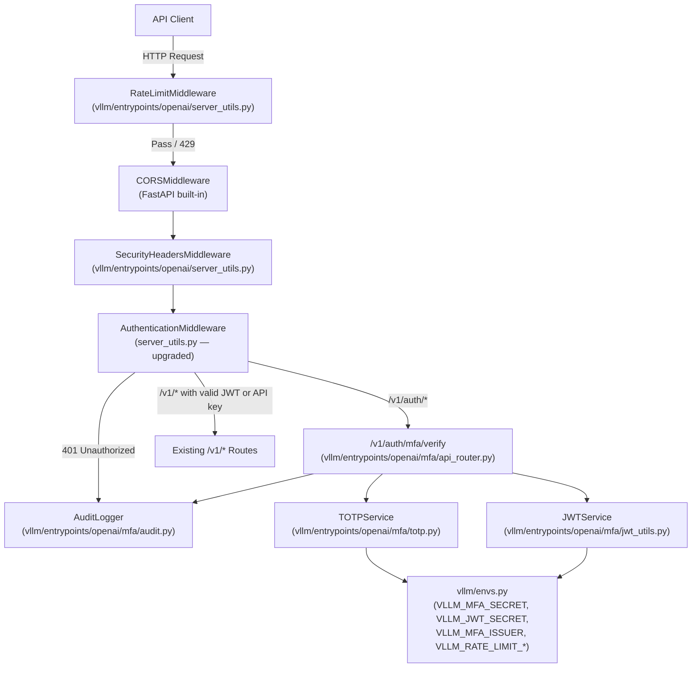
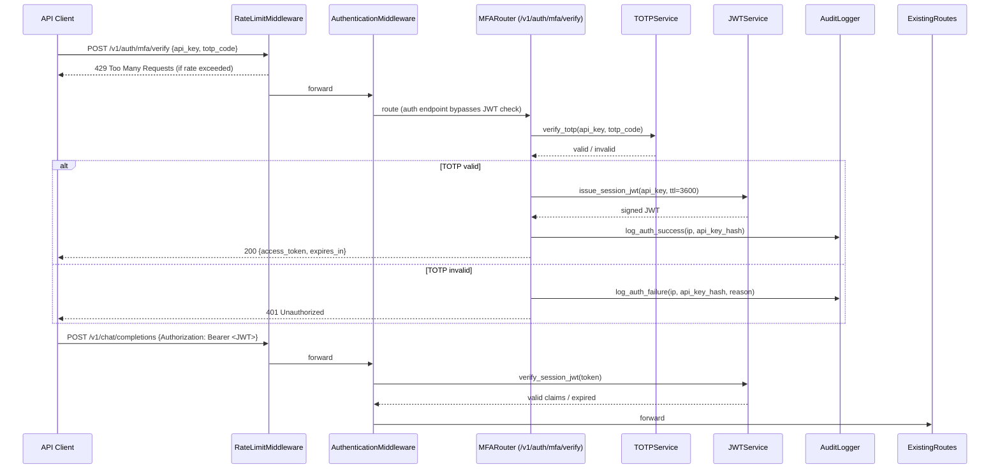
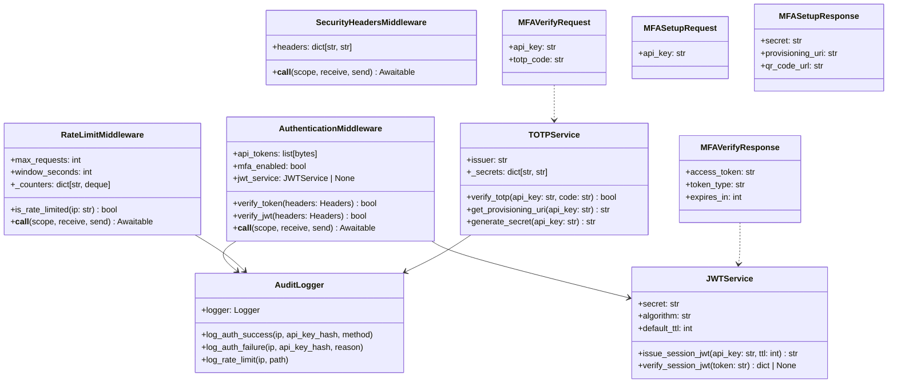
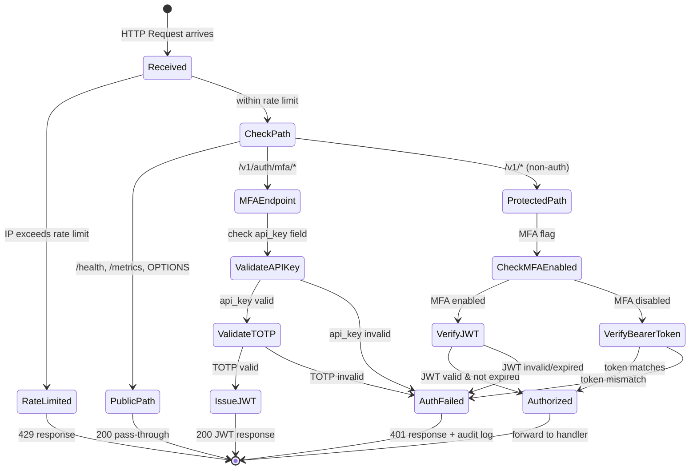

# Fix Security Issues and Implement MFA for vLLM API Server

This plan addresses security hardening and Multi-Factor Authentication (MFA/TOTP) for the vLLM OpenAI-compatible API server. The work spans the existing `AuthenticationMiddleware` in `vllm/entrypoints/openai/server_utils.py`, the CLI argument layer in `vllm/entrypoints/openai/cli_args.py`, the environment variable system in `vllm/envs.py`, and the FastAPI application wiring in `vllm/entrypoints/openai/api_server.py`.

---

## Design & Architecture

### Overview

vLLM exposes an OpenAI-compatible REST API via FastAPI + Uvicorn. Authentication today is a single-layer Bearer token check (`AuthenticationMiddleware.verify_token`) that compares a SHA-256 hash of the incoming token against pre-hashed API keys. There is no rate limiting, no brute-force protection, no TOTP/MFA layer, no audit logging of auth events, and CORS is configured with wildcard defaults (`["*"]`).

The security hardening work introduces: (1) a TOTP-based MFA layer using `pyotp` that can be enforced per-request or per-session via a short-lived JWT challenge token; (2) a rate-limiting middleware (`RateLimitMiddleware`) backed by an in-process sliding-window counter to prevent brute-force attacks; (3) an audit-log sink that records every authentication attempt (success/failure) with IP, timestamp, and masked token; (4) tightened CORS defaults and security-header injection; and (5) a new `/v1/auth/mfa/verify` endpoint that exchanges a valid API key + TOTP code for a short-lived session JWT, which is then accepted by the upgraded `AuthenticationMiddleware`.

The MFA flow is optional and backward-compatible: if `--enable-mfa` is not passed, the server behaves exactly as today. When enabled, clients must first POST to `/v1/auth/mfa/verify` with their API key and a TOTP code, receive a short-lived JWT, and use that JWT as the Bearer token for subsequent `/v1/*` calls.

### Diagrams

#### Architecture / Component Diagram



#### Sequence Diagram — MFA Login Flow



#### Class / Data Model Diagram



#### State Machine — Authentication Request Lifecycle



### Directory Structure

```
vllm/
├── entrypoints/
│   ├── openai/
│   │   ├── api_server.py              # Modified: wire new middlewares + MFA router
│   │   ├── cli_args.py                # Modified: add --enable-mfa, --mfa-totp-issuer,
│   │   │                              #   --rate-limit-*, --security-headers flags
│   │   ├── server_utils.py            # Modified: upgrade AuthenticationMiddleware,
│   │   │                              #   add RateLimitMiddleware, SecurityHeadersMiddleware
│   │   └── mfa/                       # NEW package
│   │       ├── __init__.py
│   │       ├── api_router.py          # FastAPI router: /v1/auth/mfa/verify, /setup
│   │       ├── totp.py                # TOTPService (pyotp)
│   │       ├── jwt_utils.py           # JWTService (PyJWT)
│   │       ├── audit.py               # AuditLogger
│   │       └── protocol.py            # Pydantic models: MFAVerifyRequest/Response, etc.
├── envs.py                            # Modified: add VLLM_MFA_SECRET, VLLM_JWT_SECRET,
│                                      #   VLLM_MFA_ISSUER, VLLM_RATE_LIMIT_MAX_REQUESTS,
│                                      #   VLLM_RATE_LIMIT_WINDOW_SECONDS
tests/
└── entrypoints/
    └── openai/
        └── test_security.py           # NEW: auth, MFA, rate-limit, header tests
```

### Key Design Decisions

| Decision | Choice | Rationale |
|----------|--------|-----------|
| MFA algorithm | TOTP (RFC 6238) via `pyotp` | Industry standard, compatible with Google Authenticator, Authy, etc. |
| Session token format | Short-lived JWT (PyJWT, HS256) | Stateless, no server-side session store needed; fits existing Bearer token flow |
| Rate limiting backend | In-process sliding-window (`collections.deque`) | No Redis dependency; vLLM is typically single-process per worker |
| MFA opt-in | `--enable-mfa` CLI flag | Backward-compatible; existing deployments unaffected |
| TOTP secret storage | `VLLM_MFA_SECRET` env var (per-key HMAC derivation) | Avoids per-key secret files; deterministic from master secret + api_key |
| CORS hardening | Warn when `allowed_origins=["*"]` with credentials | Prevents CORS misconfiguration without breaking existing deployments |
| Audit logging | Structured JSON via existing `init_logger` | Consistent with vLLM logging infrastructure |
| Security headers | `SecurityHeadersMiddleware` injecting HSTS, X-Frame-Options, etc. | Defense-in-depth; opt-in via `--enable-security-headers` |

### Technology Stack

- **Runtime/Language:** Python 3.10+
- **Framework:** FastAPI + Uvicorn (existing)
- **Key Libraries:**
  - `pyotp` ≥ 2.9 — TOTP generation and verification
  - `PyJWT` ≥ 2.8 — JWT issuance and verification
  - `cryptography` ≥ 42 — JWT signing backend (already a transitive dep)
  - `pydantic` v2 (existing) — request/response models
  - `starlette` (existing) — ASGI middleware base
- **External APIs/Services:** None (all in-process)

---

## Execution Plan

### Phase 1: Environment Variables & Configuration
**Estimated effort:** 1-2 hours
**Dependencies:** None

Add all new environment variables for MFA and rate-limiting to `vllm/envs.py`, and add the corresponding CLI arguments to `vllm/entrypoints/openai/cli_args.py`. This is the foundation that all other phases read from.

#### Tasks:
- [ ] In `vllm/envs.py`, add to the `TYPE_CHECKING` block and the `environment_variables` dict:
  - `VLLM_MFA_SECRET: str | None = None` — master HMAC secret for TOTP key derivation
  - `VLLM_JWT_SECRET: str | None = None` — HS256 signing secret for session JWTs
  - `VLLM_MFA_ISSUER: str = "vLLM"` — TOTP issuer name shown in authenticator apps
  - `VLLM_RATE_LIMIT_MAX_REQUESTS: int = 100` — max requests per window per IP
  - `VLLM_RATE_LIMIT_WINDOW_SECONDS: int = 60` — sliding window duration in seconds
  - `VLLM_MFA_JWT_TTL_SECONDS: int = 3600` — session JWT time-to-live
- [ ] In `vllm/entrypoints/openai/cli_args.py`, add to `BaseFrontendArgs` (the `@config` dataclass):
  - `enable_mfa: bool = False` — enable TOTP MFA enforcement
  - `mfa_totp_issuer: str = "vLLM"` — TOTP issuer label
  - `rate_limit_max_requests: int = 100` — max requests per IP per window
  - `rate_limit_window_seconds: int = 60` — rate-limit window in seconds
  - `enable_security_headers: bool = False` — inject HSTS/X-Frame-Options/etc.
  - `mfa_jwt_ttl_seconds: int = 3600` — session JWT TTL
- [ ] Add docstrings to each new field following the existing pattern in `cli_args.py`
- [ ] Verify `python -m py_compile vllm/envs.py vllm/entrypoints/openai/cli_args.py`

#### Deliverables:
- Updated `vllm/envs.py` with 6 new environment variable definitions
- Updated `vllm/entrypoints/openai/cli_args.py` with 6 new `BaseFrontendArgs` fields

---

### Phase 2: MFA Core Services Package
**Estimated effort:** 3-4 hours
**Dependencies:** Phase 1

Create the `vllm/entrypoints/openai/mfa/` package containing the TOTP service, JWT service, audit logger, and Pydantic protocol models.

#### Tasks:
- [ ] Create `vllm/entrypoints/openai/mfa/__init__.py` (empty, marks package)
- [ ] Create `vllm/entrypoints/openai/mfa/protocol.py`:
  - `MFAVerifyRequest(BaseModel)`: fields `api_key: str`, `totp_code: str`
  - `MFAVerifyResponse(BaseModel)`: fields `access_token: str`, `token_type: str = "bearer"`, `expires_in: int`
  - `MFASetupRequest(BaseModel)`: field `api_key: str`
  - `MFASetupResponse(BaseModel)`: fields `secret: str`, `provisioning_uri: str`
  - `MFAStatusResponse(BaseModel)`: fields `mfa_enabled: bool`, `issuer: str`
- [ ] Create `vllm/entrypoints/openai/mfa/totp.py` — `TOTPService` class:
  - `__init__(self, master_secret: str, issuer: str)` — store master secret and issuer
  - `_derive_secret(self, api_key: str) -> str` — HMAC-SHA256 of `master_secret + api_key`, base32-encoded, for deterministic per-key TOTP secret
  - `verify_totp(self, api_key: str, code: str) -> bool` — use `pyotp.TOTP(secret).verify(code, valid_window=1)` (allow ±30s drift)
  - `get_provisioning_uri(self, api_key: str, account_name: str) -> str` — return `pyotp.TOTP(secret).provisioning_uri(account_name, issuer_name=self.issuer)`
  - `generate_secret(self, api_key: str) -> str` — return the derived base32 secret for display during setup
- [ ] Create `vllm/entrypoints/openai/mfa/jwt_utils.py` — `JWTService` class:
  - `__init__(self, secret: str, algorithm: str = "HS256", default_ttl: int = 3600)`
  - `issue_session_jwt(self, api_key_hash: str, ttl: int | None = None) -> str` — encode `{"sub": api_key_hash, "iat": now, "exp": now+ttl, "type": "mfa_session"}` with PyJWT
  - `verify_session_jwt(self, token: str) -> dict | None` — decode and validate; return claims dict or `None` on any error (expired, invalid signature, wrong type)
- [ ] Create `vllm/entrypoints/openai/mfa/audit.py` — `AuditLogger` class:
  - `__init__(self)` — call `init_logger("vllm.entrypoints.openai.mfa.audit")`
  - `log_auth_success(self, ip: str, api_key_hash: str, method: str) -> None` — structured log at INFO
  - `log_auth_failure(self, ip: str, api_key_hash: str, reason: str) -> None` — structured log at WARNING
  - `log_rate_limit(self, ip: str, path: str) -> None` — structured log at WARNING
  - `log_mfa_setup(self, ip: str, api_key_hash: str) -> None` — structured log at INFO
  - Helper `_mask_key(api_key: str) -> str` — return first 4 chars + `****` + last 4 chars
- [ ] Verify `python -m py_compile` on all 5 new files

#### Deliverables:
- `vllm/entrypoints/openai/mfa/__init__.py`
- `vllm/entrypoints/openai/mfa/protocol.py`
- `vllm/entrypoints/openai/mfa/totp.py`
- `vllm/entrypoints/openai/mfa/jwt_utils.py`
- `vllm/entrypoints/openai/mfa/audit.py`

---

### Phase 3: MFA API Router
**Estimated effort:** 2-3 hours
**Dependencies:** Phase 2

Create the FastAPI router that exposes the MFA endpoints (`/v1/auth/mfa/verify`, `/v1/auth/mfa/setup`, `/v1/auth/mfa/status`) and wire it into the main app.

#### Tasks:
- [ ] Create `vllm/entrypoints/openai/mfa/api_router.py`:
  - Import `APIRouter` from FastAPI; create `router = APIRouter(prefix="/v1/auth/mfa", tags=["mfa"])`
  - `POST /verify` handler `verify_mfa(request: MFAVerifyRequest, req: Request) -> MFAVerifyResponse`:
    - Extract client IP from `req.client.host` (with X-Forwarded-For fallback)
    - Validate `api_key` against the app's known token hashes (read from `req.app.state`)
    - Call `totp_service.verify_totp(api_key, totp_code)`
    - On success: call `jwt_service.issue_session_jwt(...)`, call `audit_logger.log_auth_success(...)`, return `MFAVerifyResponse`
    - On failure: call `audit_logger.log_auth_failure(...)`, raise `HTTPException(401)`
  - `POST /setup` handler `setup_mfa(request: MFASetupRequest, req: Request) -> MFASetupResponse`:
    - Validate `api_key` against known tokens
    - Return `secret` and `provisioning_uri` from `totp_service`
    - Log setup event via `audit_logger.log_mfa_setup(...)`
  - `GET /status` handler `mfa_status(req: Request) -> MFAStatusResponse`:
    - Return `{"mfa_enabled": req.app.state.args.enable_mfa, "issuer": ...}`
  - `attach_router(app: FastAPI) -> None` function that calls `app.include_router(router)`
- [ ] Verify `python -m py_compile vllm/entrypoints/openai/mfa/api_router.py`

#### Deliverables:
- `vllm/entrypoints/openai/mfa/api_router.py` with 3 fully implemented endpoints

---

### Phase 4: Security Middleware Upgrades
**Estimated effort:** 3-4 hours
**Dependencies:** Phase 1, Phase 2

Upgrade `vllm/entrypoints/openai/server_utils.py` to add `RateLimitMiddleware`, `SecurityHeadersMiddleware`, and upgrade `AuthenticationMiddleware` to support JWT session tokens when MFA is enabled.

#### Tasks:
- [ ] In `vllm/entrypoints/openai/server_utils.py`, add `RateLimitMiddleware` class:
  - `__init__(self, app: ASGIApp, max_requests: int, window_seconds: int, audit_logger: AuditLogger | None = None)`
  - `_counters: dict[str, deque[float]]` — per-IP sliding window of request timestamps
  - `is_rate_limited(self, ip: str) -> bool` — prune old timestamps, check count vs `max_requests`
  - `__call__(self, scope, receive, send)` — extract IP from scope, check rate limit, return 429 JSON response or forward; call `audit_logger.log_rate_limit(...)` on block
  - Skip rate limiting for `scope["type"] != "http"` and for `/health`, `/metrics` paths
- [ ] In `vllm/entrypoints/openai/server_utils.py`, add `SecurityHeadersMiddleware` class:
  - `__init__(self, app: ASGIApp)`
  - Inject headers in `send` wrapper: `Strict-Transport-Security: max-age=31536000; includeSubDomains`, `X-Content-Type-Options: nosniff`, `X-Frame-Options: DENY`, `X-XSS-Protection: 1; mode=block`, `Referrer-Policy: strict-origin-when-cross-origin`, `Content-Security-Policy: default-src 'none'`
- [ ] Upgrade `AuthenticationMiddleware` in `server_utils.py`:
  - Add `__init__` parameter `jwt_service: JWTService | None = None` and `audit_logger: AuditLogger | None = None`
  - Add `verify_jwt(self, headers: Headers) -> bool` method — extract Bearer token, call `jwt_service.verify_session_jwt(token)`, return True if claims are valid
  - Update `verify_token` to also accept valid JWTs when `jwt_service` is set: `return self._verify_api_key(headers) or self._verify_jwt(headers)`
  - Rename existing token-hash check to `_verify_api_key(self, headers: Headers) -> bool`
  - Call `audit_logger.log_auth_failure(...)` on 401 responses (extract IP from scope)
- [ ] Add CORS warning: in `build_app` (or in `AuthenticationMiddleware.__init__`), log a WARNING if `allowed_origins == ["*"]` and `allow_credentials == True`
- [ ] Verify `python -m py_compile vllm/entrypoints/openai/server_utils.py`

#### Deliverables:
- Updated `vllm/entrypoints/openai/server_utils.py` with `RateLimitMiddleware`, `SecurityHeadersMiddleware`, and upgraded `AuthenticationMiddleware`

---

### Phase 5: API Server Wiring
**Estimated effort:** 1-2 hours
**Dependencies:** Phase 3, Phase 4

Wire all new middlewares and the MFA router into `vllm/entrypoints/openai/api_server.py` and `vllm/entrypoints/openai/server_utils.py`'s `init_app_state`.

#### Tasks:
- [ ] In `vllm/entrypoints/openai/api_server.py`, in `build_app(args, supported_tasks)`:
  - After existing `AuthenticationMiddleware` wiring (lines ~261-264), instantiate `AuditLogger`, `TOTPService`, `JWTService` from `vllm.entrypoints.openai.mfa` when `args.enable_mfa` is True
  - Pass `jwt_service` and `audit_logger` to `AuthenticationMiddleware`
  - Add `RateLimitMiddleware` unconditionally (uses `args.rate_limit_max_requests`, `args.rate_limit_window_seconds`):
    ```python
    from vllm.entrypoints.openai.server_utils import RateLimitMiddleware
    app.add_middleware(RateLimitMiddleware,
                       max_requests=args.rate_limit_max_requests,
                       window_seconds=args.rate_limit_window_seconds)
    ```
  - Add `SecurityHeadersMiddleware` when `args.enable_security_headers` is True
  - Call `attach_router(app)` from `vllm.entrypoints.openai.mfa.api_router` when `args.enable_mfa` is True
- [ ] In `vllm/entrypoints/openai/server_utils.py`, in `init_app_state` (or equivalent state-init function), store `totp_service`, `jwt_service`, `audit_logger` on `app.state` so MFA router handlers can access them via `req.app.state`
- [ ] Add CORS misconfiguration warning in `build_app`: if `args.allowed_origins == ["*"]` and `args.allow_credentials`, emit `logger.warning("SECURITY: CORS is configured with wildcard origins and allow_credentials=True. This is a security risk.")`
- [ ] Verify `python -m py_compile vllm/entrypoints/openai/api_server.py`

#### Deliverables:
- Updated `vllm/entrypoints/openai/api_server.py` with MFA router, rate-limit, and security-header wiring

---

### Phase 6: Dependency Updates
**Estimated effort:** 0.5-1 hour
**Dependencies:** None

Add `pyotp` and `PyJWT` to the project's dependency manifests.

#### Tasks:
- [ ] In `pyproject.toml`, add to the `[project] dependencies` list:
  - `"pyotp>=2.9.0"`
  - `"PyJWT>=2.8.0"`
- [ ] Check `requirements/` directory for any relevant requirements files (e.g., `requirements/common.txt`, `requirements/cpu.txt`) and add the same two dependencies
- [ ] Verify `python -c "import pyotp, jwt; print('deps ok')"` (after install)

#### Deliverables:
- Updated `pyproject.toml` with `pyotp` and `PyJWT` dependencies
- Updated any relevant `requirements/*.txt` files

---

### Phase 7: Testing & Quality Assurance
**Estimated effort:** 3-4 hours
**Dependencies:** Phase 2, Phase 3, Phase 4, Phase 5, Phase 6

Write a comprehensive test suite covering all new security functionality.

#### Tasks:
- [ ] Create `tests/entrypoints/openai/test_security.py` with the following test classes and functions:

  **`TestRateLimitMiddleware`:**
  - `test_rate_limit_blocks_after_max_requests` — send `max_requests + 1` requests from same IP, assert last returns 429
  - `test_rate_limit_allows_different_ips` — verify different IPs have independent counters
  - `test_rate_limit_window_resets` — mock time to advance past window, verify counter resets
  - `test_rate_limit_skips_health_endpoint` — `/health` should never be rate-limited

  **`TestSecurityHeadersMiddleware`:**
  - `test_security_headers_present` — assert `Strict-Transport-Security`, `X-Frame-Options`, `X-Content-Type-Options` in response headers
  - `test_security_headers_not_present_when_disabled` — verify headers absent when middleware not added

  **`TestAuthenticationMiddlewareUpgraded`:**
  - `test_valid_api_key_still_works` — existing Bearer token auth unchanged
  - `test_invalid_api_key_returns_401` — unchanged behavior
  - `test_valid_jwt_accepted_when_mfa_enabled` — issue a JWT via `JWTService`, use it as Bearer, assert 200
  - `test_expired_jwt_returns_401` — issue JWT with `ttl=0`, assert 401
  - `test_invalid_jwt_signature_returns_401` — tamper with JWT, assert 401
  - `test_options_request_bypasses_auth` — OPTIONS method should always pass

  **`TestTOTPService`:**
  - `test_verify_totp_valid_code` — generate code with `pyotp.TOTP(secret).now()`, verify returns True
  - `test_verify_totp_invalid_code` — wrong code returns False
  - `test_derive_secret_deterministic` — same api_key always yields same secret
  - `test_derive_secret_different_keys` — different api_keys yield different secrets
  - `test_provisioning_uri_format` — URI starts with `otpauth://totp/`

  **`TestJWTService`:**
  - `test_issue_and_verify_jwt` — round-trip issue + verify returns correct claims
  - `test_expired_jwt_returns_none` — TTL=0 JWT returns None from verify
  - `test_wrong_secret_returns_none` — JWT signed with different secret returns None
  - `test_jwt_type_claim` — verify `type == "mfa_session"` in claims

  **`TestMFARouter`:**
  - `test_verify_endpoint_valid_credentials` — POST `/v1/auth/mfa/verify` with valid api_key + TOTP returns 200 with `access_token`
  - `test_verify_endpoint_invalid_totp` — wrong TOTP code returns 401
  - `test_verify_endpoint_invalid_api_key` — unknown api_key returns 401
  - `test_setup_endpoint_returns_secret_and_uri` — POST `/v1/auth/mfa/setup` returns `secret` and `provisioning_uri`
  - `test_status_endpoint` — GET `/v1/auth/mfa/status` returns `mfa_enabled` boolean

  **`TestAuditLogger`:**
  - `test_auth_success_logged` — assert logger.info called with correct fields
  - `test_auth_failure_logged` — assert logger.warning called
  - `test_mask_key` — `_mask_key("abcdefghijklmnop")` returns `"abcd****mnop"`

  **`TestCORSWarning`:**
  - `test_cors_wildcard_with_credentials_warns` — mock `logger.warning`, build app with `allowed_origins=["*"]` + `allow_credentials=True`, assert warning emitted

- [ ] Run `python -m pytest tests/entrypoints/openai/test_security.py -v --tb=short` and ensure all tests pass
- [ ] Run `python -m pytest tests/entrypoints/openai/test_cli_args.py -v` to verify no regressions in CLI arg parsing
- [ ] Run `python -m pytest tests/entrypoints/openai/test_root_path.py -v` to verify existing API key auth still works

#### Deliverables:
- `tests/entrypoints/openai/test_security.py` with 30+ test cases covering all new security components
- All existing entrypoint tests passing without regression

---

## Verification Criteria

After implementation, verify the following:

### Unit Tests
```bash
python -m pytest tests/entrypoints/openai/test_security.py -v --tb=short
# Expected: all 30+ tests PASS, 0 failures
```

### Regression Tests
```bash
python -m pytest tests/entrypoints/openai/test_cli_args.py -v
python -m pytest tests/entrypoints/openai/test_root_path.py -v
# Expected: all existing tests PASS (no regressions)
```

### Syntax Validation
```bash
python -m py_compile \
  vllm/envs.py \
  vllm/entrypoints/openai/cli_args.py \
  vllm/entrypoints/openai/server_utils.py \
  vllm/entrypoints/openai/api_server.py \
  vllm/entrypoints/openai/mfa/__init__.py \
  vllm/entrypoints/openai/mfa/protocol.py \
  vllm/entrypoints/openai/mfa/totp.py \
  vllm/entrypoints/openai/mfa/jwt_utils.py \
  vllm/entrypoints/openai/mfa/audit.py \
  vllm/entrypoints/openai/mfa/api_router.py
# Expected: no output (all files compile cleanly)
```

### Import Validation
```bash
python -c "
from vllm.entrypoints.openai.mfa.totp import TOTPService
from vllm.entrypoints.openai.mfa.jwt_utils import JWTService
from vllm.entrypoints.openai.mfa.audit import AuditLogger
from vllm.entrypoints.openai.mfa.protocol import MFAVerifyRequest, MFAVerifyResponse
from vllm.entrypoints.openai.server_utils import (
    AuthenticationMiddleware, RateLimitMiddleware, SecurityHeadersMiddleware
)
print('All imports OK')
"
# Expected: prints "All imports OK"
```

### Functional Spot-Check (MFA flow)
```python
# Verify TOTP round-trip
import pyotp, hmac, hashlib, base64
master = "test-secret"
api_key = "my-api-key"
raw = hmac.new(master.encode(), api_key.encode(), hashlib.sha256).digest()
secret = base64.b32encode(raw).decode()
totp = pyotp.TOTP(secret)
code = totp.now()
assert totp.verify(code, valid_window=1), "TOTP verification failed"
print("TOTP round-trip OK")

# Verify JWT round-trip
import jwt, time
jwt_secret = "jwt-test-secret"
payload = {"sub": "hash123", "iat": int(time.time()), "exp": int(time.time()) + 3600, "type": "mfa_session"}
token = jwt.encode(payload, jwt_secret, algorithm="HS256")
decoded = jwt.decode(token, jwt_secret, algorithms=["HS256"])
assert decoded["sub"] == "hash123"
print("JWT round-trip OK")
```

### CLI Argument Check
```bash
python -m vllm.entrypoints.openai.api_server --help | grep -E "enable-mfa|rate-limit|security-headers"
# Expected: shows --enable-mfa, --rate-limit-max-requests, --rate-limit-window-seconds, --enable-security-headers
```

### Rate Limit Behavior
- Start server with `--rate-limit-max-requests 5 --rate-limit-window-seconds 60`
- Send 6 rapid requests to `/v1/models`
- The 6th request must return HTTP 429 with JSON body `{"error": "Too Many Requests"}`

### Security Headers
- Start server with `--enable-security-headers`
- `curl -I http://localhost:8000/health`
- Response must include `X-Frame-Options: DENY` and `X-Content-Type-Options: nosniff`
