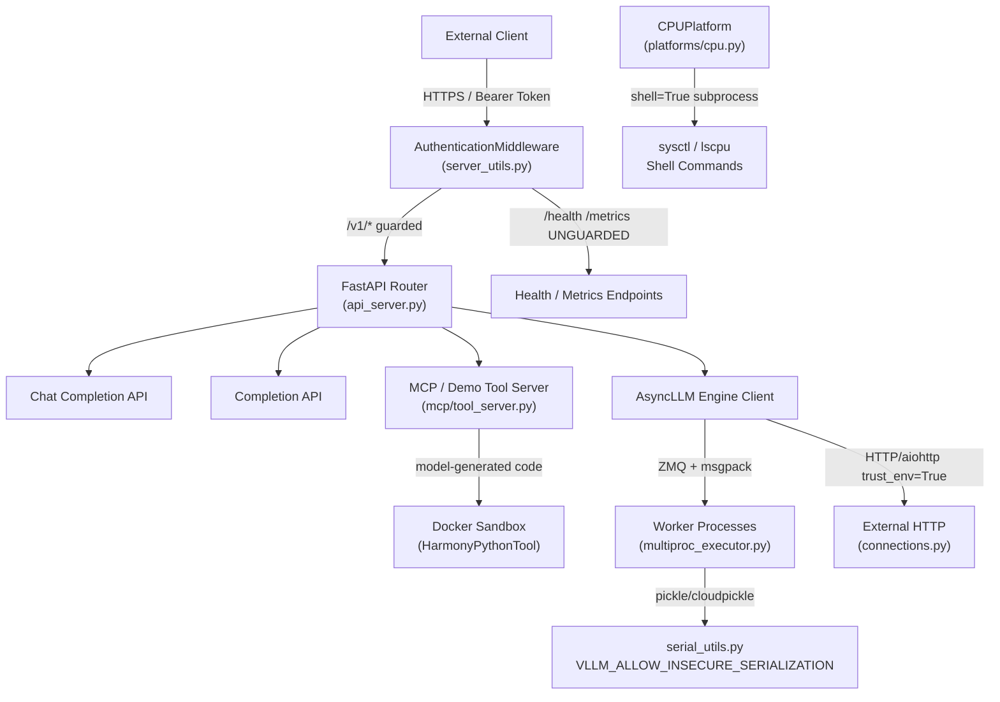
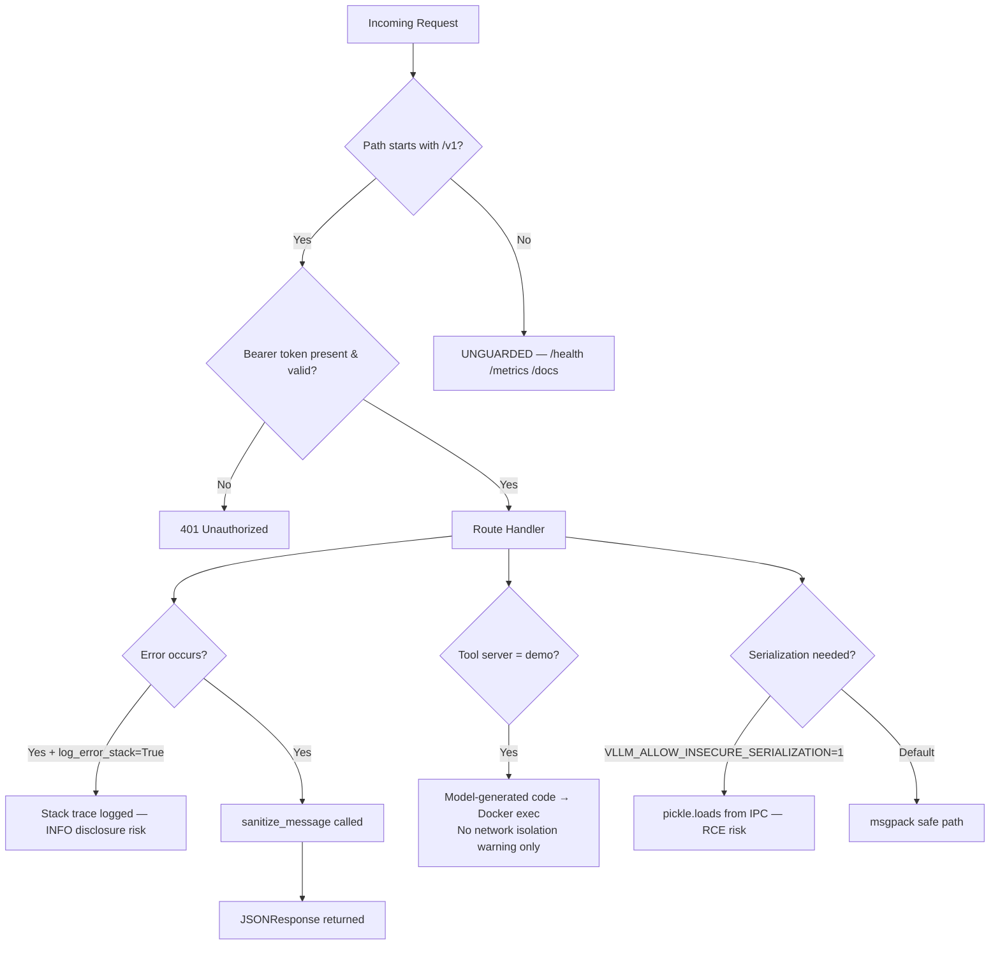
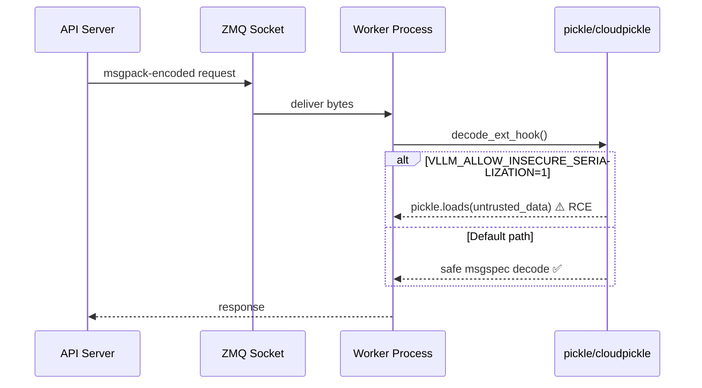
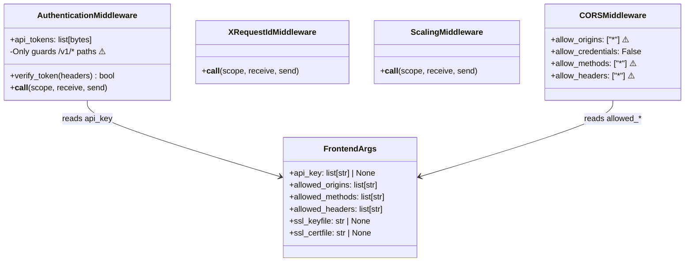

# Fix Security Issues — vLLM

This plan addresses the security vulnerabilities identified across the vLLM codebase, covering the OpenAI-compatible API server, serialization layer, subprocess invocations, HTTP client configuration, authentication middleware, and the MCP/demo tool execution sandbox. The goal is to harden the server against common attack vectors (injection, insecure deserialization, SSRF, information disclosure, CORS misconfiguration, and unsafe subprocess usage) without breaking existing functionality.

---

## Design & Architecture

### Overview

vLLM is a high-throughput LLM inference engine that exposes an OpenAI-compatible REST API (FastAPI/uvicorn), a gRPC server, and a batch-processing pipeline. The security surface spans several layers:

1. **API Layer** (`vllm/entrypoints/openai/`) — FastAPI app with `AuthenticationMiddleware`, CORS, SSL, and request validation. The default CORS configuration (`allowed_origins=["*"]`, `allow_credentials=False`) is permissive. The `AuthenticationMiddleware` only guards `/v1` paths, leaving admin/health/metrics endpoints unprotected.

2. **Serialization Layer** (`vllm/v1/serial_utils.py`, `vllm/distributed/`) — Uses `pickle` and `cloudpickle` for inter-process communication. The env var `VLLM_ALLOW_INSECURE_SERIALIZATION` can enable arbitrary pickle deserialization from untrusted sources.

3. **Subprocess Invocations** (`vllm/platforms/cpu.py`) — Two calls use `shell=True` with string commands, creating shell-injection risk if any part of the command string is ever influenced by external input.

4. **HTTP Client** (`vllm/connections.py`) — `aiohttp.ClientSession(trust_env=True)` inherits proxy settings from environment variables, which can be abused for SSRF in certain deployment environments.

5. **MCP / Demo Tool Execution** (`vllm/entrypoints/mcp/tool.py`, `tool_server.py`) — The `HarmonyPythonTool` executes model-generated Python code in Docker. The `--tool-server demo` flag is documented with a warning about no network isolation, but there is no runtime enforcement or audit logging.

6. **Information Disclosure** — Error responses in `server_utils.py` call `sanitize_message()` but stack traces can be leaked when `log_error_stack=True` (which defaults to `VLLM_SERVER_DEV_MODE`). The `/tokenizer_info` endpoint (opt-in) can expose chat templates.

### Diagrams

#### Architecture / Component Diagram



#### Security Issue Flowchart



#### Data Flow — Serialization Security



#### Class / Data Model — Auth & Middleware



### Directory Structure

```
vllm/
├── entrypoints/
│   ├── openai/
│   │   ├── api_server.py          # build_app(), CORS/auth middleware wiring
│   │   ├── cli_args.py            # FrontendArgs — CORS defaults, api_key
│   │   └── server_utils.py        # AuthenticationMiddleware, exception handlers
│   ├── mcp/
│   │   ├── tool.py                # HarmonyPythonTool (Docker code exec)
│   │   └── tool_server.py         # DemoToolServer, MCPToolServer
│   ├── ssl.py                     # SSLCertRefresher
│   └── utils.py                   # sanitize_message()
├── v1/
│   └── serial_utils.py            # pickle/cloudpickle deserialization
├── distributed/
│   ├── parallel_state.py          # pickle for tensor broadcast
│   └── device_communicators/
│       ├── shm_object_storage.py  # pickle in shared memory
│       └── all_reduce_utils.py    # subprocess + pickle
├── platforms/
│   └── cpu.py                     # shell=True subprocess calls
├── connections.py                 # aiohttp trust_env=True
└── envs.py                        # VLLM_ALLOW_INSECURE_SERIALIZATION flag
```

### Key Design Decisions

| Decision | Choice | Rationale |
|----------|--------|-----------|
| Auth scope | Extend `AuthenticationMiddleware` to cover configurable path prefixes | Avoids breaking `/health` for load balancers while allowing operators to opt-in to full protection |
| CORS hardening | Change defaults from `["*"]` to `[]` with explicit opt-in | Wildcard CORS + credentials is a known attack vector; operators must explicitly allow origins |
| Subprocess injection | Replace `shell=True` string commands with list-form args | Eliminates shell injection; no functional change needed |
| Pickle gating | Add source-validation wrapper around `pickle.loads` calls | Pickle from trusted IPC sockets is acceptable; the flag should require explicit acknowledgment |
| HTTP client | Remove `trust_env=True` from `aiohttp.ClientSession` | Prevents SSRF via proxy env vars in multi-tenant deployments |
| Error disclosure | Default `log_error_stack` to `False`; gate on explicit flag | Stack traces should never be logged at INFO in production |
| Demo tool audit | Add structured audit logging for every code execution | Provides forensic trail without blocking the feature |

### Technology Stack

- **Runtime/Language:** Python 3.10+
- **Framework:** FastAPI + Starlette (ASGI), uvicorn
- **Key Libraries:** `aiohttp`, `requests`, `msgpack`, `cloudpickle`, `zmq`, `pydantic`
- **Security-relevant env vars:** `VLLM_ALLOW_INSECURE_SERIALIZATION`, `VLLM_API_KEY`, `VLLM_SERVER_DEV_MODE`

---

## Execution Plan

### Phase 1: Fix Shell-Injection Vulnerabilities in subprocess Calls
**Estimated effort:** 1-2 hours
**Dependencies:** None

Replace `shell=True` string-based subprocess invocations in `vllm/platforms/cpu.py` with list-form argument arrays. This eliminates the shell injection attack surface entirely.

#### Tasks:
- [ ] In `vllm/platforms/cpu.py`, line 88-89: Replace `subprocess.check_output(["sysctl -n hw.optional.arm.FEAT_BF16"], shell=True)` with `subprocess.check_output(["sysctl", "-n", "hw.optional.arm.FEAT_BF16"])` (remove `shell=True`, split string into list)
- [ ] In `vllm/platforms/cpu.py`, line 369-370: Replace `subprocess.check_output("lscpu -J -e=CPU,CORE,NODE", shell=True, text=True)` with `subprocess.check_output(["lscpu", "-J", "-e=CPU,CORE,NODE"], text=True)` (remove `shell=True`, convert string to list)
- [ ] Verify both call sites still pass the same arguments and produce equivalent output by checking the surrounding parsing logic
- [ ] Run `python -m py_compile vllm/platforms/cpu.py` to confirm no syntax errors

#### Deliverables:
- `vllm/platforms/cpu.py` — two `shell=True` calls replaced with safe list-form invocations

---

### Phase 2: Harden Authentication Middleware — Extend Protected Path Coverage
**Estimated effort:** 2-3 hours
**Dependencies:** None

The `AuthenticationMiddleware` in `vllm/entrypoints/openai/server_utils.py` only protects paths starting with `/v1`. Admin, metrics, and other sensitive endpoints are unguarded. Add a configurable `protected_paths` parameter and update `build_app()` in `api_server.py` and `FrontendArgs` in `cli_args.py` to expose the option.

#### Tasks:
- [ ] In `vllm/entrypoints/openai/server_utils.py`, update `AuthenticationMiddleware.__init__` to accept `protected_paths: list[str] = ["/v1"]` parameter and store as `self.protected_paths`
- [ ] Update `AuthenticationMiddleware.__call__` to check `any(url_path.startswith(p) for p in self.protected_paths)` instead of the hardcoded `url_path.startswith("/v1")`
- [ ] In `vllm/entrypoints/openai/cli_args.py`, add field `auth_protected_paths: list[str] | None = None` to `FrontendArgs` with docstring explaining it defaults to `["/v1"]`
- [ ] In `vllm/entrypoints/openai/api_server.py`, in `build_app()`, pass `protected_paths=args.auth_protected_paths or ["/v1"]` when instantiating `AuthenticationMiddleware`
- [ ] Add a note in the `AuthenticationMiddleware` docstring listing which paths are NOT protected by default (e.g., `/health`, `/metrics`, `/ping`) and why
- [ ] Run `python -m py_compile` on all three modified files

#### Deliverables:
- `vllm/entrypoints/openai/server_utils.py` — `AuthenticationMiddleware` with configurable `protected_paths`
- `vllm/entrypoints/openai/cli_args.py` — new `auth_protected_paths` field in `FrontendArgs`
- `vllm/entrypoints/openai/api_server.py` — passes `protected_paths` to middleware

---

### Phase 3: Harden CORS Defaults
**Estimated effort:** 1-2 hours
**Dependencies:** None

The default `allowed_origins=["*"]`, `allowed_methods=["*"]`, and `allowed_headers=["*"]` in `FrontendArgs` are overly permissive. Change defaults to empty lists (deny-by-default) and update documentation.

#### Tasks:
- [ ] In `vllm/entrypoints/openai/cli_args.py`, change `FrontendArgs.allowed_origins` default from `field(default_factory=lambda: ["*"])` to `field(default_factory=list)` (empty list)
- [ ] Change `FrontendArgs.allowed_methods` default from `field(default_factory=lambda: ["*"])` to `field(default_factory=lambda: ["GET", "POST", "OPTIONS"])` (safe explicit set)
- [ ] Change `FrontendArgs.allowed_headers` default from `field(default_factory=lambda: ["*"])` to `field(default_factory=lambda: ["Authorization", "Content-Type", "X-Request-Id"])` (explicit allowlist)
- [ ] Update the docstrings for each field to document the new defaults and explain how to restore the old permissive behavior for development
- [ ] Search for any tests or examples that rely on the wildcard defaults and update them to pass explicit values (check `tests/` and `examples/` directories)
- [ ] Run `python -m py_compile vllm/entrypoints/openai/cli_args.py`

#### Deliverables:
- `vllm/entrypoints/openai/cli_args.py` — CORS defaults changed to restrictive allowlists

---

### Phase 4: Fix Insecure HTTP Client Configuration (SSRF via trust_env)
**Estimated effort:** 1 hour
**Dependencies:** None

`vllm/connections.py` creates `aiohttp.ClientSession(trust_env=True)`, which causes the client to inherit `HTTP_PROXY` / `HTTPS_PROXY` environment variables. In multi-tenant or cloud deployments this can be abused for SSRF. Remove `trust_env=True` and document the change.

#### Tasks:
- [ ] In `vllm/connections.py`, `HTTPConnection.get_async_client()`: change `aiohttp.ClientSession(trust_env=True)` to `aiohttp.ClientSession()` (remove `trust_env=True`)
- [ ] Add a comment explaining why `trust_env` is not set: proxy configuration should be explicit, not inherited from environment to prevent SSRF
- [ ] If proxy support is legitimately needed, add an explicit `proxy: str | None = None` parameter to `get_async_response()` and pass it through to `client.get()` — do NOT re-enable `trust_env`
- [ ] Run `python -m py_compile vllm/connections.py`

#### Deliverables:
- `vllm/connections.py` — `trust_env=True` removed from `aiohttp.ClientSession`

---

### Phase 5: Harden Pickle Deserialization — Gate and Validate Insecure Paths
**Estimated effort:** 3-4 hours
**Dependencies:** None

`vllm/v1/serial_utils.py` contains `pickle.loads()` and `cloudpickle.loads()` calls that are gated by `VLLM_ALLOW_INSECURE_SERIALIZATION`. Strengthen the gate: validate that the data originates from a trusted IPC socket (not a network socket), add a startup warning when the flag is enabled, and document the risk clearly.

#### Tasks:
- [ ] In `vllm/v1/serial_utils.py`, in `_log_insecure_serialization_warning()`: upgrade from `logger.warning_once` to `logger.error` with a clear message that includes the CVE-class risk (arbitrary code execution) and instructions to disable the flag
- [ ] Add a module-level check in `serial_utils.py`: if `envs.VLLM_ALLOW_INSECURE_SERIALIZATION` is `True` at import time, emit the warning immediately (not lazily on first use)
- [ ] In `vllm/distributed/parallel_state.py` lines 661 and 708: add an inline comment documenting that `pickle` is used only for intra-process tensor broadcast over trusted shared memory, and that this is NOT gated by `VLLM_ALLOW_INSECURE_SERIALIZATION`
- [ ] In `vllm/distributed/device_communicators/shm_object_storage.py` lines 363-396: add similar inline comments documenting the trust boundary (shared memory between co-located processes)
- [ ] In `vllm/envs.py`, update the docstring/comment for `VLLM_ALLOW_INSECURE_SERIALIZATION` to include: "WARNING: Enabling this flag allows arbitrary code execution via deserialization. Only enable in fully trusted, isolated environments."
- [ ] Run `python -m py_compile` on all modified files

#### Deliverables:
- `vllm/v1/serial_utils.py` — upgraded warning, eager startup check
- `vllm/distributed/parallel_state.py` — trust boundary comments
- `vllm/distributed/device_communicators/shm_object_storage.py` — trust boundary comments
- `vllm/envs.py` — updated `VLLM_ALLOW_INSECURE_SERIALIZATION` documentation

---

### Phase 6: Fix Error Information Disclosure — Stack Trace Logging
**Estimated effort:** 1-2 hours
**Dependencies:** None

`log_error_stack` in `FrontendArgs` defaults to `envs.VLLM_SERVER_DEV_MODE`, which means stack traces are logged at INFO level in dev mode. Stack traces can contain file paths, internal class names, and configuration details. Change the default to `False` and ensure stack traces are only logged at DEBUG level.

#### Tasks:
- [ ] In `vllm/entrypoints/openai/cli_args.py`, change `log_error_stack: bool = envs.VLLM_SERVER_DEV_MODE` to `log_error_stack: bool = False` with an updated docstring: "If set to True, log the full stack trace of error responses. WARNING: may expose internal implementation details. Do not enable in production."
- [ ] In `vllm/entrypoints/openai/server_utils.py`, in `http_exception_handler()` and `validation_exception_handler()`: change `logger.exception(...)` calls (which log at ERROR with stack) to `logger.debug(...)` when `log_error_stack` is True — this prevents stack traces from appearing in INFO-level production logs
- [ ] In `vllm/entrypoints/openai/server_utils.py`, in `engine_error_handler()` and `exception_handler()`: apply the same DEBUG-level gating for stack traces
- [ ] Verify that `sanitize_message()` in `vllm/entrypoints/utils.py` is called on all error message strings before they are returned in JSON responses (audit all `ErrorResponse` construction sites in `server_utils.py`)
- [ ] Run `python -m py_compile` on modified files

#### Deliverables:
- `vllm/entrypoints/openai/cli_args.py` — `log_error_stack` defaults to `False`
- `vllm/entrypoints/openai/server_utils.py` — stack traces gated to DEBUG level

---

### Phase 7: Add Audit Logging for MCP Demo Tool Code Execution
**Estimated effort:** 2-3 hours
**Dependencies:** None

The `HarmonyPythonTool` in `vllm/entrypoints/mcp/tool.py` executes model-generated Python code in Docker. There is no audit trail of what code was executed, by whom, or what the result was. Add structured audit logging.

#### Tasks:
- [ ] In `vllm/entrypoints/mcp/tool.py`, in `HarmonyPythonTool.get_result()`: before calling `self.python_tool.process(last_msg)`, log at WARNING level: the session context (session_id if available), a truncated preview of the code being executed (first 200 chars), and a timestamp
- [ ] In `HarmonyPythonTool.get_result()`: after collecting `tool_output_msgs`, log the exit status and output length (not full output) at INFO level
- [ ] In `HarmonyPythonTool.get_result_parsable_context()`: apply the same pre/post execution audit logging
- [ ] In `vllm/entrypoints/mcp/tool_server.py`, in `DemoToolServer.__init__()`: add a startup WARNING log: "DemoToolServer initialized. Model-generated code will be executed in Docker. Ensure network isolation is configured. See --tool-server documentation."
- [ ] In `vllm/entrypoints/openai/cli_args.py`, update the `tool_server` field docstring to explicitly reference the security guide URL and note that `demo` mode requires Docker with network isolation configured by the operator
- [ ] Run `python -m py_compile` on modified files

#### Deliverables:
- `vllm/entrypoints/mcp/tool.py` — structured audit logging for code execution
- `vllm/entrypoints/mcp/tool_server.py` — startup security warning
- `vllm/entrypoints/openai/cli_args.py` — updated `tool_server` docstring

---

### Phase 8: Testing & Quality Assurance
**Estimated effort:** 3-4 hours
**Dependencies:** Phase 1, Phase 2, Phase 3, Phase 4, Phase 5, Phase 6, Phase 7

Write and run tests that verify each security fix is effective and does not regress existing functionality.

#### Tasks:
- [ ] Create `tests/test_security_fixes.py` with the following test cases:
  - **Phase 1 — subprocess**: Mock `subprocess.check_output` and assert it is called with a list (not a string) and without `shell=True` for both `sysctl` and `lscpu` call sites in `vllm/platforms/cpu.py`
  - **Phase 2 — auth middleware**: Instantiate `AuthenticationMiddleware` with a token; assert that requests to `/health` are allowed without a token (default behavior); assert that requests to `/v1/chat/completions` without a token return 401; assert that with `protected_paths=["/v1", "/metrics"]`, requests to `/metrics` without a token also return 401
  - **Phase 3 — CORS**: Import `FrontendArgs` and assert `allowed_origins == []`, `allowed_methods == ["GET", "POST", "OPTIONS"]`, `allowed_headers == ["Authorization", "Content-Type", "X-Request-Id"]`
  - **Phase 4 — HTTP client**: Patch `aiohttp.ClientSession` and assert it is instantiated without `trust_env=True` in `HTTPConnection.get_async_client()`
  - **Phase 5 — pickle warning**: Set `VLLM_ALLOW_INSECURE_SERIALIZATION=1` in env, import `serial_utils`, and assert that the error-level warning was emitted at import time
  - **Phase 6 — error disclosure**: Create a mock FastAPI app with `log_error_stack=False`; trigger an `HTTPException`; assert no stack trace appears in log output; assert the JSON response body does not contain Python file paths
  - **Phase 7 — audit logging**: Mock `HarmonyPythonTool.python_tool.process`; call `get_result()`; assert that a WARNING-level log entry containing a code preview was emitted before execution
- [ ] Run `python -m pytest tests/test_security_fixes.py -v` and confirm all tests pass
- [ ] Run `python -m py_compile` on all files modified across Phases 1-7 to confirm no syntax errors
- [ ] Run existing test suite subset: `python -m pytest tests/entrypoints/ -v --timeout=60 -x` and confirm no regressions

#### Deliverables:
- `tests/test_security_fixes.py` — comprehensive security regression test suite

---

## Verification Criteria

After all phases are applied, verify the fixes as follows:

### 1. Shell Injection Fix (Phase 1)
```bash
python -c "
import ast, inspect
import vllm.platforms.cpu as cpu_mod
src = inspect.getsource(cpu_mod)
assert 'shell=True' not in src, 'FAIL: shell=True still present'
print('PASS: No shell=True in cpu.py')
"
```

### 2. Authentication Middleware (Phase 2)
```bash
# Start server with API key
vllm serve meta-llama/Llama-3.2-1B --api-key test-secret-key &
sleep 10

# Should return 401 on /v1 without token
curl -s -o /dev/null -w "%{http_code}" http://localhost:8000/v1/models
# Expected: 401

# Should return 200 on /health without token (default behavior)
curl -s -o /dev/null -w "%{http_code}" http://localhost:8000/health
# Expected: 200

# Should return 200 on /v1 with valid token
curl -s -o /dev/null -w "%{http_code}" -H "Authorization: Bearer test-secret-key" http://localhost:8000/v1/models
# Expected: 200
```

### 3. CORS Defaults (Phase 3)
```bash
python -c "
from vllm.entrypoints.openai.cli_args import FrontendArgs
args = FrontendArgs()
assert args.allowed_origins == [], f'FAIL: {args.allowed_origins}'
assert '*' not in args.allowed_methods, f'FAIL: {args.allowed_methods}'
assert '*' not in args.allowed_headers, f'FAIL: {args.allowed_headers}'
print('PASS: CORS defaults are restrictive')
"
```

### 4. HTTP Client SSRF Fix (Phase 4)
```bash
python -c "
import inspect
import vllm.connections as conn
src = inspect.getsource(conn)
assert 'trust_env=True' not in src, 'FAIL: trust_env=True still present'
print('PASS: trust_env=True removed from connections.py')
"
```

### 5. Pickle Warning (Phase 5)
```bash
python -c "
import os, logging
os.environ['VLLM_ALLOW_INSECURE_SERIALIZATION'] = '1'
import logging
with open('/tmp/vllm_test.log', 'w') as f:
    logging.basicConfig(stream=f, level=logging.ERROR)
    import vllm.v1.serial_utils
# Check log contains warning
with open('/tmp/vllm_test.log') as f:
    content = f.read()
assert 'insecure' in content.lower() or 'pickle' in content.lower(), 'FAIL: no warning emitted'
print('PASS: Insecure serialization warning emitted at import')
"
```

### 6. Full Security Test Suite
```bash
python -m pytest tests/test_security_fixes.py -v
# Expected: All tests PASSED, 0 failures
```

### 7. No Regressions
```bash
python -m pytest tests/entrypoints/ -v --timeout=60 -x -q
# Expected: All existing tests pass
```
