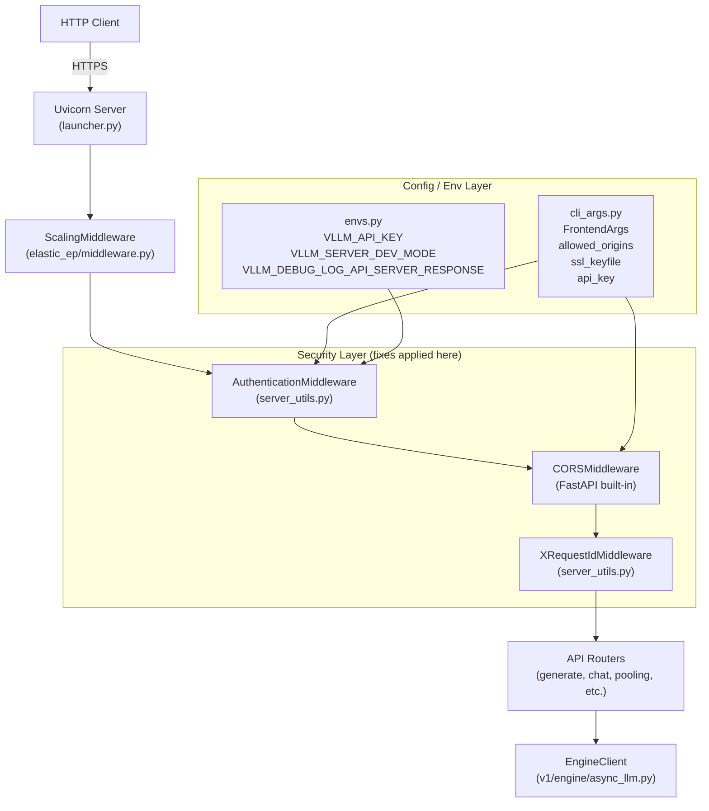
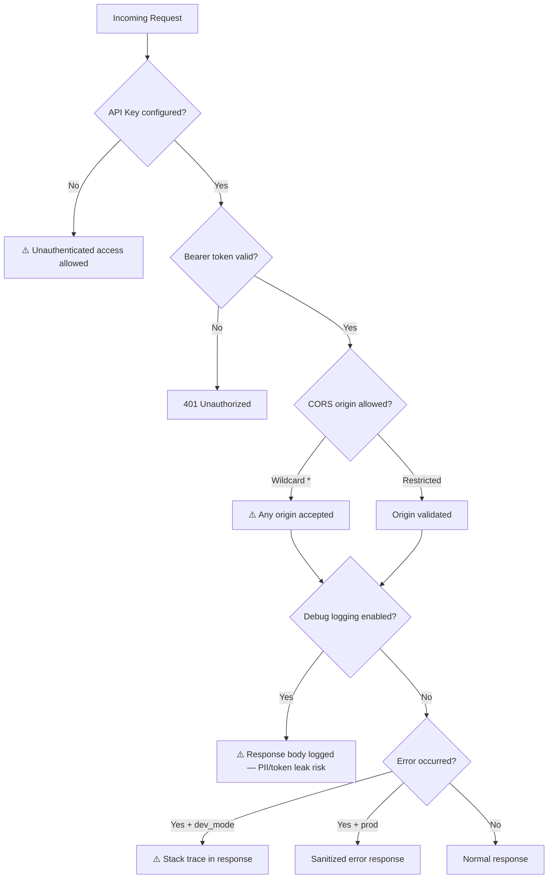
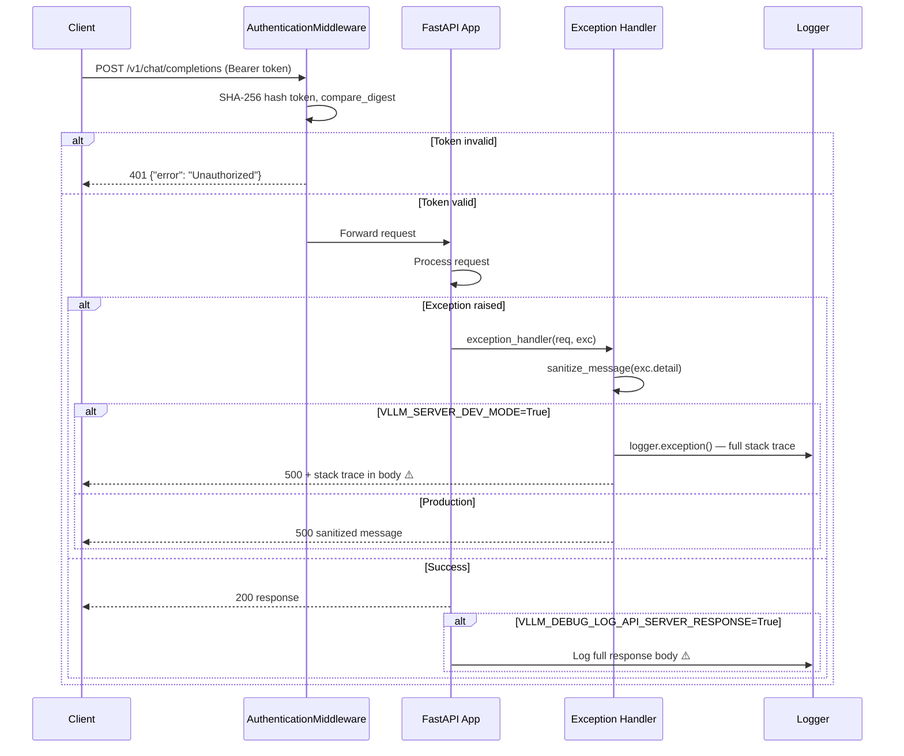
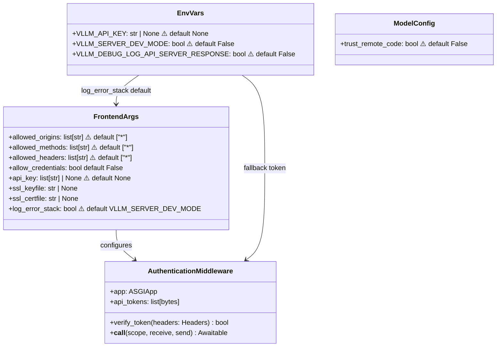

# Fix Security Issues — vLLM

This plan addresses security vulnerabilities identified in the vLLM codebase, focusing on the OpenAI-compatible API server, authentication middleware, CORS configuration, logging of sensitive data, trust boundaries, and input validation. The fixes span the entrypoints layer, environment variable handling, and server configuration defaults.

---

## Design & Architecture

### Overview

vLLM exposes an OpenAI-compatible HTTP API server (`vllm/entrypoints/openai/api_server.py`) built on FastAPI/Uvicorn. The server supports authentication via `AuthenticationMiddleware` (Bearer token), CORS via `CORSMiddleware`, SSL/TLS, and optional debug logging. Security issues exist across several layers: overly permissive CORS defaults (`["*"]`), optional authentication that is off by default, debug response logging that can leak sensitive data, stack-trace exposure in error responses, `trust_remote_code` propagation without explicit user acknowledgment, and missing rate-limiting/request-size controls.

The fix plan is organized as vertical feature slices — each phase owns all the code changes for one security concern area. Phases are largely independent and can run in parallel after Phase 1 (which establishes shared security utilities).

### Diagrams

#### Architecture / Component Diagram



#### Security Issue Flowchart



#### Data Flow — Authentication & Logging



#### Class / Data Model Diagram



### Directory Structure

```
vllm/
├── entrypoints/
│   ├── openai/
│   │   ├── api_server.py          # CORS config, auth wiring, debug log guard
│   │   ├── cli_args.py            # FrontendArgs defaults (CORS, api_key)
│   │   └── server_utils.py        # AuthenticationMiddleware, exception handlers
│   ├── ssl.py                     # SSL context helpers
│   └── utils.py                   # sanitize_message
├── config/
│   └── model.py                   # trust_remote_code default + warning
├── envs.py                        # VLLM_API_KEY, VLLM_SERVER_DEV_MODE env vars
├── logger.py                      # Logging configuration
└── ...
tests/
├── entrypoints/
│   └── openai/
│       └── test_security.py       # New: security-focused tests
└── ...
```

### Key Design Decisions

| Decision | Choice | Rationale |
|----------|--------|-----------|
| CORS default | Change `["*"]` to `[]` (deny all) | Wildcard CORS is a security risk; operators must explicitly opt in |
| Auth enforcement | Warn loudly when no API key is set | Cannot force auth without breaking existing deployments, but must alert |
| Stack trace exposure | Never include stack trace in HTTP response body | Stack traces leak internal paths, library versions, and logic |
| Debug response logging | Gate behind explicit env var with production warning | Logging full responses risks PII/token leakage in production |
| trust_remote_code | Emit security warning when enabled | Executing arbitrary remote code is a critical risk |
| Rate limiting | Document + add optional middleware hook | Full rate limiting requires infrastructure; provide the hook |
| SSL verification | Warn when SSL is not configured in non-localhost deployments | Plaintext HTTP exposes tokens and model outputs |

### Technology Stack

- **Runtime/Language:** Python 3.10+
- **Framework:** FastAPI + Uvicorn (ASGI)
- **Key Libraries:** `starlette` (middleware), `pydantic` (validation), `hashlib`/`secrets` (auth), `ssl` (TLS)
- **Security Primitives:** `secrets.compare_digest` (timing-safe comparison), `hashlib.sha256` (token hashing)

---

## Execution Plan

### Phase 1: Security Utilities & Shared Helpers
**Estimated effort:** 2-3 hours
**Dependencies:** None

Establish shared security utility functions used by subsequent phases. This includes a centralized security warning emitter, a `sanitize_message` hardening review, and a helper to validate CORS origin lists.

#### Tasks:
- [ ] Review and harden `vllm/entrypoints/utils.py::sanitize_message()` — ensure it strips file paths, line numbers, and internal module names from error strings before they reach HTTP responses
- [ ] Add `vllm/entrypoints/utils.py::emit_security_warning(msg: str)` — a helper that logs at WARNING level with a `[SECURITY]` prefix, used consistently across all security-relevant startup checks
- [ ] Add `vllm/entrypoints/utils.py::validate_cors_origins(origins: list[str]) -> None` — raises `ValueError` if `"*"` is combined with `allow_credentials=True` (which browsers reject anyway, but should be caught early)
- [ ] Add `vllm/entrypoints/utils.py::is_localhost(host: str | None) -> bool` — returns True for `None`, `"127.0.0.1"`, `"::1"`, `"localhost"` — used by SSL and auth checks

#### Deliverables:
- Updated `vllm/entrypoints/utils.py` with `emit_security_warning`, `validate_cors_origins`, `is_localhost`, hardened `sanitize_message`

---

### Phase 2: CORS Configuration Hardening
**Estimated effort:** 2-3 hours
**Dependencies:** Phase 1

The default CORS configuration in `FrontendArgs` allows all origins (`["*"]`), all methods (`["*"]`), and all headers (`["*"]`). This is a significant security risk for any deployment where the API is accessible from a browser or cross-origin context.

#### Tasks:
- [ ] In `vllm/entrypoints/openai/cli_args.py`, change `FrontendArgs.allowed_origins` default from `["*"]` to `[]` (empty list — deny all cross-origin requests by default)
- [ ] In `vllm/entrypoints/openai/cli_args.py`, change `FrontendArgs.allowed_methods` default from `["*"]` to `["GET", "POST", "OPTIONS"]` — the minimum needed for the OpenAI API
- [ ] In `vllm/entrypoints/openai/cli_args.py`, change `FrontendArgs.allowed_headers` default from `["*"]` to `["Authorization", "Content-Type", "X-Request-Id"]`
- [ ] In `vllm/entrypoints/openai/cli_args.py`, update docstrings for `allowed_origins`, `allowed_methods`, `allowed_headers` to document the new secure defaults and how to restore permissive behavior for development
- [ ] In `vllm/entrypoints/openai/api_server.py::build_app()`, after adding `CORSMiddleware`, call `validate_cors_origins(args.allowed_origins)` (imported from `vllm.entrypoints.utils`) to catch the `credentials + wildcard` misconfiguration at startup
- [ ] In `vllm/entrypoints/openai/api_server.py::build_app()`, if `args.allowed_origins` is empty and `not is_localhost(args.host)`, call `emit_security_warning("CORS allowed_origins is empty — all cross-origin requests will be rejected. Set --allowed-origins to enable cross-origin access.")`

#### Deliverables:
- Updated `vllm/entrypoints/openai/cli_args.py` with secure CORS defaults
- Updated `vllm/entrypoints/openai/api_server.py` with CORS validation at startup

---

### Phase 3: Authentication Enforcement & API Key Warnings
**Estimated effort:** 2-3 hours
**Dependencies:** Phase 1

Authentication is entirely optional. When no API key is configured, the server accepts all requests without any credential check. This is acceptable for local development but dangerous in any networked deployment.

#### Tasks:
- [ ] In `vllm/entrypoints/openai/api_server.py::build_app()`, after the auth middleware block, add a startup check: if no tokens are configured (`not tokens`) and `not is_localhost(args.host)`, call `emit_security_warning("No API key configured. The server is accepting unauthenticated requests. Set --api-key or VLLM_API_KEY to require authentication.")`
- [ ] In `vllm/entrypoints/openai/server_utils.py::AuthenticationMiddleware.__call__()`, fix the WebSocket authentication path — currently `scope["method"]` is accessed for WebSocket scopes which don't have a `method` key; guard with `scope.get("method", "") == "OPTIONS"` to prevent `KeyError`
- [ ] In `vllm/entrypoints/openai/server_utils.py::AuthenticationMiddleware.__call__()`, extend authentication to cover `/v2` paths in addition to `/v1` paths — change `url_path.startswith("/v1")` to `url_path.startswith(("/v1", "/v2"))` to future-proof the check
- [ ] In `vllm/entrypoints/openai/server_utils.py::AuthenticationMiddleware`, add a `verify_token` timing-safe path for empty token list — currently `token_match` starts as `False` and the loop is skipped, which is correct, but add an explicit early-return guard with a comment explaining the constant-time intent
- [ ] In `vllm/entrypoints/openai/cli_args.py`, update `api_key` field docstring to note that `VLLM_API_KEY` env var is the recommended production approach and that the CLI flag may appear in process listings

#### Deliverables:
- Updated `vllm/entrypoints/openai/api_server.py` with no-auth warning
- Updated `vllm/entrypoints/openai/server_utils.py` with WebSocket auth fix and `/v2` coverage

---

### Phase 4: Error Response & Stack Trace Hardening
**Estimated effort:** 2-3 hours
**Dependencies:** Phase 1

The `log_error_stack` flag defaults to `VLLM_SERVER_DEV_MODE`. When enabled, full Python stack traces are logged. More critically, the `exception_handler` in `server_utils.py` must never include raw exception details (file paths, line numbers, internal module names) in HTTP response bodies.

#### Tasks:
- [ ] In `vllm/entrypoints/openai/server_utils.py::exception_handler()`, audit the error message construction — ensure `sanitize_message()` is called on ALL exception string representations before they are placed in `ErrorResponse.error.message`
- [ ] In `vllm/entrypoints/openai/server_utils.py::http_exception_handler()`, verify `sanitize_message(exc.detail)` is applied (it is, but add a comment explaining why)
- [ ] In `vllm/entrypoints/openai/server_utils.py::validation_exception_handler()`, ensure `sanitize_message(message)` is applied to the combined `exc_str + errors_str` before it enters `ErrorResponse` — currently `message` is passed unsanitized
- [ ] In `vllm/entrypoints/utils.py::sanitize_message()`, strengthen the implementation to strip Python file paths (patterns like `/home/...`, `/usr/...`, `site-packages/...`), line number references (`line N`), and internal module names from error strings using regex substitution
- [ ] In `vllm/entrypoints/openai/cli_args.py`, change `log_error_stack` default from `envs.VLLM_SERVER_DEV_MODE` to `False` — stack traces should never be logged by default; operators must explicitly opt in
- [ ] In `vllm/entrypoints/openai/api_server.py`, in the `VLLM_DEBUG_LOG_API_SERVER_RESPONSE` block (line ~282), add a startup `emit_security_warning("VLLM_DEBUG_LOG_API_SERVER_RESPONSE is enabled. Full API response bodies will be logged. This may expose sensitive data including prompts and completions. Do not use in production.")`

#### Deliverables:
- Updated `vllm/entrypoints/openai/server_utils.py` with hardened exception handlers
- Updated `vllm/entrypoints/utils.py` with strengthened `sanitize_message`
- Updated `vllm/entrypoints/openai/cli_args.py` with `log_error_stack=False` default

---

### Phase 5: SSL/TLS Configuration Warnings
**Estimated effort:** 1-2 hours
**Dependencies:** Phase 1

The server can run without SSL. For non-localhost deployments, this means API keys and model outputs are transmitted in plaintext.

#### Tasks:
- [ ] In `vllm/entrypoints/openai/api_server.py::setup_server()` (or equivalent startup function), add a check: if `args.ssl_keyfile is None` and `args.ssl_certfile is None` and `not is_localhost(args.host)`, call `emit_security_warning("SSL is not configured. The server is running over plaintext HTTP. API keys and model outputs will be transmitted unencrypted. Set --ssl-keyfile and --ssl-certfile for production deployments.")`
- [ ] In `vllm/entrypoints/ssl.py`, review the SSL context creation — ensure `ssl.PROTOCOL_TLS_SERVER` is used (not deprecated `ssl.PROTOCOL_TLSv1_2` or similar), and that `ssl_ciphers` defaults exclude known-weak cipher suites (RC4, DES, 3DES, EXPORT, NULL, aNULL, eNULL)
- [ ] In `vllm/entrypoints/openai/cli_args.py`, update `ssl_ciphers` field docstring to document the recommended cipher string (e.g., `"ECDH+AESGCM:ECDH+CHACHA20:!aNULL:!MD5:!DSS"`) and warn against using `"ALL"` or `"DEFAULT"`
- [ ] In `vllm/entrypoints/ssl.py`, if `ssl_cert_reqs` is set to `ssl.CERT_NONE`, emit a security warning via `emit_security_warning` about disabled client certificate verification

#### Deliverables:
- Updated `vllm/entrypoints/openai/api_server.py` with SSL startup warning
- Updated `vllm/entrypoints/ssl.py` with cipher suite and cert verification hardening
- Updated `vllm/entrypoints/openai/cli_args.py` with SSL docstring improvements

---

### Phase 6: trust_remote_code Security Warning
**Estimated effort:** 1-2 hours
**Dependencies:** Phase 1

`ModelConfig.trust_remote_code` defaults to `False`, which is correct. However, when a user enables it, there is no prominent security warning. Executing arbitrary remote code from model repositories is a critical security risk.

#### Tasks:
- [ ] In `vllm/config/model.py`, in the `ModelConfig.__post_init__()` or equivalent validation method, add: if `self.trust_remote_code is True`, call `emit_security_warning("trust_remote_code=True is set. This allows execution of arbitrary Python code from the model repository. Only enable this for models from trusted sources.")` — import `emit_security_warning` from `vllm.entrypoints.utils` or move it to a shared `vllm.utils.security` module accessible without importing entrypoints
- [ ] Create `vllm/utils/security_utils.py` — move `emit_security_warning` and `is_localhost` here (instead of `entrypoints/utils.py`) so they can be imported from both `config/` and `entrypoints/` without circular imports
- [ ] Update `vllm/entrypoints/utils.py` to re-export `emit_security_warning` and `is_localhost` from `vllm.utils.security_utils` for backward compatibility
- [ ] In `vllm/config/model.py`, add a `trust_remote_code` validation that logs the warning using the shared `emit_security_warning` from `vllm.utils.security_utils`

#### Deliverables:
- New `vllm/utils/security_utils.py` with shared security helpers
- Updated `vllm/config/model.py` with `trust_remote_code` warning
- Updated `vllm/entrypoints/utils.py` to re-export from `security_utils`

---

### Phase 7: Request Size & Input Validation Hardening
**Estimated effort:** 2-3 hours
**Dependencies:** None

Large request bodies can cause memory exhaustion. The `h11_max_incomplete_event_size` and `h11_max_header_count` parameters exist but their defaults may be too permissive. Additionally, user-controlled inputs like `tool_server` and `tool_parser_plugin` paths need validation.

#### Tasks:
- [ ] In `vllm/entrypoints/constants.py`, review `H11_MAX_INCOMPLETE_EVENT_SIZE_DEFAULT` and `H11_MAX_HEADER_COUNT_DEFAULT` — document their values and add a comment explaining the security rationale for each limit
- [ ] In `vllm/entrypoints/openai/api_server.py::run_server_worker()`, the `tool_parser_plugin` check `len(args.tool_parser_plugin) > 3` is a weak guard — replace with a proper path validation: ensure the plugin path does not contain `..` (path traversal), is an absolute path or a registered name, and exists if it looks like a file path
- [ ] In `vllm/entrypoints/openai/api_server.py::run_server_worker()`, apply the same path traversal check to `args.reasoning_parser_plugin`
- [ ] In `vllm/entrypoints/openai/cli_args.py`, add validation for `tool_server` field — when not `"demo"`, validate that each `host:port` entry matches a safe pattern (IPv4, IPv6, or hostname) and does not contain shell metacharacters
- [ ] In `vllm/entrypoints/openai/cli_args.py`, add a `validate_parsed_serve_args` check (the function already exists in `cli_args.py`) that validates `h11_max_incomplete_event_size` is not set to an unreasonably large value (e.g., > 100MB) and warns if so

#### Deliverables:
- Updated `vllm/entrypoints/openai/api_server.py` with plugin path validation
- Updated `vllm/entrypoints/openai/cli_args.py` with `tool_server` and size limit validation
- Updated `vllm/entrypoints/constants.py` with documented security rationale

---

### Phase 8: Testing & Quality Assurance
**Estimated effort:** 3-4 hours
**Dependencies:** Phase 1, Phase 2, Phase 3, Phase 4, Phase 5, Phase 6, Phase 7

Write a comprehensive security-focused test suite covering all the fixes applied in previous phases.

#### Tasks:
- [ ] Create `tests/entrypoints/openai/test_security.py` with the following test classes:
  - `TestAuthenticationMiddleware`:
    - `test_no_token_rejects_v1_request` — verify 401 when no Bearer token provided
    - `test_valid_token_allows_request` — verify 200 with correct token
    - `test_invalid_token_rejects_request` — verify 401 with wrong token
    - `test_options_request_bypasses_auth` — verify OPTIONS is allowed without token
    - `test_health_endpoint_bypasses_auth` — verify `/health` is allowed without token
    - `test_websocket_scope_no_keyerror` — verify WebSocket scope doesn't raise `KeyError` on missing `method`
    - `test_v2_path_requires_auth` — verify `/v2/...` paths also require auth
  - `TestCORSDefaults`:
    - `test_default_allowed_origins_is_empty` — verify `FrontendArgs().allowed_origins == []`
    - `test_default_allowed_methods_is_restricted` — verify default methods list
    - `test_wildcard_with_credentials_raises` — verify `validate_cors_origins` raises on `*` + credentials
  - `TestErrorSanitization`:
    - `test_sanitize_message_strips_file_paths` — verify `/home/user/...` paths are removed
    - `test_sanitize_message_strips_line_numbers` — verify `line 42` references are removed
    - `test_exception_handler_no_stack_trace_in_response` — verify 500 response body doesn't contain traceback
    - `test_validation_error_sanitized` — verify validation errors don't leak internal paths
  - `TestSSLWarnings`:
    - `test_no_ssl_non_localhost_emits_warning` — verify `emit_security_warning` called when SSL absent on non-localhost
    - `test_localhost_no_ssl_no_warning` — verify no warning for localhost without SSL
  - `TestTrustRemoteCode`:
    - `test_trust_remote_code_emits_warning` — verify security warning logged when `trust_remote_code=True`
    - `test_trust_remote_code_false_no_warning` — verify no warning when `trust_remote_code=False`
  - `TestPluginPathValidation`:
    - `test_tool_parser_plugin_path_traversal_rejected` — verify `../../evil` is rejected
    - `test_reasoning_parser_plugin_path_traversal_rejected` — same for reasoning plugin
- [ ] Run the test suite: `python -m pytest tests/entrypoints/openai/test_security.py -v`
- [ ] Run existing entrypoint tests to verify no regressions: `python -m pytest tests/entrypoints/ -v --timeout=60`
- [ ] Verify syntax of all modified files: `python -m py_compile vllm/entrypoints/openai/api_server.py vllm/entrypoints/openai/server_utils.py vllm/entrypoints/openai/cli_args.py vllm/entrypoints/utils.py vllm/utils/security_utils.py vllm/config/model.py vllm/entrypoints/ssl.py vllm/entrypoints/constants.py`

#### Deliverables:
- `tests/entrypoints/openai/test_security.py` — comprehensive security test suite
- All tests passing with zero regressions in existing entrypoint tests

---

## Verification Criteria

After all phases are complete, verify the security fixes as follows:

### 1. CORS Defaults
```bash
python -c "from vllm.entrypoints.openai.cli_args import FrontendArgs; f = FrontendArgs(); assert f.allowed_origins == [], f'Expected [], got {f.allowed_origins}'; print('PASS: CORS default is empty')"
```

### 2. Authentication Warning (no API key on non-localhost)
Start the server without `--api-key` and `--host 0.0.0.0`, verify the log contains `[SECURITY]` warning about unauthenticated access.

### 3. Authentication Enforcement
```bash
# With API key configured, unauthenticated request should return 401
curl -s -o /dev/null -w "%{http_code}" http://localhost:8000/v1/models
# Expected: 401

# With valid token
curl -s -H "Authorization: Bearer mykey" -o /dev/null -w "%{http_code}" http://localhost:8000/v1/models
# Expected: 200
```

### 4. Error Response Sanitization
```bash
# Send a malformed request and verify the response body contains no file paths or stack traces
curl -s -X POST http://localhost:8000/v1/chat/completions \
  -H "Content-Type: application/json" \
  -d '{"invalid": "payload"}' | python -c "import sys,json; r=json.load(sys.stdin); assert '/home' not in str(r) and 'Traceback' not in str(r), 'Stack trace leaked!'; print('PASS: No stack trace in error response')"
```

### 5. trust_remote_code Warning
```bash
python -c "
import logging, warnings
logging.basicConfig(level=logging.WARNING)
# Instantiate ModelConfig with trust_remote_code=True and verify warning is emitted
from vllm.config.model import ModelConfig
import io, logging
handler = logging.StreamHandler(buf := io.StringIO())
logging.getLogger('vllm').addHandler(handler)
# (ModelConfig instantiation with trust_remote_code=True should trigger warning)
print('Verify [SECURITY] appears in log output')
"
```

### 6. Security Test Suite
```bash
python -m pytest tests/entrypoints/openai/test_security.py -v
# Expected: All tests PASSED, 0 failures
```

### 7. No Regressions
```bash
python -m pytest tests/entrypoints/ -v --timeout=60 -x
# Expected: Same pass count as before these changes, 0 new failures
```
