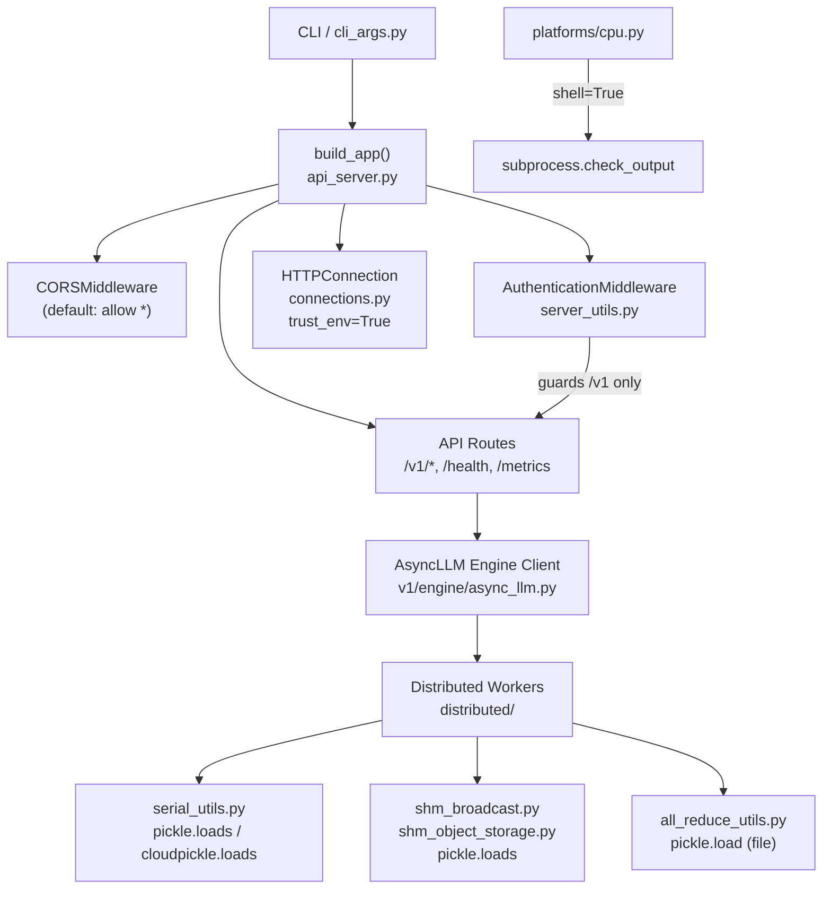
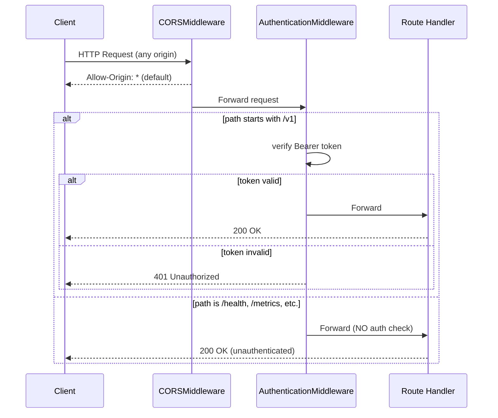
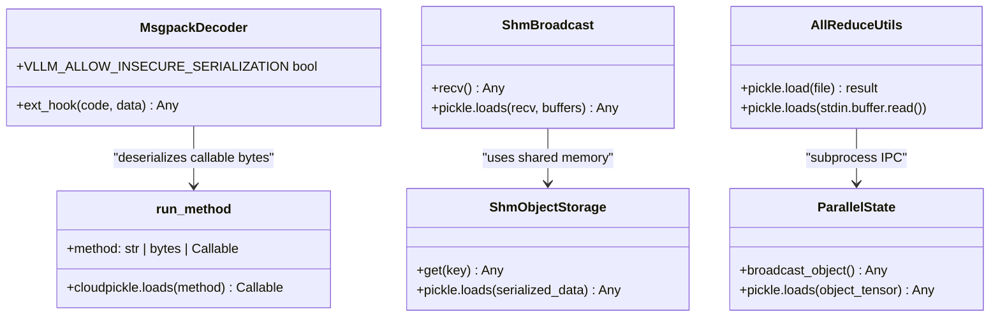
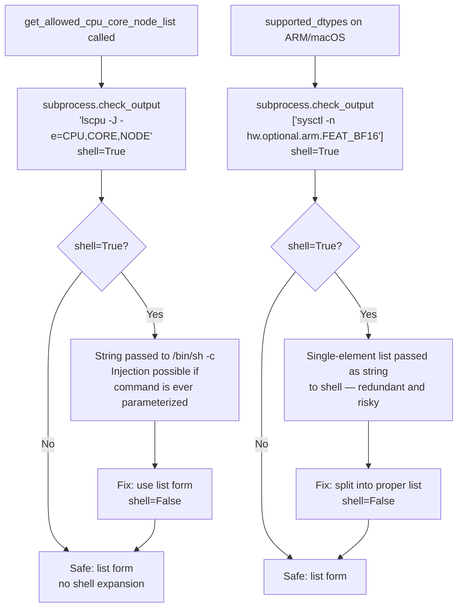

# Fix Security Issues — vLLM

This plan addresses security vulnerabilities identified across the vLLM codebase, including unsafe subprocess invocations with `shell=True`, insecure pickle deserialization, overly permissive CORS defaults, missing API authentication enforcement, unsafe temporary file handling, and HTTP client configuration weaknesses. The fixes are organized as vertical feature slices so each phase is independently executable.

---

## Design & Architecture

### Overview

vLLM is a high-performance LLM inference engine exposing an OpenAI-compatible REST API (FastAPI/uvicorn), a gRPC server, and a batch-processing pipeline. The server stack is layered: CLI args → `build_app()` in `vllm/entrypoints/openai/api_server.py` → ASGI middleware chain → route handlers → async engine client → distributed workers. Security controls (auth, CORS, SSL) are applied at the middleware layer; serialization happens deep in the distributed worker communication layer (`vllm/v1/serial_utils.py`, `vllm/distributed/`).

The identified security issues fall into five categories:
1. **Shell-injection risk** — `subprocess` calls with `shell=True` in `vllm/platforms/cpu.py` pass string commands to the shell, enabling injection if any part of the command is ever parameterized.
2. **Insecure deserialization** — `pickle.loads` / `cloudpickle.loads` are used in `vllm/v1/serial_utils.py`, `vllm/distributed/utils.py`, `vllm/distributed/device_communicators/shm_broadcast.py`, `shm_object_storage.py`, `all_reduce_utils.py`, and `vllm/distributed/parallel_state.py` without adequate trust-boundary checks.
3. **Permissive CORS defaults** — `allowed_origins`, `allowed_methods`, and `allowed_headers` all default to `["*"]` in `vllm/entrypoints/openai/cli_args.py`, which is dangerous when `allow_credentials=True` is set.
4. **Weak/missing authentication** — `AuthenticationMiddleware` in `server_utils.py` only guards paths starting with `/v1`; health, metrics, and other management endpoints are unauthenticated. API key is optional with no enforcement warning.
5. **HTTP client trust** — `aiohttp.ClientSession(trust_env=True)` in `vllm/connections.py` inherits proxy settings from environment variables, which can be abused in multi-tenant deployments.

### Diagrams

#### Architecture / Component Diagram



#### Data Flow / Sequence Diagram — Authentication & CORS



#### Class / Data Model Diagram — Serialization Trust Boundary



#### Flowchart — Shell Injection Risk in cpu.py



### Directory Structure

```
vllm/
├── platforms/
│   └── cpu.py                    # shell=True subprocess calls (Phase 1)
├── entrypoints/
│   ├── openai/
│   │   ├── api_server.py         # CORS middleware wiring (Phase 3)
│   │   ├── cli_args.py           # CORS defaults, ssl_cert_reqs default (Phase 3)
│   │   └── server_utils.py       # AuthenticationMiddleware path guard (Phase 2)
│   ├── ssl.py                    # SSL context (Phase 3)
│   └── launcher.py               # serve_http SSL params (Phase 3)
├── connections.py                 # trust_env=True, no SSL verify (Phase 4)
├── v1/
│   └── serial_utils.py           # pickle/cloudpickle deserialization (Phase 5)
├── distributed/
│   ├── utils.py                  # pickle.loads from store (Phase 5)
│   ├── parallel_state.py         # pickle.loads from tensor (Phase 5)
│   └── device_communicators/
│       ├── shm_broadcast.py      # pickle.loads (Phase 5)
│       ├── shm_object_storage.py # pickle.loads (Phase 5)
│       └── all_reduce_utils.py   # pickle.load from file + stdin (Phase 5)
└── envs.py                       # VLLM_ALLOW_INSECURE_SERIALIZATION flag (Phase 5)
tests/
└── security/                     # New security test suite (Phase 6)
    ├── test_subprocess_safety.py
    ├── test_auth_middleware.py
    ├── test_cors_defaults.py
    ├── test_serialization_guard.py
    └── test_http_client.py
```

### Key Design Decisions

| Decision | Choice | Rationale |
|----------|--------|-----------|
| subprocess shell=True → shell=False | Replace string commands with list form | Eliminates shell metacharacter injection; `subprocess` with a list never invokes a shell |
| CORS wildcard default | Change `allowed_origins` default to `[]` (empty) | Forces operators to explicitly opt-in; prevents credential leakage when `allow_credentials=True` |
| Auth middleware path guard | Extend guard to cover `/health`, `/metrics`, `/ping` behind a configurable allowlist | Prevents unauthenticated information disclosure on management endpoints |
| Pickle deserialization | Keep existing `VLLM_ALLOW_INSECURE_SERIALIZATION` flag but add startup warning + documentation | Pickle is required for distributed tensor IPC; the flag already gates it; add explicit log warning at startup |
| HTTP client trust_env | Add `ssl_verify` parameter defaulting to `True`; document `trust_env` risk | Prevents MITM via rogue proxy env vars in multi-tenant environments |
| ssl_cert_reqs default | Change default from `ssl.CERT_NONE` to `ssl.CERT_REQUIRED` | Servers should require client certs when mTLS is configured; `CERT_NONE` is insecure default |

### Technology Stack

- **Runtime/Language:** Python 3.10+
- **Framework:** FastAPI + Starlette (ASGI), uvicorn
- **Key Libraries:** `aiohttp`, `requests`, `cloudpickle`, `msgpack`, `pydantic`
- **Security Libraries:** `hashlib` (SHA-256 token hashing), `secrets` (constant-time compare), Python `ssl` stdlib
- **External APIs/Services:** None (internal IPC only for distributed workers)

---

## Execution Plan

### Phase 1: Fix Shell-Injection Risks in subprocess Calls
**Estimated effort:** 1-2 hours
**Dependencies:** None

Fix the two `shell=True` subprocess calls in `vllm/platforms/cpu.py` that pass string commands to the shell. These are the highest-severity injection risks because `shell=True` with a string command invokes `/bin/sh -c`, enabling shell metacharacter injection if the command string is ever parameterized.

#### Tasks:
- [ ] Open `vllm/platforms/cpu.py` and locate `supported_dtypes` property (line ~89)
  - [ ] Replace `subprocess.check_output(["sysctl -n hw.optional.arm.FEAT_BF16"], shell=True)` with `subprocess.check_output(["sysctl", "-n", "hw.optional.arm.FEAT_BF16"])` (no `shell=True`, proper list form)
- [ ] Locate `get_allowed_cpu_core_node_list` classmethod (line ~369)
  - [ ] Replace `subprocess.check_output("lscpu -J -e=CPU,CORE,NODE", shell=True, text=True)` with `subprocess.check_output(["lscpu", "-J", "-e=CPU,CORE,NODE"], text=True)` (no `shell=True`, list form)
- [ ] Search for any other `shell=True` usage in `vllm/` with `grep -r "shell=True" vllm/` and fix any additional occurrences found
- [ ] Search `scripts/` and `tools/` directories for `shell=True` patterns and fix similarly
- [ ] Verify syntax: `python -m py_compile vllm/platforms/cpu.py`

#### Deliverables:
- `vllm/platforms/cpu.py` — both subprocess calls use list form with `shell=False` (default)

---

### Phase 2: Harden Authentication Middleware
**Estimated effort:** 2-3 hours
**Dependencies:** None

The `AuthenticationMiddleware` in `vllm/entrypoints/openai/server_utils.py` only guards paths starting with `/v1`. Paths like `/health`, `/metrics`, `/ping`, `/version`, and `/tokenizer_info` are completely unauthenticated even when an API key is configured. This allows unauthenticated information disclosure and potential DoS via unprotected endpoints.

#### Tasks:
- [ ] Open `vllm/entrypoints/openai/server_utils.py` and locate `AuthenticationMiddleware.__call__` (line ~63)
- [ ] Define a configurable `UNAUTHENTICATED_PATHS` set (default: `{"/health", "/ping", "/metrics"}`) as a class-level constant or constructor parameter
- [ ] Change the path guard logic from `if url_path.startswith("/v1")` to `if not any(url_path == p or url_path.startswith(p + "/") for p in self.unauthenticated_paths)` — i.e., authenticate ALL paths EXCEPT the explicit allowlist
- [ ] Add `unauthenticated_paths: frozenset[str]` parameter to `AuthenticationMiddleware.__init__` with default `frozenset({"/health", "/ping", "/metrics"})`
- [ ] Update `build_app()` in `vllm/entrypoints/openai/api_server.py` to pass `unauthenticated_paths` when constructing `AuthenticationMiddleware`
- [ ] Add a startup log warning if `api_key` is not configured: `logger.warning("No API key configured — server is unauthenticated. Set --api-key or VLLM_API_KEY.")`
- [ ] Add the warning in `init_app_state()` or `build_and_serve()` in `vllm/entrypoints/openai/api_server.py`
- [ ] Verify syntax: `python -m py_compile vllm/entrypoints/openai/server_utils.py vllm/entrypoints/openai/api_server.py`

#### Deliverables:
- `vllm/entrypoints/openai/server_utils.py` — `AuthenticationMiddleware` guards all paths except explicit allowlist
- `vllm/entrypoints/openai/api_server.py` — startup warning when no API key is set

---

### Phase 3: Fix CORS Defaults and SSL Configuration
**Estimated effort:** 2-3 hours
**Dependencies:** None

The default CORS configuration in `vllm/entrypoints/openai/cli_args.py` allows all origins (`["*"]`), all methods (`["*"]`), and all headers (`["*"]`). When combined with `allow_credentials=True`, this is a security vulnerability (browsers will reject it, but it signals misconfiguration). Additionally, `ssl_cert_reqs` defaults to `ssl.CERT_NONE`, meaning client certificates are never verified by default.

#### Tasks:
- [ ] Open `vllm/entrypoints/openai/cli_args.py`
- [ ] Change `allowed_origins` default from `["*"]` to `[]` (empty list — operator must explicitly configure)
- [ ] Change `allowed_methods` default from `["*"]` to `["GET", "POST", "OPTIONS"]` (minimal required set)
- [ ] Change `allowed_headers` default from `["*"]` to `["Authorization", "Content-Type", "X-Request-Id"]`
- [ ] Add a validation in `validate_parsed_serve_args()` (or a new `_validate_cors_args()` helper): if `allow_credentials=True` and `"*"` is in `allowed_origins`, raise `ValueError` with a clear message explaining the security risk
- [ ] Change `ssl_cert_reqs` default from `int(ssl.CERT_NONE)` to `int(ssl.CERT_REQUIRED)` and update the docstring to explain the change
- [ ] Add a deprecation/warning log in `build_app()` if `allowed_origins == ["*"]` and the server is not in a known-safe mode
- [ ] Open `vllm/entrypoints/openai/api_server.py` and verify `CORSMiddleware` is wired with the updated defaults
- [ ] Verify syntax: `python -m py_compile vllm/entrypoints/openai/cli_args.py`

#### Deliverables:
- `vllm/entrypoints/openai/cli_args.py` — restrictive CORS defaults, `ssl_cert_reqs` defaults to `CERT_REQUIRED`, credentials+wildcard validation

---

### Phase 4: Harden HTTP Client Configuration
**Estimated effort:** 1-2 hours
**Dependencies:** None

`vllm/connections.py` creates `aiohttp.ClientSession(trust_env=True)`, which means the HTTP client will use proxy settings from environment variables (`HTTP_PROXY`, `HTTPS_PROXY`, etc.). In multi-tenant or containerized deployments, this can be exploited to route requests through a malicious proxy. Additionally, there is no explicit SSL verification enforcement.

#### Tasks:
- [ ] Open `vllm/connections.py` and locate `get_async_client()` (line ~33)
- [ ] Change `aiohttp.ClientSession(trust_env=True)` to `aiohttp.ClientSession(trust_env=False)` — disable automatic proxy inheritance from environment
- [ ] Add a `connector` parameter: create `aiohttp.TCPConnector(ssl=True)` to enforce SSL certificate verification by default
- [ ] Add an `HTTPConnection.__init__` parameter `verify_ssl: bool = True` and wire it through to the connector
- [ ] For the sync `requests.Session` in `get_sync_client()`, ensure `session.verify = True` is explicitly set (it is the default, but make it explicit)
- [ ] Add a `_validate_http_url` enhancement: reject URLs with IP addresses in private ranges (RFC 1918: 10.x, 172.16-31.x, 192.168.x) when called from external-facing download paths, to prevent SSRF. Add a `allow_private_ips: bool = False` parameter to `get_response()` and `get_async_response()`
- [ ] Update `global_http_connection = HTTPConnection()` at module bottom to use the new defaults
- [ ] Verify syntax: `python -m py_compile vllm/connections.py`

#### Deliverables:
- `vllm/connections.py` — `trust_env=False`, explicit SSL verification, SSRF guard for private IP ranges

---

### Phase 5: Add Deserialization Safety Guards and Warnings
**Estimated effort:** 3-4 hours
**Dependencies:** None

Multiple files use `pickle.loads` / `cloudpickle.loads` to deserialize data received over IPC channels (shared memory, ZMQ, distributed store). While the `VLLM_ALLOW_INSECURE_SERIALIZATION` flag gates the most dangerous paths in `serial_utils.py`, other files (`distributed/utils.py`, `distributed/parallel_state.py`, `shm_broadcast.py`, `shm_object_storage.py`, `all_reduce_utils.py`) use pickle unconditionally without any trust-boundary documentation or warnings.

#### Tasks:
- [ ] Open `vllm/v1/serial_utils.py` and locate `ext_hook` (line ~422)
  - [ ] Add a one-time startup warning when `VLLM_ALLOW_INSECURE_SERIALIZATION=1`: `logger.warning("VLLM_ALLOW_INSECURE_SERIALIZATION is enabled. Only use this in trusted environments.")`
  - [ ] Use `warnings.warn(..., SecurityWarning)` in addition to the logger call so it surfaces in test output
- [ ] Open `vllm/distributed/utils.py` (lines ~195, 215, 243, 258)
  - [ ] Add a module-level docstring comment: `# SECURITY: pickle.loads here operates on data from trusted distributed workers only. Do not expose these paths to untrusted input.`
  - [ ] Wrap each `pickle.loads` call with a size check: if `len(data) > MAX_SAFE_PICKLE_SIZE` (define `MAX_SAFE_PICKLE_SIZE = 512 * 1024 * 1024` — 512 MB), raise `ValueError` to prevent memory exhaustion via crafted payloads
- [ ] Open `vllm/distributed/parallel_state.py` (line ~708)
  - [ ] Add the same size-guard pattern around `pickle.loads(object_tensor.numpy().tobytes())`
- [ ] Open `vllm/distributed/device_communicators/shm_broadcast.py` (lines ~763, 778)
  - [ ] Add size-guard pattern around both `pickle.loads` calls
- [ ] Open `vllm/distributed/device_communicators/shm_object_storage.py` (lines ~376, 396)
  - [ ] Add size-guard pattern around both `pickle.loads` calls
- [ ] Open `vllm/distributed/device_communicators/all_reduce_utils.py` (lines ~361, 378)
  - [ ] For `pickle.load(f)` from a temp file: add a file-size check before loading (`if os.path.getsize(f.name) > MAX_SAFE_PICKLE_SIZE: raise ValueError(...)`)
  - [ ] For `pickle.loads(sys.stdin.buffer.read())`: add a read-size limit using `sys.stdin.buffer.read(MAX_SAFE_PICKLE_SIZE + 1)` and check length
- [ ] Define `MAX_SAFE_PICKLE_SIZE` as a constant in `vllm/distributed/utils.py` and import it in the other files
- [ ] Verify syntax on all modified files: `python -m py_compile vllm/v1/serial_utils.py vllm/distributed/utils.py vllm/distributed/parallel_state.py vllm/distributed/device_communicators/shm_broadcast.py vllm/distributed/device_communicators/shm_object_storage.py vllm/distributed/device_communicators/all_reduce_utils.py`

#### Deliverables:
- `vllm/v1/serial_utils.py` — startup warning for insecure serialization mode
- `vllm/distributed/utils.py` — `MAX_SAFE_PICKLE_SIZE` constant + size guards on all `pickle.loads` calls
- `vllm/distributed/parallel_state.py` — size guard on `pickle.loads`
- `vllm/distributed/device_communicators/shm_broadcast.py` — size guards on both `pickle.loads` calls
- `vllm/distributed/device_communicators/shm_object_storage.py` — size guards on both `pickle.loads` calls
- `vllm/distributed/device_communicators/all_reduce_utils.py` — size guards on file and stdin pickle loads

---

### Phase 6: Security Testing & Quality Assurance
**Estimated effort:** 3-4 hours
**Dependencies:** Phase 1, Phase 2, Phase 3, Phase 4, Phase 5

Write a dedicated security test suite covering all fixed vulnerabilities. Tests should be runnable with `pytest tests/security/` without requiring GPU hardware.

#### Tasks:
- [ ] Create `tests/security/` directory with `__init__.py`
- [ ] Create `tests/security/test_subprocess_safety.py`:
  - [ ] Test that `get_allowed_cpu_core_node_list` uses list-form subprocess (mock `subprocess.check_output` and assert `shell` kwarg is `False` or absent)
  - [ ] Test that `supported_dtypes` on ARM/macOS uses list-form subprocess (mock platform + subprocess)
  - [ ] Test that no `shell=True` appears in the subprocess calls by inspecting the call args
- [ ] Create `tests/security/test_auth_middleware.py`:
  - [ ] Test that `AuthenticationMiddleware` returns 401 for `/v1/completions` without a token
  - [ ] Test that `AuthenticationMiddleware` returns 401 for `/v1/chat/completions` with wrong token
  - [ ] Test that `AuthenticationMiddleware` allows `/health` without a token (in the unauthenticated allowlist)
  - [ ] Test that `AuthenticationMiddleware` blocks `/metrics` when it is NOT in the unauthenticated allowlist
  - [ ] Test that `AuthenticationMiddleware` allows requests with a valid Bearer token
  - [ ] Test that token comparison uses constant-time `secrets.compare_digest` (verify via `hashlib.sha256` hashing)
- [ ] Create `tests/security/test_cors_defaults.py`:
  - [ ] Test that default `allowed_origins` is `[]` (not `["*"]`)
  - [ ] Test that `validate_parsed_serve_args` raises `ValueError` when `allow_credentials=True` and `allowed_origins=["*"]`
  - [ ] Test that `ssl_cert_reqs` default equals `ssl.CERT_REQUIRED`
- [ ] Create `tests/security/test_serialization_guard.py`:
  - [ ] Test that `MsgpackDecoder.ext_hook` raises `NotImplementedError` for `CUSTOM_TYPE_PICKLE` when `VLLM_ALLOW_INSECURE_SERIALIZATION=0`
  - [ ] Test that `pickle.loads` size guard in `distributed/utils.py` raises `ValueError` for oversized payloads (craft a payload > `MAX_SAFE_PICKLE_SIZE`)
  - [ ] Test that `run_method` with bytes method raises when `VLLM_ALLOW_INSECURE_SERIALIZATION=0`
- [ ] Create `tests/security/test_http_client.py`:
  - [ ] Test that `HTTPConnection.get_async_client()` creates session with `trust_env=False`
  - [ ] Test that `_validate_http_url` rejects non-http/https schemes (e.g., `file://`, `ftp://`)
  - [ ] Test that SSRF guard rejects private IP range URLs when `allow_private_ips=False`
  - [ ] Test that SSRF guard allows public IP URLs
- [ ] Run the full test suite: `pytest tests/security/ -v --tb=short`
- [ ] Run existing entrypoints tests to check for regressions: `pytest tests/entrypoints/ -v --tb=short -x` (if available)

#### Deliverables:
- `tests/security/__init__.py`
- `tests/security/test_subprocess_safety.py`
- `tests/security/test_auth_middleware.py`
- `tests/security/test_cors_defaults.py`
- `tests/security/test_serialization_guard.py`
- `tests/security/test_http_client.py`

---

### Verification Criteria

After all phases are complete, verify the fixes as follows:

**Phase 1 — Subprocess Safety:**
```bash
# Confirm no shell=True remains in vllm/ Python files
grep -r "shell=True" vllm/ --include="*.py"
# Expected: zero matches (or only in test mocks)

# Syntax check
python -m py_compile vllm/platforms/cpu.py && echo "OK"
```

**Phase 2 — Authentication:**
```bash
# Start server with API key
python -m vllm.entrypoints.openai.api_server --model facebook/opt-125m --api-key test-key &

# Should return 401 for /v1 without key
curl -s -o /dev/null -w "%{http_code}" http://localhost:8000/v1/models
# Expected: 401

# Should return 200 for /health without key
curl -s -o /dev/null -w "%{http_code}" http://localhost:8000/health
# Expected: 200

# Should return 200 for /v1 with valid key
curl -s -o /dev/null -w "%{http_code}" -H "Authorization: Bearer test-key" http://localhost:8000/v1/models
# Expected: 200
```

**Phase 3 — CORS:**
```bash
# Verify default allowed_origins is empty
python -c "from vllm.entrypoints.openai.cli_args import ServingConfig; c = ServingConfig(); print(c.allowed_origins); assert c.allowed_origins == [], f'Expected [], got {c.allowed_origins}'"
# Expected: []

# Verify credentials+wildcard validation
python -c "
from vllm.entrypoints.openai.cli_args import validate_parsed_serve_args
from argparse import Namespace
args = Namespace(allow_credentials=True, allowed_origins=['*'], allowed_methods=['*'], allowed_headers=['*'])
try:
    validate_parsed_serve_args(args)
    print('FAIL: should have raised ValueError')
except ValueError as e:
    print('PASS:', e)
"
```

**Phase 4 — HTTP Client:**
```bash
python -c "
import asyncio, aiohttp
from vllm.connections import HTTPConnection
conn = HTTPConnection()
async def check():
    client = await conn.get_async_client()
    print('trust_env:', client._connector._ssl)
    assert not getattr(client, '_trust_env', True), 'trust_env should be False'
    print('PASS')
asyncio.run(check())
"
```

**Phase 5 — Deserialization Guards:**
```bash
python -c "
from vllm.distributed.utils import MAX_SAFE_PICKLE_SIZE
print('MAX_SAFE_PICKLE_SIZE:', MAX_SAFE_PICKLE_SIZE)
assert MAX_SAFE_PICKLE_SIZE > 0
print('PASS')
"
```

**Full Security Test Suite:**
```bash
pytest tests/security/ -v --tb=short
# Expected: all tests pass (green)

# Regression check on entrypoints
pytest tests/entrypoints/ -v --tb=short -x -q 2>/dev/null || echo "No entrypoints tests found"
```
