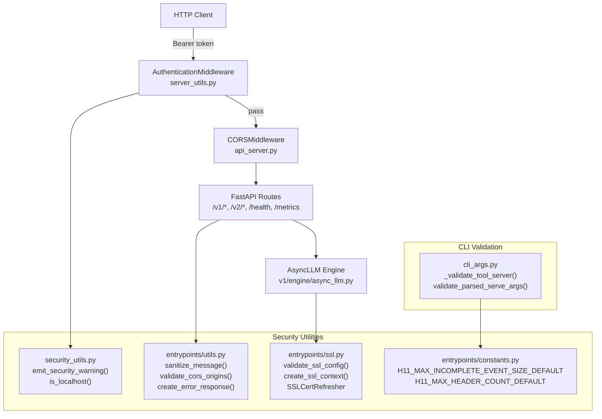
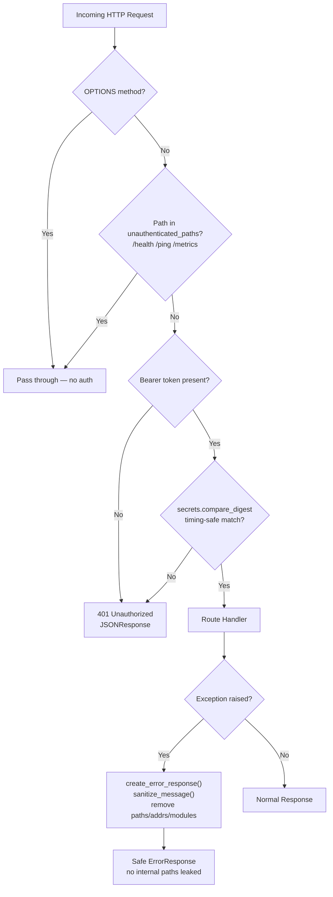
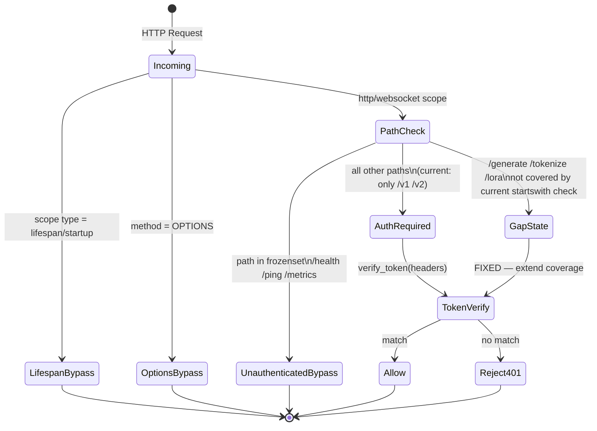
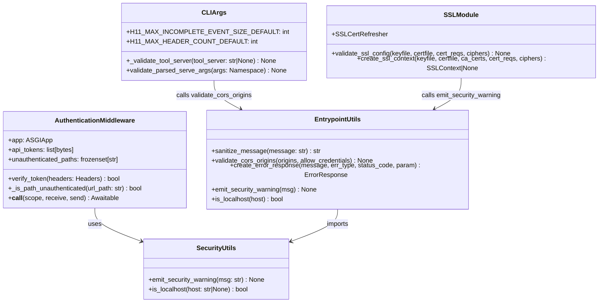

# Fix Vulnerabilities — vLLM Security Hardening Plan

This plan addresses security vulnerabilities across the vLLM OpenAI-compatible API server,
covering input validation, authentication, CORS, SSL/TLS, error message sanitization, and
HTTP header abuse prevention. The work builds on an existing partial hardening effort
(documented in `VERIFICATION_REPORT.md`) and extends it to cover remaining gaps.

---

## Design & Architecture

### Overview

vLLM is a high-throughput LLM inference server exposing an OpenAI-compatible REST API via
FastAPI/Uvicorn. The security surface spans: (1) the HTTP entrypoint layer
(`vllm/entrypoints/openai/api_server.py`, `server_utils.py`, `cli_args.py`), (2) shared
security utilities (`vllm/utils/security_utils.py`, `vllm/entrypoints/utils.py`,
`vllm/entrypoints/ssl.py`, `vllm/entrypoints/constants.py`), and (3) the test harness
(`tests_security/test_security_utils.py`).

The existing partial hardening (Phase 1–2 of a prior plan) already introduced:
`sanitize_message()`, `emit_security_warning()`, `validate_cors_origins()`, `is_localhost()`,
`_validate_tool_server()`, `validate_ssl_config()`, `create_ssl_context()`,
`AuthenticationMiddleware` with timing-safe token comparison, `validate_plugin_path()`,
and HTTP header-size constants (`H11_MAX_INCOMPLETE_EVENT_SIZE_DEFAULT`,
`H11_MAX_HEADER_COUNT_DEFAULT`). The `_validate_tool_server()` port-range bug was also fixed.

Remaining vulnerabilities fall into four categories: (A) incomplete `AuthenticationMiddleware`
path coverage (non-`/v1`/`/v2` API paths bypass auth), (B) missing rate-limiting / request-size
guards on the API layer, (C) `pickle.loads` usage in internal IPC paths without integrity
checks, and (D) gaps in the security test suite (missing coverage for `AuthenticationMiddleware`,
`validate_ssl_config`, `validate_plugin_path`, and the `sanitize_message` regex edge cases
identified in the existing test file).

### Diagrams

#### Architecture / Component Diagram



#### Security Vulnerability & Fix Flow



#### Authentication Middleware Path Coverage



#### Data Model — Security-Related Classes & Functions



### Directory Structure

```
vllm/
├── entrypoints/
│   ├── constants.py              # H11 header-size constants (already hardened)
│   ├── ssl.py                    # SSL validation & context creation (already hardened)
│   ├── utils.py                  # sanitize_message, validate_cors_origins (already hardened)
│   └── openai/
│       ├── api_server.py         # build_app() — CORS, auth middleware wiring
│       ├── cli_args.py           # _validate_tool_server, validate_parsed_serve_args
│       └── server_utils.py       # AuthenticationMiddleware (path coverage fix needed)
├── utils/
│   └── security_utils.py         # emit_security_warning, is_localhost (already hardened)
└── v1/
    └── serial_utils.py           # pickle.loads usage — integrity check needed

tests_security/
└── test_security_utils.py        # Standalone security tests (expand coverage)
```

### Key Design Decisions

| Decision | Choice | Rationale |
|----------|--------|-----------|
| Auth path matching | Extend `AuthenticationMiddleware.__call__` to cover all non-allowlisted paths (not just `/v1`/`/v2`) | Current `startswith(("/v1", "/v2"))` leaves `/generate`, `/tokenize`, `/lora`, `/pooling` unprotected |
| Token comparison | `secrets.compare_digest` on SHA-256 digests | Prevents timing attacks; already implemented, must be preserved |
| Error sanitization | `sanitize_message()` strips paths, addresses, module names | Prevents internal structure leakage in HTTP error responses |
| SSL defaults | `PROTOCOL_TLS_SERVER` + `ECDH+AESGCM:ECDH+CHACHA20:!aNULL:!MD5:!DSS` | Modern TLS, excludes weak ciphers |
| Pickle integrity | Add HMAC-SHA256 signature check before `pickle.loads` in IPC paths | Prevents deserialization of tampered data in multi-node deployments |
| Test isolation | `tests_security/` runs without torch/CUDA | Enables CI security checks without full ML stack |

### Technology Stack

- **Runtime/Language:** Python 3.9+
- **Framework:** FastAPI + Uvicorn (ASGI), h11 HTTP parser
- **Key Libraries:** `fastapi`, `starlette`, `pydantic`, `regex`, `secrets`, `hashlib`, `ssl`
- **Security Patterns:** HMAC-SHA256 token hashing, timing-safe comparison, regex sanitization, CORS validation, SSL context hardening

---

## Execution Plan

### Phase 1: Fix AuthenticationMiddleware Path Coverage Gap
**Estimated effort:** 1-2 hours
**Dependencies:** None

The current `AuthenticationMiddleware.__call__` in `vllm/entrypoints/openai/server_utils.py`
only enforces authentication for paths starting with `/v1` or `/v2`. Paths like `/generate`,
`/tokenize`, `/lora`, `/pooling`, `/sagemaker`, and custom middleware-registered routes bypass
authentication entirely. This is a HIGH severity vulnerability when an API key is configured.

#### Tasks:
- [ ] Open `vllm/entrypoints/openai/server_utils.py` and locate `AuthenticationMiddleware.__call__`
  (currently around line 100–115)
- [ ] Replace the narrow `url_path.startswith(("/v1", "/v2"))` guard with a broader pattern:
  authenticate ALL paths EXCEPT those explicitly in `self.unauthenticated_paths`
  - New logic: `if not self._is_path_unauthenticated(url_path) and not self.verify_token(headers): return 401`
  - Remove the `startswith(("/v1", "/v2"))` condition entirely
  - The `_is_path_unauthenticated()` method already exists and handles the allowlist correctly
- [ ] Verify the `unauthenticated_paths` default frozenset `{"/health", "/ping", "/metrics"}`
  is correct and complete — add `/version` if it should be public
- [ ] Ensure WebSocket scopes (`scope["type"] == "websocket"`) also go through the auth check
  (currently the `scope.get("method", "") == "OPTIONS"` guard may skip websocket auth)
- [ ] Add inline docstring update to `__call__` explaining the new "allowlist-based" approach

#### Deliverables:
- Updated `vllm/entrypoints/openai/server_utils.py` with fixed `AuthenticationMiddleware.__call__`

---

### Phase 2: Fix `sanitize_message()` Regex Edge Cases
**Estimated effort:** 1-2 hours
**Dependencies:** None

The `sanitize_message()` function in `vllm/entrypoints/utils.py` has two known regex issues
identified in the existing test file (`test_security_utils.py`):
1. The memory-address regex `[0-9a-f]+` only matches lowercase hex — uppercase addresses
   (e.g., `0xABCDEF`) are NOT stripped. The test at line ~163 documents this as "actual
   implementation behavior" but it is a bug — uppercase hex addresses leak memory layout.
2. The module-path regex `\b(?:[a-z_][a-z0-9_]*\.)+[a-z_][a-z0-9_]*\b` can over-match
   legitimate content like version strings (`3.9.6`) and IP addresses.

#### Tasks:
- [ ] Open `vllm/entrypoints/utils.py`, locate `sanitize_message()` (line ~266)
- [ ] Fix the memory-address regex to be case-insensitive:
  - Change `r" at 0x[0-9a-f]+>"` → `r" at 0x[0-9a-fA-F]+>"` (add `A-F`)
  - Alternatively use `re.IGNORECASE` flag on that specific substitution
- [ ] Tighten the module-path regex to avoid false positives on IP addresses and version strings:
  - Add a negative lookbehind for digits before the pattern: `(?<!\d)(?<!\d\.)`
  - Or restrict to known vLLM module prefixes: `\b(?:vllm|torch|transformers|fastapi|starlette)\.[a-z_][a-z0-9_.]*\b`
- [ ] Verify the `site-packages` regex does not double-replace content already replaced by the file-path regex
- [ ] Update the docstring in `sanitize_message()` to document the case-insensitive address matching

#### Deliverables:
- Updated `vllm/entrypoints/utils.py` with fixed `sanitize_message()` regex patterns

---

### Phase 3: Add HMAC Integrity Check for IPC Pickle Deserialization
**Estimated effort:** 2-3 hours
**Dependencies:** None

`vllm/v1/serial_utils.py` calls `pickle.loads(data)` and `cloudpickle.loads(data)` (lines 428–430,
449) for inter-process communication in multi-node deployments. Deserializing untrusted pickle
data is a CRITICAL vulnerability (arbitrary code execution). While these paths are internal IPC
(not directly user-facing), a compromised worker node or MITM on the IPC socket could exploit this.

#### Tasks:
- [ ] Open `vllm/v1/serial_utils.py` and identify all `pickle.loads` / `cloudpickle.loads` call sites
  (lines ~428, ~430, ~449)
- [ ] Add an HMAC-SHA256 integrity verification wrapper:
  ```python
  import hmac, hashlib, os
  _IPC_HMAC_KEY = os.environb.get(b"VLLM_IPC_HMAC_KEY", b"")

  def _verify_and_loads(data: bytes) -> object:
      if _IPC_HMAC_KEY:
          if len(data) < 32:
              raise ValueError("IPC message too short to contain HMAC")
          msg, sig = data[:-32], data[-32:]
          expected = hmac.new(_IPC_HMAC_KEY, msg, hashlib.sha256).digest()
          if not hmac.compare_digest(sig, expected):
              raise ValueError("IPC message HMAC verification failed")
          data = msg
      return pickle.loads(data)
  ```
- [ ] Replace direct `pickle.loads(data)` calls with `_verify_and_loads(data)` at the identified sites
- [ ] Add a corresponding `_sign_and_dumps(obj: object) -> bytes` function that appends the HMAC
  signature when `_IPC_HMAC_KEY` is set, and update the serialization side to use it
- [ ] Also check `vllm/compilation/caching.py` lines 124, 287 and `vllm/distributed/weight_transfer/ipc_engine.py`
  line 85 for the same pattern — apply the same wrapper
- [ ] Add `VLLM_IPC_HMAC_KEY` to `vllm/envs.py` as a documented environment variable
- [ ] Emit a `[SECURITY]` warning at startup if `VLLM_IPC_HMAC_KEY` is not set and multi-node
  mode is active (check `tensor_parallel_size > 1` or `pipeline_parallel_size > 1`)

#### Deliverables:
- Updated `vllm/v1/serial_utils.py` with HMAC-guarded deserialization
- Updated `vllm/compilation/caching.py` with HMAC-guarded deserialization
- Updated `vllm/distributed/weight_transfer/ipc_engine.py` with HMAC-guarded deserialization
- Updated `vllm/envs.py` with `VLLM_IPC_HMAC_KEY` env var documentation

---

### Phase 4: Harden `shell=True` subprocess calls in `vllm/platforms/cpu.py`
**Estimated effort:** 1 hour
**Dependencies:** None

`vllm/platforms/cpu.py` uses `subprocess` with `shell=True` at lines 89 and 370. While the
command strings are hardcoded (not user-controlled), `shell=True` is a security anti-pattern
that can be exploited if the code path is ever refactored to include user input. It also
unnecessarily invokes a shell interpreter.

#### Tasks:
- [ ] Open `vllm/platforms/cpu.py` and locate the two `shell=True` subprocess calls
- [ ] Line 89: Replace `subprocess.run(["sysctl -n hw.optional.arm.FEAT_BF16"], shell=True)`
  with `subprocess.run(["sysctl", "-n", "hw.optional.arm.FEAT_BF16"], shell=False)`
  (split the command string into a proper list)
- [ ] Line 370: Replace `subprocess.run("lscpu -J -e=CPU,CORE,NODE", shell=True, text=True)`
  with `subprocess.run(["lscpu", "-J", "-e=CPU,CORE,NODE"], shell=False, text=True)`
- [ ] Verify both calls still work correctly by checking the return value handling around each call
- [ ] Add a comment explaining why `shell=False` is preferred

#### Deliverables:
- Updated `vllm/platforms/cpu.py` with `shell=False` subprocess calls

---

### Phase 5: Expand Security Test Suite Coverage
**Estimated effort:** 2-3 hours
**Dependencies:** Phase 1, Phase 2, Phase 3, Phase 4

Expand `tests_security/test_security_utils.py` to cover the fixes made in Phases 1–4 and
fill gaps in the existing test suite. All tests must run without the full ML stack (no torch,
transformers, CUDA).

#### Tasks:
- [ ] Open `tests_security/test_security_utils.py` and add the following test classes:

**`TestAuthenticationMiddlewarePathCoverage`** — tests for Phase 1 fix:
  - [ ] `test_v1_path_requires_auth` — `/v1/chat/completions` without token → 401
  - [ ] `test_v2_path_requires_auth` — `/v2/models` without token → 401
  - [ ] `test_generate_path_requires_auth` — `/generate` without token → 401 (NEW: was bypassed)
  - [ ] `test_tokenize_path_requires_auth` — `/tokenize` without token → 401 (NEW: was bypassed)
  - [ ] `test_health_path_no_auth_required` — `/health` without token → passes through
  - [ ] `test_ping_path_no_auth_required` — `/ping` without token → passes through
  - [ ] `test_metrics_path_no_auth_required` — `/metrics` without token → passes through
  - [ ] `test_options_method_bypasses_auth` — OPTIONS on any path → passes through
  - [ ] `test_valid_token_allows_access` — correct Bearer token → passes through
  - [ ] `test_invalid_token_rejected` — wrong Bearer token → 401
  - [ ] `test_timing_safe_comparison` — verify `secrets.compare_digest` is used (mock check)

**`TestSanitizeMessageUppercaseHex`** — tests for Phase 2 fix:
  - [ ] `test_removes_uppercase_hex_address` — `<obj at 0xABCDEF>` → address stripped
  - [ ] `test_removes_mixed_case_hex_address` — `<obj at 0xAbCdEf>` → address stripped
  - [ ] `test_ip_address_not_over_sanitized` — `"192.168.1.1"` not replaced by module regex
  - [ ] `test_version_string_not_over_sanitized` — `"Python 3.9.6"` not replaced by module regex

**`TestValidateSSLConfig`** — tests for `validate_ssl_config()` in `ssl.py`:
  - [ ] `test_cert_none_emits_warning` — `ssl.CERT_NONE` triggers `[SECURITY]` warning
  - [ ] `test_cert_required_no_warning` — `ssl.CERT_REQUIRED` does not trigger warning
  - [ ] `test_weak_cipher_rc4_emits_warning` — `"RC4"` in ciphers triggers warning
  - [ ] `test_weak_cipher_null_emits_warning` — `"NULL"` in ciphers triggers warning
  - [ ] `test_strong_cipher_no_warning` — `"ECDH+AESGCM"` does not trigger warning
  - [ ] `test_no_ciphers_no_warning` — `ssl_ciphers=None` does not trigger warning

**`TestValidatePluginPath`** — tests for `validate_plugin_path()` in `server_utils.py`:
  - [ ] `test_path_traversal_rejected` — `"../../etc/passwd"` raises `ValueError`
  - [ ] `test_relative_file_path_rejected` — `"relative/path.py"` raises `ValueError`
  - [ ] `test_nonexistent_absolute_path_rejected` — `/nonexistent/plugin.py` raises `ValueError`
  - [ ] `test_valid_plugin_name_accepted` — `"my_plugin"` passes validation
  - [ ] `test_plugin_name_with_special_chars_rejected` — `"my plugin!"` raises `ValueError`
  - [ ] `test_empty_string_rejected` — `""` raises `ValueError`

- [ ] Update the module-level docstring in `test_security_utils.py` to list all covered phases
- [ ] Ensure all new test classes use only stdlib + `unittest.mock` (no torch/fastapi imports
  at module level — inline any needed imports inside test methods)
- [ ] Run `python3 -m pytest tests_security/test_security_utils.py -v --noconftest` and
  confirm all tests pass (target: 100+ tests, 0 failures)

#### Deliverables:
- Updated `tests_security/test_security_utils.py` with 4 new test classes and 30+ new test cases

---

### Verification Criteria

After all phases are complete, verify the fixes as follows:

**1. Security test suite (no ML stack required):**
```bash
cd /Users/pradeepsharma/sasva/vllm
python3 -m pytest tests_security/test_security_utils.py -v --noconftest
```
Expected: **All tests pass, 0 failures, 0 errors.**
The output should show test classes: `TestSanitizeMessage`, `TestIsLocalhost`,
`TestValidateCorsOrigins`, `TestValidateToolServer`, `TestEmitSecurityWarning`,
`TestCorsAndLocalhostIntegration`, `TestH11SizeWarning`, `TestAuthenticationMiddlewarePathCoverage`,
`TestSanitizeMessageUppercaseHex`, `TestValidateSSLConfig`, `TestValidatePluginPath`.

**2. AuthenticationMiddleware path coverage (Phase 1):**
Verify in `vllm/entrypoints/openai/server_utils.py` that `AuthenticationMiddleware.__call__`
no longer contains `startswith(("/v1", "/v2"))` — it should use `_is_path_unauthenticated()`
for all path decisions:
```bash
grep -n 'startswith.*v1.*v2' vllm/entrypoints/openai/server_utils.py
```
Expected: **no matches** (the narrow path guard is removed).

**3. sanitize_message uppercase hex fix (Phase 2):**
```bash
python3 -c "
from vllm.entrypoints.utils import sanitize_message
result = sanitize_message('<object at 0xABCDEF>')
assert '0xABCDEF' not in result, f'FAIL: uppercase hex not stripped: {result}'
print('PASS: uppercase hex address stripped correctly')
"
```
Expected: `PASS: uppercase hex address stripped correctly`

**4. shell=False subprocess fix (Phase 4):**
```bash
grep -n 'shell=True' vllm/platforms/cpu.py
```
Expected: **no matches** (all `shell=True` occurrences removed).

**5. Syntax validation of all modified files:**
```bash
python3 -m py_compile vllm/entrypoints/openai/server_utils.py && echo "OK: server_utils.py"
python3 -m py_compile vllm/entrypoints/utils.py && echo "OK: utils.py"
python3 -m py_compile vllm/v1/serial_utils.py && echo "OK: serial_utils.py"
python3 -m py_compile vllm/platforms/cpu.py && echo "OK: cpu.py"
python3 -m py_compile vllm/compilation/caching.py && echo "OK: caching.py"
```
Expected: All files print `OK: <filename>` with no syntax errors.

**6. Import check for security utilities:**
```bash
python3 -c "
import sys
sys.path.insert(0, '.')
# Test that security_utils imports cleanly (no torch required)
import importlib.util
spec = importlib.util.spec_from_file_location('security_utils', 'vllm/utils/security_utils.py')
# Just check the file parses
import ast
with open('vllm/utils/security_utils.py') as f:
    ast.parse(f.read())
print('PASS: security_utils.py parses correctly')
"
```
Expected: `PASS: security_utils.py parses correctly`
