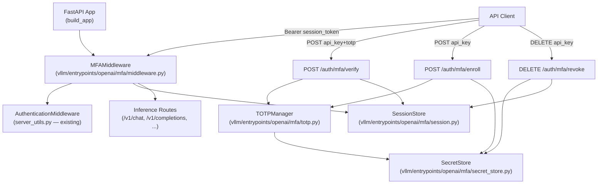
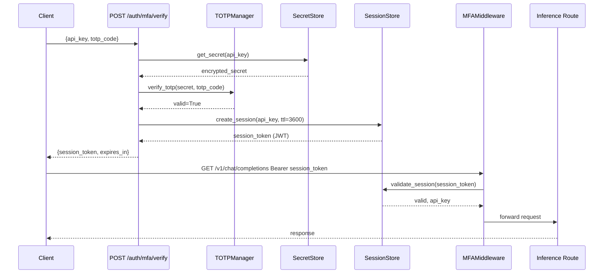
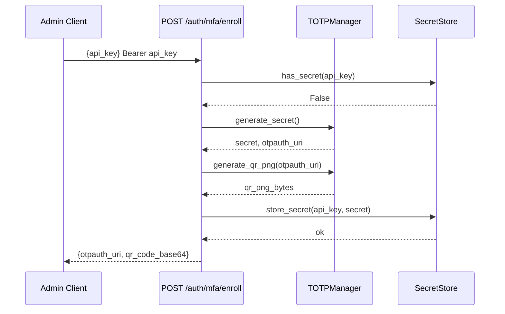
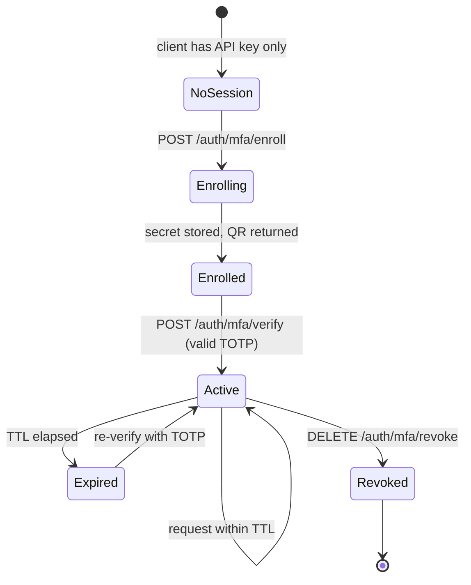
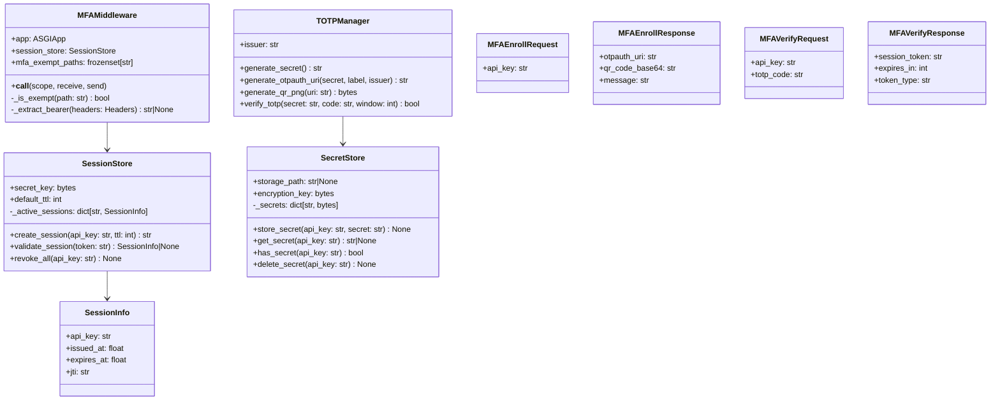

# Implement MFA for vLLM API Server

This plan adds Multi-Factor Authentication (MFA) to the vLLM OpenAI-compatible API server. The existing `AuthenticationMiddleware` in `vllm/entrypoints/openai/server_utils.py` handles single-factor Bearer token auth; this plan layers TOTP-based MFA on top of it, adding a new `MFAMiddleware`, a TOTP management module, admin endpoints for enrolling/revoking MFA secrets, and a session-token exchange flow so that clients can obtain a short-lived session token after presenting both their API key and a valid TOTP code.

---

## Design & Architecture

### Overview

The vLLM server currently authenticates requests with a static Bearer API key via `AuthenticationMiddleware`. MFA adds a second factor using TOTP (RFC 6238 / Google Authenticator-compatible). The flow is:

1. **Enrollment** — An admin calls `POST /auth/mfa/enroll` with a valid API key. The server generates a TOTP secret, stores it (encrypted at rest), and returns a `otpauth://` URI + QR-code PNG for the user to scan.
2. **Session exchange** — A client calls `POST /auth/mfa/verify` with `{ "api_key": "...", "totp_code": "..." }`. If both factors are valid the server issues a short-lived **session token** (JWT or opaque token with TTL).
3. **Protected requests** — All non-exempt endpoints require the session token in `Authorization: Bearer <session_token>`. `MFAMiddleware` validates the session token (checks signature + expiry) before forwarding to the existing `AuthenticationMiddleware` (or replaces it).
4. **Revocation** — `DELETE /auth/mfa/revoke` invalidates the TOTP secret and all active sessions for a given API key.

The implementation is entirely within the `vllm/entrypoints/` tree and adds no changes to the inference engine.

### Diagram 1 — Architecture / Component Diagram



### Diagram 2 — Sequence Diagram: MFA Login Flow



### Diagram 3 — Sequence Diagram: MFA Enrollment Flow



### Diagram 4 — State Machine: Session Token Lifecycle



### Diagram 5 — Class / Data Model Diagram



### Directory Structure

```
vllm/
└── entrypoints/
    └── openai/
        └── mfa/                          # NEW — MFA subsystem
            ├── __init__.py               # exports MFAMiddleware, TOTPManager, etc.
            ├── middleware.py             # MFAMiddleware (ASGI)
            ├── totp.py                   # TOTPManager — secret gen, QR, verify
            ├── session.py                # SessionStore — JWT issue/validate/revoke
            ├── secret_store.py           # SecretStore — encrypted TOTP secret storage
            ├── protocol.py               # Pydantic models: Enroll/Verify request+response
            └── api_router.py             # FastAPI router: /auth/mfa/enroll|verify|revoke

tests/
└── security/
    └── test_mfa.py                       # NEW — comprehensive MFA test suite
```

### Key Design Decisions

| Decision | Choice | Rationale |
|----------|--------|-----------|
| TOTP standard | RFC 6238 (TOTP) via `pyotp` | Industry standard, compatible with Google Authenticator, Authy, 1Password |
| QR code generation | `qrcode[pil]` library | Lightweight, no external service dependency |
| Session token format | HMAC-signed opaque token (secrets + HMAC-SHA256) | Avoids PyJWT dependency; stateful store allows instant revocation |
| Secret storage | In-memory dict + optional encrypted file (Fernet) | Simple default; operators can swap for Redis/DB via `SecretStore` interface |
| MFA bypass paths | `/health`, `/ping`, `/metrics`, `/auth/mfa/*` | Monitoring must remain unauthenticated; MFA endpoints bootstrap the flow |
| Middleware ordering | `MFAMiddleware` wraps `AuthenticationMiddleware` | MFA check happens first; if MFA is disabled the existing auth path is unchanged |
| Backward compatibility | MFA is opt-in via `--enable-mfa` CLI flag | Existing deployments with `--api-key` continue to work without MFA |
| TOTP window | ±1 step (30 s each) | Tolerates minor clock skew without weakening security |
| Session TTL | Default 3600 s, configurable via `--mfa-session-ttl` | Balances usability and security |

### Technology Stack

- **Runtime/Language:** Python 3.10–3.13 (matches existing `pyproject.toml`)
- **Framework:** FastAPI + Starlette (already in `requirements/common.txt`)
- **New Libraries:**
  - `pyotp >= 2.9.0` — TOTP generation and verification
  - `qrcode[pil] >= 7.4` — QR code PNG generation
  - `cryptography >= 42.0` — Fernet symmetric encryption for secret storage at rest (already transitively present via `opentelemetry`)
- **Existing Infrastructure Used:**
  - `AuthenticationMiddleware` (`vllm/entrypoints/openai/server_utils.py`) — existing Bearer token check
  - `FrontendArgs` / `BaseFrontendArgs` (`vllm/entrypoints/openai/cli_args.py`) — CLI arg registration
  - `build_app()` (`vllm/entrypoints/openai/api_server.py`) — middleware and router registration
  - `envs.py` — environment variable declarations (`VLLM_MFA_SECRET_KEY`, `VLLM_MFA_SESSION_TTL`)

---

## Execution Plan

### Phase 1: MFA Dependencies & Environment Variables
**Estimated effort:** 1-2 hours
**Dependencies:** None

Add `pyotp` and `qrcode[pil]` to the requirements files and declare new MFA-related environment variables in `vllm/envs.py`.

#### Tasks:
- [ ] Add `pyotp >= 2.9.0` to `requirements/common.txt`
- [ ] Add `qrcode[pil] >= 7.4` to `requirements/common.txt`
- [ ] In `vllm/envs.py`, add the following `TYPE_CHECKING` declarations (alongside existing `VLLM_API_KEY`):
  - `VLLM_MFA_ENABLED: bool = False`
  - `VLLM_MFA_SECRET_KEY: str | None = None` — master key for Fernet encryption of TOTP secrets
  - `VLLM_MFA_SESSION_TTL: int = 3600` — session token lifetime in seconds
  - `VLLM_MFA_SECRETS_PATH: str | None = None` — optional file path for persisted secrets
- [ ] In `vllm/envs.py`, add the corresponding lambda entries in the `environment_variables` dict (following the existing `VLLM_API_KEY` pattern at line 639)

#### Deliverables:
- Updated `requirements/common.txt` with `pyotp` and `qrcode[pil]`
- Updated `vllm/envs.py` with 4 new MFA environment variable declarations

---

### Phase 2: CLI Arguments for MFA
**Estimated effort:** 1-2 hours
**Dependencies:** Phase 1

Extend `FrontendArgs` in `vllm/entrypoints/openai/cli_args.py` with MFA-specific CLI flags so operators can enable MFA at server startup.

#### Tasks:
- [ ] In `vllm/entrypoints/openai/cli_args.py`, add the following fields to the `FrontendArgs` dataclass (after the existing `api_key` field at line ~247):
  ```python
  enable_mfa: bool = False
  """Enable TOTP-based Multi-Factor Authentication. Requires --api-key."""
  mfa_session_ttl: int = 3600
  """Session token TTL in seconds after successful MFA verification (default: 3600)."""
  mfa_secrets_path: str | None = None
  """Path to file for persisting encrypted MFA TOTP secrets across restarts."""
  mfa_issuer: str = "vLLM"
  """Issuer name shown in authenticator apps during MFA enrollment."""
  ```
- [ ] In `FrontendArgs._customize_cli_kwargs()`, add validation: if `enable_mfa` is True and `api_key` is None/empty, emit a `parser.error()` message: `"--enable-mfa requires --api-key to be set."`
- [ ] In `vllm/entrypoints/utils.py`, add a `validate_mfa_args(args)` function that checks `args.enable_mfa` implies `args.api_key` is set, raising `ValueError` with a clear message if not

#### Deliverables:
- Updated `vllm/entrypoints/openai/cli_args.py` with 4 new MFA fields in `FrontendArgs`
- Updated `vllm/entrypoints/utils.py` with `validate_mfa_args()`

---

### Phase 3: TOTP Manager & Secret Store
**Estimated effort:** 2-3 hours
**Dependencies:** Phase 1

Create the core MFA cryptographic modules: `TOTPManager` for TOTP operations and `SecretStore` for encrypted secret persistence.

#### Tasks:
- [ ] Create `vllm/entrypoints/openai/mfa/__init__.py`:
  ```python
  from vllm.entrypoints.openai.mfa.middleware import MFAMiddleware
  from vllm.entrypoints.openai.mfa.totp import TOTPManager
  from vllm.entrypoints.openai.mfa.session import SessionStore
  from vllm.entrypoints.openai.mfa.secret_store import SecretStore
  __all__ = ["MFAMiddleware", "TOTPManager", "SessionStore", "SecretStore"]
  ```
- [ ] Create `vllm/entrypoints/openai/mfa/secret_store.py` with class `SecretStore`:
  - `__init__(self, encryption_key: bytes | None = None, storage_path: str | None = None)`
  - `store_secret(api_key: str, totp_secret: str) -> None` — encrypts with Fernet (or stores plaintext if no key), persists to `storage_path` if set
  - `get_secret(api_key: str) -> str | None` — decrypts and returns TOTP secret
  - `has_secret(api_key: str) -> bool`
  - `delete_secret(api_key: str) -> None` — removes from in-memory dict and persists
  - `_load_from_file(path: str) -> None` — loads encrypted secrets from JSON file on startup
  - `_persist_to_file() -> None` — writes encrypted secrets dict to JSON file
  - Internal `_secrets: dict[str, bytes]` (api_key → encrypted bytes)
- [ ] Create `vllm/entrypoints/openai/mfa/totp.py` with class `TOTPManager`:
  - `__init__(self, issuer: str = "vLLM")`
  - `generate_secret() -> str` — calls `pyotp.random_base32()`
  - `generate_otpauth_uri(secret: str, label: str, issuer: str | None = None) -> str` — uses `pyotp.totp.TOTP(secret).provisioning_uri(name=label, issuer_name=issuer)`
  - `generate_qr_png(uri: str) -> bytes` — uses `qrcode.make(uri)`, returns PNG bytes via `io.BytesIO`
  - `verify_totp(secret: str, code: str, window: int = 1) -> bool` — uses `pyotp.TOTP(secret).verify(code, valid_window=window)`

#### Deliverables:
- `vllm/entrypoints/openai/mfa/__init__.py`
- `vllm/entrypoints/openai/mfa/secret_store.py` (class `SecretStore`)
- `vllm/entrypoints/openai/mfa/totp.py` (class `TOTPManager`)

---

### Phase 4: Session Store
**Estimated effort:** 1-2 hours
**Dependencies:** Phase 1

Create the `SessionStore` that issues and validates short-lived session tokens using HMAC-SHA256.

#### Tasks:
- [ ] Create `vllm/entrypoints/openai/mfa/session.py` with:
  - `@dataclass class SessionInfo`: fields `api_key: str`, `issued_at: float`, `expires_at: float`, `jti: str`
  - `class SessionStore`:
    - `__init__(self, secret_key: bytes, default_ttl: int = 3600)`
    - `create_session(api_key: str, ttl: int | None = None) -> str`:
      - Generates `jti = secrets.token_hex(32)`
      - Builds payload `f"{jti}:{api_key}:{expires_at}"`
      - Signs with `hmac.new(secret_key, payload.encode(), hashlib.sha256).hexdigest()`
      - Token format: `base64url(payload) + "." + signature`
      - Stores `SessionInfo` in `_active_sessions[jti]`
    - `validate_session(token: str) -> SessionInfo | None`:
      - Splits token, re-derives signature, uses `secrets.compare_digest` for constant-time comparison
      - Checks `expires_at > time.time()`
      - Returns `SessionInfo` or `None`
    - `revoke_all(api_key: str) -> None` — removes all sessions where `session.api_key == api_key`
    - `revoke_session(jti: str) -> None`
    - `_cleanup_expired() -> None` — removes expired sessions (called lazily on `validate_session`)
    - Internal `_active_sessions: dict[str, SessionInfo]`

#### Deliverables:
- `vllm/entrypoints/openai/mfa/session.py` (classes `SessionInfo`, `SessionStore`)

---

### Phase 5: MFA Pydantic Protocol Models
**Estimated effort:** 0.5-1 hour
**Dependencies:** None

Create the Pydantic request/response models for the MFA API endpoints.

#### Tasks:
- [ ] Create `vllm/entrypoints/openai/mfa/protocol.py` with the following Pydantic v2 models:
  - `class MFAEnrollRequest(BaseModel)`: `api_key: str`
  - `class MFAEnrollResponse(BaseModel)`: `otpauth_uri: str`, `qr_code_base64: str`, `message: str`
  - `class MFAVerifyRequest(BaseModel)`: `api_key: str`, `totp_code: str = Field(min_length=6, max_length=8)`
  - `class MFAVerifyResponse(BaseModel)`: `session_token: str`, `expires_in: int`, `token_type: str = "bearer"`
  - `class MFARevokeRequest(BaseModel)`: `api_key: str`
  - `class MFARevokeResponse(BaseModel)`: `message: str`, `revoked_sessions: int`
  - `class MFAStatusResponse(BaseModel)`: `mfa_enabled: bool`, `enrolled: bool`

#### Deliverables:
- `vllm/entrypoints/openai/mfa/protocol.py` with 7 Pydantic models

---

### Phase 6: MFA API Router (Enroll / Verify / Revoke Endpoints)
**Estimated effort:** 2-3 hours
**Dependencies:** Phase 3, Phase 4, Phase 5

Create the FastAPI router that exposes the MFA management endpoints.

#### Tasks:
- [ ] Create `vllm/entrypoints/openai/mfa/api_router.py`:
  - Define `router = APIRouter(prefix="/auth/mfa", tags=["mfa"])`
  - Implement `POST /auth/mfa/enroll` handler `enroll_mfa(request: MFAEnrollRequest, app_state: State)`:
    - Validates `request.api_key` against configured API keys (calls `AuthenticationMiddleware.verify_token` logic or checks `app.state.args.api_key`)
    - Checks `secret_store.has_secret(api_key)` — returns 409 if already enrolled
    - Calls `totp_manager.generate_secret()`, `generate_otpauth_uri()`, `generate_qr_png()`
    - Calls `secret_store.store_secret(api_key, secret)`
    - Returns `MFAEnrollResponse` with `qr_code_base64 = base64.b64encode(qr_png).decode()`
  - Implement `POST /auth/mfa/verify` handler `verify_mfa(request: MFAVerifyRequest, app_state: State)`:
    - Validates API key (same check as enroll)
    - Calls `secret_store.get_secret(api_key)` — returns 403 if not enrolled
    - Calls `totp_manager.verify_totp(secret, request.totp_code)` — returns 401 if invalid
    - Calls `session_store.create_session(api_key, ttl=args.mfa_session_ttl)`
    - Returns `MFAVerifyResponse`
  - Implement `DELETE /auth/mfa/revoke` handler `revoke_mfa(request: MFARevokeRequest, app_state: State)`:
    - Validates API key
    - Calls `secret_store.delete_secret(api_key)`
    - Calls `session_store.revoke_all(api_key)`, captures count
    - Returns `MFARevokeResponse`
  - Implement `GET /auth/mfa/status` handler `mfa_status(request: Request)`:
    - Returns `MFAStatusResponse` with `mfa_enabled` from `app.state.args.enable_mfa`
  - Define `attach_router(app: FastAPI) -> None` that calls `app.include_router(router)`

#### Deliverables:
- `vllm/entrypoints/openai/mfa/api_router.py` with 4 fully implemented endpoint handlers

---

### Phase 7: MFA ASGI Middleware
**Estimated effort:** 2-3 hours
**Dependencies:** Phase 4, Phase 5

Create `MFAMiddleware` — the ASGI middleware that intercepts every request and validates session tokens when MFA is enabled.

#### Tasks:
- [ ] Create `vllm/entrypoints/openai/mfa/middleware.py` with class `MFAMiddleware`:
  - `__init__(self, app: ASGIApp, session_store: SessionStore, mfa_exempt_paths: frozenset[str] | None = None)`:
    - Default exempt paths: `{"/health", "/ping", "/metrics", "/auth/mfa/enroll", "/auth/mfa/verify", "/auth/mfa/status"}`
  - `__call__(self, scope: Scope, receive: Receive, send: Send) -> Awaitable[None]`:
    - Skip non-HTTP/WebSocket scopes (lifespan, etc.)
    - Skip OPTIONS method (mirrors `AuthenticationMiddleware` pattern)
    - Extract `url_path` using `URL(scope=scope).path.removeprefix(root_path)`
    - If path is in `mfa_exempt_paths`, forward to `self.app`
    - Extract Bearer token from `Authorization` header
    - Call `self.session_store.validate_session(token)`
    - If invalid/expired: return `JSONResponse({"error": "MFA session token invalid or expired"}, status_code=401)`
    - If valid: inject `X-MFA-API-Key: <api_key>` into scope headers and forward to `self.app`
  - `_is_exempt(self, path: str) -> bool` — checks prefix match against `mfa_exempt_paths`
  - `_extract_bearer(self, headers: Headers) -> str | None` — extracts token from `Authorization: Bearer <token>`

#### Deliverables:
- `vllm/entrypoints/openai/mfa/middleware.py` (class `MFAMiddleware`)

---

### Phase 8: Wire MFA into build_app() and init_app_state()
**Estimated effort:** 2-3 hours
**Dependencies:** Phase 2, Phase 3, Phase 4, Phase 6, Phase 7

Integrate all MFA components into the existing `build_app()` and `init_app_state()` functions in `vllm/entrypoints/openai/api_server.py`.

#### Tasks:
- [ ] In `vllm/entrypoints/openai/api_server.py`, inside `build_app()` (after the existing `AuthenticationMiddleware` block, around line 260):
  ```python
  if args.enable_mfa:
      from vllm.entrypoints.openai.mfa import MFAMiddleware
      from vllm.entrypoints.openai.mfa.api_router import attach_router as attach_mfa_router
      attach_mfa_router(app)
      # MFAMiddleware is added after init_app_state sets up session_store
      # Store flag for deferred middleware registration
      app.state._mfa_enabled = True
  ```
- [ ] In `init_app_state()` (around line 310), after `state.args = args`, add:
  ```python
  if args.enable_mfa:
      import secrets as _secrets
      from vllm.entrypoints.openai.mfa import SessionStore, SecretStore, TOTPManager
      mfa_secret_key = (
          envs.VLLM_MFA_SECRET_KEY.encode() if envs.VLLM_MFA_SECRET_KEY
          else _secrets.token_bytes(32)
      )
      state.mfa_session_store = SessionStore(
          secret_key=mfa_secret_key,
          default_ttl=args.mfa_session_ttl,
      )
      state.mfa_secret_store = SecretStore(
          encryption_key=mfa_secret_key,
          storage_path=args.mfa_secrets_path or envs.VLLM_MFA_SECRETS_PATH,
      )
      state.mfa_totp_manager = TOTPManager(issuer=args.mfa_issuer)
  ```
- [ ] In `build_app()`, after `init_app_state` is called (or in the lifespan), register `MFAMiddleware` using `app.state.mfa_session_store` when `args.enable_mfa` is True
- [ ] In `vllm/entrypoints/openai/api_server.py`, update the warning at line 328 to also warn when `--enable-mfa` is set but `--api-key` is missing
- [ ] In `vllm/entrypoints/utils.py`, call `validate_mfa_args(args)` from `validate_parsed_serve_args()` (or equivalent validation entry point)

#### Deliverables:
- Updated `vllm/entrypoints/openai/api_server.py` with MFA middleware and router registration
- Updated `vllm/entrypoints/utils.py` with `validate_mfa_args()` call

---

### Phase 9: Testing & Quality Assurance
**Estimated effort:** 3-4 hours
**Dependencies:** Phase 3, Phase 4, Phase 5, Phase 6, Phase 7, Phase 8

Write a comprehensive test suite for all MFA components in `tests/security/test_mfa.py`.

#### Tasks:
- [ ] Create `tests/security/test_mfa.py` with the following test classes:

  **`TestSecretStore`:**
  - `test_store_and_retrieve_secret` — store a secret, retrieve it, assert equality
  - `test_has_secret_returns_false_for_unknown_key`
  - `test_delete_secret_removes_entry`
  - `test_encryption_at_rest` — verify stored bytes differ from plaintext when encryption key is set
  - `test_persist_and_load_from_file` — write to temp file, create new store, load, assert secrets match

  **`TestTOTPManager`:**
  - `test_generate_secret_is_base32` — assert `pyotp.random_base32()` format
  - `test_generate_otpauth_uri_contains_issuer`
  - `test_generate_qr_png_returns_bytes` — assert result is non-empty bytes starting with PNG magic `b'\x89PNG'`
  - `test_verify_totp_valid_code` — generate secret, compute current TOTP, verify returns True
  - `test_verify_totp_invalid_code` — verify `"000000"` against a real secret returns False
  - `test_verify_totp_window_tolerance` — test that codes within ±1 window are accepted

  **`TestSessionStore`:**
  - `test_create_and_validate_session` — create session, validate token, assert `api_key` matches
  - `test_expired_session_returns_none` — create session with `ttl=0`, sleep 0.1s, validate returns None
  - `test_revoke_all_invalidates_sessions` — create 3 sessions, revoke_all, validate all return None
  - `test_tampered_token_rejected` — flip one character in token, assert validate returns None
  - `test_constant_time_comparison` — assert `secrets.compare_digest` is used (mock and verify call)

  **`TestMFAMiddleware`:**
  - `test_exempt_path_bypasses_mfa` — request to `/health` passes without session token
  - `test_protected_path_requires_session_token` — request to `/v1/completions` without token → 401
  - `test_valid_session_token_passes` — create session, use token → 200
  - `test_expired_session_token_rejected` — expired token → 401 with `"MFA session token invalid or expired"`
  - `test_options_method_bypasses_mfa` — OPTIONS request passes without token
  - `test_mfa_enroll_path_is_exempt` — POST to `/auth/mfa/enroll` passes without session token

  **`TestMFAAPIRouter`:**
  - `test_enroll_returns_otpauth_uri_and_qr` — mock `TOTPManager`, assert response shape
  - `test_enroll_duplicate_returns_409`
  - `test_verify_valid_totp_returns_session_token`
  - `test_verify_invalid_totp_returns_401`
  - `test_verify_unenrolled_key_returns_403`
  - `test_revoke_clears_secret_and_sessions`
  - `test_status_endpoint_returns_mfa_enabled_flag`

  **`TestMFAIntegration`** (end-to-end with `TestClient`):
  - `test_full_mfa_flow` — enroll → verify → use session token → success
  - `test_mfa_disabled_falls_back_to_api_key_auth` — when `enable_mfa=False`, existing `AuthenticationMiddleware` handles auth

- [ ] Run `python -m pytest tests/security/test_mfa.py -v` and fix any failures
- [ ] Run `python -m pytest tests/security/ -v` to ensure no regressions in existing security tests
- [ ] Run `python -m py_compile vllm/entrypoints/openai/mfa/*.py` to verify syntax

#### Deliverables:
- `tests/security/test_mfa.py` with ~30 test cases across 6 test classes
- All tests passing: `pytest tests/security/test_mfa.py` exits 0

---

### Phase 10: Documentation
**Estimated effort:** 1 hour
**Dependencies:** Phase 8, Phase 9

Update the README and add a `.env.example` snippet documenting MFA configuration.

#### Tasks:
- [ ] Update `README.md` to add a "Multi-Factor Authentication" section describing:
  - How to enable MFA: `vllm serve <model> --api-key <key> --enable-mfa`
  - The enrollment flow (curl example for `POST /auth/mfa/enroll`)
  - The verification flow (curl example for `POST /auth/mfa/verify`)
  - Environment variables: `VLLM_MFA_ENABLED`, `VLLM_MFA_SECRET_KEY`, `VLLM_MFA_SESSION_TTL`, `VLLM_MFA_SECRETS_PATH`
- [ ] Create `.env.example` (or append to existing) with:
  ```
  # MFA Configuration
  VLLM_MFA_ENABLED=false
  VLLM_MFA_SECRET_KEY=<generate with: python -c "import secrets; print(secrets.token_hex(32))">
  VLLM_MFA_SESSION_TTL=3600
  VLLM_MFA_SECRETS_PATH=/var/lib/vllm/mfa_secrets.json
  ```

#### Deliverables:
- Updated `README.md` with MFA section
- `.env.example` with MFA environment variable documentation

---

## Verification Criteria

After implementation, verify the MFA feature works correctly using the following steps:

### 1. Unit Test Suite
```bash
cd /Users/pradeepsharma/sasva/vllm
python -m pytest tests/security/test_mfa.py -v
```
**Expected:** All ~30 tests pass (exit code 0). No `FAILED` or `ERROR` lines.

### 2. Existing Security Tests — No Regressions
```bash
python -m pytest tests/security/ -v
```
**Expected:** All existing tests in `test_auth_middleware.py`, `test_cors_defaults.py`, `test_http_client.py`, `test_serialization_guard.py`, `test_subprocess_safety.py` continue to pass.

### 3. Syntax Validation
```bash
python -m py_compile vllm/entrypoints/openai/mfa/__init__.py
python -m py_compile vllm/entrypoints/openai/mfa/middleware.py
python -m py_compile vllm/entrypoints/openai/mfa/totp.py
python -m py_compile vllm/entrypoints/openai/mfa/session.py
python -m py_compile vllm/entrypoints/openai/mfa/secret_store.py
python -m py_compile vllm/entrypoints/openai/mfa/protocol.py
python -m py_compile vllm/entrypoints/openai/mfa/api_router.py
```
**Expected:** All commands exit 0 with no output.

### 4. Import Validation
```bash
python -c "from vllm.entrypoints.openai.mfa import MFAMiddleware, TOTPManager, SessionStore, SecretStore; print('MFA imports OK')"
```
**Expected:** Prints `MFA imports OK`.

### 5. CLI Argument Validation
```bash
python -c "
from vllm.utils.argparse_utils import FlexibleArgumentParser
from vllm.entrypoints.openai.cli_args import make_arg_parser
p = make_arg_parser(FlexibleArgumentParser())
args = p.parse_args(['--model', 'test', '--api-key', 'mykey', '--enable-mfa'])
assert args.enable_mfa == True
assert args.mfa_session_ttl == 3600
print('CLI args OK')
"
```
**Expected:** Prints `CLI args OK`.

### 6. TOTP Functional Smoke Test
```bash
python -c "
import pyotp
from vllm.entrypoints.openai.mfa.totp import TOTPManager
mgr = TOTPManager(issuer='vLLM-test')
secret = mgr.generate_secret()
code = pyotp.TOTP(secret).now()
assert mgr.verify_totp(secret, code), 'TOTP verification failed'
uri = mgr.generate_otpauth_uri(secret, 'testuser')
assert 'otpauth://totp/' in uri
qr = mgr.generate_qr_png(uri)
assert qr[:4] == b'\x89PNG', 'QR code is not a valid PNG'
print('TOTP smoke test OK')
"
```
**Expected:** Prints `TOTP smoke test OK`.

### 7. Session Store Smoke Test
```bash
python -c "
import secrets
from vllm.entrypoints.openai.mfa.session import SessionStore
store = SessionStore(secret_key=secrets.token_bytes(32), default_ttl=60)
token = store.create_session('my-api-key')
info = store.validate_session(token)
assert info is not None and info.api_key == 'my-api-key'
store.revoke_all('my-api-key')
assert store.validate_session(token) is None
print('Session store smoke test OK')
"
```
**Expected:** Prints `Session store smoke test OK`.

### 8. End-to-End API Flow (with TestClient)
```bash
python -c "
from starlette.testclient import TestClient
from fastapi import FastAPI
# Verify the MFA router mounts correctly
from vllm.entrypoints.openai.mfa.api_router import router
app = FastAPI()
app.include_router(router)
client = TestClient(app)
resp = client.get('/auth/mfa/status')
assert resp.status_code in (200, 422, 500), f'Unexpected: {resp.status_code}'
print('Router mount OK')
"
```
**Expected:** Prints `Router mount OK` (status 200 or 422 is acceptable — 422 means app state not initialized, which is expected without a full server).
