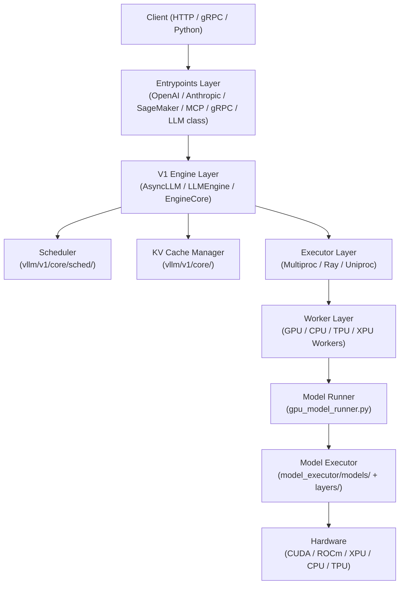
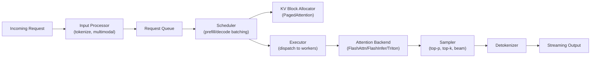
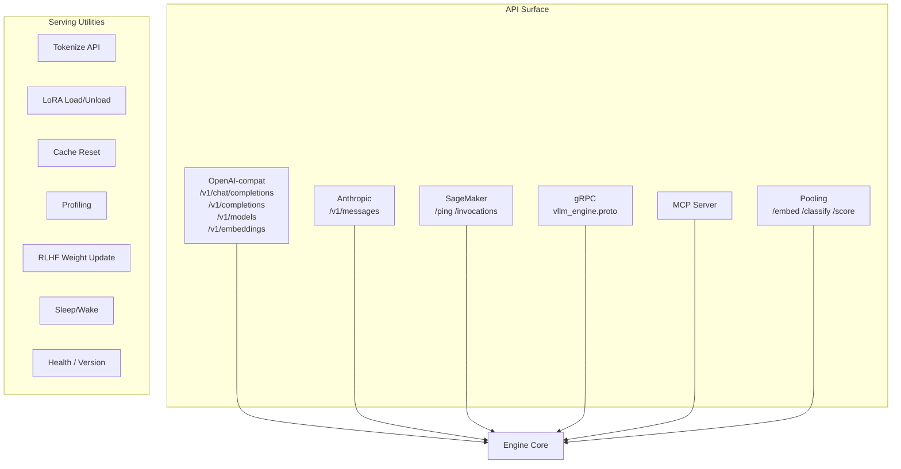

# vLLM — Technical Documentation Plan

## Executive Summary

vLLM is a high-throughput, memory-efficient inference and serving engine for Large Language Models (LLMs), originally developed at UC Berkeley's Sky Computing Lab and now a community-driven open-source project. It is the de-facto standard for production LLM serving, offering an OpenAI-compatible API server, offline batch inference, and support for a vast array of hardware platforms (NVIDIA CUDA, AMD ROCm, Intel XPU/CPU, Google TPU, ARM, PowerPC, IBM Spyre, Huawei Ascend). Its signature innovation — **PagedAttention** — enables near-zero KV-cache memory waste and dramatically higher throughput than naive serving approaches.

This documentation plan covers the entire vLLM codebase as explored in the workspace at `/Users/pradeepsharma/sasva/projects/vllm`. The scope includes: architecture deep-dives, all API surfaces (OpenAI-compatible REST, Anthropic, gRPC, SageMaker, MCP), the V1 engine and scheduler, model executor and model registry (150+ supported architectures), quantization subsystem, distributed execution, attention backends, speculative decoding, structured output, multimodal support, LoRA adapters, compilation/CUDA graph optimization, platform abstractions, configuration system, benchmarking, testing strategy, and CI/CD infrastructure.

All documentation output files are Markdown (`.md`), automatically converted to HTML with sidebar navigation, search, and consistent styling during post-processing. Mermaid diagrams are embedded using triple-backtick mermaid blocks and rendered client-side.

---

## Project Overview — Investigation Results

### System Metrics

| Metric | Value |
|--------|-------|
| Total files | ~449 (workspace scan) |
| Python source files | 135+ top-level; 300+ in `vllm/` package |
| CUDA/C++ extension files | 16 `.cu`, 8 `.h`, 3 `.cuh`, 2 `.cpp` |
| Jinja templates | 34 (chat/tool templates) |
| Docker images | 9 Dockerfiles (CUDA, ROCm, CPU, TPU, XPU, ppc64le, s390x, nightly) |
| Test directories | 35 under `tests/` |
| Supported model architectures | 150+ (registry.py) |
| Quantization schemes | 20+ (AWQ, GPTQ, FP8, INT8, GGUF, BitsAndBytes, compressed-tensors, etc.) |
| Attention backends | 20+ (FlashAttention, FlashInfer, Triton, ROCm AITER, CPU, Flex, Mamba, etc.) |
| API endpoint groups | 15+ router modules |
| Requirements files | 18 (per-platform) |
| CI pipeline configs | Buildkite + GitHub Actions |

### Technology Inventory

| Category | Technology / Version |
|----------|---------------------|
| **Language** | Python 3.10–3.13, C++17, CUDA C++ |
| **Core ML Framework** | PyTorch 2.10.0 |
| **Web Framework** | FastAPI + Uvicorn (uvloop) |
| **Async Runtime** | asyncio + uvloop |
| **Distributed** | Ray, torch.distributed, NCCL, custom ZMQ-based IPC |
| **Serialization** | msgspec, msgpack, cloudpickle, cbor2, protobuf/gRPC |
| **Quantization** | AWQ, GPTQ, FP8, INT8, GGUF, BitsAndBytes, compressed-tensors, TorchAO, ModelOpt, MXFP4 |
| **Attention** | FlashAttention, FlashInfer, Triton, ROCm AITER, Flex Attention, Mamba SSM |
| **Structured Output** | xgrammar, outlines, lm-format-enforcer, llguidance |
| **Tokenization** | HuggingFace tokenizers, tiktoken, sentencepiece, mistral_common |
| **Observability** | Prometheus, OpenTelemetry (OTLP), structured logging |
| **Build System** | CMake 3.26+, Ninja, setuptools-scm, setuptools 77+ |
| **Container** | Docker (multi-stage), docker-bake |
| **CI/CD** | Buildkite (hardware CI), GitHub Actions (pre-commit, smoke tests, stale) |
| **Testing** | pytest, pytest-asyncio, conftest fixtures |
| **Linting** | ruff, mypy, pre-commit |
| **Docs** | MkDocs (mkdocs.yaml) |
| **gRPC** | grpcio 1.78.0, grpcio-tools, protobuf |
| **Tracing** | OpenTelemetry SDK + OTLP exporter |
| **LoRA** | PEFT-compatible, punica kernels |
| **Multimodal** | Pillow, opencv-python-headless, mistral_common[image] |

### Architecture Overview

vLLM follows a layered, plugin-friendly architecture with a clear separation between the **API/serving layer**, the **engine layer** (V1), the **executor/worker layer**, and the **model execution layer**.







**Key architectural decisions:**
- **V1 Engine** (`vllm/v1/`) is the current production engine, replacing the legacy engine. It uses ZMQ-based IPC between the API process and the engine core process.
- **PagedAttention** manages KV cache as fixed-size blocks (pages), enabling efficient memory sharing for prefix caching and parallel sampling.
- **Continuous batching** — the scheduler dynamically batches prefill and decode steps, maximizing GPU utilization.
- **Chunked prefill** — long prompts are split across multiple steps to bound latency.
- **Speculative decoding** — draft models (EAGLE, Medusa, ngram) propose tokens; the target model verifies in parallel.
- **Compilation** — `torch.compile` with custom passes and CUDA graph capture for low-latency decode.
- **Plugin system** — LoRA resolvers, custom ops, and model architectures are registered via entry points.

### Key Modules and Components

| Module | Path | Responsibility |
|--------|------|----------------|
| **Entrypoints** | `vllm/entrypoints/` | HTTP/gRPC servers, CLI, LLM class |
| **OpenAI API** | `vllm/entrypoints/openai/` | Chat, completion, responses, speech-to-text, models |
| **Anthropic API** | `vllm/entrypoints/anthropic/` | Anthropic messages API compatibility |
| **SageMaker** | `vllm/entrypoints/sagemaker/` | AWS SageMaker endpoint standards |
| **MCP** | `vllm/entrypoints/mcp/` | Model Context Protocol server |
| **gRPC Server** | `vllm/entrypoints/grpc_server.py`, `vllm/grpc/` | gRPC inference API |
| **Serve utilities** | `vllm/entrypoints/serve/` | Tokenize, LoRA, cache, profile, RLHF, sleep, disagg, elastic EP |
| **V1 Engine** | `vllm/v1/engine/` | AsyncLLM, EngineCore, coordinator, detokenizer, output processor |
| **V1 Scheduler** | `vllm/v1/core/sched/` | Request scheduling, prefill/decode batching, chunked prefill |
| **KV Cache** | `vllm/v1/core/` | Block pool, KV cache manager, encoder cache, prefix caching |
| **V1 Executor** | `vllm/v1/executor/` | Multiproc, Ray, uniproc executors |
| **V1 Worker** | `vllm/v1/worker/` | GPU/CPU/TPU/XPU workers, model runners, block tables |
| **Attention** | `vllm/v1/attention/` | Backend abstraction + 20 backends |
| **Spec Decode** | `vllm/v1/spec_decode/` | EAGLE, Medusa, ngram, suffix decoding |
| **Structured Output** | `vllm/v1/structured_output/` | xgrammar, outlines, guidance, lm-format-enforcer |
| **Model Executor** | `vllm/model_executor/` | Model loading, layers, quantization |
| **Model Registry** | `vllm/model_executor/models/registry.py` | 150+ architecture registrations |
| **Quantization** | `vllm/model_executor/layers/quantization/` | 20+ quant schemes |
| **LoRA** | `vllm/lora/` | Multi-LoRA management, punica kernels |
| **Multimodal** | `vllm/multimodal/` | Image/audio/video inputs, processing, caching |
| **Distributed** | `vllm/distributed/` | Tensor/pipeline/expert parallelism, KV transfer |
| **Compilation** | `vllm/compilation/` | torch.compile backends, CUDA graph, passes |
| **Config** | `vllm/config/` | 26 config modules (model, parallel, cache, scheduler, etc.) |
| **Platforms** | `vllm/platforms/` | CUDA, ROCm, XPU, CPU, TPU platform abstractions |
| **Tokenizers** | `vllm/tokenizers/` | Tokenizer utilities and caching |
| **Tracing** | `vllm/tracing/` | OpenTelemetry instrumentation |
| **Plugins** | `vllm/plugins/` | LoRA filesystem/HF hub resolvers |
| **Benchmarks** | `benchmarks/` | Attention, kernel, disagg, auto-tune benchmarks |
| **Tests** | `tests/` | 35 test directories, pytest-based |
| **Docker** | `docker/` | 9 platform-specific Dockerfiles |
| **CI** | `.buildkite/`, `.github/` | Buildkite hardware CI, GitHub Actions |

---

## Documentation Structure

```
docs/
├── index.md                          # Wiki homepage
├── 01-getting-started/
│   ├── README.md
│   ├── installation-cuda.md
│   ├── installation-rocm.md
│   ├── installation-cpu.md
│   ├── installation-tpu.md
│   ├── installation-xpu.md
│   ├── installation-source.md
│   └── quickstart.md
├── 02-architecture/
│   ├── README.md
│   ├── overview.md
│   ├── v1-engine.md
│   ├── paged-attention.md
│   ├── continuous-batching.md
│   ├── request-lifecycle.md
│   └── plugin-system.md
├── 03-api-reference/
│   ├── README.md
│   ├── openai-chat-completions.md
│   ├── openai-completions.md
│   ├── openai-responses.md
│   ├── openai-models.md
│   ├── anthropic-messages.md
│   ├── grpc-api.md
│   ├── sagemaker-api.md
│   ├── mcp-server.md
│   ├── pooling-embed-classify-score.md
│   └── serving-utilities.md
├── 04-configuration/
│   ├── README.md
│   ├── engine-args.md
│   ├── model-config.md
│   ├── parallel-config.md
│   ├── cache-config.md
│   ├── scheduler-config.md
│   ├── speculative-config.md
│   ├── compilation-config.md
│   └── environment-variables.md
├── 05-models/
│   ├── README.md
│   ├── supported-models.md
│   ├── model-registry.md
│   ├── adding-a-model.md
│   ├── multimodal-models.md
│   └── model-loading.md
├── 06-quantization/
│   ├── README.md
│   ├── overview.md
│   ├── fp8.md
│   ├── awq.md
│   ├── gptq.md
│   ├── bitsandbytes.md
│   ├── compressed-tensors.md
│   ├── gguf.md
│   └── kv-cache-quantization.md
├── 07-distributed-inference/
│   ├── README.md
│   ├── tensor-parallelism.md
│   ├── pipeline-parallelism.md
│   ├── expert-parallelism.md
│   ├── data-parallelism.md
│   ├── kv-transfer-disaggregation.md
│   └── ray-deployment.md
├── 08-attention-backends/
│   ├── README.md
│   ├── flash-attention.md
│   ├── flashinfer.md
│   ├── triton-attention.md
│   ├── rocm-aiter.md
│   ├── cpu-attention.md
│   └── mamba-ssm.md
├── 09-speculative-decoding/
│   ├── README.md
│   ├── overview.md
│   ├── eagle.md
│   ├── medusa.md
│   └── ngram-proposer.md
├── 10-structured-output/
│   ├── README.md
│   ├── overview.md
│   ├── xgrammar.md
│   ├── outlines.md
│   └── guidance.md
├── 11-lora/
│   ├── README.md
│   ├── overview.md
│   ├── multi-lora.md
│   └── lora-resolvers.md
├── 12-multimodal/
│   ├── README.md
│   ├── overview.md
│   ├── image-inputs.md
│   ├── audio-inputs.md
│   └── video-inputs.md
├── 13-compilation-optimization/
│   ├── README.md
│   ├── torch-compile.md
│   ├── cuda-graphs.md
│   └── piecewise-compilation.md
├── 14-platforms/
│   ├── README.md
│   ├── nvidia-cuda.md
│   ├── amd-rocm.md
│   ├── intel-xpu-cpu.md
│   ├── google-tpu.md
│   └── arm-ppc-s390x.md
├── 15-observability/
│   ├── README.md
│   ├── metrics-prometheus.md
│   ├── tracing-opentelemetry.md
│   └── logging.md
├── 16-benchmarking/
│   ├── README.md
│   ├── performance-benchmarks.md
│   ├── attention-benchmarks.md
│   └── lm-eval-harness.md
├── 17-deployment/
│   ├── README.md
│   ├── docker.md
│   ├── kubernetes.md
│   ├── sagemaker.md
│   └── disaggregated-prefill.md
├── 18-contributing/
│   ├── README.md
│   ├── development-setup.md
│   ├── ci-cd.md
│   ├── adding-models.md
│   └── code-style.md
└── 19-internals/
    ├── README.md
    ├── kv-cache-internals.md
    ├── scheduler-internals.md
    ├── sampling-internals.md
    └── tokenizer-internals.md
```

---

## Execution Plan

### Phase 1: Foundation & Directory Setup
**Estimated effort:** 1 hour
**Dependencies:** None

Create the skeleton directory structure and minimal stub files. Phase 1 creates ONLY titles and one-line descriptions — no sub-page links, no navigation tables. Those are added in the final Wiki Index phase.

#### Tasks:
- [ ] Create all directories under `docs/` as shown in the Documentation Structure above
- [ ] Create `docs/index.md` with project title and one-line description only
- [ ] Create each `docs/NN-section/README.md` with section title (`# Section Name`) and one-line description — NO sub-page links
- [ ] Add shared CSS/JS assets if needed (wiki.css, mermaid config)
- [ ] Verify directory tree matches the Documentation Structure exactly

#### Deliverables:
- `docs/` directory tree (19 section directories)
- `docs/index.md` — title + one-line description only
- 19 × `docs/NN-section/README.md` stubs — title + one-line description only

---

### Phase 2: Getting Started
**Estimated effort:** 3 hours
**Dependencies:** Phase 1

Document installation across all supported platforms and a quickstart guide. Source files: `README.md`, `requirements/*.txt`, `docker/Dockerfile*`, `pyproject.toml`, `setup.py`, `.github/workflows/macos-smoke-test.yml`, `vllm/envs.py` (VLLM_TARGET_DEVICE detection).

#### Tasks:
- [ ] Document `pip install vllm` (CUDA) with version requirements (Python 3.10–3.13, PyTorch 2.10.0)
- [ ] Document ROCm installation from `requirements/rocm.txt` and `docker/Dockerfile.rocm`
- [ ] Document CPU-only installation from `requirements/cpu.txt` and `docker/Dockerfile.cpu`
- [ ] Document TPU installation from `requirements/tpu.txt` and `docker/Dockerfile.tpu`
- [ ] Document XPU (Intel GPU) installation from `requirements/xpu.txt` and `docker/Dockerfile.xpu`
- [ ] Document build-from-source using CMake (`CMakeLists.txt`), including `VLLM_TARGET_DEVICE` env var
- [ ] Write quickstart: offline inference with `LLM` class, online serving with `vllm serve`, first API call
- [ ] Include Mermaid diagram showing installation decision tree by platform
- [ ] Document macOS Apple Silicon (CPU mode) from `.github/workflows/macos-smoke-test.yml`

#### Deliverables:
- `docs/01-getting-started/installation-cuda.md`
- `docs/01-getting-started/installation-rocm.md`
- `docs/01-getting-started/installation-cpu.md`
- `docs/01-getting-started/installation-tpu.md`
- `docs/01-getting-started/installation-xpu.md`
- `docs/01-getting-started/installation-source.md`
- `docs/01-getting-started/quickstart.md`

---

### Phase 3: Architecture Overview
**Estimated effort:** 4 hours
**Dependencies:** Phase 1

Document the high-level architecture, V1 engine design, PagedAttention, continuous batching, and the plugin system. Source files: `vllm/v1/engine/async_llm.py`, `vllm/v1/engine/core.py`, `vllm/v1/engine/core_client.py`, `vllm/v1/engine/coordinator.py`, `vllm/v1/engine/llm_engine.py`, `vllm/v1/engine/launch.py`, `vllm/v1/core/kv_cache_manager.py`, `vllm/v1/core/block_pool.py`, `vllm/v1/core/kv_cache_utils.py`, `vllm/entrypoints/llm.py`.

#### Tasks:
- [ ] Write architecture overview with system layers diagram (Mermaid)
- [ ] Document V1 engine: AsyncLLM → EngineCore → Executor → Worker pipeline
- [ ] Explain ZMQ-based IPC between API process and engine core process
- [ ] Document PagedAttention: block-based KV cache, block pool, prefix caching
- [ ] Document continuous batching: how prefill and decode are interleaved
- [ ] Document chunked prefill: splitting long prompts across steps
- [ ] Document request lifecycle from HTTP request to token stream (Mermaid sequence diagram)
- [ ] Document plugin system: entry points, custom ops, model registration
- [ ] Include Mermaid diagram: component dependency map
- [ ] Include Mermaid diagram: request lifecycle sequence

#### Deliverables:
- `docs/02-architecture/overview.md`
- `docs/02-architecture/v1-engine.md`
- `docs/02-architecture/paged-attention.md`
- `docs/02-architecture/continuous-batching.md`
- `docs/02-architecture/request-lifecycle.md`
- `docs/02-architecture/plugin-system.md`

---

### Phase 4: API Reference — OpenAI-Compatible Endpoints
**Estimated effort:** 4 hours
**Dependencies:** Phase 1

Document all OpenAI-compatible REST endpoints. Source files: `vllm/entrypoints/openai/api_server.py`, `vllm/entrypoints/openai/chat_completion/api_router.py`, `vllm/entrypoints/openai/completion/api_router.py`, `vllm/entrypoints/openai/responses/api_router.py`, `vllm/entrypoints/openai/models/api_router.py`, `vllm/entrypoints/openai/speech_to_text/api_router.py`, `vllm/entrypoints/openai/cli_args.py`, `vllm/entrypoints/openai/server_utils.py`, `vllm/entrypoints/openai/run_batch.py`.

#### Tasks:
- [ ] Document `POST /v1/chat/completions` — request/response schema, streaming, tool use, vision
- [ ] Document `POST /v1/completions` — legacy completions endpoint
- [ ] Document `POST /v1/responses` and `GET /v1/responses/{id}` — Responses API
- [ ] Document `GET /v1/models` — model listing
- [ ] Document `POST /v1/audio/transcriptions` — speech-to-text
- [ ] Document batch inference via `vllm/entrypoints/openai/run_batch.py`
- [ ] Document CLI args (`vllm serve`) from `cli_args.py` — all flags with defaults
- [ ] Document authentication, CORS, SSL configuration from `vllm/entrypoints/ssl.py`
- [ ] Include request/response JSON examples for each endpoint
- [ ] Document error handling and HTTP status codes from `server_utils.py`

#### Deliverables:
- `docs/03-api-reference/openai-chat-completions.md`
- `docs/03-api-reference/openai-completions.md`
- `docs/03-api-reference/openai-responses.md`
- `docs/03-api-reference/openai-models.md`

---

### Phase 5: API Reference — Additional Protocols & Serving Utilities
**Estimated effort:** 3 hours
**Dependencies:** Phase 1

Document Anthropic, gRPC, SageMaker, MCP, pooling, and serving utility endpoints. Source files: `vllm/entrypoints/anthropic/api_router.py`, `vllm/entrypoints/grpc_server.py`, `vllm/grpc/vllm_engine.proto`, `vllm/entrypoints/sagemaker/api_router.py`, `vllm/entrypoints/mcp/`, `vllm/entrypoints/pooling/`, `vllm/entrypoints/serve/tokenize/api_router.py`, `vllm/entrypoints/serve/lora/api_router.py`, `vllm/entrypoints/serve/cache/api_router.py`, `vllm/entrypoints/serve/profile/api_router.py`, `vllm/entrypoints/serve/rlhf/api_router.py`, `vllm/entrypoints/serve/sleep/api_router.py`, `vllm/entrypoints/serve/disagg/api_router.py`, `vllm/entrypoints/serve/elastic_ep/api_router.py`, `vllm/entrypoints/serve/instrumentator/`.

#### Tasks:
- [ ] Document Anthropic Messages API (`POST /v1/messages`, streaming)
- [ ] Document gRPC API from `vllm_engine.proto` — service definition, request/response types
- [ ] Document SageMaker endpoints (`/ping`, `/invocations`)
- [ ] Document MCP server protocol
- [ ] Document pooling endpoints: `/embed`, `/classify`, `/score` (cross-encoding, late interaction)
- [ ] Document serving utilities: `/tokenize`, `/detokenize`, `/tokenizer_info`
- [ ] Document LoRA management: `POST /v1/load_lora_adapter`, `POST /v1/unload_lora_adapter`
- [ ] Document cache management: `/reset_prefix_cache`, `/reset_mm_cache`
- [ ] Document profiling: `/start_profile`, `/stop_profile`
- [ ] Document RLHF endpoints: `/pause`, `/resume`, `/update_weights`, `/init_weight_transfer_engine`
- [ ] Document sleep/wake: `/sleep`, `/wake_up`, `/is_sleeping`
- [ ] Document health/version/load: `/health`, `/version`, `/load`, `/server_info`
- [ ] Document disaggregated prefill proxy: `/abort_requests`
- [ ] Document elastic expert parallelism: `/update_expert_map`, `/is_scaling_elastic_ep`

#### Deliverables:
- `docs/03-api-reference/anthropic-messages.md`
- `docs/03-api-reference/grpc-api.md`
- `docs/03-api-reference/sagemaker-api.md`
- `docs/03-api-reference/mcp-server.md`
- `docs/03-api-reference/pooling-embed-classify-score.md`
- `docs/03-api-reference/serving-utilities.md`

---

### Phase 6: Configuration Reference
**Estimated effort:** 4 hours
**Dependencies:** Phase 1

Document all configuration classes and environment variables. Source files: `vllm/config/vllm.py` (VllmConfig), `vllm/config/model.py` (ModelConfig), `vllm/config/parallel.py` (ParallelConfig), `vllm/config/cache.py` (CacheConfig), `vllm/config/scheduler.py` (SchedulerConfig), `vllm/config/speculative.py` (SpeculativeConfig), `vllm/config/compilation.py` (CompilationConfig), `vllm/config/lora.py`, `vllm/config/multimodal.py`, `vllm/config/observability.py`, `vllm/config/offload.py`, `vllm/config/kv_transfer.py`, `vllm/envs.py` (all environment variables), `vllm/engine/arg_utils.py`.

#### Tasks:
- [ ] Document `VllmConfig` — the unified config container (`vllm/config/vllm.py`)
- [ ] Document `ModelConfig` — model path, dtype, max_model_len, trust_remote_code, etc.
- [ ] Document `ParallelConfig` — tensor_parallel_size, pipeline_parallel_size, data_parallel_size, expert_parallel_size, Ray vs multiprocessing
- [ ] Document `CacheConfig` — block_size, gpu_memory_utilization, swap_space, prefix caching
- [ ] Document `SchedulerConfig` — max_num_seqs, max_num_batched_tokens, chunked_prefill
- [ ] Document `SpeculativeConfig` — speculative model, num_speculative_tokens, draft model config
- [ ] Document `CompilationConfig` — torch.compile level, CUDA graph sizes, piecewise compilation
- [ ] Document `LoRAConfig`, `MultiModalConfig`, `ObservabilityConfig`, `OffloadConfig`, `KVTransferConfig`
- [ ] Document all environment variables from `vllm/envs.py` (VLLM_TARGET_DEVICE, VLLM_WORKER_MULTIPROC_METHOD, etc.)
- [ ] Include configuration examples for common deployment scenarios
- [ ] Include Mermaid diagram showing config class hierarchy

#### Deliverables:
- `docs/04-configuration/engine-args.md`
- `docs/04-configuration/model-config.md`
- `docs/04-configuration/parallel-config.md`
- `docs/04-configuration/cache-config.md`
- `docs/04-configuration/scheduler-config.md`
- `docs/04-configuration/speculative-config.md`
- `docs/04-configuration/compilation-config.md`
- `docs/04-configuration/environment-variables.md`

---

### Phase 7: Supported Models & Model Registry
**Estimated effort:** 4 hours
**Dependencies:** Phase 1

Document the model registry, all supported architectures, how to add new models, multimodal models, and model loading. Source files: `vllm/model_executor/models/registry.py`, `vllm/model_executor/models/interfaces.py`, `vllm/model_executor/models/interfaces_base.py`, `vllm/model_executor/model_loader/`, `vllm/model_executor/models/config.py`, `vllm/model_executor/models/adapters.py`, `vllm/model_executor/parameter.py`.

#### Tasks:
- [ ] List all 150+ supported architectures from `_TEXT_GENERATION_MODELS`, `_MULTIMODAL_MODELS`, `_POOLING_MODELS`, `_TRANSCRIPTION_MODELS` in `registry.py`
- [ ] Organize models by family: Llama, Mistral, Qwen, DeepSeek, Gemma, GPT, BERT, Falcon, etc.
- [ ] Document model registry internals: `_ModelRegistry`, `_RegisteredModel`, `_LazyRegisteredModel`
- [ ] Document model interfaces: `SupportsLoRA`, `SupportsPP`, `SupportsMultiModal`, `SupportsQuant`, `SupportsTranscription`
- [ ] Document how to add a new model architecture (step-by-step guide)
- [ ] Document multimodal model support: vision encoders, audio encoders, cross-modal attention
- [ ] Document model loading: HuggingFace Hub, local paths, safetensors, GGUF, dummy weights
- [ ] Document `hf-overrides` for config patching
- [ ] Include Mermaid diagram: model class hierarchy

#### Deliverables:
- `docs/05-models/supported-models.md`
- `docs/05-models/model-registry.md`
- `docs/05-models/adding-a-model.md`
- `docs/05-models/multimodal-models.md`
- `docs/05-models/model-loading.md`

---

### Phase 8: Quantization
**Estimated effort:** 4 hours
**Dependencies:** Phase 1

Document all quantization schemes. Source files: `vllm/model_executor/layers/quantization/__init__.py`, `vllm/model_executor/layers/quantization/fp8.py`, `vllm/model_executor/layers/quantization/awq.py`, `vllm/model_executor/layers/quantization/awq_marlin.py`, `vllm/model_executor/layers/quantization/gptq.py`, `vllm/model_executor/layers/quantization/gptq_marlin.py`, `vllm/model_executor/layers/quantization/bitsandbytes.py`, `vllm/model_executor/layers/quantization/compressed_tensors/`, `vllm/model_executor/layers/quantization/gguf.py`, `vllm/model_executor/layers/quantization/kv_cache.py`, `vllm/model_executor/layers/quantization/mxfp4.py`, `vllm/model_executor/layers/quantization/torchao.py`, `vllm/model_executor/layers/quantization/modelopt.py`.

#### Tasks:
- [ ] Write quantization overview: weight-only vs activation quantization, calibration, accuracy tradeoffs
- [ ] Document FP8 quantization: per-tensor, per-channel, dynamic, static; `fp8.py`, `fbgemm_fp8.py`, `ptpc_fp8.py`
- [ ] Document AWQ: `awq.py`, `awq_marlin.py` (Marlin kernel), `awq_triton.py`
- [ ] Document GPTQ: `gptq.py`, `gptq_marlin.py`
- [ ] Document BitsAndBytes: 4-bit NF4, 8-bit INT8 (`bitsandbytes.py`)
- [ ] Document compressed-tensors: `compressed_tensors/` directory, sparse + quantized
- [ ] Document GGUF: `gguf.py`, loading GGUF files directly
- [ ] Document KV cache quantization: `kv_cache.py`, FP8 KV cache
- [ ] Document MXFP4: `mxfp4.py`, microscaling format
- [ ] Document TorchAO: `torchao.py`
- [ ] Document ModelOpt (NVIDIA): `modelopt.py`
- [ ] Include Mermaid diagram: quantization scheme selection flow

#### Deliverables:
- `docs/06-quantization/overview.md`
- `docs/06-quantization/fp8.md`
- `docs/06-quantization/awq.md`
- `docs/06-quantization/gptq.md`
- `docs/06-quantization/bitsandbytes.md`
- `docs/06-quantization/compressed-tensors.md`
- `docs/06-quantization/gguf.md`
- `docs/06-quantization/kv-cache-quantization.md`

---

### Phase 9: Distributed Inference
**Estimated effort:** 4 hours
**Dependencies:** Phase 1

Document all parallelism strategies and distributed execution. Source files: `vllm/distributed/parallel_state.py`, `vllm/distributed/communication_op.py`, `vllm/distributed/device_communicators/`, `vllm/distributed/kv_transfer/`, `vllm/distributed/elastic_ep/`, `vllm/distributed/eplb/`, `vllm/distributed/weight_transfer/`, `vllm/distributed/ec_transfer/`, `vllm/config/parallel.py`, `vllm/v1/executor/ray_executor.py`, `vllm/v1/executor/multiproc_executor.py`.

#### Tasks:
- [ ] Document tensor parallelism (TP): how weight sharding works, `tensor_parallel_size`
- [ ] Document pipeline parallelism (PP): stage assignment, `pipeline_parallel_size`
- [ ] Document expert parallelism (EP): MoE expert sharding, `expert_parallel_size`
- [ ] Document data parallelism (DP): `data_parallel_size`, disaggregated serving
- [ ] Document context parallelism (CP): long-context splitting
- [ ] Document KV cache transfer for disaggregated prefill: `kv_transfer/` connectors
- [ ] Document elastic expert parallelism (EPLB): dynamic load balancing, `elastic_ep/`, `eplb/`
- [ ] Document Ray-based distributed execution: `ray_executor.py`, placement groups
- [ ] Document multiprocess executor: `multiproc_executor.py`, ZMQ IPC
- [ ] Document weight transfer for RLHF: `weight_transfer/`
- [ ] Document EC transfer: `ec_transfer/`
- [ ] Include Mermaid diagram: TP + PP + EP topology
- [ ] Include Mermaid diagram: disaggregated prefill architecture

#### Deliverables:
- `docs/07-distributed-inference/tensor-parallelism.md`
- `docs/07-distributed-inference/pipeline-parallelism.md`
- `docs/07-distributed-inference/expert-parallelism.md`
- `docs/07-distributed-inference/data-parallelism.md`
- `docs/07-distributed-inference/kv-transfer-disaggregation.md`
- `docs/07-distributed-inference/ray-deployment.md`

---

### Phase 10: Attention Backends
**Estimated effort:** 3 hours
**Dependencies:** Phase 1

Document all attention backend implementations. Source files: `vllm/v1/attention/backends/` (20 files), `vllm/v1/attention/backend.py`, `vllm/v1/attention/selector.py`, `vllm/v1/attention/backends/registry.py`, `vllm/model_executor/layers/attention/`, `vllm/model_executor/layers/mla.py`.

#### Tasks:
- [ ] Write attention backend overview: how backends are selected, `selector.py`, `registry.py`
- [ ] Document FlashAttention backend: `flash_attn.py`, `fa_utils.py`, prefill vs decode paths
- [ ] Document FlashInfer backend: `flashinfer.py`, workspace management, paged attention
- [ ] Document Triton attention: `triton_attn.py`, custom Triton kernels
- [ ] Document ROCm AITER backends: `rocm_aiter_fa.py`, `rocm_aiter_unified_attn.py`, `rocm_attn.py`
- [ ] Document CPU attention: `cpu_attn.py`
- [ ] Document Mamba SSM backends: `mamba_attn.py`, `mamba1_attn.py`, `mamba2_attn.py`
- [ ] Document MLA (Multi-head Latent Attention): `vllm/model_executor/layers/mla.py`, `mla/` backends
- [ ] Document Flex Attention: `flex_attention.py`
- [ ] Document tree attention for speculative decoding: `tree_attn.py`
- [ ] Include Mermaid diagram: backend selection decision tree

#### Deliverables:
- `docs/08-attention-backends/flash-attention.md`
- `docs/08-attention-backends/flashinfer.md`
- `docs/08-attention-backends/triton-attention.md`
- `docs/08-attention-backends/rocm-aiter.md`
- `docs/08-attention-backends/cpu-attention.md`
- `docs/08-attention-backends/mamba-ssm.md`

---

### Phase 11: Speculative Decoding
**Estimated effort:** 3 hours
**Dependencies:** Phase 1

Document all speculative decoding methods. Source files: `vllm/v1/spec_decode/eagle.py`, `vllm/v1/spec_decode/medusa.py`, `vllm/v1/spec_decode/ngram_proposer.py`, `vllm/v1/spec_decode/ngram_proposer_gpu.py`, `vllm/v1/spec_decode/suffix_decoding.py`, `vllm/v1/spec_decode/draft_model.py`, `vllm/v1/spec_decode/metrics.py`, `vllm/v1/spec_decode/utils.py`, `vllm/config/speculative.py`, `vllm/model_executor/models/deepseek_eagle.py`, `vllm/model_executor/models/deepseek_mtp.py`.

#### Tasks:
- [ ] Write speculative decoding overview: draft-verify paradigm, acceptance rate, speedup
- [ ] Document EAGLE speculative decoding: `eagle.py`, EAGLE-2 draft model, tree attention
- [ ] Document Medusa: `medusa.py`, multiple decoding heads
- [ ] Document ngram proposer: `ngram_proposer.py`, `ngram_proposer_gpu.py`, prompt lookup
- [ ] Document suffix decoding: `suffix_decoding.py`
- [ ] Document MTP (Multi-Token Prediction): `deepseek_mtp.py`, `ernie_mtp.py`
- [ ] Document speculative decoding metrics: acceptance rate, token budget
- [ ] Document configuration: `SpeculativeConfig`, `speculative_model`, `num_speculative_tokens`
- [ ] Include Mermaid diagram: draft-verify pipeline

#### Deliverables:
- `docs/09-speculative-decoding/overview.md`
- `docs/09-speculative-decoding/eagle.md`
- `docs/09-speculative-decoding/medusa.md`
- `docs/09-speculative-decoding/ngram-proposer.md`

---

### Phase 12: Structured Output
**Estimated effort:** 2 hours
**Dependencies:** Phase 1

Document structured output / constrained decoding. Source files: `vllm/v1/structured_output/__init__.py`, `vllm/v1/structured_output/backend_xgrammar.py`, `vllm/v1/structured_output/backend_outlines.py`, `vllm/v1/structured_output/backend_guidance.py`, `vllm/v1/structured_output/backend_lm_format_enforcer.py`, `vllm/v1/structured_output/backend_types.py`, `vllm/v1/structured_output/utils.py`, `vllm/config/structured_outputs.py`.

#### Tasks:
- [ ] Write structured output overview: JSON schema, regex, grammar-based constraints
- [ ] Document xgrammar backend: `backend_xgrammar.py`, grammar compilation, token masking
- [ ] Document outlines backend: `backend_outlines.py`, FSM-based decoding
- [ ] Document llguidance backend: `backend_guidance.py`
- [ ] Document lm-format-enforcer backend: `backend_lm_format_enforcer.py`
- [ ] Document `response_format` parameter in chat completions
- [ ] Document `guided_decoding_backend` configuration
- [ ] Include code examples: JSON schema, regex, grammar constraints

#### Deliverables:
- `docs/10-structured-output/overview.md`
- `docs/10-structured-output/xgrammar.md`
- `docs/10-structured-output/outlines.md`
- `docs/10-structured-output/guidance.md`

---

### Phase 13: LoRA Adapters
**Estimated effort:** 2 hours
**Dependencies:** Phase 1

Document LoRA adapter support. Source files: `vllm/lora/model_manager.py`, `vllm/lora/lora_model.py`, `vllm/lora/lora_weights.py`, `vllm/lora/worker_manager.py`, `vllm/lora/request.py`, `vllm/lora/resolver.py`, `vllm/lora/peft_helper.py`, `vllm/lora/layers/`, `vllm/lora/ops/`, `vllm/lora/punica_wrapper/`, `vllm/plugins/lora_resolvers/`, `vllm/config/lora.py`.

#### Tasks:
- [ ] Write LoRA overview: adapter loading, multi-LoRA serving, per-request adapter selection
- [ ] Document `LoRARequest` dataclass: `lora_name`, `lora_path`, `lora_local_path`
- [ ] Document `LoRAModelManager`: adapter caching, LRU eviction, max_loras
- [ ] Document LoRA layers: how linear layers are patched with LoRA deltas
- [ ] Document Punica kernels: batched LoRA GEMM operations
- [ ] Document LoRA resolvers: filesystem resolver, HuggingFace Hub resolver
- [ ] Document dynamic LoRA loading/unloading via API (`/v1/load_lora_adapter`)
- [ ] Document `LoRAConfig`: max_lora_rank, max_loras, lora_dtype
- [ ] Include code examples: loading LoRA at startup, dynamic loading

#### Deliverables:
- `docs/11-lora/overview.md`
- `docs/11-lora/multi-lora.md`
- `docs/11-lora/lora-resolvers.md`

---

### Phase 14: Multimodal Support
**Estimated effort:** 3 hours
**Dependencies:** Phase 1

Document multimodal input processing. Source files: `vllm/multimodal/inputs.py`, `vllm/multimodal/image.py`, `vllm/multimodal/audio.py`, `vllm/multimodal/video.py`, `vllm/multimodal/registry.py`, `vllm/multimodal/cache.py`, `vllm/multimodal/parse.py`, `vllm/multimodal/processing/`, `vllm/multimodal/media/`, `vllm/multimodal/encoder_budget.py`, `vllm/multimodal/evs.py`, `vllm/config/multimodal.py`.

#### Tasks:
- [ ] Write multimodal overview: supported modalities (image, audio, video), input formats
- [ ] Document image inputs: PIL images, URLs, base64, `image_url` in chat messages
- [ ] Document audio inputs: waveforms, audio URLs, speech-to-text models
- [ ] Document video inputs: frame extraction, video URLs, `opencv-python-headless`
- [ ] Document multimodal registry: how models register their input processors
- [ ] Document multimodal cache: encoder output caching, `MultiModalCache`
- [ ] Document encoder budget: limiting encoder token count
- [ ] Document EVS (Encoder Vision Sequence): vision token management
- [ ] Document `MultiModalConfig`: max_num_seqs, limit_mm_per_prompt
- [ ] Include code examples: image in chat completion, audio transcription

#### Deliverables:
- `docs/12-multimodal/overview.md`
- `docs/12-multimodal/image-inputs.md`
- `docs/12-multimodal/audio-inputs.md`
- `docs/12-multimodal/video-inputs.md`

---

### Phase 15: Compilation & Optimization
**Estimated effort:** 3 hours
**Dependencies:** Phase 1

Document torch.compile integration and CUDA graph optimization. Source files: `vllm/compilation/backends.py`, `vllm/compilation/compiler_interface.py`, `vllm/compilation/cuda_graph.py`, `vllm/compilation/piecewise_backend.py`, `vllm/compilation/decorators.py`, `vllm/compilation/caching.py`, `vllm/compilation/passes/`, `vllm/compilation/wrapper.py`, `vllm/config/compilation.py`, `vllm/v1/cudagraph_dispatcher.py`.

#### Tasks:
- [ ] Write compilation overview: why compile, torch.compile levels (0–3), tradeoffs
- [ ] Document piecewise compilation: `piecewise_backend.py`, splitting model into compiled regions
- [ ] Document CUDA graph capture: `cuda_graph.py`, `cudagraph_dispatcher.py`, static shapes
- [:] Document compilation passes: `passes/` directory, custom graph transformations
- [ ] Document compilation caching: `caching.py`, reusing compiled artifacts
- [ ] Document `CompilationConfig`: `level`, `custom_ops`, `splitting_ops`, `cudagraph_capture_sizes`
- [ ] Document `@support_torch_compile` decorator: `decorators.py`
- [ ] Include Mermaid diagram: compilation pipeline

#### Deliverables:
- `docs/13-compilation-optimization/torch-compile.md`
- `docs/13-compilation-optimization/cuda-graphs.md`
- `docs/13-compilation-optimization/piecewise-compilation.md`

---

### Phase 16: Platform Support
**Estimated effort:** 3 hours
**Dependencies:** Phase 1

Document hardware platform abstractions and platform-specific features. Source files: `vllm/platforms/interface.py`, `vllm/platforms/cuda.py`, `vllm/platforms/rocm.py`, `vllm/platforms/cpu.py`, `vllm/platforms/xpu.py`, `vllm/platforms/tpu.py`, `vllm/v1/worker/gpu_worker.py`, `vllm/v1/worker/cpu_worker.py`, `vllm/v1/worker/xpu_worker.py`, `docker/Dockerfile*`, `.buildkite/hardware_tests/`.

#### Tasks:
- [ ] Write platform overview: `Platform` interface, capability detection, `current_platform`
- [ ] Document NVIDIA CUDA: `cuda.py`, supported architectures (sm75–sm120), NVCC, FlashAttention
- [ ] Document AMD ROCm: `rocm.py`, supported GFX architectures, HIP, AITER kernels
- [ ] Document Intel XPU: `xpu.py`, Intel GPU support, IPEX
- [ ] Document CPU: `cpu.py`, x86/ARM/ppc64le/s390x, AVX-512, AMX
- [ ] Document Google TPU: `tpu.py`, TPU v6e, XLA compilation
- [ ] Document ARM/ppc64le/s390x: Dockerfile variants, CI test scripts
- [ ] Document hardware CI: `.buildkite/hardware_tests/` YAML configs
- [ ] Include Mermaid diagram: platform capability matrix

#### Deliverables:
- `docs/14-platforms/nvidia-cuda.md`
- `docs/14-platforms/amd-rocm.md`
- `docs/14-platforms/intel-xpu-cpu.md`
- `docs/14-platforms/google-tpu.md`
- `docs/14-platforms/arm-ppc-s390x.md`

---

### Phase 17: Observability
**Estimated effort:** 2 hours
**Dependencies:** Phase 1

Document metrics, tracing, and logging. Source files: `vllm/v1/metrics/`, `vllm/tracing/`, `vllm/logger.py`, `vllm/logging_utils/`, `vllm/config/observability.py`, `vllm/entrypoints/serve/instrumentator/`, `vllm/entrypoints/openai/orca_metrics.py`.

#### Tasks:
- [ ] Document Prometheus metrics: all metric names, labels, types (counter, gauge, histogram)
- [ ] Document `prometheus-fastapi-instrumentator` integration
- [ ] Document OpenTelemetry tracing: `vllm/tracing/`, span names, attributes, OTLP export
- [ ] Document structured logging: `vllm/logger.py`, `python-json-logger`, log levels
- [ ] Document `ObservabilityConfig`: otlp_traces_endpoint, collect_model_forward_time
- [ ] Document `/metrics` endpoint (Prometheus scrape)
- [ ] Document `/server_info` endpoint
- [ ] Include example Prometheus queries and Grafana dashboard hints

#### Deliverables:
- `docs/15-observability/metrics-prometheus.md`
- `docs/15-observability/tracing-opentelemetry.md`
- `docs/15-observability/logging.md`

---

### Phase 18: Benchmarking & Performance
**Estimated effort:** 3 hours
**Dependencies:** Phase 1

Document benchmarking tools and performance tuning. Source files: `benchmarks/attention_benchmarks/`, `benchmarks/cutlass_benchmarks/`, `benchmarks/disagg_benchmarks/`, `benchmarks/fused_kernels/`, `benchmarks/kernels/`, `benchmarks/auto_tune/`, `.buildkite/performance-benchmarks/`, `.buildkite/lm-eval-harness/`.

#### Tasks:
- [ ] Document attention benchmarks: `benchmark.py`, `runner.py`, MLA benchmarks, configs
- [ ] Document kernel benchmarks: CUTLASS sparse/W8A8, fused kernels (layernorm, RMS)
- [ ] Document disaggregated serving benchmarks: `disagg_performance_benchmark.sh`
- [ ] Document auto-tune scripts: `auto_tune.sh`, `batch_auto_tune.sh`
- [ ] Document Buildkite performance benchmarks: latency, throughput, serving tests, genai-perf
- [ ] Document LM Eval Harness integration: `test_lm_eval_correctness.py`, YAML configs
- [ ] Document performance tuning guide: GPU memory utilization, batch sizes, chunked prefill
- [ ] Include benchmark result interpretation guide

#### Deliverables:
- `docs/16-benchmarking/performance-benchmarks.md`
- `docs/16-benchmarking/attention-benchmarks.md`
- `docs/16-benchmarking/lm-eval-harness.md`

---

### Phase 19: Deployment
**Estimated effort:** 3 hours
**Dependencies:** Phase 1

Document production deployment patterns. Source files: `docker/Dockerfile`, `docker/docker-bake.hcl`, `docker/versions.json`, `.buildkite/image_build/`, `vllm/entrypoints/sagemaker/`, `vllm/entrypoints/serve/disagg/`, `vllm/distributed/kv_transfer/`, `vllm/entrypoints/serve/elastic_ep/`.

#### Tasks:
- [ ] Document Docker deployment: `docker run` commands, environment variables, GPU passthrough
- [ ] Document multi-stage Docker builds: `docker-bake.hcl`, image variants
- [ ] Document Kubernetes deployment: resource requests, GPU node selectors, health probes
- [ ] Document AWS SageMaker deployment: container standards, `/ping`, `/invocations`
- [ ] Document disaggregated prefill deployment: prefill-only vs decode-only instances, proxy server
- [ ] Document elastic expert parallelism deployment: scaling MoE experts dynamically
- [ ] Document multi-node deployment: `run-multi-node-test.sh`, Ray cluster setup
- [ ] Document SSL/TLS configuration: `vllm/entrypoints/ssl.py`
- [ ] Include Mermaid diagram: disaggregated prefill topology

#### Deliverables:
- `docs/17-deployment/docker.md`
- `docs/17-deployment/kubernetes.md`
- `docs/17-deployment/sagemaker.md`
- `docs/17-deployment/disaggregated-prefill.md`

---

### Phase 20: Contributing & Development
**Estimated effort:** 2 hours
**Dependencies:** Phase 1

Document the contribution workflow, CI/CD, and code style. Source files: `CONTRIBUTING.md`, `CODE_OF_CONDUCT.md`, `RELEASE.md`, `SECURITY.md`, `.github/workflows/`, `.buildkite/ci_config.yaml`, `.buildkite/test-pipeline.yaml`, `.buildkite/test_areas/`, `pyproject.toml` (ruff/mypy config), `requirements/dev.txt`, `requirements/lint.txt`.

#### Tasks:
- [ ] Document development environment setup: clone, venv, `pip install -e .`, pre-commit
- [ ] Document code style: ruff rules, mypy type checking, pre-commit hooks
- [ ] Document CI/CD: GitHub Actions (pre-commit, macOS smoke test), Buildkite (hardware CI)
- [ ] Document Buildkite test areas: `test_areas/*.yaml` — attention, basic_correctness, distributed, etc.
- [ ] Document how to add a new model (cross-reference Phase 7)
- [ ] Document PR process: CODEOWNERS, mergify, autolabel, stale bot
- [ ] Document release process: `RELEASE.md`, `annotate-release.sh`, PyPI upload
- [ ] Document security policy: `SECURITY.md`, GitHub Security Advisories

#### Deliverables:
- `docs/18-contributing/development-setup.md`
- `docs/18-contributing/ci-cd.md`
- `docs/18-contributing/adding-models.md`
- `docs/18-contributing/code-style.md`

---

### Phase 21: Engine & Scheduler Internals
**Estimated effort:** 4 hours
**Dependencies:** Phase 1

Document the V1 engine internals, scheduler algorithm, sampling, and tokenizer internals. Source files: `vllm/v1/core/sched/scheduler.py` (102KB), `vllm/v1/core/sched/interface.py`, `vllm/v1/core/sched/output.py`, `vllm/v1/core/sched/request_queue.py`, `vllm/v1/engine/output_processor.py`, `vllm/v1/engine/input_processor.py`, `vllm/v1/engine/detokenizer.py`, `vllm/v1/sample/`, `vllm/v1/pool/`, `vllm/sampling_params.py`, `vllm/tokenizers/`, `vllm/v1/kv_offload/`.

#### Tasks:
- [ ] Document scheduler algorithm: prefill scheduling, decode scheduling, preemption, chunked prefill
- [ ] Document `SchedulerOutput`: scheduled sequences, blocks to swap, preempted sequences
- [ ] Document request queue: priority, FCFS, arrival order
- [ ] Document input processor: tokenization, multimodal preprocessing, `InputProcessor`
- [ ] Document output processor: logprob computation, stop conditions, `OutputProcessor`
- [ ] Document detokenizer: incremental detokenization, `Detokenizer`
- [ ] Document sampling: `SamplingParams`, top-p, top-k, temperature, beam search, `vllm/v1/sample/`
- [ ] Document KV offloading: `vllm/v1/kv_offload/`, CPU offload for long contexts
- [ ] Document tokenizer internals: `vllm/tokenizers/`, caching, fast tokenizers
- [ ] Include Mermaid diagram: scheduler state machine

#### Deliverables:
- `docs/19-internals/kv-cache-internals.md`
- `docs/19-internals/scheduler-internals.md`
- `docs/19-internals/sampling-internals.md`
- `docs/19-internals/tokenizer-internals.md`

---

### Phase 22: Wiki Index & Navigation (FINAL)
**Estimated effort:** 2 hours
**Dependencies:** Phase 1, Phase 2, Phase 3, Phase 4, Phase 5, Phase 6, Phase 7, Phase 8, Phase 9, Phase 10, Phase 11, Phase 12, Phase 13, Phase 14, Phase 15, Phase 16, Phase 17, Phase 18, Phase 19, Phase 20, Phase 21

Build complete navigation from verified existing files only.

**CRITICAL:** Build navigation ONLY from files that actually exist on disk. Use `find docs/ -name "*.md" -not -name "index.md"` to discover all real pages first, then build navigation from that list. NEVER link to a file you haven't verified exists.

#### Tasks:
- [ ] Run `find docs/ -name "*.md"` to discover ALL generated documentation files
- [ ] Update `docs/index.md` with complete navigation: project description, feature highlights, section links, quick-start code block
- [ ] Update each `docs/NN-section/README.md` with links to all pages that actually exist in that section (verified by find)
- [ ] Add cross-references between related sections (e.g., quantization ↔ model loading, distributed ↔ deployment)
- [ ] Verify every link: for each link written, confirm the target file exists with `find` or `ls`
- [ ] Add a "What's New" section to `index.md` highlighting V1 engine, elastic EP, MTP, MXFP4
- [ ] Add a "Quick Reference" table to `index.md`: common CLI flags, key env vars, API endpoints
- [ ] Ensure all section README.md files have consistent structure: title, description, section contents table

#### Deliverables:
- `docs/index.md` — complete wiki homepage with verified navigation
- Updated `docs/NN-section/README.md` files — all with verified sub-page links
- Zero broken links across the entire docs tree

---

## Pre-Plan Coverage Verification

The following directories were identified during exploration and are mapped to phases:

| Directory | Phase Coverage |
|-----------|---------------|
| `vllm/entrypoints/openai/` | Phase 4 |
| `vllm/entrypoints/anthropic/` | Phase 5 |
| `vllm/entrypoints/sagemaker/` | Phase 5, Phase 19 |
| `vllm/entrypoints/mcp/` | Phase 5 |
| `vllm/entrypoints/pooling/` | Phase 5 |
| `vllm/entrypoints/serve/` | Phase 5 |
| `vllm/entrypoints/cli/` | Phase 4 |
| `vllm/entrypoints/grpc_server.py` | Phase 5 |
| `vllm/v1/engine/` | Phase 3, Phase 21 |
| `vllm/v1/core/sched/` | Phase 21 |
| `vllm/v1/core/` (KV cache) | Phase 3, Phase 21 |
| `vllm/v1/executor/` | Phase 9 |
| `vllm/v1/worker/` | Phase 16 |
| `vllm/v1/attention/backends/` | Phase 10 |
| `vllm/v1/spec_decode/` | Phase 11 |
| `vllm/v1/structured_output/` | Phase 12 |
| `vllm/v1/metrics/` | Phase 17 |
| `vllm/v1/sample/` | Phase 21 |
| `vllm/v1/pool/` | Phase 21 |
| `vllm/v1/kv_offload/` | Phase 21 |
| `vllm/model_executor/models/` | Phase 7 |
| `vllm/model_executor/layers/quantization/` | Phase 8 |
| `vllm/model_executor/layers/attention/` | Phase 10 |
| `vllm/model_executor/layers/fused_moe/` | Phase 9 |
| `vllm/model_executor/model_loader/` | Phase 7 |
| `vllm/model_executor/offloader/` | Phase 21 |
| `vllm/model_executor/warmup/` | Phase 15 |
| `vllm/config/` | Phase 6 |
| `vllm/distributed/` | Phase 9 |
| `vllm/distributed/kv_transfer/` | Phase 9 |
| `vllm/distributed/elastic_ep/` | Phase 9, Phase 19 |
| `vllm/distributed/eplb/` | Phase 9 |
| `vllm/distributed/weight_transfer/` | Phase 9 |
| `vllm/distributed/ec_transfer/` | Phase 9 |
| `vllm/compilation/` | Phase 15 |
| `vllm/compilation/passes/` | Phase 15 |
| `vllm/lora/` | Phase 13 |
| `vllm/lora/punica_wrapper/` | Phase 13 |
| `vllm/multimodal/` | Phase 14 |
| `vllm/multimodal/processing/` | Phase 14 |
| `vllm/platforms/` | Phase 16 |
| `vllm/tracing/` | Phase 17 |
| `vllm/tokenizers/` | Phase 21 |
| `vllm/plugins/` | Phase 13 |
| `vllm/grpc/` | Phase 5 |
| `vllm/reasoning/` | Phase 4 (reasoning parsers for tool use) |
| `vllm/tool_parsers/` | Phase 4 |
| `vllm/profiler/` | Phase 17 |
| `vllm/usage/` | Phase 17 |
| `vllm/ray/` | Phase 9 |
| `vllm/triton_utils/` | Phase 10 |
| `vllm/vllm_flash_attn/` | Phase 10 |
| `vllm/transformers_utils/` | Phase 7 |
| `vllm/inputs/` | Phase 21 |
| `vllm/device_allocator/` | Phase 21 |
| `vllm/benchmarks/` | Phase 18 |
| `vllm/assets/` | Phase 14 |
| `vllm/renderers/` | Phase 14 |
| `vllm/parser/` | Phase 4 |
| `benchmarks/` | Phase 18 |
| `docker/` | Phase 19 |
| `tests/` | Phase 20 |
| `examples/` | Phase 2, Phase 4 |
| `.buildkite/` | Phase 18, Phase 20 |
| `.github/` | Phase 20 |
| `csrc/` | Phase 10, Phase 15 |
| `cmake/` | Phase 2 |
| `requirements/` | Phase 2 |
| `tools/` | Phase 20 |
| `scripts/` | Phase 20 |

---

## Parallelism Summary

The following phases are **fully independent** and can execute in parallel after Phase 1 completes:

**Parallel Batch A** (API & Configuration):
- Phase 2: Getting Started
- Phase 4: OpenAI API Reference
- Phase 5: Additional Protocols
- Phase 6: Configuration Reference

**Parallel Batch B** (Models & Execution):
- Phase 7: Supported Models
- Phase 8: Quantization
- Phase 9: Distributed Inference
- Phase 10: Attention Backends

**Parallel Batch C** (Advanced Features):
- Phase 11: Speculative Decoding
- Phase 12: Structured Output
- Phase 13: LoRA Adapters
- Phase 14: Multimodal Support

**Parallel Batch D** (Infrastructure):
- Phase 15: Compilation & Optimization
- Phase 16: Platform Support
- Phase 17: Observability
- Phase 18: Benchmarking

**Parallel Batch E** (Operations & Internals):
- Phase 19: Deployment
- Phase 20: Contributing
- Phase 21: Engine Internals

**Sequential** (must be last):
- Phase 3: Architecture Overview (can run in Batch A but benefits from Phases 7–10 context)
- Phase 22: Wiki Index & Navigation (requires ALL phases complete)
