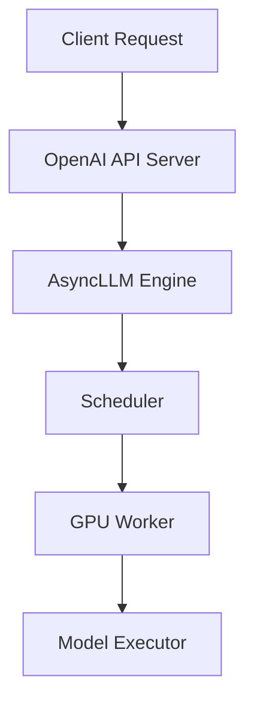

# vLLM Product Documentation Plan

**Generated by:** SASVA AI  
**Date:** March 19, 2026  
**Workspace:** `/Users/pradeepsharma/sasva/projects/vllm`  
**Output Directory:** `docs/`

---

## 1. Executive Summary

### Project Purpose

vLLM is a high-throughput, memory-efficient inference and serving engine for Large Language Models (LLMs), originally developed at UC Berkeley's Sky Computing Lab and now a community-driven open-source project. It is designed to make LLM serving **easy, fast, and cheap** for everyone — from individual researchers to large-scale production deployments.

### Documentation Scope

This plan covers comprehensive end-to-end documentation for the vLLM project, targeting:
- **End users** (ML engineers, data scientists) deploying and using vLLM for inference
- **Platform engineers** integrating vLLM into production infrastructure
- **Contributors** extending vLLM with new models, backends, or features
- **Researchers** understanding vLLM's internal architecture and algorithms

### Output Format

All documentation is written in **Markdown** (`.md`) and stored under `docs/`. The existing MkDocs Material theme setup (`mkdocs.yaml`) auto-converts Markdown to a full HTML wiki with:
- Sidebar navigation (awesome-nav plugin)
- Full-text search
- Dark/light mode toggle
- Code copy buttons, content tabs, admonitions
- Auto-generated API reference (mkdocstrings + api-autonav)
- Git revision dates, redirects, and minification

---

## 2. Project Overview — Investigation Results

### 2.1 System Metrics

| Metric | Value |
|--------|-------|
| Total files | 464 |
| Total directories | 156 |
| Total codebase size | ~3.2 MB (source only) |
| Python source files | 140+ (vllm package alone) |
| CUDA/C++ kernel files | 16 `.cu`, 8 `.h`, 3 `.cuh`, 2 `.cpp` |
| Jinja templates | 34 (chat/tool templates) |
| Docker images | 9 Dockerfiles (CUDA, ROCm, CPU, TPU, XPU, ppc64le, s390x, nightly) |
| Test directories | 3 (`tests/`, `team-test/tests/`, `examples/online_serving/chart-helm/tests/`) |
| CI pipelines | Buildkite + GitHub Actions |
| Documentation system | MkDocs Material + mkdocstrings |

### 2.2 Tech Stack Inventory

| Layer | Technology |
|-------|-----------|
| **Language** | Python 3.10–3.13 |
| **Deep Learning** | PyTorch 2.10.0 |
| **Web Framework** | FastAPI + Uvicorn + uvloop |
| **Async** | asyncio, uvloop |
| **Serialization** | Pydantic v2, msgspec, protobuf/gRPC |
| **Distributed** | Ray, NCCL, custom multiprocessing |
| **CUDA Kernels** | CUDA C++, Triton, FlashAttention, FlashInfer, CUTLASS |
| **Build System** | CMake 3.26+, Ninja, setuptools-scm |
| **Quantization** | GPTQ, AWQ, FP8, INT8, GGUF, compressed-tensors, bitsandbytes, TorchAO, ModelOpt, MXFP4 |
| **Structured Output** | xgrammar, outlines_core, llguidance, lm-format-enforcer |
| **Observability** | Prometheus, OpenTelemetry (OTLP), Grafana-compatible metrics |
| **Documentation** | MkDocs Material, mkdocstrings, awesome-nav |
| **CI/CD** | Buildkite (hardware CI), GitHub Actions (pre-commit, macOS smoke test, stale) |
| **Linting** | Ruff, mypy, pre-commit |
| **Testing** | pytest, lm-evaluation-harness |

### 2.3 Architecture Overview

vLLM follows a layered architecture with clear separation between the serving frontend, engine core, and hardware backends:

```
┌─────────────────────────────────────────────────────────────────┐
│                        ENTRYPOINTS                              │
│  CLI (vllm serve/run_batch)  │  Python API (LLM class)         │
│  OpenAI-compatible REST API  │  Anthropic API  │  gRPC Server  │
│  SageMaker  │  MCP  │  Realtime WebSocket                      │
└─────────────────────────────────────────────────────────────────┘
                              │
┌─────────────────────────────────────────────────────────────────┐
│                      ENGINE LAYER (v1)                          │
│  AsyncLLM (async_llm.py)  │  LLMEngine (llm_engine.py)        │
│  EngineCore (core.py)  │  CoreClient (core_client.py)          │
│  InputProcessor  │  OutputProcessor  │  Detokenizer            │
│  Scheduler (sched/scheduler.py ~100KB)                          │
└─────────────────────────────────────────────────────────────────┘
                              │
┌─────────────────────────────────────────────────────────────────┐
│                    KV CACHE MANAGEMENT                          │
│  KVCacheManager  │  BlockPool  │  KVCacheCoordinator           │
│  PagedAttention  │  Prefix Caching  │  KV Transfer/Offload     │
└─────────────────────────────────────────────────────────────────┘
                              │
┌─────────────────────────────────────────────────────────────────┐
│                      EXECUTOR LAYER                             │
│  UniProcExecutor  │  MultiProcExecutor  │  RayExecutor          │
└─────────────────────────────────────────────────────────────────┘
                              │
┌─────────────────────────────────────────────────────────────────┐
│                       WORKER LAYER                              │
│  GPUWorker  │  CPUWorker  │  XPUWorker                         │
│  GPUModelRunner (gpu_model_runner.py ~292KB)                    │
│  TPUInputBatch  │  CUDAGraph Dispatcher                        │
└─────────────────────────────────────────────────────────────────┘
                              │
┌─────────────────────────────────────────────────────────────────┐
│                    MODEL EXECUTOR                               │
│  ModelRegistry  │  ModelLoader  │  Layers (attention, linear,  │
│  quantization, fused_moe, mamba, rotary_embedding, pooler)     │
│  150+ Model Implementations (llama, gemma, deepseek, qwen, ...) │
└─────────────────────────────────────────────────────────────────┘
                              │
┌─────────────────────────────────────────────────────────────────┐
│                    PLATFORM BACKENDS                            │
│  CUDA  │  ROCm (AMD)  │  CPU  │  TPU  │  XPU (Intel)          │
│  HPU (Gaudi)  │  NPU (Ascend)  │  ppc64le  │  s390x  │  Arm   │
└─────────────────────────────────────────────────────────────────┘
```

### 2.4 Key Modules and Responsibilities

| Module | Path | Responsibility |
|--------|------|----------------|
| `LLM` | `vllm/entrypoints/llm.py` | Offline inference Python API (85KB) |
| `AsyncLLM` | `vllm/v1/engine/async_llm.py` | Async online serving engine (42KB) |
| `EngineCore` | `vllm/v1/engine/core.py` | Core inference loop (83KB) |
| `Scheduler` | `vllm/v1/core/sched/scheduler.py` | Request scheduling (102KB) |
| `GPUModelRunner` | `vllm/v1/worker/gpu_model_runner.py` | GPU execution (292KB) |
| `KVCacheManager` | `vllm/v1/core/kv_cache_manager.py` | PagedAttention block management |
| `ModelRegistry` | `vllm/model_executor/models/` | 150+ model implementations |
| `EngineArgs` | `vllm/engine/arg_utils.py` | CLI/config argument parsing |
| `VllmConfig` | `vllm/config/vllm.py` | Master configuration object (79KB) |
| `SamplingParams` | `vllm/sampling_params.py` | Decoding parameter control (37KB) |
| `OpenAI API Server` | `vllm/entrypoints/openai/` | REST API serving |
| `Quantization` | `vllm/model_executor/layers/quantization/` | 25+ quantization backends |
| `Distributed` | `vllm/distributed/` | Tensor/pipeline/expert parallelism |
| `SpecDecode` | `vllm/v1/spec_decode/` | Speculative decoding (EAGLE, Medusa, ngram) |
| `LoRA` | `vllm/lora/` | Multi-LoRA adapter support |
| `Multimodal` | `vllm/multimodal/` | Vision/audio/video input processing |
| `Platforms` | `vllm/platforms/` | Hardware abstraction (CUDA, ROCm, CPU, TPU, XPU) |
| `Compilation` | `vllm/compilation/` | torch.compile integration |
| `Tracing` | `vllm/tracing/` | OpenTelemetry instrumentation |

### 2.5 API Endpoints (OpenAI-Compatible)

| Endpoint | Method | Description |
|----------|--------|-------------|
| `/v1/chat/completions` | POST | Chat completions (streaming + non-streaming) |
| `/v1/chat/completions/render` | POST | Render chat template without inference |
| `/v1/completions` | POST | Text completions |
| `/v1/completions/render` | POST | Render completion template |
| `/v1/models` | GET | List available models |
| `/v1/embeddings` | POST | Text embeddings |
| `/v1/score` | POST | Cross-encoder scoring |
| `/v1/rerank` | POST | Document reranking |
| `/v1/responses` | POST | Responses API (stateful) |
| `/v1/responses/{id}` | GET | Get response by ID |
| `/v1/responses/{id}/cancel` | POST | Cancel response |
| `/v1/realtime` | WebSocket | Real-time streaming |
| `/v1/audio/transcriptions` | POST | Speech-to-text |
| `/v1/audio/translations` | POST | Audio translation |
| `/v1/messages` | POST | Anthropic-compatible messages |
| `/v1/messages/count_tokens` | POST | Anthropic token counting |
| `/health` | GET | Health check |
| `/metrics` | GET | Prometheus metrics |

### 2.6 Supported Hardware Platforms

| Platform | Dockerfile | Notes |
|----------|-----------|-------|
| NVIDIA CUDA | `docker/Dockerfile` | Primary target, CUDA 12.x |
| AMD ROCm | `docker/Dockerfile.rocm` | HIP/ROCm, gfx906–gfx1201 |
| Intel CPU | `docker/Dockerfile.cpu` | x86_64, AVX-512 |
| Intel XPU | `docker/Dockerfile.xpu` | Intel GPU (Arc, Data Center) |
| Google TPU | `docker/Dockerfile.tpu` | TPU v4/v5/v6 |
| IBM ppc64le | `docker/Dockerfile.ppc64le` | PowerPC 64-bit LE |
| IBM s390x | `docker/Dockerfile.s390x` | IBM Z mainframe |
| Apple Silicon | macOS CI workflow | CPU-only via macOS smoke test |
| Intel Gaudi (HPU) | CI scripts | `run-hpu-test.sh` |
| Huawei Ascend (NPU) | CI scripts | `run-npu-test.sh` |
| ARM64 | CI scripts | `run-cpu-test-arm.sh` |

### 2.7 Quantization Methods Supported

From `vllm/model_executor/layers/quantization/`:
- **GPTQ** (`gptq.py`, `gptq_marlin.py`) — 4-bit weight quantization
- **AWQ** (`awq.py`, `awq_marlin.py`, `awq_triton.py`) — Activation-aware weight quantization
- **FP8** (`fp8.py`, `fbgemm_fp8.py`, `ptpc_fp8.py`, `input_quant_fp8.py`) — 8-bit floating point
- **INT8** via compressed-tensors — Symmetric/asymmetric INT8
- **GGUF** (`gguf.py`) — llama.cpp-compatible format
- **BitsAndBytes** (`bitsandbytes.py`) — 4-bit/8-bit NF4/INT8
- **TorchAO** (`torchao.py`) — PyTorch native quantization
- **ModelOpt** (`modelopt.py`) — NVIDIA ModelOpt (68KB, comprehensive)
- **MXFP4** (`mxfp4.py`) — Microscaling FP4 (52KB)
- **Compressed-Tensors** (`compressed_tensors/`) — Neural Magic format
- **AutoRound** — via compressed-tensors
- **INC** (`inc.py`) — Intel Neural Compressor
- **Quark** (`quark/`) — AMD Quark quantization
- **CPU WNA16** (`cpu_wna16.py`) — CPU weight-only quantization
- **Experts INT8** (`experts_int8.py`) — MoE expert quantization

### 2.8 Speculative Decoding Methods

From `vllm/v1/spec_decode/`:
- **EAGLE** (`eagle.py`, 78KB) — Draft model with feature extraction
- **Medusa** (`medusa.py`) — Multi-head speculative decoding
- **N-gram Proposer** (`ngram_proposer.py`, `ngram_proposer_gpu.py`) — Prompt lookup decoding
- **Suffix Decoding** (`suffix_decoding.py`) — Suffix-based speculation
- **MTP (Multi-Token Prediction)** — via `deepseek_mtp.py`, `ernie_mtp.py`

### 2.9 Distributed Parallelism

From `vllm/distributed/` and `vllm/config/parallel.py`:
- **Tensor Parallelism (TP)** — Split model layers across GPUs
- **Pipeline Parallelism (PP)** — Split model stages across nodes
- **Data Parallelism (DP)** — Replicate model across workers
- **Expert Parallelism (EP)** — MoE expert distribution
- **Elastic Expert Parallelism (EPLB)** — Dynamic load balancing (`vllm/distributed/eplb/`)
- **Context Parallelism (CP)** — Long-context attention splitting
- **KV Transfer** (`vllm/distributed/kv_transfer/`) — Disaggregated prefill/decode
- **EC Transfer** (`vllm/distributed/ec_transfer/`) — Expert cache transfer

### 2.10 Existing Documentation Structure

The `docs/` directory already contains:
- `docs/getting_started/` — quickstart.md, installation/
- `docs/features/` — 17 feature docs (LoRA, multimodal, structured outputs, tool calling, speculative decoding, quantization, prefix caching, disaggregated prefill, reasoning outputs, etc.)
- `docs/design/` — 25 design docs (arch overview, PagedAttention, CUDA graphs, torch.compile, metrics, prefix caching, MoE kernels, etc.)
- `docs/serving/` — serving guides
- `docs/models/` — model support docs
- `docs/deployment/` — deployment guides
- `docs/configuration/` — configuration reference
- `docs/contributing/` — contribution guides
- `docs/benchmarking/` — benchmark docs
- `docs/api/` — API reference
- `docs/cli/` — CLI reference
- `docs/usage/` — usage guides
- `docs/community/` — community docs
- `docs/governance/` — governance docs
- `docs/training/` — training integration docs
- `docs/examples/` — example docs

---

## 3. Documentation Structure

The following is the complete planned documentation tree under `docs/`:

```
docs/
├── index.md                                    # Landing page / home
├── getting_started/
│   ├── index.md                                # Getting started overview
│   ├── quickstart.md                           # [EXISTS] 5-minute quickstart
│   ├── installation/
│   │   ├── index.md                            # Installation overview
│   │   ├── gpu-cuda.md                         # NVIDIA CUDA installation
│   │   ├── gpu-rocm.md                         # AMD ROCm installation
│   │   ├── cpu.md                              # CPU-only installation
│   │   ├── tpu.md                              # Google TPU installation
│   │   ├── xpu.md                              # Intel XPU installation
│   │   ├── hpu.md                              # Intel Gaudi HPU installation
│   │   ├── npu.md                              # Huawei Ascend NPU installation
│   │   ├── arm.md                              # ARM64 installation
│   │   ├── macos.md                            # macOS (Apple Silicon) installation
│   │   └── from-source.md                      # Build from source
│   └── first-inference.md                      # First inference walkthrough
├── models/
│   ├── index.md                                # Models overview
│   ├── supported_models.md                     # Full supported model list
│   ├── adding_model.md                         # How to add a new model
│   ├── model_registry.md                       # ModelRegistry API
│   ├── multimodal_models.md                    # Vision/audio/video models
│   ├── embedding_models.md                     # Embedding & pooling models
│   ├── encoder_decoder_models.md               # Encoder-decoder architectures
│   └── generative_models.md                    # Text generation models
├── serving/
│   ├── index.md                                # Serving overview
│   ├── openai_compatible_server.md             # OpenAI-compatible REST API
│   ├── api_reference.md                        # Full REST API endpoint reference
│   ├── chat_completions.md                     # /v1/chat/completions guide
│   ├── completions.md                          # /v1/completions guide
│   ├── embeddings.md                           # /v1/embeddings guide
│   ├── responses_api.md                        # /v1/responses (stateful) guide
│   ├── realtime_api.md                         # WebSocket realtime API
│   ├── speech_to_text.md                       # Audio transcription/translation
│   ├── anthropic_api.md                        # Anthropic-compatible API
│   ├── grpc_server.md                          # gRPC server guide
│   ├── batch_inference.md                      # Offline batch processing
│   ├── streaming.md                            # Streaming responses
│   ├── multimodal_serving.md                   # Serving multimodal models
│   └── sagemaker.md                            # AWS SageMaker integration
├── configuration/
│   ├── index.md                                # Configuration overview
│   ├── engine_args.md                          # EngineArgs / AsyncEngineArgs reference
│   ├── model_config.md                         # ModelConfig (vllm/config/model.py)
│   ├── parallel_config.md                      # ParallelConfig (tensor/pipeline/expert)
│   ├── scheduler_config.md                     # SchedulerConfig
│   ├── cache_config.md                         # CacheConfig (KV cache settings)
│   ├── quantization_config.md                  # Quantization configuration
│   ├── lora_config.md                          # LoRA configuration
│   ├── speculative_config.md                   # Speculative decoding config
│   ├── multimodal_config.md                    # Multimodal configuration
│   ├── compilation_config.md                   # torch.compile configuration
│   ├── observability_config.md                 # Metrics & tracing configuration
│   └── environment_variables.md                # All VLLM_* env vars (vllm/envs.py)
├── features/
│   ├── README.md                               # [EXISTS] Features overview
│   ├── automatic_prefix_caching.md             # [EXISTS] APC guide
│   ├── batch_invariance.md                     # [EXISTS] Batch invariance
│   ├── custom_arguments.md                     # [EXISTS] Custom CLI arguments
│   ├── custom_logitsprocs.md                   # [EXISTS] Custom logits processors
│   ├── disagg_encoder.md                       # [EXISTS] Disaggregated encoder
│   ├── disagg_prefill.md                       # [EXISTS] Disaggregated prefill
│   ├── interleaved_thinking.md                 # [EXISTS] Interleaved thinking
│   ├── lora.md                                 # [EXISTS] LoRA adapters
│   ├── mooncake_connector_usage.md             # [EXISTS] Mooncake KV connector
│   ├── multimodal_inputs.md                    # [EXISTS] Multimodal inputs
│   ├── nixl_connector_usage.md                 # [EXISTS] NIXL KV connector
│   ├── prompt_embeds.md                        # [EXISTS] Prompt embeddings
│   ├── reasoning_outputs.md                    # [EXISTS] Reasoning/thinking outputs
│   ├── sleep_mode.md                           # [EXISTS] Sleep mode
│   ├── structured_outputs.md                   # [EXISTS] Structured outputs
│   ├── tool_calling.md                         # [EXISTS] Tool calling
│   ├── quantization/
│   │   ├── index.md                            # Quantization overview
│   │   ├── gptq.md                             # GPTQ quantization
│   │   ├── awq.md                              # AWQ quantization
│   │   ├── fp8.md                              # FP8 quantization
│   │   ├── int8.md                             # INT8 / compressed-tensors
│   │   ├── gguf.md                             # GGUF format support
│   │   ├── bitsandbytes.md                     # BitsAndBytes (4-bit/8-bit)
│   │   ├── torchao.md                          # TorchAO quantization
│   │   ├── mxfp4.md                            # MXFP4 microscaling
│   │   └── kv_cache_quantization.md            # KV cache quantization
│   └── speculative_decoding/
│       ├── README.md                           # Speculative decoding overview
│       ├── eagle.md                            # EAGLE draft model
│       ├── medusa.md                           # Medusa multi-head
│       ├── ngram.md                            # N-gram / prompt lookup
│       └── speculators.md                      # Speculator configuration
├── deployment/
│   ├── index.md                                # Deployment overview
│   ├── docker.md                               # Docker deployment guide
│   ├── kubernetes.md                           # Kubernetes / Helm deployment
│   ├── multi_node.md                           # Multi-node distributed deployment
│   ├── ray_cluster.md                          # Ray cluster setup
│   ├── production_checklist.md                 # Production readiness checklist
│   ├── ssl_tls.md                              # SSL/TLS configuration
│   ├── load_balancing.md                       # Load balancing strategies
│   └── elastic_ep.md                           # Elastic expert parallelism deployment
├── usage/
│   ├── index.md                                # Usage overview
│   ├── offline_inference.md                    # Offline batch inference with LLM class
│   ├── sampling_params.md                      # SamplingParams reference
│   ├── pooling_params.md                       # PoolingParams reference
│   ├── chat_templates.md                       # Chat template configuration
│   ├── tool_templates.md                       # Tool calling Jinja templates
│   ├── beam_search.md                          # Beam search decoding
│   ├── logprobs.md                             # Log probabilities
│   ├── tokenization.md                         # Tokenizer configuration
│   └── output_types.md                         # RequestOutput, CompletionOutput, etc.
├── design/
│   ├── arch_overview.md                        # [EXISTS] Architecture overview
│   ├── attention_backends.md                   # [EXISTS] Attention backends
│   ├── cuda_graphs.md                          # [EXISTS] CUDA graph capture
│   ├── custom_op.md                            # [EXISTS] Custom operators
│   ├── dbo.md                                  # [EXISTS] Dynamic batch optimization
│   ├── debug_vllm_compile.md                   # [EXISTS] Debugging torch.compile
│   ├── fused_moe_modular_kernel.md             # [EXISTS] Fused MoE kernel
│   ├── fusions.md                              # [EXISTS] Kernel fusions
│   ├── huggingface_integration.md              # [EXISTS] HuggingFace integration
│   ├── hybrid_kv_cache_manager.md              # [EXISTS] Hybrid KV cache
│   ├── io_processor_plugins.md                 # [EXISTS] IO processor plugins
│   ├── logits_processors.md                    # [EXISTS] Logits processors design
│   ├── lora_resolver_plugins.md                # [EXISTS] LoRA resolver plugins
│   ├── metrics.md                              # [EXISTS] Metrics system design
│   ├── mm_processing.md                        # [EXISTS] Multimodal processing
│   ├── model_runner_v2.md                      # [EXISTS] Model runner v2
│   ├── moe_kernel_features.md                  # [EXISTS] MoE kernel features
│   ├── multiprocessing.md                      # [EXISTS] Multiprocessing design
│   ├── optimization_levels.md                  # [EXISTS] Optimization levels
│   ├── p2p_nccl_connector.md                   # [EXISTS] P2P NCCL connector
│   ├── paged_attention.md                      # [EXISTS] PagedAttention algorithm
│   ├── plugin_system.md                        # [EXISTS] Plugin system
│   ├── prefix_caching.md                       # [EXISTS] Prefix caching design
│   ├── torch_compile.md                        # [EXISTS] torch.compile integration
│   ├── torch_compile_multimodal.md             # [EXISTS] Multimodal compilation
│   ├── v1_engine.md                            # NEW: v1 engine architecture
│   ├── scheduler.md                            # NEW: Scheduler deep dive
│   ├── kv_cache_management.md                  # NEW: KV cache management
│   ├── distributed_inference.md                # NEW: Distributed inference design
│   └── speculative_decoding_design.md          # NEW: Spec decode internals
├── api/
│   ├── index.md                                # API reference overview
│   ├── llm.md                                  # LLM class reference
│   ├── async_llm_engine.md                     # AsyncLLMEngine reference
│   ├── llm_engine.md                           # LLMEngine reference
│   ├── engine_args.md                          # EngineArgs / AsyncEngineArgs
│   ├── sampling_params.md                      # SamplingParams reference
│   ├── pooling_params.md                       # PoolingParams reference
│   ├── outputs.md                              # Output types reference
│   └── openai_protocol.md                      # OpenAI protocol types
├── cli/
│   ├── index.md                                # CLI overview
│   ├── vllm_serve.md                           # vllm serve command
│   ├── vllm_run_batch.md                       # vllm run_batch command
│   ├── vllm_bench.md                           # vllm bench command
│   └── vllm_collect_env.md                     # vllm collect_env command
├── benchmarking/
│   ├── index.md                                # Benchmarking overview
│   ├── performance_benchmarks.md               # Running performance benchmarks
│   ├── latency_benchmarks.md                   # Latency measurement
│   ├── throughput_benchmarks.md                # Throughput measurement
│   ├── lm_eval_harness.md                      # LM evaluation harness
│   └── profiling.md                            # Profiling vLLM
├── contributing/
│   ├── index.md                                # Contributing overview
│   ├── development_setup.md                    # Dev environment setup
│   ├── code_style.md                           # Code style (Ruff, mypy)
│   ├── testing.md                              # Testing guide
│   ├── adding_model.md                         # Adding a new model
│   ├── adding_quantization.md                  # Adding quantization backend
│   ├── adding_platform.md                      # Adding hardware platform
│   ├── ci_cd.md                                # CI/CD pipeline guide
│   └── release_process.md                      # Release process
├── community/
│   ├── index.md                                # Community overview
│   ├── support.md                              # Getting support
│   └── rfcs.md                                 # RFC process
├── governance/
│   └── index.md                                # Governance model
└── examples/
    ├── index.md                                # Examples overview
    ├── offline_inference/                       # Offline inference examples
    ├── online_serving/                          # Online serving examples
    ├── pooling/                                 # Pooling/embedding examples
    └── others/                                  # Miscellaneous examples
```

---

## 4. Execution Plan

### Phase 1: Foundation & Directory Setup

**Estimated effort:** 2 hours  
**Dependencies:** None

#### Tasks:
- [ ] Create `docs/index.md` — project landing page with hero section, key features, quick links, and community resources
- [ ] Create `docs/getting_started/index.md` — getting started overview with decision tree (which installation path to choose)
- [ ] Verify MkDocs configuration in `mkdocs.yaml` covers all new pages
- [ ] Create `.sasva/` directory structure for plan artifacts
- [ ] Establish Markdown style guide and admonition conventions for the doc set

#### Deliverables:
- `docs/index.md` — Home page
- `docs/getting_started/index.md` — Getting started hub
- Documentation style conventions reference

---

### Phase 2: Installation Guides

**Estimated effort:** 6 hours  
**Dependencies:** Phase 1

#### Tasks:
- [ ] Read `docker/Dockerfile` (CUDA, 35KB) for CUDA installation steps and base image details
- [ ] Read `docker/Dockerfile.rocm` (16KB) for ROCm installation
- [ ] Read `docker/Dockerfile.cpu` (9.6KB) for CPU installation
- [ ] Read `.buildkite/scripts/hardware_ci/` scripts for platform-specific setup
- [ ] Read `requirements/` files (common.txt, cuda.txt, rocm.txt, cpu.txt, tpu.txt, xpu.txt) for dependency details
- [ ] Read `.github/workflows/macos-smoke-test.yml` for macOS installation steps
- [ ] Create `docs/getting_started/installation/gpu-cuda.md` — NVIDIA GPU installation (pip, Docker, from source)
- [ ] Create `docs/getting_started/installation/gpu-rocm.md` — AMD ROCm installation
- [ ] Create `docs/getting_started/installation/cpu.md` — CPU-only installation (x86, ARM, ppc64le, s390x)
- [ ] Create `docs/getting_started/installation/tpu.md` — Google TPU installation
- [ ] Create `docs/getting_started/installation/xpu.md` — Intel XPU installation
- [ ] Create `docs/getting_started/installation/hpu.md` — Intel Gaudi HPU
- [ ] Create `docs/getting_started/installation/npu.md` — Huawei Ascend NPU
- [ ] Create `docs/getting_started/installation/macos.md` — macOS Apple Silicon
- [ ] Create `docs/getting_started/installation/from-source.md` — CMake build from source
- [ ] Create `docs/getting_started/installation/index.md` — Installation overview with platform comparison table
- [ ] Create `docs/getting_started/first-inference.md` — First inference walkthrough

#### Deliverables:
- 11 installation guide files covering all supported platforms
- Platform comparison table with feature matrix

---

### Phase 3: Quickstart & Core Usage

**Estimated effort:** 4 hours  
**Dependencies:** Phase 1

#### Tasks:
- [ ] Enhance `docs/getting_started/quickstart.md` (existing, 13KB) — add tabs for offline vs online, add more examples
- [ ] Read `vllm/entrypoints/llm.py` (85KB) — document LLM class methods: `generate()`, `chat()`, `embed()`, `score()`, `encode()`
- [ ] Read `vllm/sampling_params.py` (37KB) — document all SamplingParams fields
- [ ] Read `vllm/pooling_params.py` (7.5KB) — document PoolingParams
- [ ] Read `vllm/outputs.py` (12.6KB) — document all output types
- [ ] Create `docs/usage/offline_inference.md` — comprehensive offline inference guide
- [ ] Create `docs/usage/sampling_params.md` — SamplingParams complete reference with examples
- [ ] Create `docs/usage/pooling_params.md` — PoolingParams reference
- [ ] Create `docs/usage/output_types.md` — RequestOutput, CompletionOutput, EmbeddingOutput, etc.
- [ ] Create `docs/usage/beam_search.md` — beam search decoding guide
- [ ] Create `docs/usage/logprobs.md` — log probabilities guide
- [ ] Create `docs/usage/index.md` — usage overview

#### Deliverables:
- Enhanced quickstart guide
- Complete offline inference documentation
- SamplingParams and output types reference

---

### Phase 4: OpenAI-Compatible API Server

**Estimated effort:** 6 hours  
**Dependencies:** Phase 1

#### Tasks:
- [ ] Read `vllm/entrypoints/openai/api_server.py` (20KB) — server startup, middleware, lifespan
- [ ] Read `vllm/entrypoints/openai/cli_args.py` (16.5KB) — all server CLI arguments
- [ ] Read `vllm/entrypoints/openai/chat_completion/api_router.py` — chat completions endpoint
- [ ] Read `vllm/entrypoints/openai/completion/api_router.py` — completions endpoint
- [ ] Read `vllm/entrypoints/openai/responses/api_router.py` — responses API
- [ ] Read `vllm/entrypoints/openai/realtime/api_router.py` — WebSocket realtime
- [ ] Read `vllm/entrypoints/openai/speech_to_text/api_router.py` — audio endpoints
- [ ] Read `vllm/entrypoints/anthropic/api_router.py` — Anthropic API
- [ ] Read `vllm/entrypoints/grpc_server.py` (18KB) — gRPC server
- [ ] Create `docs/serving/openai_compatible_server.md` — server setup, configuration, authentication
- [ ] Create `docs/serving/api_reference.md` — complete endpoint reference with request/response schemas
- [ ] Create `docs/serving/chat_completions.md` — chat completions deep dive
- [ ] Create `docs/serving/completions.md` — text completions guide
- [ ] Create `docs/serving/embeddings.md` — embeddings endpoint guide
- [ ] Create `docs/serving/responses_api.md` — stateful responses API
- [ ] Create `docs/serving/realtime_api.md` — WebSocket realtime guide
- [ ] Create `docs/serving/speech_to_text.md` — audio transcription/translation
- [ ] Create `docs/serving/anthropic_api.md` — Anthropic-compatible API
- [ ] Create `docs/serving/grpc_server.md` — gRPC server guide
- [ ] Create `docs/serving/streaming.md` — streaming responses guide
- [ ] Create `docs/serving/batch_inference.md` — offline batch processing (`run_batch.py`)
- [ ] Create `docs/serving/sagemaker.md` — AWS SageMaker integration
- [ ] Create `docs/serving/index.md` — serving overview

#### Deliverables:
- Complete REST API documentation with all 18 endpoints
- gRPC server guide
- Streaming and batch inference guides

---

### Phase 5: Configuration Reference

**Estimated effort:** 5 hours  
**Dependencies:** Phase 1

#### Tasks:
- [ ] Read `vllm/engine/arg_utils.py` — EngineArgs (363+ lines of config fields)
- [ ] Read `vllm/config/vllm.py` (79KB) — VllmConfig master config
- [ ] Read `vllm/config/model.py` (83KB) — ModelConfig
- [ ] Read `vllm/config/parallel.py` (36KB) — ParallelConfig
- [ ] Read `vllm/config/scheduler.py` (12.7KB) — SchedulerConfig
- [ ] Read `vllm/config/cache.py` (9.6KB) — CacheConfig
- [ ] Read `vllm/config/speculative.py` (37KB) — SpeculativeConfig
- [ ] Read `vllm/config/compilation.py` (53KB) — CompilationConfig
- [ ] Read `vllm/config/observability.py` (6.4KB) — ObservabilityConfig
- [ ] Read `vllm/envs.py` (82KB) — all VLLM_* environment variables
- [ ] Create `docs/configuration/engine_args.md` — EngineArgs complete reference (auto-generated table)
- [ ] Create `docs/configuration/model_config.md` — model configuration options
- [ ] Create `docs/configuration/parallel_config.md` — parallelism configuration
- [ ] Create `docs/configuration/scheduler_config.md` — scheduler tuning
- [ ] Create `docs/configuration/cache_config.md` — KV cache configuration
- [ ] Create `docs/configuration/quantization_config.md` — quantization setup
- [ ] Create `docs/configuration/lora_config.md` — LoRA configuration
- [ ] Create `docs/configuration/speculative_config.md` — speculative decoding config
- [ ] Create `docs/configuration/compilation_config.md` — torch.compile config
- [ ] Create `docs/configuration/observability_config.md` — metrics and tracing config
- [ ] Create `docs/configuration/environment_variables.md` — all VLLM_* env vars with descriptions
- [ ] Create `docs/configuration/index.md` — configuration overview

#### Deliverables:
- Complete configuration reference covering all 80+ EngineArgs
- Environment variables reference (from `vllm/envs.py`)
- Configuration best practices guide

---

### Phase 6: Model Support Documentation

**Estimated effort:** 5 hours  
**Dependencies:** Phase 1

#### Tasks:
- [ ] Read `vllm/model_executor/models/config.py` (29KB) — model architecture configs
- [ ] Grep `vllm/model_executor/models/` for all model class names and architectures
- [ ] Read `vllm/model_executor/models/__init__.py` — ModelRegistry entries
- [ ] Read `vllm/multimodal/` directory — multimodal input processing
- [ ] Read `vllm/model_executor/model_loader/` — model loading strategies
- [ ] Create `docs/models/supported_models.md` — comprehensive table of 150+ supported models with architecture, task types, quantization support
- [ ] Create `docs/models/adding_model.md` — step-by-step guide to adding a new model
- [ ] Create `docs/models/model_registry.md` — ModelRegistry API and usage
- [ ] Create `docs/models/multimodal_models.md` — vision/audio/video model guide
- [ ] Create `docs/models/embedding_models.md` — embedding and pooling models
- [ ] Create `docs/models/encoder_decoder_models.md` — encoder-decoder architectures
- [ ] Create `docs/models/generative_models.md` — text generation model guide
- [ ] Create `docs/models/index.md` — models overview

#### Deliverables:
- Comprehensive supported models table (150+ models)
- Model addition guide with code examples
- Multimodal model documentation

---

### Phase 7: Features — Quantization

**Estimated effort:** 5 hours  
**Dependencies:** Phase 1

#### Tasks:
- [ ] Read `vllm/model_executor/layers/quantization/__init__.py` (5.5KB) — QuantizationMethods enum
- [ ] Read `vllm/model_executor/layers/quantization/fp8.py` (49KB) — FP8 implementation
- [ ] Read `vllm/model_executor/layers/quantization/gptq.py` and `gptq_marlin.py` — GPTQ
- [ ] Read `vllm/model_executor/layers/quantization/awq.py` and `awq_marlin.py` — AWQ
- [ ] Read `vllm/model_executor/layers/quantization/gguf.py` (23KB) — GGUF
- [ ] Read `docs/features/quantization/` existing files
- [ ] Create `docs/features/quantization/index.md` — quantization overview, method comparison table
- [ ] Create `docs/features/quantization/gptq.md` — GPTQ guide with examples
- [ ] Create `docs/features/quantization/awq.md` — AWQ guide with examples
- [ ] Create `docs/features/quantization/fp8.md` — FP8 guide (W8A8, W8A16, KV cache)
- [ ] Create `docs/features/quantization/int8.md` — INT8 / compressed-tensors guide
- [ ] Create `docs/features/quantization/gguf.md` — GGUF format guide
- [ ] Create `docs/features/quantization/bitsandbytes.md` — BitsAndBytes guide
- [ ] Create `docs/features/quantization/torchao.md` — TorchAO guide
- [ ] Create `docs/features/quantization/mxfp4.md` — MXFP4 guide
- [ ] Create `docs/features/quantization/kv_cache_quantization.md` — KV cache quantization

#### Deliverables:
- 10 quantization method guides
- Quantization comparison table (accuracy, speed, memory tradeoffs)
- Hardware compatibility matrix per quantization method

---

### Phase 8: Features — Distributed Inference & Parallelism

**Estimated effort:** 5 hours  
**Dependencies:** Phase 1

#### Tasks:
- [ ] Read `vllm/distributed/parallel_state.py` (76KB) — parallel group management
- [ ] Read `vllm/config/parallel.py` (36KB) — parallelism configuration
- [ ] Read `vllm/v1/executor/ray_executor.py` (26KB) — Ray distributed execution
- [ ] Read `vllm/v1/executor/multiproc_executor.py` (40KB) — multiprocess execution
- [ ] Read `vllm/distributed/kv_transfer/` — disaggregated prefill/decode
- [ ] Read `vllm/distributed/eplb/` — elastic expert parallelism load balancing
- [ ] Read `docs/features/disagg_prefill.md` (existing, 7.3KB)
- [ ] Create `docs/deployment/multi_node.md` — multi-node setup with Ray and multiprocessing
- [ ] Create `docs/deployment/ray_cluster.md` — Ray cluster configuration
- [ ] Create `docs/design/distributed_inference.md` — distributed inference design doc
- [ ] Create `docs/deployment/elastic_ep.md` — elastic expert parallelism
- [ ] Enhance `docs/features/disagg_prefill.md` — disaggregated prefill/decode

#### Deliverables:
- Multi-node deployment guide
- Distributed inference design documentation
- Elastic expert parallelism guide

---

### Phase 9: Features — Speculative Decoding

**Estimated effort:** 4 hours  
**Dependencies:** Phase 1

#### Tasks:
- [ ] Read `vllm/v1/spec_decode/eagle.py` (78KB) — EAGLE implementation
- [ ] Read `vllm/v1/spec_decode/ngram_proposer.py` and `ngram_proposer_gpu.py` — N-gram
- [ ] Read `vllm/v1/spec_decode/medusa.py` — Medusa
- [ ] Read `vllm/config/speculative.py` (37KB) — speculative config
- [ ] Read `docs/features/speculative_decoding/` existing files
- [ ] Create/enhance `docs/features/speculative_decoding/README.md` — overview with algorithm comparison
- [ ] Create `docs/features/speculative_decoding/eagle.md` — EAGLE guide
- [ ] Create `docs/features/speculative_decoding/medusa.md` — Medusa guide
- [ ] Create `docs/features/speculative_decoding/ngram.md` — N-gram / prompt lookup decoding
- [ ] Create `docs/features/speculative_decoding/speculators.md` — speculator configuration
- [ ] Create `docs/design/speculative_decoding_design.md` — internal design doc

#### Deliverables:
- Complete speculative decoding documentation
- Algorithm comparison table (EAGLE vs Medusa vs N-gram)
- Configuration examples for each method

---

### Phase 10: Features — LoRA & Adapters

**Estimated effort:** 3 hours  
**Dependencies:** Phase 1

#### Tasks:
- [ ] Read `vllm/lora/` directory — LoRA implementation
- [ ] Read `vllm/config/lora.py` (4.5KB) — LoRA configuration
- [ ] Read `vllm/plugins/lora_resolvers/` — LoRA resolver plugins
- [ ] Read `docs/features/lora.md` (existing, 16.9KB)
- [ ] Read `docs/design/lora_resolver_plugins.md` (existing, 7.1KB)
- [ ] Enhance `docs/features/lora.md` — add dynamic loading, multi-LoRA serving, resolver plugins
- [ ] Create `docs/usage/chat_templates.md` — chat template configuration guide
- [ ] Create `docs/usage/tool_templates.md` — tool calling Jinja templates guide (34 templates in `examples/`)

#### Deliverables:
- Enhanced LoRA documentation
- Chat template and tool template guides

---

### Phase 11: Features — Multimodal & Structured Outputs

**Estimated effort:** 4 hours  
**Dependencies:** Phase 1

#### Tasks:
- [ ] Read `vllm/multimodal/` directory — multimodal processing pipeline
- [ ] Read `docs/features/multimodal_inputs.md` (existing, 36KB)
- [ ] Read `docs/features/structured_outputs.md` (existing, 13.7KB)
- [ ] Read `vllm/v1/structured_output/` — structured output backends
- [ ] Read `docs/features/tool_calling.md` (existing, 23.6KB)
- [ ] Read `docs/features/reasoning_outputs.md` (existing, 14.5KB)
- [ ] Enhance `docs/features/multimodal_inputs.md` — add video, audio, multi-image examples
- [ ] Create `docs/serving/multimodal_serving.md` — serving multimodal models
- [ ] Enhance `docs/features/structured_outputs.md` — add xgrammar, outlines, llguidance backends
- [ ] Enhance `docs/features/tool_calling.md` — add all tool templates, streaming tool calls

#### Deliverables:
- Enhanced multimodal documentation
- Structured outputs backend comparison
- Tool calling comprehensive guide

---

### Phase 12: Deployment & Production

**Estimated effort:** 5 hours  
**Dependencies:** Phase 1

#### Tasks:
- [ ] Read `docker/Dockerfile` (35KB) — production Docker image details
- [ ] Read `docker/docker-bake.hcl` — multi-platform Docker build
- [ ] Read `docker/versions.json` — version pinning
- [ ] Read `vllm/entrypoints/ssl.py` (2.7KB) — SSL/TLS configuration
- [ ] Read `vllm/entrypoints/serve/elastic_ep/` — elastic endpoint scaling
- [ ] Read `vllm/entrypoints/serve/sleep/` — sleep mode API
- [ ] Read `examples/online_serving/chart-helm/` — Helm chart for Kubernetes
- [ ] Create `docs/deployment/docker.md` — Docker deployment guide (all variants)
- [ ] Create `docs/deployment/kubernetes.md` — Kubernetes + Helm deployment
- [ ] Create `docs/deployment/ssl_tls.md` — SSL/TLS setup
- [ ] Create `docs/deployment/load_balancing.md` — load balancing strategies
- [ ] Create `docs/deployment/production_checklist.md` — production readiness checklist
- [ ] Create `docs/deployment/index.md` — deployment overview

#### Deliverables:
- Docker deployment guide (9 image variants)
- Kubernetes/Helm deployment guide
- Production checklist and best practices

---

### Phase 13: Observability & Monitoring

**Estimated effort:** 3 hours  
**Dependencies:** Phase 1

#### Tasks:
- [ ] Read `docs/design/metrics.md` (existing, 32KB) — metrics system
- [ ] Read `vllm/config/observability.py` (6.4KB) — observability config
- [ ] Read `vllm/tracing/` — OpenTelemetry tracing
- [ ] Read `vllm/v1/metrics/` — v1 metrics implementation
- [ ] Create `docs/configuration/observability_config.md` — metrics and tracing configuration
- [ ] Create `docs/deployment/monitoring.md` — Prometheus + Grafana setup guide
- [ ] Enhance `docs/design/metrics.md` — add v1 metrics, OTLP export

#### Deliverables:
- Observability configuration guide
- Prometheus/Grafana monitoring setup
- OpenTelemetry tracing guide

---

### Phase 14: CLI Reference

**Estimated effort:** 3 hours  
**Dependencies:** Phase 1

#### Tasks:
- [ ] Read `vllm/entrypoints/cli/` directory — CLI command implementations
- [ ] Read `vllm/entrypoints/openai/cli_args.py` (16.5KB) — all serve arguments
- [ ] Read `vllm/entrypoints/openai/run_batch.py` (29KB) — batch run command
- [ ] Create `docs/cli/index.md` — CLI overview
- [ ] Create `docs/cli/vllm_serve.md` — `vllm serve` complete reference (all flags)
- [ ] Create `docs/cli/vllm_run_batch.md` — `vllm run_batch` reference
- [ ] Create `docs/cli/vllm_bench.md` — `vllm bench` reference
- [ ] Create `docs/cli/vllm_collect_env.md` — `vllm collect_env` reference

#### Deliverables:
- Complete CLI reference for all vllm subcommands
- Flag descriptions with types, defaults, and examples

---

### Phase 15: Python API Reference

**Estimated effort:** 4 hours  
**Dependencies:** Phase 1

#### Tasks:
- [ ] Read `vllm/__init__.py` — public API surface
- [ ] Read `vllm/entrypoints/llm.py` (85KB) — LLM class full API
- [ ] Read `vllm/v1/engine/async_llm.py` (42KB) — AsyncLLM API
- [ ] Read `vllm/v1/engine/llm_engine.py` (16.8KB) — LLMEngine API
- [ ] Read `vllm/engine/arg_utils.py` — EngineArgs/AsyncEngineArgs
- [ ] Create `docs/api/index.md` — API reference overview
- [ ] Create `docs/api/llm.md` — LLM class with all methods documented
- [ ] Create `docs/api/async_llm_engine.md` — AsyncLLMEngine reference
- [ ] Create `docs/api/llm_engine.md` — LLMEngine reference
- [ ] Create `docs/api/engine_args.md` — EngineArgs/AsyncEngineArgs
- [ ] Create `docs/api/sampling_params.md` — SamplingParams full reference
- [ ] Create `docs/api/pooling_params.md` — PoolingParams reference
- [ ] Create `docs/api/outputs.md` — all output type references
- [ ] Create `docs/api/openai_protocol.md` — OpenAI protocol types

#### Deliverables:
- Complete Python API reference
- Method signatures with type annotations and docstrings
- Usage examples for each major class

---

### Phase 16: Design & Architecture Documentation

**Estimated effort:** 6 hours  
**Dependencies:** Phase 1

#### Tasks:
- [ ] Read `docs/design/arch_overview.md` (existing, 15KB) — enhance with v1 engine details
- [ ] Read `vllm/v1/engine/core.py` (83KB) — EngineCore internals
- [ ] Read `vllm/v1/core/sched/scheduler.py` (102KB) — scheduler algorithm
- [ ] Read `vllm/v1/core/kv_cache_manager.py` (21KB) — KV cache management
- [ ] Read `vllm/v1/core/kv_cache_utils.py` (66KB) — KV cache utilities
- [ ] Read `docs/design/paged_attention.md` (existing, 20.7KB)
- [ ] Read `docs/design/prefix_caching.md` (existing, 13.9KB)
- [ ] Create `docs/design/v1_engine.md` — v1 engine architecture (AsyncLLM, EngineCore, CoreClient)
- [ ] Create `docs/design/scheduler.md` — scheduler design (continuous batching, chunked prefill)
- [ ] Create `docs/design/kv_cache_management.md` — KV cache management deep dive
- [ ] Enhance `docs/design/arch_overview.md` — update with v1 architecture diagram

#### Deliverables:
- v1 engine architecture documentation
- Scheduler design documentation
- KV cache management deep dive
- Updated architecture overview with Mermaid diagrams

---

### Phase 17: Benchmarking & Performance

**Estimated effort:** 3 hours  
**Dependencies:** Phase 1

#### Tasks:
- [ ] Read `.buildkite/performance-benchmarks/README.md` (existing)
- [ ] Read `.buildkite/performance-benchmarks/scripts/` — benchmark scripts
- [ ] Read `benchmarks/` directory — benchmark implementations
- [ ] Read `.buildkite/lm-eval-harness/` — LM eval harness configs
- [ ] Create `docs/benchmarking/index.md` — benchmarking overview
- [ ] Create `docs/benchmarking/performance_benchmarks.md` — running performance benchmarks
- [ ] Create `docs/benchmarking/latency_benchmarks.md` — latency measurement guide
- [ ] Create `docs/benchmarking/throughput_benchmarks.md` — throughput measurement
- [ ] Create `docs/benchmarking/lm_eval_harness.md` — LM evaluation harness integration
- [ ] Create `docs/benchmarking/profiling.md` — profiling with vLLM profiler

#### Deliverables:
- Complete benchmarking guide
- LM evaluation harness integration docs
- Profiling guide

---

### Phase 18: Contributing Guide

**Estimated effort:** 4 hours  
**Dependencies:** Phase 1

#### Tasks:
- [ ] Read `CONTRIBUTING.md` — contribution overview
- [ ] Read `CODE_OF_CONDUCT.md` — code of conduct
- [ ] Read `.github/PULL_REQUEST_TEMPLATE.md` — PR template
- [ ] Read `.github/ISSUE_TEMPLATE/` — issue templates
- [ ] Read `.github/workflows/pre-commit.yml` — linting setup
- [ ] Read `RELEASE.md` — release process
- [ ] Read `.buildkite/ci_config.yaml` — CI configuration
- [ ] Create `docs/contributing/index.md` — contributing overview
- [ ] Create `docs/contributing/development_setup.md` — dev environment setup
- [ ] Create `docs/contributing/code_style.md` — Ruff, mypy, pre-commit setup
- [ ] Create `docs/contributing/testing.md` — testing guide (pytest, test areas)
- [ ] Create `docs/contributing/adding_model.md` — model contribution guide
- [ ] Create `docs/contributing/adding_quantization.md` — quantization backend guide
- [ ] Create `docs/contributing/adding_platform.md` — hardware platform guide
- [ ] Create `docs/contributing/ci_cd.md` — CI/CD pipeline guide (Buildkite + GitHub Actions)
- [ ] Create `docs/contributing/release_process.md` — release process

#### Deliverables:
- Complete contributor documentation
- Model, quantization, and platform addition guides
- CI/CD pipeline documentation

---

### Phase 19: Examples Documentation

**Estimated effort:** 3 hours  
**Dependencies:** Phase 1

#### Tasks:
- [ ] Read `examples/offline_inference/` — offline inference examples
- [ ] Read `examples/online_serving/` — online serving examples
- [ ] Read `examples/pooling/` — pooling/embedding examples
- [ ] Read `examples/others/` — miscellaneous examples
- [ ] Create `docs/examples/index.md` — examples overview with categorized links
- [ ] Create `docs/examples/offline_inference/` — documented offline inference examples
- [ ] Create `docs/examples/online_serving/` — documented online serving examples
- [ ] Create `docs/examples/pooling/` — documented pooling examples

#### Deliverables:
- Documented examples with explanations
- Example index with use-case categorization

---

### Phase 20: Tokenization & Chat Templates

**Estimated effort:** 2 hours  
**Dependencies:** Phase 1

#### Tasks:
- [ ] Read `vllm/tokenizers/` — tokenizer implementations
- [ ] Read `vllm/entrypoints/chat_utils.py` (57KB) — chat template utilities
- [ ] Read `examples/template_*.jinja` — chat template examples (9 templates)
- [ ] Read `examples/tool_chat_template_*.jinja` — tool templates (25 templates)
- [ ] Create `docs/usage/tokenization.md` — tokenizer configuration guide
- [ ] Create `docs/usage/chat_templates.md` — chat template guide with all built-in templates
- [ ] Create `docs/usage/tool_templates.md` — tool calling template guide

#### Deliverables:
- Tokenization guide
- Chat template reference (all 9 built-in templates)
- Tool calling template guide (25 tool templates)

---

### Phase 21: Security & Compliance

**Estimated effort:** 2 hours  
**Dependencies:** Phase 1

#### Tasks:
- [ ] Read `SECURITY.md` (3.7KB) — security policy
- [ ] Read `vllm/entrypoints/ssl.py` (2.7KB) — SSL/TLS implementation
- [ ] Read `vllm/entrypoints/openai/cli_args.py` — API key, auth options
- [ ] Create `docs/deployment/ssl_tls.md` — SSL/TLS configuration guide
- [ ] Create `docs/deployment/security.md` — security best practices, API key auth, network security

#### Deliverables:
- SSL/TLS configuration guide
- Security best practices documentation

---

### Phase 22: Plugin System & Extensibility

**Estimated effort:** 3 hours  
**Dependencies:** Phase 1

#### Tasks:
- [ ] Read `docs/design/plugin_system.md` (existing, 11.6KB)
- [ ] Read `vllm/plugins/` directory — plugin implementations
- [ ] Read `docs/design/io_processor_plugins.md` (existing, 5KB)
- [ ] Read `docs/design/lora_resolver_plugins.md` (existing, 7.1KB)
- [ ] Read `pyproject.toml` — entry points for plugins
- [ ] Enhance `docs/design/plugin_system.md` — add examples, entry points reference
- [ ] Create `docs/design/io_processor_plugins.md` — IO processor plugin guide
- [ ] Create `docs/contributing/adding_platform.md` — platform plugin guide

#### Deliverables:
- Plugin system documentation
- IO processor plugin guide
- LoRA resolver plugin guide

---

### Phase 23: Training Integration

**Estimated effort:** 2 hours  
**Dependencies:** Phase 1

#### Tasks:
- [ ] Read `docs/training/` existing files
- [ ] Read `vllm/distributed/weight_transfer/` — weight transfer for training
- [ ] Create `docs/training/index.md` — training integration overview
- [ ] Document weight transfer API for online training integration

#### Deliverables:
- Training integration documentation
- Weight transfer API guide

---

### Phase 24: Community & Governance

**Estimated effort:** 1 hour  
**Dependencies:** Phase 1

#### Tasks:
- [ ] Read `docs/community/` existing files
- [ ] Read `docs/governance/` existing files
- [ ] Read `.github/ISSUE_TEMPLATE/` — issue templates
- [ ] Create `docs/community/index.md` — community overview (forums, Slack, GitHub)
- [ ] Create `docs/community/support.md` — getting support guide
- [ ] Create `docs/community/rfcs.md` — RFC process
- [ ] Create `docs/governance/index.md` — governance model

#### Deliverables:
- Community documentation
- Governance documentation

---

### Phase 25: Wiki Index & Navigation (FINAL)

**Estimated effort:** 3 hours  
**Dependencies:** ALL previous phases (1–24)

#### Tasks:
- [ ] Update `mkdocs.yaml` — add all new pages to navigation
- [ ] Create/update `docs/index.md` — final landing page with complete feature matrix
- [ ] Audit all cross-references and internal links
- [ ] Add Mermaid architecture diagrams to key design docs
- [ ] Verify all code examples are syntactically correct
- [ ] Add admonitions (Note, Warning, Tip) consistently throughout
- [ ] Create redirect mappings for any renamed pages
- [ ] Run `mkdocs build` to verify no broken links
- [ ] Create `docs/sitemap.md` — complete documentation sitemap
- [ ] Final review of all 80+ documentation files for consistency

#### Deliverables:
- Updated `mkdocs.yaml` with complete navigation
- Final landing page
- Complete, verified documentation set ready for publication

---

## 5. Documentation Quality Standards

### Markdown Conventions

All documentation files must follow these standards:

```markdown
# Page Title (H1 — one per page)

Brief description paragraph (1-3 sentences).

## Section (H2)

### Subsection (H3)

#### Detail (H4 — use sparingly)
```

### Code Block Standards

Always specify language for syntax highlighting:

```python
# Python examples
from vllm import LLM, SamplingParams

llm = LLM(model="meta-llama/Llama-3.1-8B-Instruct")
params = SamplingParams(temperature=0.8, max_tokens=256)
outputs = llm.generate(["Hello, world!"], params)
```

```bash
# Shell commands
vllm serve meta-llama/Llama-3.1-8B-Instruct \
    --tensor-parallel-size 4 \
    --max-model-len 8192
```

### Admonition Usage

```markdown
!!! note "Note Title"
    Use for important information that supplements the main content.

!!! warning "Warning Title"  
    Use for potential issues or breaking changes.

!!! tip "Tip Title"
    Use for best practices and optimization suggestions.

!!! example "Example Title"
    Use for worked examples.
```

### Mermaid Diagrams

Use Mermaid for architecture and flow diagrams:

````markdown

````

### Content Tabs

Use content tabs for platform-specific instructions:

````markdown
=== "CUDA"
    ```bash
    pip install vllm
    ```

=== "ROCm"
    ```bash
    pip install vllm-rocm
    ```

=== "CPU"
    ```bash
    pip install vllm --extra-index-url https://download.pytorch.org/whl/cpu
    ```
````

---

## 6. Key Source Files Reference

The following source files are most critical for documentation accuracy:

| Documentation Area | Key Source Files |
|-------------------|-----------------|
| Python API | `vllm/entrypoints/llm.py`, `vllm/__init__.py`, `vllm/outputs.py` |
| Engine Architecture | `vllm/v1/engine/core.py`, `vllm/v1/engine/async_llm.py` |
| Configuration | `vllm/config/vllm.py`, `vllm/engine/arg_utils.py`, `vllm/envs.py` |
| OpenAI API | `vllm/entrypoints/openai/api_server.py`, `vllm/entrypoints/openai/cli_args.py` |
| Scheduler | `vllm/v1/core/sched/scheduler.py` |
| KV Cache | `vllm/v1/core/kv_cache_manager.py`, `vllm/v1/core/kv_cache_utils.py` |
| Quantization | `vllm/model_executor/layers/quantization/__init__.py` |
| Distributed | `vllm/distributed/parallel_state.py`, `vllm/config/parallel.py` |
| Spec Decode | `vllm/v1/spec_decode/eagle.py`, `vllm/config/speculative.py` |
| Models | `vllm/model_executor/models/config.py`, `vllm/model_executor/models/__init__.py` |
| Platforms | `vllm/platforms/interface.py`, `vllm/platforms/cuda.py` |
| Sampling | `vllm/sampling_params.py` |
| Chat Utils | `vllm/entrypoints/chat_utils.py` |
| Multimodal | `vllm/multimodal/` |
| LoRA | `vllm/lora/`, `vllm/config/lora.py` |
| Compilation | `vllm/compilation/`, `vllm/config/compilation.py` |
| Tracing | `vllm/tracing/`, `vllm/config/observability.py` |

---

## 7. Summary Statistics

| Metric | Count |
|--------|-------|
| Total planned documentation files | 85+ |
| New files to create | 60+ |
| Existing files to enhance | 25+ |
| Total execution phases | 25 |
| Phases parallelizable (after Phase 1) | 23 |
| Estimated total effort | ~85 hours |
| Documentation sections | 18 top-level sections |

---

*This plan was generated by SASVA AI after deep exploration of the vLLM codebase at `/Users/pradeepsharma/sasva/projects/vllm`. All file paths, module names, class names, and architectural details are based on direct source code inspection.*
