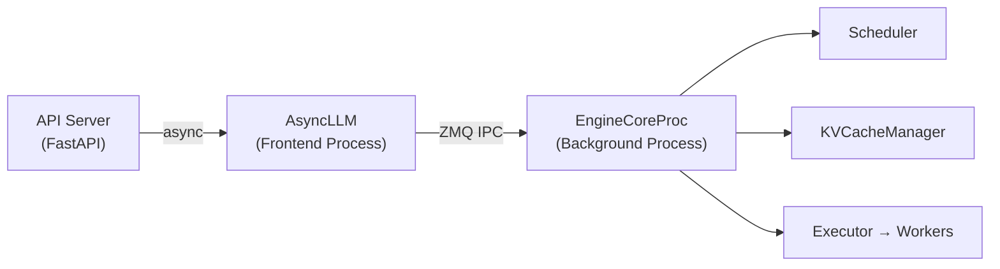

# Overview

vLLM is a high-throughput, memory-efficient inference and serving engine for large language models (LLMs). It was originally developed at UC Berkeley and is now maintained by a broad open-source community. vLLM is designed to make LLM serving fast, flexible, and easy to deploy — from a single GPU on a laptop to a multi-node cluster serving thousands of requests per second.

## Why vLLM?

Running LLMs in production is hard. The two fundamental challenges are:

1. **Memory**: A 70B-parameter model in BF16 requires ~140 GB of GPU memory just for weights. The KV cache for long sequences can easily exceed that.
2. **Throughput**: Autoregressive decoding generates one token per forward pass. Naively batching requests wastes GPU compute because sequences finish at different times, leaving gaps in the batch.

vLLM solves both problems with two core innovations:

### PagedAttention

Inspired by virtual memory and paging in operating systems, **PagedAttention** manages the KV cache as a pool of fixed-size blocks (pages) rather than pre-allocating contiguous memory per sequence. Key benefits:

- **No fragmentation** — blocks are allocated on demand and returned to the pool when a sequence finishes
- **Memory sharing** — sequences with identical prompt prefixes share the same physical KV blocks (prefix caching)
- **High utilization** — GPU memory is used for active KV data, not reserved for worst-case sequence lengths

### Continuous Batching

Traditional static batching waits for a full batch to complete before starting the next. **Continuous batching** (also called iteration-level scheduling) adds new requests to the active batch as soon as a slot opens up — at every scheduling step. This keeps the GPU fully utilized and dramatically reduces average latency.

## Core Design Philosophy

vLLM is built around three principles:

1. **Performance first** — every design decision is evaluated against throughput and latency benchmarks
2. **OpenAI API compatibility** — drop-in replacement for OpenAI's API, enabling easy migration
3. **Extensibility** — pluggable backends for attention, quantization, distributed execution, and model architectures

## The V1 Engine

The V1 engine (`vllm/v1/`) is a complete redesign of vLLM's inference core:

Key improvements over the original engine:

| Feature | V0 Engine | V1 Engine |
|---------|-----------|-----------|
| Process model | Single process | Dual process (frontend + core) |
| IPC | Python queues | ZeroMQ (msgpack) |
| Compilation | Optional | Default (`torch.compile` mode 3) |
| Scheduler | Sequence-level | Token-level (chunked prefill) |
| Output processing | Synchronous | Asynchronous |
| Prefix caching | Optional | Always on |

## Key Features at a Glance

| Feature | Description |
|---------|-------------|
| **PagedAttention** | Block-based KV cache management |
| **Continuous batching** | Iteration-level request scheduling |
| **Prefix caching** | Automatic reuse of common prompt prefixes |
| **Speculative decoding** | EAGLE, Medusa, MTP, n-gram, suffix |
| **Structured output** | JSON Schema, regex, grammar constraints |
| **Multi-LoRA serving** | Multiple adapters per batch |
| **Quantization** | FP8, AWQ, GPTQ, GGUF, MXFP4, BitsAndBytes |
| **Multimodal** | Images, audio, video inputs |
| **Distributed inference** | TP, PP, EP, DP, CP parallelism |
| **OpenAI API** | Drop-in compatible REST API |
| **Anthropic API** | Compatible `/v1/messages` endpoint |
| **gRPC** | High-performance binary protocol |
| **Hardware support** | CUDA, ROCm, XPU, CPU, TPU |

## Performance

vLLM consistently achieves **2–24× higher throughput** than naive HuggingFace Transformers serving, depending on workload characteristics. Key performance levers:

- **Chunked prefill** — interleaves prefill and decode tokens in the same batch, improving GPU utilization
- **`torch.compile`** — piecewise compilation with CUDA graph capture eliminates kernel launch overhead
- **FlashAttention / FlashInfer** — hardware-optimized attention kernels for Ampere, Hopper, and Blackwell
- **Speculative decoding** — up to 3× speedup for low-entropy generation tasks
- **FP8 quantization** — 2× throughput improvement on H100/H200 with near-zero accuracy loss

## Further Reading

- [Getting Started](../02-getting-started/README.md) — install vLLM and run your first inference
- [Architecture Overview](../03-architecture/README.md) — deep dive into the V1 engine internals
- [Supported Models](../04-models/supported-models.md) — 150+ supported model architectures
- [Configuration Reference](../06-configuration/README.md) — all configuration options
- [Benchmarking](../15-benchmarking/README.md) — performance benchmarks and tuning
