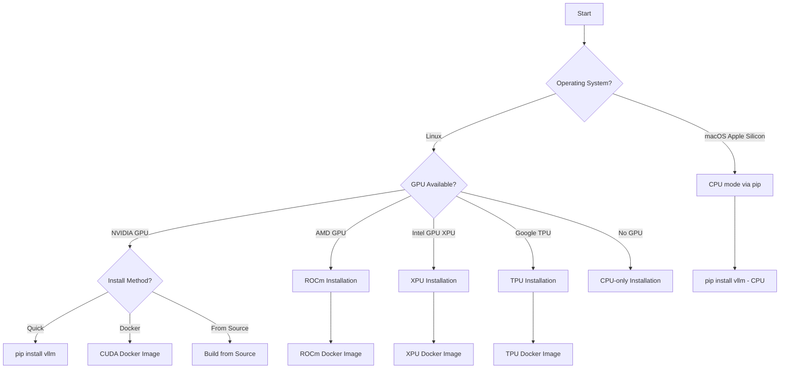

# Installation

vLLM supports multiple hardware backends. Choose the installation path that matches your hardware.

## Installation Decision Tree



## System Requirements

| Requirement | Minimum Version |
|-------------|----------------|
| Python | 3.10 – 3.13 |
| PyTorch | 2.10.0 |
| CUDA (for NVIDIA GPU) | 12.x |
| ROCm (for AMD GPU) | 6.x+ |
| Linux kernel | Any modern kernel |
| macOS | Apple Silicon (arm64) |

> **Note:** vLLM supports Linux (including WSL on Windows) and macOS (Apple Silicon, CPU-only). Windows native is not supported.

---

## CUDA (NVIDIA GPU) — Recommended

The simplest installation for NVIDIA GPUs is a single `pip` command.

### Prerequisites

- Python 3.10–3.13
- NVIDIA GPU with CUDA 12.x drivers installed
- `pip` 23.0+

### Install

```bash
pip install vllm
```

This installs vLLM with:
- **PyTorch 2.10.0** (CUDA build)
- **FlashInfer 0.6.4** (optimized attention kernels)
- **Ray 2.48.0+** (distributed execution)
- All common dependencies from `requirements/common.txt`

### Verify

```bash
python -c "import vllm; print(vllm.__version__)"
```

### CUDA Docker Image

For reproducible deployments, use the official Docker image built on `nvidia/cuda:12.9.1-base-ubuntu22.04`:

```bash
docker pull vllm/vllm-openai:latest

docker run --runtime nvidia --gpus all \
    -p 8000:8000 \
    vllm/vllm-openai:latest \
    --model meta-llama/Llama-3.1-8B-Instruct
```

The Dockerfile (`docker/Dockerfile`) uses a two-stage build:
1. **Build stage** — `nvidia/cuda:12.9.1-devel-ubuntu20.04` compiles CUDA extensions
2. **Final stage** — `nvidia/cuda:12.9.1-base-ubuntu22.04` for a lean runtime image

Build arguments available:

| Argument | Default | Description |
|----------|---------|-------------|
| `CUDA_VERSION` | `12.9.1` | CUDA toolkit version |
| `PYTHON_VERSION` | `3.12` | Python version |
| `PYTORCH_NIGHTLY` | (unset) | Set to `1` for nightly PyTorch |
| `max_jobs` | `2` | Parallel build jobs |
| `nvcc_threads` | `8` | NVCC compiler threads |

Build a custom image:

```bash
docker buildx build \
  --build-arg CUDA_VERSION=12.9.1 \
  --build-arg PYTHON_VERSION=3.12 \
  --build-arg max_jobs=8 \
  -f docker/Dockerfile \
  -t my-vllm:latest .
```

---

## ROCm (AMD GPU)

vLLM supports AMD GPUs via ROCm. The recommended approach is the pre-built Docker image.

### Supported AMD GPU Architectures

| Architecture | GPU Family |
|-------------|------------|
| `gfx906` | Radeon VII, Instinct MI50 |
| `gfx908` | Instinct MI100 |
| `gfx90a` | Instinct MI200 series |
| `gfx942` | Instinct MI300X |
| `gfx950` | Instinct MI350X |
| `gfx1030` | RX 6800 XT |
| `gfx1100` | RX 7900 XTX |
| `gfx1101` | RX 7700 XT |
| `gfx1200` / `gfx1201` | RX 9000 series |
| `gfx1150` / `gfx1151` | Radeon AI PRO |

### ROCm Docker Image

```bash
docker pull rocm/vllm:latest

docker run --device=/dev/kfd --device=/dev/dri \
    --group-add video \
    --cap-add=SYS_PTRACE \
    --security-opt seccomp=unconfined \
    -p 8000:8000 \
    rocm/vllm:latest \
    --model meta-llama/Llama-3.1-8B-Instruct
```

### Build ROCm Image from Source

The `docker/Dockerfile.rocm` uses `rocm/vllm-dev:base` as its base image (which is itself built from `docker/Dockerfile.rocm_base` on top of `rocm/dev-ubuntu-22.04:7.0-complete`).

```bash
# Build the base image first (optional, if you need a custom ROCm base)
docker build -f docker/Dockerfile.rocm_base -t rocm/vllm-dev:base .

# Build the vLLM ROCm image
docker build -f docker/Dockerfile.rocm -t vllm-rocm:latest .
```

Build arguments:

| Argument | Default | Description |
|----------|---------|-------------|
| `BASE_IMAGE` | `rocm/vllm-dev:base` | Base ROCm image |
| `ARG_PYTORCH_ROCM_ARCH` | `gfx90a;gfx942;gfx950;gfx1100;gfx1101;gfx1200;gfx1201;gfx1150;gfx1151` | Target GPU architectures |
| `REMOTE_VLLM` | `0` | Set to `1` to clone from GitHub instead of local source |
| `VLLM_REPO` | `https://github.com/vllm-project/vllm.git` | vLLM repository URL |
| `VLLM_BRANCH` | `main` | Branch to build |

### Install ROCm Dependencies Manually

If building outside Docker, install from `requirements/rocm.txt`:

```bash
pip install -r requirements/rocm.txt
VLLM_TARGET_DEVICE=rocm python setup.py bdist_wheel
pip install dist/*.whl
```

Key ROCm-specific packages from `requirements/rocm.txt`:

```
ray[cgraph]>=2.48.0
numba==0.61.2
datasets
peft
tensorizer==2.10.1
conch-triton-kernels==1.2.1
timm>=1.0.17
amd-quark>=0.8.99
```

---

## CPU-only Installation

vLLM can run on CPU without any GPU. This supports x86_64, aarch64 (ARM), s390x, and ppc64le architectures, as well as macOS Apple Silicon.

### Install from PyPI (CPU)

```bash
pip install vllm --extra-index-url https://download.pytorch.org/whl/cpu
```

Or install dependencies manually:

```bash
pip install -r requirements/cpu.txt
VLLM_TARGET_DEVICE=cpu pip install -e . --no-build-isolation
```

The CPU build uses:
- `torch==2.10.0+cpu` on x86_64 and s390x
- `torch==2.10.0` on aarch64, macOS, and ppc64le
- `intel-openmp==2024.2.1` on x86_64 for performance
- `py-cpuinfo` on aarch64 for ARM Neoverse core optimization

### CPU Docker Image

The `docker/Dockerfile.cpu` supports both `linux/amd64` and `linux/arm64`:

```bash
# Build for x86_64
docker buildx build --platform=linux/amd64 \
  -f docker/Dockerfile.cpu \
  -t vllm-cpu:latest .

# Build for ARM64
docker buildx build --platform=linux/arm64 \
  -f docker/Dockerfile.cpu \
  -t vllm-cpu-arm64:latest .
```

CPU build arguments:

| Argument | Default | Description |
|----------|---------|-------------|
| `PYTHON_VERSION` | `3.12` | Python version (3.10–3.13) |
| `VLLM_CPU_DISABLE_AVX512` | `false` | Disable AVX-512 instructions |
| `VLLM_CPU_AVX2` | `false` | Enable AVX2 (cross-compilation) |
| `VLLM_CPU_AVX512` | `false` | Enable AVX-512 (cross-compilation) |
| `VLLM_CPU_AVX512BF16` | `false` | Enable AVX-512 BF16 |
| `VLLM_CPU_AVX512VNNI` | `false` | Enable AVX-512 VNNI |
| `VLLM_CPU_AMXBF16` | `true` | Enable AMX BF16 (Intel Sapphire Rapids+) |
| `VLLM_CPU_ARM_BF16` | `false` | Enable ARM BF16 (cross-compilation) |

Example — build without AVX-512 for older CPUs:

```bash
docker buildx build --platform=linux/amd64 \
  --build-arg VLLM_CPU_DISABLE_AVX512=true \
  -f docker/Dockerfile.cpu \
  -t vllm-cpu-noavx512:latest .
```

> **Note:** AVX-512 flags (AVX2, AVX512, etc.) cannot be mixed with ARM flags. The build validates this automatically.

---

## TPU (Google Cloud TPU)

vLLM supports Google Cloud TPUs via PyTorch/XLA.

### TPU Docker Image

The `docker/Dockerfile.tpu` is based on the official PyTorch/XLA TPU VM image:

```bash
docker build \
  --build-arg NIGHTLY_DATE=20250730 \
  -f docker/Dockerfile.tpu \
  -t vllm-tpu:latest .
```

The base image is `us-central1-docker.pkg.dev/tpu-pytorch-releases/docker/xla:nightly_3.12_tpuvm_<DATE>`.

### Manual TPU Installation

```bash
# Set the target device
export VLLM_TARGET_DEVICE=tpu

# Install TPU dependencies
pip install -r requirements/tpu.txt

# Install vLLM
pip install -e .
```

Key packages from `requirements/tpu.txt`:

```
cmake>=3.26.1
ray[default]
ray[data]
nixl==0.3.0
tpu-inference==0.12.0
```

> **Important:** The TPU Dockerfile explicitly uninstalls the base image's `torch`, `torch_xla`, and `torchvision` before reinstalling from `requirements/tpu.txt` to ensure version consistency.

---

## XPU (Intel GPU)

vLLM supports Intel discrete GPUs (Arc, Flex, Max series) via Intel Extension for PyTorch (IPEX).

### XPU Docker Image

The `docker/Dockerfile.xpu` is based on `intel/deep-learning-essentials:2025.3.2-0-devel-ubuntu24.04`:

```bash
docker build \
  -f docker/Dockerfile.xpu \
  -t vllm-xpu:latest .
```

### Manual XPU Installation

```bash
# Install XPU dependencies (includes PyTorch XPU build)
pip install -r requirements/xpu.txt \
  --extra-index-url https://download.pytorch.org/whl/xpu

# Set target device and build
export VLLM_TARGET_DEVICE=xpu
pip install --no-build-isolation .
```

Key packages from `requirements/xpu.txt`:

```
torch==2.10.0+xpu
torchaudio
torchvision
vllm_xpu_kernels @ https://github.com/vllm-project/vllm-xpu-kernels/releases/download/v0.1.3/vllm_xpu_kernels-0.1.3-cp38-abi3-linux_x86_64.whl
ray>=2.9
numba==0.61.2
```

The XPU build also requires Intel oneAPI components:
- **Intel oneAPI DPC++ Compiler** (`intel-oneapi-compiler-dpcpp-cpp-2025.3`)
- **Intel oneCCL** (`2021.15.7`) for collective communications
- **Intel GPU UMD** (User Mode Driver) for compute runtime

> **Note:** The XPU Dockerfile sets `ENV VLLM_WORKER_MULTIPROC_METHOD=spawn` which is required for Intel GPU multi-process support.

---

## macOS (Apple Silicon)

vLLM runs on macOS Apple Silicon (M1/M2/M3/M4) in CPU mode. GPU acceleration is not available on macOS.

### Install on macOS

```bash
# Create a virtual environment
uv venv
source .venv/bin/activate

# Install CPU build dependencies
uv pip install -r requirements/cpu-build.txt --index-strategy unsafe-best-match

# Install runtime dependencies
uv pip install -r requirements/cpu.txt --index-strategy unsafe-best-match

# Build and install vLLM (CPU mode is auto-detected on macOS)
CMAKE_BUILD_PARALLEL_LEVEL=4 uv pip install -e . --no-build-isolation
```

> **Note:** `setup.py` automatically sets `VLLM_TARGET_DEVICE=cpu` when running on macOS, regardless of any environment variable setting.

### Verify macOS Installation

```bash
python -c "import vllm; print(f'vLLM version: {vllm.__version__}')"
```

### macOS Smoke Test

The CI workflow (`.github/workflows/macos-smoke-test.yml`) validates macOS installations by:

1. Installing with `uv` and Python 3.12
2. Running `vllm serve Qwen/Qwen3-0.6B --max-model-len=2K --load-format=dummy --enforce-eager`
3. Polling `http://localhost:8000/health` until the server is ready
4. Sending a test completion request

The macOS build uses `torch==2.10.0` (standard, not `+cpu` variant) since the ARM build of PyTorch already targets Apple Silicon.

---

## Build from Source

Building from source gives you the latest code and allows customization of CUDA architectures.

### Prerequisites

```bash
pip install -r requirements/build.txt
```

Build dependencies include:
- `cmake>=3.26.1`
- `ninja`
- `torch==2.10.0`
- `setuptools>=77.0.3,<81.0.0`
- `grpcio-tools==1.78.0`

### Using pip (Recommended)

```bash
git clone https://github.com/vllm-project/vllm.git
cd vllm

# For CUDA (auto-detected)
pip install -e . --no-build-isolation

# For CPU
VLLM_TARGET_DEVICE=cpu pip install -e . --no-build-isolation

# For ROCm
VLLM_TARGET_DEVICE=rocm pip install -e . --no-build-isolation

# For TPU
VLLM_TARGET_DEVICE=tpu pip install -e . --no-build-isolation

# For XPU
VLLM_TARGET_DEVICE=xpu pip install -e . --no-build-isolation
```

### Using CMake Directly

For fine-grained control over the build, use CMake directly:

```bash
mkdir build && cd build

cmake -G Ninja \
  -DVLLM_PYTHON_EXECUTABLE=$(which python3) \
  -DVLLM_TARGET_DEVICE=cuda \
  -DCMAKE_INSTALL_PREFIX=.. \
  ..

cmake --build . --target install
```

To build only a specific extension:

```bash
cmake --build . --target _C
cmake --install . --component _C
```

### `VLLM_TARGET_DEVICE` Environment Variable

The `VLLM_TARGET_DEVICE` environment variable controls which backend is compiled:

| Value | Backend | Notes |
|-------|---------|-------|
| `cuda` | NVIDIA GPU | Default on Linux with CUDA |
| `rocm` | AMD GPU | Auto-detected when ROCm PyTorch is installed |
| `cpu` | CPU only | Required for CPU-only builds; auto-set on macOS |
| `tpu` | Google TPU | Must be set explicitly |
| `xpu` | Intel GPU | Must be set explicitly |
| `empty` | No extensions | Used for pure Python installs |

**Auto-detection logic** (from `setup.py`):
- macOS → always `cpu`
- Linux with ROCm PyTorch → `rocm`
- Linux with CUDA PyTorch → `cuda`
- Linux with CPU PyTorch → `cpu`

### Supported CUDA Architectures

The build system automatically selects CUDA architectures based on the CUDA compiler version:

| CUDA Version | Supported Compute Capabilities |
|-------------|-------------------------------|
| ≥ 13.0 | 7.5, 8.0, 8.6, 8.7, 8.9, 9.0, 10.0, 11.0, 12.0 |
| ≥ 12.8 | 7.0, 7.2, 7.5, 8.0, 8.6, 8.7, 8.9, 9.0, 10.0, 10.1, 12.0 |
| < 12.8 | 7.0, 7.2, 7.5, 8.0, 8.6, 8.7, 8.9, 9.0 |

To target specific architectures, set `TORCH_CUDA_ARCH_LIST`:

```bash
TORCH_CUDA_ARCH_LIST="8.0 8.9 9.0" pip install -e . --no-build-isolation
```

### Build Performance Tips

- Set `MAX_JOBS` to use parallel compilation: `MAX_JOBS=8 pip install -e .`
- Use `ccache` or `sccache` to cache compiled objects across builds
- The CPU Dockerfile uses `CMAKE_CXX_COMPILER_LAUNCHER=ccache` by default

---

## Next Steps

- [Quickstart Guide](quickstart.md) — Run your first inference
- [Configuration Reference](../06-configuration/README.md) — Engine and server options
- [Hardware Support](../09-hardware/README.md) — Platform-specific tuning
