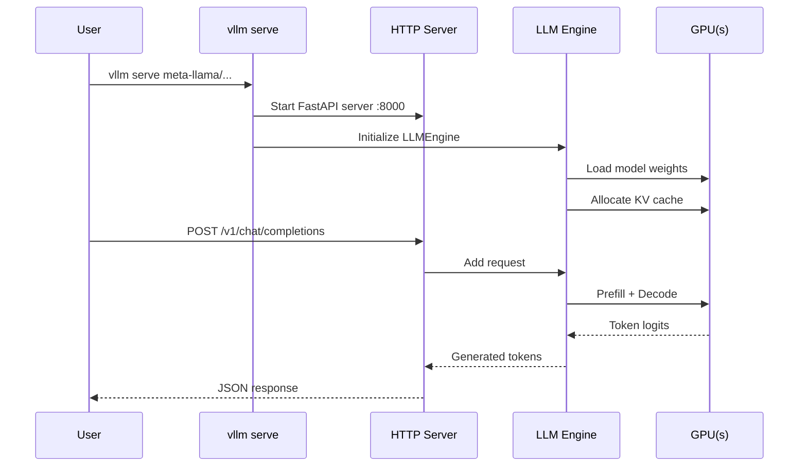

# Quickstart

Get up and running with vLLM in minutes. This guide covers offline batch inference with the `LLM` class, launching the OpenAI-compatible API server with `vllm serve`, and making your first API call.

## Prerequisites

Make sure vLLM is installed before proceeding. See the [Installation Guide](installation.md) for platform-specific instructions.

```bash
pip install vllm
```

Verify the installation:

```bash
python -c "import vllm; print(vllm.__version__)"
```

---

## Offline Inference with the `LLM` Class

The `LLM` class is the primary interface for **offline batch inference** — processing a fixed set of prompts without a running server. It handles tokenization, batching, memory management, and KV cache allocation automatically.

### Basic Text Generation

```python
from vllm import LLM, SamplingParams

# Initialize the model (downloads from HuggingFace if not cached)
llm = LLM(model="Qwen/Qwen3-0.6B")

# Define sampling parameters
sampling_params = SamplingParams(
    temperature=0.8,
    top_p=0.95,
    max_tokens=256,
)

# Run batch inference
prompts = [
    "The future of artificial intelligence is",
    "Once upon a time in a land far away,",
    "The key to writing good code is",
]

outputs = llm.generate(prompts, sampling_params)

# Print results
for output in outputs:
    prompt = output.prompt
    generated_text = output.outputs[0].text
    print(f"Prompt: {prompt!r}")
    print(f"Generated: {generated_text!r}")
    print("-" * 50)
```

> **Tip:** Pass all prompts in a single list for best performance. vLLM automatically batches them together to maximize GPU utilization.

### Key `LLM` Constructor Parameters

| Parameter | Default | Description |
|-----------|---------|-------------|
| `model` | `"Qwen/Qwen3-0.6B"` | HuggingFace model name or local path |
| `tensor_parallel_size` | `1` | Number of GPUs for tensor parallelism |
| `dtype` | `"auto"` | Model weight dtype (`float16`, `bfloat16`, `float32`) |
| `quantization` | `None` | Quantization method (`awq`, `gptq`, `fp8`) |
| `gpu_memory_utilization` | `0.9` | Fraction of GPU memory to use for KV cache |
| `max_model_len` | (from config) | Maximum sequence length |
| `enforce_eager` | `False` | Disable CUDA graphs (useful for debugging) |
| `trust_remote_code` | `False` | Allow custom model code from HuggingFace |

### `SamplingParams` Reference

| Parameter | Default | Description |
|-----------|---------|-------------|
| `temperature` | `1.0` | Sampling temperature (0 = greedy) |
| `top_p` | `1.0` | Nucleus sampling probability |
| `top_k` | `0` | Top-K sampling (0 = disabled) |
| `max_tokens` | `16` | Maximum tokens to generate |
| `n` | `1` | Number of completions per prompt |
| `stop` | `None` | Stop strings |
| `seed` | `None` | Random seed for reproducibility |
| `presence_penalty` | `0.0` | Penalize repeated tokens |
| `frequency_penalty` | `0.0` | Penalize frequent tokens |

### Chat Inference

For instruction-tuned models, use the `chat` method with a conversation format:

```python
from vllm import LLM, SamplingParams

llm = LLM(model="Qwen/Qwen3-0.6B")

# Chat-style conversation
messages = [
    {"role": "system", "content": "You are a helpful assistant."},
    {"role": "user", "content": "What is the capital of France?"},
]

outputs = llm.chat(messages)
print(outputs[0].outputs[0].text)
```

### Multi-GPU Inference

Scale to multiple GPUs with tensor parallelism:

```python
from vllm import LLM, SamplingParams

# Use 4 GPUs with tensor parallelism
llm = LLM(
    model="meta-llama/Llama-3.1-70B-Instruct",
    tensor_parallel_size=4,
    dtype="bfloat16",
)

sampling_params = SamplingParams(temperature=0.7, max_tokens=512)
outputs = llm.generate(["Explain quantum computing in simple terms"], sampling_params)
print(outputs[0].outputs[0].text)
```

### Greedy Decoding (Deterministic)

For deterministic outputs, set `temperature=0`:

```python
from vllm import LLM, SamplingParams

llm = LLM(model="Qwen/Qwen3-0.6B")
sampling_params = SamplingParams(temperature=0.0, max_tokens=100)

outputs = llm.generate(["The speed of light is"], sampling_params)
print(outputs[0].outputs[0].text)
```

### Multiple Completions per Prompt

Generate multiple independent completions for the same prompt:

```python
from vllm import LLM, SamplingParams

llm = LLM(model="Qwen/Qwen3-0.6B")
sampling_params = SamplingParams(
    n=3,           # Generate 3 completions
    temperature=0.9,
    max_tokens=50,
)

outputs = llm.generate(["Write a haiku about the ocean"], sampling_params)
for i, completion in enumerate(outputs[0].outputs):
    print(f"Completion {i+1}: {completion.text}")
```

### Understanding `RequestOutput`

The `generate()` method returns a list of `RequestOutput` objects:

```python
output = outputs[0]
print(output.prompt)              # The input prompt
print(output.outputs[0].text)     # Generated text
print(output.outputs[0].finish_reason)  # "stop", "length", etc.
print(output.outputs[0].token_ids)      # Token IDs of generated text
```

---

## Online Serving with `vllm serve`

`vllm serve` launches an OpenAI-compatible HTTP server. This is the recommended approach for production deployments and integrating with existing OpenAI-compatible clients.

### Start the Server

```bash
# Serve the default model (Qwen/Qwen3-0.6B)
vllm serve

# Serve a specific model
vllm serve meta-llama/Llama-3.1-8B-Instruct

# Serve with custom options
vllm serve meta-llama/Llama-3.1-8B-Instruct \
  --port 8000 \
  --tensor-parallel-size 2 \
  --dtype bfloat16 \
  --max-model-len 8192 \
  --gpu-memory-utilization 0.9
```

The server starts on `http://localhost:8000` by default.

### Common `vllm serve` Options

| Option | Default | Description |
|--------|---------|-------------|
| `--port` | `8000` | HTTP server port |
| `--host` | `0.0.0.0` | Bind address |
| `--tensor-parallel-size` | `1` | Number of GPUs |
| `--dtype` | `auto` | Model dtype |
| `--max-model-len` | (from config) | Max context length |
| `--gpu-memory-utilization` | `0.9` | GPU memory fraction |
| `--enforce-eager` | `False` | Disable CUDA graphs |
| `--api-key` | (none) | Require API key authentication |
| `--served-model-name` | (model name) | Override model name in API |
| `--load-format` | `auto` | Weight loading format |

> **Tip:** Use `vllm serve --help=all` to see all available options, or `vllm serve --help=ModelConfig` to explore options by section.

### Check Server Health

```bash
curl http://localhost:8000/health
```

### List Available Models

```bash
curl http://localhost:8000/v1/models
```

---

## Making Your First API Call

Once the server is running, you can interact with it using any OpenAI-compatible client.

### Using `curl`

**Chat Completion:**

```bash
curl http://localhost:8000/v1/chat/completions \
  -H "Content-Type: application/json" \
  -d '{
    "model": "meta-llama/Llama-3.1-8B-Instruct",
    "messages": [
      {"role": "system", "content": "You are a helpful assistant."},
      {"role": "user", "content": "What is the capital of France?"}
    ],
    "max_tokens": 100,
    "temperature": 0.7
  }'
```

**Text Completion:**

```bash
curl http://localhost:8000/v1/completions \
  -H "Content-Type: application/json" \
  -d '{
    "model": "meta-llama/Llama-3.1-8B-Instruct",
    "prompt": "The Eiffel Tower is located in",
    "max_tokens": 50,
    "temperature": 0.0
  }'
```

### Using the OpenAI Python Client

Install the OpenAI client:

```bash
pip install openai
```

**Chat Completion:**

```python
from openai import OpenAI

# Point the client to your vLLM server
client = OpenAI(
    api_key="EMPTY",          # vLLM doesn't require a real key by default
    base_url="http://localhost:8000/v1",
)

# List available models
models = client.models.list()
model_id = models.data[0].id
print(f"Using model: {model_id}")

# Chat completion
response = client.chat.completions.create(
    model=model_id,
    messages=[
        {"role": "system", "content": "You are a helpful assistant."},
        {"role": "user", "content": "Explain the concept of attention in transformers."},
    ],
    max_tokens=256,
    temperature=0.7,
)

print(response.choices[0].message.content)
```

**Streaming Chat Completion:**

```python
from openai import OpenAI

client = OpenAI(
    api_key="EMPTY",
    base_url="http://localhost:8000/v1",
)

# Stream the response token by token
stream = client.chat.completions.create(
    model="meta-llama/Llama-3.1-8B-Instruct",
    messages=[
        {"role": "user", "content": "Write a short poem about the sea."},
    ],
    max_tokens=200,
    stream=True,
)

for chunk in stream:
    if chunk.choices[0].delta.content is not None:
        print(chunk.choices[0].delta.content, end="", flush=True)
print()  # newline at end
```

**Text Completion:**

```python
from openai import OpenAI

client = OpenAI(
    api_key="EMPTY",
    base_url="http://localhost:8000/v1",
)

completion = client.completions.create(
    model="meta-llama/Llama-3.1-8B-Instruct",
    prompt="A robot may not injure a human being",
    max_tokens=50,
    temperature=0.0,
    n=2,  # Generate 2 completions
)

for choice in completion.choices:
    print(f"Choice {choice.index}: {choice.text}")
```

---

## End-to-End Flow



---

## Quick Reference

### Offline Inference

```python
from vllm import LLM, SamplingParams

llm = LLM(model="Qwen/Qwen3-0.6B")
params = SamplingParams(temperature=0.8, max_tokens=256)
outputs = llm.generate(["Your prompt here"], params)
print(outputs[0].outputs[0].text)
```

### Online Serving

```bash
# Terminal 1: Start server
vllm serve Qwen/Qwen3-0.6B

# Terminal 2: Make a request
curl http://localhost:8000/v1/chat/completions \
  -H "Content-Type: application/json" \
  -d '{"model": "Qwen/Qwen3-0.6B", "messages": [{"role": "user", "content": "Hello!"}]}'
```

---

## Next Steps

- [Installation Guide](installation.md) — Platform-specific installation (ROCm, CPU, TPU, XPU)
- [Configuration Reference](../06-configuration/README.md) — All engine and server options
- [Models](../04-models/README.md) — Supported model architectures
- [Distributed Inference](../07-distributed/README.md) — Multi-GPU and multi-node setups
- [Features](../08-features/README.md) — Quantization, LoRA, prefix caching, and more
