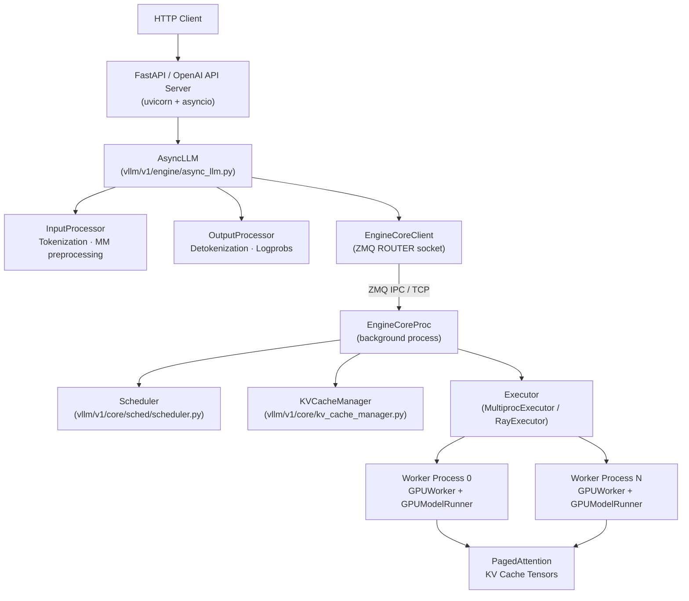
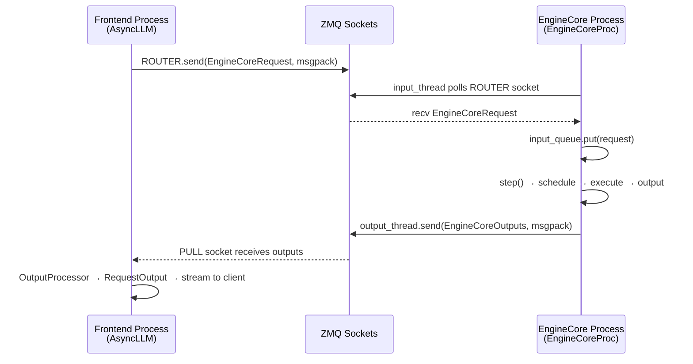
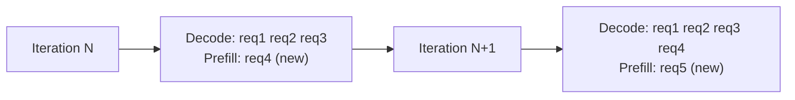
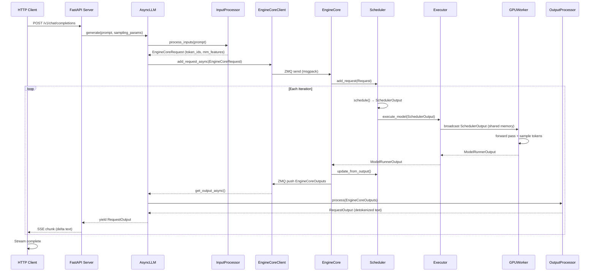
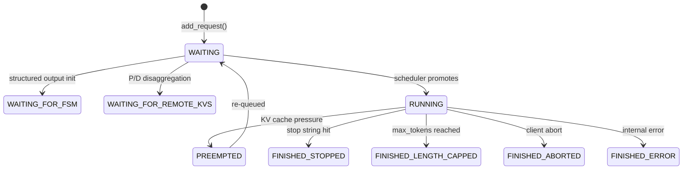
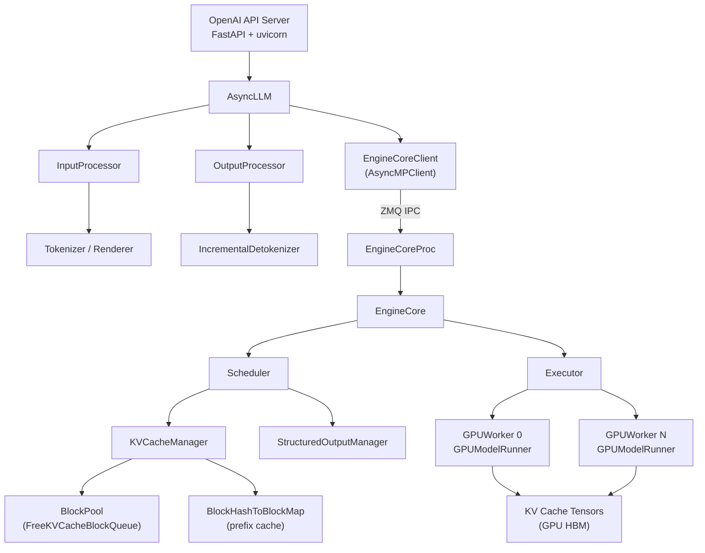

# Architecture Overview

vLLM is a high-throughput, memory-efficient inference engine for large language models. Its V1 engine redesign introduces a clean separation between the API-facing frontend process and the compute-intensive engine core process, connected via ZMQ-based inter-process communication. This page provides a comprehensive tour of every major subsystem.

## System Layers



The stack has four logical tiers:

| Tier | Components | Location |
|------|-----------|----------|
| **API Layer** | FastAPI server, OpenAI-compatible routes | `vllm/entrypoints/openai/` |
| **Frontend Engine** | `AsyncLLM`, `InputProcessor`, `OutputProcessor` | `vllm/v1/engine/` |
| **Engine Core** | `EngineCore`, `Scheduler`, `KVCacheManager` | `vllm/v1/engine/core.py`, `vllm/v1/core/` |
| **Execution Layer** | `Executor`, `GPUWorker`, `GPUModelRunner` | `vllm/v1/executor/`, `vllm/v1/worker/` |

---

## V1 Engine Pipeline

### AsyncLLM → EngineCoreClient → EngineCore → Executor → Worker

The V1 engine separates concerns across two OS processes:

**Process 0 — API / Frontend Process**

`AsyncLLM` (`vllm/v1/engine/async_llm.py`) is the top-level engine object exposed to the API server. It owns:

- **`InputProcessor`** — converts raw `PromptType` inputs (text, token IDs, multimodal data) into serialisable `EngineCoreRequest` structs. Handles tokenisation, multimodal preprocessing, and sampling-parameter validation.
- **`OutputProcessor`** — converts `EngineCoreOutputs` received from the core back into `RequestOutput` objects. Runs incremental detokenisation and logprob assembly.
- **`EngineCoreClient`** — the ZMQ client that sends requests to and receives outputs from the background `EngineCoreProc`. Three concrete implementations exist:
  - `InprocClient` — in-process (used by the synchronous `LLM` class).
  - `SyncMPClient` — ZMQ + background process, synchronous (used by offline batch inference).
  - `AsyncMPClient` — ZMQ + background process, asyncio (used by `AsyncLLM` / the API server).

```python
# Simplified construction in AsyncLLM.__init__
self.input_processor = InputProcessor(self.vllm_config, renderer)
self.output_processor = OutputProcessor(renderer.tokenizer, ...)
self.engine_core = EngineCoreClient.make_async_mp_client(
    vllm_config=vllm_config,
    executor_class=executor_class,
    log_stats=self.log_stats,
)
```

**Process 1 — Engine Core Process**

`EngineCoreProc` (`vllm/v1/engine/core.py`) runs in a dedicated background process. It subclasses `EngineCore` and adds ZMQ socket threads:

- An **input thread** reads `EngineCoreRequest` messages from the ZMQ ROUTER socket and places them on an internal `queue.Queue`.
- An **output thread** drains the output queue and pushes `EngineCoreOutputs` back to the frontend via a ZMQ PULL/PUSH socket pair.
- The **main loop** (`core_busy_loop`) alternates between draining the input queue and calling `step()`.

```python
class EngineCoreProc(EngineCore):
    """ZMQ-wrapper for running EngineCore in background process."""
    ENGINE_CORE_DEAD = b"ENGINE_CORE_DEAD"
```

**`EngineCore.step()`** is the heart of the engine:

```python
def step(self) -> tuple[dict[int, EngineCoreOutputs], bool]:
    if not self.scheduler.has_requests():
        return {}, False
    scheduler_output = self.scheduler.schedule()
    future = self.model_executor.execute_model(scheduler_output, non_block=True)
    grammar_output = self.scheduler.get_grammar_bitmask(scheduler_output)
    model_output = future.result()
    self._process_aborts_queue()
    engine_core_outputs = self.scheduler.update_from_output(
        scheduler_output, model_output
    )
    return engine_core_outputs, scheduler_output.total_num_scheduled_tokens > 0
```

Each call to `step()` schedules a batch, dispatches it to the executor, waits for the result, and updates the scheduler state — all in a tight loop.

### Executor and Workers

The `Executor` (`vllm/v1/executor/abstract.py`) is the bridge between the scheduler and the actual GPU workers. `Executor.get_class()` selects the implementation based on `distributed_executor_backend`:

| Backend | Class | Use Case |
|---------|-------|----------|
| `"mp"` | `MultiprocExecutor` | Multi-GPU on a single node |
| `"ray"` | `RayDistributedExecutor` | Multi-node distributed |
| `"uni"` | `UniProcExecutor` | Single GPU, no subprocess |
| `"external_launcher"` | `ExecutorWithExternalLauncher` | External process management |

`MultiprocExecutor` spawns one `WorkerProc` per GPU rank. Workers communicate via a shared-memory `MessageQueue` (for `SchedulerOutput` broadcast) and a per-worker response queue (for `ModelRunnerOutput`). The executor uses `concurrent.futures.Future` objects so the engine core can overlap scheduling with GPU execution.

Each `GPUWorker` (`vllm/v1/worker/gpu_worker.py`) owns a `GPUModelRunner` that:
1. Prepares input tensors from the `SchedulerOutput`.
2. Runs the model forward pass (with optional CUDA graph capture).
3. Samples tokens.
4. Returns a `ModelRunnerOutput`.

---

## ZMQ-Based IPC

The frontend process and the engine core process communicate exclusively through **ZeroMQ** sockets. This design lets the asyncio event loop in the frontend remain non-blocking while the engine core runs a tight synchronous loop.



**Socket topology** (from `vllm/v1/engine/utils.py`):

```python
@dataclass
class EngineZmqAddresses:
    inputs: list[str]       # ZMQ ROUTER — frontend sends requests here
    outputs: list[str]      # ZMQ PULL  — frontend receives outputs here
    coordinator_input: str | None   # DP coordinator input
    coordinator_output: str | None  # DP coordinator output
    frontend_stats_publish_address: str | None
```

- **Requests** flow over a `zmq.ROUTER` socket (frontend binds, engine connects). The ROUTER socket preserves the sender identity so the engine can route responses back to the correct frontend client in multi-frontend deployments.
- **Outputs** flow over a `zmq.PULL` socket (frontend binds, engine pushes). This is a one-way push channel.
- **Serialisation** uses `msgspec.msgpack` with custom encoders/decoders (`MsgpackEncoder` / `MsgpackDecoder` in `vllm/v1/serial_utils.py`) that handle PyTorch tensors, NumPy arrays, and multimodal feature specs efficiently.

**Startup handshake**: When `EngineCoreProc` starts, it connects to a temporary handshake address, sends its ZMQ identity, and waits to receive the `EngineZmqAddresses` it should use. The frontend waits for a ready message from every engine before accepting requests. This ensures the engine is fully initialised (weights loaded, KV cache allocated) before traffic flows.

---

## PagedAttention: Block-Based KV Cache

vLLM implements **PagedAttention**, which manages the KV cache as a pool of fixed-size blocks (pages) rather than pre-allocating contiguous memory per sequence. This eliminates internal fragmentation and enables flexible memory sharing.

### Block Pool

`BlockPool` (`vllm/v1/core/block_pool.py`) maintains the global inventory of `KVCacheBlock` objects:

```python
@dataclass(slots=True)
class KVCacheBlock:
    block_id: int          # Index into the physical KV tensor
    ref_cnt: int = 0       # Reference count (shared blocks have ref_cnt > 1)
    _block_hash: BlockHashWithGroupId | None = None  # Set when block is full
    prev_free_block: "KVCacheBlock | None" = None
    next_free_block: "KVCacheBlock | None" = None
    is_null: bool = False  # Null/padding block
```

Free blocks are organised in a **doubly-linked LRU list** (`FreeKVCacheBlockQueue`). When a block is freed, it is appended to the tail; eviction candidates are taken from the head. This O(1) eviction policy ensures that the least-recently-used blocks are reclaimed first.

### KV Cache Specs

Each attention layer type has a corresponding `KVCacheSpec` (`vllm/v1/kv_cache_interface.py`):

| Spec Class | Description |
|-----------|-------------|
| `FullAttentionSpec` | Standard full-context attention |
| `SlidingWindowSpec` | Sliding-window attention |
| `MLAAttentionSpec` | Multi-head Latent Attention (DeepSeek) |
| `MambaSpec` | Mamba SSM state cache |
| `ChunkedLocalAttentionSpec` | Chunked local attention |

The page size in bytes is computed as:

```python
@property
def real_page_size_bytes(self) -> int:
    return (
        2                    # K and V
        * self.block_size    # tokens per block
        * self.num_kv_heads
        * self.head_size
        * get_dtype_size(self.dtype)
    )
```

### Prefix Caching

When `enable_prefix_caching=True`, completed blocks are hashed and stored in a `BlockHashToBlockMap`. On a new request, the scheduler walks the request's token sequence block-by-block and looks up each block hash. Matching blocks are reused without recomputation.

Block hashes are computed as a **chain**: each block's hash depends on the previous block's hash plus the token IDs in the current block. This ensures that two sequences sharing a common prefix will produce identical hashes for all shared blocks.

```python
# BlockHash is a NewType wrapping bytes
BlockHash = NewType("BlockHash", bytes)
# BlockHashWithGroupId packs hash + KV cache group id
BlockHashWithGroupId = NewType("BlockHashWithGroupId", bytes)
```

The hash algorithm is configurable via `cache_config.prefix_caching_hash_algo` (supports `sha256_cbor`, `xxhash_cbor`, and others). A special `NONE_HASH` seed (randomly initialised or from `PYTHONHASHSEED`) anchors the chain.

---

## Continuous Batching

vLLM uses **continuous batching** (also called iteration-level scheduling): instead of waiting for an entire batch to finish before accepting new requests, the scheduler re-evaluates which requests to run on every iteration.

### How It Works

On each call to `Scheduler.schedule()`:

1. **Running requests** (those already generating tokens) are checked for completion. Finished requests are removed; their KV cache blocks are freed.
2. **Waiting requests** are promoted to running if there is sufficient KV cache space and token budget.
3. The scheduler produces a `SchedulerOutput` describing exactly which tokens each request should process this step.

This means a newly arrived request can be scheduled on the very next iteration, even while other requests are mid-generation. The result is high GPU utilisation and low time-to-first-token for new arrivals.

### Prefill and Decode Interleaving

In V1, prefill (processing the prompt) and decode (generating one token at a time) are handled in the same batch. The scheduler tracks `num_computed_tokens` per request:

- A request with `num_computed_tokens < num_prompt_tokens` is in **prefill** phase.
- A request with `num_computed_tokens >= num_prompt_tokens` is in **decode** phase.

Both phases coexist in a single forward pass. The attention kernel distinguishes them via the `SchedulerOutput` metadata (query lengths, context lengths, block tables).



---

## Chunked Prefill

For very long prompts, processing all tokens in a single step would monopolise the GPU and starve decode requests. **Chunked prefill** splits a long prompt across multiple scheduler steps.

When `enable_chunked_prefill=True` (the default for most configurations), the scheduler limits the number of new tokens per request per step using `max_num_scheduled_tokens`:

```python
num_new_tokens = request.num_tokens - num_computed_tokens
threshold = self.scheduler_config.long_prefill_token_threshold
if 0 < threshold < num_new_tokens:
    num_new_tokens = threshold

num_new_tokens = min(num_new_tokens, token_budget)
```

A request in chunked prefill is scheduled repeatedly, each time processing the next chunk of its prompt, until `num_computed_tokens == num_prompt_tokens`. Only then does it transition to decode.

**Benefits:**
- Decode requests continue to make progress even when large prompts are being processed.
- GPU memory pressure is smoothed out — fewer tokens are allocated at once.
- Time-to-first-token for decode requests is bounded regardless of concurrent prefill sizes.

> **Note:** Chunked prefill is automatically disabled for encoder-only models (pooling tasks) that have no KV cache, since they process the entire input in one pass.

---

## Request Lifecycle

The following sequence diagram traces a single request from HTTP arrival to the final streamed token.



### Request Status Transitions



The `RequestStatus` enum (`vllm/v1/request.py`) defines all states. Any status value greater than `PREEMPTED` is considered a terminal (finished) state.

---

## Plugin System

vLLM uses Python **entry points** (PEP 451) to discover and load plugins without modifying core code. The plugin loader lives in `vllm/plugins/__init__.py`.

### Entry Point Groups

| Group | Loaded In | Purpose |
|-------|-----------|---------|
| `vllm.general_plugins` | All processes | Custom ops, model registration, general hooks |
| `vllm.platform_plugins` | All processes | Custom hardware platform backends |
| `vllm.io_processor_plugins` | Frontend process only | Custom input/output processors |
| `vllm.stat_logger_plugins` | Frontend process only | Custom metrics/stat loggers |

### Built-in Plugins (from `pyproject.toml`)

```toml
[project.entry-points."vllm.general_plugins"]
lora_filesystem_resolver = "vllm.plugins.lora_resolvers.filesystem_resolver:register_filesystem_resolver"
lora_hf_hub_resolver    = "vllm.plugins.lora_resolvers.hf_hub_resolver:register_hf_hub_resolver"
```

### Writing a Plugin

To register a custom plugin, add an entry point in your package's `pyproject.toml`:

```toml
[project.entry-points."vllm.general_plugins"]
my_custom_op = "my_package.ops:register_ops"
```

The registered function is called with no arguments during `load_general_plugins()`:

```python
def load_general_plugins():
    plugins = load_plugins_by_group(group="vllm.general_plugins")
    for func in plugins.values():
        func()   # your register_ops() is called here
```

### Controlling Plugin Loading

Set the `VLLM_PLUGINS` environment variable to a comma-separated list of plugin names to load only specific plugins:

```bash
VLLM_PLUGINS=my_custom_op vllm serve meta-llama/Llama-3-8B
```

If `VLLM_PLUGINS` is unset, all discovered plugins are loaded.

### Custom Model Registration

Models are registered via the `ModelRegistry` (see `vllm/model_executor/models/registry.py`). A general plugin can call `ModelRegistry.register_model()` to add a new architecture:

```python
# In your plugin's register function:
from vllm.model_executor.models import ModelRegistry

def register_ops():
    ModelRegistry.register_model(
        "MyCustomModel",
        "my_package.models.my_model:MyCustomModel",
    )
```

---

## Component Dependency Map



---

## Key Data Structures

| Structure | File | Description |
|-----------|------|-------------|
| `EngineCoreRequest` | `vllm/v1/engine/__init__.py` | Serialisable request sent over ZMQ |
| `EngineCoreOutputs` | `vllm/v1/engine/__init__.py` | Batch of per-request outputs from one step |
| `SchedulerOutput` | `vllm/v1/core/sched/output.py` | Describes which tokens to process this step |
| `ModelRunnerOutput` | `vllm/v1/outputs.py` | Raw sampled token IDs + logprobs from GPU |
| `KVCacheBlock` | `vllm/v1/core/kv_cache_utils.py` | Metadata for one physical KV cache page |
| `KVCacheConfig` | `vllm/v1/kv_cache_interface.py` | Full KV cache layout for all layer groups |
| `Request` | `vllm/v1/request.py` | Scheduler-side request state |
| `VllmConfig` | `vllm/config.py` | Global configuration object |

All cross-process data structures use `msgspec.Struct` with `array_like=True` and `gc=False` for compact, GC-friendly serialisation over ZMQ.

---

## Further Reading

- [Getting Started](../02-getting-started/README.md) — installation and first steps
- [Models](../04-models/README.md) — supported model architectures
- [Serving](../05-serving/README.md) — API server configuration
- [Configuration Reference](../06-configuration/README.md) — all `VllmConfig` options
- [Distributed Inference](../07-distributed/README.md) — tensor/pipeline/data parallelism
- [Features](../08-features/README.md) — speculative decoding, LoRA, quantisation
