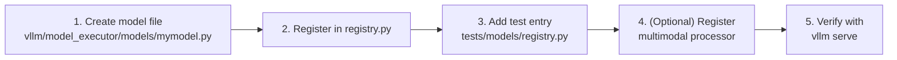

# Adding a New Model Architecture

This guide walks through the complete process of adding a new model architecture to vLLM. The process differs slightly depending on whether you are adding a text-only model, a multimodal model, or an embedding model.

## Overview



## Step 1: Create the Model File

Create a new Python file in `vllm/model_executor/models/`. The filename should match the module name you will use in the registry.

### Minimal Text Generation Model

```python
# vllm/model_executor/models/mymodel.py

from collections.abc import Iterable
import torch
import torch.nn as nn
from transformers import PretrainedConfig

from vllm.config import VllmConfig
from vllm.distributed import get_pp_group
from vllm.model_executor.layers.logits_processor import LogitsProcessor
from vllm.model_executor.layers.vocab_parallel_embedding import (
    ParallelLMHead,
    VocabParallelEmbedding,
)
from vllm.model_executor.model_loader.weight_utils import default_weight_loader
from vllm.sequence import IntermediateTensors

from .interfaces import SupportsLoRA, SupportsPP
from .utils import (
    AutoWeightsLoader,
    PPMissingLayer,
    make_empty_intermediate_tensors_factory,
    make_layers,
    maybe_prefix,
)


class MyModelForCausalLM(nn.Module, SupportsLoRA, SupportsPP):
    """Inference-only MyModel compatible with HuggingFace weights."""

    # Required for SupportsLoRA
    packed_modules_mapping = {
        "qkv_proj": ["q_proj", "k_proj", "v_proj"],
        "gate_up_proj": ["gate_proj", "up_proj"],
    }
    embedding_modules = {
        "embed_tokens": "input_embeddings",
        "lm_head": "output_embeddings",
    }

    def __init__(
        self,
        *,
        vllm_config: VllmConfig,
        prefix: str = "",
    ) -> None:
        super().__init__()
        config: PretrainedConfig = vllm_config.model_config.hf_config
        quant_config = vllm_config.quant_config
        self.config = config

        # Build the transformer backbone
        self.model = MyModel(
            vllm_config=vllm_config,
            prefix=maybe_prefix(prefix, "model"),
        )

        # Language model head (only on last PP rank)
        if get_pp_group().is_last_rank:
            self.lm_head = ParallelLMHead(
                config.vocab_size,
                config.hidden_size,
                quant_config=quant_config,
                prefix=maybe_prefix(prefix, "lm_head"),
            )
            self.logits_processor = LogitsProcessor(config.vocab_size)
        else:
            self.lm_head = PPMissingLayer()

        self.make_empty_intermediate_tensors = (
            self.model.make_empty_intermediate_tensors
        )

    def embed_input_ids(self, input_ids: torch.Tensor) -> torch.Tensor:
        return self.model.embed_input_ids(input_ids)

    def forward(
        self,
        input_ids: torch.Tensor | None,
        positions: torch.Tensor,
        intermediate_tensors: IntermediateTensors | None = None,
        inputs_embeds: torch.Tensor | None = None,
    ) -> torch.Tensor | IntermediateTensors:
        return self.model(input_ids, positions, intermediate_tensors, inputs_embeds)

    def compute_logits(
        self,
        hidden_states: torch.Tensor,
    ) -> torch.Tensor | None:
        return self.logits_processor(self.lm_head, hidden_states)

    def load_weights(
        self, weights: Iterable[tuple[str, torch.Tensor]]
    ) -> set[str]:
        loader = AutoWeightsLoader(self)
        return loader.load_weights(weights)
```

### Key Requirements

Every vLLM model class must:

1. Accept `vllm_config: VllmConfig` and `prefix: str = ""` as keyword-only arguments in `__init__`
2. Implement `embed_input_ids(input_ids: Tensor) -> Tensor`
3. Implement `forward(input_ids, positions, ...)` with at least `input_ids` and `positions` parameters
4. Implement `compute_logits(hidden_states)` for text generation models
5. Implement `load_weights(weights)` to load HuggingFace checkpoint weights

### Pipeline Parallelism Support

To support pipeline parallelism (`SupportsPP`), your model must:

- Use `PPMissingLayer()` for layers that don't exist on the current PP rank
- Use `make_layers()` to create layer lists that respect PP boundaries
- Implement `make_empty_intermediate_tensors()` for profiling on non-first PP ranks
- Accept `intermediate_tensors: IntermediateTensors | None` in `forward()`

```python
from .utils import make_layers, PPMissingLayer, make_empty_intermediate_tensors_factory

class MyModel(nn.Module):
    def __init__(self, *, vllm_config: VllmConfig, prefix: str = ""):
        super().__init__()
        config = vllm_config.model_config.hf_config

        self.embed_tokens = VocabParallelEmbedding(
            config.vocab_size, config.hidden_size
        )

        # make_layers handles PP rank slicing automatically
        self.start_layer, self.end_layer, self.layers = make_layers(
            config.num_hidden_layers,
            lambda prefix: MyDecoderLayer(vllm_config=vllm_config, prefix=prefix),
            prefix=f"{prefix}.layers",
        )

        self.make_empty_intermediate_tensors = (
            make_empty_intermediate_tensors_factory(
                ["hidden_states", "residual"],
                config.hidden_size,
            )
        )
```

## Step 2: Register in `registry.py`

Open `vllm/model_executor/models/registry.py` and add your architecture to the appropriate dictionary.

### For a text generation model:

```python
_TEXT_GENERATION_MODELS = {
    # ... existing entries ...
    "MyModelForCausalLM": ("mymodel", "MyModelForCausalLM"),
    # ...
}
```

The tuple format is `(module_name, class_name)` where:
- `module_name` is the filename without `.py` (relative to `vllm/model_executor/models/`)
- `class_name` is the Python class name in that file

### For an embedding/pooling model:

```python
_EMBEDDING_MODELS = {
    # ... existing entries ...
    "MyModelForEmbedding": ("mymodel", "MyModelForEmbedding"),
}
```

### For a multimodal model:

```python
_MULTIMODAL_MODELS = {
    # ... existing entries ...
    "MyModelForConditionalGeneration": ("mymodel", "MyModelForConditionalGeneration"),
}
```

### Aliasing to an existing implementation

If your model uses the same architecture as an existing one (e.g., it's a fine-tune of Llama), you can alias it:

```python
_TEXT_GENERATION_MODELS = {
    # ...
    "MyLlamaVariantForCausalLM": ("llama", "LlamaForCausalLM"),
}
```

## Step 3: Add a Test Entry

Open `tests/models/registry.py` and add an entry for your architecture with an example HuggingFace model:

```python
HF_EXAMPLE_MODELS = {
    # ... existing entries ...
    "MyModelForCausalLM": _HfExamplesInfo(
        default="my-org/my-model-7b",
        extras={
            "instruct": "my-org/my-model-7b-instruct",
        },
    ),
}
```

This is required — the registry tests will fail if an architecture is registered without a test entry.

## Step 4: Implement Weight Loading

vLLM provides `AutoWeightsLoader` which handles most weight loading automatically by matching parameter names. For models with non-standard weight names, you can provide a `WeightsMapper`:

```python
from vllm.model_executor.models.utils import WeightsMapper, AutoWeightsLoader

class MyModelForCausalLM(nn.Module, ...):
    # Map HuggingFace weight names to vLLM names
    hf_to_vllm_mapper = WeightsMapper(
        orig_to_new_prefix={
            "transformer.h.": "model.layers.",
            "transformer.wte.": "model.embed_tokens.",
            "lm_head.": "lm_head.",
        }
    )

    def load_weights(
        self, weights: Iterable[tuple[str, torch.Tensor]]
    ) -> set[str]:
        loader = AutoWeightsLoader(self)
        return loader.load_weights(weights)
```

For models with tied embeddings:

```python
def load_weights(self, weights):
    loader = AutoWeightsLoader(
        self,
        skip_prefixes=(["lm_head."] if self.config.tie_word_embeddings else None),
    )
    return loader.load_weights(weights)
```

## Step 5: Adding Multimodal Support

For multimodal models, you need to:

1. Inherit from `SupportsMultiModal`
2. Register a multimodal processor using `@MULTIMODAL_REGISTRY.register_processor`
3. Use `_mark_tower_model` and `_mark_language_model` context managers

### Minimal Multimodal Model

```python
from vllm.multimodal import MULTIMODAL_REGISTRY
from vllm.model_executor.models.interfaces import SupportsMultiModal, SupportsLoRA, SupportsPP

@MULTIMODAL_REGISTRY.register_processor(
    MyModelProcessor,
    info=MyModelProcessingInfo,
    dummy_inputs=MyModelDummyInputsBuilder,
)
class MyModelForConditionalGeneration(
    nn.Module, SupportsLoRA, SupportsMultiModal, SupportsPP
):
    supports_multimodal = True

    @classmethod
    def get_placeholder_str(cls, modality: str, i: int) -> str | None:
        if modality == "image":
            return "<image>"
        return None

    def __init__(self, *, vllm_config: VllmConfig, prefix: str = "") -> None:
        super().__init__()
        config = vllm_config.model_config.hf_config

        # Vision tower (encoder)
        with self._mark_tower_model(vllm_config, "image"):
            self.vision_tower = MyVisionEncoder(
                config.vision_config,
                prefix=maybe_prefix(prefix, "vision_tower"),
            )
            self.projector = MyProjector(
                config,
                prefix=maybe_prefix(prefix, "projector"),
            )

        # Language model
        with self._mark_language_model(vllm_config):
            self.language_model = init_vllm_registered_model(
                vllm_config=vllm_config,
                hf_config=config.text_config,
                prefix=maybe_prefix(prefix, "language_model"),
            )

        self.make_empty_intermediate_tensors = (
            self.language_model.make_empty_intermediate_tensors
        )

    def embed_multimodal(self, pixel_values: torch.Tensor) -> MultiModalEmbeddings:
        image_features = self.vision_tower(pixel_values)
        return self.projector(image_features)

    def forward(
        self,
        input_ids: torch.Tensor | None,
        positions: torch.Tensor,
        intermediate_tensors: IntermediateTensors | None = None,
        inputs_embeds: torch.Tensor | None = None,
        **kwargs: object,
    ) -> torch.Tensor | IntermediateTensors:
        if inputs_embeds is None:
            multimodal_embeddings = self.embed_multimodal(**kwargs)
            inputs_embeds = self.embed_input_ids(
                input_ids,
                multimodal_embeddings,
                is_multimodal=kwargs.get("is_multimodal"),
            )
        return self.language_model(
            None, positions, intermediate_tensors, inputs_embeds
        )
```

### Implementing a Multimodal Processor

The processor handles converting raw multimodal data (images, audio) into model inputs:

```python
from vllm.multimodal.processing import (
    BaseProcessingInfo,
    BaseMultiModalProcessor,
    BaseDummyInputsBuilder,
)

class MyModelProcessingInfo(BaseProcessingInfo):
    def get_supported_mm_limits(self) -> Mapping[str, int | None]:
        return {"image": None}  # None = unlimited

    def get_mm_max_tokens_per_item(
        self, seq_len: int, mm_counts: Mapping[str, int]
    ) -> Mapping[str, int]:
        return {"image": self.get_num_image_tokens()}

    def get_num_image_tokens(self) -> int:
        config = self.get_hf_config(MyModelConfig)
        return config.image_seq_length


class MyModelDummyInputsBuilder(BaseDummyInputsBuilder[MyModelProcessingInfo]):
    def get_dummy_processor_inputs(
        self, seq_len: int, mm_counts: Mapping[str, int]
    ) -> ProcessorInputs:
        num_images = mm_counts.get("image", 0)
        return ProcessorInputs(
            prompt_text="<image>" * num_images,
            mm_data={"image": [dummy_image(224, 224)] * num_images},
        )


class MyModelProcessor(BaseMultiModalProcessor[MyModelProcessingInfo]):
    def _get_mm_fields_config(
        self, hf_inputs: BatchFeature, hf_processor_mm_kwargs: Mapping[str, object]
    ) -> Mapping[str, MultiModalFieldConfig]:
        return {"pixel_values": MultiModalFieldConfig.batched("image")}

    def _get_prompt_updates(
        self, mm_items: MultiModalDataItems, hf_processor_mm_kwargs: Mapping[str, object],
        out_mm_kwargs: MultiModalKwargs
    ) -> Sequence[PromptUpdate]:
        # Return token replacements for image placeholders
        ...
```

## Step 6: Adding Embedding Model Support

To create an embedding variant of an existing model, use the `as_embedding_model` adapter:

```python
from .adapters import as_embedding_model

class MyModelForEmbedding(as_embedding_model(MyModelForCausalLM)):
    """Embedding model based on MyModel."""
    pass
```

Or implement `VllmModelForPooling` directly:

```python
from vllm.model_executor.models.interfaces_base import VllmModelForPooling
from vllm.model_executor.layers.pooler import Pooler, PoolingType

class MyModelForEmbedding(nn.Module, VllmModelForPooling):
    is_pooling_model = True
    default_seq_pooling_type = "MEAN"

    def __init__(self, *, vllm_config: VllmConfig, prefix: str = "") -> None:
        super().__init__()
        self.model = MyModel(vllm_config=vllm_config, prefix=prefix)
        self.pooler = Pooler.from_config_with_defaults(
            vllm_config.model_config.pooler_config,
            pooling_type=PoolingType.MEAN,
            normalize=True,
        )

    def forward(self, input_ids, positions, **kwargs):
        hidden_states = self.model(input_ids, positions)
        return hidden_states

    def pooling(self, hidden_states, pooling_metadata):
        return self.pooler(hidden_states, pooling_metadata)
```

## Step 7: Verify Your Model

Test your model with vLLM:

```bash
# Basic test
vllm serve my-org/my-model-7b --trust-remote-code

# Test with the Python API
python -c "
from vllm import LLM, SamplingParams
llm = LLM(model='my-org/my-model-7b')
outputs = llm.generate(['Hello, world!'], SamplingParams(max_tokens=50))
print(outputs[0].outputs[0].text)
"
```

Run the registry tests:

```bash
pytest tests/models/test_registry.py -k MyModelForCausalLM
```

## Common Pitfalls

### CUDA Initialization in Main Process

Never import CUDA-dependent code at module level in your model file. The registry uses subprocess isolation to inspect model capabilities, and importing CUDA code in the main process before forking workers causes errors.

```python
# BAD: top-level import of CUDA-dependent code
import flash_attn  # This will break subprocess inspection

# GOOD: lazy import inside functions
def forward(self, ...):
    import flash_attn
    ...
```

### Missing `embed_input_ids`

All vLLM models must implement `embed_input_ids`. For text-only models, this typically delegates to the embedding layer:

```python
def embed_input_ids(self, input_ids: torch.Tensor) -> torch.Tensor:
    return self.model.embed_tokens(input_ids)
```

### Weight Name Mismatches

If your model's HuggingFace checkpoint uses different weight names than your vLLM implementation, use `WeightsMapper` or implement custom `load_weights` logic. Check the weight names with:

```python
from safetensors import safe_open
with safe_open("model.safetensors", framework="pt") as f:
    for key in f.keys():
        print(key)
```

### Pipeline Parallelism Boundary

When using `make_layers()`, layers are split across PP ranks. Ensure your model correctly handles the case where `start_layer > 0` (not the first PP rank) by using `PPMissingLayer` for components that only exist on specific ranks.

## See Also

- [Model Interfaces](model-interfaces.md)
- [Model Registry Internals](registry-internals.md)
- [Model Loading](model-loading.md)
- [Multimodal Models](multimodal-models.md)
- [Supported Models](supported-models.md)
