# Model Interfaces

vLLM uses a Protocol-based interface system to declare model capabilities. Each interface is a `@runtime_checkable` Protocol class defined in `vllm/model_executor/models/interfaces.py` and `vllm/model_executor/models/interfaces_base.py`. Models opt into capabilities by inheriting from the appropriate interface classes.

## Interface Hierarchy

```mermaid
classDiagram
    class VllmModel {
        +__init__(vllm_config, prefix)
        +embed_input_ids(input_ids) Tensor
        +forward(input_ids, positions) T
    }
    class VllmModelForTextGeneration {
        +compute_logits(hidden_states) T
    }
    class VllmModelForPooling {
        +is_pooling_model: ClassVar[True]
        +default_seq_pooling_type: ClassVar
        +default_tok_pooling_type: ClassVar
        +attn_type: ClassVar
        +pooler: Pooler
    }
    class SupportsLoRA {
        +supports_lora: ClassVar[True]
        +embedding_modules: ClassVar[dict]
        +packed_modules_mapping: dict
        +lora_skip_prefixes: ClassVar[list]
    }
    class SupportsPP {
        +supports_pp: ClassVar[True]
        +make_empty_intermediate_tensors()
        +forward(input_ids, positions, intermediate_tensors)
    }
    class SupportsMultiModal {
        +supports_multimodal: ClassVar[True]
        +embed_multimodal(**kwargs) MultiModalEmbeddings
        +get_language_model() VllmModel
        +embed_input_ids(input_ids, ...) Tensor
    }
    class SupportsQuant {
        +hf_to_vllm_mapper: ClassVar
        +packed_modules_mapping: ClassVar
        +quant_config: QuantizationConfig
    }
    class SupportsTranscription {
        +supports_transcription: ClassVar[True]
        +supported_languages: ClassVar[Mapping]
        +get_generation_prompt(...)
        +get_num_audio_tokens(...)
    }
    class HasInnerState {
        +has_inner_state: ClassVar[True]
    }
    class IsAttentionFree {
        +is_attention_free: ClassVar[True]
    }
    class IsHybrid {
        +is_hybrid: ClassVar[True]
        +get_mamba_state_shape_from_config()
    }

    VllmModel <|-- VllmModelForTextGeneration
    VllmModel <|-- VllmModelForPooling
```



## Base Interfaces (`interfaces_base.py`)

### `VllmModel`

The root interface that all vLLM models must satisfy:

```python
@runtime_checkable
class VllmModel(Protocol[T_co]):
    def __init__(self, vllm_config: VllmConfig, prefix: str = "") -> None: ...
    def embed_input_ids(self, input_ids: torch.Tensor) -> torch.Tensor: ...
    def forward(self, input_ids: torch.Tensor, positions: torch.Tensor) -> T_co: ...
```

A model is considered a valid `VllmModel` if:
- Its `__init__` accepts a `vllm_config` keyword argument
- It has a callable `embed_input_ids` method
- Its `forward` method accepts `input_ids` and `positions` keyword arguments

### `VllmModelForTextGeneration`

Extends `VllmModel` for autoregressive text generation:

```python
@runtime_checkable
class VllmModelForTextGeneration(VllmModel[T], Protocol[T]):
    def compute_logits(self, hidden_states: T) -> T | None:
        """Return None if TP rank > 0."""
        ...
```

### `VllmModelForPooling`

Extends `VllmModel` for embedding/pooling tasks:

```python
@runtime_checkable
class VllmModelForPooling(VllmModel[T_co], Protocol[T_co]):
    is_pooling_model: ClassVar[Literal[True]] = True
    default_seq_pooling_type: ClassVar[SequencePoolingType] = "LAST"
    default_tok_pooling_type: ClassVar[TokenPoolingType] = "ALL"
    attn_type: ClassVar[AttnTypeStr] = "decoder"
    pooler: Pooler
```

The `pooler` attribute is only called on TP rank 0. The `default_seq_pooling_type` and `default_tok_pooling_type` class variables control how hidden states are pooled into a single vector.

## Capability Interfaces (`interfaces.py`)

### `SupportsLoRA`

Models that support LoRA (Low-Rank Adaptation) fine-tuning adapters:

```python
@runtime_checkable
class SupportsLoRA(Protocol):
    supports_lora: ClassVar[Literal[True]] = True
    is_3d_moe_weight: ClassVar[bool] = False
    is_non_gated_moe: ClassVar[bool] = False
    embedding_modules: ClassVar[dict[str, str]] = {}
    packed_modules_mapping: dict[str, list[str]] = {}
    lora_skip_prefixes: ClassVar[list[str]] = []
```

**Required class variables:**

| Attribute | Type | Description |
|---|---|---|
| `supports_lora` | `ClassVar[True]` | Opt-in flag |
| `embedding_modules` | `ClassVar[dict[str, str]]` | Maps weight names to embedding types (`"input_embeddings"` or `"output_embeddings"`) |
| `packed_modules_mapping` | `dict[str, list[str]]` | Maps fused weight names to their component names (e.g., `{"qkv_proj": ["q_proj", "k_proj", "v_proj"]}`) |
| `lora_skip_prefixes` | `ClassVar[list[str]]` | Module prefixes to skip during LoRA loading (e.g., `["mtp."]` for MTP layers) |

**Example (from `LlamaForCausalLM`):**

```python
class LlamaForCausalLM(nn.Module, SupportsLoRA, SupportsPP, ...):
    packed_modules_mapping = {
        "qkv_proj": ["q_proj", "k_proj", "v_proj"],
        "gate_up_proj": ["gate_proj", "up_proj"],
    }
    embedding_modules = {
        "embed_tokens": "input_embeddings",
        "lm_head": "output_embeddings",
    }
```

### `SupportsPP`

Models that support pipeline parallelism (splitting layers across multiple GPUs/nodes):

```python
@runtime_checkable
class SupportsPP(Protocol):
    supports_pp: ClassVar[Literal[True]] = True

    def make_empty_intermediate_tensors(
        self,
        batch_size: int,
        dtype: torch.dtype,
        device: torch.device,
    ) -> IntermediateTensors:
        """Called when PP rank > 0 for profiling purposes."""
        ...

    def forward(
        self,
        input_ids: Tensor | None,
        positions: Tensor,
        *,
        intermediate_tensors: IntermediateTensors | None,
    ) -> IntermediateTensors | None:
        """Accept IntermediateTensors when PP rank > 0.
        Return IntermediateTensors only for the last PP rank."""
        ...
```

A model is verified to support PP by checking:
1. It has `supports_pp = True` and `make_empty_intermediate_tensors`
2. Its `forward` method accepts the `intermediate_tensors` keyword argument

### `SupportsMultiModal`

Models that can process multimodal inputs (images, audio, video):

```python
@runtime_checkable
class SupportsMultiModal(Protocol):
    supports_multimodal: ClassVar[Literal[True]] = True
    supports_multimodal_raw_input_only: ClassVar[bool] = False
    supports_encoder_tp_data: ClassVar[bool] = False
    requires_raw_input_tokens: ClassVar[bool] = False

    def embed_multimodal(self, **kwargs: object) -> MultiModalEmbeddings: ...
    def get_language_model(self) -> VllmModel: ...
    def embed_input_ids(
        self,
        input_ids: Tensor,
        multimodal_embeddings: MultiModalEmbeddings | None = None,
        *,
        is_multimodal: Tensor | None = None,
        handle_oov_mm_token: bool = False,
    ) -> Tensor: ...
```

**Key class variables:**

| Attribute | Description |
|---|---|
| `supports_multimodal` | Opt-in flag (always `True`) |
| `supports_multimodal_raw_input_only` | Model processes raw modality data, not pre-computed embeddings |
| `supports_encoder_tp_data` | Supports `mm_encoder_tp_mode="data"` for encoder tensor parallelism |
| `requires_raw_input_tokens` | Model processes raw token IDs, not input embeddings |

**Context managers for component marking:**

Multimodal models use context managers to mark which sub-modules are language model components vs. tower (encoder) components:

```python
# In __init__:
with self._mark_language_model(vllm_config):
    self.language_model = LlamaModel(...)

with self._mark_tower_model(vllm_config, modalities={"image"}):
    self.vision_tower = CLIPVisionModel(...)
```

This enables features like `--mm-encoder-only` mode (skip language model) and `--limit-mm-per-prompt 0` (skip vision tower).

### `SupportsQuant`

Base class (not a Protocol) for models that support quantization:

```python
class SupportsQuant:
    hf_to_vllm_mapper: ClassVar[WeightsMapper | None] = None
    packed_modules_mapping: ClassVar[dict[str, list[str]] | None] = None
    quant_config: QuantizationConfig | None = None
```

When a model inheriting `SupportsQuant` is instantiated, the `__new__` method automatically:
1. Finds the `QuantizationConfig` in the constructor arguments
2. Attaches it to the instance as `self.quant_config`
3. Applies `hf_to_vllm_mapper` to remap weight names
4. Updates `packed_modules_mapping` in the quant config

### `SupportsTranscription`

Models that support speech-to-text transcription (e.g., Whisper, Qwen3-ASR):

```python
@runtime_checkable
class SupportsTranscription(Protocol):
    supported_languages: ClassVar[Mapping[str, str]]
    supports_transcription: ClassVar[Literal[True]] = True
    supports_transcription_only: ClassVar[bool] = False
    supports_segment_timestamp: ClassVar[bool] = False
    supports_explicit_language_detection: ClassVar[bool] = False

    @classmethod
    def get_generation_prompt(
        cls,
        audio: np.ndarray,
        stt_config: SpeechToTextConfig,
        model_config: ModelConfig,
        language: str | None,
        task_type: Literal["transcribe", "translate"],
        request_prompt: str,
        to_language: str | None,
    ) -> PromptType: ...

    @classmethod
    def get_num_audio_tokens(
        cls,
        audio_duration_s: float,
        stt_config: SpeechToTextConfig,
        model_config: ModelConfig,
    ) -> int | None: ...
```

**Class variables:**

| Attribute | Description |
|---|---|
| `supported_languages` | ISO 639-1 language code → language name mapping |
| `supports_transcription_only` | If `True`, model cannot do text generation (transcription only) |
| `supports_segment_timestamp` | Enables per-segment timestamp output |
| `supports_explicit_language_detection` | Model needs a separate forward pass for language detection |

Language codes in `supported_languages` are validated against the Whisper language map at class definition time.

## Additional Interfaces

### `HasInnerState`

Models with recurrent state that must be tracked across steps (Mamba, Jamba):

```python
@runtime_checkable
class HasInnerState(Protocol):
    has_inner_state: ClassVar[Literal[True]] = True
```

Models with inner state need access to `scheduler_config` for `max_num_seqs` and similar parameters.

### `IsAttentionFree`

Models with no attention mechanism (pure SSM models like Mamba):

```python
@runtime_checkable
class IsAttentionFree(Protocol):
    is_attention_free: ClassVar[Literal[True]] = True
```

Used for block manager and attention backend selection. Mamba is attention-free; Jamba is not (it has both attention and Mamba blocks).

### `IsHybrid`

Models with both attention and Mamba/SSM blocks (Jamba, Bamba, Zamba):

```python
@runtime_checkable
class IsHybrid(Protocol):
    is_hybrid: ClassVar[Literal[True]] = True

    @classmethod
    def get_mamba_state_shape_from_config(
        cls, vllm_config: VllmConfig
    ) -> tuple[tuple[int, int], tuple[int, int, int]]: ...

    @classmethod
    def get_mamba_state_copy_func(cls) -> tuple[MambaStateCopyFunc, ...]: ...
```

The `hf_config` of hybrid models must contain a `layers_block_type` field.

### `SupportsMambaPrefixCaching`

Experimental interface for Mamba models that support prefix caching:

```python
@runtime_checkable
class SupportsMambaPrefixCaching(Protocol):
    supports_mamba_prefix_caching: ClassVar[Literal[True]] = True
```

### `SupportsCrossEncoding`

Models that support cross-encoding (query+document → relevance score):

```python
@runtime_checkable
class SupportsCrossEncoding(Protocol):
    supports_cross_encoding: ClassVar[Literal[True]] = True
```

Note: `supports_cross_encoding()` also requires `is_pooling_model()` to be true.

### `SupportsLateInteraction`

Models that support late interaction retrieval (ColBERT-style):

```python
@runtime_checkable
class SupportsLateInteraction(Protocol):
    supports_late_interaction: ClassVar[Literal[True]] = True
```

Late interaction models encode queries and documents separately into per-token embeddings, then compute similarity via MaxSim.

### `MixtureOfExperts`

Protocol for MoE models, enabling Expert Parallelism Load Balancing (EPLB):

```python
@runtime_checkable
class MixtureOfExperts(Protocol):
    expert_weights: MutableSequence[Sequence[Tensor]]
    num_moe_layers: int
    num_expert_groups: int
    num_logical_experts: int
    num_physical_experts: int
    num_local_physical_experts: int
    num_routed_experts: int
    num_shared_experts: int
    num_redundant_experts: int
    moe_layers: Iterable[nn.Module]

    def set_eplb_state(
        self,
        expert_load_view: Tensor,
        logical_to_physical_map: Tensor,
        logical_replica_count: Tensor,
    ) -> None: ...
```

### `SupportsRealtime`

Models that support real-time streaming audio transcription:

```python
@runtime_checkable
class SupportsRealtime(Protocol):
    supports_realtime: ClassVar[Literal[True]] = True
    realtime_max_tokens: ClassVar[int] = 1

    @classmethod
    async def buffer_realtime_audio(
        cls,
        audio_stream: AsyncGenerator[np.ndarray, None],
        input_stream: asyncio.Queue[list[int]],
        model_config: ModelConfig,
    ) -> AsyncGenerator[PromptType, None]: ...
```

## Interface Checking Functions

Each interface has a corresponding standalone function for runtime checking:

```python
from vllm.model_executor.models.interfaces import (
    supports_lora,
    supports_pp,
    supports_multimodal,
    supports_transcription,
    has_inner_state,
    is_attention_free,
    is_hybrid,
    supports_cross_encoding,
    supports_late_interaction,
    supports_mamba_prefix_caching,
)
from vllm.model_executor.models.interfaces_base import (
    is_text_generation_model,
    is_pooling_model,
)

# Check a model class
if supports_lora(MyModel):
    print("Model supports LoRA")

# Check a model instance
model = MyModel(vllm_config=...)
if supports_pp(model):
    print("Model supports pipeline parallelism")
```

These functions use `TypeIs` return types for proper type narrowing in static analysis.

## Implementing a New Interface

To add LoRA support to a custom model:

```python
from vllm.model_executor.models.interfaces import SupportsLoRA, SupportsPP
import torch.nn as nn

class MyModelForCausalLM(nn.Module, SupportsLoRA, SupportsPP):
    # Required for SupportsLoRA
    supports_lora = True
    packed_modules_mapping = {
        "qkv_proj": ["q_proj", "k_proj", "v_proj"],
        "gate_up_proj": ["gate_proj", "up_proj"],
    }
    embedding_modules = {
        "embed_tokens": "input_embeddings",
        "lm_head": "output_embeddings",
    }

    # Required for SupportsPP
    supports_pp = True

    def make_empty_intermediate_tensors(
        self, batch_size, dtype, device
    ) -> IntermediateTensors:
        return IntermediateTensors({
            "hidden_states": torch.zeros(
                batch_size, self.config.hidden_size,
                dtype=dtype, device=device
            )
        })

    def forward(
        self,
        input_ids,
        positions,
        *,
        intermediate_tensors=None,
    ):
        ...
```

## See Also

- [Model Registry Internals](registry-internals.md)
- [Adding a New Model](adding-new-model.md)
- [Multimodal Models](multimodal-models.md)
- [Supported Models](supported-models.md)
