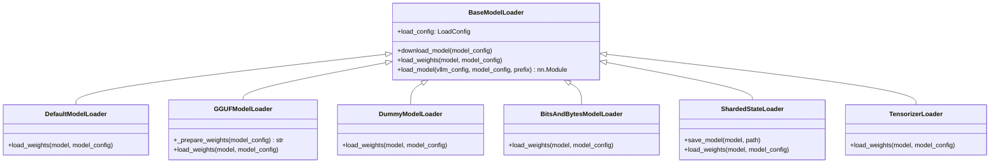
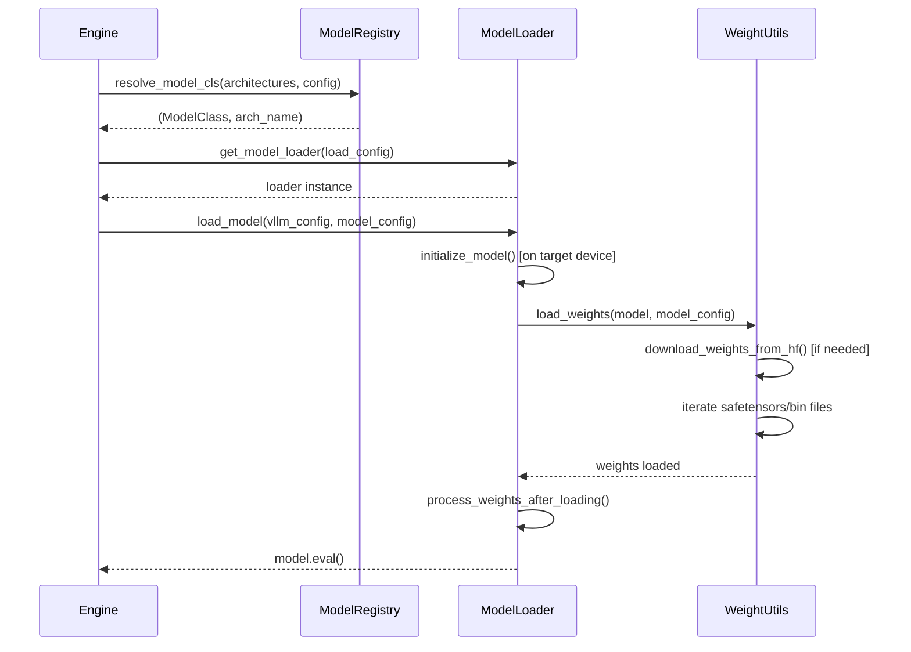

# Model Loading

vLLM supports multiple model loading strategies to accommodate different deployment scenarios — from standard HuggingFace Hub downloads to quantized GGUF files, pre-sharded checkpoints, and dummy weights for benchmarking.

## Load Format Overview

The load format is controlled by the `--load-format` CLI argument or `load_format` in `LoadConfig`. The available formats are:

| Format | Loader Class | Description |
|---|---|---|
| `auto` | `DefaultModelLoader` | Auto-detect: tries safetensors, then PyTorch |
| `hf` | `DefaultModelLoader` | HuggingFace format (safetensors or `.bin`) |
| `safetensors` | `DefaultModelLoader` | Force safetensors format |
| `pt` | `DefaultModelLoader` | PyTorch `.bin` format |
| `npcache` | `DefaultModelLoader` | NumPy cache for faster repeated loads |
| `fastsafetensors` | `DefaultModelLoader` | Faster safetensors loading via `fastsafetensors` |
| `mistral` | `DefaultModelLoader` | Mistral format (`params.json` + consolidated weights) |
| `gguf` | `GGUFModelLoader` | GGUF quantized format |
| `bitsandbytes` | `BitsAndBytesModelLoader` | BitsAndBytes in-flight quantization |
| `dummy` | `DummyModelLoader` | Random weights (benchmarking only) |
| `sharded_state` | `ShardedStateLoader` | Pre-sharded vLLM checkpoints |
| `runai_streamer` | `RunaiModelStreamerLoader` | RunAI model streaming |
| `runai_streamer_sharded` | `ShardedStateLoader` | RunAI sharded streaming |
| `tensorizer` | `TensorizerLoader` | CoreWeave Tensorizer format |

## Loader Architecture



The `load_model()` method in `BaseModelLoader` orchestrates the full loading process:

1. Set default dtype (`model_config.dtype`)
2. Initialize the model on the target device
3. Call `load_weights()` (implemented by each subclass)
4. Call `process_weights_after_loading()` (quantization, etc.)
5. Return `model.eval()`

## Loading from HuggingFace Hub

The most common loading path. vLLM uses `huggingface_hub.snapshot_download()` to download model files:

```bash
# Load from HuggingFace Hub
vllm serve meta-llama/Llama-3.1-8B-Instruct

# Specify a revision
vllm serve meta-llama/Llama-3.1-8B-Instruct --revision main

# Use a custom cache directory
vllm serve meta-llama/Llama-3.1-8B-Instruct \
    --download-dir /data/model-cache

# Use a HuggingFace token for private models
vllm serve my-org/private-model --hf-token hf_xxx
```

### File Priority

When loading with `auto` or `hf` format, vLLM prefers:
1. `model.safetensors.index.json` + sharded `.safetensors` files
2. `model.safetensors` (single file)
3. `pytorch_model.bin.index.json` + sharded `.bin` files
4. `pytorch_model.bin` (single file)

### Offline Mode

Set `HF_HUB_OFFLINE=1` to prevent any network requests. vLLM will only use locally cached files:

```bash
HF_HUB_OFFLINE=1 vllm serve meta-llama/Llama-3.1-8B-Instruct
```

### ModelScope Support

For users in regions where HuggingFace is not accessible, vLLM supports ModelScope:

```bash
VLLM_USE_MODELSCOPE=1 vllm serve Qwen/Qwen2.5-7B-Instruct
```

## Loading from Local Paths

Pass a local directory path instead of a HuggingFace model ID:

```bash
vllm serve /path/to/my-model

# With explicit format
vllm serve /path/to/my-model --load-format safetensors
```

The directory must contain a `config.json` (HuggingFace format) or `params.json` (Mistral format).

## GGUF Format

GGUF files contain quantized weights in a compact format. vLLM supports three ways to specify GGUF models:

### Local GGUF File

```bash
vllm serve /path/to/model.gguf
```

### HuggingFace Repo + Filename

```bash
vllm serve bartowski/Meta-Llama-3.1-8B-Instruct-GGUF/Meta-Llama-3.1-8B-Instruct-Q4_K_M.gguf
```

### HuggingFace Repo + Quantization Type

```bash
# Format: <repo_id>:<quant_type>
vllm serve bartowski/Meta-Llama-3.1-8B-Instruct-GGUF:Q4_K_M
```

vLLM will automatically find and download the matching GGUF file.

> **Note:** GGUF models require a `config.json` in the repository for architecture detection. If the repo doesn't have one, use `--hf-config-path` to point to the original unquantized model's config.

### GGUF Weight Mapping

GGUF uses a different naming convention for tensors (`blk.N.BB.weight`) compared to HuggingFace (`model.layers.N.self_attn.q_proj.weight`). The `GGUFModelLoader` handles this mapping automatically.

## Dummy Weights

For performance benchmarking without actual model weights:

```bash
vllm serve meta-llama/Llama-3.1-8B-Instruct --load-format dummy
```

The `DummyModelLoader` initializes all weights to random values using `initialize_dummy_weights()`. This is useful for:
- Measuring throughput without I/O bottlenecks
- Testing model architecture without downloading weights
- CI/CD pipeline testing

## Sharded State Format

For large models that benefit from pre-sharded checkpoints (avoids re-sharding on every startup):

```bash
# Save a sharded checkpoint
python -c "
from vllm import LLM
from vllm.model_executor.model_loader import ShardedStateLoader
llm = LLM(model='meta-llama/Llama-3.1-70B-Instruct', tensor_parallel_size=4)
ShardedStateLoader.save_model(llm.llm_engine.model_executor.driver_worker.model, '/path/to/sharded')
"

# Load from sharded checkpoint
vllm serve /path/to/sharded --load-format sharded_state --tensor-parallel-size 4
```

## BitsAndBytes In-Flight Quantization

Load a full-precision model and quantize it on-the-fly using BitsAndBytes:

```bash
# 4-bit quantization
vllm serve meta-llama/Llama-3.1-8B-Instruct \
    --load-format bitsandbytes \
    --quantization bitsandbytes

# 8-bit quantization
vllm serve meta-llama/Llama-3.1-8B-Instruct \
    --load-format bitsandbytes \
    --quantization bitsandbytes \
    --bnb-quantization-type int8
```

## Custom Model Loaders

Register a custom loader for unsupported formats:

```python
from vllm.model_executor.model_loader import register_model_loader
from vllm.model_executor.model_loader.base_loader import BaseModelLoader
from vllm.config import ModelConfig
import torch.nn as nn

@register_model_loader("my_format")
class MyModelLoader(BaseModelLoader):
    def download_model(self, model_config: ModelConfig) -> None:
        # Download logic here
        pass

    def load_weights(self, model: nn.Module, model_config: ModelConfig) -> None:
        # Weight loading logic here
        pass
```

Then use it:

```bash
vllm serve my-model --load-format my_format
```

## Weight Loading Utilities

### `AutoWeightsLoader`

The recommended way to implement `load_weights()` in custom models. It automatically handles:
- Tensor parallel weight splitting
- Quantization-aware loading
- Weight name remapping via `hf_to_vllm_mapper`

```python
from vllm.model_executor.models.utils import AutoWeightsLoader

def load_weights(self, weights: Iterable[tuple[str, torch.Tensor]]) -> set[str]:
    loader = AutoWeightsLoader(
        self,
        skip_prefixes=(["lm_head."] if self.config.tie_word_embeddings else None),
    )
    return loader.load_weights(weights)
```

### `default_weight_loader`

For simple weight loading without special handling:

```python
from vllm.model_executor.model_loader.weight_utils import default_weight_loader

def load_weights(self, weights):
    params_dict = dict(self.named_parameters())
    for name, loaded_weight in weights:
        if name in params_dict:
            param = params_dict[name]
            default_weight_loader(param, loaded_weight)
```

### `WeightsMapper`

Maps HuggingFace weight names to vLLM weight names:

```python
from vllm.model_executor.models.utils import WeightsMapper

hf_to_vllm_mapper = WeightsMapper(
    orig_to_new_prefix={
        "model.language_model.": "language_model.model.",
        "model.vision_tower.": "vision_tower.",
        "lm_head.": "language_model.lm_head.",
    },
    orig_to_new_suffix={
        ".weight_scale": ".scale",
    },
)
```

## `hf-overrides` for Config Patching

The `--hf-overrides` argument allows patching the HuggingFace config before model loading. This is useful for:

- Fixing incorrect architecture names in the config
- Overriding model parameters without modifying the checkpoint
- Specifying quantization configs for models that don't include them

### Dictionary Overrides

Pass a JSON dictionary to override specific config fields:

```bash
# Override the architecture name
vllm serve my-model \
    --hf-overrides '{"architectures": ["LlamaForCausalLM"]}'

# Override multiple fields
vllm serve my-model \
    --hf-overrides '{"max_position_embeddings": 8192, "rope_theta": 500000.0}'

# Override model type (affects config class selection)
vllm serve my-model \
    --hf-overrides '{"model_type": "llama"}'
```

### Callable Overrides (Python API)

For complex config transformations, pass a callable:

```python
from vllm import LLM
from transformers import PretrainedConfig

def patch_config(config: PretrainedConfig) -> PretrainedConfig:
    config.rope_scaling = {
        "type": "linear",
        "factor": 4.0,
    }
    return config

llm = LLM(
    model="meta-llama/Llama-3.1-8B",
    hf_overrides=patch_config,
)
```

### Quantization Config Override

Override the quantization config file path:

```bash
vllm serve my-model \
    --hf-overrides '{"quantization_config_file": "/path/to/quant_config.json"}'
```

Or provide the quantization config as a JSON string:

```bash
vllm serve my-model \
    --hf-overrides '{"quantization_config_dict_json": "{\"quant_method\": \"awq\", \"bits\": 4}"}'
```

### When `hf-overrides` is Applied

Config overrides are applied at two points:

1. **Before config class selection**: `model_type` overrides affect which config class is used
2. **After config loading**: All other overrides are applied to the loaded config object

```python
# From vllm/transformers_utils/config.py:
if hf_overrides_kw:
    logger.debug("Overriding HF config with %s", hf_overrides_kw)
    config.update(hf_overrides_kw)
if hf_overrides_fn:
    config = hf_overrides_fn(config)
```

## Loading Process Internals

The complete model loading sequence:



## See Also

- [Model Registry Internals](registry-internals.md)
- [Supported Models](supported-models.md)
- [Adding a New Model](adding-new-model.md)
- [Configuration Reference](../06-configuration/README.md)
