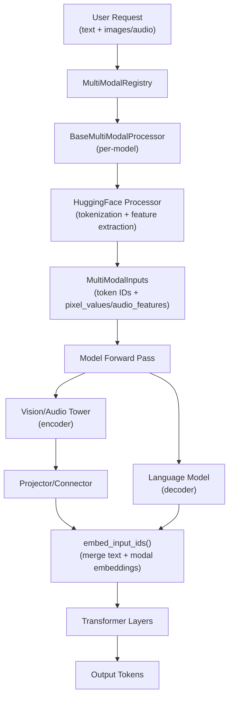

# Multimodal Model Support

vLLM provides first-class support for multimodal models that process images, video, and audio alongside text. This page covers the architecture of multimodal support, how vision/audio encoders are integrated, and how to use multimodal models in practice.

## Architecture Overview



## Supported Modalities

vLLM supports three primary modalities:

| Modality | Input Types | Example Models |
|---|---|---|
| **Image** | PIL Image, NumPy array, Tensor, pre-computed embeddings | LLaVA, Qwen2-VL, Gemma3, InternVL |
| **Video** | List of frames, NumPy array, Tensor | LLaVA-NeXT-Video, Qwen2-VL, LLaVA-OneVision |
| **Audio** | List of floats, NumPy array, Tensor | Whisper, Qwen2-Audio, UltraVox, Phi4-MM |

## The `SupportsMultiModal` Interface

All multimodal models implement the `SupportsMultiModal` Protocol from `vllm/model_executor/models/interfaces.py`. See [Model Interfaces](model-interfaces.md) for the full interface definition.

### Key Methods

#### `embed_multimodal(**kwargs) -> MultiModalEmbeddings`

Converts raw multimodal inputs (pixel values, audio features) into embeddings:

```python
MultiModalEmbeddings = list[Tensor] | Tensor | tuple[Tensor, ...]
```

The returned embeddings must be in the same order as the multimodal items appear in the prompt. They can be:
- A list/tuple of 2D tensors (one per item)
- A single 3D tensor (batch dimension groups items)

#### `get_language_model() -> VllmModel`

Returns the underlying language model component. vLLM uses this to:
- Route text token embeddings through the language model's embedding layer
- Skip the language model in `--mm-encoder-only` mode

#### `embed_input_ids(input_ids, multimodal_embeddings, *, is_multimodal) -> Tensor`

Merges text token embeddings with multimodal embeddings. The `is_multimodal` boolean mask indicates which positions in `input_ids` correspond to multimodal tokens.

## Model Component Marking

Multimodal models use context managers to declare which sub-modules are language model components vs. encoder (tower) components. This enables selective initialization and execution.

### `_mark_tower_model(vllm_config, modalities)`

Marks sub-modules initialized within this context as belonging to the vision/audio tower:

```python
# In __init__:
with self._mark_tower_model(vllm_config, "image"):
    self.vision_tower = CLIPVisionModel(...)
    self.projector = LinearProjector(...)
```

When `--limit-mm-per-prompt image=0` is set, the vision tower is replaced with `StageMissingLayer` (a no-op placeholder), saving GPU memory.

### `_mark_language_model(vllm_config)`

Marks sub-modules as belonging to the language model:

```python
with self._mark_language_model(vllm_config):
    self.language_model = LlamaForCausalLM(...)
```

When `--mm-encoder-only` is set, the language model is replaced with `StageMissingLayer`.

### `_mark_composite_model(vllm_config, language_targets, tower_targets)`

A combined context manager for models with complex component hierarchies:

```python
with self._mark_composite_model(
    vllm_config,
    language_targets=LlamaModel,
    tower_targets={"image": CLIPVisionModel, "audio": WhisperEncoder},
):
    self.vision_encoder = CLIPVisionModel(...)
    self.audio_encoder = WhisperEncoder(...)
    self.language_model = LlamaModel(...)
```

## The MultiModal Registry

The `MultiModalRegistry` (singleton `MULTIMODAL_REGISTRY` in `vllm/multimodal/__init__.py`) manages multimodal processors for each model class.

### Registering a Processor

Processors are registered as class decorators:

```python
from vllm.multimodal import MULTIMODAL_REGISTRY

@MULTIMODAL_REGISTRY.register_processor(
    MyModelProcessor,
    info=MyModelProcessingInfo,
    dummy_inputs=MyModelDummyInputsBuilder,
)
class MyModelForConditionalGeneration(nn.Module, SupportsMultiModal, ...):
    ...
```

The decorator stores a `_ProcessorFactories` object on the model class as `_processor_factory`. This factory is used to lazily construct the processor when needed.

### Processor Components

Each model's multimodal processing is split into three components:

| Component | Base Class | Purpose |
|---|---|---|
| `ProcessingInfo` | `BaseProcessingInfo` | Describes model's MM capabilities (max items, token counts) |
| `DummyInputsBuilder` | `BaseDummyInputsBuilder` | Generates dummy inputs for profiling |
| `Processor` | `BaseMultiModalProcessor` | Converts raw MM data to model inputs |

## Vision Encoders

vLLM supports multiple vision encoder architectures. Common ones include:

### CLIP Vision Encoder

Used by LLaVA, LLaVA-NeXT, and many other models:

```python
from vllm.model_executor.models.clip import CLIPVisionModel

vision_tower = CLIPVisionModel(
    config=vision_config,
    quant_config=quant_config,
    prefix=f"{prefix}.vision_tower",
)
```

### SigLIP Vision Encoder

Used by PaliGemma, Gemma3, InternVL:

```python
from vllm.model_executor.models.siglip import SiglipVisionModel

vision_tower = SiglipVisionModel(
    config=vision_config,
    quant_config=quant_config,
    prefix=f"{prefix}.vision_tower",
)
```

### Dynamic Resolution

Models like Qwen2-VL and InternVL support dynamic image resolution. The number of visual tokens varies based on image size:

```python
# Qwen2-VL uses a dynamic patch merging strategy
# The number of tokens depends on image resolution
num_tokens = (height // patch_size) * (width // patch_size) // merge_size**2
```

## Audio Encoders

### Whisper Encoder

Used by Whisper, UltraVox, and Granite Speech:

```python
from vllm.model_executor.models.whisper import WhisperEncoder

audio_encoder = WhisperEncoder(
    config=audio_config,
    prefix=f"{prefix}.encoder",
)
```

Audio is processed as mel-spectrogram features. The number of audio tokens is typically fixed (e.g., 1500 for Whisper).

### Qwen2 Audio Encoder

Used by Qwen2-Audio and Qwen2.5-Omni:

```python
# Audio features are extracted using a Whisper-like encoder
# then projected to the language model's hidden dimension
```

## Cross-Modal Attention

Some models use cross-attention to fuse visual and textual representations:

### Encoder-Decoder Models

Models like Whisper use a full encoder-decoder architecture where the audio encoder output is attended to by the decoder via cross-attention at every layer.

### Prefix Fusion

Most vision-language models (LLaVA, Qwen2-VL, etc.) use a simpler approach: visual tokens are prepended to the text token sequence and processed together through the language model's self-attention layers.

```
[<image_token_1>, ..., <image_token_N>, <text_token_1>, ..., <text_token_M>]
```

### Interleaved Fusion

Some models (e.g., Flamingo-style) interleave visual tokens with text tokens at specific positions in the sequence.

## Multimodal Input Types

### `MultiModalInputs`

The processed multimodal data passed to the model:

```python
# Image inputs
{
    "pixel_values": torch.Tensor,  # [N, C, H, W] or [N, num_patches, C, patch_h, patch_w]
    "image_sizes": torch.Tensor,   # [N, 2] (height, width) for dynamic resolution
}

# Audio inputs
{
    "input_features": torch.Tensor,  # [N, mel_bins, time_steps]
}
```

### Pre-computed Embeddings

vLLM supports passing pre-computed embeddings directly, bypassing the encoder:

```python
from vllm import LLM
from vllm.multimodal.inputs import ImageItem
import torch

llm = LLM(model="llava-hf/llava-1.5-7b-hf")

# Pass pre-computed image embeddings (shape: [num_patches, hidden_size])
image_embeds = torch.randn(576, 4096)

outputs = llm.generate(
    {
        "prompt": "USER: <image>\nDescribe this image. ASSISTANT:",
        "multi_modal_data": {"image": image_embeds},
    }
)
```

## Tensor Parallelism for Encoders

By default, vision/audio encoders run on a single GPU (TP rank 0) and broadcast their outputs to all TP ranks. This is the `"broadcast"` mode.

For models that support `supports_encoder_tp_data = True`, the encoder can run in data-parallel mode across TP ranks:

```bash
vllm serve my-multimodal-model \
    --tensor-parallel-size 4 \
    --mm-encoder-tp-mode data
```

In data-parallel mode, each TP rank processes a different subset of images, then gathers results.

## Encoder-Only Mode

For use cases that only need visual embeddings (e.g., building a retrieval index), you can run the encoder without the language model:

```bash
vllm serve my-multimodal-model --mm-encoder-only
```

This replaces the language model with no-op layers, significantly reducing memory usage.

## Limiting Multimodal Inputs

Control the maximum number of multimodal items per prompt:

```bash
# Allow at most 4 images per prompt
vllm serve my-multimodal-model --limit-mm-per-prompt image=4

# Allow at most 2 images and 1 video
vllm serve my-multimodal-model --limit-mm-per-prompt image=2,video=1

# Disable images entirely (text-only mode)
vllm serve my-multimodal-model --limit-mm-per-prompt image=0
```

## Using Multimodal Models

### Python API

```python
from vllm import LLM, SamplingParams
from PIL import Image

llm = LLM(model="llava-hf/llava-1.5-7b-hf")

# Single image
image = Image.open("photo.jpg")
outputs = llm.generate(
    {
        "prompt": "USER: <image>\nWhat is in this image? ASSISTANT:",
        "multi_modal_data": {"image": image},
    },
    SamplingParams(max_tokens=200),
)

# Multiple images
outputs = llm.generate(
    {
        "prompt": "USER: <image><image>\nCompare these two images. ASSISTANT:",
        "multi_modal_data": {"image": [image1, image2]},
    },
    SamplingParams(max_tokens=200),
)
```

### Audio Transcription

```python
from vllm import LLM, SamplingParams
import numpy as np

llm = LLM(model="openai/whisper-large-v3")

# Load audio as numpy array (float32, sample_rate=16000)
audio = np.load("audio.npy")

outputs = llm.generate(
    {
        "prompt": "<|startoftranscript|><|en|><|transcribe|><|notimestamps|>",
        "multi_modal_data": {"audio": (audio, 16000)},
    },
    SamplingParams(max_tokens=200),
)
```

### OpenAI-Compatible API

```bash
curl http://localhost:8000/v1/chat/completions \
  -H "Content-Type: application/json" \
  -d '{
    "model": "llava-hf/llava-1.5-7b-hf",
    "messages": [
      {
        "role": "user",
        "content": [
          {"type": "image_url", "image_url": {"url": "https://example.com/image.jpg"}},
          {"type": "text", "text": "What is in this image?"}
        ]
      }
    ]
  }'
```

## See Also

- [Model Interfaces](model-interfaces.md)
- [Adding a New Model](adding-new-model.md)
- [Supported Models](supported-models.md)
- [Model Loading](model-loading.md)
