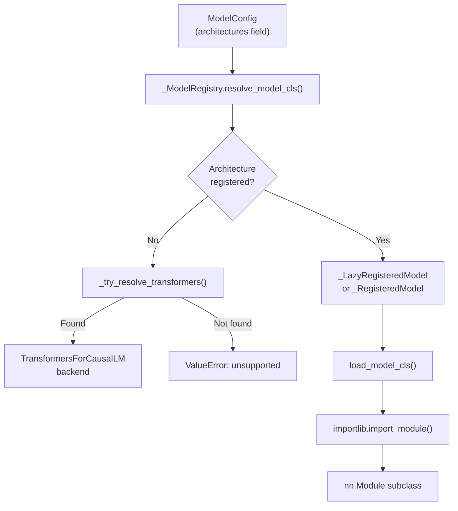
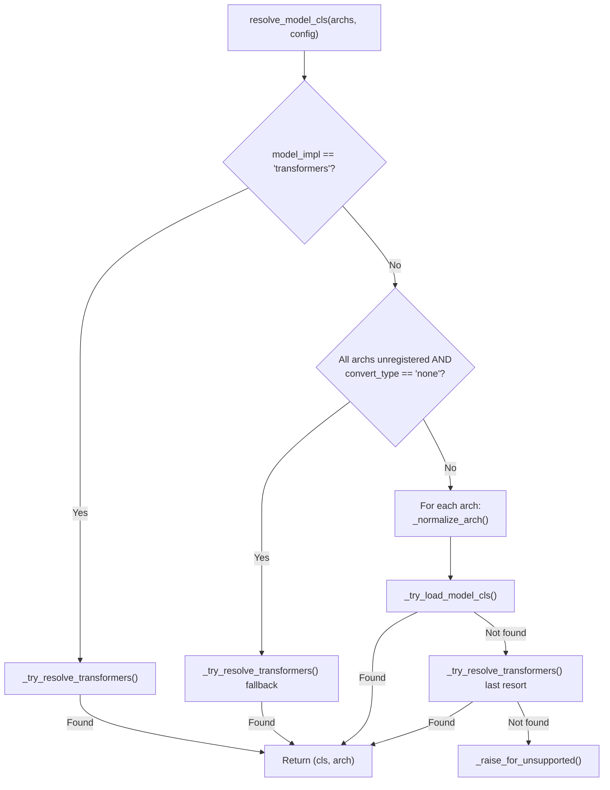

# Model Registry Internals

The model registry is the central lookup table that maps HuggingFace architecture class names to vLLM model implementations. It lives in `vllm/model_executor/models/registry.py` and is the first thing consulted when vLLM loads any model.

## Architecture Overview



## Registry Data Structures

### `_ModelInfo` (Frozen Dataclass)

`_ModelInfo` is a frozen dataclass that captures all capability flags for a model class **without** importing the model into the main process. It is computed once and cached to disk.

```python
@dataclass(frozen=True)
class _ModelInfo:
    architecture: str
    is_text_generation_model: bool
    is_pooling_model: bool
    attn_type: AttnTypeStr
    default_seq_pooling_type: SequencePoolingType
    default_tok_pooling_type: TokenPoolingType
    supports_cross_encoding: bool
    supports_late_interaction: bool
    supports_multimodal: bool
    supports_multimodal_raw_input_only: bool
    requires_raw_input_tokens: bool
    supports_multimodal_encoder_tp_data: bool
    supports_pp: bool
    has_inner_state: bool
    is_attention_free: bool
    is_hybrid: bool
    has_noops: bool
    supports_mamba_prefix_caching: bool
    supports_transcription: bool
    supports_transcription_only: bool
```

`_ModelInfo` is constructed from a live model class via `_ModelInfo.from_model_cls(model_cls)`, which calls all the interface-checking functions from `interfaces.py` and `interfaces_base.py`.

### `_BaseRegisteredModel` (Abstract Base)

```python
class _BaseRegisteredModel(ABC):
    @abstractmethod
    def inspect_model_cls(self) -> _ModelInfo: ...

    @abstractmethod
    def load_model_cls(self) -> type[nn.Module]: ...
```

Two concrete implementations exist:

### `_RegisteredModel`

Used for models that have **already been imported** into the main process (e.g., via `ModelRegistry.register_model()` with a live class):

```python
@dataclass(frozen=True)
class _RegisteredModel(_BaseRegisteredModel):
    interfaces: _ModelInfo
    model_cls: type[nn.Module]

    @staticmethod
    def from_model_cls(model_cls: type[nn.Module]):
        return _RegisteredModel(
            interfaces=_ModelInfo.from_model_cls(model_cls),
            model_cls=model_cls,
        )

    def inspect_model_cls(self) -> _ModelInfo:
        return self.interfaces

    def load_model_cls(self) -> type[nn.Module]:
        return self.model_cls
```

### `_LazyRegisteredModel`

Used for all built-in vLLM models. The model module is **not imported** until needed, which avoids CUDA initialization in the main process:

```python
@dataclass(frozen=True)
class _LazyRegisteredModel(_BaseRegisteredModel):
    module_name: str   # e.g. "vllm.model_executor.models.llama"
    class_name: str    # e.g. "LlamaForCausalLM"

    def load_model_cls(self) -> type[nn.Module]:
        mod = importlib.import_module(self.module_name)
        return getattr(mod, self.class_name)
```

#### Lazy Inspection with Subprocess Isolation

When `inspect_model_cls()` is called on a `_LazyRegisteredModel`, it must import the model class to read its capability flags. To avoid initializing CUDA in the main process (which would break forked subprocesses), this inspection runs in a **separate subprocess**:

```python
def inspect_model_cls(self) -> _ModelInfo:
    # Check disk cache first
    mi = self._load_modelinfo_from_cache(module_hash)
    if mi is not None:
        return mi

    # Run in subprocess to avoid CUDA init
    mi = _run_in_subprocess(
        lambda: _ModelInfo.from_model_cls(self.load_model_cls())
    )

    # Save to disk cache
    self._save_modelinfo_to_cache(mi, module_hash)
    return mi
```

#### Model Info Caching

`_LazyRegisteredModel` caches `_ModelInfo` to disk at `$VLLM_CACHE_ROOT/modelinfos/<module>-<class>.json`. The cache is keyed by a SHA hash of the model's source file. If the source file changes (e.g., after a vLLM upgrade), the cache is invalidated and rebuilt.

Cache file format:
```json
{
  "hash": "<sha256 of source file>",
  "modelinfo": {
    "architecture": "LlamaForCausalLM",
    "is_text_generation_model": true,
    "supports_pp": true,
    ...
  }
}
```

### `_ModelRegistry`

The main registry class, instantiated as the module-level singleton `ModelRegistry`:

```python
@dataclass
class _ModelRegistry:
    models: dict[str, _BaseRegisteredModel]
```

#### Key Methods

| Method | Description |
|---|---|
| `get_supported_archs()` | Returns the set of all registered architecture names |
| `register_model(arch, cls)` | Register an external model (OOT registration) |
| `inspect_model_cls(archs, config)` | Return `(_ModelInfo, arch)` without loading weights |
| `resolve_model_cls(archs, config)` | Return `(nn.Module class, arch)` for model loading |
| `is_text_generation_model(archs, config)` | Check if model generates text |
| `is_pooling_model(archs, config)` | Check if model is a pooling/embedding model |
| `is_multimodal_model(archs, config)` | Check if model supports multimodal inputs |
| `is_pp_supported_model(archs, config)` | Check if model supports pipeline parallelism |
| `is_transcription_model(archs, config)` | Check if model supports audio transcription |
| `is_attention_free_model(archs, config)` | Check if model has no attention (e.g., Mamba) |
| `is_hybrid_model(archs, config)` | Check if model has both attention and SSM layers |

## The Global `ModelRegistry` Singleton

At module load time, `ModelRegistry` is constructed from all built-in model dictionaries:

```python
ModelRegistry = _ModelRegistry(
    {
        model_arch: _LazyRegisteredModel(
            module_name=f"vllm.model_executor.models.{mod_relname}",
            class_name=cls_name,
        )
        for model_arch, (mod_relname, cls_name) in _VLLM_MODELS.items()
    }
)
```

`_VLLM_MODELS` is the union of:
- `_TEXT_GENERATION_MODELS`
- `_EMBEDDING_MODELS`
- `_CROSS_ENCODER_MODELS`
- `_MULTIMODAL_MODELS`
- `_SPECULATIVE_DECODING_MODELS`
- `_TRANSFORMERS_SUPPORTED_MODELS`
- `_TRANSFORMERS_BACKEND_MODELS`

## Architecture Resolution Flow

When vLLM needs to load a model, it calls `ModelRegistry.resolve_model_cls(architectures, model_config)`. The resolution follows this priority order:



### Architecture Normalization

`_normalize_arch()` handles the case where a model config specifies an architecture that is a variant of a registered one (e.g., a pooling variant of a generation model). It uses `try_match_architecture_defaults()` from `vllm.config` to find the base architecture.

### Transformers Backend Fallback

If an architecture is not registered in vLLM's built-in registry, the system attempts to use the HuggingFace Transformers backend via `_try_resolve_transformers()`. This checks:

1. Whether the architecture is already a `_TRANSFORMERS_BACKEND_MODELS` entry
2. Whether the model's `auto_map` in `hf_config` contains an `AutoModel` entry
3. Whether the architecture exists in the `transformers` library

## Out-of-Tree (OOT) Model Registration

External models can be registered at runtime using `ModelRegistry.register_model()`:

```python
from vllm import ModelRegistry

# Register with a live class (eager import)
from my_package.models import MyCustomModel
ModelRegistry.register_model("MyCustomForCausalLM", MyCustomModel)

# Register lazily (preferred — avoids CUDA init)
ModelRegistry.register_model(
    "MyCustomForCausalLM",
    "my_package.models:MyCustomModel"
)
```

The lazy string format is `"<module_path>:<ClassName>"`. This is the preferred approach because it avoids importing CUDA-dependent code in the main process before forking workers.

> **Warning:** If you register an architecture that is already registered, vLLM will log a warning and overwrite the existing entry.

## Subprocess Execution

The `_run_in_subprocess()` function serializes a callable using `cloudpickle`, passes it to a fresh Python interpreter via stdin, and reads the result from a temporary file:

```python
def _run_in_subprocess(fn: Callable[[], _T]) -> _T:
    with tempfile.TemporaryDirectory() as tempdir:
        output_filepath = os.path.join(tempdir, "registry_output.tmp")
        input_bytes = cloudpickle.dumps((fn, output_filepath))
        returned = subprocess.run(
            _SUBPROCESS_COMMAND,  # [sys.executable, "-m", "vllm.model_executor.models.registry"]
            input=input_bytes,
            capture_output=True
        )
        returned.check_returncode()
        with open(output_filepath, "rb") as f:
            return pickle.load(f)
```

The subprocess entry point is the `_run()` function at the bottom of `registry.py`, which is invoked when the module is run as `__main__`.

## See Also

- [Supported Models](supported-models.md)
- [Model Interfaces](model-interfaces.md)
- [Adding a New Model](adding-new-model.md)
