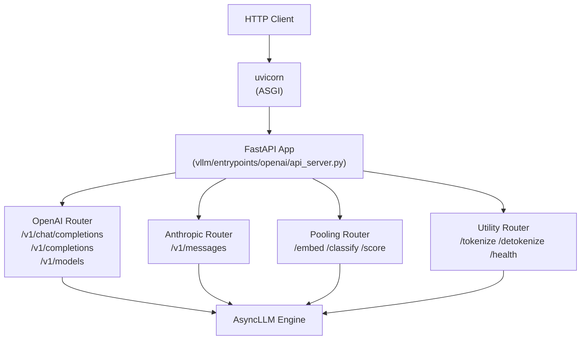

# Serving

vLLM provides a production-ready HTTP server with an OpenAI-compatible REST API, Anthropic Messages API, SageMaker endpoints, and a gRPC interface. This section covers how to deploy vLLM as a server, configure the API, and tune serving performance.

## Starting the Server

```bash
# Minimal — serve a model on port 8000
vllm serve meta-llama/Llama-3.1-8B-Instruct

# With authentication
vllm serve meta-llama/Llama-3.1-8B-Instruct --api-key my-secret-key

# Multi-GPU
vllm serve meta-llama/Llama-3.1-70B-Instruct --tensor-parallel-size 4

# With speculative decoding
vllm serve meta-llama/Llama-3.1-8B-Instruct \
  --speculative-model yuhuili/EAGLE-LLaMA3.1-Instruct-8B \
  --num-speculative-tokens 5

# With LoRA adapters
vllm serve meta-llama/Llama-3.1-8B-Instruct \
  --enable-lora \
  --lora-modules sql-lora=/path/to/sql-lora
```

## Server Architecture

The vLLM server is built on **FastAPI** with **uvicorn** as the ASGI server. The API layer is thin — it validates requests, converts them to `PromptType` inputs, and streams results back from the `AsyncLLM` engine.



## Supported APIs

| API | Endpoint Prefix | Description |
|-----|----------------|-------------|
| OpenAI Chat | `/v1/chat/completions` | Chat completions with streaming |
| OpenAI Completions | `/v1/completions` | Text completions |
| OpenAI Responses | `/v1/responses` | Stateful responses API |
| OpenAI Models | `/v1/models` | List available models |
| OpenAI Embeddings | `/v1/embeddings` | Text embeddings |
| OpenAI Audio | `/v1/audio/transcriptions` | Speech-to-text (Whisper) |
| Anthropic Messages | `/v1/messages` | Anthropic-compatible chat |
| Pooling | `/embed`, `/classify`, `/score`, `/rerank` | Embedding and ranking |
| Utilities | `/tokenize`, `/detokenize` | Token utilities |
| Health | `/health`, `/version`, `/metrics` | Operational endpoints |

## Configuration

The server is configured via CLI flags (see [CLI Args Reference](../12-api-reference/cli-args.md)) or programmatically via `VllmConfig` (see [Configuration Reference](../06-configuration/README.md)).

### High-Throughput Configuration

```bash
vllm serve meta-llama/Llama-3.1-70B-Instruct \
  --tensor-parallel-size 4 \
  --gpu-memory-utilization 0.95 \
  --max-num-seqs 256 \
  --max-num-batched-tokens 32768 \
  --enable-chunked-prefill \
  --enable-prefix-caching
```

### Low-Latency Configuration

```bash
vllm serve meta-llama/Llama-3.1-8B-Instruct \
  --gpu-memory-utilization 0.85 \
  --max-num-seqs 32 \
  --speculative-model meta-llama/Llama-3.2-1B-Instruct \
  --num-speculative-tokens 5
```

### Memory-Constrained Configuration

```bash
vllm serve meta-llama/Llama-3.1-8B-Instruct \
  --quantization fp8 \
  --gpu-memory-utilization 0.80 \
  --max-model-len 4096
```

## Authentication and Security

vLLM supports API key authentication and SSL/TLS. See [Auth & SSL](../12-api-reference/auth-ssl.md) for details.

```bash
# API key authentication
vllm serve meta-llama/Llama-3.1-8B-Instruct \
  --api-key my-secret-key

# SSL/TLS
vllm serve meta-llama/Llama-3.1-8B-Instruct \
  --ssl-certfile /path/to/cert.pem \
  --ssl-keyfile /path/to/key.pem
```

## Related Documentation

- [API Reference](../12-api-reference/README.md) — complete endpoint documentation
- [CLI Args Reference](../12-api-reference/cli-args.md) — all `vllm serve` flags
- [Configuration Reference](../06-configuration/README.md) — `VllmConfig` options
- [Deployment Guide](../15-deployment/README.md) — Docker, Kubernetes, SageMaker
- [Distributed Inference](../07-distributed/README.md) — multi-GPU and multi-node
- [Observability](../11-observability/README.md) — metrics, tracing, logging
- [Auth & SSL](../12-api-reference/auth-ssl.md) — authentication and TLS
