# Configuration Reference

vLLM uses a unified, hierarchical configuration system. Every aspect of model loading, inference, parallelism, caching, scheduling, and observability is controlled through typed Python dataclasses that are validated at startup. This section documents each configuration class in detail.

## Configuration Architecture

All configuration is consolidated into a single `VllmConfig` container (defined in `vllm/config/vllm.py`) that holds references to every sub-configuration object. This design makes it easy to pass the complete configuration through the system without threading individual parameters everywhere.

```mermaid
graph TD
    VllmConfig["VllmConfig<br/>(vllm/config/vllm.py)"]
    VllmConfig --> ModelConfig["ModelConfig<br/>model path, dtype, quantization"]
    VllmConfig --> CacheConfig["CacheConfig<br/>block_size, gpu_memory_utilization"]
    VllmConfig --> ParallelConfig["ParallelConfig<br/>TP, PP, DP, EP sizes"]
    VllmConfig --> SchedulerConfig["SchedulerConfig<br/>max_num_seqs, chunked_prefill"]
    VllmConfig --> SpeculativeConfig["SpeculativeConfig<br/>draft model, num_speculative_tokens"]
    VllmConfig --> CompilationConfig["CompilationConfig<br/>torch.compile mode, CUDA graphs"]
    VllmConfig --> LoRAConfig["LoRAConfig<br/>max_lora_rank, max_loras"]
    VllmConfig --> ObservabilityConfig["ObservabilityConfig<br/>OTLP traces, metrics"]
    VllmConfig --> OffloadConfig["OffloadConfig<br/>CPU weight offloading"]
    VllmConfig --> KVTransferConfig["KVTransferConfig<br/>disaggregated prefill/decode"]
    VllmConfig --> LoadConfig["LoadConfig<br/>load format, tensor parallel"]
    VllmConfig --> DeviceConfig["DeviceConfig<br/>target device"]
```



## Pages in This Section

| Page | Description |
|------|-------------|
| [VllmConfig](vllm-config.md) | The unified configuration container |
| [ModelConfig](model-config.md) | Model path, dtype, quantization, context length |
| [ParallelConfig](parallel-config.md) | Tensor, pipeline, data, and expert parallelism |
| [CacheConfig](cache-config.md) | KV cache block size, GPU memory, prefix caching |
| [SchedulerConfig](scheduler-config.md) | Batching, chunked prefill, scheduling policy |
| [SpeculativeConfig](speculative-config.md) | Speculative decoding draft model settings |
| [CompilationConfig](compilation-config.md) | torch.compile, CUDA graphs, fusion passes |
| [Additional Configs](additional-configs.md) | LoRA, MultiModal, Observability, Offload, KVTransfer |
| [Environment Variables](environment-variables.md) | All `VLLM_*` environment variables |

## Quick Start Examples

### Minimal Configuration

```python
from vllm import LLM

llm = LLM(model="meta-llama/Llama-3.1-8B-Instruct")
```

### High-Throughput Serving

```python
from vllm import LLM

llm = LLM(
    model="meta-llama/Llama-3.1-70B-Instruct",
    tensor_parallel_size=4,
    gpu_memory_utilization=0.95,
    max_num_seqs=256,
    max_num_batched_tokens=32768,
    enable_chunked_prefill=True,
)
```

### Low-Latency Interactive Serving

```python
from vllm import LLM

llm = LLM(
    model="meta-llama/Llama-3.1-8B-Instruct",
    gpu_memory_utilization=0.85,
    max_num_seqs=32,
    speculative_model="meta-llama/Llama-3.2-1B-Instruct",
    num_speculative_tokens=5,
)
```

### Memory-Constrained Deployment

```python
from vllm import LLM

llm = LLM(
    model="meta-llama/Llama-3.1-8B-Instruct",
    quantization="fp8",
    cpu_offload_gb=8,
    gpu_memory_utilization=0.80,
    max_model_len=4096,
)
```
