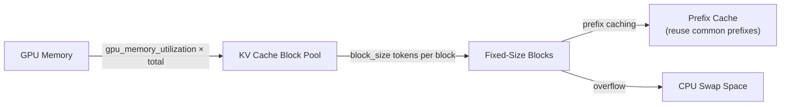
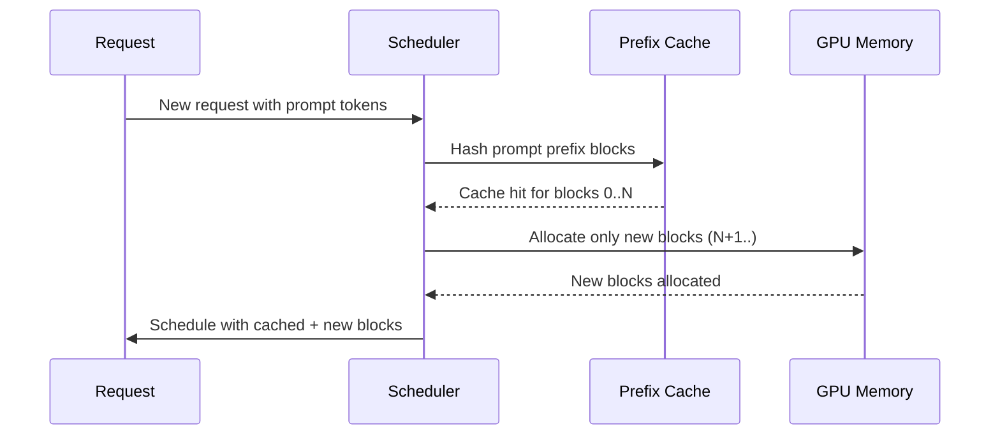

# CacheConfig

`CacheConfig` controls the KV (key-value) cache — the memory region that stores attention keys and values for all active sequences. Proper cache configuration is critical for throughput, memory efficiency, and latency. It is defined in `vllm/config/cache.py`.

## Overview

The KV cache is the primary memory consumer in LLM inference. vLLM manages it as a pool of fixed-size blocks, allocating and freeing blocks as sequences are processed. The cache configuration determines block size, how much GPU memory to reserve, whether to use prefix caching, and how to handle overflow to CPU.



## Fields

### Block Size

| Field | Type | Default | Description |
|-------|------|---------|-------------|
| `block_size` | `BlockSize` | Platform-dependent | Size of a contiguous cache block in number of tokens. Valid values: `1, 8, 16, 32, 64, 128, 256`. Set by `Platform.check_and_update_config()` if not specified. |

The block size affects:
- **Memory granularity**: Smaller blocks reduce fragmentation but increase overhead
- **Prefix caching efficiency**: Blocks are the unit of prefix cache reuse
- **Throughput**: Larger blocks can improve throughput for long sequences

### GPU Memory

| Field | Type | Default | Description |
|-------|------|---------|-------------|
| `gpu_memory_utilization` | `float` | `0.9` | Fraction of GPU memory reserved for the model executor (0 < value ≤ 1). This is a **per-instance** limit — multiple vLLM instances on the same GPU each apply their own limit independently. |
| `num_gpu_blocks_override` | `int \| None` | `None` | Override the profiled number of GPU blocks. Used for testing preemption scenarios. |
| `kv_cache_memory_bytes` | `int \| None` | `None` | Explicit KV cache size in bytes per GPU. When set, overrides `gpu_memory_utilization` for cache sizing. Provides finer-grained control. |

> **Tip**: Start with `gpu_memory_utilization=0.9` and reduce if you encounter OOM errors. For multi-tenant deployments, consider setting it lower (e.g., `0.7`) to leave headroom.

### Cache Data Type

| Field | Type | Default | Description |
|-------|------|---------|-------------|
| `cache_dtype` | `CacheDType` | `"auto"` | Data type for KV cache storage. |

Valid `cache_dtype` values:

| Value | Description |
|-------|-------------|
| `"auto"` | Use the model's data type |
| `"bfloat16"` | BF16 cache (useful for models that default to FP8) |
| `"fp8"` / `"fp8_e4m3"` | FP8 E4M3 format (CUDA 11.8+, ROCm) — reduces memory ~50% |
| `"fp8_e5m2"` | FP8 E5M2 format (CUDA 11.8+) |
| `"fp8_inc"` | FP8 for Intel Gaudi (HPU) |
| `"fp8_ds_mla"` | FP8 for DeepSeek MLA attention |

> **Note**: FP8 cache reduces GPU memory footprint and boosts performance but may cause accuracy degradation without proper scaling factors. Use `calculate_kv_scales=True` to compute scales dynamically.

| Field | Type | Default | Description |
|-------|------|---------|-------------|
| `calculate_kv_scales` | `bool` | `False` | Dynamically calculate `k_scale` and `v_scale` when `cache_dtype` is FP8. If `False`, scales are loaded from the model checkpoint (defaulting to 1.0 if not present). |

### Prefix Caching

Prefix caching allows vLLM to reuse KV cache blocks for common prompt prefixes across requests, dramatically improving throughput for workloads with shared system prompts.

| Field | Type | Default | Description |
|-------|------|---------|-------------|
| `enable_prefix_caching` | `bool` | `True` | Enable automatic prefix caching. Enabled by default. |
| `prefix_caching_hash_algo` | `PrefixCachingHashAlgo` | `"sha256"` | Hash algorithm for identifying cacheable prefixes. |

Hash algorithm options:

| Algorithm | Description | Notes |
|-----------|-------------|-------|
| `"sha256"` | SHA-256 with Pickle serialization | Default. Most secure, avoids hash collisions. |
| `"sha256_cbor"` | SHA-256 with canonical CBOR | Cross-language compatible, reproducible. |
| `"xxhash"` | xxHash (128-bit) with Pickle | Faster, non-cryptographic. Requires `xxhash` package. |
| `"xxhash_cbor"` | xxHash with canonical CBOR | Fast + reproducible. Requires `xxhash` package. |

> **Security Warning**: Non-cryptographic hash algorithms (`xxhash`) theoretically increase the risk of hash collisions, which could cause undefined behavior or information leakage in multi-tenant environments. Evaluate your security requirements before switching.

### CPU Swap Space

| Field | Type | Default | Description |
|-------|------|---------|-------------|
| `cpu_kvcache_space_bytes` | `int \| None` | `None` | CPU KV cache space in bytes (CPU backend only). |

### KV Cache Offloading

| Field | Type | Default | Description |
|-------|------|---------|-------------|
| `kv_offloading_size` | `float \| None` | `None` | Size of the KV cache offloading buffer in GiB. When TP > 1, this is the total across all TP ranks. `None` disables offloading. |
| `kv_offloading_backend` | `KVOffloadingBackend` | `"native"` | Backend for KV cache offloading: `"native"` (vLLM CPU offloading) or `"lmcache"`. |

### Sliding Window

| Field | Type | Default | Description |
|-------|------|---------|-------------|
| `sliding_window` | `int \| None` | `None` | Sliding window size for the KV cache. Primarily set from `ModelConfig` and duplicated here. |

### Mamba Cache

For hybrid Mamba/attention models:

| Field | Type | Default | Description |
|-------|------|---------|-------------|
| `mamba_block_size` | `int \| None` | `None` | Cache block size for Mamba layers. Must be a multiple of 8 (for `causal_conv1d` kernel alignment). Only valid when prefix caching is enabled. |
| `mamba_cache_dtype` | `MambaDType` | `"auto"` | Data type for Mamba cache (both conv and SSM state): `"auto"`, `"float32"`, or `"float16"`. |
| `mamba_ssm_cache_dtype` | `MambaDType` | `"auto"` | Data type for Mamba SSM state only. Overrides `mamba_cache_dtype` for SSM state. |
| `mamba_cache_mode` | `MambaCacheMode` | `"none"` | Mamba cache strategy: `"none"` (prefix caching disabled), `"all"` (cache at every `i × block_size`), or `"align"` (cache only at scheduler step boundaries). |
| `mamba_page_size_padded` | `int \| None` | `None` | Override for Mamba page size to align with attention page size in hybrid models. |

### KV Sharing

| Field | Type | Default | Description |
|-------|------|---------|-------------|
| `kv_sharing_fast_prefill` | `bool` | `False` | **Work in progress.** Enables attention metadata overrides for KV-sharing models (e.g., YOCO) to skip tokens during prefill. |

### Derived Fields (Set After Profiling)

| Field | Description |
|-------|-------------|
| `num_gpu_blocks` | Number of KV cache blocks allocated on GPU (set after memory profiling). |
| `num_cpu_blocks` | Number of KV cache blocks allocated on CPU (set after memory profiling). |
| `is_attention_free` | Whether the model is attention-free (set from `ModelConfig`). |

## Configuration Examples

### Default Configuration

```python
from vllm.config import CacheConfig

cache_config = CacheConfig()
# gpu_memory_utilization=0.9, enable_prefix_caching=True
```

### High-Memory Utilization for Maximum Throughput

```python
CacheConfig(
    gpu_memory_utilization=0.95,
    block_size=16,
    enable_prefix_caching=True,
)
```

### FP8 KV Cache for Memory Savings

```python
CacheConfig(
    cache_dtype="fp8",
    calculate_kv_scales=True,  # Compute scales dynamically
    gpu_memory_utilization=0.9,
)
```

### Disable Prefix Caching (for Unique Prompts)

```python
CacheConfig(
    enable_prefix_caching=False,
    gpu_memory_utilization=0.9,
)
```

### KV Cache Offloading to CPU

```python
CacheConfig(
    gpu_memory_utilization=0.85,
    kv_offloading_size=20.0,  # 20 GiB CPU buffer
    kv_offloading_backend="native",
)
```

### Explicit Cache Size

```python
CacheConfig(
    kv_cache_memory_bytes=40 * 1024**3,  # 40 GiB
    enable_prefix_caching=True,
)
```

## Memory Profiling

vLLM determines the number of KV cache blocks through a profiling step at startup:

1. Load the model weights into GPU memory
2. Run a forward pass with `max_num_batched_tokens` to measure peak activation memory
3. Calculate remaining GPU memory: `total × gpu_memory_utilization - model_weights - activations`
4. Divide by the per-block memory size to get `num_gpu_blocks`

This profiling ensures vLLM uses as much GPU memory as safely possible without OOM errors.

## Prefix Caching Internals

When prefix caching is enabled, vLLM maintains a hash-indexed cache of KV blocks:



Blocks are identified by a hash of their token content. When a new request shares a prefix with a cached sequence, those blocks are reused directly — avoiding redundant computation.

## Related Pages

- [VllmConfig](vllm-config.md) — the parent container
- [SchedulerConfig](scheduler-config.md) — how batching interacts with cache
- [ModelConfig](model-config.md) — model dtype affects cache dtype
- [Environment Variables](environment-variables.md) — `VLLM_CPU_KVCACHE_SPACE`
