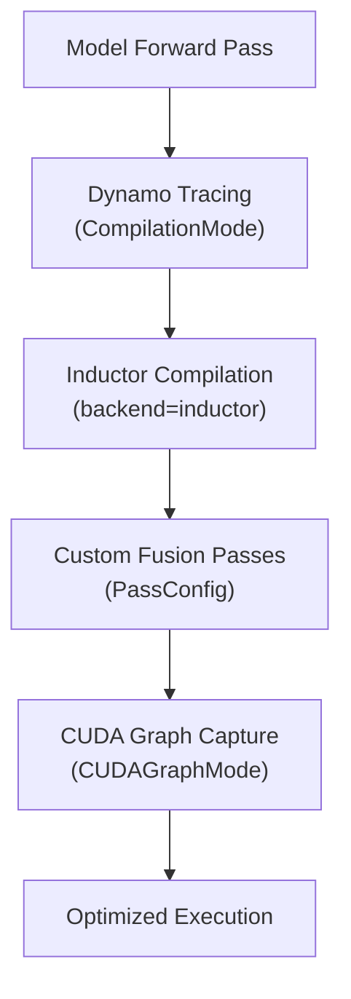

# CompilationConfig

`CompilationConfig` controls how vLLM uses `torch.compile` and CUDA graph capture to optimize model execution. It is defined in `vllm/config/compilation.py` and contains sub-configurations for compilation mode, CUDA graph capture sizes, and custom Inductor fusion passes.

## Overview

vLLM's compilation pipeline has three main components:

1. **Compilation Mode** — whether and how to use `torch.compile` (Dynamo + Inductor)
2. **CUDA Graph Capture** — capturing execution graphs for fixed-size batches to eliminate Python overhead
3. **Custom Passes** — operator fusion passes that combine operations like RMSNorm + quantization



## Compilation Mode

The `mode` field selects the compilation approach:

| Mode | Value | Description |
|------|-------|-------------|
| `NONE` | `0` | No compilation. Fully eager PyTorch execution. |
| `STOCK_TORCH_COMPILE` | `1` | Standard `torch.compile` pipeline. |
| `DYNAMO_TRACE_ONCE` | `2` | Single Dynamo trace, no recompilation. Requires no dynamic-shape-dependent control flow. |
| `VLLM_COMPILE` | `3` | Custom vLLM Inductor backend with caching, piecewise compilation, shape specialization, and custom passes. **Default for V1 engine.** |

```python
from vllm.config import CompilationConfig
from vllm.config.compilation import CompilationMode

# Disable compilation (fastest startup, slowest inference)
config = CompilationConfig(mode=CompilationMode.NONE)

# Full vLLM compilation (default)
config = CompilationConfig(mode=CompilationMode.VLLM_COMPILE)
```

## CUDA Graph Mode

The `cudagraph_mode` field controls how CUDA graphs are captured:

| Mode | Description |
|------|-------------|
| `NONE` | No CUDA graph capture. |
| `PIECEWISE` | Piecewise CUDA graphs — attention ops run outside the graph, everything else is captured. |
| `FULL` | Full CUDA graph for all batches. Good for small models or small-prompt workloads. |
| `FULL_DECODE_ONLY` | Full CUDA graph for decode-only batches; mixed prefill-decode batches run without graphs. |
| `FULL_AND_PIECEWISE` | Full CUDA graph for decode batches + piecewise for prefill/mixed batches. **Default (V1 engine).** |

```python
from vllm.config.compilation import CUDAGraphMode

config = CompilationConfig(
    cudagraph_mode=CUDAGraphMode.FULL_AND_PIECEWISE,
)
```

## Top-Level Compilation Fields

| Field | Type | Default | Description |
|-------|------|---------|-------------|
| `mode` | `CompilationMode` | `None` (→ 3 for V1) | Compilation approach. |
| `debug_dump_path` | `Path \| None` | `None` | Path to dump debug information (FX graphs, etc.). |
| `cache_dir` | `str` | `""` | Directory for compiled graph cache. Auto-generated from model info if empty. |
| `compile_cache_save_format` | `Literal["binary", "unpacked"]` | `"binary"` | Format for saving torch compile cache. `"binary"` is multiprocess-safe; `"unpacked"` is human-readable but not multiprocess-safe. |
| `backend` | `str` | `""` | Compilation backend. `""` → `"inductor"` on CUDA. Can be `"eager"`, `"openxla"`, or a fully-qualified function name. |
| `custom_ops` | `list[str]` | `[]` | Fine-grained control over custom ops. Use `"all"` to enable all, `"none"` to disable all, `"+op"` to enable, `"-op"` to disable. |
| `splitting_ops` | `list[str] \| None` | `None` | Ops excluded from CUDA graphs (used in piecewise compilation). `None` → defaults to attention ops. `[]` → no ops excluded (full CUDA graphs). |
| `compile_mm_encoder` | `bool` | `False` | Whether to compile the multimodal encoder. Currently only works for `Qwen2_5_vl` and `mLLaMa4` on selected platforms. |

## CUDA Graph Capture Configuration

| Field | Type | Default | Description |
|-------|------|---------|-------------|
| `cudagraph_mode` | `CUDAGraphMode` | `None` (→ `FULL_AND_PIECEWISE`) | CUDA graph capture mode. |
| `cudagraph_capture_sizes` | `list[int] \| None` | `None` | Explicit list of batch sizes to capture. If `None`, sizes are auto-generated. |
| `max_cudagraph_capture_size` | `int` | `None` | Maximum batch size to capture. Auto-set to `min(max_num_seqs × 2, 512)` if not specified. |
| `cudagraph_num_of_warmups` | `int` | `0` | Number of warmup runs before recording the CUDA graph. |
| `cudagraph_copy_inputs` | `bool` | `False` | Copy input tensors for CUDA graph capture. Set `True` if input buffers change between calls. Only effective in `PIECEWISE` mode. |
| `cudagraph_specialize_lora` | `bool` | `True` | Create separate CUDA graphs for cases with and without active LoRA adapters. |

### Auto-Generated Capture Sizes

When `cudagraph_capture_sizes` is `None`, sizes are generated as:

```
[1, 2, 4] + list(range(8, 256, 8)) + list(range(256, max_cudagraph_capture_size + 1, 16))
```

This covers small batch sizes (important for decode) with fine granularity, and larger sizes with coarser steps.

## Inductor Compilation Configuration

| Field | Type | Default | Description |
|-------|------|---------|-------------|
| `compile_sizes` | `list[int \| str] \| None` | `None` | Specific batch sizes to compile with Inductor. Supports `"cudagraph_capture_sizes"` as a special value. |
| `compile_ranges_split_points` | `list[int] \| None` | `None` | Split points defining compile ranges. Ranges are `[1, split[0]]`, `[split[0]+1, split[1]]`, ..., `[split[-1]+1, max_num_batched_tokens]`. |
| `inductor_compile_config` | `dict` | `{}` | Additional Inductor configuration options. |
| `inductor_passes` | `dict[str, str]` | `{}` | Additional Inductor passes as a dict from pass name to fully-qualified function name. |
| `use_inductor_graph_partition` | `bool` | `None` | Use Inductor graph partitioning to split at CUDA-graph-unsafe ops. Enables both full and piecewise CUDA graphs without compiling twice. |

## PassConfig — Custom Fusion Passes

`PassConfig` controls which custom operator fusion passes are enabled. These passes combine multiple operations into single fused kernels for better performance.

```python
from vllm.config.compilation import PassConfig

pass_config = PassConfig(
    fuse_norm_quant=True,      # Fuse RMSNorm + quantization
    fuse_act_quant=True,       # Fuse SiluMul + quantization
    fuse_allreduce_rms=True,   # Fuse allreduce + RMSNorm (TP > 1, Hopper/Blackwell)
    eliminate_noops=True,      # Eliminate no-op operations
)
```

### Fusion Pass Fields

| Field | Type | Default | Description |
|-------|------|---------|-------------|
| `fuse_norm_quant` | `bool` | `None` | Fuse custom RMSNorm + quantization ops. |
| `fuse_act_quant` | `bool` | `None` | Fuse custom SiluMul + quantization ops. |
| `fuse_attn_quant` | `bool` | `None` | Fuse custom attention + quantization ops. |
| `eliminate_noops` | `bool` | `True` | Eliminate no-op operations. Required for most fusions to work correctly. |
| `enable_sp` | `bool` | `None` | Enable sequence parallelism. Requires TP > 1. Auto-disabled if hidden size is too small. |
| `fuse_gemm_comms` | `bool` | `None` | Enable async TP (fuse GEMM + communication). |
| `fuse_allreduce_rms` | `bool` | `None` | Enable FlashInfer allreduce + RMSNorm fusion. Requires TP > 1, Hopper/Blackwell GPU, and FlashInfer. |
| `enable_qk_norm_rope_fusion` | `bool` | `False` | Enable fused Q/K RMSNorm + RoPE pass. |
| `fuse_act_padding` | `bool` | `None` | Fuse RMSNorm + padding ops (ROCm/AITER specific). |
| `fuse_rope_kvcache` | `bool` | `None` | Fuse QK RoPE + KV cache ops (ROCm/AITER specific). |
| `rope_kvcache_fusion_max_token_num` | `int` | `256` | Token threshold for ROCm AITER RoPE+KVCache fusion. |
| `fi_allreduce_fusion_max_size_mb` | `float \| None` | `None` | Max tensor size (MB) for FlashInfer fused allreduce. |
| `sp_min_token_num` | `int \| None` | `None` | Minimum token count for sequence parallelism activation. |

## Dynamic Shapes Configuration

`DynamicShapesConfig` controls how `torch.compile` handles dynamic tensor shapes:

| Field | Type | Default | Description |
|-------|------|---------|-------------|
| `type` | `DynamicShapesType` | `"backed"` | Dynamic shapes handling: `"backed"` (default PyTorch), `"unbacked"` (no guards), or `"backed_size_oblivious"` (experimental). |
| `evaluate_guards` | `bool` | `False` | Debug mode — fail if Dynamo specializes a dynamic shape by guarding on it. |
| `assume_32_bit_indexing` | `bool` | `False` | Assume all tensor sizes fit in 32-bit indexing. Requires PyTorch 2.10+. |

## Additional Fields

| Field | Type | Default | Description |
|-------|------|---------|-------------|
| `fast_moe_cold_start` | `bool \| None` | `None` | Optimization for fast MoE cold start. `True` = always on, `False` = always off, `None` = on except for speculative decoding. |

## Optimization Level Presets

The `VllmConfig.optimization_level` field automatically configures `CompilationConfig` and `PassConfig`:

| Level | `cudagraph_mode` | Fusion Passes | FlashInfer Autotune |
|-------|-----------------|---------------|---------------------|
| O0 | `NONE` | All disabled | Disabled |
| O1 | `PIECEWISE` | norm+act fusion | Enabled |
| O2 (default) | `FULL_AND_PIECEWISE` | All fusions | Enabled |
| O3 | `FULL_AND_PIECEWISE` | All fusions | Enabled |

## Configuration Examples

### Disable Compilation (Development/Debugging)

```python
from vllm import LLM

llm = LLM(
    model="meta-llama/Llama-3.1-8B-Instruct",
    compilation_config={"mode": 0},  # CompilationMode.NONE
)
```

### Custom CUDA Graph Sizes

```python
llm = LLM(
    model="meta-llama/Llama-3.1-8B-Instruct",
    compilation_config={
        "cudagraph_capture_sizes": [1, 2, 4, 8, 16, 32, 64, 128],
        "cudagraph_mode": "FULL_AND_PIECEWISE",
    },
)
```

### Enable All Fusion Passes

```python
llm = LLM(
    model="meta-llama/Llama-3.1-8B-Instruct",
    compilation_config={
        "mode": 3,
        "pass_config": {
            "fuse_norm_quant": True,
            "fuse_act_quant": True,
            "fuse_allreduce_rms": True,
            "eliminate_noops": True,
        },
    },
)
```

### CLI Shorthand

The `-cc` flag provides a shorthand for compilation config:

```bash
# Set compilation mode to 3
vllm serve meta-llama/Llama-3.1-8B-Instruct -cc.mode=3

# Set CUDA graph sizes
vllm serve meta-llama/Llama-3.1-8B-Instruct -cc='{"mode": 3, "cudagraph_capture_sizes": [1, 2, 4, 8]}'
```

## Related Pages

- [VllmConfig](vllm-config.md) — optimization levels and performance modes
- [Environment Variables](environment-variables.md) — `VLLM_DISABLE_COMPILE_CACHE`, `VLLM_USE_AOT_COMPILE`, `VLLM_DEBUG_DUMP_PATH`
