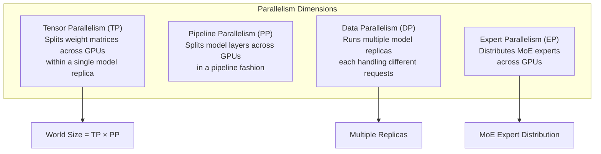
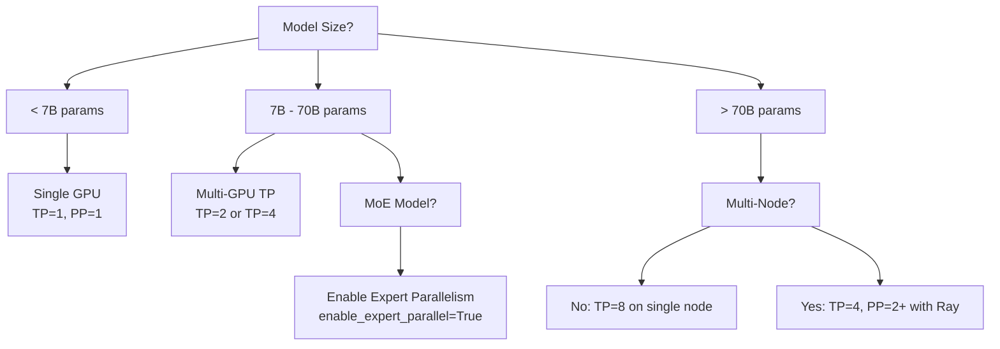

# ParallelConfig

`ParallelConfig` controls all aspects of distributed inference — tensor parallelism, pipeline parallelism, data parallelism, expert parallelism, and the backend used to coordinate workers. It is defined in `vllm/config/parallel.py`.

## Overview

vLLM supports four orthogonal parallelism dimensions that can be combined:



## Core Parallelism Fields

| Field | Type | Default | Description |
|-------|------|---------|-------------|
| `tensor_parallel_size` | `int` | `1` | Number of tensor parallel groups. Splits weight matrices (attention heads, MLP columns) across this many GPUs. |
| `pipeline_parallel_size` | `int` | `1` | Number of pipeline parallel stages. Splits model layers across this many GPUs. |
| `data_parallel_size` | `int` | `1` | Number of data parallel replicas. MoE layers are sharded according to `TP × DP`. |
| `data_parallel_size_local` | `int` | `1` | Number of local data parallel groups (within a node). |
| `prefill_context_parallel_size` | `int` | `1` | Number of prefill context parallel groups. |
| `decode_context_parallel_size` | `int` | `1` | Number of decode context parallel groups. Reuses TP group GPUs; `tp_size` must be divisible by this value. |

> **World Size**: The total number of workers per replica is `tensor_parallel_size × pipeline_parallel_size`. This determines how many GPU processes are spawned.

## Expert Parallelism (MoE)

For Mixture-of-Experts models, vLLM provides dedicated expert parallelism support:

| Field | Type | Default | Description |
|-------|------|---------|-------------|
| `enable_expert_parallel` | `bool` | `False` | Use expert parallelism instead of tensor parallelism for MoE layers. |
| `enable_eplb` | `bool` | `False` | Enable Expert Parallel Load Balancing (EPLB) for MoE layers. |
| `eplb_config` | `EPLBConfig` | `EPLBConfig()` | EPLB configuration (window size, step interval, redundant experts). |
| `expert_placement_strategy` | `ExpertPlacementStrategy` | `"linear"` | How experts are distributed across ranks: `"linear"` (contiguous) or `"round_robin"`. |
| `all2all_backend` | `All2AllBackend` | `"allgather_reducescatter"` | All-to-All communication backend for MoE expert parallel. |
| `is_moe_model` | `bool \| None` | `None` | Whether the deployed model is MoE (if known in advance). |

### All-to-All Backends

| Backend | Description |
|---------|-------------|
| `"naive"` | Naive all-to-all using broadcasts |
| `"allgather_reducescatter"` | All-to-all based on allgather + reducescatter (default) |
| `"pplx"` | PPLX kernels |
| `"deepep_high_throughput"` | DeepEP high-throughput kernels |
| `"deepep_low_latency"` | DeepEP low-latency kernels |
| `"mori"` | Mori kernels |
| `"flashinfer_all2allv"` | FlashInfer alltoallv kernels for MNNVL |

### EPLBConfig

```python
from vllm.config import EPLBConfig

eplb = EPLBConfig(
    window_size=1000,          # Window for expert load recording
    step_interval=3000,        # Steps between expert rearrangement
    num_redundant_experts=2,   # Extra redundant experts
    log_balancedness=False,    # Log balancedness (adds communication overhead)
    use_async=False,           # Non-blocking EPLB
    policy="default",          # Load balancing policy
)
```

## Distributed Executor Backend

| Field | Type | Default | Description |
|-------|------|---------|-------------|
| `distributed_executor_backend` | `str \| None` | `None` | Backend for coordinating distributed workers: `"ray"`, `"mp"` (multiprocessing), `"uni"` (single process), or `"external_launcher"`. |

### Ray vs. Multiprocessing

| Backend | When to Use |
|---------|-------------|
| `"mp"` (multiprocessing) | Single-node deployments. Automatically selected when `TP × PP ≤ available GPUs`. |
| `"ray"` | Multi-node deployments or when Ray is already in use. Must be set explicitly. |
| `"uni"` | Single-process mode (no parallelism). |
| `"external_launcher"` | When an external launcher (e.g., `torchrun`) manages process creation. |

> **Note**: TPU backends only support Ray for distributed inference.

## Data Parallelism Configuration

| Field | Type | Default | Description |
|-------|------|---------|-------------|
| `data_parallel_rank` | `int` | `0` | Rank of this instance in the data parallel group. |
| `data_parallel_master_ip` | `str` | `"127.0.0.1"` | IP address of the data parallel master. |
| `data_parallel_master_port` | `int` | `29500` | Port of the data parallel master. |
| `data_parallel_rpc_port` | `int` | `29550` | Port for data parallel messaging. |
| `data_parallel_backend` | `DataParallelBackend` | `"mp"` | Backend for data parallel: `"mp"` or `"ray"`. |
| `data_parallel_external_lb` | `bool` | `False` | Use external DP load balancing (for Kubernetes one-pod-per-rank setups). |
| `data_parallel_hybrid_lb` | `bool` | `False` | Hybrid DP load balancing — per-node AsyncLLM with external LB between nodes. |

## Multi-Node Configuration

| Field | Type | Default | Description |
|-------|------|---------|-------------|
| `master_addr` | `str` | `"127.0.0.1"` | Distributed master address for multi-node inference (multiprocessing backend). |
| `master_port` | `int` | `29501` | Distributed master port for multi-node inference. |
| `node_rank` | `int` | `0` | Node rank in multi-node setup. |
| `nnodes` | `int` | `1` | Total number of nodes. |
| `distributed_timeout_seconds` | `int \| None` | `None` | Timeout for distributed operations (e.g., `init_process_group`). Increase for multi-node setups with slow model downloads. |

## Advanced Options

| Field | Type | Default | Description |
|-------|------|---------|-------------|
| `disable_custom_all_reduce` | `bool` | `False` | Disable the custom all-reduce kernel and fall back to NCCL. |
| `max_parallel_loading_workers` | `int \| None` | `None` | Maximum parallel workers for sequential model loading (avoids RAM OOM with large TP). |
| `ray_workers_use_nsight` | `bool` | `False` | Profile Ray workers with Nsight. |
| `ray_runtime_env` | `RuntimeEnv \| None` | `None` | Ray runtime environment for distributed workers. |
| `placement_group` | `PlacementGroup \| None` | `None` | Ray placement group for distributed model workers. |
| `enable_elastic_ep` | `bool` | `False` | Enable elastic expert parallelism with stateless NCCL groups. |
| `enable_dbo` | `bool` | `False` | Enable dual batch overlap for the model executor. |
| `worker_cls` | `str` | `"auto"` | Full class name of the worker class. `"auto"` selects based on platform. |
| `worker_extension_cls` | `str` | `""` | Worker extension class for injecting new attributes/methods via `collective_rpc`. |

## Derived Fields

| Field | Description |
|-------|-------------|
| `world_size` | Computed as `tensor_parallel_size × pipeline_parallel_size`. Determines the number of workers created. |
| `data_parallel_index` | Equal to `data_parallel_rank` but not used for torch process groups. |

## Configuration Examples

### Single-GPU (Default)

```python
ParallelConfig()  # All sizes default to 1
```

### 4-GPU Tensor Parallelism

```python
ParallelConfig(
    tensor_parallel_size=4,
    distributed_executor_backend="mp",  # Single node
)
```

### 2-Node, 8-GPU Pipeline + Tensor Parallelism

```python
ParallelConfig(
    tensor_parallel_size=4,
    pipeline_parallel_size=2,
    distributed_executor_backend="ray",
    nnodes=2,
    master_addr="192.168.1.100",
    master_port=29501,
)
```

### MoE Model with Expert Parallelism

```python
ParallelConfig(
    tensor_parallel_size=8,
    enable_expert_parallel=True,
    all2all_backend="deepep_high_throughput",
    enable_eplb=True,
    eplb_config=EPLBConfig(
        num_redundant_experts=4,
        step_interval=1000,
    ),
)
```

### Data Parallel Serving (Multiple Replicas)

```python
ParallelConfig(
    tensor_parallel_size=2,
    data_parallel_size=4,  # 4 replicas, each using 2 GPUs
    data_parallel_backend="ray",
)
```

## Parallelism Strategy Selection Guide



## Related Pages

- [VllmConfig](vllm-config.md) — the parent container
- [Distributed Inference](../07-distributed/README.md) — detailed distributed setup guide
- [Environment Variables](environment-variables.md) — `VLLM_WORKER_MULTIPROC_METHOD` and related vars
