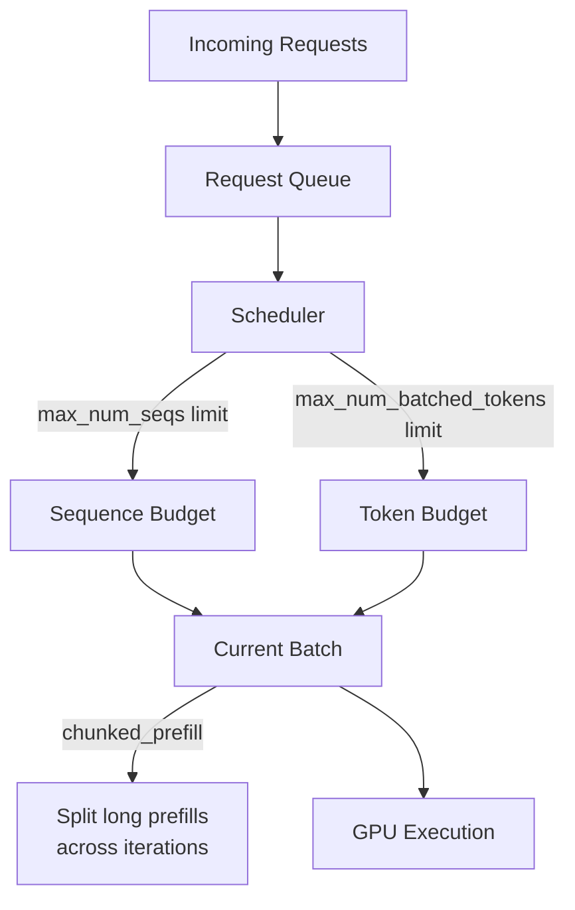

# SchedulerConfig

`SchedulerConfig` controls how vLLM batches and schedules requests — the maximum number of concurrent sequences, token budget per iteration, chunked prefill behavior, and scheduling policy. It is defined in `vllm/config/scheduler.py`.

## Overview

The scheduler is the heart of vLLM's throughput optimization. It decides which requests to process in each iteration, how many tokens to include, and whether to split long prefills across multiple steps (chunked prefill). Getting the scheduler configuration right is key to balancing latency and throughput.



## Fields

### Batch Size Limits

| Field | Type | Default | Description |
|-------|------|---------|-------------|
| `max_num_seqs` | `int` | `128` | Maximum number of sequences processed in a single iteration. Controls the maximum batch size. |
| `max_num_batched_tokens` | `int` | `2048` | Maximum number of tokens processed in a single iteration. This is the primary throughput knob. |
| `max_num_scheduled_tokens` | `int \| None` | `None` | Maximum tokens the scheduler may issue per iteration. Usually equal to `max_num_batched_tokens`, but can be smaller for speculative decoding. Defaults to `max_num_batched_tokens`. |

> **Production Note**: The default values (`max_num_seqs=128`, `max_num_batched_tokens=2048`) are set for testing convenience. In production, `EngineArgs.create_engine_config()` sets these based on the model and hardware. For high-throughput serving, values like `max_num_batched_tokens=32768` are common.

### Chunked Prefill

Chunked prefill allows long prompt processing to be split across multiple iterations, enabling decode requests to interleave with prefill work and reducing time-to-first-token for waiting requests.

| Field | Type | Default | Description |
|-------|------|---------|-------------|
| `enable_chunked_prefill` | `bool` | `True` | Enable chunked prefill. When enabled, prefill requests can be split based on remaining `max_num_batched_tokens`. |
| `max_num_partial_prefills` | `int` | `1` | Maximum number of sequences that can be partially prefilled concurrently. |
| `max_long_partial_prefills` | `int` | `1` | Maximum number of "long" prompts (longer than `long_prefill_token_threshold`) prefilled concurrently. Setting this lower than `max_num_partial_prefills` allows shorter prompts to jump ahead of longer ones. |
| `long_prefill_token_threshold` | `int` | `0` | A prompt is considered "long" if it exceeds this many tokens. When `max_num_partial_prefills > 1` and this is `0`, it defaults to `4% of max_model_len`. |
| `disable_chunked_mm_input` | `bool` | `False` | When chunked prefill is enabled, do not partially schedule multimodal items. Ensures image/video tokens are scheduled atomically. |

#### How Chunked Prefill Works

Without chunked prefill, a long prompt (e.g., 8192 tokens) blocks the GPU for the entire prefill duration, starving decode requests. With chunked prefill:

```
Iteration 1: [Prefill tokens 0-2047] + [Decode tokens for active seqs]
Iteration 2: [Prefill tokens 2048-4095] + [Decode tokens]
Iteration 3: [Prefill tokens 4096-6143] + [Decode tokens]
Iteration 4: [Prefill tokens 6144-8191] + [Decode tokens]
```

This dramatically reduces time-to-first-token for decode requests waiting behind a long prefill.

### Scheduling Policy

| Field | Type | Default | Description |
|-------|------|---------|-------------|
| `policy` | `SchedulerPolicy` | `"fcfs"` | Scheduling policy: `"fcfs"` (first-come-first-served) or `"priority"` (lower priority value = earlier handling, with arrival time as tiebreaker). |

### Async Scheduling

| Field | Type | Default | Description |
|-------|------|---------|-------------|
| `async_scheduling` | `bool \| None` | `None` | Enable async scheduling to avoid gaps in GPU utilization. Improves latency and throughput. When `None`, the default is determined by the environment. |
| `disable_nccl_for_dp_synchronization` | `bool \| None` | `None` | Force Gloo instead of NCCL for DP synchronization. Defaults to `True` when async scheduling is enabled. |

### Streaming

| Field | Type | Default | Description |
|-------|------|---------|-------------|
| `stream_interval` | `int` | `1` | Token buffer size for streaming. `1` = send each token immediately (smoothest streaming). Larger values (e.g., `10`) reduce host overhead and may increase throughput by batching tokens before sending. |

### Hybrid KV Cache

| Field | Type | Default | Description |
|-------|------|---------|-------------|
| `disable_hybrid_kv_cache_manager` | `bool \| None` | `None` | If `True`, allocate the same KV cache size for all attention layers even when the model has mixed attention types (e.g., full attention + sliding window). |

### Custom Scheduler

| Field | Type | Default | Description |
|-------|------|---------|-------------|
| `scheduler_cls` | `str \| type \| None` | `None` | Custom scheduler class. Defaults to `vllm.v1.core.sched.scheduler.Scheduler` (or `AsyncScheduler` when async scheduling is enabled). Can be a fully-qualified class name string or a class object. |

### Multimodal

| Field | Type | Default | Description |
|-------|------|---------|-------------|
| `is_multimodal_model` | `bool` | `False` | Whether the model is multimodal. |
| `max_num_encoder_input_tokens` | `int` | (derived) | Multimodal encoder compute budget. Set to `max_num_batched_tokens` unless the max multimodal embedding size is larger. |
| `encoder_cache_size` | `int` | (derived) | Multimodal encoder cache size. |

### Runner Type

| Field | Type | Default | Description |
|-------|------|---------|-------------|
| `runner_type` | `RunnerType` | `"generate"` | The runner type: `"generate"`, `"pooling"`, or `"draft"`. |

## Initialization Variables

`SchedulerConfig` requires two initialization variables that are provided by `ModelConfig`:

| InitVar | Description |
|---------|-------------|
| `max_model_len` | Maximum sequence length. Used to validate and set defaults for other fields. |
| `is_encoder_decoder` | If `True`, chunked prefill and prefix caching are automatically disabled. |

## Default Factory

Because `SchedulerConfig` requires `InitVar` parameters, it provides a `default_factory` static method:

```python
# Used internally by VllmConfig
scheduler_config = SchedulerConfig.default_factory(
    max_model_len=8192,
    is_encoder_decoder=False,
    max_num_batched_tokens=32768,
    max_num_seqs=256,
)
```

## Configuration Examples

### High-Throughput Batch Processing

```python
from vllm.config import SchedulerConfig

scheduler_config = SchedulerConfig.default_factory(
    max_model_len=8192,
    is_encoder_decoder=False,
    max_num_batched_tokens=32768,
    max_num_seqs=256,
    enable_chunked_prefill=True,
)
```

### Low-Latency Interactive Serving

```python
SchedulerConfig.default_factory(
    max_model_len=4096,
    is_encoder_decoder=False,
    max_num_batched_tokens=4096,
    max_num_seqs=32,
    enable_chunked_prefill=True,
    stream_interval=1,  # Send tokens immediately
)
```

### Priority-Based Scheduling

```python
SchedulerConfig.default_factory(
    max_model_len=8192,
    is_encoder_decoder=False,
    max_num_batched_tokens=16384,
    max_num_seqs=128,
    policy="priority",
)
```

### Concurrent Long Prefills

```python
SchedulerConfig.default_factory(
    max_model_len=32768,
    is_encoder_decoder=False,
    max_num_batched_tokens=8192,
    max_num_seqs=64,
    enable_chunked_prefill=True,
    max_num_partial_prefills=4,      # Up to 4 concurrent partial prefills
    max_long_partial_prefills=2,     # At most 2 "long" prompts at once
    long_prefill_token_threshold=2048,
)
```

## Throughput vs. Latency Trade-offs

| Setting | High Throughput | Low Latency |
|---------|-----------------|-------------|
| `max_num_batched_tokens` | Large (16K–64K) | Small (2K–8K) |
| `max_num_seqs` | Large (128–512) | Small (16–64) |
| `enable_chunked_prefill` | `True` | `True` (still beneficial) |
| `stream_interval` | Large (5–20) | `1` |
| `async_scheduling` | `True` | `True` |

## Hash Computation

`SchedulerConfig.compute_hash()` includes `max_num_batched_tokens` in the hash because:

1. LoRA creates static buffers based on `max_num_batched_tokens` — tensor sizes are captured in the `torch.compile` graph
2. Inductor decides between 32-bit and 64-bit indexing based on data sizes, which `max_num_batched_tokens` influences

## Related Pages

- [VllmConfig](vllm-config.md) — the parent container
- [CacheConfig](cache-config.md) — KV cache interacts with scheduler decisions
- [SpeculativeConfig](speculative-config.md) — speculative decoding affects `max_num_scheduled_tokens`
- [Environment Variables](environment-variables.md) — `VLLM_LOG_BATCHSIZE_INTERVAL`
