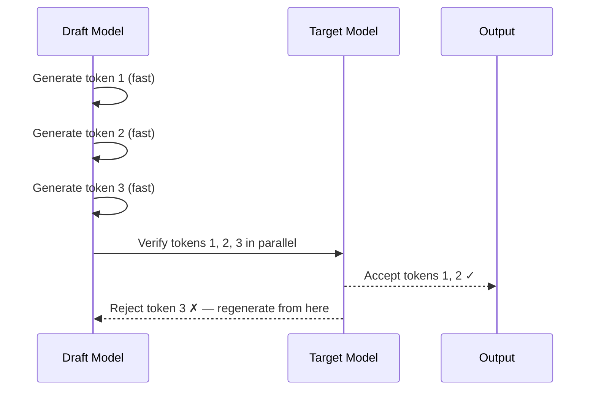
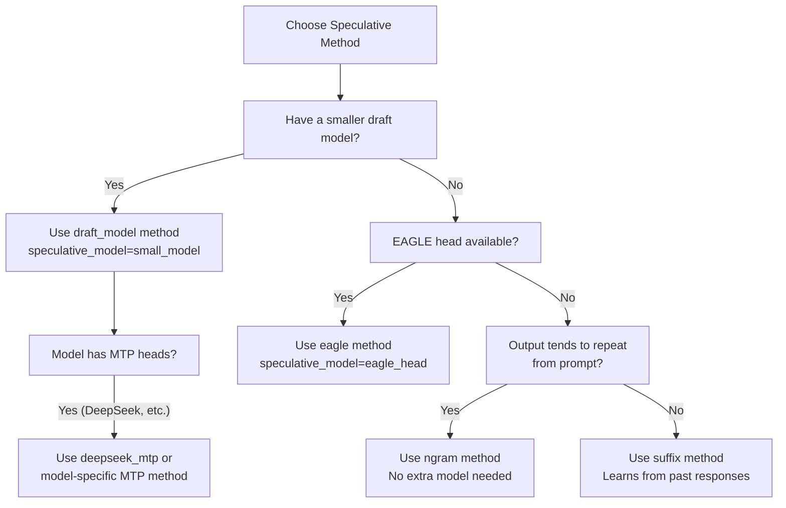

# SpeculativeConfig

`SpeculativeConfig` controls speculative decoding — a technique that uses a small "draft" model to propose multiple tokens at once, which the larger "target" model then verifies in parallel. This can significantly improve throughput and reduce latency for generation-heavy workloads. It is defined in `vllm/config/speculative.py`.

## Overview

Speculative decoding works by having a fast draft model generate `N` candidate tokens, then running the target model once to verify all `N` tokens simultaneously. Accepted tokens are kept; rejected tokens are discarded and regeneration begins from the rejection point.



## Speculative Methods

vLLM supports multiple speculative decoding methods:

| Method | Description |
|--------|-------------|
| `"draft_model"` | Use a separate smaller model as the draft model |
| `"eagle"` | EAGLE — efficient draft using a lightweight head on target hidden states |
| `"eagle3"` | EAGLE3 — uses auxiliary hidden states from multiple layers |
| `"ngram"` | N-gram based speculation from the prompt itself |
| `"ngram_gpu"` | GPU-accelerated n-gram speculation |
| `"medusa"` | Medusa — multiple draft heads on the target model |
| `"mlp_speculator"` | MLP-based speculator |
| `"suffix"` | Suffix decoding using a global suffix tree |
| `"extract_hidden_states"` | Extract hidden states for custom speculation |
| MTP types | `"deepseek_mtp"`, `"mimo_mtp"`, `"glm4_moe_mtp"`, and others for multi-token prediction |

## Fields

### Core Configuration

| Field | Type | Default | Description |
|-------|------|---------|-------------|
| `num_speculative_tokens` | `int` | `None` | Number of tokens to speculate per step. Defaults to the draft model's config value if present; otherwise required. |
| `model` | `str \| None` | `None` | Name or path of the draft model, EAGLE head, or additional weights. |
| `method` | `SpeculativeMethod \| None` | `None` | Speculative method to use. Auto-detected from `model` if possible. Required when `model` is not provided. |
| `enforce_eager` | `bool \| None` | `None` | Override `enforce_eager` from `model_config` for the speculative setup. |

### Draft Model Configuration

| Field | Type | Default | Description |
|-------|------|---------|-------------|
| `draft_tensor_parallel_size` | `int \| None` | `None` | Tensor parallel size for the draft model. Must be `1` or equal to the target model's TP size. |
| `quantization` | `str \| None` | `None` | Quantization method for the draft model weights. |
| `max_model_len` | `int \| None` | `None` | Maximum model length for the draft model. |
| `revision` | `str \| None` | `None` | Specific version of the draft model (branch, tag, or commit ID). |
| `code_revision` | `str \| None` | `None` | Specific code revision for the draft model on HuggingFace Hub. |
| `draft_load_config` | `LoadConfig \| None` | `None` | Load config for the draft model. Defaults to the target model's load config. |

### N-gram Proposer

| Field | Type | Default | Description |
|-------|------|---------|-------------|
| `prompt_lookup_max` | `int \| None` | `None` | Maximum n-gram window size. Required when `method="ngram"`. |
| `prompt_lookup_min` | `int \| None` | `None` | Minimum n-gram window size. Defaults to `1`. |

### Advanced Options

| Field | Type | Default | Description |
|-------|------|---------|-------------|
| `disable_padded_drafter_batch` | `bool` | `False` | Disable input padding for speculative decoding. When `True`, speculative batches can have variable-length sequences (requires compatible attention backends). Currently only affects EAGLE. |
| `use_local_argmax_reduction` | `bool` | `False` | Use vocab-parallel local argmax instead of all-gathering full logits for draft token generation. Reduces communication from O(vocab_size) to O(2 × tp_size) per token. Only for greedy draft selection in non-tree speculation. |
| `speculative_token_tree` | `str \| None` | `None` | Tree structure specification for speculative token generation. |
| `parallel_drafting` | `bool` | `False` | Generate all speculative tokens in parallel rather than sequentially. Requires the speculative model to be trained for parallel drafting. Compatible with EAGLE and draft model methods. |

### Suffix Decoding

| Field | Type | Default | Description |
|-------|------|---------|-------------|
| `suffix_decoding_max_tree_depth` | `int` | `24` | Maximum depth of the suffix decoding global and prompt trees. Limits the sum of prefix match length and speculation length. |
| `suffix_decoding_max_cached_requests` | `int` | `10000` | Maximum requests cached in the global suffix tree. Exceeding this triggers FIFO eviction. Set to `0` to disable the global tree (prompt trees still used). |
| `suffix_decoding_max_spec_factor` | `float` | `1.0` | Controls speculation length: `max_spec_tokens = max_spec_factor × prefix_match_length`. |
| `suffix_decoding_min_token_prob` | `float` | `0.1` | Minimum estimated token probability (based on frequency counts) for suffix speculation. |

### Internal Fields (Set During Initialization)

| Field | Description |
|-------|-------------|
| `target_model_config` | Configuration of the target model (set by engine). |
| `target_parallel_config` | Parallel configuration for the target model (set by engine). |
| `draft_model_config` | Configuration of the draft model (initialized internally). |
| `draft_parallel_config` | Parallel configuration for the draft model (initialized internally). |

## Configuration Examples

### Draft Model Speculation

```python
from vllm import LLM

llm = LLM(
    model="meta-llama/Llama-3.1-70B-Instruct",
    speculative_model="meta-llama/Llama-3.2-1B-Instruct",
    num_speculative_tokens=5,
    tensor_parallel_size=4,
)
```

### EAGLE Speculation

```python
llm = LLM(
    model="meta-llama/Llama-3.1-8B-Instruct",
    speculative_model="yuhuili/EAGLE-LLaMA3.1-Instruct-8B",
    speculative_method="eagle",
    num_speculative_tokens=5,
)
```

### N-gram Speculation (No Draft Model)

```python
llm = LLM(
    model="meta-llama/Llama-3.1-8B-Instruct",
    speculative_method="ngram",
    num_speculative_tokens=5,
    prompt_lookup_max=5,
    prompt_lookup_min=2,
)
```

### DeepSeek MTP (Multi-Token Prediction)

```python
llm = LLM(
    model="deepseek-ai/DeepSeek-V3",
    speculative_model="deepseek-ai/DeepSeek-V3",  # Same model, uses MTP heads
    speculative_method="deepseek_mtp",
    num_speculative_tokens=1,
    tensor_parallel_size=8,
)
```

### Suffix Decoding

```python
llm = LLM(
    model="meta-llama/Llama-3.1-8B-Instruct",
    speculative_method="suffix",
    num_speculative_tokens=5,
    suffix_decoding_max_cached_requests=5000,
    suffix_decoding_max_spec_factor=1.5,
)
```

## Method Selection Guide



## Performance Considerations

- **Draft model size**: Smaller draft models (1B–3B) work well for 7B–70B target models. The draft model should be 5–10× smaller than the target.
- **`num_speculative_tokens`**: More tokens = higher potential speedup but lower acceptance rate. Typical values: 3–7.
- **Acceptance rate**: Depends on how well the draft model matches the target. Higher temperature → lower acceptance rate.
- **Memory**: The draft model requires additional GPU memory. Ensure `gpu_memory_utilization` accounts for both models.

## Hash Computation

`SpeculativeConfig.compute_hash()` includes whether the method uses auxiliary hidden states (EAGLE3, `extract_hidden_states`) and which layer IDs are used, since these affect the computation graph structure.

## Related Pages

- [VllmConfig](vllm-config.md) — the parent container
- [ModelConfig](model-config.md) — target model configuration
- [SchedulerConfig](scheduler-config.md) — `max_num_scheduled_tokens` for speculative decoding
- [Environment Variables](environment-variables.md) — speculative decoding related vars
