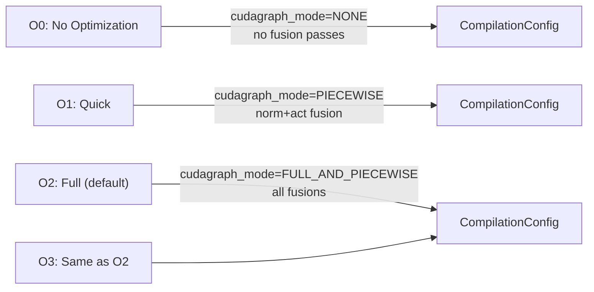

# VllmConfig — The Unified Configuration Container

`VllmConfig` is the top-level configuration object that aggregates every sub-configuration used by vLLM. It is defined in `vllm/config/vllm.py` and passed throughout the entire system — from the engine core to individual workers and model runners.

## Overview

Rather than threading dozens of individual parameters through function calls and class constructors, vLLM consolidates all configuration into a single `VllmConfig` instance. Every component that needs configuration receives this object and reads only the fields it cares about.

```python
from vllm.config import VllmConfig, ModelConfig, CacheConfig, ParallelConfig

config = VllmConfig(
    model_config=ModelConfig(model="meta-llama/Llama-3.1-8B-Instruct"),
    cache_config=CacheConfig(gpu_memory_utilization=0.9),
    parallel_config=ParallelConfig(tensor_parallel_size=2),
)
```

## Class Definition

```python
@config(config=ConfigDict(arbitrary_types_allowed=True))
class VllmConfig:
    """Dataclass which contains all vllm-related configuration. This
    simplifies passing around the distinct configurations in the codebase.
    """
```

`VllmConfig` uses the `@config` decorator (a thin wrapper around Pydantic's `BaseModel`) which provides validation, serialization, and hashing support.

## Fields

| Field | Type | Default | Description |
|-------|------|---------|-------------|
| `model_config` | `ModelConfig` | `None` | Model path, dtype, quantization, context length |
| `cache_config` | `CacheConfig` | `CacheConfig()` | KV cache block size, GPU memory utilization, prefix caching |
| `parallel_config` | `ParallelConfig` | `ParallelConfig()` | Tensor, pipeline, data, and expert parallelism |
| `scheduler_config` | `SchedulerConfig` | `SchedulerConfig.default_factory()` | Batching limits, chunked prefill, scheduling policy |
| `device_config` | `DeviceConfig` | `DeviceConfig()` | Target hardware device |
| `load_config` | `LoadConfig` | `LoadConfig()` | Model loading format and strategy |
| `offload_config` | `OffloadConfig` | `OffloadConfig()` | CPU weight offloading |
| `attention_config` | `AttentionConfig` | `AttentionConfig()` | Attention backend selection |
| `kernel_config` | `KernelConfig` | `KernelConfig()` | Kernel-level tuning (e.g., FlashInfer autotune) |
| `lora_config` | `LoRAConfig \| None` | `None` | LoRA adapter settings (optional) |
| `speculative_config` | `SpeculativeConfig \| None` | `None` | Speculative decoding (optional) |
| `structured_outputs_config` | `StructuredOutputsConfig` | `StructuredOutputsConfig()` | Guided decoding / structured outputs |
| `observability_config` | `ObservabilityConfig` | `ObservabilityConfig()` | Prometheus metrics, OTLP tracing |
| `quant_config` | `QuantizationConfig \| None` | `None` | Quantization method configuration |
| `compilation_config` | `CompilationConfig` | `CompilationConfig()` | `torch.compile` mode, CUDA graph capture |
| `profiler_config` | `ProfilerConfig` | `ProfilerConfig()` | Profiling settings |
| `kv_transfer_config` | `KVTransferConfig \| None` | `None` | Disaggregated prefill/decode KV transfer |
| `kv_events_config` | `KVEventsConfig \| None` | `None` | KV cache event publishing |
| `ec_transfer_config` | `ECTransferConfig \| None` | `None` | Distributed EC cache transfer |
| `additional_config` | `dict \| SupportsHash` | `{}` | Platform-specific opaque config |
| `instance_id` | `str` | `""` | Unique ID for this vLLM instance |
| `optimization_level` | `OptimizationLevel` | `O2` | Startup vs. performance trade-off level |
| `performance_mode` | `PerformanceMode` | `"balanced"` | Runtime behavior mode |
| `weight_transfer_config` | `WeightTransferConfig \| None` | `None` | Weight transfer for RL training |
| `shutdown_timeout` | `int` | `0` | Grace period (seconds) for in-flight requests on shutdown |

## Optimization Levels

The `optimization_level` field provides a convenient shorthand for tuning the startup-time vs. runtime-performance trade-off:

| Level | Enum | Description |
|-------|------|-------------|
| `0` | `O0` | No optimization — no compilation, no CUDA graphs. Fastest startup. |
| `1` | `O1` | Quick optimizations — Dynamo+Inductor compilation, piecewise CUDA graphs |
| `2` | `O2` | Full optimizations — O1 plus full and piecewise CUDA graphs. **Default.** |
| `3` | `O3` | Currently identical to O2 |

```python
from vllm.config.vllm import OptimizationLevel

# Fastest startup (useful for development/testing)
config = VllmConfig(optimization_level=OptimizationLevel.O0)

# Maximum performance (production default)
config = VllmConfig(optimization_level=OptimizationLevel.O2)
```

## Performance Modes

The `performance_mode` field controls runtime scheduling and kernel selection:

| Mode | Description |
|------|-------------|
| `"balanced"` | Default — balanced latency and throughput |
| `"interactivity"` | Favors low end-to-end per-request latency at small batch sizes; uses fine-grained CUDA graphs and latency-oriented kernels |
| `"throughput"` | Favors aggregate tokens/sec at high concurrency; uses larger CUDA graphs and more aggressive batching |

## Configuration Hashing

`VllmConfig` implements `compute_hash()` which produces a deterministic hash of all fields that affect the computation graph. This hash is used to:

- Identify cached compiled models (torch.compile cache)
- Detect configuration changes that require recompilation
- Ensure consistency across distributed workers

```python
config = VllmConfig(model_config=ModelConfig(model="Qwen/Qwen3-0.6B"))
hash_str = config.compute_hash()
```

The hash includes contributions from `model_config`, `cache_config`, `parallel_config`, `scheduler_config`, `device_config`, `load_config`, `offload_config`, `attention_config`, `lora_config`, `speculative_config`, and `compilation_config`.

## Context Management

`VllmConfig` can be set as the "current" global config for a thread using the `set_current_vllm_config` context manager. This is used internally by the model runner to make the config accessible to custom ops and layers without explicit parameter passing:

```python
from vllm.config.vllm import set_current_vllm_config, get_current_vllm_config

with set_current_vllm_config(vllm_config):
    # Inside this block, get_current_vllm_config() returns vllm_config
    current = get_current_vllm_config()
```

## Optimization Level to Compilation Config Mapping

Each optimization level maps to a specific set of `CompilationConfig` and `KernelConfig` settings:



## Usage in Engine Initialization

When you call `LLM(model=...)` or `vllm serve`, the `EngineArgs` class constructs a `VllmConfig` by:

1. Creating each sub-config from the provided arguments
2. Running cross-config validation (e.g., checking TP size vs. available GPUs)
3. Applying platform-specific defaults via `Platform.check_and_update_config()`
4. Applying the optimization level overrides

```python
# Typical engine initialization flow
from vllm.engine.arg_utils import EngineArgs

args = EngineArgs(
    model="meta-llama/Llama-3.1-8B-Instruct",
    tensor_parallel_size=2,
    gpu_memory_utilization=0.9,
)
vllm_config = args.create_engine_config()
```

## Related Pages

- [ModelConfig](model-config.md) — model path, dtype, quantization
- [ParallelConfig](parallel-config.md) — tensor, pipeline, data parallelism
- [CacheConfig](cache-config.md) — KV cache and memory management
- [SchedulerConfig](scheduler-config.md) — batching and scheduling
- [CompilationConfig](compilation-config.md) — torch.compile and CUDA graphs
- [SpeculativeConfig](speculative-config.md) — speculative decoding
- [Additional Configs](additional-configs.md) — LoRA, observability, offloading
- [Environment Variables](environment-variables.md) — runtime environment overrides
