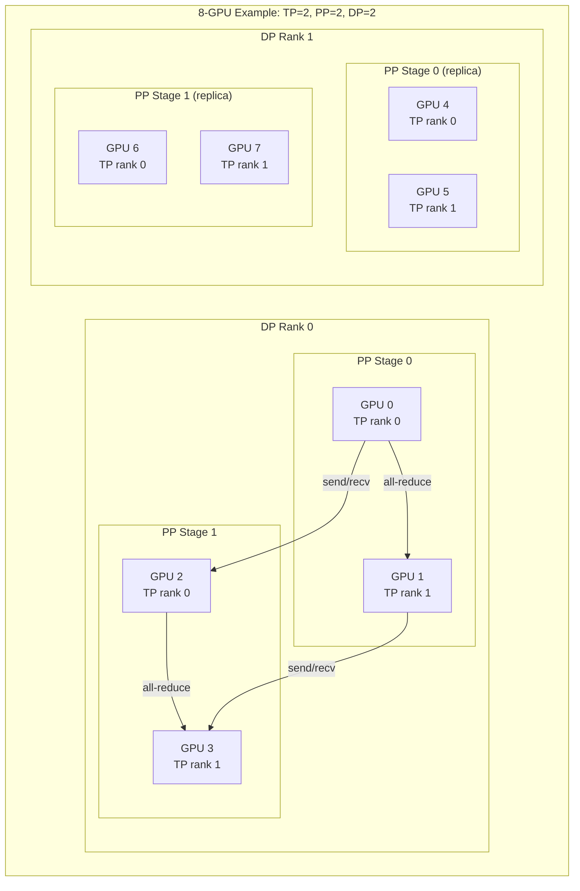
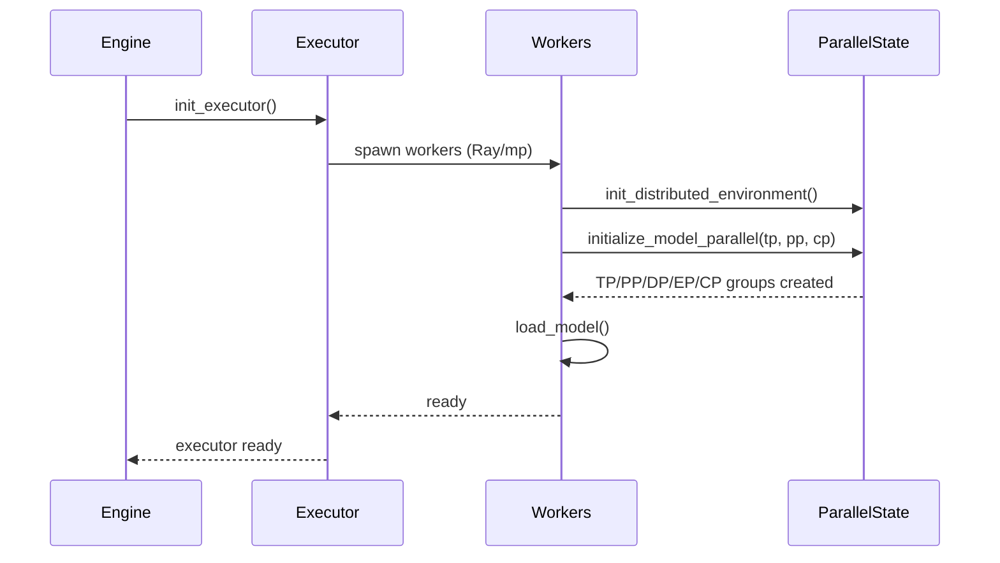

# Distributed Inference

vLLM supports a rich set of distributed execution strategies that can be combined to scale inference across multiple GPUs and nodes. This section covers all parallelism dimensions, executor backends, and advanced features like disaggregated prefill and elastic expert parallelism.

## Parallelism Dimensions

vLLM implements five orthogonal parallelism strategies that can be composed together:

| Strategy | Config Parameter | Scope |
|----------|-----------------|-------|
| Tensor Parallelism (TP) | `tensor_parallel_size` | Splits individual weight matrices across GPUs |
| Pipeline Parallelism (PP) | `pipeline_parallel_size` | Splits model layers across GPUs |
| Expert Parallelism (EP) | `enable_expert_parallel` | Shards MoE experts across GPUs |
| Data Parallelism (DP) | `data_parallel_size` | Replicates the model for throughput |
| Context Parallelism (CP) | `prefill_context_parallel_size` | Splits long sequences across GPUs |

### Combined Topology

The global rank layout follows the order: **ExternalDP × DP × PP × CP × TP**



## Quick Start

```bash
# 4-GPU tensor parallel
vllm serve meta-llama/Llama-3.1-70B --tensor-parallel-size 4

# 2-node, 8-GPU pipeline + tensor parallel
vllm serve meta-llama/Llama-3.1-405B \
  --tensor-parallel-size 4 \
  --pipeline-parallel-size 2

# MoE model with expert parallelism
vllm serve deepseek-ai/DeepSeek-V3 \
  --tensor-parallel-size 8 \
  --enable-expert-parallel

# Disaggregated prefill
vllm serve meta-llama/Llama-3.1-8B \
  --kv-transfer-config '{"kv_connector":"NixlConnector","engine_id":"prefill-0","is_kv_producer":true}'
```

## Documentation Pages

- [Tensor Parallelism](tensor-parallelism.md) — Weight sharding across GPUs
- [Pipeline Parallelism](pipeline-parallelism.md) — Layer-wise stage assignment
- [Expert Parallelism](expert-parallelism.md) — MoE expert sharding
- [Data Parallelism](data-parallelism.md) — Replicated serving and disaggregated prefill
- [Context Parallelism](context-parallelism.md) — Long-context sequence splitting
- [KV Cache Transfer](kv-transfer.md) — Disaggregated prefill connectors
- [Elastic Expert Parallelism](elastic-ep.md) — Dynamic load balancing (EPLB)
- [Ray Executor](ray-executor.md) — Multi-node Ray-based execution
- [Multiprocess Executor](multiproc-executor.md) — Single-node ZMQ IPC execution
- [Weight Transfer](weight-transfer.md) — RLHF weight update protocol
- [EC Transfer](ec-transfer.md) — Encoder cache transfer

## Initialization Flow



The core initialization function is `initialize_model_parallel()` in `vllm/distributed/parallel_state.py`, which creates all process groups based on the configured parallelism sizes.

## Cross-References

- [Deployment: Multi-Node](../15-deployment/multi-node.md) — Ray cluster setup for multi-node serving
- [Deployment: Disaggregated Prefill](../15-deployment/disaggregated-prefill.md) — production disaggregated serving setup
- [Deployment: Elastic EP](../15-deployment/elastic-ep.md) — deploying with elastic expert parallelism
- [ParallelConfig](../06-configuration/parallel-config.md) — all parallelism configuration options
- [Engine & Scheduler](../15-engine-scheduler/README.md) — how the scheduler interacts with distributed workers
- [Quantization](../14-quantization/README.md) — quantization with distributed inference
- [Benchmarking](../15-benchmarking/README.md) — benchmarking distributed configurations
