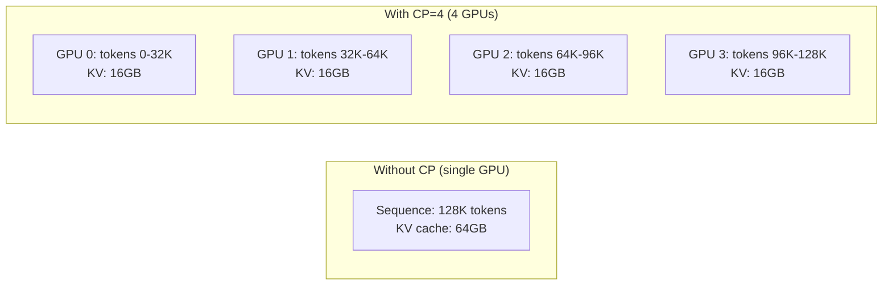
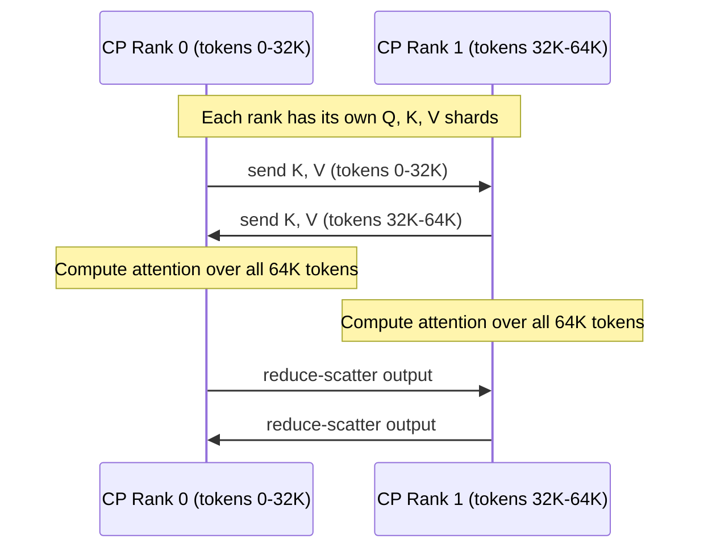

# Context Parallelism

Context parallelism (CP) splits long input sequences across multiple GPUs, enabling inference on sequences that would otherwise exceed the memory capacity of a single GPU. vLLM implements two variants: **Prefill Context Parallelism (PCP)** and **Decode Context Parallelism (DCP)**.

## Overview

Without context parallelism, the KV cache for a single long sequence must fit entirely on one GPU. With CP, the sequence is partitioned across `cp_size` GPUs, each holding a contiguous chunk of tokens.



## Prefill Context Parallelism (PCP)

PCP splits the **prefill** (prompt processing) phase across multiple GPUs. It is configured via `prefill_context_parallel_size`.

### Configuration

```bash
vllm serve meta-llama/Llama-3.1-70B \
  --tensor-parallel-size 4 \
  --prefill-context-parallel-size 2
```

This uses 8 GPUs: 4 TP × 2 PCP.

### Process Group

The PCP group (`_PCP`) is initialized in `vllm/distributed/parallel_state.py`:

```python
# PCP groups are formed by transposing the CP dimension
group_ranks = (
    all_ranks.transpose(3, 4)  # move PCP dim to last
    .reshape(-1, prefill_context_model_parallel_size)
    .unbind(0)
)
_PCP = init_model_parallel_group(group_ranks, ..., group_name="pcp")
```

Access the PCP group:

```python
from vllm.distributed.parallel_state import get_pcp_group

pcp_group = get_pcp_group()
pcp_rank = pcp_group.rank_in_group
pcp_size = pcp_group.world_size
```

## Decode Context Parallelism (DCP)

DCP splits the **decode** (token generation) phase. Unlike PCP, DCP reuses the TP group's GPUs — it does not increase the total GPU count. The TP size must be divisible by the DCP size.

### Configuration

```bash
vllm serve meta-llama/Llama-3.1-70B \
  --tensor-parallel-size 8 \
  --decode-context-parallel-size 2
```

This uses 8 GPUs with TP=8, but during decode, the 8 GPUs are split into 4 DCP groups of 2 GPUs each.

### Constraint

```python
# From vllm/config/parallel.py
if self.tensor_parallel_size % self.decode_context_parallel_size != 0:
    raise ValueError(
        f"tp_size={self.tensor_parallel_size} must be divisible by "
        f"dcp_size={self.decode_context_parallel_size}."
    )
```

### DCP Communication Backends

DCP supports two communication backends:

| Backend | Description |
|---------|-------------|
| `ag_rs` | AllGather + ReduceScatter (default) |
| `a2a` | All-to-All exchange of partial outputs + LSE, then combine with Triton kernel. Reduces NCCL calls from 3 to 2 per layer for MLA models. |

```bash
vllm serve ... --dcp-comm-backend a2a
```

### Process Group

The DCP group (`_DCP`) is initialized similarly to PCP:

```python
group_ranks = all_ranks.reshape(-1, decode_context_model_parallel_size).unbind(0)
_DCP = init_model_parallel_group(group_ranks, ..., group_name="dcp")
```

## KV Cache Interleaving

When using CP, the KV cache is stored in an interleaved pattern across CP ranks. The `cp_kv_cache_interleave_size` parameter controls the granularity:

```python
# From vllm/config/parallel.py
cp_kv_cache_interleave_size: int = 1
"""Interleave size of kv_cache storage while using DCP or PCP.
- Interleave_size=1: token-level alignment, token i stored on rank i % cp_size
- Interleave_size=block_size: block-level alignment
"""
```

**Token-level interleaving** (`interleave_size=1`): Token `i` is stored on CP rank `i % cp_size`. This provides fine-grained load balancing.

**Block-level interleaving** (`interleave_size=block_size`): Tokens are first filled into rank 0's blocks, then rank 1's blocks, etc. This reduces cross-rank communication for sequential access patterns.

## Combined CP and TP

CP and TP can be combined. The total CP rank is computed as:

```
total_cp_rank = pcp_rank * dcp_world_size + dcp_rank
total_cp_world_size = pcp_world_size * dcp_world_size
```

## Communication Pattern

During attention computation with CP, each GPU must access KV pairs from other CP ranks. The communication pattern depends on the attention algorithm:



## Performance Considerations

> **Note:** Context parallelism introduces communication overhead proportional to the KV cache size. For short sequences, this overhead may outweigh the memory savings.

- PCP is most beneficial for very long prompts (>32K tokens)
- DCP is useful when decode memory is the bottleneck
- Combine CP with TP for maximum flexibility

## Related Pages

- [Tensor Parallelism](tensor-parallelism.md) — Weight sharding
- [KV Cache Transfer](kv-transfer.md) — Cross-instance KV transfer
