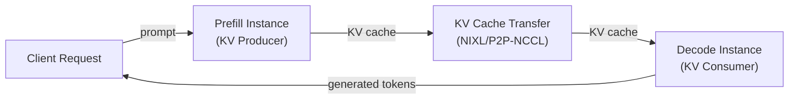

# Data Parallelism

Data parallelism (DP) replicates the entire model (or model shard) across multiple independent serving instances. Unlike tensor or pipeline parallelism, DP replicas process different requests independently — there is no synchronization during the forward pass for dense models.

## Overview

vLLM supports two distinct DP modes:

1. **Standard DP** (`data_parallel_size`): Multiple replicas share the same engine process, with vLLM's scheduler load-balancing requests across replicas.
2. **Disaggregated serving**: Separate prefill and decode instances, connected via KV cache transfer.

## `data_parallel_size`

Setting `data_parallel_size > 1` creates multiple model replicas within a single vLLM deployment. Each replica handles a subset of incoming requests.

```bash
# 2 DP replicas, each using 4 GPUs for TP
vllm serve meta-llama/Llama-3.1-70B \
  --tensor-parallel-size 4 \
  --data-parallel-size 2
```

This requires 8 GPUs total (4 TP × 2 DP).

### MoE and Wide EP

For MoE models, `data_parallel_size` directly affects the expert parallel group size:

```python
# From vllm/config/parallel.py
ep_size = self.data_parallel_size * self.world_size_across_dp
```

Increasing `data_parallel_size` increases the EP group, allowing more experts to be distributed across more GPUs. This "wide EP" pattern is used for large MoE models like DeepSeek-R1.

## DP Group Initialization

The DP group is initialized in `vllm/distributed/parallel_state.py`:

```python
# DP groups are formed by transposing the DP dimension
group_ranks = all_ranks.transpose(1, 4).reshape(-1, data_parallel_size).unbind(0)
_DP = init_model_parallel_group(group_ranks, ..., group_name="dp")
```

For elastic EP deployments, DP groups use stateless NCCL communicators:

```python
if enable_elastic_ep:
    _DP = _init_stateless_group(group_ranks, "dp", dp_ports, ...)
```

## Configuration Parameters

From `vllm/config/parallel.py`:

```python
@config
class ParallelConfig:
    data_parallel_size: int = 1
    """Number of data parallel groups. MoE layers will be sharded according to
    the product of the tensor parallel size and data parallel size."""

    data_parallel_size_local: int = 1
    """Number of local data parallel groups."""

    data_parallel_rank: int = 0
    """Rank of the data parallel group."""

    data_parallel_master_ip: str = "127.0.0.1"
    """IP of the data parallel master."""

    data_parallel_backend: DataParallelBackend = "mp"
    """Backend to use for data parallel, either 'mp' or 'ray'."""

    data_parallel_external_lb: bool = False
    """Whether to use 'external' DP LB mode. Useful for one-pod-per-rank
    wide-EP setup in Kubernetes."""

    data_parallel_hybrid_lb: bool = False
    """Whether to use 'hybrid' DP LB mode. Enables running an AsyncLLM
    and API server on a per-node basis."""
```

## Load Balancing Modes

### Internal Load Balancing (default)

vLLM's scheduler distributes requests across DP replicas internally. All replicas share a single API endpoint.

### External Load Balancing (`data_parallel_external_lb=True`)

Each DP rank runs as an independent pod with its own API endpoint. An external load balancer (e.g., Kubernetes ingress) distributes requests. This is useful for wide-EP Kubernetes deployments.

```bash
# Pod 0 (DP rank 0)
vllm serve deepseek-ai/DeepSeek-V3 \
  --data-parallel-size 4 \
  --data-parallel-rank 0 \
  --data-parallel-master-ip 10.0.0.1

# Pod 1 (DP rank 1)
vllm serve deepseek-ai/DeepSeek-V3 \
  --data-parallel-size 4 \
  --data-parallel-rank 1 \
  --data-parallel-master-ip 10.0.0.1
```

### Hybrid Load Balancing (`data_parallel_hybrid_lb=True`)

Runs an `AsyncLLM` and API server on a per-node basis. vLLM load-balances between local DP ranks, while an external load balancer handles inter-node distribution.

## Disaggregated Serving

Disaggregated serving separates the **prefill** phase (processing the prompt) from the **decode** phase (generating tokens) onto different instances. This allows independent scaling of prefill and decode capacity.



### Prefill Instance Configuration

```bash
vllm serve meta-llama/Llama-3.1-8B \
  --kv-transfer-config '{
    "kv_connector": "NixlConnector",
    "engine_id": "prefill-0",
    "is_kv_producer": true
  }'
```

### Decode Instance Configuration

```bash
vllm serve meta-llama/Llama-3.1-8B \
  --kv-transfer-config '{
    "kv_connector": "NixlConnector",
    "engine_id": "decode-0",
    "is_kv_consumer": true
  }'
```

See [KV Cache Transfer](kv-transfer.md) for full connector documentation.

## DP Synchronization

For MoE models with EP, DP ranks must synchronize certain operations (e.g., expert load statistics for EPLB). This uses either NCCL or Gloo:

```python
# From vllm/config/parallel.py
disable_nccl_for_dp_synchronization: bool | None = Field(default=None)
"""Forces dp synchronization to use Gloo instead of NCCL.
Defaults to True when async scheduling is enabled."""
```

## Related Pages

- [KV Cache Transfer](kv-transfer.md) — Disaggregated prefill connectors
- [Expert Parallelism](expert-parallelism.md) — Wide EP with DP
- [Elastic Expert Parallelism](elastic-ep.md) — Dynamic scaling
