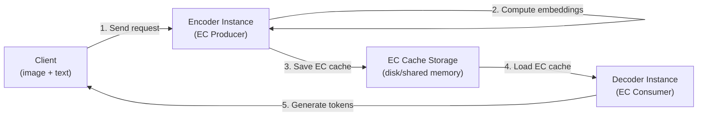

# EC Transfer (Encoder Cache Transfer)

The EC transfer subsystem (`vllm/distributed/ec_transfer/`) enables disaggregated serving for multimodal models by transferring encoder cache (EC) between separate vLLM instances. This allows the encoder (e.g., vision encoder) to run on dedicated hardware while the decoder runs on separate GPUs.

## Use Case

For multimodal models (e.g., LLaVA, Qwen-VL), the vision encoder processes images into embeddings that are then consumed by the language model decoder. EC transfer enables:

1. **Encoder instance** (EC producer): Runs the vision encoder, computes image embeddings, stores them in the encoder cache
2. **Decoder instance** (EC consumer): Receives the encoder cache from the producer, runs the language model decoder

This separation allows:
- Independent scaling of encoder and decoder capacity
- Reuse of encoder cache across multiple decoder requests
- Specialized hardware for encoder (e.g., CPU or smaller GPU)

## Architecture



## EC Connector Framework

The EC connector framework mirrors the KV connector framework. The base class `ECConnectorBase` (in `vllm/distributed/ec_transfer/ec_connector/base.py`) defines the interface.

### Connector Roles

```python
class ECConnectorRole(enum.Enum):
    SCHEDULER = 0  # Runs in scheduler process
    WORKER = 1     # Runs in each worker process
```

### EC Roles

```python
ECProducer = Literal["ec_producer", "ec_both"]
ECConsumer = Literal["ec_consumer", "ec_both"]
```

- `ec_producer`: Instance only produces (saves) encoder cache
- `ec_consumer`: Instance only consumes (loads) encoder cache
- `ec_both`: Instance both produces and consumes (for single-instance setups)

## Worker-Side API

```python
class ECConnectorBase(ABC):
    @abstractmethod
    def start_load_caches(
        self, encoder_cache: dict[str, torch.Tensor], **kwargs
    ) -> None:
        """Start loading encoder cache from the connector.
        Called before _gather_mm_embeddings."""

    @abstractmethod
    def save_caches(
        self, encoder_cache: dict[str, torch.Tensor], mm_hash: str, **kwargs
    ) -> None:
        """Save encoder cache to the connector."""

    def get_finished(
        self, finished_req_ids: set[str]
    ) -> tuple[set[str] | None, set[str] | None]:
        """Return IDs of requests that completed async transfer."""
```

## Scheduler-Side API

```python
class ECConnectorBase(ABC):
    @abstractmethod
    def has_cache_item(self, identifier: str) -> bool:
        """Check if encoder cache exists for the given media hash."""

    @abstractmethod
    def update_state_after_alloc(self, request, ...) -> None:
        """Update state after encoder cache allocation."""

    @abstractmethod
    def request_finished(self, request, ...) -> None:
        """Called when a request finishes; free the cache."""
```

## Configuration

From `vllm/config/ec_transfer.py`:

```python
@config
class ECTransferConfig:
    ec_connector: str | None = None
    """The EC connector class name."""

    engine_id: str | None = None
    """Unique engine identifier for EC transfers."""

    ec_role: ECRole | None = None
    """'ec_producer', 'ec_consumer', or 'ec_both'."""

    ec_rank: int = 0
    """Rank of this instance (0 for encoder, 1 for decoder)."""

    ec_parallel_size: int = 1
    """Number of parallel instances for EC transfer."""

    ec_ip: str = "127.0.0.1"
    """IP address for EC connector communication."""

    ec_port: int = 14579
    """Port for EC connector communication."""

    ec_buffer_device: str = "cuda"
    """Device for EC cache buffering."""

    ec_buffer_size: float = 1e9
    """Buffer size in bytes (default: ~1 GB)."""

    ec_connector_extra_config: dict[str, Any] = {}
    """Additional connector-specific configuration."""

    ec_connector_module_path: str | None = None
    """Python module path for custom connector loading."""
```

### Example Configuration

```bash
# Encoder instance (EC producer)
vllm serve Qwen/Qwen2-VL-7B-Instruct \
  --ec-transfer-config '{
    "ec_connector": "ECExampleConnector",
    "ec_role": "ec_producer",
    "ec_rank": 0,
    "ec_ip": "10.0.0.1",
    "ec_port": 14579,
    "ec_connector_extra_config": {"shared_storage_path": "/shared/ec_cache"}
  }'

# Decoder instance (EC consumer)
vllm serve Qwen/Qwen2-VL-7B-Instruct \
  --ec-transfer-config '{
    "ec_connector": "ECExampleConnector",
    "ec_role": "ec_consumer",
    "ec_rank": 1,
    "ec_ip": "10.0.0.1",
    "ec_port": 14579,
    "ec_connector_extra_config": {"shared_storage_path": "/shared/ec_cache"}
  }'
```

## Available Connectors

Currently registered in `vllm/distributed/ec_transfer/ec_connector/factory.py`:

| Connector | Description |
|-----------|-------------|
| `ECExampleConnector` | Reference implementation using disk storage |

### ECExampleConnector

The example connector saves/loads encoder cache to/from disk using `safetensors` format:

```python
class ECExampleConnector(ECConnectorBase):
    def save_caches(self, encoder_cache, mm_hash, **kwargs):
        # Save to shared_storage_path/mm_hash.safetensors
        safetensors.torch.save_file(...)

    def start_load_caches(self, encoder_cache, **kwargs):
        # Load from shared_storage_path/mm_hash.safetensors
        loaded = safetensors.torch.load_file(...)
        encoder_cache[mm_hash] = loaded
```

## EC Transfer State

The global EC connector state is managed in `vllm/distributed/ec_transfer/ec_transfer_state.py`:

```python
def ensure_ec_transfer_initialized(vllm_config: "VllmConfig") -> None:
    """Initialize EC cache connector."""
    global _EC_CONNECTOR_AGENT
    if vllm_config.ec_transfer_config.is_ec_transfer_instance:
        _EC_CONNECTOR_AGENT = ECConnectorFactory.create_connector(
            config=vllm_config,
            role=ECConnectorRole.WORKER,
        )
```

## Writing a Custom EC Connector

To implement a custom EC connector:

1. Subclass `ECConnectorBase`
2. Implement `start_load_caches()`, `save_caches()`, `has_cache_item()`, `update_state_after_alloc()`, and `request_finished()`
3. Register with the factory:

```python
from vllm.distributed.ec_transfer.ec_connector.factory import ECConnectorFactory

ECConnectorFactory.register_connector(
    "MyECConnector",
    "mypackage.my_ec_connector",
    "MyECConnector",
)
```

Or use `ec_connector_module_path` for dynamic loading without registration:

```bash
vllm serve ... --ec-transfer-config '{
  "ec_connector": "MyECConnector",
  "ec_connector_module_path": "mypackage.my_ec_connector",
  ...
}'
```

## Relationship to KV Transfer

EC transfer and KV transfer are parallel systems:

| Feature | KV Transfer | EC Transfer |
|---------|------------|-------------|
| Data | KV cache (attention keys/values) | Encoder cache (embeddings) |
| Use case | Disaggregated prefill/decode | Disaggregated encoder/decoder |
| Base class | `KVConnectorBase_V1` | `ECConnectorBase` |
| Config | `KVTransferConfig` | `ECTransferConfig` |
| State | `kv_transfer_state.py` | `ec_transfer_state.py` |

## Related Pages

- [KV Cache Transfer](kv-transfer.md) — KV cache disaggregation
- [Data Parallelism](data-parallelism.md) — Disaggregated serving overview
