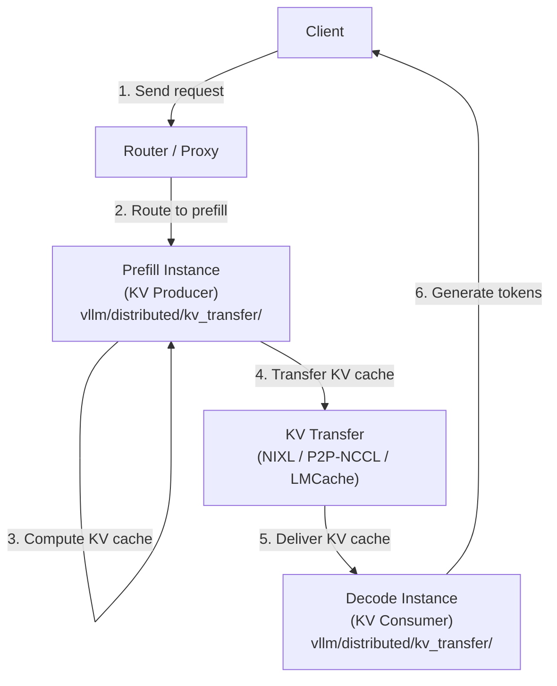

# KV Cache Transfer for Disaggregated Prefill

Disaggregated prefill separates the prompt processing (prefill) and token generation (decode) phases onto different vLLM instances. The KV cache computed during prefill is transferred to the decode instance via a **KV connector**. This allows independent scaling of prefill and decode capacity.

## Architecture



## KV Connector Framework

The KV connector framework is defined in `vllm/distributed/kv_transfer/`. It provides a clean abstraction for different transfer backends.

### Base Class

`KVConnectorBase_V1` (in `vllm/distributed/kv_transfer/kv_connector/v1/base.py`) defines the interface:

**Scheduler-side methods** (run in the scheduler process):
- `get_num_new_matched_tokens()` — Query how many tokens exist in the remote KV cache
- `update_state_after_alloc()` — Update state after temporary buffer allocation
- `update_connector_output()` — Update state after worker output is received
- `request_finished()` — Called when a request completes; optionally takes ownership of KV blocks
- `take_events()` — Return new KV events collected since last call

**Worker-side methods** (run in each worker process):
- `start_load_kv()` — Begin loading KV cache (possibly async)
- `wait_for_layer_load()` — Block until layer `i` load completes
- `save_kv_layer()` — Begin saving KV for layer `i` (possibly async)
- `wait_for_save()` — Block until all saves complete
- `get_finished()` — Return IDs of requests that completed async transfer

### Connector Roles

Each connector instance has a role:

```python
class KVConnectorRole(enum.Enum):
    SCHEDULER = 0  # Runs in scheduler process
    WORKER = 1     # Runs in each worker process
```

The factory creates separate instances for each role:

```python
# From vllm/distributed/kv_transfer/kv_connector/factory.py
connector = KVConnectorFactory.create_connector(
    config=vllm_config,
    role=KVConnectorRole.WORKER,
    kv_cache_config=kv_cache_config,
)
```

## Available Connectors

Registered in `vllm/distributed/kv_transfer/kv_connector/factory.py`:

| Connector | Description |
|-----------|-------------|
| `NixlConnector` | NIXL-based RDMA transfer (recommended for production) |
| `P2pNcclConnector` | Point-to-point NCCL transfer |
| `LMCacheConnectorV1` | LMCache integration (single-process) |
| `LMCacheMPConnector` | LMCache integration (multi-process) |
| `MooncakeConnector` | Mooncake distributed KV cache |
| `MoRIIOConnector` | MoRIIO transfer backend |
| `OffloadingConnector` | CPU/disk offloading |
| `MultiConnector` | Combines multiple connectors |
| `DecodeBenchConnector` | Benchmarking connector |
| `ExampleConnector` | Reference implementation |
| `ExampleHiddenStatesConnector` | Hidden states transfer example |

## NIXL Connector

The `NixlConnector` (in `vllm/distributed/kv_transfer/kv_connector/v1/nixl_connector.py`) is the recommended production connector. It uses NIXL (NVIDIA Inference Xfer Library) for high-performance RDMA-based KV cache transfer.

### Features
- Asynchronous transfer with overlap of compute and communication
- Support for TP-sharded KV caches
- Automatic block layout conversion between prefill and decode instances
- ZMQ-based metadata exchange

### Configuration

```bash
# Prefill instance
vllm serve meta-llama/Llama-3.1-70B \
  --kv-transfer-config '{
    "kv_connector": "NixlConnector",
    "engine_id": "prefill-0",
    "is_kv_producer": true,
    "kv_ip": "10.0.0.1",
    "kv_port": 14579
  }'

# Decode instance
vllm serve meta-llama/Llama-3.1-70B \
  --kv-transfer-config '{
    "kv_connector": "NixlConnector",
    "engine_id": "decode-0",
    "is_kv_consumer": true,
    "kv_ip": "10.0.0.1",
    "kv_port": 14579
  }'
```

## P2P NCCL Connector

The `P2pNcclConnector` (in `vllm/distributed/kv_transfer/kv_connector/v1/p2p/p2p_nccl_connector.py`) uses NCCL point-to-point operations for KV transfer. It is simpler to set up than NIXL but may have lower throughput for large KV caches.

### Metadata

```python
@dataclass
class P2pNcclConnectorMetadata(KVConnectorMetadata):
    requests: list[ReqMeta]

@dataclass
class ReqMeta:
    request_id: str
    block_ids: torch.Tensor  # KV block IDs to transfer
    num_tokens: int
```

## LMCache Connectors

LMCache provides a distributed KV cache with support for CPU/GPU/disk storage tiers. Two connectors are available:

- `LMCacheConnectorV1`: Single-process mode
- `LMCacheMPConnector`: Multi-process mode for higher throughput

## Mooncake Connector

The `MooncakeConnector` integrates with Mooncake's distributed KV cache system, which provides RDMA-based transfer with a disaggregated memory pool.

## Hybrid Memory Allocator (HMA)

Connectors that support the Hybrid Memory Allocator (HMA) implement the `SupportsHMA` interface:

```python
class SupportsHMA(ABC):
    @abstractmethod
    def request_finished_all_groups(
        self,
        request: "Request",
        block_ids: tuple[list[int], ...],
    ) -> tuple[bool, dict[str, Any] | None]:
        """Called when a request finishes for all KV cache groups."""
```

HMA allows the connector to take ownership of KV blocks and free them asynchronously after transfer completes. This is required for connectors that need to hold blocks while transferring.

> **Note:** HMA is enabled by default. If your connector does not support HMA, disable it with `--disable-hybrid-kv-cache-manager`.

## KV Transfer State

The global KV connector state is managed in `vllm/distributed/kv_transfer/kv_transfer_state.py`:

```python
def ensure_kv_transfer_initialized(
    vllm_config: "VllmConfig",
    kv_cache_config: "KVCacheConfig | None" = None,
) -> None:
    """Initialize KV cache transfer parallel group."""
    global _KV_CONNECTOR_AGENT
    if vllm_config.kv_transfer_config.is_kv_transfer_instance:
        _KV_CONNECTOR_AGENT = KVConnectorFactory.create_connector(
            config=vllm_config,
            role=KVConnectorRole.WORKER,
            kv_cache_config=kv_cache_config,
        )
```

## KV Events

The `vllm/distributed/kv_events.py` module defines events emitted by connectors for observability:

```python
# KV cache events for monitoring transfer progress
class KVCacheEvent:
    ...
```

## Writing a Custom Connector

To implement a custom KV connector:

1. Subclass `KVConnectorBase_V1`
2. Implement all abstract methods
3. Register with the factory:

```python
from vllm.distributed.kv_transfer.kv_connector.factory import KVConnectorFactory

KVConnectorFactory.register_connector(
    "MyConnector",
    "mypackage.my_connector",
    "MyConnector",
)
```

See `vllm/distributed/kv_transfer/kv_connector/v1/example_connector.py` for a reference implementation.

## Related Pages

- [Data Parallelism](data-parallelism.md) — Disaggregated serving overview
- [Elastic Expert Parallelism](elastic-ep.md) — Dynamic EP scaling
- [EC Transfer](ec-transfer.md) — Encoder cache transfer
