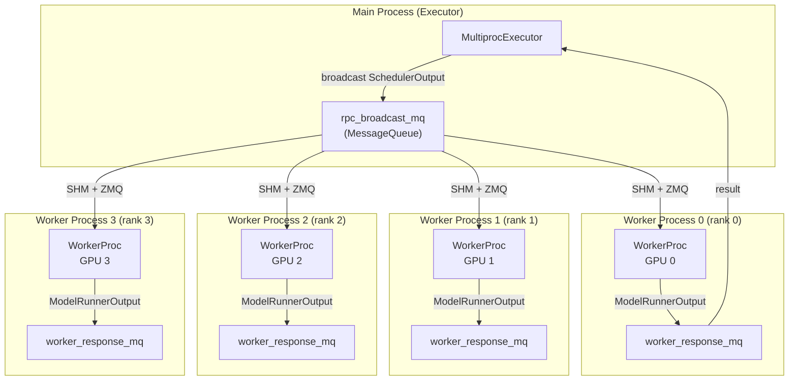

# Multiprocess Executor

The `MultiprocExecutor` (in `vllm/v1/executor/multiproc_executor.py`) is vLLM's single-node distributed execution backend. It spawns worker processes using Python's `multiprocessing` module and communicates via shared memory and ZMQ IPC sockets.

## When to Use

The multiprocess executor is the default for single-node multi-GPU inference:

```bash
# Automatically uses multiprocess executor for single-node
vllm serve meta-llama/Llama-3.1-70B --tensor-parallel-size 4

# Explicitly specify
vllm serve ... --distributed-executor-backend mp
```

## Architecture



## IPC Communication

### MessageQueue

The `MessageQueue` class (in `vllm/distributed/device_communicators/shm_broadcast.py`) provides efficient one-to-many broadcast using:

1. **Shared memory ring buffer** (`ShmRingBuffer`) for local workers on the same node
2. **ZMQ XPUB/SUB sockets** for remote workers on different nodes

```python
class MessageQueue:
    def __init__(
        self,
        n_reader,           # Total number of readers
        n_local_reader,     # Local readers (shared memory)
        max_chunk_bytes: int = 1024 * 1024 * 24,  # 24 MiB default
        max_chunks: int = 10,
        connect_ip: str | None = None,
    ):
```

The 24 MiB default chunk size is chosen to accommodate grammar bitmask tensors for large batches (1024 requests).

### ZMQ Socket Types

| Socket | Type | Purpose |
|--------|------|---------|
| `local_socket` | `XPUB` | Broadcast to local workers via IPC |
| `remote_socket` | `XPUB` | Broadcast to remote workers via TCP |
| Subscriber sockets | `SUB` | Workers subscribe to receive data |

ZMQ IPC paths use Unix domain sockets for local communication:

```python
local_subscribe_addr = get_open_zmq_ipc_path()  # e.g., /tmp/vllm-ipc-xxxxx
self.local_socket.bind(local_subscribe_addr)
```

### SpinCondition

For low-latency synchronization, `SpinCondition` uses busy-waiting with ZMQ notifications:

```python
class SpinCondition:
    """Spin-wait condition variable using ZMQ for notification."""
```

This avoids OS-level sleep/wake overhead for the hot path.

## Worker Process Lifecycle

### Spawning

Workers are spawned using Python's multiprocessing context:

```python
# From vllm/v1/executor/multiproc_executor.py
context = get_mp_context()  # 'spawn' or 'fork'
process = context.Process(
    target=WorkerProc,
    kwargs={
        "vllm_config": vllm_config,
        "local_rank": local_rank,
        "rank": rank,
        "distributed_init_method": distributed_init_method,
        "input_shm_handle": scheduler_output_handle,
        ...
    }
)
```

### Ready Signaling

Workers signal readiness via a pipe:

```python
# Parent creates pipe
ready_reader, ready_writer = context.Pipe(duplex=False)

# Child writes READY when initialized
ready_writer.send(WorkerProc.READY_STR)

# Parent waits for all workers
WorkerProc.wait_for_ready(unready_workers)
```

### Death Detection

A "death pipe" allows workers to detect if the parent process exits:

```python
death_reader, death_writer = context.Pipe(duplex=False)
# Worker monitors death_reader; if it becomes readable, parent has died
```

## Collective RPC

The `collective_rpc()` method broadcasts a method call to all workers via the `rpc_broadcast_mq`:

```python
def collective_rpc(self, method, timeout=None, args=(), kwargs=None, ...):
    # Serialize method and args
    send_method = cloudpickle.dumps(method) if callable(method) else method
    self.rpc_broadcast_mq.enqueue((send_method, args, kwargs, output_rank))

    # Collect responses
    for mq in response_mqs:
        status, result = mq.dequeue(timeout=deadline - time.monotonic())
        if status != WorkerProc.ResponseStatus.SUCCESS:
            raise RuntimeError(f"Worker failed: {result}")
```

### Non-blocking Execution

For pipeline parallelism, `non_block=True` returns a `FutureWrapper` immediately:

```python
future = FutureWrapper(self.futures_queue, aggregate=aggregate)
self.futures_queue.appendleft((future, get_response))
return future
```

Futures are resolved lazily when `future.result()` is called, draining the queue in order.

## Output Rank

Only one worker produces the final `ModelRunnerOutput` — the first TP worker of the last PP stage:

```python
def _get_output_rank(self) -> int:
    # For TP=8, PP=4 (world_size=32):
    # PP rank 3 starts at rank 24 (= 32 - 8)
    return (
        self.world_size
        - self.parallel_config.tensor_parallel_size
        * self.parallel_config.prefill_context_parallel_size
    )
```

## Worker Health Monitoring

A background thread monitors worker process liveness:

```python
def start_worker_monitor(self) -> None:
    def monitor_workers():
        sentinels = [h.proc.sentinel for h in workers]
        died = multiprocessing.connection.wait(sentinels)
        # Worker died unexpectedly
        _self.is_failed = True
        _self.shutdown()
        callback()  # Notify engine of failure

    Thread(target=monitor_workers, daemon=True, name="MultiprocWorkerMonitor").start()
```

## Multi-Node Support

For multi-node deployments with the multiprocess executor, configure:

```bash
# Node 0 (master)
vllm serve meta-llama/Llama-3.1-70B \
  --tensor-parallel-size 8 \
  --distributed-executor-backend mp \
  --master-addr 10.0.0.1 \
  --master-port 29501 \
  --node-rank 0 \
  --nnodes 2

# Node 1
vllm serve meta-llama/Llama-3.1-70B \
  --tensor-parallel-size 8 \
  --distributed-executor-backend mp \
  --master-addr 10.0.0.1 \
  --master-port 29501 \
  --node-rank 1 \
  --nnodes 2
```

For multi-node, remote workers use ZMQ TCP sockets instead of IPC:

```python
if n_remote_reader > 0:
    self.remote_socket = context.socket(XPUB)
    socket_addr = f"tcp://{connect_ip}:{remote_subscribe_port}"
    self.remote_socket.bind(socket_addr)
```

## Async Scheduling

When `async_scheduling=True`, workers use a background thread for output copying:

```python
self.async_output_copy_thread = Thread(
    target=self.async_output_busy_loop,
    daemon=True,
    name="WorkerAsyncOutputCopy",
)
```

This overlaps output processing with the next batch's scheduling.

## Related Pages

- [Ray Executor](ray-executor.md) — Multi-node alternative
- [Pipeline Parallelism](pipeline-parallelism.md) — PP with multiprocess executor
- [Tensor Parallelism](tensor-parallelism.md) — TP configuration
