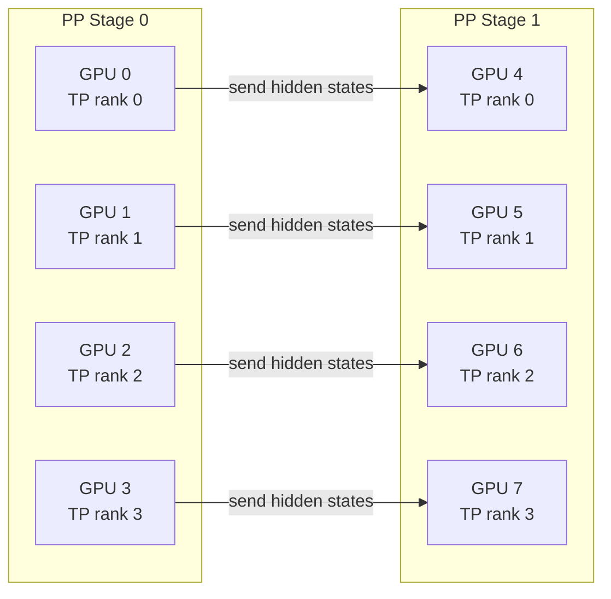
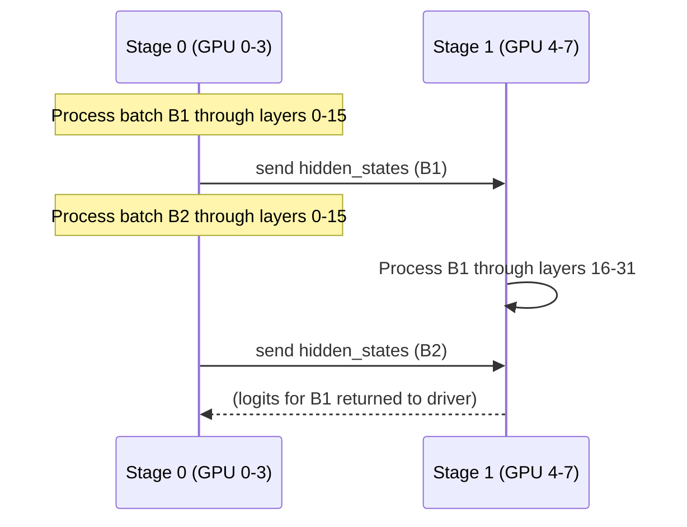

# Pipeline Parallelism

Pipeline parallelism (PP) splits a model's layers into sequential **stages**, each assigned to a different GPU or group of GPUs. Activations flow through the pipeline from stage 0 (embedding + early layers) to the last stage (final layers + LM head).

## Stage Assignment

With `pipeline_parallel_size=N`, the model's transformer layers are divided into N equal-sized stages. Each stage is assigned to a PP rank:

```
Stage 0 (PP rank 0): Embedding + layers 0..L/N-1
Stage 1 (PP rank 1): Layers L/N..2L/N-1
...
Stage N-1 (PP rank N-1): Layers (N-1)L/N..L-1 + LM head
```

For example, with a 32-layer model and `pipeline_parallel_size=4`:
- PP rank 0: layers 0–7
- PP rank 1: layers 8–15
- PP rank 2: layers 16–23
- PP rank 3: layers 24–31 + LM head

## Combined with Tensor Parallelism

PP and TP are orthogonal and can be combined. With `pipeline_parallel_size=2` and `tensor_parallel_size=4` on 8 GPUs:



The global rank layout is: `all_ranks[ExternalDP, DP, PP, CP, TP]`

PP groups are formed by transposing the PP dimension to the last position:

```python
# From vllm/distributed/parallel_state.py
group_ranks = (
    all_ranks.transpose(2, 4)  # move PP dim to last
    .reshape(-1, pipeline_model_parallel_size)
    .unbind(0)
)
_PP = init_model_parallel_group(group_ranks, ..., group_name="pp")
```

## Process Group API

```python
from vllm.distributed.parallel_state import get_pp_group

pp_group = get_pp_group()

# Check stage position
if pp_group.is_first_rank:
    # This is the first pipeline stage (handles embeddings)
    pass

if pp_group.is_last_rank:
    # This is the last pipeline stage (produces logits)
    pass

# Send activations to next stage
pp_group.send_tensor(hidden_states, dst=pp_group.next_rank)

# Receive activations from previous stage
hidden_states = pp_group.recv_tensor(src=pp_group.prev_rank)
```

## Micro-batching and Concurrency

The Ray executor supports concurrent pipeline execution. The `max_concurrent_batches` property controls how many batches can be in-flight simultaneously:

```python
# From vllm/v1/executor/ray_executor.py
@property
def max_concurrent_batches(self) -> int:
    pp_size = self.parallel_config.pipeline_parallel_size
    return 2 if pp_size <= 1 and self.scheduler_config.async_scheduling else pp_size
```

With `pipeline_parallel_size=4`, up to 4 batches can be processed concurrently — one per pipeline stage — maximizing GPU utilization.

## Configuration

```python
from vllm import LLM

llm = LLM(
    model="meta-llama/Llama-3.1-405B",
    tensor_parallel_size=4,
    pipeline_parallel_size=2,  # 8 GPUs total: 4 TP × 2 PP
)
```

CLI:

```bash
vllm serve meta-llama/Llama-3.1-405B \
  --tensor-parallel-size 4 \
  --pipeline-parallel-size 2
```

### Constraints

- PP requires the Ray executor (`distributed_executor_backend="ray"`) for multi-node setups
- The multiprocess executor also supports PP (`supports_pp = True`)
- PP is not compatible with `async_scheduling` when `pp_size > 1`

## Inter-Stage Communication

Hidden states are transferred between pipeline stages using point-to-point (P2P) NCCL operations:



## Worker Organization

The Ray executor organizes workers into a 2D `pp_tp_workers` grid:

```python
# From vllm/v1/executor/ray_executor.py
# PP=2, TP=4 → pp_tp_workers = [[0,1,2,3], [4,5,6,7]]
for pp_rank in range(self.parallel_config.pipeline_parallel_size):
    self.pp_tp_workers.append([])
    for tp_rank in range(self.parallel_config.tensor_parallel_size):
        rank = (pp_rank * self.parallel_config.tensor_parallel_size) + tp_rank
        self.pp_tp_workers[pp_rank].append(self.workers[rank])
```

## Performance Considerations

> **Note:** Pipeline parallelism introduces **pipeline bubbles** — idle time at the beginning and end of each batch when some stages are waiting for activations. The bubble fraction is approximately `(N-1)/N` for a single micro-batch, where N is the number of stages.

To minimize pipeline bubbles:
- Use larger batch sizes to amortize the bubble overhead
- Enable micro-batching (multiple micro-batches per batch)
- Combine with TP to reduce the number of PP stages needed

## Related Pages

- [Tensor Parallelism](tensor-parallelism.md) — Weight sharding
- [Ray Executor](ray-executor.md) — Multi-node execution backend
- [Multiprocess Executor](multiproc-executor.md) — Single-node execution backend
