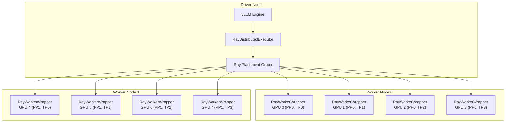

# Ray-Based Distributed Execution

The `RayDistributedExecutor` (in `vllm/v1/executor/ray_executor.py`) is vLLM's multi-node distributed execution backend. It uses [Ray](https://ray.io/) to manage worker processes across a cluster, coordinate GPU placement, and execute the model forward pass via Ray's compiled DAG.

## When to Use Ray

| Scenario | Recommended Backend |
|----------|-------------------|
| Single node, TP only | `mp` (multiprocess) |
| Multi-node (any parallelism) | `ray` |
| Pipeline parallelism | `ray` (preferred) or `mp` |
| TPU inference | `ray` (required) |

The executor backend is selected automatically based on the number of nodes and GPUs, or can be set explicitly:

```bash
vllm serve meta-llama/Llama-3.1-405B \
  --tensor-parallel-size 8 \
  --pipeline-parallel-size 4 \
  --distributed-executor-backend ray
```

## Architecture



## Placement Groups

Ray placement groups ensure that workers are co-located on the correct nodes. vLLM creates one bundle per GPU worker:

```python
# From vllm/v1/executor/ray_utils.py
def initialize_ray_cluster(parallel_config: ParallelConfig, ...):
    """Initialize the distributed cluster with Ray.
    Creates a placement group for the workers, specifying
    resources for each distributed worker."""
```

Each bundle contains exactly one GPU resource:

```python
# One bundle per GPU worker
bundles = [{"GPU": 1, "CPU": 0} for _ in range(world_size)]
placement_group = ray.util.placement_group(bundles, strategy="PACK")
```

The `PACK` strategy places as many bundles as possible on the same node, minimizing inter-node communication.

### Custom Placement Groups

You can provide a pre-created placement group:

```python
import ray
from ray.util.placement_group import placement_group

pg = placement_group([{"GPU": 1} for _ in range(8)], strategy="STRICT_PACK")
ray.get(pg.ready())

llm = LLM(
    model="...",
    tensor_parallel_size=8,
    placement_group=pg,
)
```

### Bundle Index Override

For advanced placement control, use `VLLM_RAY_BUNDLE_INDICES`:

```bash
# Use specific bundle indices from the placement group
VLLM_RAY_BUNDLE_INDICES=0,1,2,3,4,5,6,7 vllm serve ...
```

## Worker Initialization

Workers are created as Ray remote actors using `RayWorkerWrapper`:

```python
# From vllm/v1/executor/ray_executor.py
worker = ray.remote(
    num_cpus=0,
    num_gpus=num_gpus,  # VLLM_RAY_PER_WORKER_GPUS (default: 1)
    scheduling_strategy=PlacementGroupSchedulingStrategy(
        placement_group=placement_group,
        placement_group_capture_child_tasks=True,
        placement_group_bundle_index=bundle_id,
    ),
)(RayWorkerWrapper).remote(rpc_rank=rank)
```

### Worker Rank Assignment

After creating all workers, they are sorted by IP address to ensure consistent rank assignment:

```python
def sort_by_driver_then_worker_ip(item: RayWorkerMetaData):
    """Sort workers: driver node first, then by node IP count, then by IP."""
    ip = item.ip
    return 0 if ip == driver_ip else 1, ip_counts[ip], ip
```

Workers on the driver node get the lowest ranks, ensuring the driver worker (rank 0) is on the same node as the engine.

## Compiled DAG Execution

For pipeline parallelism, vLLM uses Ray's **compiled DAG** for efficient execution:

```python
# From vllm/v1/executor/ray_executor.py
def _compiled_ray_dag(self, enable_asyncio: bool):
    with InputNode() as input_data:
        # PP=2, TP=4 DAG:
        # Input -> [W0, W1, W2, W3] -> [W4, W5, W6, W7] -> Output
        outputs = [input_data for _ in self.pp_tp_workers[0]]
        for pp_rank, tp_group in enumerate(self.pp_tp_workers):
            outputs = [
                worker.execute_model_ray.bind(outputs[i])
                for i, worker in enumerate(tp_group)
            ]
        return MultiOutputNode(outputs).compile(...)
```

The compiled DAG pre-allocates NCCL communicators and memory buffers, reducing per-step overhead.

### DAG Channel Types

| Channel Type | Description |
|-------------|-------------|
| `auto` | Automatically select based on platform |
| `nccl` | NCCL-based inter-stage communication |
| `shm` | Shared memory (for TPU/XPU) |

```bash
VLLM_USE_RAY_COMPILED_DAG_CHANNEL_TYPE=nccl vllm serve ...
```

## Environment Variable Propagation

The executor copies environment variables from the driver to all workers:

```python
# Worker-specific vars are NOT copied
WORKER_SPECIFIC_ENV_VARS = {
    "VLLM_HOST_IP",
    "VLLM_HOST_PORT",
    "LOCAL_RANK",
    "CUDA_VISIBLE_DEVICES",
    "HIP_VISIBLE_DEVICES",
    "ROCR_VISIBLE_DEVICES",
}
```

All other environment variables (NCCL settings, model paths, etc.) are propagated automatically.

## CUDA Visibility

Each worker sees all GPUs on its node via `CUDA_VISIBLE_DEVICES`. The worker uses `local_rank` to select the correct GPU:

```python
# Set CUDA_VISIBLE_DEVICES to all GPUs on the node
all_args_to_update_environment_variables = [
    {
        "CUDA_VISIBLE_DEVICES": ",".join(map(str, node_gpus[node_id])),
    }
    for (node_id, _) in worker_node_and_gpu_ids
]
```

This is required for:
1. Ray's compiled DAG to find the allocated GPU
2. NCCL/CustomAllreduce to see all GPUs for P2P checks

## Collective RPC

The `collective_rpc()` method broadcasts a method call to all workers:

```python
def collective_rpc(self, method, timeout=None, args=(), kwargs=None, non_block=False):
    """Runs the given method on all workers."""
    ray_worker_outputs = [
        worker.execute_method.remote(method, *args, **kwargs)
        for worker in self.workers
    ]
    return ray.get(ray_worker_outputs)
```

## Nsight Profiling

Enable Nsight profiling for Ray workers:

```python
llm = LLM(..., ray_workers_use_nsight=True)
```

This configures the Ray runtime environment to launch workers under Nsight:

```python
runtime_env.update({
    "nsight": {
        "t": "cuda,cudnn,cublas",
        "o": "'worker_process_%p'",
        "cuda-graph-trace": "node",
    }
})
```

## Multi-Node Setup

For multi-node inference, start a Ray cluster first:

```bash
# On head node
ray start --head --port=6379

# On worker nodes
ray start --address=<head-node-ip>:6379

# Launch vLLM
vllm serve meta-llama/Llama-3.1-405B \
  --tensor-parallel-size 8 \
  --pipeline-parallel-size 4 \
  --distributed-executor-backend ray
```

## Related Pages

- [Multiprocess Executor](multiproc-executor.md) — Single-node alternative
- [Pipeline Parallelism](pipeline-parallelism.md) — PP with Ray
- [Tensor Parallelism](tensor-parallelism.md) — TP configuration
