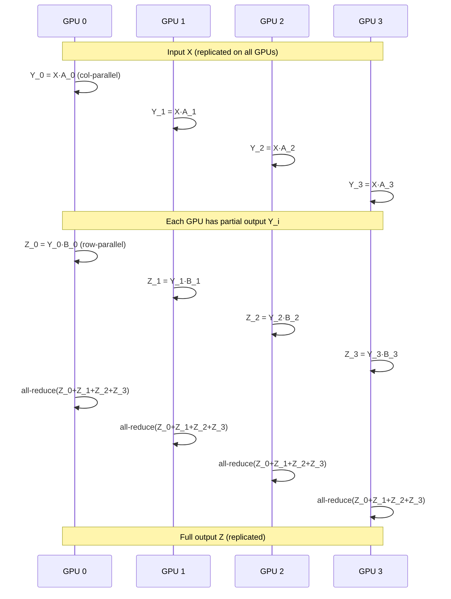

# Tensor Parallelism

Tensor parallelism (TP) splits individual weight matrices across multiple GPUs so that each GPU holds only a shard of each layer. This is the most common parallelism strategy in vLLM and is the default approach for multi-GPU inference on a single node.

## How Weight Sharding Works

vLLM implements Megatron-LM-style tensor parallelism. Each transformer layer contains two types of parallel linear layers:

### Column-Parallel Linear (`ColumnParallelLinear`)

The weight matrix `A` is split along its **output (column) dimension**:

```
A = [A_1 | A_2 | ... | A_p]   (p = tensor_parallel_size)
```

Each GPU `i` computes `Y_i = X · A_i`. The outputs are either:
- **Gathered** across all GPUs (`gather_output=True`) to produce the full `Y`
- **Left sharded** for the next layer to consume directly

This is used for the Q/K/V projections, gate projections, and up projections in attention and MLP layers.

```python
# From vllm/model_executor/layers/linear.py
class ColumnParallelLinear(LinearBase):
    def __init__(self, input_size, output_size, ...):
        self.tp_size = get_tensor_model_parallel_world_size()
        # Each GPU holds output_size / tp_size columns
        self.output_size_per_partition = divide(output_size, self.tp_size)
```

### Row-Parallel Linear (`RowParallelLinear`)

The weight matrix `A` is split along its **input (row) dimension**:

```
A = [A_1]     X = [X_1, X_2, ..., X_p]
    [A_2]
    [...]
    [A_p]
```

Each GPU `i` computes `Y_i = X_i · A_i`. The partial results are summed via **all-reduce** to produce the final `Y`.

This is used for the output projection (`o_proj`) and down projection (`down_proj`).

```python
class RowParallelLinear(LinearBase):
    def __init__(self, input_size, output_size, reduce_results=True, ...):
        self.tp_size = get_tensor_model_parallel_world_size()
        # Each GPU holds input_size / tp_size rows
        self.input_size_per_partition = divide(input_size, self.tp_size)
```

### Vocabulary Parallel Embedding

The embedding table is split along the vocabulary dimension. Each GPU holds a contiguous slice of the vocabulary:

```python
class VocabParallelEmbedding(CustomOp):
    # Each GPU holds vocab_size / tp_size tokens
```

## Communication Pattern

A single transformer layer with TP=4 requires:



Each MLP block requires **one all-reduce** (after the row-parallel down projection). Each attention block requires **one all-reduce** (after the output projection).

## Configuration

Set `tensor_parallel_size` in `ParallelConfig` (see `vllm/config/parallel.py`):

```python
from vllm import LLM

llm = LLM(
    model="meta-llama/Llama-3.1-70B",
    tensor_parallel_size=4,   # Use 4 GPUs
)
```

Or via CLI:

```bash
vllm serve meta-llama/Llama-3.1-70B --tensor-parallel-size 4
```

### Constraints

- `tensor_parallel_size` must divide the number of attention heads evenly
- `tensor_parallel_size` must divide the hidden dimension (for MLP layers)
- For MoE models, `tensor_parallel_size` must be divisible by `decode_context_parallel_size`

## Process Group

The TP group is initialized as `_TP` in `vllm/distributed/parallel_state.py`:

```python
# Group ranks for TP=2, PP=2, DP=1 (8 GPUs total):
# TP groups: [g0, g1], [g2, g3], [g4, g5], [g6, g7]
group_ranks = all_ranks.view(-1, tensor_model_parallel_size).unbind(0)
_TP = init_model_parallel_group(group_ranks, ..., group_name="tp")
```

Access the TP group coordinator:

```python
from vllm.distributed.parallel_state import get_tp_group

tp_group = get_tp_group()
tp_rank = tp_group.rank_in_group
tp_size = tp_group.world_size
```

## Communication Operations

The `vllm/distributed/communication_op.py` module provides high-level TP communication primitives:

```python
from vllm.distributed.communication_op import (
    tensor_model_parallel_all_reduce,
    tensor_model_parallel_all_gather,
    tensor_model_parallel_reduce_scatter,
)

# All-reduce after row-parallel linear
output = tensor_model_parallel_all_reduce(partial_output)

# All-gather for sequence parallelism
full_seq = tensor_model_parallel_all_gather(partial_seq, dim=1)
```

## Custom All-Reduce

For small tensors (typically < 8MB), vLLM uses a custom all-reduce kernel that is faster than NCCL for intra-node communication. This is implemented in `vllm/distributed/device_communicators/custom_all_reduce.py`.

The custom all-reduce uses direct GPU peer-to-peer memory access (NVLink or PCIe) and avoids the overhead of NCCL's ring-based algorithm for small messages.

To disable and fall back to NCCL:

```bash
vllm serve ... --disable-custom-all-reduce
```

Or in Python:

```python
llm = LLM(..., disable_custom_all_reduce=True)
```

## Sequence Parallelism

When `tensor_parallel_size > 1`, vLLM can optionally enable sequence parallelism (SP) via the compilation pass config. SP distributes the sequence dimension across TP ranks for attention computation, reducing activation memory:

- **AllGather** before attention to reconstruct the full sequence
- **ReduceScatter** after attention to re-shard the output

This is controlled by `CompilationConfig.pass_config.enable_sp`.

## Performance Tips

> **Tip:** For best performance, use NVLink-connected GPUs within a TP group. Cross-node TP is possible but incurs high latency due to network bandwidth limitations.

- TP=8 is typically the maximum useful size on a single 8-GPU node
- For models that fit on fewer GPUs, prefer smaller TP sizes to reduce communication overhead
- Combine TP with PP for very large models that span multiple nodes

## Related Pages

- [Pipeline Parallelism](pipeline-parallelism.md) — Layer-wise splitting
- [Expert Parallelism](expert-parallelism.md) — MoE expert sharding
- [Context Parallelism](context-parallelism.md) — Sequence splitting
