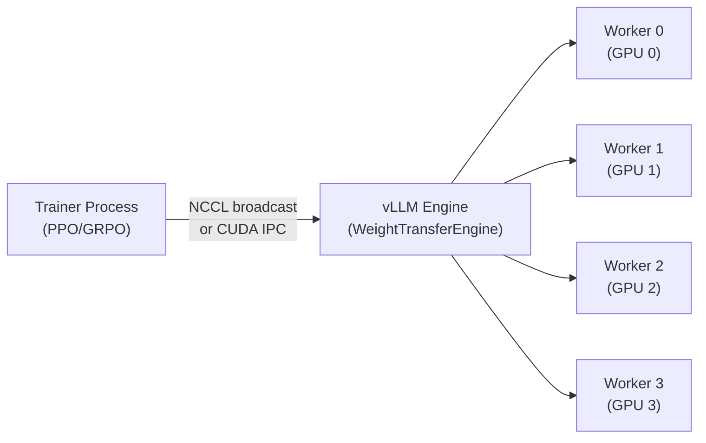

# Weight Transfer for RLHF

The weight transfer subsystem (`vllm/distributed/weight_transfer/`) enables online Reinforcement Learning from Human Feedback (RLHF) workflows where a trainer process updates model weights and pushes them to vLLM inference workers without restarting the server.

## Use Case

In RLHF training loops:

1. A **trainer** (e.g., PPO, GRPO) computes updated model weights
2. The trainer **pushes** the new weights to vLLM inference workers
3. vLLM workers **receive and load** the weights into the running model
4. Inference continues with the updated model

This enables tight training-inference loops without the overhead of saving/loading checkpoints.

## Architecture



## Backends

Two backends are available, registered in `vllm/distributed/weight_transfer/factory.py`:

| Backend | Module | Description |
|---------|--------|-------------|
| `nccl` | `NCCLWeightTransferEngine` | NCCL broadcast from trainer to workers |
| `ipc` | `IPCWeightTransferEngine` | CUDA IPC handles via HTTP or Ray |

### NCCL Backend

The NCCL backend (`vllm/distributed/weight_transfer/nccl_engine.py`) creates a stateless NCCL process group between the trainer and all inference workers:

```python
@dataclass
class NCCLWeightTransferInitInfo(WeightTransferInitInfo):
    master_address: str   # Trainer's IP address
    master_port: int      # Trainer's port
    rank_offset: int      # Offset for worker ranks in the combined group
    world_size: int       # Total size (trainer + all workers)
```

**Initialization:**

```python
# Trainer side
init_info = NCCLWeightTransferInitInfo(
    master_address="10.0.0.1",
    master_port=29600,
    rank_offset=1,  # Trainer is rank 0, workers start at rank 1
    world_size=1 + num_workers,
)

# Worker side (called via collective_rpc)
engine.init_transfer_engine(init_info)
```

**Weight transfer:**

```python
@dataclass
class NCCLWeightTransferUpdateInfo(WeightTransferUpdateInfo):
    names: list[str]          # Parameter names
    dtype_names: list[str]    # Data type names (e.g., "bfloat16")
    shapes: list[list[int]]   # Parameter shapes
    packed: bool = False      # Use packed tensor broadcasting
    packed_buffer_size_bytes: int = DEFAULT_PACKED_BUFFER_SIZE_BYTES
    packed_num_buffers: int = DEFAULT_PACKED_NUM_BUFFERS
```

#### Packed Broadcasting

For efficiency, multiple tensors can be batched into a single NCCL broadcast using `packed=True`. This reduces NCCL call overhead for models with many small parameters:

```python
# Trainer sends weights
trainer_args = NCCLTrainerSendWeightsArgs(
    group=nccl_communicator,
    src=0,
    packed=True,
    packed_buffer_size_bytes=256 * 1024 * 1024,  # 256 MiB buffer
    packed_num_buffers=2,  # Double buffering
)
engine.trainer_send_weights(state_dict.items(), trainer_args)
```

The packed transfer uses double/triple buffering to overlap packing and NCCL communication.

### IPC Backend

The IPC backend (`vllm/distributed/weight_transfer/ipc_engine.py`) uses CUDA IPC handles to share GPU memory directly between the trainer and workers. Two transport modes are supported:

| Mode | Description |
|------|-------------|
| `ray` | Trainer passes IPC handles via Ray object store |
| `http` | Trainer sends IPC handles via HTTP POST to vLLM's API |

```python
@dataclass
class IPCTrainerSendWeightsArgs:
    mode: str           # 'ray' or 'http'
    llm_handle: Any     # Ray ObjectRef (for 'ray' mode)
    url: str | None     # Base URL (for 'http' mode)
```

The IPC backend avoids data copying — the trainer's GPU tensors are directly accessible by the workers via CUDA IPC memory handles.

## Base Class

`WeightTransferEngine` (in `vllm/distributed/weight_transfer/base.py`) defines the interface:

```python
class WeightTransferEngine(ABC, Generic[TInitInfo, TUpdateInfo]):
    def init_transfer_engine(self, init_info: TInitInfo) -> None:
        """Initialize the transfer channel with the trainer."""

    def receive_weights(
        self,
        update_info: TUpdateInfo,
        load_weights: Callable[[list[tuple[str, torch.Tensor]]], None],
    ) -> None:
        """Receive weights from trainer and load them into the model."""

    def trainer_send_weights(
        self,
        state_dict_items: Iterator[tuple[str, torch.Tensor]],
        send_args: Any,
    ) -> None:
        """Called on the trainer side to send weights."""
```

## Configuration

```python
from vllm.config.weight_transfer import WeightTransferConfig

config = WeightTransferConfig(
    backend="nccl",  # or "ipc"
)
```

## Factory

The `WeightTransferEngineFactory` creates engines with lazy loading:

```python
from vllm.distributed.weight_transfer.factory import WeightTransferEngineFactory

engine = WeightTransferEngineFactory.create_engine(
    config=weight_transfer_config,
    parallel_config=parallel_config,
)
```

Custom backends can be registered:

```python
WeightTransferEngineFactory.register_engine(
    "my_backend",
    "mypackage.my_engine",
    "MyWeightTransferEngine",
)
```

## Rank Calculation

For DP deployments, each worker has a unique rank in the trainer-worker group:

```python
# From vllm/distributed/weight_transfer/nccl_engine.py
dp_rank = self.parallel_config.data_parallel_rank
world_size_per_dp = self.parallel_config.world_size  # TP * PP
rank_within_dp = self.parallel_config.rank

# Unique rank across all DP groups
worker_rank = dp_rank * world_size_per_dp + rank_within_dp
rank = worker_rank + init_info.rank_offset
```

## Packed Tensor Protocol

The `packed_tensor.py` module implements efficient multi-tensor broadcasting:

1. **Producer** (trainer): Packs multiple tensors into a fixed-size buffer, broadcasts when full
2. **Consumer** (worker): Receives packed buffers, unpacks tensors, calls `load_weights`

Double buffering (`packed_num_buffers=2`) allows the producer to fill one buffer while the consumer processes the previous one.

## Related Pages

- [Data Parallelism](data-parallelism.md) — DP rank configuration
- [Ray Executor](ray-executor.md) — Ray-based weight transfer
