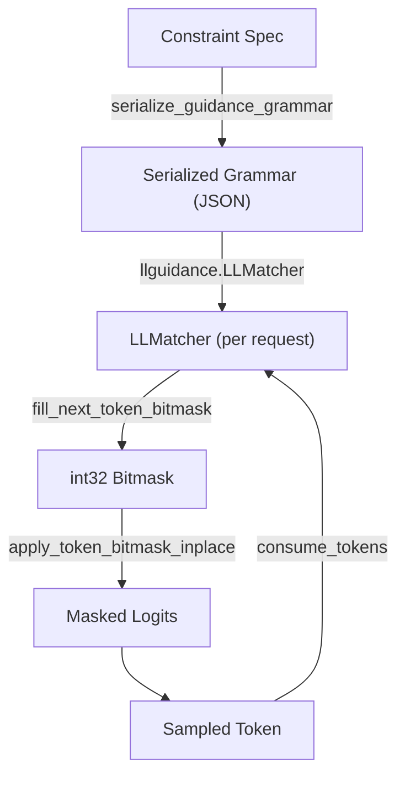

# llguidance Backend

The **guidance** backend (also called the llguidance backend) uses Microsoft's
[llguidance](https://github.com/guidance-ai/llguidance) library to implement
structured decoding. It supports JSON schemas, regular expressions, EBNF grammars,
choice constraints, and structural tags.

Source: `vllm/v1/structured_output/backend_guidance.py`

---

## Overview

llguidance uses a parser-based approach rather than a pure DFA. It compiles constraints
into a grammar representation that is then interpreted by an `LLMatcher` — a stateful
parser that tracks the current parse state and produces a token bitmask at each step.



---

## Initialization

`GuidanceBackend` initializes the llguidance tokenizer once at startup:

```python
@dataclass
class GuidanceBackend(StructuredOutputBackend):
    def __post_init__(self):
        self.disable_any_whitespace = (
            self.vllm_config.structured_outputs_config.disable_any_whitespace
        )
        self.disable_additional_properties = (
            self.vllm_config.structured_outputs_config.disable_additional_properties
        )
        self.ll_tokenizer = llguidance_hf.from_tokenizer(
            self.tokenizer,
            max(self.vocab_size, len(self.tokenizer))
        )
```

The `ll_tokenizer` is an `llguidance.LLTokenizer` that wraps the HuggingFace tokenizer
and provides the token-level interface needed by llguidance.

> **Note:** The guidance backend does **not** support Mistral tokenizers. Use
> `xgrammar` or `outlines` instead, or set `tokenizer_mode='hf'`.

---

## Grammar Serialization

Before compilation, the constraint is serialized into a JSON grammar format understood
by llguidance. This is done by `serialize_guidance_grammar()`:

```python
def serialize_guidance_grammar(
    request_type: StructuredOutputOptions,
    grammar_spec: str | dict[str, Any],
    disable_any_whitespace: bool = False,
    disable_additional_properties: bool = False,
) -> str:
    if request_type == StructuredOutputOptions.JSON:
        return _process_schema(grammar_spec)
    elif request_type == StructuredOutputOptions.JSON_OBJECT:
        return llguidance.LLMatcher.grammar_from_json_schema(
            '{"type": "object"}',
            defaults={"whitespace_flexible": not disable_any_whitespace},
        )
    elif request_type == StructuredOutputOptions.REGEX:
        return llguidance.grammar_from("regex", grammar_spec)
    elif request_type == StructuredOutputOptions.GRAMMAR:
        return llguidance.grammar_from("grammar", grammar_spec)
    elif request_type == StructuredOutputOptions.CHOICE:
        return llguidance.grammar_from("choice", grammar_spec)
    elif request_type == StructuredOutputOptions.STRUCTURAL_TAG:
        # Build StructTag objects and serialize
        ...
```

### JSON Schema Processing

For JSON schemas, llguidance uses `LLMatcher.grammar_from_json_schema()` with
configurable whitespace flexibility:

```python
def _process_schema(grammar_spec):
    if disable_additional_properties:
        grammar_spec = process_for_additional_properties(grammar_spec)
    return llguidance.LLMatcher.grammar_from_json_schema(
        grammar_spec,
        defaults={"whitespace_flexible": not disable_any_whitespace},
    )
```

---

## Grammar Compilation

```python
def compile_grammar(
    self, request_type: StructuredOutputOptions, grammar_spec: str
) -> StructuredOutputGrammar:
    serialized = serialize_guidance_grammar(
        request_type, grammar_spec,
        self.disable_any_whitespace,
        self.disable_additional_properties,
    )
    ll_matcher = llguidance.LLMatcher(
        self.ll_tokenizer,
        serialized,
        log_level=int(os.environ.get("LLGUIDANCE_LOG_LEVEL", "1")),
    )
    grammar = GuidanceGrammar(
        ll_matcher=ll_matcher,
        ll_tokenizer=self.ll_tokenizer,
        vocab_size=self.vocab_size,
    )
    grammar.check_error()
    return grammar
```

---

## Grammar State: `GuidanceGrammar`

Each request gets a `GuidanceGrammar` wrapping an `llguidance.LLMatcher`.

```python
@dataclass
class GuidanceGrammar(StructuredOutputGrammar):
    ll_matcher: llguidance.LLMatcher
    ll_tokenizer: llguidance.LLTokenizer
    vocab_size: int
    printed_error: bool = False
    terminated: bool = False
    rollback_lag: int = 0
```

### Token Acceptance

```python
def accept_tokens(self, request_id: str, tokens: list[int]) -> bool:
    if self.ll_tokenizer.eos_token in tokens:
        if self.ll_matcher.is_stopped() and not self.terminated:
            self.rollback_lag = 1
        self.terminated = True

    if self.ll_matcher.is_stopped():
        return True

    r = self.ll_matcher.consume_tokens(tokens)
    self.check_error()
    return r
```

The `rollback_lag` field handles a subtle edge case: when the EOS token is accepted
while the matcher is already stopped, a rollback of 1 is needed to avoid double-counting.

### Bitmask Filling

```python
def fill_bitmask(self, bitmask: torch.Tensor, idx: int) -> None:
    # Automatically returns [EOS] mask if matcher is stopped or in error state
    llguidance_torch.fill_next_token_bitmask(self.ll_matcher, bitmask, idx)
    self.check_error()
```

### Error Handling

The `check_error()` method polls the matcher for errors and logs them as warnings
without crashing the request:

```python
def check_error(self):
    if not self.printed_error:
        err = self.ll_matcher.get_error()
        if err:
            self.printed_error = True
            logger.warning("LLMatcher error: %s", err)
```

---

## Supported Constraint Types

| Constraint | Supported |
|---|---|
| JSON Schema | ✅ |
| JSON Object | ✅ |
| Regex | ✅ |
| EBNF Grammar | ✅ |
| Choice | ✅ |
| Structural Tag | ✅ |

---

## Unsupported JSON Schema Features

The guidance backend does not support `patternProperties` in JSON schemas:

```python
def has_guidance_unsupported_json_features(schema: dict[str, Any]) -> bool:
    def check_object(obj):
        if "patternProperties" in obj:
            return True
        ...
    return check_object(schema)
```

If a schema contains `patternProperties`, the `auto` backend will fall back to
outlines instead.

---

## `additionalProperties` Handling

By default, llguidance allows additional properties in JSON objects (properties not
listed in the schema). This differs from xgrammar and outlines, which reject them.

Setting `disable_additional_properties=True` makes the guidance backend inject
`"additionalProperties": false` into every object definition that has `properties`
or `patternProperties`:

```python
def _walk_json_for_additional_properties(data: object):
    if isinstance(data, dict):
        for value in data.values():
            _walk_json_for_additional_properties(value)
        if "additionalProperties" not in data and (
            "properties" in data or "patternProperties" in data
        ):
            data["additionalProperties"] = False
```

This option is only available for the guidance backend:

```python
# Server-wide configuration
structured_outputs_config = {
    "backend": "guidance",
    "disable_additional_properties": True,
}
```

---

## Whitespace Control

The `disable_any_whitespace` option controls whether the model can generate optional
whitespace between JSON fields:

```python
# Compact JSON output (no extra whitespace)
structured_outputs_config = {
    "backend": "guidance",
    "disable_any_whitespace": True,
}
```

When `disable_any_whitespace=False` (default), the `whitespace_flexible` option is
passed to `grammar_from_json_schema()`, allowing the model to generate whitespace.

---

## Structural Tag Support

The guidance backend supports structural tags for tool-calling scenarios. Each tag
is represented as an `llguidance.StructTag` with a trigger, begin marker, grammar,
and end marker:

```python
tags = [
    llguidance.StructTag(
        trigger="<function=",
        begin="<function=get_weather>",
        grammar=_process_schema(structure["schema"]),
        end="</function>",
    )
]
return llguidance.StructTag.to_grammar(tags)
```

---

## Configuration

| Setting | Default | Description |
|---|---|---|
| `LLGUIDANCE_LOG_LEVEL` | `1` | Log level for llguidance (0=off, 1=warnings, 2=debug) |
| `disable_any_whitespace` | `False` | Force compact JSON output |
| `disable_additional_properties` | `False` | Inject `additionalProperties: false` |

---

## Example: JSON Schema

```python
from vllm import LLM, SamplingParams
from vllm.sampling_params import StructuredOutputsParams

schema = {
    "type": "object",
    "properties": {
        "name": {"type": "string"},
        "score": {"type": "number", "minimum": 0, "maximum": 100},
        "tags": {"type": "array", "items": {"type": "string"}},
    },
    "required": ["name", "score"],
}

llm = LLM(
    model="Qwen/Qwen2.5-3B-Instruct",
    structured_outputs_config={"backend": "guidance"},
)
params = SamplingParams(
    structured_outputs=StructuredOutputsParams(json=schema),
    max_tokens=200,
)
outputs = llm.generate("Rate the movie Inception", sampling_params=params)
print(outputs[0].outputs[0].text)
```

## Example: EBNF Grammar

```python
grammar = """
root ::= sentence
sentence ::= noun " " verb " " noun
noun ::= "cat" | "dog" | "bird"
verb ::= "chases" | "sees" | "follows"
"""

params = SamplingParams(
    structured_outputs=StructuredOutputsParams(grammar=grammar),
    max_tokens=20,
)
outputs = llm.generate("Generate a simple sentence:", sampling_params=params)
```

## Example: Regex

```python
params = SamplingParams(
    structured_outputs=StructuredOutputsParams(
        regex=r"\d{4}-\d{2}-\d{2}"  # ISO date format
    ),
    max_tokens=10,
)
outputs = llm.generate("What is today's date?", sampling_params=params)
```

---

## See Also

- [Structured Output Overview](overview.md)
- [xgrammar backend](backend-xgrammar.md)
- [outlines backend](backend-outlines.md)
- [guided_decoding_backend configuration](guided-decoding-backend.md)
