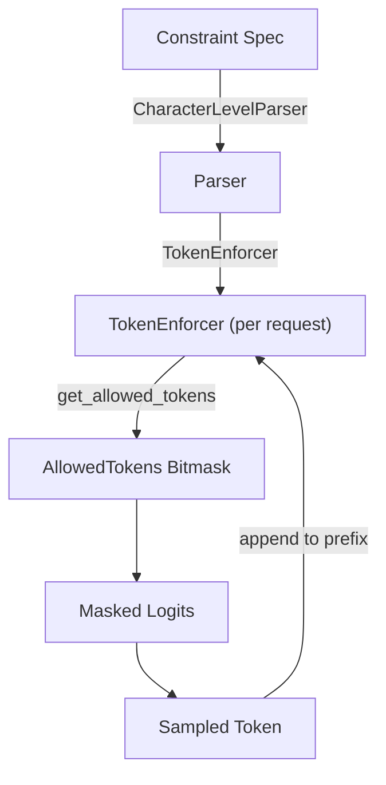

# lm-format-enforcer Backend

The **lm-format-enforcer** backend uses the
[lm-format-enforcer](https://github.com/noamgat/lm-format-enforcer) library to
constrain token generation. It operates at the character level, building a
`TokenEnforcer` that tracks which tokens are allowed at each position based on
the current output prefix.

Source: `vllm/v1/structured_output/backend_lm_format_enforcer.py`

---

## Overview

Unlike xgrammar (which uses compiled FSMs) or outlines (which uses DFAs), lm-format-enforcer
uses a character-level parser approach. It maintains the full token prefix and queries
the parser for allowed tokens at each step.



---

## Initialization

`LMFormatEnforcerBackend` builds tokenizer data once at startup using an LRU-cached
helper:

```python
@dataclass
class LMFormatEnforcerBackend(StructuredOutputBackend):
    def __post_init__(self):
        self.tokenizer_data = _cached_build_vllm_token_enforcer_tokenizer_data(
            self.tokenizer, self.vocab_size
        )
```

The `_cached_build_vllm_token_enforcer_tokenizer_data()` function is decorated with
`@lru_cache` so the tokenizer data is computed only once per unique
`(tokenizer, vocab_size)` combination:

```python
@lru_cache
def _cached_build_vllm_token_enforcer_tokenizer_data(
    tokenizer: PreTrainedTokenizerBase, vocab_size: int
) -> lmfe_vllm.TokenEnforcerTokenizerData:
    return lmfe_vllm.build_vllm_token_enforcer_tokenizer_data(
        tokenizer, use_bitmask=True, vocab_size=vocab_size
    )
```

> **Note:** The lm-format-enforcer backend does **not** support Mistral tokenizers.
> Use `xgrammar` or `outlines` instead.

---

## Grammar Compilation

The `compile_grammar()` method creates a `CharacterLevelParser` appropriate for the
constraint type, then wraps it in a `TokenEnforcer`:

```python
def compile_grammar(
    self, request_type: StructuredOutputOptions, grammar_spec: str
) -> StructuredOutputGrammar:
    if request_type == StructuredOutputOptions.JSON:
        spec_dict = json.loads(grammar_spec)
        character_level_parser = lmformatenforcer.JsonSchemaParser(spec_dict)
    elif request_type == StructuredOutputOptions.JSON_OBJECT:
        character_level_parser = lmformatenforcer.JsonSchemaParser(None)
    elif request_type == StructuredOutputOptions.REGEX:
        character_level_parser = lmformatenforcer.RegexParser(grammar_spec)
    elif request_type == StructuredOutputOptions.CHOICE:
        choices = ast.literal_eval(grammar_spec)
        character_level_parser = lmformatenforcer.UnionParser(
            [lmformatenforcer.StringParser(choice) for choice in choices]
        )
    else:
        raise ValueError(...)

    token_enforcer = lmformatenforcer.TokenEnforcer(
        tokenizer_data=self.tokenizer_data,
        parser=character_level_parser,
    )
    return LMFormatEnforcerGrammar(token_enforcer)
```

### Character-Level Parsers

| Constraint | Parser Class |
|---|---|
| JSON Schema | `lmformatenforcer.JsonSchemaParser(schema_dict)` |
| JSON Object | `lmformatenforcer.JsonSchemaParser(None)` |
| Regex | `lmformatenforcer.RegexParser(pattern)` |
| Choice | `lmformatenforcer.UnionParser([StringParser(c) for c in choices])` |

---

## Grammar State: `LMFormatEnforcerGrammar`

Each request gets an `LMFormatEnforcerGrammar` that maintains the full token prefix:

```python
@dataclass
class LMFormatEnforcerGrammar(StructuredOutputGrammar):
    token_enforcer: lmformatenforcer.TokenEnforcer
    current_tokens_prefix: list[int] = field(default_factory=list)
```

### Token Acceptance

```python
def accept_tokens(self, request_id: str, tokens: list[int]) -> bool:
    original_len = len(self.current_tokens_prefix)
    for token in tokens:
        if not self.token_enforcer.get_allowed_tokens(
            self.current_tokens_prefix
        ).is_token_allowed(token):
            # Rollback partial updates to ensure atomicity
            del self.current_tokens_prefix[original_len:]
            return False
        self.current_tokens_prefix.append(token)
    return True
```

The prefix is checked atomically: if any token in the list is rejected, the entire
list is rejected and the prefix is restored.

### Bitmask Filling

```python
def fill_bitmask(self, bitmask: torch.Tensor, batch_index: int) -> None:
    allowed_tokens = self.token_enforcer.get_allowed_tokens(
        self.current_tokens_prefix
    )
    bitmask[batch_index] = allowed_tokens.allowed_tokens
```

The `get_allowed_tokens()` call is made with the current prefix, returning a bitmask
of all tokens that can legally follow.

### Termination Detection

The grammar is considered terminated when the last token in the prefix is the EOS token:

```python
def is_terminated(self) -> bool:
    return (
        len(self.current_tokens_prefix) > 0
        and self.current_tokens_prefix[-1] == self.token_enforcer.eos_token_id
    )
```

### Rollback

```python
def rollback(self, num_tokens: int) -> None:
    self.current_tokens_prefix = self.current_tokens_prefix[:-num_tokens]
```

---

## Supported Constraint Types

| Constraint | Supported |
|---|---|
| JSON Schema | ✅ |
| JSON Object | ✅ |
| Regex | ✅ |
| EBNF Grammar | ❌ |
| Choice | ✅ |
| Structural Tag | ❌ |

Grammar and structural tag constraints are not supported. Attempting to use them
raises a `ValueError`:

```python
elif so_params.grammar:
    raise ValueError(
        "LM Format Enforcer structured outputs backend "
        "does not support grammar specifications"
    )
```

---

## Speculative Decoding Limitation

The lm-format-enforcer backend does **not** support speculative decoding. If
speculative decoding is configured, compilation will raise a `ValueError`:

```python
if max_rollback_tokens > 0:
    raise ValueError(
        "LM Format Enforcer backend does not support speculative tokens"
    )
```

---

## Validation

The `validate_structured_output_request_lm_format_enforcer()` function validates
requests before scheduling:

```python
def validate_structured_output_request_lm_format_enforcer(params: SamplingParams):
    so_params = params.structured_outputs

    if so_params.regex:
        return  # Regex is always valid
    elif so_params.json:
        # Validate JSON is parseable
        if isinstance(so_params.json, str):
            json.loads(so_params.json)
        else:
            json.dumps(so_params.json)
    elif so_params.choice:
        return  # Choice is always valid
    elif so_params.grammar:
        raise ValueError("LM Format Enforcer does not support grammar specifications")
```

---

## Example: JSON Schema

```python
from vllm import LLM, SamplingParams
from vllm.sampling_params import StructuredOutputsParams

schema = {
    "type": "object",
    "properties": {
        "title": {"type": "string"},
        "rating": {"type": "integer", "minimum": 1, "maximum": 5},
    },
    "required": ["title", "rating"],
}

llm = LLM(
    model="Qwen/Qwen2.5-3B-Instruct",
    structured_outputs_config={"backend": "lm-format-enforcer"},
)
params = SamplingParams(
    structured_outputs=StructuredOutputsParams(json=schema),
    max_tokens=100,
)
outputs = llm.generate("Review the movie Inception", sampling_params=params)
print(outputs[0].outputs[0].text)
```

## Example: Regex

```python
params = SamplingParams(
    structured_outputs=StructuredOutputsParams(
        regex=r"\(\d{3}\) \d{3}-\d{4}"  # US phone number format
    ),
    max_tokens=20,
)
outputs = llm.generate("Generate a US phone number:", sampling_params=params)
```

## Example: Choice

```python
params = SamplingParams(
    structured_outputs=StructuredOutputsParams(
        choice=["yes", "no", "maybe"]
    ),
)
outputs = llm.generate(
    "Will it rain tomorrow? Answer with yes, no, or maybe:",
    sampling_params=params,
)
```

---

## Limitations Summary

| Limitation | Details |
|---|---|
| No grammar support | EBNF grammars are not supported |
| No structural tag support | Structural tags are not supported |
| No speculative decoding | Raises `ValueError` if speculative tokens > 0 |
| No Mistral tokenizer | Use `xgrammar` or `outlines` instead |
| Prefix-based state | Maintains full token history; memory grows with output length |

---

## See Also

- [Structured Output Overview](overview.md)
- [xgrammar backend](backend-xgrammar.md)
- [outlines backend](backend-outlines.md)
- [guided_decoding_backend configuration](guided-decoding-backend.md)
