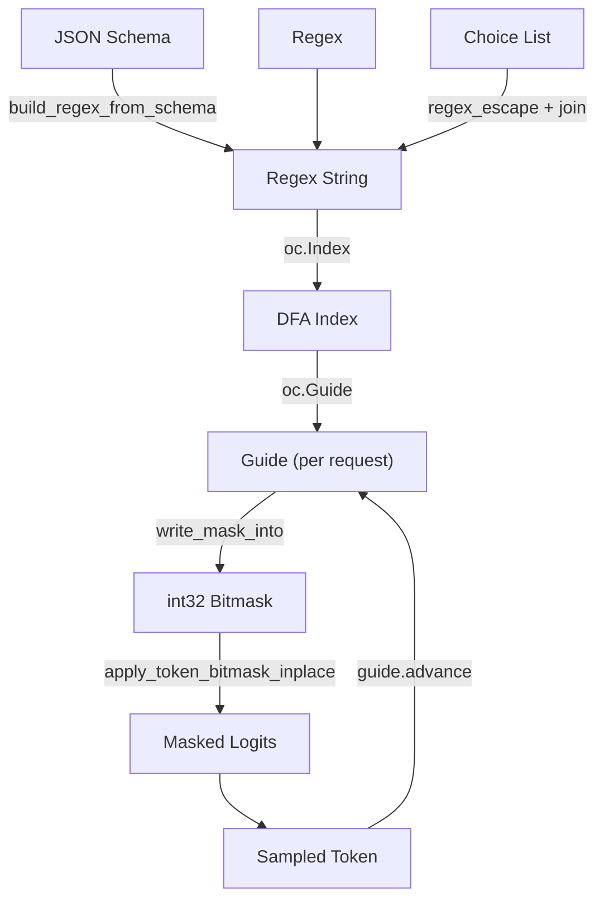

# Outlines Backend

The **outlines** backend uses the [outlines-core](https://github.com/dottxt-ai/outlines-core)
library to implement FSM-based structured decoding. It converts JSON schemas and regular
expressions into deterministic finite automata (DFAs) and uses them to constrain token
generation.

Source: `vllm/v1/structured_output/backend_outlines.py`

---

## Overview

The outlines backend works by:

1. Converting the constraint (JSON schema or regex) into a regular expression string
2. Building a DFA index from the regex and the model's vocabulary
3. Using the DFA to produce a token bitmask at each decode step



---

## Initialization

`OutlinesBackend` builds the vocabulary representation once at startup:

```python
@dataclass
class OutlinesBackend(StructuredOutputBackend):
    def __post_init__(self):
        self.vocabulary = get_outlines_vocabulary(self.tokenizer)
        self.cache = get_outlines_cache()
```

### Vocabulary Construction

The `get_outlines_vocabulary()` function (in `vllm/v1/structured_output/utils.py`)
converts the tokenizer's vocabulary into an `outlines_core.Vocabulary` object. This
involves:

- Mapping each token to its byte representation
- Handling special encoding schemes (Llama `<0xXX>` tokens, GPT-2 byte fallback)
- Excluding special tokens (EOS, BOS, etc.)

The vocabulary is wrapped in `OutlinesVocabulary` which adds a SHA-256 hash for use
as a cache key.

---

## Grammar Compilation

```python
def compile_grammar(
    self, request_type: StructuredOutputOptions, grammar_spec: str
) -> StructuredOutputGrammar:
    if request_type == StructuredOutputOptions.JSON:
        regex = json_schema.build_regex_from_schema(grammar_spec)
    elif request_type == StructuredOutputOptions.REGEX:
        regex = grammar_spec
    elif request_type == StructuredOutputOptions.CHOICE:
        choices = ast.literal_eval(grammar_spec)
        choices = [regex_escape(c) for c in choices]
        regex = "(" + "|".join(choices) + ")"
    else:
        raise ValueError(...)

    index = self._compile_index(regex, self.vocabulary)
    return OutlinesGrammar(
        vocab_size=self.vocab_size,
        guide=oc.Guide(index, max_rollback=max_rollback_tokens),
    )
```

### Index Caching

Compiled DFA indices are cached in memory (or on disk if `VLLM_V1_USE_OUTLINES_CACHE`
is set). The cache key combines the vocabulary hash and the regex string:

```python
def _compile_index(self, regex_string: str, vocabulary: OutlinesVocabulary) -> oc.Index:
    cache_key = f"{vocabulary._hash}_{regex_string}"
    if cache_key in self.cache:
        return self.cache[cache_key]
    index = oc.Index(regex_string, vocabulary.inner)
    self.cache[cache_key] = index
    return index
```

---

## Grammar State: `OutlinesGrammar`

Each request gets an `OutlinesGrammar` wrapping an `outlines_core.Guide`.

```python
@dataclass
class OutlinesGrammar(StructuredOutputGrammar):
    vocab_size: int
    guide: oc.Guide
    num_processed_tokens: int = 0
    _prev_finished: bool = False
```

### Termination Delay

outlines-core signals completion when the DFA reaches an accept state. However, vLLM
expects the grammar to remain active until after the EOS token is emitted. The
`_prev_finished` flag implements a one-step delay:

```python
def is_terminated(self) -> bool:
    curr = self.guide.is_finished()
    prev = self._prev_finished
    self._prev_finished = curr
    return prev  # Return the previous state, not the current one
```

### Bitmask Filling

The outlines backend writes the bitmask directly into the tensor's memory using a
pointer-based API:

```python
def fill_bitmask(self, bitmask: torch.Tensor, idx: int) -> None:
    mask = bitmask[idx]
    self.guide.write_mask_into(mask.data_ptr(), mask.numel(), mask.element_size())
```

### Token Acceptance

```python
def accept_tokens(self, request_id: str, tokens: list[int]) -> bool:
    if self.guide.accepts_tokens(tokens):
        for t in tokens:
            self.guide.advance(t)
            self.num_processed_tokens += 1
        return True
    return False
```

> **Note:** `accepts_tokens()` checks whether the current tokens can be accepted,
> while `advance()` additionally checks that the next state is not a dead state.
> Both checks are needed to ensure correctness.

---

## Supported Constraint Types

| Constraint | Supported |
|---|---|
| JSON Schema | ✅ |
| JSON Object | ❌ |
| Regex | ✅ |
| EBNF Grammar | ❌ |
| Choice | ✅ |
| Structural Tag | ❌ |

The outlines backend does **not** support EBNF grammars or structural tags. Attempting
to use these will raise a `ValueError` during validation.

---

## Regex Validation

The outlines backend validates regex patterns before compilation to catch unsupported
features. The `validate_regex_is_buildable()` function checks for:

### Unsupported Regex Features

| Feature | Reason |
|---|---|
| Backreferences (`\1`, `(?P=name)`) | Not supported by the `regex-automata` Rust crate |
| Look-around assertions (`(?=...)`, `(?!...)`) | Not supported by `regex-automata` |
| Unicode word boundaries (`\b`, `\B`) | Not supported by `regex-automata` |
| Anchors at start (`^`) | Requires context before first token |

```python
def validate_regex_is_buildable(pattern: str) -> None:
    """
    Validates that the input regex is not using unsupported features
    of the `regex-automata` crate and has a universal start state.
    """
    parsed = sre_parse.parse(pattern)
    _check_unsupported(parsed)
    if _prefix_needs_context(parsed):
        raise ValueError(
            "Regex does not have an anchored universal start state..."
        )
```

### Universal Start State Requirement

The DFA must have a "universal start state" — it must be able to begin matching
without any prior context. This means patterns that start with anchors (`^`) or
look-arounds that require preceding context are rejected.

---

## Caching

### In-Memory Cache (Default)

By default, outlines uses an LRU cache with a maximum of 128 entries:

```python
return LRUCache(maxsize=128)
```

### On-Disk Cache

Set `VLLM_V1_USE_OUTLINES_CACHE=1` to enable persistent on-disk caching:

```bash
export VLLM_V1_USE_OUTLINES_CACHE=1
export OUTLINES_CACHE_DIR=/path/to/cache  # optional
```

> **Warning:** The on-disk cache is unbounded and may consume significant disk space.
> Do not use with untrusted clients.

The cache directory is resolved in this priority order:
1. `OUTLINES_CACHE_DIR` environment variable
2. `$XDG_CACHE_HOME/.cache/outlines`
3. `~/.cache/outlines`
4. `$TMPDIR/.cache/outlines` (fallback for containers)

---

## Speculative Decoding

The outlines backend supports speculative decoding via the `max_rollback` parameter
of `oc.Guide`:

```python
max_rollback_tokens = (
    self.vllm_config.speculative_config.num_speculative_tokens
    if self.vllm_config.speculative_config is not None
    else 0
)
return OutlinesGrammar(
    vocab_size=self.vocab_size,
    guide=oc.Guide(index, max_rollback=max_rollback_tokens),
)
```

---

## Example: JSON Schema

```python
from vllm import LLM, SamplingParams
from vllm.sampling_params import StructuredOutputsParams
import json

schema = {
    "type": "object",
    "properties": {
        "name": {"type": "string"},
        "age": {"type": "integer"},
        "email": {"type": "string", "format": "email"},
    },
    "required": ["name", "age"],
}

llm = LLM(
    model="Qwen/Qwen2.5-3B-Instruct",
    structured_outputs_config={"backend": "outlines"},
)
params = SamplingParams(
    structured_outputs=StructuredOutputsParams(json=schema),
    max_tokens=100,
)
outputs = llm.generate("Generate a user profile", sampling_params=params)
print(outputs[0].outputs[0].text)
```

## Example: Regex

```python
params = SamplingParams(
    structured_outputs=StructuredOutputsParams(
        regex=r"[a-z0-9.]{1,20}@\w{6,10}\.com"
    ),
    max_tokens=50,
)
outputs = llm.generate(
    "Generate an email address for Alan Turing at Enigma",
    sampling_params=params,
)
```

## Example: Choice

```python
params = SamplingParams(
    structured_outputs=StructuredOutputsParams(
        choice=["positive", "negative", "neutral"]
    ),
)
outputs = llm.generate(
    "Classify the sentiment: vLLM is wonderful!",
    sampling_params=params,
)
```

---

## See Also

- [Structured Output Overview](overview.md)
- [xgrammar backend](backend-xgrammar.md)
- [guided_decoding_backend configuration](guided-decoding-backend.md)
