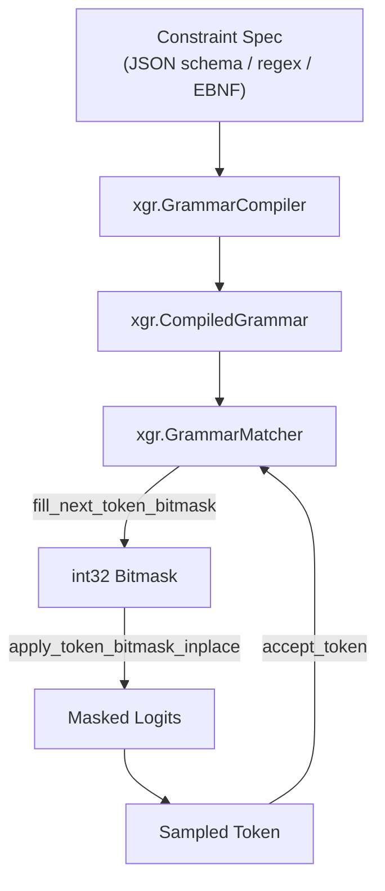

# xgrammar Backend

The **xgrammar** backend is vLLM's default and most capable structured output backend.
It uses the [XGrammar](https://github.com/mlc-ai/xgrammar) library to compile JSON
schemas, regular expressions, EBNF grammars, and structural tags into efficient
finite-state machines (FSMs) that guide token generation.

Source: `vllm/v1/structured_output/backend_xgrammar.py`

---

## Overview

xgrammar compiles a constraint specification into a `CompiledGrammar` object, then
wraps it in a `GrammarMatcher` that tracks the current FSM state and produces a
token bitmask at each decode step. The bitmask is a packed int32 tensor where each
bit indicates whether the corresponding vocabulary token is allowed.



---

## Initialization

`XgrammarBackend` is a dataclass that extends `StructuredOutputBackend`. It is
initialized once per engine and shared across all requests using the xgrammar backend.

```python
# From vllm/v1/structured_output/backend_xgrammar.py
@dataclass
class XgrammarBackend(StructuredOutputBackend):
    def __post_init__(self):
        # Build tokenizer info for xgrammar
        tokenizer_info = xgr.TokenizerInfo.from_huggingface(
            self.tokenizer,
            vocab_size=self.vocab_size,
        )
        # Create the grammar compiler with caching
        self.compiler = xgr.GrammarCompiler(
            tokenizer_info,
            max_threads=8,
            cache_enabled=True,
            cache_limit_bytes=vllm.envs.VLLM_XGRAMMAR_CACHE_MB * 1024 * 1024,
        )
```

### Mistral Tokenizer Handling

Mistral tokenizers require special treatment because their vocabulary encoding differs
from HuggingFace tokenizers. xgrammar is configured with `VocabType.RAW` for Tekken
tokenizers and `VocabType.BYTE_FALLBACK` for others:

```python
if is_mistral_tokenizer(self.tokenizer):
    tokenizer_info = xgr.TokenizerInfo(
        encoded_vocab=self.tokenizer.vocab,
        vocab_type=xgr.VocabType.RAW if self.tokenizer.is_tekken
                   else xgr.VocabType.BYTE_FALLBACK,
        vocab_size=self.vocab_size,
        stop_token_ids=stop_token_ids,
        add_prefix_space=True,
    )
```

---

## Grammar Compilation

The `compile_grammar()` method dispatches to the appropriate xgrammar compiler method
based on the constraint type:

```python
def compile_grammar(
    self, request_type: StructuredOutputOptions, grammar_spec: str
) -> StructuredOutputGrammar:
    if request_type == StructuredOutputOptions.JSON:
        ctx = self.compiler.compile_json_schema(
            grammar_spec,
            any_whitespace=not self.disable_any_whitespace
        )
    elif request_type == StructuredOutputOptions.JSON_OBJECT:
        ctx = self.compiler.compile_json_schema(
            '{"type": "object"}',
            any_whitespace=not self.disable_any_whitespace
        )
    elif request_type == StructuredOutputOptions.GRAMMAR:
        ctx = self.compiler.compile_grammar(grammar_spec)
    elif request_type == StructuredOutputOptions.REGEX:
        ctx = self.compiler.compile_regex(grammar_spec)
    elif request_type == StructuredOutputOptions.STRUCTURAL_TAG:
        ctx = self.compiler.compile_structural_tag(grammar_spec)
    ...
    return XgrammarGrammar(
        matcher=xgr.GrammarMatcher(ctx, max_rollback_tokens=self.num_speculative_tokens),
        vocab_size=self.vocab_size,
        ctx=ctx,
    )
```

### Lark Grammar Conversion

xgrammar only supports EBNF grammars. If a Lark-format grammar is detected (via
`grammar_is_likely_lark()`), it is automatically converted to EBNF before compilation:

```python
if grammar_is_likely_lark(so_params.grammar):
    so_params.grammar = convert_lark_to_ebnf(so_params.grammar)
```

The converter handles:
- Lark rule syntax (`rule: definition`) → EBNF (`rule ::= definition`)
- Single-quoted strings → double-quoted strings
- Alternative rules (`|`) on separate lines

---

## Grammar Matching: `XgrammarGrammar`

Each request gets its own `XgrammarGrammar` instance wrapping an `xgr.GrammarMatcher`.

### Key Methods

| Method | Description |
|---|---|
| `accept_tokens(request_id, tokens)` | Advance the FSM by accepting tokens; returns `False` on failure |
| `validate_tokens(tokens)` | Check tokens without advancing; returns accepted prefix |
| `rollback(num_tokens)` | Roll back FSM state by N tokens (for speculative decoding) |
| `fill_bitmask(bitmask, idx)` | Fill bitmask row `idx` with allowed next tokens |
| `is_terminated()` | Returns `True` when the FSM has reached an accept state |
| `reset()` | Reset FSM to initial state |

```python
@dataclass
class XgrammarGrammar(StructuredOutputGrammar):
    vocab_size: int
    matcher: xgr.GrammarMatcher
    ctx: xgr.CompiledGrammar
    num_processed_tokens: int = 0
    _is_terminated: bool = False

    def fill_bitmask(self, bitmask: torch.Tensor, idx: int) -> None:
        self.matcher.fill_next_token_bitmask(bitmask, idx)

    def accept_tokens(self, request_id: str, tokens: list[int]) -> bool:
        for token in tokens:
            if not self.matcher.accept_token(token):
                return False
            self.num_processed_tokens += 1
        self._is_terminated = self.matcher.is_terminated()
        return True
```

### Speculative Decoding Support

When speculative decoding is enabled, the `GrammarMatcher` is created with
`max_rollback_tokens` set to the number of speculative tokens. This allows the FSM
to roll back if speculative tokens are rejected:

```python
self.num_speculative_tokens = (
    self.vllm_config.speculative_config.num_speculative_tokens
)
# ...
matcher=xgr.GrammarMatcher(
    ctx,
    max_rollback_tokens=self.num_speculative_tokens,
)
```

---

## Compiler Cache

xgrammar maintains an in-process LRU cache of compiled grammars to avoid recompiling
the same schema for repeated requests. The cache size is controlled by the environment
variable `VLLM_XGRAMMAR_CACHE_MB` (default: 512 MB):

```bash
export VLLM_XGRAMMAR_CACHE_MB=1024  # 1 GB cache
```

The cache is keyed by the grammar specification string, so identical schemas share
the same compiled grammar.

---

## Supported JSON Schema Features

xgrammar supports a broad subset of JSON Schema. The following features are **not**
supported and will cause validation to fail (or fall back to another backend in `auto`
mode):

| Feature | Unsupported Keywords |
|---|---|
| Numeric constraints | `multipleOf` |
| Array constraints | `uniqueItems`, `contains`, `minContains`, `maxContains` |
| String formats | Any format not in the supported list below |
| Object constraints | `patternProperties`, `propertyNames` |

### Supported String Formats

`email`, `date`, `time`, `date-time`, `duration`, `ipv4`, `ipv6`, `hostname`, `uuid`,
`uri`, `uri-reference`, `uri-template`, `json-pointer`, `relative-json-pointer`

The check is implemented in `has_xgrammar_unsupported_json_features()`:

```python
def has_xgrammar_unsupported_json_features(schema: dict[str, Any]) -> bool:
    """Check if JSON schema contains features unsupported by xgrammar."""
    def check_object(obj):
        if obj.get("type") in ("integer", "number") and "multipleOf" in obj:
            return True
        if obj.get("type") == "array" and any(
            key in obj for key in ("uniqueItems", "contains", ...)
        ):
            return True
        ...
    return check_object(schema)
```

---

## Validation

Before a request is scheduled, `validate_xgrammar_grammar()` pre-validates the
constraint to catch errors early:

- **Regex**: Parsed with `xgr.Grammar.from_regex()`
- **Choice**: Converted to EBNF and parsed with `xgr.Grammar.from_ebnf()`
- **JSON Schema**: Checked for unsupported features, then parsed with
  `xgr.Grammar.from_json_schema()`
- **Grammar**: Optionally converted from Lark, then parsed with
  `xgr.Grammar.from_ebnf()`
- **Structural Tag**: Parsed with `xgr.Grammar.from_structural_tag()`

---

## Configuration

| Setting | Default | Description |
|---|---|---|
| `VLLM_XGRAMMAR_CACHE_MB` | `512` | Grammar compiler cache size in MB |
| `disable_any_whitespace` | `False` | Force compact JSON (no extra whitespace) |

### Whitespace Control

By default, xgrammar allows the model to generate optional whitespace between JSON
fields (e.g. `{"key": "value"}` or `{"key":"value"}`). Setting
`disable_any_whitespace=True` forces compact output:

```python
# Via StructuredOutputsConfig (server-wide)
structured_outputs_config = {"backend": "xgrammar", "disable_any_whitespace": True}

# Via per-request StructuredOutputsParams
params = StructuredOutputsParams(json=schema, disable_any_whitespace=True)
```

---

## Example: JSON Schema

```python
from pydantic import BaseModel
from enum import Enum
from vllm import LLM, SamplingParams
from vllm.sampling_params import StructuredOutputsParams

class CarType(str, Enum):
    sedan = "sedan"
    suv = "SUV"
    truck = "Truck"

class CarDescription(BaseModel):
    brand: str
    model: str
    car_type: CarType

llm = LLM(
    model="Qwen/Qwen2.5-3B-Instruct",
    structured_outputs_config={"backend": "xgrammar"},
)
params = SamplingParams(
    structured_outputs=StructuredOutputsParams(
        json=CarDescription.model_json_schema()
    ),
    max_tokens=100,
)
outputs = llm.generate(
    "Describe the most iconic car from the 90s",
    sampling_params=params,
)
print(outputs[0].outputs[0].text)
```

## Example: EBNF Grammar

```python
grammar = """
root ::= select_statement
select_statement ::= "SELECT " column " from " table " where " condition
column ::= "col_1 " | "col_2 "
table ::= "table_1 " | "table_2 "
condition ::= column "= " number
number ::= "1 " | "2 "
"""

params = SamplingParams(
    structured_outputs=StructuredOutputsParams(grammar=grammar),
    max_tokens=50,
)
outputs = llm.generate(
    "Generate an SQL query for the users table",
    sampling_params=params,
)
```

---

## See Also

- [Structured Output Overview](overview.md)
- [outlines backend](backend-outlines.md)
- [llguidance backend](backend-guidance.md)
- [guided_decoding_backend configuration](guided-decoding-backend.md)
